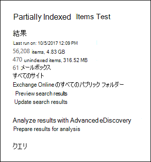

# <a name="investigating-partially-indexed-items-in-ediscovery"></a>電子情報開示での部分的にインデックスが作成されたアイテムの調査

Microsoft 365 コンプライアンスセンターから実行する電子情報開示検索では、検索を実行すると、予想される検索結果に、部分的にインデックスが作成されたアイテムが自動的に含まれます。 部分的にインデックスが作成されたアイテムは、何らかの理由で検索用に完全にインデックス付けされていなかった SharePoint および OneDrive for business サイトの Exchange メールボックスアイテムとドキュメントです。 ほとんどの電子メールメッセージとサイトドキュメントは、 [電子メールメッセージのインデックス付けの制限](limits-for-content-search.md#indexing-limits-for-email-messages)の範囲内にあるため、正常にインデックス付けされます。 ただし、アイテムによっては、これらのインデックスの制限を超えている場合があり、部分的にインデックスが作成されます。 アイテムを検索用にインデックス処理できず、電子情報開示検索を実行するときに、部分的にインデックスが作成されたアイテムとして返されるその他の理由を次に示します。
  
- 電子メールメッセージには、有効なハンドラー (画像ファイルなど) のない添付ファイルがあります。これは、部分的にインデックスが作成された電子メールアイテムの最も一般的な原因です。

- 電子メールメッセージに添付されたファイルの数が多すぎます。

- 電子メールメッセージに添付されたファイルが大きすぎます。

- この種のファイルのインデックス付けはサポートされているが、特定のファイルでインデックス付けエラーが発生した。

多くの組織では変化はありませんが、大部分の組織では、ボリュームごとにコンテンツの数が1% 未満で、部分的なインデックスが作成されたサイズによるコンテンツの12% 未満です。 ボリュームとサイズの違いがあるのは、コンテンツを完全にインデックス処理できない可能性が高いファイルの方が大きいためです。
  
## <a name="why-does-the-partially-indexed-item-count-change-for-a-search"></a>検索によって、部分的にインデックス付けされたアイテム数が変化するのはなぜですか?

電子情報開示検索を実行すると、検索された場所に含まれる部分的にインデックスが作成されたアイテムの合計数とサイズが、検索結果の詳細な統計情報に表示されます。 メモこれらは、検索統計ではインデックスのない  *アイテム*  と呼ばれます。 検索結果で返される、部分的にインデックスが作成されたアイテムの数に影響を与えるいくつかの点を以下に示します。
  
- アイテムが部分的にインデックス処理され、検索クエリと一致する場合は、検索結果アイテムの数 (およびサイズ) と、部分的にインデックスが作成されたアイテムの両方に含まれます。 ただし、同じ検索結果がエクスポートされると、アイテムは一連の検索結果にのみ含まれます。部分的にインデックスが作成されたアイテムとして含まれていません。

- 検索クエリに日付範囲を指定した場合 (キーワードクエリに含めるか、条件を使用して)、その日付範囲に一致しない部分的なインデックスアイテムは、部分的にインデックスが作成されたアイテムのカウントに含まれません。 インデックスが作成されたアイテムの数には、日付範囲内にある、部分的にインデックスが作成されたアイテムのみが含まれます。

  > [!NOTE]
  > SharePoint および OneDrive サイトにある、部分的にインデックスが作成されたアイテムは、検索の詳細な統計情報に表示される、部分的にインデックスが作成されたアイテムの推定に含まれて *いません* 。 ただし、電子情報開示検索の結果をエクスポートする場合は、部分的にインデックスが作成されたアイテムをエクスポートすることができます。 たとえば、サイトのみを検索する場合は、推定数が部分的にインデックス付けされたアイテムは0になります。
  
## <a name="calculating-the-ratio-of-partially-indexed-items-in-your-organization"></a>組織内の部分的にインデックスが作成されたアイテムの比率を計算する

部分的にインデックスが作成されたアイテムに対する組織の影響を理解するには、すべてのメールボックス内のすべてのコンテンツについて検索を実行します (空白のキーワードクエリを使用)。 次の例では、56208 (4830 MB) の完全にインデックスが作成されたアイテムと、470 (316 MB) の一部のインデックスアイテムがあります。
  

  
次の計算を使用して、部分的にインデックスが作成されたアイテムのパーセンテージを調べることができます。
  
 **組織内で部分的にインデックスが作成されたアイテムの比率を計算するには、次のようにします。**

`(Total number of partially indexed items/Total number of items) x 100`

`(470/56,208) x 100 = 0.84%`

前の例からの検索結果を使用して、すべてのメールボックスアイテムの84% が部分的にインデックス処理されます。
  
 **組織内で部分的にインデックス付けされたアイテムのサイズの割合を計算するには、次のようにします。**

`(Size of all partially indexed items/Size of all items) x 100`

`(316 MB/4830 MB) x 100 = 6.54%`

そのため、前の例では、メールボックスアイテムの合計サイズの6.54% が、部分的にインデックス付けされたアイテムからのものです。 前述したように、ほとんどの組織のお客様は、ボリュームごとのコンテンツの数が1% 未満で、部分的にインデックスが作成されているサイズによるコンテンツの12% 未満になっています。

## <a name="working-with-partially-indexed-items"></a>部分的にインデックスが作成されたアイテムを処理する

部分的なアイテムを調べて、関連する情報が含まれていないことを検証する必要がある場合は、部分的にインデックスが作成されたアイテムに関する情報を含む [コンテンツ検索レポートをエクスポート](export-a-content-search-report.md) できます。 コンテンツ検索レポートをエクスポートする場合は、部分的にインデックスが作成されたアイテムを含むエクスポートオプションのいずれかを選択するようにしてください。
  

  
これらのオプションのいずれかを使用して電子情報開示の検索結果または検索レポートをエクスポートすると、インデックスが作成されていない Items.csv という名前のレポートがエクスポートに含まれます。 このレポートには、ResultsLog.csv ファイルと同じ情報が含まれています。ただし、インデックスが作成されていない Items.csv ファイルには、部分的にインデックスが作成されたアイテムに関連する **エラータグ** と **エラープロパティ** の2つのフィールドもあります。 これらのフィールドには、インデックスが設定された各アイテムのインデックス作成エラーに関する情報が含まれています。 これら2つのフィールドの情報を使用すると、特定のインデックス作成エラーが調査に影響を与えるかどうかを判断するのに役立ちます。 その場合は、対象となる検索を実行し、特定の電子メールメッセージと SharePoint または OneDrive ドキュメントを取得およびエクスポートして、調査に関連しているかどうかを確認できるようにします。 詳細な手順については、「 [Office 365 で対象となる検索用の CSV ファイルを準備する](csv-file-for-an-id-list-content-search.md)」を参照してください。

> [!NOTE]
> インデックスのない Items.csv ファイルには、 **エラーの種類** と **エラーメッセージ** という名前のフィールドも含まれています。 これらは、 **エラータグ** と **エラーのプロパティ** フィールドの情報に似た情報を含む従来のフィールドですが、詳細な情報は含まれていません。 これらの従来のフィールドは無視しても問題ありません。
  
## <a name="errors-related-to-partially-indexed-items"></a>部分的にインデックスが作成されたアイテムに関連するエラー

エラータグは、エラーとファイルの種類の2つの情報で構成されています。 たとえば、このエラー/ファイルの種類のペアの場合は、次のようになります。

```text
 parseroutputsize_xls
```

 `parseroutputsize` は error で、 `xls` エラーが発生したファイルの種類です。 ファイルの種類が認識されなかった場合、またはファイルの種類がエラーに該当しない場合は、 `noformat` ファイルの種類の代わりに値が表示されます。
  
次に、インデックス作成エラーの一覧と、エラーの考えられる原因についての説明を示します。
  
| エラータグ | 説明 |
|:-----|:-----|
| `attachmentcount` <br/> |電子メールメッセージの添付ファイルが多すぎたため、これらの添付ファイルの一部は処理されませんでした。  <br/> |
| `attachmentdepth` <br/> |コンテンツ取得とドキュメントパーサーで、他の添付ファイル内にネストされた添付ファイルのレベルが多すぎます。 これらの添付ファイルの一部は処理されませんでした。  <br/> |
| `attachmentrms` <br/> |添付ファイルは RMS で保護されていたため、デコードに失敗しました。  <br/> |
| `attachmentsize` <br/> |電子メールメッセージに添付されたファイルが大きすぎて処理できませんでした。  <br/> |
| `indexingtruncated` <br/> |処理された電子メールメッセージをインデックスに書き込むときに、インデックス可能なプロパティのいずれかが大きすぎたため、切り捨てられました。 切り捨てられたプロパティは、[Error Properties] フィールドに表示されます。  <br/> |
| `invalidunicode` <br/> |有効な Unicode として処理できなかったテキストが電子メールメッセージに含まれています。 このアイテムのインデックス処理が完了していない可能性があります。  <br/> |
| `parserencrypted` <br/> |添付ファイルまたは電子メールメッセージの内容は暗号化されており、Microsoft 365 はコンテンツをデコードできませんでした。  <br/> |
| `parsererror` <br/> |解析中に不明なエラーが発生しました。 これは通常、ソフトウェアバグまたはサービスのクラッシュによって生じます。  <br/> |
| `parserinputsize` <br/> |添付ファイルが大きすぎてパーサーで処理できなかったため、添付ファイルの解析が行われなかったか、完了しませんでした。  <br/> |
| `parsermalformed` <br/> |添付ファイルの形式が正しくないため、パーサーで処理できませんでした。 この結果は、古いファイル形式、互換性のないソフトウェアによって作成されたファイル、または要求された以外のものを装ったウイルスが原因である可能性があります。  <br/> |
| `parseroutputsize` <br/> |添付ファイルの解析からの出力が大きすぎたため、切り捨てる必要がありました。  <br/> |
| `parserunknowntype` <br/> |添付ファイルのファイルの種類が Microsoft 365 で検出できませんでした。  <br/> |
| `parserunsupportedtype` <br/> |添付ファイルの種類が Office 365 によって検出されましたが、そのファイルの種類を解析することはできません。  <br/> |
| `propertytoobig` <br/> |Exchange ストアの電子メールプロパティの値が大きすぎて取得できなかったため、メッセージを処理できませんでした。 これは通常、電子メールメッセージの body プロパティにのみ発生します。  <br/> |
| `retrieverrms` <br/> |コンテンツ取得元は、RMS で保護されたメッセージのデコードに失敗しました。  <br/> |
| `wordbreakertruncated` <br/> |ドキュメントでインデックス処理中に識別された単語の数が多すぎます。 制限値に達したときにプロパティの処理が停止され、プロパティが切り捨てられます。  <br/> |

エラーフィールドは、Error Tags フィールドにリストされている処理エラーの影響を受けるフィールドを示します。 やなどのプロパティを検索する場合  `subject`  `participants` 、メッセージ本文のエラーは検索結果に影響しません。 これは、さらに調査する必要がある、部分的にインデックスが作成されたアイテムを正確に判断する場合に役立ちます。
  
## <a name="using-a-powershell-script-to-determine-your-organizations-exposure-to-partially-indexed-email-items"></a>PowerShell スクリプトを使用して、部分的にインデックスが作成された電子メールアイテムに対する組織の公開を決定する

次の手順では、すべての Exchange メールボックス内のすべてのアイテムを検索する PowerShell スクリプトを実行し、組織の部分的にインデックスが作成された電子メールアイテムの比率 (カウントとサイズ順) についてのレポートを生成し、発生した各インデックスエラーのアイテム数 (およびそのファイルの種類) を表示します。 前のセクションのエラータグの説明を使用して、インデックス作成エラーを特定します。
  
1. ファイル名サフィックス. ps1 を使用して、次のテキストを Windows PowerShell スクリプトファイルに保存します。たとえば、のように `PartiallyIndexedItems.ps1` なります。

   ```powershell
     write-host "**************************************************"
     write-host "     Security & Compliance Center      " -foregroundColor yellow -backgroundcolor darkgreen
     write-host "   eDiscovery Partially Indexed Item Statistics   " -foregroundColor yellow -backgroundcolor darkgreen
     write-host "**************************************************"
     " " 
     # Create a search with Error Tags Refinders enabled
     Remove-ComplianceSearch "RefinerTest" -Confirm:$false -ErrorAction 'SilentlyContinue'
     New-ComplianceSearch -Name "RefinerTest" -ContentMatchQuery "size>0" -RefinerNames ErrorTags -ExchangeLocation ALL
     Start-ComplianceSearch "RefinerTest"
     # Loop while search is in progress
     do{
         Write-host "Waiting for search to complete..."
         Start-Sleep -s 5
         $complianceSearch = Get-ComplianceSearch "RefinerTest"
     }while ($complianceSearch.Status -ne 'Completed')
     $refiners = $complianceSearch.Refiners | ConvertFrom-Json
     $errorTagProperties = $refiners.Entries | Get-Member -MemberType NoteProperty
     $partiallyIndexedRatio = $complianceSearch.UnindexedItems / $complianceSearch.Items
     $partiallyIndexedSizeRatio = $complianceSearch.UnindexedSize / $complianceSearch.Size
     " "
     "===== Partially indexed items ====="
     "         Total          Ratio"
     "Count    {0:N0}{1:P2}" -f $complianceSearch.Items.ToString("N0").PadRight(15, " "), $partiallyIndexedRatio
     "Size(GB) {0:N2}{1:P2}" -f ($complianceSearch.Size / 1GB).ToString("N2").PadRight(15, " "), $partiallyIndexedSizeRatio
     " "
     Write-Host ===== Reasons for partially indexed items =====
     foreach($errorTagProperty in $errorTagProperties)
     {
         $name = $refiners.Entries.($errorTagProperty.Name).Name
         $count = $refiners.Entries.($errorTagProperty.Name).TotalCount
         $frag = $name.Split("{_}")
         $errorTag = $frag[0]
         $fileType = $frag[1]
         if ($errorTag -ne $lastErrorTag)
         {
             $errorTag
         }
         "    " + $fileType + " => " + $count
         $lastErrorTag = $errorTag
     }
   ```

2. [セキュリティ/コンプライアンス センター PowerShell に接続します](https://go.microsoft.com/fwlink/p/?linkid=627084)。

3. [セキュリティ & コンプライアンスセンター] PowerShell で、手順1でスクリプトを保存したフォルダーに移動し、スクリプトを実行します。例えば：

   ```powershell
   .\PartiallyIndexedItems.ps1
   ```

このスクリプトによって返される出力の例を次に示します。
  


> [!NOTE]
> 次の点に注意してください。
>  
> - 電子メールアイテムの合計数とサイズ、および部分的にインデックスが作成された電子メールアイテムの組織の比率 (カウントとサイズ順)。
> 
> - エラーが発生したエラータグと対応するファイルの種類を一覧表示します。
  
## <a name="see-also"></a>関連項目

[電子情報開示で部分的にインデックス付けされたアイテム](partially-indexed-items-in-content-search.md)
