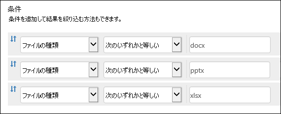
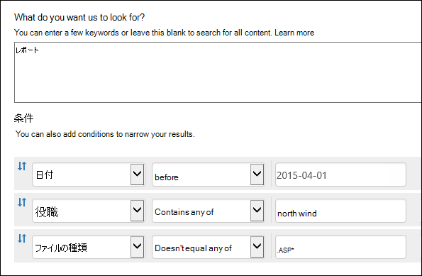

# <a name="keyword-queries-and-search-conditions-for-content-search"></a>コンテンツ検索のキーワード クエリと検索条件

このトピックでは、コンプライアンス センターのコンテンツ検索機能を使って、ExchangeOnline のメール アイテムおよび SharePoint と OneDrive for Business のサイトに保存されているドキュメントで検索できるメールとドキュメントのプロパティについて説明します。 また、セキュリティ/コンプライアンス センター PowerShell の **\*-ComplianceSearch** コマンドレットを使用してこれらのプロパティを検索することもできます。 このトピックでは以下についても説明します。   
  
- ブール検索演算子、検索条件、およびその他の検索クエリ技法を使用して、検索結果を絞り込む。
    
- SharePoint および OneDrive for Business で機密情報の種類およびカスタムの機密情報の種類を検索する。
    
- 組織外のユーザーと共有されているサイトのコンテンツを検索する
    
コンテンツ検索を作成するための詳しい手順については、「[Office 365 のコンテンツ検索](content-search.md)」を参照してください。

  
> [!NOTE]
> セキュリティ/コンプライアンスセンターのコンテンツ検索およびそれに対応するセキュリティ/コンプライアンスセンター PowerShell の **\*-ComplianceSearch** コマンドレットでは、キーワード クエリ言語 (KQL) が使用されます。 詳細については、「[キーワード クエリ言語 (KQL) 構文のリファレンス](https://go.microsoft.com/fwlink/?LinkId=269603)」を参照してください。 
  
## <a name="searchable-email-properties"></a>検索可能なメール プロパティ

次の表には、セキュリティ/コンプライアンス センター のコンテンツ検索機能か、**New-ComplianceSearch** または **Set-ComplianceSearch** コマンドレットを使って検索できる、メール メッセージのプロパティが一覧表示されています。 表には、各プロパティの  _property:value_ 構文の例、およびその例で返される検索結果の説明が含まれています。 コンテンツ検索のキーワード ボックスに、これらの  `property:value` ペアを入力できます。 

> [!NOTE]
> メール プロパティを検索するときは、指定されたプロパティが空のアイテムを検索することはできません。 たとえば、件名が空のメール メッセージを検索するときに**subject:""** という*プロパティと値*の組み合わせを使用した場合、結果は返されません。 これは、サイトと連絡先のプロパティの検索時にも当てはまります。
  
|**プロパティ**|**プロパティの説明**|**例**|**例で返される検索結果**|
|:-----|:-----|:-----|:-----|
|AttachmentNames|メール メッセージに添付されているファイルの名前。|`attachmentnames:annualreport.ppt`  <br/> `attachmentnames:annual*` <br/> attachmentnames:.pptx|annualreport.ppt という名前の添付ファイルのあるメッセージ。 2 番目の例では、ワイルドカードを使用して、添付ファイルのファイル名に「annual」の語が含まれるメッセージを返します。 3　番目の例は、ファイルの拡張子が pptx のすべての添付ファイルを返します。|
|Bcc|メール メッセージの Bcc フィールド。<sup>1</sup>|`bcc:pilarp@contoso.com`  <br/> `bcc:pilarp`  <br/> `bcc:"Pilar Pinilla"`|どの例も Bcc フィールドに「Pilar Pinilla」が含まれているメッセージを返します。|
|カテゴリ| 検索するカテゴリ。 カテゴリは、ユーザーが Outlook または Outlook on the web (旧称: Outlook Web App) を使用して定義できます。 値は次のいずれかです。  <br/><br/>  青  <br/>  green  <br/>  orange  <br/>  purple  <br/>  red  <br/>  yellow|`category:"Red Category"`|元のメールボックスで「red」のカテゴリが割り当てられているメッセージ。|
|Cc|メール メッセージの Cc フィールド。<sup>1</sup>|`cc:pilarp@contoso.com`  <br/> `cc:"Pilar Pinilla"`|どちらの例も、Cc フィールドに "Pilar Pinilla" が指定されたメッセージ。|
|Folderid|特定のメールボックス フォルダーのフォルダー ID (GUID)。 このプロパティを使う場合は、必ず指定したフォルダーが存在するメールボックスを検索するようにします。 指定したフォルダーのみが検索されます。 フォルダー内のサブフォルダーは検索されません。 サブフォルダーを検索するには、検索するサブフォルダーの Folderid プロパティを使う必要があります。  <br/> Folderid プロパティを検索する方法と、スクリプトを使用して特定のメールボックスのフォルダー Id を取得する方法の詳細については、「[対象コレクションのコンテンツ検索を使用](use-content-search-for-targeted-collections.md)する」を参照してください。|`folderid:4D6DD7F943C29041A65787E30F02AD1F00000000013A0000`  <br/> `folderid:2370FB455F82FC44BE31397F47B632A70000000001160000 AND participants:garthf@contoso.com`|最初の例では、指定したメールボックス フォルダー内のすべてのアイテムが返されます。 2 番目の例では、指定したメールボックス フォルダー内で garthf@contoso.com によって送信または受信されたすべてのアイテムが返されます。|
|送信元|メール メッセージの送信者。<sup>1</sup>|`from:pilarp@contoso.com`  <br/> `from:contoso.com`|指定されたユーザーによって送信された、または指定されたドメインから送信されたメッセージ。|
|HasAttachment|メッセージに添付ファイルがあるかどうかを示します。 値 **true** または **false** を使用します。|`from:pilar@contoso.com AND hasattachment:true`|指定したユーザーによって送信された添付ファイルを含むメッセージ。|
|Importance|送信者がメッセージを送信するときに指定できる電子メール メッセージの重要度。既定では、送信者が重要度を **high** または **low** に設定していない限り、メッセージは普通の重要度で送信されます。|`importance:high`  <br/> `importance:medium`  <br/> `importance:low`|高重要度、中重要度、または低重要度とマークされているメッセージ。|
|IsRead|メッセージが既読か未読かを示します。 値 **true** または **false** を使用します。|`isread:true`  <br/> `isread:false`|最初の例では、IsRead プロパティを **True** に設定されているメッセージが返されます。 2 番目の例では、IsRead プロパティが **False** に設定されているメッセージが返されます。|
|ItemClass|このプロパティは、組織が Office 365 にインポートした特定のサード パーティのデータ型を検索するときに使います。 このプロパティでは、次の構文を使います:  `itemclass:ipm.externaldata.<third-party data type>*`|`itemclass:ipm.externaldata.Facebook* AND subject:contoso`  <br/> `itemclass:ipm.externaldata.Twitter* AND from:"Ann Beebe" AND "Northwind Traders"`|最初の例では、Subject プロパティに "contoso" という単語が含まれる Facebook アイテムが返されます。 2 番目の例では、Ann Beebe によって投稿された、"Northwind Traders" というキーワード語句を含む Twitter アイテムが返されます。  <br/> ItemClass プロパティのサード パーティのデータの種類に使う値の完全な一覧については、「[コンテンツ検索を使用して Office 365 にインポートされたサード パーティのデータを検索する](use-content-search-to-search-third-party-data-that-was-imported.md)」をご覧ください。|
|Kind| 検索するメール メッセージの種類。 可能な値:  <br/>  contacts  <br/>  docs  <br/>  email  <br/>  externaldata  <br/>  faxes  <br/>  im  <br/>  journals  <br/>  meetings  <br/>  microsoftteams (Microsoft Teams のチャット、会議、通話のアイテムが返されます)  <br/>  notes  <br/>  posts  <br/>  rssfeeds  <br/>  tasks  <br/>  voicemail|`kind:email`  <br/> `kind:email OR kind:im OR kind:voicemail`  <br/> `kind:externaldata`|最初の例では、検索条件に一致するメール メッセージが返されます。 2 番目の例では、検索条件に一致するメール メッセージ、インスタント メッセージ、会話 (Skype for Business の会話と Microsoft Teams のチャットを含みます) ボイス メッセージが返されます。 3番目の例では、検索条件を満たす Twitter、Facebook、Cisco Jabber などのサードパーティのデータソースから、Microsoft 365 のメールボックスにインポートされたアイテムを返します。 詳細については、「[Office 365 でサードパーティのデータをアーカイブする](https://go.microsoft.com/fwlink/p/?linkid=716918)」を参照してください。|
|Participants|メール メッセージのすべての送受信者フィールド。 すなわち、[差出人]、[宛先]、[Cc]、[Bcc] の各フィールドです。<sup>1</sup>|`participants:garthf@contoso.com`  <br/> `participants:contoso.com`|garthf@contoso.com が送信元または送信先のメッセージ。2 番目の例は、contoso.com ドメイン内のユーザーが送信元または送信先のすべてのメッセージを返します。|
|Received|電子メール メッセージが受信者によって受信された日付。|`received:04/15/2016`  <br/> `received>=01/01/2016 AND received<=03/31/2016`|2016 年 4 月 15 日に受信したメッセージ。 2 番目の例は、2016 年 1 月 1 日から 2016 年 3 月 31 日までの間に受信したすべてのメッセージを返します。|
|Recipients|メール メッセージのすべての受信者フィールド。 すなわち、[宛先]、[Cc]、[Bcc] の各フィールドです。<sup>1</sup>|`recipients:garthf@contoso.com`  <br/> `recipients:contoso.com`|garthf@contoso.com に送信されたメッセージ。2 番目の例では、contoso.com ドメイン内のすべての受信者に送信されたメッセージを返します。|
|Sent|送信者によって電子メール メッセージが送信された日付。|`sent:07/01/2016`  <br/> `sent>=06/01/2016 AND sent<=07/01/2016`|指定された日付に送信された、または指定された日付範囲内に送信されたメッセージ。|
|Size|アイテムのサイズ (バイト数)。|`size>26214400`  <br/> `size:1..1048567`|25 MB を超えるメッセージ。 2 番目の例では、1 ～ 1,048,567 バイト (1 MB) のサイズのメッセージが返されます。|
|Subject|電子メール メッセージの件名行に含まれるテキスト。  <br/> **注:** クエリで Subject プロパティを使用すると、検索するテキストが件名に含まれているすべてのメッセージが返されます。 つまり、完全一致のメッセージのみがクエリで返されるわけではありません。 たとえば、 `subject:"Quarterly Financials"` を検索した場合の結果には、件名が "Quarterly Financials 2018" のメッセージが含まれることになります。|`subject:"Quarterly Financials"`  <br/> `subject:northwind`|件名行のテキストのいずれかの箇所に "Quarterly Financials" を含むメッセージ。 2 番目の例では、件名行に「northwind」の語が含まれているすべてのメッセージを返します。|
|To|メール メッセージの To フィールド。<sup>1</sup>|`to:annb@contoso.com`  <br/> `to:annb ` <br/> `to:"Ann Beebe"`|いずれの例も、To: 行に "Ann Beebe" が指定されているメッセージを返します。|
|||||
   
> [!NOTE]
> <sup>1</sup> recipient プロパティの値には、メール アドレス (*ユーザー プリンシパル名*または UPN とも呼ばれます)、表示名、またはエイリアスを使用してユーザーを指定できます。 たとえば、ユーザー Ann Beebe を指定するために、annb@contoso.com、annb、または "Ann Beebe" を使用できます。<br/><br/>受信者のプロパティ (From、To、Cc、Bcc、参加者、および受信者) を検索すると、Microsoft 365 は Azure Active Directory でそのユーザーを検索して、各ユーザーの id を拡張しようとします。  ユーザーが Azure Active Directory で見つかった場合はクエリが拡張され、そのユーザーのメール アドレス (または UPN)、エイリアス、表示名、LegacyExchangeDN が含まれるようになります。<br/><br/>たとえば、`participants:ronnie@contoso.com` などのクエリは、`participants:ronnie@contoso.com OR participants:ronnie OR participants:"Ronald Nelson" OR participants:"<LegacyExchangeDN>"` に拡張されます。<br/><br/>受信者の拡張を防ぐには、検索クエリでメール アドレスの末尾にワイルドカード文字 (アスタリスク) を追加することができます。例: `participants:ronnie@contoso.com*`

## <a name="searchable-site-properties"></a>検索可能なサイト プロパティ

次の表には、セキュリティ/コンプライアンス センター のコンテンツ検索機能か、**New-ComplianceSearch** または **Set-ComplianceSearch** コマンドレットを使って検索できる、SharePoint および OneDrive for Business のプロパティの一部が一覧表示されています。 表には、各プロパティの  _property:value_ 構文の例、およびその例で返される検索結果の説明が含まれています。 
  
検索可能な SharePoint プロパティの完全な一覧については、「[クロールされたプロパティと管理プロパティの概要](https://go.microsoft.com/fwlink/p/?LinkId=331599)」を参照してください。 [**クエリ可能**] 列で **[はい]** と示されているプロパティが検索可能です。 
  
|**プロパティ**|**プロパティの説明**|**例**|**例によって返される検索結果**|
|:-----|:-----|:-----|:-----|
|Author|Office ドキュメントの作成者フィールド。ドキュメントがコピーされた場合でもこのフィールは保持されます。 たとえば、ユーザーがドキュメントを作成して別のユーザーにメールで送信し、そのユーザーがそのドキュメントを SharePoint にアップロードした場合、そのドキュメントでは引き続き元の作成者が保持されます。 このプロパティには、必ずユーザーの表示名を使用してください。|`author:"Garth Fort"`|Garth Fort によって作成されたすべてのドキュメント。|
|ContentType|Item、Document、Video など、アイテムの SharePoint コンテンツ タイプ。|`contenttype:document`|すべてのドキュメントが返されます。|
|Created|アイテムが作成された日付。|`created\>=06/01/2016`|2016 年 6 月 1 日以降に作成されたすべてのアイテム。|
|CreatedBy|アイテムを作成またはアップロードした人。 このプロパティには、必ずユーザーの表示名を使用してください。|`createdby:"Garth Fort"`|Garth Fort によって作成またはアップロードされたすべてのアイテム。|
|DetectedLanguage|アイテムの言語。|`detectedlanguage:english`|すべての英語のアイテム。|
|DocumentLink|SharePoint または OneDrive for Business サイトの特定のフォルダーのパス (URL)。 このプロパティを使う場合は、必ず指定したフォルダーが存在するサイトを検索するようにします。  <br/> DocumentLink プロパティに対して指定したフォルダーのサブフォルダーに存在するアイテムを取得するには、指定するフォルダーの URL に /\* を追加する必要があります。例: `documentlink: "https://contoso.sharepoint.com/Shared Documents/*"`  <br/> <br/>Documentlink プロパティを検索し、スクリプトを使用して特定のサイト上のフォルダーの documentlink Url を取得する方法の詳細については、「[対象コレクションのコンテンツ検索を使用](use-content-search-for-targeted-collections.md)する」を参照してください。|`documentlink:"https://contoso-my.sharepoint.com/personal/garthf_contoso_com/Documents/Private"`  <br/> `documentlink:"https://contoso-my.sharepoint.com/personal/garthf_contoso_com/Documents/Shared with Everyone/*" AND filename:confidential`|最初の例では、指定した OneDrive for Business フォルダー内のすべてのアイテムが返されます。 2 番目の例では、指定したサイト フォルダー (およびすべてのサブフォルダー) に存在するドキュメントで、ファイル名に "confidential" という単語が含まれるものが返されます。|
|FileExtension|ファイルの拡張子。例: docx、one、pptx、xlsx など。|`fileextension:xlsx`|すべての Excel ファイル (Excel 2007 以降)|
|FileName|ファイルの名前。|`filename:"marketing plan"`  <br/> `filename:estimate`|最初の例では、タイトルに "marketing plan" と完全一致する語句が含まれるファイルが返されます。2 番目の例では、ファイル名に "estimate" という単語を含むファイルが返されます。|
|LastModifiedTime|アイテムが最後に変更された日付。|`lastmodifiedtime>=05/01/2016`  <br/> `lastmodifiedtime>=05/10/2016 AND lastmodifiedtime<=06/1/2016`|最初の例では、2016 年 5 月 1 日以降に変更されたアイテムが返されます。 2 番目の例では、2016 年 5 月 1 日～ 2016 年 6 月 1 日に変更されたアイテムが返されます。|
|ModifiedBy|アイテムを最後に変更した人。 このプロパティには、必ずユーザーの表示名を使用してください。|`modifiedby:"Garth Fort"`|Garth Fort によって最後に変更されたすべてのアイテム。|
|Path|SharePoint または OneDrive for Business サイトの特定のサイトのパス (URL)。  <br/> Path プロパティに対して指定したサイトのフォルダーに存在するアイテムを取得するには、指定するフォルダーの URL に /\* を追加する必要があります。例: `path: "https://contoso.sharepoint.com/Shared Documents/*"`  <br/> <br/> **注**: `Path` プロパティを使用して OneDrive の場所を検索すると、メディア ファイル (.png、.tiff、.wav ファイルなど) は検索結果に返されません。 OneDrive フォルダー内のメディア ファイルを検索するには、検索クエリで別のサイト プロパティを使用します。 <br/>|`path:"https://contoso-my.sharepoint.com/personal/garthf_contoso_com/"`  <br/> `path:"https://contoso-my.sharepoint.com/personal/garthf_contoso_com/*" AND filename:confidential`|最初の例では、指定した OneDrive for Business サイト内のすべてのアイテムが返されます。 2 番目の例では、指定したサイト フォルダー (およびサイト内のフォルダー) に存在するドキュメントで、ファイル名に "confidential" という単語が含まれるものが返されます。|
|SharedWithUsersOWSUser|指定したユーザーと共有されているドキュメントで、そのユーザーの OneDrive for Business サイトの [**自分と共有**] ページに表示されるドキュメント。 これらは、組織内の他のユーザーによって指定したユーザーと明示的に共有されているドキュメントです。 SharedWithUsersOWSUser プロパティを使う検索クエリと一致するドキュメントをエクスポートすると、ドキュメントは、指定したユーザーとドキュメントを共有しているユーザーの元のコンテンツの場所からエクスポートされます。 詳細については、「[組織内で共有されているサイト コンテンツの検索](#searching-for-site-content-shared-within-your-organization)」を参照してください。|`sharedwithusersowsuser:garthf`  <br/> `sharedwithusersowsuser:"garthf@contoso.com"`|どちらの例でも、Garth Fort と明示的に共有されていて、Garth Fort の OneDrive for Business アカウントの [**自分と共有**] ページに表示されるすべての内部ドキュメントが返されます。|
|Site|組織内のサイトかサイトのグループの URL。|`site:"https://contoso-my.sharepoint.com"`  <br/> `site:"https://contoso.sharepoint.com/sites/teams"`|最初の例では、組織内のすべてのユーザー向けの OneDrive for Business のサイトからアイテムが返されます。 2 番目の例では、すべてのチーム サイトからアイテムが返されます。|
|Size|アイテムのサイズ (バイト数)。|`size>=1`  <br/> `size:1..10000`|最初の例では、1 バイトより大きいアイテムが返されます。2 番目の例では、1 ～ 10,000 バイトのサイズのメッセージが返されます。|
|Title|ドキュメントのタイトル。 Title プロパティは、Microsoft Office ドキュメントに 指定されているメタデータです。 ドキュメントのファイル名とは異なります。|`title:"communication plan"`|Office ドキュメントの Title メタデータ プロパティに "communication plan" という語句が含まれるすべてのドキュメント。|
|||||
   
## <a name="searchable-contact-properties"></a>検索可能な連絡先プロパティ

次の表では、インデックスが設定されていてコンテンツ検索を使って検索できる連絡先のプロパティを示します。 これらは、ユーザーのメールボックスの個人用アドレス帳内にある連絡先 (個人の連絡先とも呼ばれます) に対してユーザーが構成できるプロパティです。 連絡先を検索するには、検索対象のメールボックスを選び、キーワード クエリで 1 つまたは複数の連絡先プロパティを使います。
  
> [!TIP]
> スペースまたは特殊文字を含む値を検索するには、二重引用符 ("  ") で語句を囲みます。例: `businessaddress:"123 Main Street"` 
  
|**プロパティ**|**プロパティの説明**|
|:-----|:-----|
|BusinessAddress|**会社住所**プロパティの住所。 このプロパティは連絡先のプロパティ ページでは**勤務先**住所とも呼ばれます。|
|BusinessPhone|
            **勤務先電話**番号プロパティの電話番号。|
|CompanyName|
            **会社**プロパティの名前。|
|Department|
            **部門**プロパティの名前。|
|DisplayName|連絡先の表示名。 これは、連絡先の**氏名**プロパティの名前です。|
|EmailAddress|連絡先のメール アドレス プロパティのアドレス。 1 つの連絡先に複数のメール アドレスを追加できます。 このプロパティを使うと、連絡先のメール アドレスのいずれかに一致する連絡先が返されます。|
|FileAs|**表題**プロパティ。 このプロパティは、ユーザーの連絡先一覧での連絡先の表示方法を指定するために使います。 たとえば、 *FirstName,LastName*  または  *LastName,FirstName* と連絡先を表示できます。|
|GivenName|
            **名**プロパティの名前。|
|HomeAddress|いずれかの**自宅**住所プロパティの住所。|
|HomePhone|いずれかの**自宅**電話番号プロパティの電話番号。|
|IMAddress|IM アドレス プロパティ。通常は、インスタント メッセージングに使うメール アドレスです。|
|MiddleName|
            **ミドル** ネーム プロパティの名前。|
|MobilePhone|
            **携帯**電話番号プロパティの電話番号。|
|Nickname|
            **ニックネーム** プロパティの名前。|
|OfficeLocation|
            **オフィス** プロパティまたは**オフィスの場所**プロパティの値。|
|OtherAddress|
            **その他**住所プロパティの値。|
|Surname|
            **姓**プロパティの名前。|
|Title|**役職**プロパティの名前。|
|||||

## <a name="searchable-sensitive-data-types"></a>検索可能な機密情報の種類

セキュリティ/コンプライアンス センターのコンテンツ検索機能を使って、SharePoint と OneDrive for Business のサイト上のドキュメントに保存されているクレジット カード番号や社会保障番号などの機密性の高いデータを検索することができます。 これを行うには、 `SensitiveType` プロパティと機密情報の種類の名前をキーワード クエリで使います。 たとえば、クエリ  `SensitiveType:"Credit Card Number"` はクレジット カード番号を含むドキュメントを返します。 クエリ  `SensitiveType:"U.S. Social Security Number (SSN)"` は米国の社会保障番号を含むドキュメントを返します。 検索できる機密情報の種類の一覧は、セキュリティ/コンプライアンス センターの [**分類**] \> [**機密情報の種類**] で確認できます。 または、セキュリティ/コンプライアンス センター PowerShell で **Get-DlpSensitiveInformationType** コマンドレット使用する方法でも機密情報の種類の一覧を表示できます。 
  
また、 `SensitiveType` プロパティを使って、組織で自分 (または別の管理者) が作成したカスタムの機密情報の種類の名前を検索することもできます。 セキュリティ/コンプライアンス センターの [**機密情報の種類**] ページの [**発行元**] 列 (または PowerShell の **Publisher** プロパティ) を使って、組み込みの機密情報の種類とカスタムの機密情報の種類を区別できます。 詳細については、「[カスタムの機密情報の種類を作成する](create-a-custom-sensitive-information-type.md)」をご覧ください。
  
`SensitiveType` プロパティを使用したクエリの作成の詳細については、「[サイトに保存されている機密データを検索するクエリを作成する](form-a-query-to-find-sensitive-data-stored-on-sites.md)」を参照してください。

> [!NOTE]
> 機密性の高いデータ型と `SensitiveType` 検索プロパティは、Exchange Online メールボックスに保管されている気密性の高いデータの検索には使用できません。 ただし、データ損失防止 (DLP) ポリシーを使用して、転送中の機密性の高いメール データを保護できます。 詳細については、「[データ損失防止ポリシーの概要](data-loss-prevention-policies.md)」と「[個人データの検索](search-for-and-find-personal-data.md)」を参照してください。
  
## <a name="search-operators"></a>検索演算子

**AND**、**OR**、**NOT** などのブール演算子は、検索クエリで特定の語を含めたり除去したりすることにより、検索をより詳細に定義するために役立ちます。 プロパティ演算子 (\>= や .. など)、引用符、かっこ、ワイルドカードを使用するといった他の技法も、検索クエリを調整するのに役立ちます。 検索結果を絞り込んだり、その範囲を広げたりするために使用できる演算子を次の表に示します。 
  
|**演算子**|**使用法**|**説明**|
|:-----|:-----|:-----|
|AND|keyword1 AND keyword2|指定されたすべてのキーワードまたは  `property:value` 式が含まれる項目を返します。 たとえば、 `from:"Ann Beebe" AND subject:northwind` は、Ann Beebe によって送信され、件名の行に "northwind" という単語が含まれるすべてのメッセージを返します。 <sup>2</sup>|
|+|keyword1 + keyword2 + keyword3|Returns items that contain  *either*  `keyword2` or  `keyword3` *and*  that also contain  `keyword1`. Therefore, this example is equivalent to the query  `(keyword2 OR keyword3) AND keyword1`.  <br/> クエリ `keyword1 + keyword2` ( **+** 記号の後にスペースがあります) は、**AND** 演算子を使用する場合と同じではありません。 This query would be equivalent to  `"keyword1 + keyword2"` and return items with the exact phase  `"keyword1 + keyword2"`.|
|OR|keyword1 OR keyword2|指定された 1 つ以上のキーワードや  `property:value` 式が含まれる項目を返します。 <sup>2</sup>|
|NOT|keyword1 NOT keyword2  <br/> NOT from:"Ann Beebe"  <br/> NOT kind:im|キーワードまたは  `property:value` 式で指定されたアイテムを除外します。 2 番目の例では、Ann Beebe によって送信されたメッセージを除外します。 3 番目の例では、[会話の履歴] メールボックス フォルダーに保存されている、Skype for Business の会話などのインスタント メッセージの会話をすべて除外します。 <sup>2</sup>|
|-|keyword1 -keyword2|
            **NOT** 演算子と同じです。 このクエリは、 `keyword1` が含まれている項目のうち、`keyword2` が含まれていない項目を返します。|
|NEAR|keyword1 NEAR(n) keyword2|互いに近くにある単語を含むアイテムを返します。n は、何単語離れているかを示します。 たとえば、 `best NEAR(5) worst` は、"best" の近くの 5 つの単語の中に "worst" という単語があるアイテムを返します。 数値が指定されていない場合、既定の間隔は 8 単語です。 <sup>2</sup>|
|ONEAR|keyword1 ONEAR(n) keyword2|**NEAR** と似ていますが、指定された順序で各単語が近くにある項目を返します。 たとえば、 `best ONEAR(5) worst` は、単語 "worst" の前に単語 "best" が出現し、かつそれらの単語の間隔が 5 単語内である項目を返します。 数値が指定されていない場合、既定の間隔は 8 単語です。 <sup>2</sup> <br/> **注**: メールボックスの検索では、**ONEAR** 演算子はサポートされていません。 この演算子は、SharePoint と OneDrive for Business サイトを検索する場合にのみ使用できます。 同じ検索でメールボックスとサイトを検索していて、クエリに **ONEAR** 演算子が含まれる場合は、**NEAR** 演算子を使った場合と同じメールボックス アイテムが返されます。 つまり、単語出現順序に関係なく、指定した語句が近くにあるアイテムが返されます。|
|:|property:value|`property:value` 構文内のコロン (:) は、検索するプロパティに含まれる値を指定します。 たとえば、 `recipients:garthf@contoso.com` は、garthf@contoso.com に送信されたすべてのメッセージを返します。|
|=|property=value|**:** 演算子と同じです。|
|\<|property\<value|検索対象のプロパティが指定の値より小さいことを意味します。<sup>1</sup>|
|\>|property\>value|検索対象のプロパティが指定の値より大きいことを意味します。<sup>1</sup>|
|\<=|property\<=value|検索対象のプロパティが特定の値以下であることを意味します。<sup>1</sup>|
|\>=|property\>=value|検索対象のプロパティが特定の値以上であることを意味します。<sup>1</sup>|
|..|property:value1..value2|検索対象のプロパティが value1 以上で value2 以下であることを意味します。<sup>1</sup>|
|"  "|"fair value"  <br/> subject:"Quarterly Financials"|二重引用符 ("  ") は、キーワードや  `property:value` 検索クエリで、完全一致する語句を検索するために使用します。|
|\*|cat\*  <br/> subject:set\*|前方一致ワイルドカード検索 (アスタリスクが語尾にある) は、キーワードや  `property:value` クエリで、0 個以上の文字に一致します。 たとえば、 `title:set*` は、ドキュメント タイトルに単語 set、setup、setting (および "set" で始まるその他の単語) が含まれているドキュメントを返します。  <br/><br/> **注:** 前方一致ワイルドカード検索 (たとえば **\*cat** や **set\***) だけが使用可能です。 後方一致検索 (**\*cat** )、インフィックス検索 (**c\*t**)、部分文字列検索 (**\*cat\***) はサポートされていません。|
|(  )|(fair OR free) AND from:contoso.com  <br/> (IPO OR initial) AND (stock OR shares)  <br/> (quarterly financials)|括弧は、ブール演算子の文字列、 `property:value` アイテム、およびキーワードをグループにまとめます。たとえば、  `(quarterly financials)` は quarterly および financials の語を含むアイテムを返します。  |
|||||
   
> [!NOTE]
> <sup>1</sup> この演算子は、日付や数値を含むプロパティに使用します。<br/> <sup>2</sup> ブール検索演算子は、大文字である必要があります (例: **AND**)。 小文字の演算子を使うと (**and** など)、検索クエリではキーワードとして扱われます。 
  
## <a name="search-conditions"></a>検索条件

検索クエリに条件を追加して、検索を絞り込み、さらに絞り込まれた結果のセットを返すようにできます。 各条件によって、作成された KQL 検索クエリに句が追加され、ユーザーが検索を開始するとそのクエリが実行されます。
  
[共通プロパティの条件](#conditions-for-common-properties)

[メール プロパティの条件](#conditions-for-mail-properties)

[ドキュメント プロパティの条件](#conditions-for-document-properties)

[条件で使用される演算子](#operators-used-with-conditions)

[条件を使用するためのガイドライン](#guidelines-for-using-conditions)

[検索クエリでの条件の使用例](#examples-of-using-conditions-in-search-queries)
  
### <a name="conditions-for-common-properties"></a>共通プロパティの条件 

同じ検索でメールボックスとサイトを検索する場合は、共通プロパティを使って条件を作成します。 次の表に、条件を追加する場合に使用可能なプロパティを一覧表示します。
  
|**条件**|**説明**|
|:-----|:-----|
|日付|メールの場合、受信者によってメッセージが受信された日付か、送信者によってメッセージが送信された日付。 ドキュメントの場合、ドキュメントが最後に変更された日付。|
|送信者/作成者|メールの場合、メッセージの送信者。 ドキュメントの場合、Office ドキュメントから作成者フィールドに示されている人。 カンマで区切って、複数の名前を入力することができます。 2 つ以上の値は、**OR** 演算子によって論理的に結合されます。|
|サイズ (バイト単位)|メールとドキュメントのいずれの場合も、アイテムのサイズ (バイト単位)。|
|件名/タイトル|メールの場合、メッセージの件名行のテキスト。 ドキュメントの場合、ドキュメントのタイトル。 前述したように、Title プロパティは Microsoft Office ドキュメントに指定されたメタデータです。 複数の件名とタイトルをコンマで区切って入力できます。 2 つ以上の値は、**OR** 演算子によって論理的に結合されます。|
|コンプライアンス ラベル|メールとドキュメントのどちらについても、保持ポリシーによってメッセージやドキュメントに自動的に割り当てられたラベル、またはユーザーが手動で割り当てた保持ラベル。 保持ラベルは、ラベルによって定義された設定に基づいて、情報ガバナンスおよび保持ルールのためにメールとドキュメントを分類するために使われます。 保持ラベル名の一部を入力してワイルドカードを使うことも、完全なラベル名を入力することもできます。 詳細については、「[保持ラベルの概要](labels.md)」を参照してください。|
|||
  
### <a name="conditions-for-mail-properties"></a>メール プロパティの条件

メールボックスまたはパブリック フォルダーを検索する場合は、メール プロパティを使用して条件を作成します。 条件で使用できるメール プロパティを次の表に一覧表示します。 これらのプロパティは、上で説明したメール プロパティのサブセットです。 利便性を考慮して、以下に説明をもう一度記載します。
  
|**条件**|**説明**|
|:-----|:-----|
|メッセージの種類| 検索するメッセージの種類。 これは、Kind メール プロパティと同じプロパティです。 可能な値:  <br/><br/>  contacts  <br/>  docs  <br/>  email  <br/>  externaldata  <br/>  faxes  <br/>  im  <br/>  journals  <br/>  meetings  <br/>  microsoftteams  <br/>  notes  <br/>  posts  <br/>  rssfeeds  <br/>  tasks  <br/>  voicemail|
|Participants|メール メッセージのすべての送受信者フィールド。 すなわち、[差出人]、[宛先]、[Cc]、[Bcc] の各フィールドです。|
|Type|メール アイテムのメッセージ クラス プロパティ。 これは、ItemClass メール プロパティと同じプロパティです。 また、複数値の条件です。 複数のメッセージ クラスを選ぶには、**Ctrl** キーを押したまま、ドロップダウン リストで条件に追加する複数のメッセージ クラスをクリックします。 リストで選んだ各メッセージ クラスは、対応する検索クエリでは **OR** 演算子によって論理的に接続されます。  <br/> Exchange によって使われていて **メッセージ クラス** リストで選ぶことができるメッセージ クラス (およびそれに対応するメッセージ クラス ID) のリストについては、「[アイテムの種類とメッセージ クラス](https://go.microsoft.com/fwlink/?linkid=848143)」をご覧ください。|
|受信済み|電子メール メッセージが受信者によって受信された日付。 これは、Received メール プロパティと同じプロパティです。|
|Recipients|メール メッセージのすべての受信者フィールド。 すなわち、[宛先]、[Cc]、[Bcc] の各フィールドです。|
|Sender|電子メール メッセージの差出人。|
|送信日時|送信者によって電子メール メッセージが送信された日付。 これは、Sent メール プロパティと同じプロパティです。|
|件名|電子メール メッセージの件名行に含まれるテキスト。|
|To|[宛先] フィールドにある、メール メッセージの受信者。|
|||
  
### <a name="conditions-for-document-properties"></a>ドキュメント プロパティの条件

SharePoint と OneDrive for Business sites サイトでドキュメントを検索する場合、ドキュメント プロパティを使用して条件を作成します。 次の表に、条件に使用できるドキュメント プロパティを示します。 これらのプロパティは、上で説明したサイト プロパティのサブセットです。 利便性を考慮して、以下に説明をもう一度記載します。
  
|**条件**|**説明**|
|:-----|:-----|
|Author|Office ドキュメントの作成者フィールド。ドキュメントがコピーされた場合でもこのフィールは保持されます。 たとえば、ユーザーがドキュメントを作成して別のユーザーにメールで送信し、そのユーザーがそのドキュメントを SharePoint にアップロードした場合、そのドキュメントでは引き続き元の作成者が保持されます。|
|Title|ドキュメントのタイトル。 Title プロパティは、Office ドキュメントに 指定されているメタデータです。 ドキュメントのファイル名とは異なります。|
|作成済み|ドキュメントが作成された日付。|
|最終更新日時|ドキュメントが最後に変更された日付。|
|ファイルの種類|ファイルの拡張子。例: docx、one、pptx、xlsx など。 これは、FileExtension サイト プロパティと同じプロパティです。|
|||
  
### <a name="operators-used-with-conditions"></a>条件で使用する演算子

条件を追加するときは、条件のプロパティの種類に関連した演算子を選択します。条件とともに使用される演算子を次の表で説明します。また、検索クエリで使用される同等物の一覧も表示します。
  
|**演算子**|**相当するクエリ**|**説明**|
|:-----|:-----|:-----|
|After|`property>date`|日付の条件を使用します。指定した日付以降に送信、受信、または変更されたアイテムを返します。|
|Before|`property<date`|日付の条件で使用されます。指定された日付の前に送信、受信、変更された項目を返します。|
|Between|`date..date`|日付条件およびサイズ条件で使用します。 日付条件で使用すると、指定された日付範囲内に送信、受信、変更された項目を返します。 サイズ条件で使用すると、サイズが指定範囲内にある項目を返します。|
|Contains any of|`(property:value) OR (property:value)`|文字列値を指定するプロパティの条件で使用されます。 1 つ以上の指定された文字列の値の任意の部分が含まれる項目を返します。|
|Doesn't contain any of|`-property:value`  <br/> `NOT property:value`|文字列値を指定するプロパティの条件で使用されます。 指定された文字列のどの部分も含まれない項目を返します。|
|Doesn't equal any of|`-property=value`  <br/> `NOT property=value`|文字列値を指定するプロパティの条件で使用されます。特定の文字列が含まれない項目を返します。|
|Equals|`size=value`|指定されたサイズに等しい項目を返します。<sup>1</sup>|
|次のいずれかと等しい|`(property=value) OR (property=value)`|文字列値を指定するプロパティの条件で使用されます。1 つ以上の指定された文字列の値と完全に一致する項目を返します。|
|Greater|`size>value`|指定されたプロパティが指定された値より大きい項目を返します。<sup>1</sup>|
|Greater or equal|`size>=value`|指定されたプロパティが指定された値以上の項目を返します。<sup>1</sup>|
|より小さい|`size<value`|特定の値以上の項目を返します。<sup>1</sup>|
|Less or equal|`size<=value`|特定の値以上の項目を返します。<sup>1</sup>|
|Not equal|`size<>value`|指定したサイズと等しくないアイテムを返します。<sup>1</sup>|
|||
   
> [!NOTE]
> <sup>1</sup> この演算子は、Size プロパティを使う条件でのみ使うことができます。 
  
### <a name="guidelines-for-using-conditions"></a>条件を使用するためのガイドライン

検索条件を使用する際は、以下の点に留意してください。
  
- 条件は、**AND** 演算子によってキーワードのクエリ (キーワード ボックスで指定される) と論理的に接続されます。 これは、結果に含まれるようにするためには、その項目が、キーワードのクエリと条件の両方を満たす必要があることを意味します。 このように、条件を使用して結果を絞り込むことができます。 
    
- 2 つ以上の固有の条件を検索クエリ (異なるプロパティを指定する条件) に追加する場合、それらの条件は **AND** 演算子によって論理的に接続されます。 これは、(キーワードのクエリに加えて) すべての条件が満たされる項目だけが返されることを意味します。 
    
- 同じプロパティに複数の条件を追加する場合、これらの条件は、**OR** 演算子によって論理的に接続されます。 これは、キーワードのクエリおよびいずれかの条件を満たす項目が返されることを意味します。 それで、同じ条件のグループが **OR** 演算子によって互いに接続され、その後、固有の条件のセットが AND 演算子によって接続されます。 
    
- 複数の値 (コンマまたはセミコロンによって区切られる) を単一の条件に追加する場合、その値は **OR** 演算子によって接続されます。 これは、条件のプロパティの指定された値のいずれかが項目に含まれる場合にその項目が返されることを意味します。 
    
- キーワード ボックスおよび条件を使用して作成される検索クエリは、[**検索**] ページの、選択した検索の詳細ウィンドウに表示されます。 クエリでは、表記  `(c:c)` の右側のものはすべて、クエリに追加される条件を示します。 
    
- 条件によって検索クエリに追加されるのはプロパティだけであり、演算子は追加されません。 詳細ウィンドウに表示されるクエリの表記  `(c:c)` の右側に演算子が表示されないのはそのためです。 KQL は、クエリの実行時に (前述の規則に従って) 論理演算子を追加します。 
    
- ドラッグ アンド ドロップを使用して、条件を並び替えることができます。 条件のコントロールをクリックすると、上または下に移動できます。
    
- 前述のとおり、いくつかの条件プロパティでは複数の値を入力することができます。 各値は **OR** 演算子によって論理的に接続されます。 これは、同じ条件の複数のインスタンス (値はそれぞれ 1 つ) の場合と同じロジックになります。 次の図は、複数の値を持つ 1 つの条件の例と、1 つの値を持つ (同じプロパティの) 複数の条件の例を示しています。 どちらの例も同じクエリ (`(filetype="docx") OR (filetype="pptx") OR (filetype="xlsx")`) になります。
    
    
  
    
  
> [!TIP]
> 条件が複数の値を受け入れる場合、1 つの条件を使用し、(コンマまたはセミコロンで区切って) 複数の値を指定することをお勧めします。これにより、適用されるクエリ ロジックが確実に意図するものとなるようにすることができます。 
  
### <a name="examples-of-using-conditions-in-search-queries"></a>検索クエリでの条件の使用例

次の例は、条件を使用した検索クエリの GUI ベースのバージョン、選択した検索の詳細ウィンドウに表示される検索クエリ構文 (**Get-ComplianceSearch** コマンドレットによっても返される)、対応する KQL クエリのロジックを示しています。 
  
#### <a name="example-1"></a>例 1

この例では、クレジット カード番号を含み、2016 年 1 月 1 日より前に最後に変更された SharePoint と OneDrive for Business のサイトにあるドキュメントを返します。
  
 **GUI**
  

  
 **検索クエリ構文**
  
 `SensitiveType:"Credit Card Number"(c:c)(lastmodifiedtime<2016-01-01)`
  
 **検索クエリ ロジック**
  
 `SensitiveType:"Credit Card Number" AND (lastmodifiedtime<2016-01-01)`
  
#### <a name="example-2"></a>例 2

この例では、キーワード "report" が含まれ、2105 年4 月 1 日より前に送信または作成され、メールの件名フィールドまたはドキュメントのタイトル プロパティに "northwind" の単語が含まれる、メール アイテムまたはドキュメントを返します。クエリは、他の検索条件に一致する Web ページを除外します。
  
 **GUI**
  

  
 **検索クエリ構文**
  
 `report(c:c)(date<2016-04-01)(subjecttitle:"northwind")(-filetype="aspx")`
  
 **検索クエリ ロジック**
  
 `report AND (date<2016-04-01) AND (subjecttitle:"northwind") NOT (filetype="aspx")`
  
#### <a name="example-3"></a>例 3

この例では、2016 年 12 月 1 日から 2016 年 11 月 30 日の間に送信され、"phone" または "smartphone" で始まる単語を含むメール メッセージまたは予定表の会議を返します。
  
 **GUI**
  

  
 **検索クエリ構文**
  
 `phone* OR smartphone*(c:c)(sent=2016-12-01..2016-11-30)(kind="email")(kind="meetings")`
  
 **検索クエリ ロジック**
  
 `phone* OR smartphone* AND (sent=2016-12-01..2016-11-30) AND ((kind="email") OR (kind="meetings"))`
  
## <a name="special-characters"></a>特殊文字

一部の特殊文字は、検索インデックスに含まれていないため、検索できません。 これには、検索クエリの検索演算子を表す特殊文字も含まれます。 実際の検索クエリでは空白スペースに置き換えられるか、検索エラーの原因となる特殊文字の一覧を次に示します。

`+ - = : ! @ # % ^ & ; _ / ? ( ) [ ] { }`

## <a name="searching-for-site-content-shared-with-external-users"></a>外部ユーザーと共有されているサイト コンテンツの検索

セキュリティ/コンプライアンス センターのコンテンツ検索機能を使って、組織外のユーザーと共有されている SharePoint と OneDrive for Business のサイトに保存されたドキュメントを検索することもできます。 これにより、組織外で共有されている重要な情報や機密情報を識別できます。 これはキーワード クエリの  `ViewableByExternalUsers` プロパティを使って行うことができます。 このプロパティは、次の共有方法のいずれかを使用して外部ユーザーと共有されているドキュメントまたはサイトを返します。 
  
- ユーザーが認証されたユーザーとして組織にサインインする必要がある共有への招待。
    
- リンクを使って誰でも認証なしでリソースにアクセスできる匿名ゲスト リンク。
    
次に例を示します。
  
- クエリ  `ViewableByExternalUsers:true AND SensitiveType:"Credit Card Number"` は、組織外のユーザーと共有されている、クレジット カード番号を含むすべてのアイテムを返します。 
    
- クエリ  `ViewableByExternalUsers:true AND ContentType:document AND site:"https://contoso.sharepoint.com/Sites/Teams"` は、外部ユーザーと共有されている、組織内のすべてのチーム サイトにあるドキュメントの一覧を返します。 
    
> [!TIP]
> `ViewableByExternalUsers:true AND ContentType:document` などの検索クエリは、検索結果に多数の .aspx ファイルを返すことがあります。 これら (または他の種類のファイル) を削除するには、特定のファイルの種類を除外する  `FileExtension` プロパティを使うことができます。例: `ViewableByExternalUsers:true AND ContentType:document NOT FileExtension:aspx` 
  
組織外のユーザーと共有されているコンテンツとして見なされるのは何ですか? 共有への招待を送信して共有されているか、公共の場所で共有されている、組織の SharePoint と OneDrive for Business のサイト内のドキュメント。 たとえば、次のユーザー アクティビティよって、コンテンツが外部ユーザーに表示されることになります。
  
- ユーザーが組織外のユーザーとファイルやフォルダーを共有する。
    
- ユーザーが共有ファイルへのリンクを作成し、組織外のユーザーに送信する。 外部ユーザーはこのリンクからファイルを表示 (または編集) できるようになります。
    
- ユーザーが、共有ファイルを表示 (または編集) するための共有への招待やゲスト リンクを組織外のユーザーに送信する。
    
### <a name="issues-using-the-viewablebyexternalusers-property"></a>ViewableByExternalUsers プロパティを使用する際の問題

`ViewableByExternalUsers` プロパティは、ドキュメントまたはサイトが外部ユーザーと共有されているかどうかのステータスを表しますが、このプロパティが表す / 表さないものに関して、以下の注意点があります。 次のシナリオでは、`ViewableByExternalUsers` プロパティの値が更新されず、このプロパティを使用するコンテンツ検索クエリでは、正確な結果が返されない可能性があります。 
  
- サイトまたは組織の外部共有をオフにするなど、共有ポリシーにおける変更。 外部アクセスが取り消されている可能性があるにもかかわらず、プロパティでは、以前に共有されたドキュメントが外部アクセス可能と示されます。
    
- 外部ユーザーを Microsoft 365 グループまたは Microsoft 365 セキュリティグループに追加したり、削除したりするなど、グループメンバーシップに対する変更。 グループがアクセスできるアイテムのプロパティは自動的に更新されません。
    
- 外部ユーザーに共有招待状を送信した場合に、受信者が招待状をまだ承諾しておらず、そのためコンテンツにまだアクセスできない場合。
    
このシナリオでは、サイトまたはドキュメントのライブラリが再クロールされ、インデックスが再作成されるまでは、  `ViewableByExternalUsers` プロパティは現在の共有状態を表しません。 

## <a name="searching-for-site-content-shared-within-your-organization"></a>組織内で共有されているサイト コンテンツの検索

上で説明したように、 `SharedWithUsersOWSUser` プロパティを使って、組織内のユーザー間で共有されているドキュメントを検索できます。 ユーザーが組織内の別のユーザーとファイル (またはフォルダー) を共有すると、ファイルを共有されたユーザーの OneDrive for Business アカウントの [**自分と共有**] ページに、共有ファイルへのリンクが表示されます。 たとえば、Sara Davis と共有されているドキュメントは、 `SharedWithUsersOWSUser:"sarad@contoso.com"` というクエリを使って検索できます。 この検索の結果をエクスポートすると、(ドキュメントを Sara と共有したユーザーのコンテンツの場所にある) 元のドキュメントがダウンロードされます。
  
`SharedWithUsersOWSUser` プロパティを使用した検索結果にドキュメントが返されるには、そのドキュメントが指定したユーザーと明示的に共有されている必要があります。 たとえば、ユーザーが OneDrive アカウントでドキュメントを共有している場合は、ドキュメントを任意のユーザー (組織外または組織内) と共有する、組織内のユーザーとのみ共有する、または特定のユーザーと共有するためのオプションがあります。 3 つの共有オプションを表示している OneDrive の [**共有**] ウィンドウのスクリーン ショットを次に示します。 
  

  
`SharedWithUsersOWSUser` プロパティを使用する検索クエリで返されるドキュメントは、3 番目のオプション ([**特定のユーザー**] と共有) を使用して共有されているドキュメントのみです。  

## <a name="searching-for-skype-for-business-conversations"></a>Skype for Business の会話を検索

次のキーワード クエリを使用すると、特に Skype for Business の会話のコンテンツを検索できます。

```powershell
kind:im
```

上の検索クエリは、Microsoft Teams からのチャットも返します。 これを回避するには、次のキーワード クエリを使用して、検索結果に Skype for Business の会話のみを含めるようにできます。

```powershell
kind:im AND subject:conversation
```

Skype for Business の会話は 件名が "Conversation" という単語で始まるメール メッセージとして保存されるため、上のキーワード　クエリでは Microsoft Teams のチャットが除外されます。

特定の日付範囲に行われた Skype for Business の会話を検索するには、次のキーワード クエリを使用します。

```powershell
kind:im AND subject:conversation AND (received=startdate..enddate)
```

## <a name="search-tips-and-tricks"></a>検索のヒントと秘訣

- キーワード検索では大文字と小文字は区別されません。 たとえば、**cat** と **CAT** は同じ結果を返します。 

- ブール演算子 **AND**、**OR**、**NOT****NEAR**、**ONEAR** は大文字にする必要があります。 

- 2 つのキーワード間または　2　つの  `property:value` 式間のスペースは、**AND** を使用する場合と同じです。 たとえば、 `from:"Sara Davis" subject:reorganization` は、件名に ”reorganization” の単語が含まれる Sara Davis によって送信されたすべてのメッセージを返します。 

- `property:value` 形式に一致する構文を使用します。 値は大文字小文字を区別しません。また、演算子の後を空白にすることはできません。 スペースがあると、意図した値がフルテキスト検索になってしまいます。 たとえば、`to: pilarp` は、pilarp に送信されたメッセージではなく、"pilarp" によるキーワード検索を行います。 

- To、From、Cc、Recipients などの受信者プロパティを検索するとき、SMTP アドレス、別名、または表示名を使用して受信者を指定できます。たとえば、pilarp@contoso.com、pilarp、または "Pilar Pinilla" を使用できます。

- ワイルドカード検索は、前方一致検索 (**cat\*** や **set\*** など) でのみ使用できます。 後方一致検索 (**\*cat**)、インフィックス検索 (**c\*t**)、部分文字列検索 (**\*cat\***) はサポートされていません。

- 検索プロパティを検索するとき、検索値が複数の単語で構成される場合は、二重引用符 ("  ") を使用します。 たとえば、 `subject:budget Q1` は、件名行に **budget** を含み、メッセージ内またはいずれかのメッセージ プロパティ内のいずれかの場所に **Q1** を含むメッセージを返します。 `subject:"budget Q1"` を使用すると、件名行に **budget Q1** を含むすべてのメッセージが返されます。

- 特定のプロパティ値でマークされているコンテンツを検索結果から除外するには、プロパティの名前の前にマイナス記号 (-) を置きます。 たとえば、 `-from:"Sara Davis"` は、Sara Davis によって送信されたすべてのメッセージを除外します。

- メッセージの種類に基づいてアイテムをエクスポートできます。 たとえば、Skype の会話と Microsoft Teams のチャットをエクスポートするには、構文 `kind:im` を使用します。 メール メッセージだけを返すには、`kind:email` を使用します。 Microsoft Teams のチャット、会議、通話を返すには、`kind:microsoftteams` を使用します。
