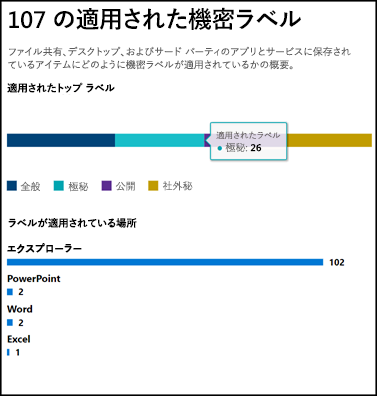
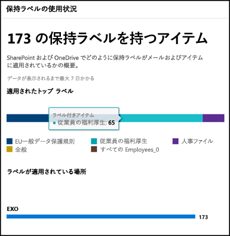

# ラベル分析によるラベル使用状況の表示View label usage with label analytics

保持ラベルと機密ラベルを作成した後に、テナント全体でどのように使用されているかを確認することができます。After you create your retention labels and sensitivity labels, you’ll want to see how they’re being used across your tenant. Microsoft 365 コンプライアンス センターと Microsoft 365 セキュリティ センターのラベル分析で、どのラベルが最もよく使われているか、どこで適用されているかを簡単に確認できます。With label analytics in the Microsoft 365 compliance center and Microsoft 365 security center, you can quickly see which labels are used the most and where they’re being applied.

たとえば、ラベル分析で次を確認できます:For example, with label analytics, you can view the:

- コンテンツに適用された保持ラベルと機密ラベルの合計数。Total number of retention labels and sensitivity labels applied to content.
- 上位のラベルと各ラベルの適用回数。Top labels and the count of how many times each label was applied.
- ラベルの適用場所と、各場所での適用回数。Locations where labels are applied and the count for each location.
- 保持レベルが変更または削除されたファイルとフォルダーの数。Count for how many files and folders had their retention label changed or removed.

ラベル分析は、[[Microsoft 365 コンプライアンス センター]](https://compliance.microsoft.com/labelanalytics) または [[Microsoft 365 セキュリティ センター]](https://security.microsoft.com/labelanalytics)  >  **[分類]**  >  **[ラベル分析]** で確認できます。You can find label analytics in the [Microsoft 365 compliance center](https://compliance.microsoft.com/labelanalytics) or [Microsoft 365 security center](https://security.microsoft.com/labelanalytics) > **Classification** > **Label analytics**.

## 機密ラベルの使用状況Sensitivity label usage

機密ラベルの使用状況のデータは、Azure Information Protection のレポートから取得します。詳細については、「[Azure Information Protection の集中レポート](https://docs.microsoft.com/azure/information-protection/reports-aip)」を参照してください。The data on sensitivity label usage is pulled from the reports for Azure Information Protection – for more information, see [Central reporting for Azure Information Protection](https://docs.microsoft.com/azure/information-protection/reports-aip).

Azure Information Protection のレポートは、Microsoft 365 コンプライアンス センターと Microsoft 365 セキュリティセンターの機密ラベルに対するラベル分析にも適用される[前提条件](/azure/information-protection/reports-aip#prerequisites)があるのでご注意ください。Note that the Azure Information Protection reports have [prerequisites](/azure/information-protection/reports-aip#prerequisites) that also apply to label analytics on sensitivity labels in the Microsoft 365 compliance center and Microsoft 365 security center. たとえば、これらのレポートは Azure Information Protection のクライアントとスキャン プログラムから Azure Log Analytics サービスに基づいて集中管理された場所に情報保護の監視イベントを送信した結果なので、Log Analytics を含む Azure サブスクリプションが必要です。For example, you need an Azure subscription that includes the Log Analytics because these reports are a result of sending information protection audit events from Azure Information Protection clients and scanners to a centralized location based on Azure Log Analytics service.

機密ラベルの使用状況は:For sensitivity label usage:

- データの待機時間はありません。There is no latency in the data. リアルタイムのレポートです。This is a real-time report.
- 上位の各ラベルの数を確認するには、棒グラフをポイントすると表示されるツール ヒントを確認してください。To see the count for each top label, point to the bar graph and read the tool tip that appears.
- レポートでは、アプリごとに機密ラベルがどこに適用されているかを示します (保持ラベルは場所ごとに示されます)。The report shows where sensitivity labels are applied per app (whereas retention labels are shown per location).

## 保持ラベルの使用状況Retention label usage

このレポートでは、上位のラベルとそれがどこで適用されているかについてクイック ビューが表示されます。This report shows a quick view of what the top labels are and where they’re applied. SharePoint や OneDrive のコンテンツがどのようにラベル付けされているかについての詳細は、「[ドキュメントのラベル アクティビティを表示する](view-label-activity-for-documents.md)」を参照してください。For more detailed information on how content in SharePoint and OneDrive is labeled, see [View label activity for documents](view-label-activity-for-documents.md).

保持ラベルの使用状況は:For retention label usage:

- データは、週ごとに集計されるため、データがレポートに表示されるまで最大 7 日間がかかる場合があります。Data is aggregated weekly, so it may take up to seven days for data to appear in the report.
- 上位の各ラベルの数を確認するには、棒グラフをポイントすると表示されるツール ヒントを確認してください。To see the count for each top label, point to the bar graph and read the tool tip that appears.
- レポートでは、場所ごとに保持ラベルがどこに適用されているかを示します (機密ラベルはアプリごとに示されます)。The report shows where retention labels are applied per location (whereas sensitivity labels are shown per app).
- 保持レベルは、テナントの全期間のデータの概要で、特定の日付範囲にフィルター処理はされません。For retention labels, this is a summary of the all-time data in your tenant; it’s not filtered to a specific date range. これに対し、[ラベル アクティビティ エクスプローラー](view-label-activity-for-documents.md)は、過去 30 日間のみのデータが表示されます。By contrast, the [Label Activity Explorer](view-label-activity-for-documents.md) shows data from only the past 30 days.

## 特定の保持ラベルが付いたコンテンツをすべて表示するView all content with a specific retention label

保持ラベルの使用状況レポートから、そのラベルが適用されたすべてのコンテンツを簡単に参照することができます。From the retention label usage report, you can quickly explore all content with that label applied. (この機能については、現在作業中のためすべてのラベル付けされたコンテンツを見るにはいくつかの手順が必要になります。)(Note that we're currently working on this feature, so that it will take fewer steps to view all the labeled content.)

最初に、レポートの下部にある **[詳細の表示]** を選択します。First, choose **View Details** at the bottom of the report.

![保持ラベルの使用状況レポートの下部にある [詳細の表示] オプション](../media/retention-label-usage-view-details.png)

次に、保持ラベル > **右側のウィンドウの [アイテムを参照する]** を選択します。Then choose a retention label > **Explore items** in the right pane.

![右側のウィンドウの [アイテムを参照する] オプション](../media/retention-label-usage-explore-items.png)

そのラベルで、**[アクティビティ]** タブを選択すると、そのラベルの場所ごとのアイテム数が表示されます。For that label, you can choose the **Activity** tab to view a count of items with that label by location.

![保持ラベルの [アクティビティ] タブ](../media/retention-label-usage-activity-tab.png)

**[このラベルを含むアイテム]** タブも選択できます。それから、特定の場所について確認することができます。You can also choose the **Items with this label** tab. Then you can drill into specific locations:

- Exchange Online では、メールボックスの一覧とメールボックスごとにラベルが付いたアイテムの数を確認できます。For Exchange Online, you see a list of mailboxes with the count of labeled items in each mailbox.
- SharePoint Online と OneDrive for Business では、サイト コレクションの一覧と、OneDrive アカウントをそれぞれの場所のラベル付けされたアイテムの数と合わせて確認できます。For SharePoint Online and OneDrive for Business, you see a list of site collections and OneDrive accounts with the count of labeled items in each location.

メールボックスまたはサイト コレクションを選択すると、その場所の保持ラベルを含むアイテムの一覧が表示されます。When you choose a mailbox or site collection, you can view a list of items with that retention label in that location.

![[このラベルを含むアイテム] タブでその保持ラベルを持つすべてのアイテムを表示](../media/retention-label-usage-content-explorer.png)

## アクセス許可Permissions

ラベル分析を確認するには、Azure Active Directory で次のいずれかの役割に割り当てられている必要があります。To view label analytics, you must be assigned one of the following roles in Azure Active Directory:

- グローバル管理者Global administrator
- コンプライアンス管理者Compliance administrator
- セキュリティ管理者Security administrator
- セキュリティ閲覧者Security reader

さらに、これらのレポートでは、Azure Monitor を使用して、組織が所有する Log Analytics ワークスペースにデータを格納します。In addition, note these reports use Azure Monitor to store the data in a Log Analytics workspace that your organization owns. そのため、データが格納されている Azure Monitor のワークスペースの閲覧者としてユーザーを追加しておく必要があります。詳細については、「[Azure Information Protection の分析に必要なアクセス許可](https://docs.microsoft.com/azure/information-protection/reports-aip#permissions-required-for-azure-information-protection-analytics)」を参照してください。Therefore, the user should be added as a reader to the Azure Monitoring workspace that holds the data - for more information, see [Permissions required for Azure Information Protection analytics](https://docs.microsoft.com/azure/information-protection/reports-aip#permissions-required-for-azure-information-protection-analytics).

