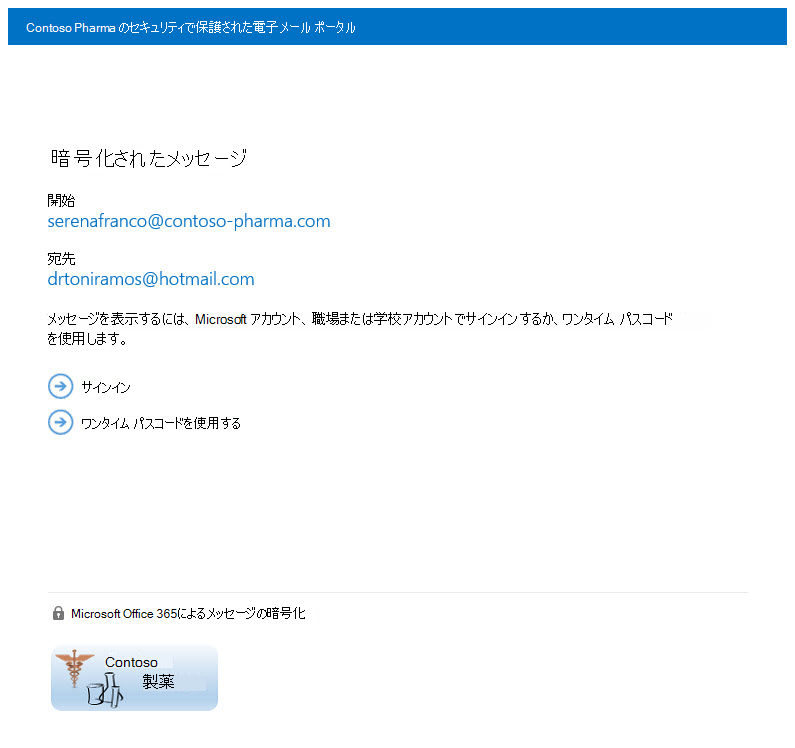

# <a name="legacy-information-for-office-365-message-encryption"></a>Office 365 Message Encryption の古い情報

[!include[Purview banner](../includes/purview-rebrand-banner.md)]

組織を Microsoft Purview Message Encryption にまだ移行していないが、既に OME を展開している場合は、この記事の情報が組織に適用されます。 Microsoft では、組織にとって妥当な場合は、すぐに Microsoft Purview Message Encryption に移行する計画を立てるようお勧めします。 手順については、「 [Microsoft Purview メッセージ暗号化の設定](set-up-new-message-encryption-capabilities.md)」を参照してください。 新しいメッセージ暗号化の最初の方法の詳細については、メッセージの暗号化に関する [ページを](ome.md)参照してください。 この記事の残りの部分では、Microsoft Purview メッセージ暗号化のリリース前の OME 動作について説明します。

Office 365 Message Encryption を使用すると、組織は組織内外のユーザーとの間で暗号化されたメール メッセージを送受信できます。 Office 365 Message Encryption は、Outlook.com、Yahoo、Gmail、およびその他のメール サービスで機能します。 メール メッセージの暗号化を使用すると、意図した受信者のみがメッセージの内容を表示できるようになります。

次に、いくつかの例を示します:

- 銀行員が顧客にクレジット カード明細書を送信する
- 保険会社の担当者が顧客にポリシーの詳細を提供する
- 住宅ローン ブローカーがローン申請のために顧客に財務情報を要求する
- 医療提供者が患者に医療情報を送信する
- 弁護士が顧客または他の弁護士に機密情報を送信する

## <a name="how-office-365-message-encryption-works-without-the-new-capabilities"></a>新しい機能を使用せずにメッセージ暗号化をOffice 365する方法

Office 365 メッセージ暗号化は、Microsoft Azure Rights Management (Azure RMS) 上に構築されたオンライン サービスです。 Azure RMS を使用すると、管理者はメール フロー ルールを定義して、暗号化の条件を決定できます。 たとえば、ルールでは、特定の受信者宛てのすべてのメッセージの暗号化を要求できます。

暗号化規則に一致する電子メール メッセージをExchange Onlineで送信すると、メッセージは HTML 添付ファイルで送信されます。 受信者が HTML 添付ファイルを開き、指示に従って、Office 365 メッセージ暗号化ポータルで暗号化されたメッセージを表示します。 受信者は、Microsoft アカウントまたはOffice 365に関連付けられている職場または学校でサインインするか、1 回限りのパス コードを使用してメッセージを表示するかを選択できます。 どちらのオプションも、指定された受信者のみが暗号化されたメッセージを表示できるようにするために役立ちます。 このプロセスは、Microsoft Purview メッセージ暗号化では大きく異なります。

下の図は、暗号化と復号化のプロセスにおける電子メール メッセージの流れをまとめたものです。


詳細については、[Microsoft Purview メッセージ暗号化のリリース前のレガシ Office 365 メッセージ暗号化のサービス情報に関するページを参照](legacy-information-for-message-encryption.md#LegacyServiceInfo)してください。

## <a name="defining-mail-flow-rules-for-office-365-message-encryption-that-dont-use-microsoft-purview-message-encryption"></a>Microsoft Purview メッセージ暗号化を使用しないOffice 365 メッセージ暗号化のメール フロー ルールを定義する

新しい機能なしでOffice 365メッセージ暗号化を有効にするには、Exchange Online管理者とExchange Online Protection管理者がメール フロー ルールExchange定義します。 これらのルールは、電子メール メッセージを暗号化する条件と、メッセージの暗号化を削除するための条件を決定します。 ルールに対して暗号化アクションが設定されている場合、サービスは、メッセージを送信する前に、ルールの条件に一致するすべてのメッセージに対してアクションを実行します。

メール フロー ルールは柔軟であるため条件を組み合わせることができ、1 つのルールで特定のセキュリティ要件を満たすことができます。 たとえば、指定したキーワードを含み、外部の受信者に宛てられたすべてのメッセージを暗号化するルールを作成できます。 Office 365 メッセージ暗号化では、暗号化された電子メールの受信者からの返信も暗号化され、メール ユーザーの利便性としてそれらの返信を復号化するルールを作成できます。 そうすれば、組織内のユーザーは、返信を表示するために暗号化ポータルにサインインする必要はありません。

Exchangeメール フロー ルールを作成する方法の詳細については、「[メッセージ暗号化Office 365ルールを定義する](define-mail-flow-rules-to-encrypt-email.md)」を参照してください。

### <a name="use-the-eac-to-create-a-mail-flow-rule-for-encrypting-email-messages-without-microsoft-purview-message-encryption"></a>EAC を使用して、Microsoft Purview メッセージ暗号化を使用せずに電子メール メッセージを暗号化するためのメール フロー ルールを作成する

1. Web ブラウザーで、グローバル管理者のアクセス許可が付与されている職場または学校アカウントを使用して、[Office 365にサインインします](https://support.office.com/article/b9582171-fd1f-4284-9846-bdd72bb28426#ID0EAABAAA=Web_browser)。

2. **[管理者**] タイルを選択します。

3. Microsoft 365 管理センターで、[**管理センター**\>] <a href="https://go.microsoft.com/fwlink/p/?linkid=2059104" target="_blank">**Exchange**</a>を選択します。

4. EAC の [**メール フロー** \> **ルール**] に移動し、[**新しい新規**![] アイコンを選択します。](../media/457cd93f-22c2-4571-9f83-1b129bcfb58e.gif) \>**新しいルールを作成します**。 EAC の使用の詳細については、[Exchange Onlineの管理センター Exchange](/exchange/exchange-admin-center)参照してください。

5. **[名前]** に、ルールの名前 ([DrToniRamos@hotmail.com のメールを暗号化する] など) を入力します。

6. **[次の場合、このルールを適用する]** で条件を選択し、必要に応じて値を入力します。たとえば、DrToniRamos@hotmail.com 宛のメッセージを暗号化するには、以下のようにします。

   1. **[次の場合、このルールを適用する]** で、**[受信者]** を選択します。

   2. 連絡先リストから既存の名前を選択するか、**[名前の確認]** ボックスに新しい電子メール アドレスを入力します。

      - 既存の名前を選択する場合は、一覧から名前を選択してから **[OK]** をクリックします。

      - 新しい名前を入力するには、[**チェック名**] ボックスに電子メール アドレスを入力し、[OK] チェック **ボックス**\>をオン **にします**。

7. さらに条件を追加するには、[ **その他のオプション** ] を選択し、[ **条件の追加** ] を選択して一覧から選択します。

   たとえば、受信者が組織外の場合にのみルールを適用するには、[**条件の追加**] を選択し、[**受信者は組織** の **外部**\>/内部\>] **を選択します。**

8. 新しい OME 機能を使用せずに暗号化を有効にするには、[**次の操作を行う**] で[**メッセージ セキュリティ**\>を変更する] を選択し、**以前のバージョンの OME を適用** し、[**保存]** を選択します。

   IRM ライセンスが有効になっていないというエラーが表示された場合は、レガシ OME を使用していません。

9. (省略可能)[ **アクションの追加]** を選択して、別のアクションを指定します。

### <a name="use-exchange-online-powershell-to-create-a-mail-flow-rule-for-encrypting-email-messages-without-the-new-ome-capabilities"></a>PowerShell Exchange Onlineを使用して、新しい OME 機能を使用せずに電子メール メッセージを暗号化するためのメール フロー ルールを作成する

1. Exchange Online PowerShell に接続します。 詳細については、「[Exchange Online PowerShell への接続](/powershell/exchange/connect-to-exchange-online-powershell)」を参照してください。

2. **New-TransportRule** コマンドレットを使用してルールを作成し、_ApplyOME_ パラメーター`$true`を .

   この例では、DrToniRamos@hotmail.com に送信されたすべての電子メール メッセージを暗号化する必要があります。

   ```powershell
   New-TransportRule -Name "Encrypt rule for Dr Toni Ramos" -SentTo "DrToniRamos@hotmail.com" -SentToScope "NotinOrganization" -ApplyOME $true
   ```

   ここで

   - 新しいルールの一意の名前は、"Dr Toni Ramos のルールを暗号化する" です。
   - _SentTo_ パラメーターは、メッセージ受信者 (名前、電子メール アドレス、識別名などで識別) を指定します。 この例では、受信者はメール アドレス "DrToniRamos@hotmail.com" によって識別されます。
   - _SentToScope_ パラメーターは、メッセージ受信者の場所を指定します。 この例では、受信者のメールボックスは hotmail にあり、組織の一部ではないため、値 `NotInOrganization` が使用されます。

   詳細な構文とパラメーターについては、「[New-TransportRule](/powershell/module/exchange/New-TransportRule)」を参照してください。

### <a name="remove-encryption-from-email-replies-encrypted-without-microsoft-purview-message-encryption"></a>Microsoft Purview Message Encryption を使用せずに暗号化された電子メール返信から暗号化を削除する

電子メール ユーザーが暗号化メッセージを送信した場合、これらのメッセージの受信者は、暗号化された返信で応答することができます。 メール フロー ルールを作成すると、組織内のメール ユーザーが暗号化ポータルにサインインして表示する必要がないように、返信から暗号化を自動的に削除できます。 EAC コマンドレットまたはExchange Online PowerShell コマンドレットを使用して、これらの規則を定義できます。 組織内から送信されたメッセージや、組織内から送信されたメッセージに対する返信メッセージを復号化できます。 組織の外部から送信された暗号化されたメッセージの暗号化を解除することはできません。

#### <a name="use-the-eac-to-create-a-rule-for-removing-encryption-from-email-replies-encrypted-without-microsoft-purview-message-encryption"></a>EAC を使用して、Microsoft Purview Message Encryption を使用せずに暗号化された電子メール返信から暗号化を削除するルールを作成する

1. Web ブラウザーで、管理者アクセス許可が付与されている職場または学校アカウントを使用[して、Office 365にサインインします](https://support.office.com/article/b9582171-fd1f-4284-9846-bdd72bb28426#ID0EAABAAA=Web_browser)。

2. **[管理者**] タイルを選択します。

3. Microsoft 365 管理センターで、[**管理センター**\>] <a href="https://go.microsoft.com/fwlink/p/?linkid=2059104" target="_blank">**Exchange**</a>を選択します。

4. EAC の [**メール フロー** \> **ルール**] に移動し、[**新しい新規**![] アイコンを選択します。](../media/457cd93f-22c2-4571-9f83-1b129bcfb58e.gif) \>**新しいルールを作成します**。 EAC の使用の詳細については、[Exchange Onlineの管理センター Exchange](/exchange/exchange-admin-center)参照してください。

5. **[名前]** に、受信メールからの暗号化の削除など、ルールの名前を入力します。

6. [**受信者が** 組織内にある] など、メッセージから暗号化を削除する条件を選択する場合 **は**\>、このルール **を適用します**。

7. [**次の操作を行う**] で、[**メッセージ セキュリティ**\>を変更する] を選択 **します。以前のバージョンの OME を削除** します。

8. **[保存]** を選択します。

#### <a name="use-exchange-online-powershell-to-create-a-rule-to-remove-encryption-from-email-replies-encrypted-without-the-new-ome-capabilities"></a>PowerShell Exchange Onlineを使用して、新しい OME 機能なしで暗号化された電子メール返信から暗号化を削除するルールを作成する

1. Exchange Online PowerShell に接続します。 詳細については、「[Exchange Online PowerShell への接続](/powershell/exchange/connect-to-exchange-online-powershell)」を参照してください。

2. **New-TransportRule** コマンドレットを使用してルールを作成し、_RemoveOME_ パラメーター`$true`を .

   次の使用例は、組織内の受信者に送信されたすべてのメールから暗号化を削除します。

   ```powershell
   New-TransportRule -Name "Remove encryption from incoming mail" -SentToScope "InOrganization" -RemoveOME $true
   ```

   ここで

   - 新しいルールの一意の名前は、"受信メールから暗号化を削除する" です。
   - _SentToScope_ パラメーターは、メッセージ受信者の場所を指定します。 この例では、次のいずれかを示す値 `InOrganization` 値が使用されます。
     - 受信者は、組織内のメールボックス、メール ユーザー、グループ、またはメールが有効なパブリック フォルダーです。
     - 受信者の電子メール アドレスは、組織内の権限のあるドメインまたは内部の中継ドメインとして構成されている承認済みドメイン _にあり、メッセージ_ は認証された接続経由で送受信されました。

詳細な構文とパラメーターについては、「[New-TransportRule](/powershell/module/exchange/New-TransportRule)」を参照してください。

## <a name="sending-viewing-and-replying-to-messages-encrypted-without-the-new-capabilities"></a>新しい機能を使用せずに暗号化されたメッセージの送信、表示、および返信

Office 365 メッセージ暗号化では、管理者が定義したルールに基づいて、電子メール メッセージが自動的に暗号化されます。 暗号化されたメッセージを含む電子メールが、添付された HTML ファイルを使用して受信者の受信トレイに届きます。

受信者はメッセージの指示に従って添付ファイルを開き、Office 365に関連付けられている Microsoft アカウントまたは職場または学校を使用して認証します。 受信者がどちらのアカウントも持っていない場合は、暗号化されたメッセージを表示するためにサインインできるようにする Microsoft アカウントを作成するように指示されます。 または、受信者は、メッセージを表示する 1 回限りのパス コードを取得することもできます。 サインインまたはワンタイム パス コードを使用した後、受信者は暗号化解除されたメッセージを表示し、暗号化された応答を送信できます。

## <a name="customize-encrypted-messages-with-office-365-message-encryption"></a>Office 365 メッセージ暗号化を使用して暗号化されたメッセージをカスタマイズする

Exchange OnlineおよびExchange Online Protection管理者は、暗号化されたメッセージをカスタマイズできます。 たとえば、会社のブランドとロゴを追加したり、概要を指定したり、暗号化されたメッセージや受信者が暗号化されたメッセージを表示するポータルで免責事項テキストを追加したりできます。 Exchange Online PowerShell コマンドレットを使用すると、暗号化された電子メール メッセージの受信者に対する表示エクスペリエンスの次の側面をカスタマイズできます。

- 暗号化メッセージを含む電子メールの導入部のテキスト
- 暗号化メッセージを含む電子メールの免責事項のテキスト
- メッセージ表示ポータルに表示されるポータルのテキスト
- 電子メール メッセージおよび表示ポータルに表示されるロゴ

いつでも既定のルック アンド フィールに戻すこともできます。

以下の例は、電子メールの添付ファイルに表示される ContosoPharma のカスタム ロゴです。

> [!div class="mx-imgBorder"]
> 

### <a name="to-customize-encryption-email-messages-and-the-encryption-portal-with-your-organizations-brand"></a>組織のブランドを使用して暗号化電子メール メッセージと暗号化ポータルをカスタマイズするには

1. [Exchange Online PowerShell に接続します](/powershell/exchange/connect-to-exchange-online-powershell)。

2. 次の説明に従って、Set-OMEConfiguration コマンドレットを使用します。 [Set-OMEConfiguration](/powershell/module/exchange/set-omeconfiguration) または次の表を参考にしてください。

   **暗号化のカスタマイズ オプション**

   |カスタマイズする暗号化エクスペリエンスの特性|これらのExchange Online PowerShell コマンドを使用する|
   |---|---|
   |暗号化された電子メール メッセージに付けられる既定のテキスト <p> 暗号化メッセージの表示手順の上に表示される既定のテキスト|`Set-OMEConfiguration -Identity <OMEConfigurationIdParameter> -EmailText "<string of up to 1024 characters>"` <p> **例:** `Set-OMEConfiguration -Identity "OME Configuration" -EmailText "Encrypted message from ContosoPharma secure messaging system"`|
   |暗号化メッセージを含む電子メールの免責文|`Set-OMEConfiguration -Identity <OMEConfigurationIdParameter> DisclaimerText "<your disclaimer statement, string of up to 1024 characters>"` <p> **例:** `Set-OMEConfiguration -Identity "OME Configuration" -DisclaimerText "This message is confidential for the use of the addressee only"`|
   |暗号化メールの表示ポータルの最上部に表示されるテキスト|`Set-OMEConfiguration -Identity <OMEConfigurationIdParameter> -PortalText "<text for your portal, string of up to 128 characters>"` <p> **例:** `Set-OMEConfiguration -Identity "OME Configuration" -PortalText "ContosoPharma secure email portal"`|
   |ロゴ|`Set-OMEConfiguration -Identity <OMEConfigurationIdParameter> -Image <Byte[]>` <p> **例:** `Set-OMEConfiguration -Identity "OME configuration" -Image ([System.IO.File]::ReadAllBytes('C:\Temp\contosologo.png'))` <p> サポートされているファイル形式: .png、.jpg、.bmp、.tiff <p> ロゴ ファイルの最適なサイズ:40 KB 未満 <p> 最適なロゴ画像のサイズ:170x70 ピクセル|

### <a name="to-remove-brand-customizations-from-encryption-email-messages-and-the-encryption-portal"></a>暗号化電子メール メッセージと暗号化ポータルからブランドのカスタマイズを削除するには

1. [Exchange Online PowerShell に接続します](/powershell/exchange/connect-to-exchange-online-powershell)。

2. [Set-OMEConfiguration](/powershell/module/exchange/set-omeconfiguration) の説明に従って、Set-OMEConfiguration コマンドレットを使用します。 DisclaimerText、EmailText、PortalText の値から組織のブランド化されたカスタマイズを削除するには、値を空の文字列に設定します `""`。 ロゴなど、すべての画像値に対して、値 `"$null"`を .

   **暗号化のカスタマイズ オプション**

   |この暗号化の機能を既定のテキストと画像に戻すには|これらのExchange Online PowerShell コマンドを使用する|
   |---|---|
   |暗号化された電子メール メッセージに付けられる既定のテキスト <p> 暗号化メッセージの表示手順の上に表示される既定のテキスト|`Set-OMEConfiguration -Identity <OMEConfigurationIdParameter> -EmailText "<empty string>"` <p> **例:** `Set-OMEConfiguration -Identity "OME Configuration" -EmailText ""`|
   |暗号化メッセージを含む電子メールの免責文 <p> |`Set-OMEConfiguration -Identity <OMEConfigurationIdParameter> DisclaimerText "<empty string>"` <p> **例:** `Set-OMEConfiguration -Identity "OME Configuration" -DisclaimerText ""`|
   |暗号化メールの表示ポータルの最上部に表示されるテキスト|`Set-OMEConfiguration -Identity <OMEConfigurationIdParameter> -PortalText "<empty string>"` <p> **既定に戻す例:** `Set-OMEConfiguration -Identity "OME Configuration" -PortalText ""`|
   |ロゴ|`Set-OMEConfiguration -Identity <OMEConfigurationIdParameter> -Image <"$null">` <p> **既定に戻す例:** `Set-OMEConfiguration -Identity "OME configuration" -Image $null`|

## <a name="service-information-for-legacy-office-365-message-encryption-prior-to-the-release-of-the-new-ome-capabilities"></a>新しい OME 機能のリリース前のレガシ Office 365 メッセージ暗号化のサービス情報
<a name="LegacyServiceInfo"> </a>

次の表は、Microsoft Purview Message Encryption のリリース前のOffice 365 メッセージ暗号化サービスの技術的な詳細を示しています。

|サービスの詳細情報|説明|
|---|---|
|クライアント デバイスの要件|暗号化されたメッセージは、Form Post をサポートする最新のブラウザーで HTML 添付ファイルを開くことができれば、任意のクライアント デバイスで表示できます。|
|暗号化アルゴリズムと連邦情報処理規格 (FIPS) への準拠|Office 365 Message Encryption は、Windows Azure Information Rights Management (IRM) と同じ暗号化キーを使用し、暗号化モード 2 をサポートします (RSA システム用の 2K キーと SHA-1 システム用の 256 ビット キー)。 基になる IRM 暗号化モードの詳細については、「 [AD RMS 暗号化モード](/previous-versions/windows/it-pro/windows-server-2008-R2-and-2008/hh867439(v=ws.10))」を参照してください。|
|サポートされているメッセージの種類|Office 365 Message Encryption は、**IPM.Note** のメッセージ クラス ID があるアイテムでのみサポートされます。 詳細については、「 [アイテムの種類とメッセージ クラス」を](/office/vba/outlook/Concepts/Forms/item-types-and-message-classes)参照してください。|
|メッセージ サイズの制限|Office 365 Message Encryption は、25 メガバイトまでのメッセージを暗号化できます。 メッセージ サイズの制限の詳細については、「[Exchange Online制限](/office365/servicedescriptions/exchange-online-service-description/exchange-online-limits)」を参照してください。|
|Exchange Online電子メールアイテム保持ポリシー|Exchange Onlineは、暗号化されたメッセージを格納しません。|
|Office 365 Message Encryption の言語サポート|Office 365 メッセージ暗号化では、次のようにMicrosoft 365言語がサポートされます。 <p> 受信電子メール メッセージと添付 HTML ファイルは、送信者の言語設定に基づいてローカライズされます。 <p> 表示するためのポータルは、受信者のブラウザーの設定に基づいてローカライズされます。 <p> 暗号化されたメッセージの本文 (コンテンツ) は、ローカライズされません。|
|OME ポータルと OME Viewer アプリの個人情報|[Office 365 Messaging Encryption Portal privacy statement](https://privacy.microsoft.com/privacystatement) には、お客様の個人情報を使用して Microsoft が行うことと行わないことについて詳しく記されています。|

## <a name="frequently-asked-questions-about-legacy-ome"></a>レガシ OME に関するよく寄せられる質問
<a name="LegacyServiceInfo"> </a>

メッセージ暗号化のOffice 365に関する質問がありますか? いくつかの回答を次に示します。 必要なものが見つからない場合は、[Microsoft Tech Community フォーラムでOffice 365を](https://techcommunity.microsoft.com/t5/Office-365/ct-p/Office365)確認してください。

 **Q。ユーザーは、組織外の受信者に暗号化された電子メール メッセージを送信します。Office 365 メッセージ暗号化で暗号化された電子メール メッセージの読み取りと返信を行うために、外部受信者が行う必要があることはありますか?**

暗号化されたメッセージを受信Microsoft 365組織外の受信者は、次の 2 つの方法のいずれかで受信者を表示できます。

- Office 365に関連付けられている Microsoft アカウントまたは職場または学校のアカウントでサインインします。

- ワンタイム パス コードを使用します。

 **Q。Microsoft 365暗号化されたメッセージは、クラウドまたは Microsoft サーバーに格納されますか?**

いいえ。暗号化されたメッセージは受信者の電子メール システムに保持され、受信者がメッセージを開くと、Microsoft サーバーで表示するために一時的に投稿されます。 メッセージはそこに保存されません。

 **Q. 暗号化された電子メール メッセージを独自のブランドでカスタマイズすることはできますか。**

はい。 Exchange Online PowerShell コマンドレットを使用すると、暗号化された電子メール メッセージの上部に表示される既定のテキスト、免責事項テキスト、および電子メール メッセージと暗号化ポータルに使用するロゴをカスタマイズできます。 この機能は OMEv2 で使用できるようになりました。 詳細については、「[Add branding to encrypted messages](add-your-organization-brand-to-encrypted-messages.md)」を参照してください。

 **Q. このサービスは組織内のすべてのユーザーに対して 1 つのライセンスが必要ですか。**

暗号化された電子メールを送信する組織内のすべてのユーザーに対して 1 つのライセンスが必要です。

 **Q. 外部の受信者はサブスクリプションが必要ですか。**

いいえ。外部の受信者は、暗号化されたメッセージを読んで返信するためにサブスクリプションを必要としません。

 **Q。Office 365 メッセージ暗号化は、Rights Management Services (RMS) とどのように異なりますか?**

RMS は、次のような組み込みのテンプレートを提供することで、組織の内部電子メールに対して Information Rights Protection 機能を提供します。たとえば、転送しない、会社の社外秘です。 Office 365 メッセージ暗号化では、外部受信者と内部受信者に送信されるメッセージの電子メール メッセージ暗号化がサポートされます。

 **Q。Office 365 メッセージ暗号化と S/MIME の違い**

S/MIME は、基本的に、クライアント側の暗号化テクノロジであり、複雑な証明書管理と発行インフラストラクチャが必要です。 Office 365 メッセージ暗号化では、メール フロー ルール (トランスポート ルールとも呼ばれます) が使用され、証明書の発行に依存しません。

 **Q. モバイル デバイスで暗号化されたメッセージを読むことはできますか。**

はい。Google Play ストアと Apple App Store から OME ビューアー アプリをダウンロードすると、AndroidとiOSでメッセージを表示できます。 OME Viewer アプリの HTML 添付ファイルを開いてから、指示に従って暗号化されたメッセージを開きます。 その他のモバイル デバイスでは、メール クライアントが投稿フォームをサポートしている限り HTML 添付ファイルを開くことができます。

 **Q. 返信や転送されたメッセージは暗号化されますか。**

はい。返信はスレッド期間の間、暗号化されます。

 **Q。Office 365メッセージ暗号化はローカライズを提供しますか?**

受信電子メールと HTML コンテンツは、送信者の電子メール設定に基づいてローカライズされます。表示ポータルは、受信者のブラウザー設定に基づいてローカライズされます。ただし、暗号化されたメッセージの本文 (コンテンツ) はローカライズされません。

 **Q。Office 365 メッセージ暗号化に使用される暗号化方法は何ですか?**

Office 365 メッセージ暗号化では、Rights Management Services (RMS) が暗号化インフラストラクチャとして使用されます。 使用される暗号化方式は、メッセージの暗号化と復号化に使用する RMS キーを取得する場所によって異なります。

- Microsoft Azure RMS を使用してキーを取得する場合は、暗号化モード 2 が使用されます。 暗号化モード 2 は、AD RMS 暗号実装を更新して強化した方式です。 この方式は署名と暗号化に RSA 2048 をサポートし、署名に関しては SHA-256 もサポートします。

- Active Directory (AD) RMS を使用してキーを取得する場合は、暗号化モード 1 または暗号化モード 2 が使用されます。使用される方法は、社内 AD RMS 展開によって異なります。暗号化モード 1 は、元来の AD RMS 暗号実装です。この方式は署名と暗号化に RSA 1024 をサポートし、署名に関しては SHA-1 もサポートします。このモードは、引き続き RMS の現在のすべてのバージョンでサポートされています。

詳細については、「 [AD RMS 暗号化モード](/previous-versions/windows/it-pro/windows-server-2008-R2-and-2008/hh867439(v=ws.10))」を参照してください。

**Q。暗号化されたメッセージの中には、Office365@messaging.microsoft.com から送信されたというメッセージがあるのはなぜ** ですか?

暗号化された返信が暗号ポータルから、または OME ビューアー アプリを介して送信されるとき、送信元電子メール アドレスは Office365@messaging.microsoft.com に設定されます。暗号化メッセージは Microsoft エンドポイントを介して送信されるためです。これにより、暗号化されたメッセージがスパムとしてマークされるのを回避できます。このラベルがあるため、暗号化ポータル内の電子メールとアドレスの表示名が変更されることはありません。また、このラベルが適用されるのは、ポータルを介して送信されるメッセージだけで、他の電子メール クライアントを介して送信されるメッセージには適用されません。

 **Q。ホストされた暗号化 (EHE) サブスクライバー Exchangeしています。Office 365 メッセージ暗号化へのアップグレードの詳細については、どこで確認できますか?**

EHE のすべてのお客様は、Office 365 Message Encryption にアップグレードされました。 詳細については、[ホスト型暗号化アップグレード センター Exchange](../security/office-365-security/exchange-online-protection-overview.md)を参照してください。

 **Q。メッセージ暗号化をサポートするために、組織のファイアウォールで URL、IP アドレス、またはポート Office 365を開く必要がありますか?**

はい。 Office 365 Message Encryption によって暗号化されたメッセージの認証を有効にするには、ご自分の組織の許可リストに Exchange Online の URL を追加する必要があります。 Exchange Online URL の一覧については、「[Microsoft 365 URL と IP アドレス範囲」を](../enterprise/urls-and-ip-address-ranges.md)参照してください。

 **Q。Microsoft 365暗号化されたメッセージを送信できる受信者の数を教えてください。**

受信者の制限は、メッセージあたり 500 人の受信者、または配布リストの展開後に組み合わせると、メッセージの **[宛先** ] フィールドの 11,980 文字のいずれか先になります。

 **Q. 特定の受信者に送信されたメッセージを取り消すことは可能ですか。**

いいえ。 送信後に特定のユーザーにメッセージを取り消すことはできません。

 **Q. 受信されて既読になった暗号化メッセージのレポートを表示することはできますか。**

暗号化されたメッセージが表示されたかどうかを示すレポートはありませんが、たとえば、特定のメール フロー ルール (トランスポート ルールとも呼ばれます) に一致したメッセージの数を決定するために利用できるレポートMicrosoft 365があります。

 **Q. OME ポータルと OME Viewer アプリで提供した情報を Microsoft はどのように使用しますか。**

[Office 365 メッセージング暗号化ポータルのプライバシーに関する声明](https://privacy.microsoft.com/privacystatement)では、Microsoft が個人情報を処理し、行わない内容に関する詳細な情報を提供します。

**Q。要求した後に 1 回限りのパス コードを受け取らない場合はどうすればよいですか?**

まずは、メール クライアントの迷惑メール フォルダーまたはスパム フォルダーを確認します。 組織の DKIM および DMARC 設定により、これらのメールがスパムとしてフィルター処理される可能性があります。

次に、セキュリティとコンプライアンス センターで検疫を確認します。 多くの場合、ワンタイム パス コードを含むメッセージは検疫されます。組織が初めて受信するメッセージの場合は特にそうです。
