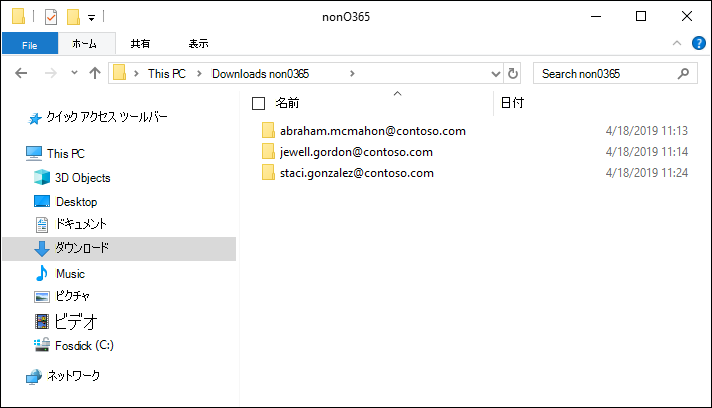
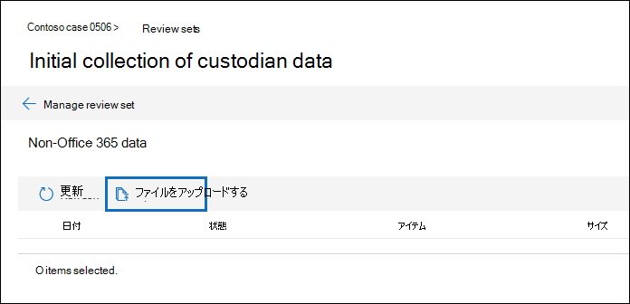
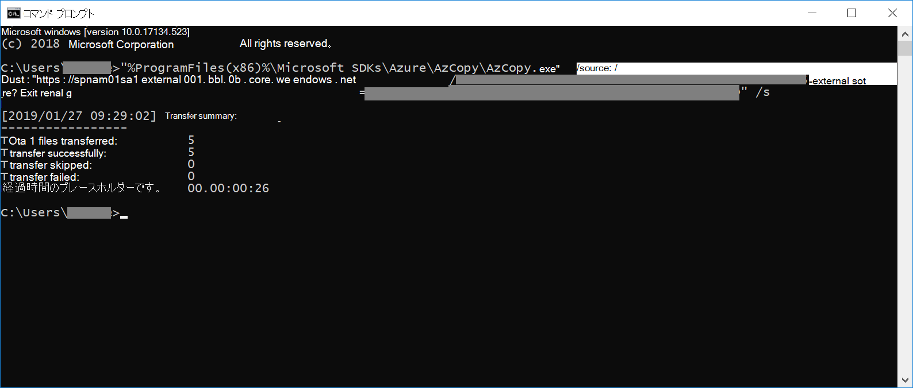

# レビューセットにMicrosoft 365 以外のデータを読み込む

ドキュメント内で分析する必要があるすべてのAdvanced eDiscoveryは、Microsoft 365。 Advanced eDiscovery の Microsoft 365 以外のデータインポート機能を使用すると、Microsoft 365 にないドキュメントをレビューセットにアップロードできます。 この記事では、非ドキュメントを分析Microsoft 365にAdvanced eDiscovery示します。

## コンテンツ以外のコンテンツをアップロードOffice 365要件

この記事で説明するアップロードMicrosoft 365機能を使用するには、次の情報が必要です。

- ユーザー以外のコンテンツを関連付けるすべての保管担当者Microsoft 365適切なライセンスが割り当てられている必要があります。 詳細については、「Get [started with Advanced eDiscovery」 を参照してください](get-started-with-advanced-ediscovery.md#step-1-verify-and-assign-appropriate-licenses)。

- 既存のケースAdvanced eDiscoveryします。

- 管理者以外のデータをアップロードして関連付ける前に、保管担当者をケースにMicrosoft 365する必要があります。

- Microsoft 以外の365データは、Advanced eDiscovery でサポートされているファイルの種類である必要があります。 詳細については、[Advanced eDiscovery でサポートされているファイルの種類](supported-filetypes-ediscovery20.md) を参照してください。

- レビュー セットにアップロードされたすべてのファイルは、フォルダーにある必要があります。各フォルダーは、特定のカストディアンに関連付けられています。 これらのフォルダーの名前には、*alias@domainname* のような名前付け形式を使用する必要があります。 alias@domainname は、ユーザーの Microsoft 365 エイリアスとドメインにする必要があります。 ルート フォルダー内のすべてのalias@domainnameを収集できます。 ルート フォルダーには、ルート フォルダー alias@domainnameできます。 ルート フォルダー内の緩いファイルはサポートされていません。

   アップロードするデータMicrosoft 365のフォルダー構造は、次の例のようになります。

   - c:\nonO365\abraham.mcmahon@contoso.com
   - c:\nonO365\jewell.gordon@contoso.com
   - c:\nonO365\staci.gonzalez@contoso.com

   ここで abraham.mcmahon@contoso.com、jewell.gordon@contoso.com、staci.gonzalez@contoso.com は、ケース内の保管担当者の SMTP アドレスです。

   

- 電子情報開示マネージャーの役割グループに割り当てられているアカウント (および電子情報開示管理者として追加)。

- コンピューターにインストールされている AzCopy v8.1 ツールで、コンテンツ フォルダー構造以外Microsoft 365アクセスできます。 AzCopy をインストールするには[、「AzCopy v8.1](/previous-versions/azure/storage/storage-use-azcopy)を使用してデータを転送する」を参照Windows。 既定の場所に **、%ProgramFiles(x86)%\Microsoft SDK\Azure\AzCopy** である AzCopy をインストールしてください。 AzCopy v8.1 を使用する必要があります。 他のバージョンの AzCopy は、アプリケーション内のデータを読み込Microsoft 365機能しない場合Advanced eDiscovery。

## アップロードコンテンツをMicrosoft 365にAdvanced eDiscovery

1. 電子情報開示マネージャーまたは電子情報開示管理者として、Advanced eDiscoveryを開き、非電子情報開示データがアップロードMicrosoft 365ケースに移動します。  

2. [**レビュー セット] を** クリックし、レビュー セットを選択して、ユーザー以外のデータMicrosoft 365アップロードします。  レビュー セットを持ってない場合は、1 つを作成できます。 
 
3. レビュー セットで、 **レビューセットの管理** をクリックし、**Microsoft 以外の365データ** タイルの **アップロードの表示** をクリックします。

4. **ファイルのアップロード** をクリックして、データ インポート ウィザードを開始します。

   

   ウィザードの最初の手順で準備するセキュリティで保護された Microsoft 提供の Azure Storage に、ファイルをにアップロードします。  準備が完了したら、**次: ファイルのアップロード** ボタンがアクティブになります。

   
 
5. **次: ファイルのアップロード** をクリックします。

6. [ファイルの **アップロード] ページ** で、次の操作を行います。

   

   a. [ファイル **の場所への** パス] ボックスで、アップロードするデータ以外のデータを保存したルート フォルダーの場所Microsoft 365入力します。 たとえば、[開始する前に] セクションに示されているサンプルファイルの場所については **、「%USERPROFILE\Downloads」と入力し、onO365**\n入力します。 正しい場所を指定すると、パスの下のボックスに表示される AzCopy コマンドが正しく更新されます。

   b. [ **クリップボードにコピー] を** クリックして、ボックスに表示されるコマンドをコピーします。

7. コマンド プロンプトWindowsを開始し、前の手順でコピーしたコマンドを貼り付け **、Enter** キーを押して AzCopy コマンドを開始します。  コマンドを開始すると、手順 4 でMicrosoft 365した場所Azure Storageファイルがアップロードされます。

   

   > [!NOTE]
   > 前に述べたように、AzCopy v8.1 を使用して、[ファイルファイル] ページで提供されているコマンドを正常に使用アップロード **必要** があります。 指定された AzCopy コマンドが失敗した場合は、「トラブルシューティング[AzCopy in Advanced eDiscovery」 を参照してください](troubleshooting-azcopy.md)。

8. ウィザードに戻り、[次 **Microsoft 365 コンプライアンス センター: ウィザードでファイルを処理する**] をクリックします。  これにより、Azure Storage の場所にアップロードされた Microsoft 365 以外のファイルの処理、テキスト抽出、インデックス作成が開始されます。  

9. [ファイルの処理] ページまたは[ジョブ] タブでファイルの処理の進行状況を追跡するには、レビュー セットに非ユーザー データMicrosoft 365を追加するという名前のジョブを **表示します**。  ジョブが完了すると、新しいファイルがレビュー セットで使用できます。

   

10. 処理が完了したら、ウィザードを閉じることができます。