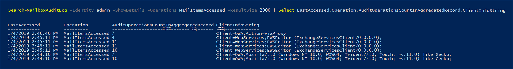

# <a name="use-advanced-audit-to-investigate-compromised-accounts"></a>高度な監査を使用して、侵害されたアカウントを調査する

侵害されたユーザー アカウント (*アカウントの乗っ取り* とも呼ばれます) は、攻撃者がユーザー アカウントへのアクセス権を取得し、ユーザーとして操作する場合の攻撃の種類です。 これらのタイプの攻撃は、攻撃者が意図していたよりも多くの損害を引き起こすことがあります。 侵害されたメール アカウントを調査する場合、攻撃者の実際の存在を追跡する中で示されるよりも多くのメール データが侵害されたと想定する必要があります。 メール メッセージのデータの種類によっては、機密情報が漏えいしていないことを証明できない限り、機密情報が侵害されたと見なすか、または規制当局の罰金に直面する必要があります。 たとえば、HIPAA の規制対象となる組織は、患者の健康情報 (PHI) が漏えいした証拠がある場合、多額の罰金に直面します。 これらの場合、攻撃者が PHI に関心を持つことはほとんどありませんが、組織は、別の方法で証明できない限りはデータ侵害を報告する必要があります。

侵害されたメール アカウントの調査を支援するために、*MailItemsAccessed* メールボックス監査アクションを使用して、メール プロトコルおよびクライアントによるメール データへのアクセスを監査しています。 この新しい監査済みアクションは、調査者がメール データ侵害をよりよく理解し、侵害された可能性のある特定のメール アイテムに対する侵害の範囲を特定するのに役立ちます。 この新しい監査アクションを使用する目標は、特定のメール データが危険にさらされていないことを主張するためのフォレンシック防御可能性です。 攻撃者が特定のメールへのアクセス権を取得した場合、メール アイテムが実際に読み取られたという兆候がなくても、Exchange Online はイベントを監査します。

## <a name="the-mailitemsaccessed-mailbox-auditing-action"></a>MailItemsAccessed メールボックス監査アクション

新しい MailItemsAccessed アクションは、新しい[高度な監査](advanced-audit.md)機能の一部です。[Exchange メールボックス監査](/office365/securitycompliance/enable-mailbox-auditing#mailbox-auditing-actions)の一部であり、Office 365 または Microsoft 365 E5 ライセンスが割り当てられているユーザー、または Microsoft 365 E5 Compliance アドオンのサブスクリプションを持つ組織に対して既定で有効になっています。

MailItemsAccessed メールボックス監査アクションは、POP、IMAP、MAPI、EWS、Exchange ActiveSync、および REST のすべてのメール プロトコルを対象としています。 また、*同期* と *バインド* の両方の種類のメールへのアクセスもカバーしています。

### <a name="auditing-sync-access"></a>同期アクセスの監査

同期操作は、Windows または Mac 用のデスクトップ バージョンの Outlook クライアントがメールボックスにアクセスした場合にのみ記録されます。 同期操作中、これらのクライアントは通常、クラウドからローカル コンピューターに大量のメール アイテムをダウンロードします。 同期操作の監査ボリュームは膨大です。 したがって、同期されたメール アイテムごとに監査レコードを生成するのではなく、同期されたアイテムを含むメール フォルダーに対して監査イベントを生成するのです。 これは、同期されたフォルダー内の *すべて* のメール アイテムが侵害されていることを前提としています。 アクセスの種類は、監査レコードの OperationProperties フィールドに記録されます。

監査レコードに同期アクセスの種類を表示する例については、[フォレンシック調査に MailItemsAccessed 監査レコードを使用する](#use-mailitemsaccessed-audit-records-for-forensic-investigations)セクションの手順 2 を参照してください。

### <a name="auditing-bind-access"></a>バインド アクセスの監査

バインド操作は、メール メッセージへの個別のアクセスです。 バインド アクセスの場合、個々のメッセージの InternetMessageId が監査レコードに記録されます。 MailItemsAccessed 監査アクションはバインド操作を記録してから、単一の監査レコードに集約します。 2 分ごとのインターバル以内に発生するすべてのバインド操作は、AuditData プロパティ内の Folders フィールドの単一の監査レコードに集約されます。 アクセスされたそれぞれのメッセージは、その InternetMessageId によって識別されます。 レコードに集約されたバインド操作の数は、AuditData プロパティの OperationCount フィールドに表示されます。

監査レコードにバインド アクセスの種類を表示する例については、[フォレンシック調査に MailItemsAccessed 監査レコードを使用する](#use-mailitemsaccessed-audit-records-for-forensic-investigations)セクションの手順 4 を参照してください。

### <a name="throttling-of-mailitemsaccessed-audit-records"></a>MailItemsAccessed 監査レコードの調整

1,000 を超える MailItemsAccessed 監査レコードが 24 時間以内に生成される場合、Exchange Online は MailItemsAccessed アクティビティの監査レコードの生成を停止します。 メールボックスが調整される場合、MailItemsAccessed アクティビティは、メールボックスが調整されてから 24 時間は記録されません。 これが発生する場合、この期間中にメールボックスが侵害される可能性があります。 MailItemsAccessed アクティビティの記録は、24 時間後に再開されます。

調整については、注意事項がいくつかあります。

- Exchange Online のすべてのメールボックスの 1 ％未満が調整されます
- メールボックスが調整されている場合、MailItemsAccessed アクティビティの監査レコードのみが監査されません。他のメールボックス監査アクションは影響を受けません。
- メールボックスは、バインド操作に対してのみ調整されます。 同期操作の監査レコードは調整されません。
- メールボックスが調整される場合、おそらく監査ログに記録されていない MailItemsAccessed アクティビティがあると推測できます。

監査レコードに IsThrottled プロパティを表示する例については、[フォレンシック調査に MailItemsAccessed 監査レコードを使用する](#use-mailitemsaccessed-audit-records-for-forensic-investigations)セクションの手順 1 を参照してください。

## <a name="use-mailitemsaccessed-audit-records-for-forensic-investigations"></a>フォレンシック調査に MailItemsAccessed 監査レコードを使用する

メールボックスの監査では、メール メッセージへのアクセスに関する監査レコードが生成されるため、メール メッセージが侵害されていないことを確信できます。 この理由から、一部のデータがアクセスされたかどうかが確かではない状況では、すべてのメール アクセス アクティビティを記録することで、それがなされたと想定します。

通常、フォレンシック目的での MailItemsAccessed 監査レコードの使用は、データ侵害が解決され、攻撃者が立ち退いた後に実行されます。 調査を開始するには、侵害されたメールボックスのセットを特定し、攻撃者が組織内のメールボックスにアクセスした時間枠を特定する必要があります。 次に、[Exchange Online PowerShell](/powershell/exchange/connect-to-exchange-online-powershell) で **Search-UnifiedAuditLog** または **Search-MailboxAuditLog** コマンドレットを使用して、データ侵害に対応する監査レコードを検索できます。

次のいずれかのコマンドを実行して、MailItemsAccessed 監査レコードを検索できます。

**統合監査ログ**:

```powershell
Search-UnifiedAuditLog -StartDate 01/06/2020 -EndDate 01/20/2020 -UserIds <user1,user2> -Operations MailItemsAccessed -ResultSize 1000
```

**メールボックス監査ログ**:

```powershell
Search-MailboxAuditLog -Identity <user> -StartDate 01/06/2020 -EndDate 01/20/2020 -Operations MailItemsAccessed -ResultSize 1000 -ShowDetails
```

> [!TIP]
> これら 2 つのコマンドレットの主な違いの 1 つは、**Search-UnifiedAuditLog** コマンドレットを使用して、1 人以上のユーザーが実行したアクティビティの監査レコードを検索できることです。 これは、*UserIds* が複数値パラメーターであるためです。 **Search-MailboxAuditLog** コマンドレットは、単一ユーザーのメールボックス監査ログを検索します。

次に、MailItemsAccessed 監査レコードを使用して、侵害されたユーザー攻撃を調査する手順を示します。 各手順は、**Search-UnifiedAuditLog** または **Search-MailboxAuditLog** コマンドレットのコマンド構文を示しています。

1. メールボックスが調整されたかどうかを確認します。 もしそうであれば、一部のメールボックス監査レコードが記録されなかったことを意味します。 監査レコードの "IsThrottled" が "True" である場合、そのレコードが生成されてから 24 時間の間はメールボックスへのアクセスは監査されず、すべてのメール データが侵害されたと想定する必要があります。

   メールボックスが調整された MailItemsAccessed レコードを検索するには、次のコマンドを実行します。

   **統合監査ログ**:

   ```powershell
   Search-UnifiedAuditLog -StartDate 01/06/2020 -EndDate 01/20/2020 -UserIds <user1,user2> -Operations MailItemsAccessed -ResultSize 1000 | Where {$_.AuditData -like '*"IsThrottled","Value":"True"*'} | FL
   ```

   **メールボックス監査ログ**:

   ```powershell
   Search-MailboxAuditLog -StartDate 01/06/2020 -EndDate 01/20/2020 -Identity <user> -Operations MailItemsAccessed -ResultSize 10000 -ShowDetails | Where {$_.OperationProperties -like "*IsThrottled:True*"} | FL
   ```

2. 同期アクティビティを確認します。 攻撃者がメール クライアントを使用してメールボックス内のメッセージをダウンロードした場合、コンピューターをインターネットから切断し、サーバーと通信せずにローカルでメッセージにアクセスできます。 これは、メールボックス監査ではこれらのアクティビティを監査できないことを意味します。

   同期操作によってメール アイテムにアクセスした MailItemsAccessed レコードを検索するには、次のコマンドを実行します。

   **統合監査ログ**:

   ```powershell
   Search-UnifiedAuditLog -StartDate 01/06/2020 -EndDate 02/20/2020 -UserIds <user1,user2> -Operations MailItemsAccessed -ResultSize 1000 | Where {$_.AuditData -like '*"MailAccessType","Value":"Sync"*'} | FL
   ```

   **メールボックス監査ログ**:

   ```powershell
   Search-MailboxAuditLog -StartDate 01/06/2020 -EndDate 01/20/2020 -Identity <user> -Operations MailItemsAccessed -ResultSize 10000 -ShowDetails | Where {$_.OperationProperties -like "*MailAccessType:Sync*"} | FL
   ```

3. 同期アクティビティをチェックして、攻撃者がメールボックスにアクセスする際に使用したコンテキストと同じコンテキストで発生したアクティビティを特定します。 コンテキストは、メールボックスへのアクセスに使用されたクライアント コンピューターの IP アドレスとメール プロトコルによって識別および特定されます。 詳細については、[さまざまな監査レコードのアクセス コンテキストの特定](#identifying-the-access-contexts-of-different-audit-records)セクションを参照してください。

   下記のプロパティを使用して調査します。 これらのプロパティは、AuditData または OperationProperties プロパティにあります。 いずれかの同期が攻撃者のアクティビティと同じコンテキストで発生する場合、攻撃者がすべてのメール アイテムをクライアントに同期したと想定します。これは、メールボックス全体がおそらく侵害されているであろうことを意味します。

   <br>

   ****

   |プロパティ|説明|
   |---|---|
   |ClientInfoString|プロトコル、クライアントについて説明します (バージョンを含む)|
   |ClientIPAddress|クライアント マシンの IP アドレスです。|
   |SessionId|セッション ID は、同じアカウントでの攻撃者のアクションと日々のユーザー アクティビティを区別するのに役立ちます (侵害されたアカウントの場合)|
   |UserId|メッセージを読んでいるユーザーの UPN です。|
   |

4. バインド アクティビティを確認します。手順 2 および手順 3 を実行した後、攻撃者によるメール メッセージへのその他すべてのアクセスが、"Bind" 値を持つ MailAccessType プロパティを持った MailItemsAccessed 監査レコードにキャプチャされることを確信できます。

   バインド操作によってメール アイテムにアクセスした MailItemsAccessed レコードを検索するには、次のコマンドを実行します。

   **統合監査ログ**:

   ```powershell
   Search-UnifiedAuditLog -StartDate 01/06/2020 -EndDate 01/20/2020 -UserIds <user1,user2> -Operations MailItemsAccessed -ResultSize 1000 | Where {$_.AuditData -like '*"MailAccessType","Value":"Bind"*'} | FL
   ```

   **メールボックス監査ログ**:

   ```powershell
   Search-MailboxAuditLog -StartDate 01/06/2020 -EndDate 01/20/2020 -Identity <user> -Operations MailItemsAccessed -ResultSize 10000 -ShowDetails | Where {$_.OperationProperties -like "*MailAccessType:Bind*"} | FL
   ```

   アクセスされたメール メッセージは、インターネット メッセージ ID によって識別されます。 任意の監査レコードに、他の攻撃者のアクティビティのコンテキストと同じコンテキストがあるかどうかを確認することもできます。詳細については、「[さまざまな監査レコードのアクセス コンテキストの特定](#identifying-the-access-contexts-of-different-audit-records)」セクションを参照してください。

   バインド操作に監査データを使用するには、次の 2 つの方法があります。

   - 攻撃者がアクセスしたすべてのメール メッセージにアクセスする、またはそれを収集するには、InternetMessageId を使用してそれらを見つけ、それらのメッセージに機密情報が含まれているかどうかを確認します。
   - InternetMessageId を使用して、潜在的に機密性の高いメール メッセージのセットに関連する監査レコードを検索します。 これは、少数のメッセージのみを懸念している場合に役立ちます。

## <a name="filtering-of-duplicate-audit-records"></a>重複する監査レコードのフィルター処理

それぞれが 1 時間以内に発生した同じバインド操作による重複する監査レコードは、監査ノイズを除去するために除外されます。 同期操作も 1 時間ごとのインターバルによって除外されます。 この重複排除プロセスの例外は、同じ InternetMessageId に対して、次の表で説明されているプロパティのいずれかが異なる場合に発生します。 これらのプロパティのいずれかが重複操作で異なる場合、新しい監査レコードが生成されます。 このプロセスについては、次のセクションでより詳しく説明します。

<br>

****

|プロパティ|説明|
|---|---|
|ClientIPAddress|クライアント コンピューターの IP アドレスです。|
|ClientInfoString|クライアント プロトコル、メールボックスへのアクセスに使用されるクライアントです。|
|ParentFolder|アクセスされたメール アイテムの完全なフォルダー パスです。|
|Logon_type|アクションを実行したユーザーのログオンの種類です。 ログオンの種類 (および対応する列挙値) は、所有者 (0)、管理者 (1)、または代理人 (2) です。|
|MailAccessType|アクセスがバインドまたは同期操作のどちらであるか。|
|MailboxUPN|読み取られるメッセージが置かれているメールボックスの UPN です。|
|User|メッセージを読んでいるユーザーの UPN です。|
|SessionId|セッション ID は、同じアカウントでの攻撃者のアクションと日々のユーザー アクティビティを区別するのに役立ちます (侵害されたアカウントの場合)。セッションの詳細については、「[Contextualizing attacker activity within sessions in Exchange Online (Exchange Online のセッション内での攻撃者のアクティビティのコンテキスト化)](https://techcommunity.microsoft.com/t5/exchange-team-blog/contextualizing-attacker-activity-within-sessions-in-exchange/ba-p/608801)」を参照してください。|
|

## <a name="identifying-the-access-contexts-of-different-audit-records"></a>異なる監査レコードのアクセス コンテキストの特定

メールボックスの所有者がアクセスするのと同時に、攻撃者がメールボックスにアクセスすることがよくあります。 攻撃者とメールボックス所有者によるアクセスを区別するために、アクセスのコンテキストを定義する監査レコード プロパティがあります。 前に説明したように、これらのプロパティの値が異なる場合は、アクティビティが集約インターバル内で発生した場合でも個別の監査レコードが生成されます。 次の例では、3 つの異なる監査レコードがあります。 それぞれは、セッション ID および ClientIPAddress プロパティによって区別されます。 アクセスされたメッセージも識別されます。

<br>

****

|監査レコード 1|監査レコード 2|監査レコード 3|
|---|---|---|
|ClientIPAddress **1**<br/>SessionId **2**|ClientIPAddress **2**<br/>SessionId **2**|ClientIPAddress **1**<br/>SessionId **3**|
|InternetMessageId **A**<br/>InternetMessageId **D**<br/>InternetMessageId **E**<br/>InternetMessageId **F**<br/>|InternetMessageId **A**<br/>InternetMessageId **C**|InternetMessageId **B**|
|

[前のセクション](#filtering-of-duplicate-audit-records)の表に一覧表示されているプロパティのいずれかが異なる場合、新しいコンテキストを追跡するために個別の監査レコードが生成されます。 アクセスは、アクティビティが行われたコンテキストに応じて、個別の監査レコードへと分類されます。

たとえば、次のスクリーンショットに示されている監査レコードでは、EWSEditor と OWA から同時にメールにアクセスしていますが、アクセス アクティビティは、アクセスが発生したコンテキストに応じて異なる監査レコードで照合されます。この場合、コンテキストは ClientInfoString プロパティの異なる値によって定義されます。



前のスクリーンショットで示したコマンドの構文は、次の通りです。

```powershell
Search-MailboxAuditLog -Identity admin -ShowDetails -Operations MailItemsAccessed -ResultSize 2000 | Select LastAccessed,Operation,AuditOperationsCountInAggregatedRecord,ClientInfoString
```
