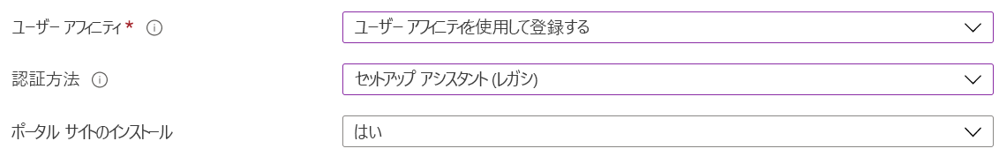

# Microsoft 365 の Microsoft 情報ガバナンス

>*[セキュリティとコンプライアンスのための Microsoft 365 ライセンス ガイダンス](/office365/servicedescriptions/microsoft-365-service-descriptions/microsoft-365-tenantlevel-services-licensing-guidance/microsoft-365-security-compliance-licensing-guidance)。*

Microsoft 情報ガバナンス (MIG と略されることもあります) 機能を使用して、コンプライアンスや規制の要件を満たすようにデータを管理します。

[ライセンスの観点](#licensing-requirements)から見ると、情報ガバナンス、レコード管理、データ コネクタの間にはかなりの重複がある可能性があります。 3 つの分野は、いずれも Microsoft 365 のデータの保持と削除をサポートします。 コネクタは、情報ガバナンスやレコード管理以外のコンプライアンス ソリューションで使用されます。 

次の図を使用して、コンプライアンス センターにそれぞれ独自のノードを持つこれら 3 つの異なるソリューションの構成可能なメイン コンポーネントを特定します。

データをセキュリティで保護するには、 「[Microsoft 365 の Microsoft Information Protection](information-protection.md)」を参照してください。

## 情報ガバナンス

以下のように、必要なものを保持し、不要なものを削除します。
 
|機能|解決される問題|作業の開始|
|:------|:------------|:--------------------|:-----------------------------|
|[Microsoft 365 ワークロードのアイテム保持ポリシー、例外の保持ラベル](retention.md) | メール、ドキュメント、Teams および Yammer メッセージのポリシー管理を使用したコンテンツの保持または削除 | [アイテム保持ポリシーを作成して構成する](create-retention-policies.md)    [アイテム保持ポリシーの例外の保持ラベルを作成する](create-retention-labels-information-governance.md)|
|[アーカイブ メールボックス](archive-mailboxes.md)| ユーザーに追加のメールボックス記憶領域を提供する | [アーカイブ メールボックスの有効化](enable-archive-mailboxes.md) |
|[非アクティブなメールボックス](inactive-mailboxes-in-office-365.md)| 従業員が組織を離れた後もメールボックスのコンテンツを保持して、このコンテンツに管理者、コンプライアンス責任者、レコード マネージャーが引き続きアクセスできるようにします | [非アクティブなメールボックスを作成および管理する](create-and-manage-inactive-mailboxes.md)|
|[PST ファイル向けサービスのインポート](importing-pst-files-to-office-365.md)| Exchange Online メールボックスに PST ファイルを一括インポートして、コンプライアンスや規制要件に対応してメールメッセージを保持し検索する | [ネットワーク アップロードを使用して、組織の PST ファイルを Microsoft 365 にインポートする](use-network-upload-to-import-pst-files.md)|

## レコード管理

法務、ビジネス、または規制上の義務のための価値の高いアイテムのライフサイクル管理

|機能|解決される問題|作業の開始|
|:------|:------------|---------------------|:----------------------------|
|[レコード管理](records-management.md)| 柔軟な保持と削除のスケジュールと要件を組み込み、必要に応じてレコードの宣言と防衛的廃棄を行うことで、コンテンツの全ライフサイクルをサポートする、メールとドキュメント用の単一のソリューション |[レコード管理の使用を開始する](get-started-with-records-management.md) |

## サード パーティ データのコネクタ

コンプライアンス ツールを、以下のソーシャル メディア プラットフォーム、インスタント メッセージング プラットフォーム、ドキュメント コラボレーション プラットフォームからインポートし、アーカイブしたサードパーティのデータに拡張します。

|機能|解決される問題|作業の開始|
|:------|:------------|:--------------------|:-----------------------------|
|[データ コネクタ](archiving-third-party-data.md)| ソーシャル メディア プラットフォーム、インスタント メッセージング プラットフォーム、ドキュメント コラボレーション プラットフォームからサードパーティのデータをインポートし、アーカイブして、コンプライアンス ソリューションを適用する| [サードパーティのコネクタ](archiving-third-party-data.md#third-party-data-connectors)|

## ライセンスの要件

Microsoft 情報ガバナンスのライセンス要件は、このページにリストされている各機能のライセンス要件を設定するのではなく、使用するシナリオと機能によって異なります。 ライセンス要件とオプションを理解するには、[Microsoft 365 ライセンス説明書](/office365/servicedescriptions/microsoft-365-service-descriptions/microsoft-365-tenantlevel-services-licensing-guidance/microsoft-365-security-compliance-licensing-guidance)の以下のセクションを参照してください。 
- [情報ガバナンス](/office365/servicedescriptions/microsoft-365-service-descriptions/microsoft-365-tenantlevel-services-licensing-guidance/microsoft-365-security-compliance-licensing-guidance#information-governance) 
- [レコード管理](/office365/servicedescriptions/microsoft-365-service-descriptions/microsoft-365-tenantlevel-services-licensing-guidance/microsoft-365-security-compliance-licensing-guidance#records-management) 
- [データ コネクタ](/office365/servicedescriptions/microsoft-365-service-descriptions/microsoft-365-tenantlevel-services-licensing-guidance/microsoft-365-security-compliance-licensing-guidance#data-connectors)

追加のライセンス要件は、ドキュメントの手順に含まれます。 たとえば、メールボックスの管理に特化したライセンスでは、Exchange Online からのライセンスが必要です。

