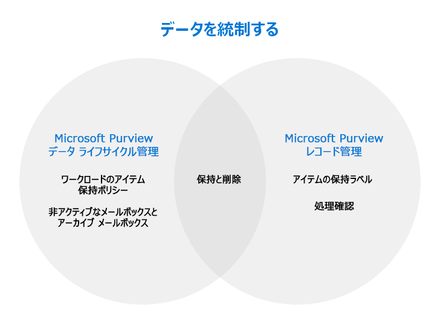

# Microsoft Purview を使用してデータを統制する

[!include[Purview banner](../includes/purview-rebrand-banner.md)]

>*[セキュリティとコンプライアンスのための Microsoft 365 ライセンス ガイダンス](/office365/servicedescriptions/microsoft-365-service-descriptions/microsoft-365-tenantlevel-services-licensing-guidance/microsoft-365-security-compliance-licensing-guidance)。*

**Microsoft Purview データ ライフサイクル管理** (以前の Microsoft Information Governance) と **Microsoft Purview レコード管理** の機能を使用し、コンプライアンスや規制要件に対応してデータを統制します。

[ライセンスの観点](#licensing-requirements)から見ると、データ ライフサイクル管理とレコード管理の間にはかなりの重複がある可能性があります。 どちらのソリューションも、Microsoft 365 アプリとサービスのデータの保持と削除をサポートしています。

次の図を使用すると、Microsoft Purview コンプライアンス ポータルにそれぞれ独自の構成項目を持つこれらのソリューションで、構成できる主なコンポーネントを特定できます。

データをセキュリティで保護するには、 「[Microsoft Purview を使用してデータを保護する](information-protection.md)」を参照してください。

## Microsoft Purview データ ライフサイクル管理

以下のように、必要なものを保持し、不要なものを削除します。
 
|機能|解決される問題|
|:------|:------------|:----------------|
|[Microsoft 365 ワークロードのアイテム保持ポリシー、例外の保持ラベル](retention.md) | メール、ドキュメント、Teams および Yammer メッセージのポリシー管理を使用したコンテンツの保持または削除ができます。 |
|[非アクティブなメールボックス](inactive-mailboxes-in-office-365.md)| 従業員が組織を離れた後もメールボックスのコンテンツを保持して、このコンテンツに管理者、コンプライアンス責任者、レコード マネージャーが引き続きアクセスできるようにします。 |
|[アーカイブ メールボックス](archive-mailboxes.md)| ユーザーに追加のメールボックス ストレージ スペースを提供します。|
|[PST ファイル向けサービスのインポート](importing-pst-files-to-office-365.md)| Exchange Online メールボックスへの PST ファイルの一括インポートをサポートし、コンプライアンスや規制要件に対応してメール メッセージを保持および検索できるようにします。 |

詳細な情報をご希望ですか? 「[データ ライフサイクル管理の詳細](data-lifecycle-management.md)」を参照してください。

これらの機能の一部またはすべての使用を開始する準備はできましたか? 「[データ ライフサイクル管理の使用を開始する](get-started-with-data-lifecycle-management.md)」を参照してください。

## Microsoft Purview レコード管理

ビジネス、法律、または規制の記録管理要件のために価値の高いアイテムを管理します。

|機能|解決される問題|
|:---------|:---------------------------|
|[ファイル計画](file-plan-manager.md)| 保持ラベルを対話的に作成したり、一括インポートしたり、分析用にエクスポートしたりできます。 ラベルは、ビジネスまたは規制の要件を特定して追跡するのに役立つ、追加の管理情報 (省略可能) をサポートしています。 |
|[個々のアイテムの保持ラベル、アイテム保持ポリシー (ベースライン保持期間に必要な場合)](retention.md)| ラベルは、必要に応じてレコード宣言を使用して手動または自動で適用できる、柔軟な保持期間と削除スケジュールをサポートしています。 |
|[処理確認と処理の証明](disposition.md)| コンテンツを完全に削除する前に手動で確認し、レコードの処理を証明します。|

詳細な情報をご希望ですか? 「[レコード管理の詳細](records-management.md)」を参照してください。

これらの機能の一部またはすべての使用を開始する準備はできましたか? 詳細については、「[レコード管理の概要](get-started-with-records-management.md)」を参照してください。

## ライセンスの要件

ライセンス要件とオプションを理解するには、[Microsoft 365 ライセンス説明書](/office365/servicedescriptions/microsoft-365-service-descriptions/microsoft-365-tenantlevel-services-licensing-guidance/microsoft-365-security-compliance-licensing-guidance)の以下のセクションを参照してください。 
- [Microsoft Purview データ ライフサイクル管理](/office365/servicedescriptions/microsoft-365-service-descriptions/microsoft-365-tenantlevel-services-licensing-guidance/microsoft-365-security-compliance-licensing-guidance#microsoft-purview-data-lifecycle-management)
- [Microsoft Purview レコード管理](/office365/servicedescriptions/microsoft-365-service-descriptions/microsoft-365-tenantlevel-services-licensing-guidance/microsoft-365-security-compliance-licensing-guidance#microsoft-purview-records-management)

追加のライセンス要件は、ドキュメントの手順に含まれます。 たとえば、メールボックスの管理に特化したライセンスでは、Exchange Online からのライセンスが必要です。