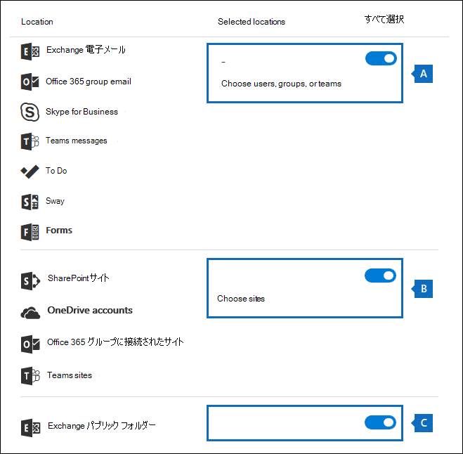

# <a name="manage-gdpr-data-subject-requests-with-the-dsr-case-tool-in-the-security--compliance-center"></a><span data-ttu-id="e2894-103">セキュリティ & コンプライアンスセンターで DSR ケースツールを使用して GDPR データ主体要求を管理する</span><span class="sxs-lookup"><span data-stu-id="e2894-103">Manage GDPR data subject requests with the DSR case tool in the Security & Compliance Center</span></span>

<span data-ttu-id="e2894-104">EU 一般データ保護規則 (GDPR) は、欧州連合 (EU) 内部で個人のプライバシー権を保護し、有効にすることについてのものです。</span><span class="sxs-lookup"><span data-stu-id="e2894-104">The EU General Data Protection Regulation (GDPR) is about protecting and enabling individuals' privacy rights inside the European Union (EU).</span></span> <span data-ttu-id="e2894-105">GDPR は、欧州連合 (データ対象者と呼ばれます) の各ユーザーに、個人データのアクセス、取得、修正、消去、および制限を行う権限を付与します。</span><span class="sxs-lookup"><span data-stu-id="e2894-105">The GDPR gives individuals in the European Union (known as data subjects) the right to access, retrieve, correct, erase, and restrict processing of their personal data.</span></span> <span data-ttu-id="e2894-106">GDPR の [個人データ] は、特定されたまたは特定の自然な人物に関する情報を意味します。</span><span class="sxs-lookup"><span data-stu-id="e2894-106">Under the GDPR, personal data means any information relating to an identified or identifiable natural person.</span></span> <span data-ttu-id="e2894-107">個人データに対するアクションを実行するために組織に対する正式な要求は、データ主体要求または DSR と呼ばれます。</span><span class="sxs-lookup"><span data-stu-id="e2894-107">A formal request by a person to their organization to take an action on their personal data is called a Data Subject Request or DSR.</span></span> <span data-ttu-id="e2894-108">Office 365 でのデータの DSRs への対応の詳細については、「 [office 365 データ主体要求ガイド](https://go.microsoft.com/fwlink/?linkid=871169 )」を参照してください。</span><span class="sxs-lookup"><span data-stu-id="e2894-108">For detailed information about responding to DSRs for data in Office 365, see [Office 365 Data Subject Request Guide](https://go.microsoft.com/fwlink/?linkid=871169 ).</span></span>
  
<span data-ttu-id="e2894-109">組織内のユーザーが送信した DSR に応答して調査を管理するには、セキュリティ & コンプライアンスセンターの DSR ケースツールを使用して、に格納されているコンテンツを検索します。</span><span class="sxs-lookup"><span data-stu-id="e2894-109">To manage investigations in response to a DSR submitted by a person in your organization, you can use the DSR case tool in the Security & Compliance Center to find content stored in:</span></span>
  
- <span data-ttu-id="e2894-110">組織内の任意のユーザーメールボックス。</span><span class="sxs-lookup"><span data-stu-id="e2894-110">Any user mailbox in your organization.</span></span> <span data-ttu-id="e2894-111">これには、Microsoft Teams での Skype for Business の会話と1対1のチャットが含まれます。</span><span class="sxs-lookup"><span data-stu-id="e2894-111">This includes Skype for Business conversations and one-to-one chats in Microsoft Teams</span></span>
    
- <span data-ttu-id="e2894-112">Microsoft 365 グループに関連付けられているすべてのメールボックスと、Microsoft Teams 内のすべてのチームメールボックス</span><span class="sxs-lookup"><span data-stu-id="e2894-112">All mailboxes associated with an Microsoft 365 Group and all team mailboxes in Microsoft Teams</span></span>
    
- <span data-ttu-id="e2894-113">組織内のすべての SharePoint サイトおよび OneDrive for Business アカウント</span><span class="sxs-lookup"><span data-stu-id="e2894-113">All SharePoint Online sites and OneDrive for Business accounts in your organization</span></span>
    
- <span data-ttu-id="e2894-114">組織内のすべての Teams サイトと Microsoft 365 グループサイト</span><span class="sxs-lookup"><span data-stu-id="e2894-114">All Teams sites and Microsoft 365 Group sites in your organization</span></span>
    
- <span data-ttu-id="e2894-115">Exchange Online のすべてのパブリック フォルダー</span><span class="sxs-lookup"><span data-stu-id="e2894-115">All public folders in Exchange Online</span></span>
    
<span data-ttu-id="e2894-116">DSR ケースツールを使用すると、次のことができます。</span><span class="sxs-lookup"><span data-stu-id="e2894-116">Using the DSR case tool you can:</span></span>
  
- <span data-ttu-id="e2894-117">DSR 調査ごとに個別のケースを作成する。</span><span class="sxs-lookup"><span data-stu-id="e2894-117">Create a separate case for each DSR investigation.</span></span>
    
- <span data-ttu-id="e2894-118">ユーザーをケースのメンバーとして追加することによって、DSR ケースにアクセスできるユーザーを制御します。セキュリティ & コンプライアンスセンターの [ **DSR ケース**] ページでは、メンバーのみがケースにアクセスできます。また、ケースはケースの一覧でのみ表示できます。</span><span class="sxs-lookup"><span data-stu-id="e2894-118">Control who has access to the DSR case by adding people as members of the case; only members can access the case and can only see their cases in the list of cases on the **DSR cases** page in the Security & Compliance Center.</span></span> <span data-ttu-id="e2894-119">また、同じケースの異なるメンバーに異なるアクセス許可を割り当てることもできます。</span><span class="sxs-lookup"><span data-stu-id="e2894-119">Also, you can assign different permissions to different members of the same case.</span></span> <span data-ttu-id="e2894-120">たとえば、一部のメンバーに対して、ケースおよび検索結果の表示のみを許可し、他のメンバーが検索を作成して検索結果をエクスポートできるようにすることができます。</span><span class="sxs-lookup"><span data-stu-id="e2894-120">For example, you can allow some members to only view the case and search results and allow other members to create searches and export search results.</span></span> 
    
- <span data-ttu-id="e2894-121">組み込み検索を使用して、特定のデータ主体によって作成またはアップロードされたすべてのコンテンツを検索します。</span><span class="sxs-lookup"><span data-stu-id="e2894-121">Use the built-in search to search for all content created or uploaded by a specific data subject.</span></span>
    
- <span data-ttu-id="e2894-122">必要に応じて、組み込みの検索クエリを修正し、検索を再実行して検索結果を絞り込みます。</span><span class="sxs-lookup"><span data-stu-id="e2894-122">Optionally revise the built-in search query and rerun the search to narrow the search results.</span></span>
    
- <span data-ttu-id="e2894-123">DSR ケースに関連付けられているその他のコンテンツ検索を追加します。</span><span class="sxs-lookup"><span data-stu-id="e2894-123">Add other content searches associated with the DSR case.</span></span> <span data-ttu-id="e2894-124">これには、Office ローミングサービスから、部分的にインデックス付けされたアイテムとシステム生成ログを返す検索を作成することが含まれます。</span><span class="sxs-lookup"><span data-stu-id="e2894-124">This includes creating searches that return partially indexed items and system-generated logs from the Office Roaming Service.</span></span>
    
- <span data-ttu-id="e2894-125">DSR へのアクセスまたはエクスポート要求に対する応答としてデータをエクスポートします。</span><span class="sxs-lookup"><span data-stu-id="e2894-125">Export data in response to a DSR access or export request.</span></span>
    
- <span data-ttu-id="e2894-126">DSR 調査プロセスが完了したときにケースを削除する。</span><span class="sxs-lookup"><span data-stu-id="e2894-126">Delete cases when the DSR investigation process is complete.</span></span> <span data-ttu-id="e2894-127">これにより、ケースに関連付けられたすべての検索とエクスポートジョブが削除されます。</span><span class="sxs-lookup"><span data-stu-id="e2894-127">This removes all searches and export jobs associated with the case.</span></span>
    
<span data-ttu-id="e2894-128">Dsr ケースツールを使用して DSR 調査を管理するための大まかなプロセスは次のとおりです。</span><span class="sxs-lookup"><span data-stu-id="e2894-128">Here's the high-level process for using the DSR case tool to manage DSR investigations:</span></span>
  
[<span data-ttu-id="e2894-129">手順 1: 潜在的なケースのメンバーに電子情報開示のアクセス許可を割り当てる</span><span class="sxs-lookup"><span data-stu-id="e2894-129">Step 1: Assign eDiscovery permissions to potential case members</span></span>](#step-1-assign-ediscovery-permissions-to-potential-case-members)

[<span data-ttu-id="e2894-130">手順 2: DSR ケースを作成してメンバーを追加する</span><span class="sxs-lookup"><span data-stu-id="e2894-130">Step 2: Create a DSR case and add members</span></span>](#step-2-create-a-dsr-case-and-add-members)

[<span data-ttu-id="e2894-131">手順 3: 検索クエリを実行する</span><span class="sxs-lookup"><span data-stu-id="e2894-131">Step 3: Run the search query</span></span>](#step-3-run-the-search-query)

[<span data-ttu-id="e2894-132">手順 4: データをエクスポートする</span><span class="sxs-lookup"><span data-stu-id="e2894-132">Step 4: Export the data</span></span>](#step-4-export-the-data)

[<span data-ttu-id="e2894-133">オプション手順 5: 組み込みの検索クエリを変更する</span><span class="sxs-lookup"><span data-stu-id="e2894-133">(Optional) Step 5: Revise the built-in search query</span></span>](#optional-step-5-revise-the-built-in-search-query)

[<span data-ttu-id="e2894-134">DSR ケースツールの使用に関する詳細情報</span><span class="sxs-lookup"><span data-stu-id="e2894-134">More information about using the DSR case tool</span></span>](#more-information-about-using-the-dsr-case-tool)
  
> [!IMPORTANT]
> <span data-ttu-id="e2894-135">ツールを使用すると、管理者は dsr のアクセスまたはエクスポート要求を実行できるようになります。これにより、DSR ケースツールに含まれる組み込みの検索とエクスポートの機能を利用できるようになります。</span><span class="sxs-lookup"><span data-stu-id="e2894-135">Our tools can help admins perform DSR access or export requests by enabling them to utilize the built-in search and export functionality found in the DSR case tool.</span></span> <span data-ttu-id="e2894-136">このツールは、データ主体によって送信された DSR 要求に関連するデータをエクスポートするためのベストエフォート方式を促進するのに役立ちます。</span><span class="sxs-lookup"><span data-stu-id="e2894-136">The tool helps to facilitate a best-effort method to export data that's relevant to a DSR request submitted by a data subject.</span></span> <span data-ttu-id="e2894-137">ただし、検索結果は、アイテムがエクスポート目的で "個人データ" と見なされるかどうかに影響を与える可能性のあるデータ主体または管理者のアクションによって異なる可能性があることに注意することが重要です。</span><span class="sxs-lookup"><span data-stu-id="e2894-137">However, it's important to note that search results can vary based on the data subject or the admin actions taken that may impact whether or not an item would be deemed as "personal data" for export purposes.</span></span> <span data-ttu-id="e2894-138">たとえば、データの件名が、作成していないファイルを最後に変更したユーザーである場合、そのファイルは検索結果に返されないことがあります。</span><span class="sxs-lookup"><span data-stu-id="e2894-138">For example, if the data subject was the last person to modify a file they didn't create, the file might not be returned in the search results.</span></span> <span data-ttu-id="e2894-139">同様に、管理者は、部分的にインデックス付けされたアイテムや SharePoint ドキュメントのすべてのバージョンを含めずにデータをエクスポートすることもできます。</span><span class="sxs-lookup"><span data-stu-id="e2894-139">Similarly, an admin could export data without including partially indexed items or all versions of SharePoint documents.</span></span> <span data-ttu-id="e2894-140">そのため、提供されているツールを使用すると、データ要求へのアクセスとエクスポートが容易になります。ただし、結果は特定の管理者およびデータ主体の使用シナリオの対象となります。</span><span class="sxs-lookup"><span data-stu-id="e2894-140">Therefore, the tools provided can help facilitate accessing and exporting data requests; however, the results are subject to specific admin and data subject usage scenarios.</span></span> 
  
## <a name="step-1-assign-ediscovery-permissions-to-potential-case-members"></a><span data-ttu-id="e2894-141">手順 1: 潜在的なケースのメンバーに電子情報開示のアクセス許可を割り当てる</span><span class="sxs-lookup"><span data-stu-id="e2894-141">Step 1: Assign eDiscovery permissions to potential case members</span></span>

<span data-ttu-id="e2894-142">既定では、全体管理者はセキュリティ & コンプライアンスセンターの DSR ケースツールにアクセスできます。</span><span class="sxs-lookup"><span data-stu-id="e2894-142">By default, a global administrator can access the DSR case tool in the Security & Compliance Center.</span></span> <span data-ttu-id="e2894-143">設計上、データプライバシー責任者、人事マネージャー、または DSR 調査に関わる他のユーザーは、DSR ケースツールへのアクセス権を持ちません。また、ツールにアクセスするための適切なアクセス許可を割り当てる必要があります。</span><span class="sxs-lookup"><span data-stu-id="e2894-143">By design, other users such as a data privacy officer, a human resources manager, or other people involved in DSR investigations don't have access to the DSR case tool and will have to be assigned the appropriate permissions to access the tool.</span></span> <span data-ttu-id="e2894-144">これを行うには、セキュリティ & コンプライアンスセンターの [**アクセス許可**] ページに移動して、電子情報開示マネージャーの役割グループにユーザーを追加するのが最も簡単な方法です。</span><span class="sxs-lookup"><span data-stu-id="e2894-144">The easiest way to do this is to go to the **Permissions** page in the Security & Compliance Center and add users to the eDiscovery Manager role group.</span></span> <span data-ttu-id="e2894-145">また、手順2で作成した DSR ケースのメンバーとして追加できるように、これらのアクセス許可を割り当てる必要があります。</span><span class="sxs-lookup"><span data-stu-id="e2894-145">You also have to assign these permissions so you can add them as members of the DSR case that you create in Step 2.</span></span> 
  
<span data-ttu-id="e2894-146">詳細な手順については、「 [Office 365 セキュリティ & コンプライアンスセンターで電子情報開示のアクセス許可を割り当てる](assign-ediscovery-permissions.md)」を参照してください。</span><span class="sxs-lookup"><span data-stu-id="e2894-146">For step-by-step instructions, see [Assign eDiscovery permissions in the Office‍ 365 Security & Compliance Center](assign-ediscovery-permissions.md).</span></span>
  
> [!NOTE]
> <span data-ttu-id="e2894-147">既定では、全体管理者 (またはセキュリティ & コンプライアンスセンターの組織の管理役割グループの他のメンバーには、コンテンツ検索結果をエクスポートするために必要なアクセス許可がありません (この記事の手順4を参照)。</span><span class="sxs-lookup"><span data-stu-id="e2894-147">By default, a global administrator (or other members of the Organization Management role group in the Security & Compliance Center don't have the necessary permissions to export Content Search results (see Step 4 in this article).</span></span> <span data-ttu-id="e2894-148">これを解決するために、管理者は自分自身を電子情報開示マネージャーの役割グループのメンバーとして追加できます。</span><span class="sxs-lookup"><span data-stu-id="e2894-148">To address this, an admin can add themselves as a member of the eDiscovery Manager role group.</span></span> 
  
## <a name="step-2-create-a-dsr-case-and-add-members"></a><span data-ttu-id="e2894-149">手順 2: DSR ケースを作成してメンバーを追加する</span><span class="sxs-lookup"><span data-stu-id="e2894-149">Step 2: Create a DSR case and add members</span></span>

<span data-ttu-id="e2894-150">次の手順では、DSR ケースを作成します。</span><span class="sxs-lookup"><span data-stu-id="e2894-150">The next step is to create a DSR case.</span></span> <span data-ttu-id="e2894-151">ケースを作成する場合、組み込み検索を開始するか、検索を開始せずにケースを作成するかを選択できます。</span><span class="sxs-lookup"><span data-stu-id="e2894-151">When you create a case, you can choose to start the built-in search or you can create the case without starting the search.</span></span> <span data-ttu-id="e2894-152">次の手順では、検索を開始せずにケースを作成するように指示し、ケースにメンバーを追加する方法を示します。</span><span class="sxs-lookup"><span data-stu-id="e2894-152">The following procedure instructs you to create the case without starting the search and then show you how to add members to the case.</span></span>
  
1. <span data-ttu-id="e2894-153">に移動 [https://protection.office.com](https://protection.office.com) し、職場または学校のアカウントを使用してサインインします。</span><span class="sxs-lookup"><span data-stu-id="e2894-153">Go to [https://protection.office.com](https://protection.office.com) and sign in using your work or school account.</span></span> 
    
2. <span data-ttu-id="e2894-154">[セキュリティ & コンプライアンスセンター] で、[**データプライバシー**データの件名の要求] をクリックし、[ \> **Data subject requests**  **新しい DSR ケース**を追加する] をクリックします。</span><span class="sxs-lookup"><span data-stu-id="e2894-154">In the Security & Compliance Center, click **Data privacy** \> **Data subject requests**, and then click  **New DSR case**.</span></span>
    
3. <span data-ttu-id="e2894-155">[**新しい DSR ケース**のポップアップ] ページで、ケースに名前を付け、オプションの説明を入力して、[**次へ**] をクリックします。</span><span class="sxs-lookup"><span data-stu-id="e2894-155">On the **New DSR case** flyout page, give the case a name, type an optional description, and then click **Next**.</span></span> <span data-ttu-id="e2894-156">ケースの名前は組織内で一意である必要があります。</span><span class="sxs-lookup"><span data-stu-id="e2894-156">The name of the case must be unique in your organization.</span></span>
    
    > [!TIP]
    > <span data-ttu-id="e2894-157">調査している DSR 要求を送信したユーザーの名前を、新しいケースの名前や説明に追加することを検討してください。</span><span class="sxs-lookup"><span data-stu-id="e2894-157">Consider adding the name of the person who submitted the DSR request that you're investigating in the name and/or description of the new case.</span></span> <span data-ttu-id="e2894-158">このケース (および電子情報開示管理者) のメンバーのみが、[**データ主体要求**] ページのケースの一覧でケースを表示できることに注意してください。</span><span class="sxs-lookup"><span data-stu-id="e2894-158">Note that only members of this case (and eDiscovery Administrators) will be able to see the case in the list of cases on the **Data subject requests** page.</span></span> 
  
4. <span data-ttu-id="e2894-159">[**要求の詳細**] ページの [**データの件名 (この要求を提出したユーザー)**] で、データを検索してエクスポートするユーザーを選択し、[**次へ**] をクリックします。</span><span class="sxs-lookup"><span data-stu-id="e2894-159">On the **Request details** page, under **Data subject (the person who filed this request)**, select the person that you want to find and export data for and then click **Next**.</span></span>
    
5. <span data-ttu-id="e2894-160">[**ケースの設定の確認**] ページで、ケースの名前と説明を変更し、別のデータ主体を選択できます。</span><span class="sxs-lookup"><span data-stu-id="e2894-160">On the **Confirm your case settings** page, you can change the case name and description, and select a different data subject.</span></span> <span data-ttu-id="e2894-161">それ以外の場合は、[**保存**] をクリックします。</span><span class="sxs-lookup"><span data-stu-id="e2894-161">Otherwise, click **Save**.</span></span>
    
    <span data-ttu-id="e2894-162">新しい DSR ケースが作成されたことを確認するページが表示されます。</span><span class="sxs-lookup"><span data-stu-id="e2894-162">A page is displayed that confirms the new DSR case has been created.</span></span>
    
    ![検索を開始するか、[新しい DSR ケース] ページを閉じます。](../media/b5e62c2c-cafe-4a8d-a38c-789ed9f9ccbd.png)
  
    <span data-ttu-id="e2894-164">この時点で、次の2つの操作のいずれかを実行できます。</span><span class="sxs-lookup"><span data-stu-id="e2894-164">At this point, you can do one of two things:</span></span>
    
    <span data-ttu-id="e2894-165">a.</span><span class="sxs-lookup"><span data-stu-id="e2894-165">a.</span></span> <span data-ttu-id="e2894-166">[**検索結果の表示] を**クリックすると、検索が開始されます。</span><span class="sxs-lookup"><span data-stu-id="e2894-166">Clicking **Show me search results** starts the search.</span></span> <span data-ttu-id="e2894-167">これは既定の選択です。</span><span class="sxs-lookup"><span data-stu-id="e2894-167">This is the default selection.</span></span> <span data-ttu-id="e2894-168">このオプションを選択したときに実行される組み込みの検索は、手順3で説明されています。</span><span class="sxs-lookup"><span data-stu-id="e2894-168">The built-in search that's run when you select this option and the results that are returned are discussed in Step 3.</span></span>
    
    <span data-ttu-id="e2894-169">b.</span><span class="sxs-lookup"><span data-stu-id="e2894-169">b.</span></span> <span data-ttu-id="e2894-170">[**完了**] をクリックすると、組み込み検索を開始せずに新しい DSR ケースが閉じられます。</span><span class="sxs-lookup"><span data-stu-id="e2894-170">Clicking **Finish** closes the new DSR case without starting the built-in search.</span></span> <span data-ttu-id="e2894-171">このオプションを選択すると、新しい DSR ケースが [**データ主体要求**] ページに表示されます。</span><span class="sxs-lookup"><span data-stu-id="e2894-171">When you select this option, the new DSR case is displayed on the **Data subject requests** page.</span></span>
    
6. <span data-ttu-id="e2894-172">[**完了**] をクリックして、新しい DSR ケースに移動して、メンバーを追加できるようにします。</span><span class="sxs-lookup"><span data-stu-id="e2894-172">Click **Finish** so that you can go in to the new DSR case and add members to it.</span></span> 
    
7. <span data-ttu-id="e2894-173">[**データ主体要求**] ページで、作成した DSR ケースの名前をクリックします。</span><span class="sxs-lookup"><span data-stu-id="e2894-173">On the **Data subject requests** page, click the name of the DSR case that you created.</span></span> 
    
8. <span data-ttu-id="e2894-174">[**このケースの管理**] ページの [**メンバーの管理**] で、[**追加**] をクリックします。</span><span class="sxs-lookup"><span data-stu-id="e2894-174">On the **Manage this case** flyout page, under **Manage members**, click **Add**.</span></span> 
    
    <span data-ttu-id="e2894-175">[**ユーザー**] の下に、適切な電子情報開示のアクセス許可が割り当てられているユーザーの一覧が表示されます。</span><span class="sxs-lookup"><span data-stu-id="e2894-175">Under **Users**, a list of people that are assigned the appropriate eDiscovery permissions is displayed.</span></span> <span data-ttu-id="e2894-176">手順1で電子情報開示のアクセス許可を割り当てたユーザーが、この一覧に表示されます。</span><span class="sxs-lookup"><span data-stu-id="e2894-176">The people you assigned eDiscovery permissions to in Step 1 will be displayed in this list.</span></span> 
    
9. <span data-ttu-id="e2894-177">DSR ケースのメンバーとして追加するユーザーを選択し、[**追加**] をクリックして、変更を保存します。</span><span class="sxs-lookup"><span data-stu-id="e2894-177">Select the people to add as members of the DSR case, click **Add**, and then save your changes.</span></span>
    
    <span data-ttu-id="e2894-178">[**役割グループの管理**] の下にある [**追加**] をクリックして、DSR ケースのメンバーとして役割グループを追加することもできます。</span><span class="sxs-lookup"><span data-stu-id="e2894-178">You can also add role groups as members of DSR case by clicking **Add** under **Manage role groups**.</span></span> 
    
## <a name="step-3-run-the-search-query"></a><span data-ttu-id="e2894-179">手順 3: 検索クエリを実行する</span><span class="sxs-lookup"><span data-stu-id="e2894-179">Step 3: Run the search query</span></span>

<span data-ttu-id="e2894-180">DSR ケースを作成してメンバーを追加した後、次の手順では、ケースに関連付けられている組み込み検索を実行します。</span><span class="sxs-lookup"><span data-stu-id="e2894-180">After you create a DSR case and add members, the next step is to run the built-in search that's associated with the case.</span></span> <span data-ttu-id="e2894-181">この既定の検索クエリでは、次の処理が行われます。</span><span class="sxs-lookup"><span data-stu-id="e2894-181">This default search query does the following things:</span></span>
  
- <span data-ttu-id="e2894-182">組織内のすべてのメールボックスで、データ主体によって送受信されたすべての電子メールアイテムを検索します。</span><span class="sxs-lookup"><span data-stu-id="e2894-182">Searches all mailboxes in your organization for all email items that were sent or received by the data subject.</span></span> <span data-ttu-id="e2894-183">これは、*参加者*の電子メールプロパティを使用して実行されます。このプロパティは、電子メールメッセージ内のすべての人物フィールドのデータ主体を検索します。</span><span class="sxs-lookup"><span data-stu-id="e2894-183">This is accomplished by using the  *Participants*  email property, which searches for the data subject in all the people fields in an email message.</span></span> <span data-ttu-id="e2894-184">このプロパティは、データの件名が**From**、 **To**、 **CC**、および**BCC**の各フィールドに含まれるアイテムを返します。</span><span class="sxs-lookup"><span data-stu-id="e2894-184">This property returns items in which the data subject is in the **From**, **To**, **CC**, and **BCC** fields.</span></span> <span data-ttu-id="e2894-185">Exchange Online のパブリックフォルダーも、データ主体によって送受信されたメッセージを検索します。</span><span class="sxs-lookup"><span data-stu-id="e2894-185">Public folders in Exchange Online are also searched for messages sent or received by the data subject.</span></span> 
    
- <span data-ttu-id="e2894-186">組織内のすべてのサイトで、データ主体によって作成またはアップロードされたドキュメントとアイテムを検索します。</span><span class="sxs-lookup"><span data-stu-id="e2894-186">Searches all sites in your organization for documents and items created or uploaded by the data subject.</span></span> <span data-ttu-id="e2894-187">これは、次のサイトプロパティを使用して実現されます。</span><span class="sxs-lookup"><span data-stu-id="e2894-187">This is accomplished by using the following site properties:</span></span>
    
  - <span data-ttu-id="e2894-188">*Author*プロパティは、Office ドキュメントの author フィールドにデータの件名が表示されているアイテムを返します。</span><span class="sxs-lookup"><span data-stu-id="e2894-188">The  *Author*  property returns items where the data subject is listed in the author field in Office documents.</span></span> <span data-ttu-id="e2894-189">この値は、ドキュメントが他のユーザーによってコピーおよびアップロードされた場合でも保持されます。</span><span class="sxs-lookup"><span data-stu-id="e2894-189">This value persists, even if the document is copied and uploaded by someone else.</span></span> 
    
  - <span data-ttu-id="e2894-190">*CreatedBy*プロパティは、データ主体によって作成またはアップロードされたアイテムを返します。</span><span class="sxs-lookup"><span data-stu-id="e2894-190">The  *CreatedBy*  property returns items that were created or uploaded by the data subject.</span></span> 
    
<span data-ttu-id="e2894-191">DSR ケースの作成時に自動的に作成される、組み込み検索のキーワードクエリは次のようになります。</span><span class="sxs-lookup"><span data-stu-id="e2894-191">Here's what the keyword query looks like for the built-in search that gets automatically created when you create a DSR case.</span></span>
  
```powershell
participants:"<email address>" OR author:"<display name>" OR createdby:"<display name>"
```

<span data-ttu-id="e2894-192">たとえば、データの件名の名前が Leonte の場合、キーワードクエリは次のようになります。</span><span class="sxs-lookup"><span data-stu-id="e2894-192">For example, if the name of the data subject is Ina Leonte, the keyword query would look like this:</span></span>
  
```powershell
participants:"ina@contoso.com" OR author:"Ina Leonte" OR createdby:"Ina Leonte"
```

 <span data-ttu-id="e2894-193">**DSR ケースの組み込み検索を実行するには、次のようにします。**</span><span class="sxs-lookup"><span data-stu-id="e2894-193">**To run the built-in search for a DSR case:**</span></span>
  
1. <span data-ttu-id="e2894-194">[セキュリティ & コンプライアンスセンター] で、[**データプライバシー**データの件名の要求] をクリックし、 \> **Data subject requests**手順2で作成した DSR の横にある [**開く**] をクリックします。</span><span class="sxs-lookup"><span data-stu-id="e2894-194">In the Security & Compliance Center, click **Data privacy** \> **Data subject requests**, and then click **Open** next to the DSR case that you created in Step 2.</span></span> 
    
    <span data-ttu-id="e2894-195">ページの上部にある [**検索**] タブをクリックし、DSR ケースを作成したときに作成された組み込み検索の横にあるチェックボックスをオンにします。</span><span class="sxs-lookup"><span data-stu-id="e2894-195">Click the **Search** tab at the top of the page, and then click the checkbox next to the built-in search that was created when you created the DSR case.</span></span> <span data-ttu-id="e2894-196">この検索には、DSR ケースと同じ名前が付いています。</span><span class="sxs-lookup"><span data-stu-id="e2894-196">The search has the same name as the DSR case.</span></span> 
    
2. <span data-ttu-id="e2894-197">[検索] ポップアップページで、[**クエリを開く**] をクリックします。</span><span class="sxs-lookup"><span data-stu-id="e2894-197">In the search flyout page, click **Open query**.</span></span>
    
    <span data-ttu-id="e2894-198">クエリを開くと、検索が開始され、しばらくして完了します。</span><span class="sxs-lookup"><span data-stu-id="e2894-198">When you open the query, the search is started and will complete in a few moments.</span></span> 
    
3. <span data-ttu-id="e2894-199">検索が完了したら、[**結果のプレビュー** ] をクリックして検索結果をプレビューします。</span><span class="sxs-lookup"><span data-stu-id="e2894-199">When the search is complete, click **Preview results** to preview the search results.</span></span> <span data-ttu-id="e2894-200">詳細については、「[検索結果のプレビュー](content-search.md#preview-search-results)」を参照してください。</span><span class="sxs-lookup"><span data-stu-id="e2894-200">For more information, see [Preview search results](content-search.md#preview-search-results).</span></span>
    
    > [!TIP]
    > <span data-ttu-id="e2894-201">検索クエリの統計を表示して、検索によって返されるメールボックスおよびサイトアイテムの数と、検索クエリに一致するアイテムを含む上位のコンテンツの場所を確認することもできます。</span><span class="sxs-lookup"><span data-stu-id="e2894-201">You can also view the search query statistics to see the number of mailbox and site items that are returned by the search, and the top content locations that contain items that match the search query.</span></span> <span data-ttu-id="e2894-202">詳細については、「[検索に関する情報と統計情報を表示する](content-search.md#view-information-and-statistics-about-a-search)」を参照してください。</span><span class="sxs-lookup"><span data-stu-id="e2894-202">For more information, see [View information and statistics about a search](content-search.md#view-information-and-statistics-about-a-search).</span></span> 
  
<span data-ttu-id="e2894-203">組み込みの検索クエリを編集し、検索するコンテンツの場所を変更した後、検索を再実行できます。</span><span class="sxs-lookup"><span data-stu-id="e2894-203">You can edit the built-in search query, change the content locations that are searched, and then rerun the search.</span></span> <span data-ttu-id="e2894-204">詳細については、「 [Step 5](#optional-step-5-revise-the-built-in-search-query) 」を参照してください。</span><span class="sxs-lookup"><span data-stu-id="e2894-204">See [Step 5](#optional-step-5-revise-the-built-in-search-query) for more information.</span></span> 
  
## <a name="step-4-export-the-data"></a><span data-ttu-id="e2894-205">手順 4: データをエクスポートする</span><span class="sxs-lookup"><span data-stu-id="e2894-205">Step 4: Export the data</span></span>

<span data-ttu-id="e2894-206">組み込み検索を実行した後、検索結果をエクスポートすることができます。</span><span class="sxs-lookup"><span data-stu-id="e2894-206">After you run the built-in search, you can export the search results.</span></span> <span data-ttu-id="e2894-207">または、データをエクスポートする前に、クエリを変更して検索結果の数を減らす必要がある場合があります。</span><span class="sxs-lookup"><span data-stu-id="e2894-207">Alternatively, before you export the data, you may want to revise the query to reduce the number of search results.</span></span> <span data-ttu-id="e2894-208">検索結果の絞り込みの詳細については、手順5を参照してください。</span><span class="sxs-lookup"><span data-stu-id="e2894-208">See Step 5 for more information about narrowing the search results.</span></span>
  
<span data-ttu-id="e2894-209">検索結果をエクスポートすると、メールボックスアイテムを PST ファイルまたは個別のメッセージとしてダウンロードできます。</span><span class="sxs-lookup"><span data-stu-id="e2894-209">When you export search results, mailbox items can be downloaded in PST files or as individual messages.</span></span> <span data-ttu-id="e2894-210">SharePoint と OneDrive のアカウントからコンテンツをエクスポートすると、ネイティブの Office ドキュメントとその他のドキュメントのコピーがエクスポートされます。</span><span class="sxs-lookup"><span data-stu-id="e2894-210">When you export content from SharePoint and OneDrive accounts, copies of native Office documents and other documents are exported.</span></span> <span data-ttu-id="e2894-211">エクスポートされたすべてのアイテムに関する情報を含む結果ファイルが検索結果に含まれています。</span><span class="sxs-lookup"><span data-stu-id="e2894-211">A results file that contains information about every exported item is included with the search results.</span></span> <span data-ttu-id="e2894-212">エクスポートの詳細については、「[コンテンツ検索の結果をエクスポート](export-search-results.md)する」を参照してください。</span><span class="sxs-lookup"><span data-stu-id="e2894-212">For more detailed information about exporting, see [Export Content Search results](export-search-results.md).</span></span>
  
> [!NOTE]
> <span data-ttu-id="e2894-213">既定では、全体管理者 (またはセキュリティ & コンプライアンスセンターの組織の管理役割グループの他のメンバー) は、コンテンツ検索の結果をエクスポートするために必要なアクセス許可を持っていません。</span><span class="sxs-lookup"><span data-stu-id="e2894-213">By default, a global administrator (or other members of the Organization Management role group in the Security & Compliance Center) don't have the necessary permissions to export Content Search results.</span></span> <span data-ttu-id="e2894-214">これを解決するために、管理者は自分自身を電子情報開示マネージャーの役割グループのメンバーとして追加できます。</span><span class="sxs-lookup"><span data-stu-id="e2894-214">To address this, an admin can add themselves as a member of the eDiscovery Manager role group.</span></span> 
  
<span data-ttu-id="e2894-215">データのエクスポートに使用するコンピューターは、次のシステム要件を満たしている必要があります。</span><span class="sxs-lookup"><span data-stu-id="e2894-215">The computer you use to export data has to meet the following system requirements:</span></span>
  
- <span data-ttu-id="e2894-216">32ビットまたは64ビット版の Windows 7 以降のバージョン</span><span class="sxs-lookup"><span data-stu-id="e2894-216">32-bit or 64-bit versions of Windows 7 and later versions</span></span>
    
- <span data-ttu-id="e2894-217">Microsoft .NET Framework 4.7</span><span class="sxs-lookup"><span data-stu-id="e2894-217">Microsoft .NET Framework 4.7</span></span>
    
- <span data-ttu-id="e2894-218">サポートされているブラウザー:</span><span class="sxs-lookup"><span data-stu-id="e2894-218">A supported browser:</span></span>
    
  - <span data-ttu-id="e2894-219">Microsoft Edge</span><span class="sxs-lookup"><span data-stu-id="e2894-219">Microsoft Edge</span></span>
    
    <span data-ttu-id="e2894-220">または</span><span class="sxs-lookup"><span data-stu-id="e2894-220">Or</span></span>
    
  - <span data-ttu-id="e2894-221">Microsoft Internet Explorer 10 以降のバージョン</span><span class="sxs-lookup"><span data-stu-id="e2894-221">Microsoft Internet Explorer 10 and later versions</span></span>
    
    > [!NOTE]
    > <span data-ttu-id="e2894-222">Microsoft は、ClickOnce アプリケーションのサードパーティの拡張機能またはアドオンを製造していません。</span><span class="sxs-lookup"><span data-stu-id="e2894-222">Microsoft doesn't manufacture third-party extensions or add-ons for ClickOnce applications.</span></span> <span data-ttu-id="e2894-223">サポートされていないブラウザーを使用して、サードパーティの内線番号またはアドオンと共にデータをエクスポートすることはできません。</span><span class="sxs-lookup"><span data-stu-id="e2894-223">Exporting data using an unsupported browser with third-party extensions or add-ons isn't supported.</span></span> 
  
 <span data-ttu-id="e2894-224">**DSR ケースの組み込み検索からデータをエクスポートするには、次のようにします。**</span><span class="sxs-lookup"><span data-stu-id="e2894-224">**To export data from the built-in search in a DSR case:**</span></span>
  
1. <span data-ttu-id="e2894-225">[セキュリティ & コンプライアンスセンター] で、[**データプライバシー**データの件名の要求] をクリックし、 \> **Data subject requests**データのエクスポート元となる DSR ケースの横にある [**開く**] をクリックします。</span><span class="sxs-lookup"><span data-stu-id="e2894-225">In the Security & Compliance Center, click **Data privacy** \> **Data subject requests**, and then click **Open** next to the DSR case that you want to export data from.</span></span> 
    
2. <span data-ttu-id="e2894-226">ページの上部にある [**検索**] タブをクリックし、DSR ケースを作成したときに作成された組み込み検索の横にあるチェックボックスをオンにします。</span><span class="sxs-lookup"><span data-stu-id="e2894-226">Click the **Search** tab at the top of the page, and then click the checkbox next to the built-in search that was created when you created the DSR case.</span></span> <span data-ttu-id="e2894-227">または、別の検索をクリックして、その検索からデータをエクスポートします。</span><span class="sxs-lookup"><span data-stu-id="e2894-227">Or click another search to export data from that search.</span></span> 
    
3. <span data-ttu-id="e2894-228">検索ポップアップページで、[検索結果アイコンのエクスポート] をクリックし、  **More**ドロップダウンリストから [**結果のエクスポート**] を選択します。</span><span class="sxs-lookup"><span data-stu-id="e2894-228">On the search flyout page, click  **More**, and then select **Export results** from the drop-down list.</span></span> 
    
4. <span data-ttu-id="e2894-229">[**結果のエクスポート**] ページで、DSR エクスポート要求に対して次の推奨オプションを選択します。</span><span class="sxs-lookup"><span data-stu-id="e2894-229">On the **Export results** page, select the following recommended options for DSR export requests.</span></span> 
    
    
  
    <span data-ttu-id="e2894-231">a.</span><span class="sxs-lookup"><span data-stu-id="e2894-231">a.</span></span> <span data-ttu-id="e2894-232">インデックス付きアイテムのみをエクスポートする場合は、[**出力オプション**] で、最初のオプション (**認識できない形式のアイテム、暗号化されていない、またはその他の理由でインデックスが付けられ**ていないものを除く) を選択します。</span><span class="sxs-lookup"><span data-stu-id="e2894-232">Under **Output options**, select the first option (**All items, excluding ones that have ones that have an unrecognized format, are encrypted, or weren't indexed for other reasons**) to export indexed items only.</span></span> <span data-ttu-id="e2894-233">組み込み検索から、部分的にインデックス付けされたアイテムをエクスポートしない理由は、他のユーザーからの部分的なインデックス付きアイテムもエクスポートされるためです。</span><span class="sxs-lookup"><span data-stu-id="e2894-233">The reason you don't want to export partially indexed items from the built-in search is because partially indexed items from other users will also be exported.</span></span> <span data-ttu-id="e2894-234">データ主体に対して、部分的にインデックスが作成されたアイテムのみをエクスポートするには、別の検索を作成することをお勧めします。</span><span class="sxs-lookup"><span data-stu-id="e2894-234">To export only the partially indexed items for the data subject, we recommend that you create a separate search.</span></span> <span data-ttu-id="e2894-235">詳細については、「DSR ケースツールの使用に関する詳細情報」の「インデックスが作成された[アイテムをエクスポート](#exporting-partially-indexed-items)する」を参照してください。</span><span class="sxs-lookup"><span data-stu-id="e2894-235">For more information, see [Exporting partially indexed items](#exporting-partially-indexed-items) in the "More information about using the DSR case tool" section.</span></span>
    
    <span data-ttu-id="e2894-236">b.</span><span class="sxs-lookup"><span data-stu-id="e2894-236">b.</span></span> <span data-ttu-id="e2894-237">[ **Exchange コンテンツのエクスポート**] で、3つのオプション (**すべてのメッセージを含む1つの PST ファイル**) を1つのフォルダーに選択します。</span><span class="sxs-lookup"><span data-stu-id="e2894-237">Under **Export Exchange content as**, select the third option, **One PST file containing all messages in a single folder**.</span></span> <span data-ttu-id="e2894-238">結果の一部は別のユーザーのメールボックス内のアイテムに対して行われることがあるため、このオプションを使用すると、実際のメールボックスを示さずに1つのフォルダー内のアイテムを一覧表示することができます。また、次のアイテムで推奨されたとおりに結果を除外する場合に最適なオプションです。</span><span class="sxs-lookup"><span data-stu-id="e2894-238">Because some of the results may be for items that originated in another user's mailbox, this option just lists the item in a single folder without indicating the actual mailbox and is the best option to use when you de-duplicate the results as recommended in the next item.</span></span> <span data-ttu-id="e2894-239">また、このオプションを使用すると、アイテムごとに元のメールボックスフォルダー構造を移動しなくても、データの件名が日付順に表示されます (アイテムは送信日で並べ替えられます)。</span><span class="sxs-lookup"><span data-stu-id="e2894-239">This option also lets the data subject review items in chronological order (items are sorted by sent date) without having to navigate the original mailbox folder structure for each item.</span></span>
    
    <span data-ttu-id="e2894-240">c.</span><span class="sxs-lookup"><span data-stu-id="e2894-240">c.</span></span> <span data-ttu-id="e2894-241">重複した電子メールメッセージを除外するには、[重複**除外を有効**にする] オプションを選択します。</span><span class="sxs-lookup"><span data-stu-id="e2894-241">Select **Enable de-duplication** option to excludes duplicate email messages.</span></span> <span data-ttu-id="e2894-242">組み込みの検索では、組織内のすべてのメールボックスを検索するため、このオプションをお勧めします。</span><span class="sxs-lookup"><span data-stu-id="e2894-242">We recommend this option because the built-in search searches all mailboxes in your organization.</span></span> <span data-ttu-id="e2894-243">そのため、同じメッセージの複数のコピーが検索されたメールボックス内にある場合、このオプションは、メッセージのコピーが1つだけエクスポートされることを意味します。</span><span class="sxs-lookup"><span data-stu-id="e2894-243">So if multiple copies of the same message are found in the mailboxes that were searched, this option means that only one copy of a message will be exported.</span></span> <span data-ttu-id="e2894-244">このオプションを使用すると、1つのフォルダーにメッセージが1つの PST ファイルにエクスポートされ、DSR のエクスポート要求に対するユーザーの操作が最適になります。</span><span class="sxs-lookup"><span data-stu-id="e2894-244">This option, together will exporting messages in one PST file in a single folder, results in the best user experience for DSR export requests.</span></span> <span data-ttu-id="e2894-245">Results.csv エクスポートレポートには、重複メッセージが見つかったすべての場所の一覧が表示されます。</span><span class="sxs-lookup"><span data-stu-id="e2894-245">The Results.csv export report lists all locations where duplicate messages were found.</span></span>
    
    <span data-ttu-id="e2894-246">必要に応じて、[sharepoint**ドキュメントにバージョンを含める**] オプションを選択して、Sharepoint および OneDrive ドキュメントのすべてのバージョンをエクスポートすることもできます。</span><span class="sxs-lookup"><span data-stu-id="e2894-246">Optionally, you can select **Include versions for SharePoint documents** option to export all versions of SharePoint and OneDrive documents.</span></span> <span data-ttu-id="e2894-247">そのためには、ドキュメントライブラリに対してバージョン管理が有効になっている必要があります。</span><span class="sxs-lookup"><span data-stu-id="e2894-247">This requires that versioning is turned on for document libraries.</span></span> <span data-ttu-id="e2894-248">このオプションを使用すると、関連するすべてのデータを確実にエクスポートできます。</span><span class="sxs-lookup"><span data-stu-id="e2894-248">This option helps to ensure that all relevant data is exported.</span></span>
    
5. <span data-ttu-id="e2894-249">エクスポート設定を選択したら、[**エクスポート**] をクリックします。</span><span class="sxs-lookup"><span data-stu-id="e2894-249">After you choose the export settings, click **Export**.</span></span>
    
    <span data-ttu-id="e2894-250">検索結果はダウンロード用に準備されています。これは、Microsoft クラウドの組織の Azure ストレージ領域にアップロードされることを意味します。</span><span class="sxs-lookup"><span data-stu-id="e2894-250">The search results are prepared for downloading, which means they're uploaded to the Azure Storage area for your organization in the Microsoft cloud.</span></span> <span data-ttu-id="e2894-251">次の手順では、このデータをローカルコンピューターにダウンロードする方法について説明します。</span><span class="sxs-lookup"><span data-stu-id="e2894-251">The next steps show you how to download this data to your local computer.</span></span>
    
6. <span data-ttu-id="e2894-252">[**エクスポート**] タブをクリックして、作成したエクスポートジョブを表示します。</span><span class="sxs-lookup"><span data-stu-id="e2894-252">Click the **Export** tab to display the export job you created.</span></span> <span data-ttu-id="e2894-253">エクスポートジョブには、検索名の末尾に **_Export**が追加された対応する検索と同じ名前が付けられます。</span><span class="sxs-lookup"><span data-stu-id="e2894-253">Export jobs have the same name as the corresponding search with **_Export** appended to the end of search name.</span></span> 
    
7. <span data-ttu-id="e2894-254">作成したエクスポートジョブをクリックして、[エクスポート] フライアウトページを表示します。</span><span class="sxs-lookup"><span data-stu-id="e2894-254">Click the export job that you just created to display the export flyout page.</span></span> <span data-ttu-id="e2894-255">このページには、エクスポートされるアイテムのサイズと合計数、および Azure ストレージ領域に転送されたアイテムの割合など、検索に関する情報が表示されます。</span><span class="sxs-lookup"><span data-stu-id="e2894-255">This page shows information about the search, such as the size and total number of items to be exported, and the percentage of the items that have been transferred to an Azure storage area.</span></span> <span data-ttu-id="e2894-256">[**更新**] をクリックして、アップロードの状態情報を更新します。</span><span class="sxs-lookup"><span data-stu-id="e2894-256">Click **Refresh** to update the upload status information.</span></span> 
    
8. <span data-ttu-id="e2894-257">**[エクスポート キー]** で、**[クリップボードにコピー]** をクリックします。</span><span class="sxs-lookup"><span data-stu-id="e2894-257">Under **Export key**, click **Copy to clipboard**.</span></span> <span data-ttu-id="e2894-258">検索結果をダウンロードするには、手順11でこのキーを使用します。</span><span class="sxs-lookup"><span data-stu-id="e2894-258">You use this key in step 11 to download the search results.</span></span>
    
9. <span data-ttu-id="e2894-259">[  エクスポート] ポップアップページの上部にある [検索結果のアイコンを**ダウンロード**する] をクリックします。</span><span class="sxs-lookup"><span data-stu-id="e2894-259">Click  **Download results** at the top of the export flyout page.</span></span> 
    
10. <span data-ttu-id="e2894-260">ページの下部にあるポップアップウィンドウで、[**開く**] をクリックして**電子情報開示エクスポートツール**を開きます。</span><span class="sxs-lookup"><span data-stu-id="e2894-260">In the pop-up window at the bottom of the page, click **Open** to open the **eDiscovery Export Tool**.</span></span> <span data-ttu-id="e2894-261">**電子情報開示エクスポートツール**は、最初に検索結果をダウンロードするときにインストールされます。</span><span class="sxs-lookup"><span data-stu-id="e2894-261">The **eDiscovery Export Tool** will be installed the first time you download search results.</span></span> 
    
11. <span data-ttu-id="e2894-262">**電子情報開示エクスポートツール**で、手順8でコピーしたエクスポートキーを適切なボックスに貼り付けます。</span><span class="sxs-lookup"><span data-stu-id="e2894-262">In the **eDiscovery Export Tool**, paste the export key that you copied in step 8 in the appropriate box.</span></span>
    
12. <span data-ttu-id="e2894-263">**[参照]** をクリックして、検索結果のファイルをダウンロードする場所を指定します。</span><span class="sxs-lookup"><span data-stu-id="e2894-263">Click **Browse** to specify the location where you want to download the search result files.</span></span> 
    
    > [!NOTE]
    > <span data-ttu-id="e2894-264">ディスクアクティビティが大量に (読み取りおよび書き込み) あるため、検索結果をローカルディスクドライブにダウンロードする必要があります。マップされたネットワークドライブまたは他のネットワークの場所にはダウンロードしないでください。</span><span class="sxs-lookup"><span data-stu-id="e2894-264">Due to the high amount of disk activity (reads and writes), you should download search results to a local disk drive; don't download them to a mapped network drive or other network location.</span></span> 
  
13. <span data-ttu-id="e2894-265">**[開始]** をクリックして、検索結果をコンピューターにダウンロードします。</span><span class="sxs-lookup"><span data-stu-id="e2894-265">Click **Start** to download the search results to your computer.</span></span> 
    
    <span data-ttu-id="e2894-266">**電子情報開示エクスポート ツール**には、ダウンロードする残りのアイテムの数とサイズの見積もりなど、エクスポート プロセスの状態に関する情報が表示されます。</span><span class="sxs-lookup"><span data-stu-id="e2894-266">The **eDiscovery Export Tool** displays status information about the export process, including an estimate of the number (and size) of the remaining items to be downloaded.</span></span> <span data-ttu-id="e2894-267">エクスポートプロセスが完了すると、ダウンロードされた場所にあるファイルにアクセスできます。</span><span class="sxs-lookup"><span data-stu-id="e2894-267">When the export process is complete, you can access the files in the location where they were downloaded.</span></span> <span data-ttu-id="e2894-268">コンテンツ検索の結果をダウンロードするときに含まれるレポートの詳細については、「コンテンツ検索の結果をエクスポートする」の「[詳細情報](export-search-results.md#more-information)」を参照してください。</span><span class="sxs-lookup"><span data-stu-id="e2894-268">For more information about the reports that included when you download Content Search results, see the [More information](export-search-results.md#more-information) section in "Export Content Search results".</span></span> 
    
<span data-ttu-id="e2894-269">データをエクスポートした後、検索結果とエクスポートレポートは、DSR ケースと同じ名前のフォルダーに配置されます。</span><span class="sxs-lookup"><span data-stu-id="e2894-269">After the data is exported, the search results and export reports are located in a folder that has the same name as the DSR case.</span></span> <span data-ttu-id="e2894-270">メールボックスアイテムを含む PST ファイルは、 **Exchange**という名前のサブフォルダーに配置されます。</span><span class="sxs-lookup"><span data-stu-id="e2894-270">The PST files that contain mailbox items are located in a subfolder named **Exchange**.</span></span> <span data-ttu-id="e2894-271">サイトのドキュメントやその他のアイテムは、 **SharePoint**という名前のサブフォルダーにあります。</span><span class="sxs-lookup"><span data-stu-id="e2894-271">Documents and other items from sites are located in a subfolder named **SharePoint**.</span></span> 
  
## <a name="optional-step-5-revise-the-built-in-search-query"></a><span data-ttu-id="e2894-272">オプション手順 5: 組み込みの検索クエリを変更する</span><span class="sxs-lookup"><span data-stu-id="e2894-272">(Optional) Step 5: Revise the built-in search query</span></span>

<span data-ttu-id="e2894-273">組み込みの検索を実行した後で、検索結果を減らすために範囲を絞り込むように変更できます。</span><span class="sxs-lookup"><span data-stu-id="e2894-273">After you run the built-in search, you can revise it to narrow the scope to return fewer search results.</span></span> <span data-ttu-id="e2894-274">これを行うには、クエリに条件を追加します。</span><span class="sxs-lookup"><span data-stu-id="e2894-274">You can do this by adding conditions to the query.</span></span> <span data-ttu-id="e2894-275">条件は、 **and**演算子によって、キーワードクエリに論理的に接続されています。</span><span class="sxs-lookup"><span data-stu-id="e2894-275">A condition is logically connected to the keyword query by the **AND** operator.</span></span> <span data-ttu-id="e2894-276">これは、検索結果で返されることを意味するため、アイテムはキーワードクエリと追加の条件の両方を満たす必要があります。</span><span class="sxs-lookup"><span data-stu-id="e2894-276">That means to be returned in the search results, items must satisfy both the keyword query and any conditions you add.</span></span> <span data-ttu-id="e2894-277">このようにすると、条件によって結果を絞り込むことができます。</span><span class="sxs-lookup"><span data-stu-id="e2894-277">This is how conditions help to narrow the results.</span></span> <span data-ttu-id="e2894-278">2 つ以上の固有の条件を検索クエリ (異なるプロパティを指定する条件) に追加する場合、それらの条件は **AND** 演算子によって論理的に接続されます。</span><span class="sxs-lookup"><span data-stu-id="e2894-278">If you add two or more unique conditions to a search query (conditions that specify different properties), those conditions are logically connected by the **AND** operator.</span></span> <span data-ttu-id="e2894-279">つまり、キーワードクエリに加えて、すべての条件を満たすアイテムのみが返されます。</span><span class="sxs-lookup"><span data-stu-id="e2894-279">That means only items that satisfy all the conditions (in addition to the keyword query) are returned.</span></span> <span data-ttu-id="e2894-280">複数の値 (コンマまたはセミコロンによって区切られる) を単一の条件に追加する場合、その値は **OR** 演算子によって接続されます。</span><span class="sxs-lookup"><span data-stu-id="e2894-280">If you add multiple values (separated by commas or semi-colons) to a single condition, those values are connected by the **OR** operator.</span></span> <span data-ttu-id="e2894-281">これは、条件のプロパティの指定された値のいずれかが項目に含まれる場合にその項目が返されることを意味します。</span><span class="sxs-lookup"><span data-stu-id="e2894-281">That means items are returned if they contain any of the specified values for the property in the condition.</span></span> 
  
<span data-ttu-id="e2894-282">DSR ケースの組み込み検索クエリに追加できる条件の例を次に示します。</span><span class="sxs-lookup"><span data-stu-id="e2894-282">Here are some examples of the conditions that you can add to the built-in search query of a DSR case.</span></span> <span data-ttu-id="e2894-283">検索クエリで使用される実際のプロパティの名前は、かっこで囲まれています。</span><span class="sxs-lookup"><span data-stu-id="e2894-283">The name of the actual property used in a search query is shown parentheses.</span></span>
  
- <span data-ttu-id="e2894-284">**ファイルの種類 ( `filetype` )** -ドキュメントまたはファイルの拡張子を指定します。</span><span class="sxs-lookup"><span data-stu-id="e2894-284">**File type ( `filetype`)** – Specifies the extension of a document or file.</span></span> <span data-ttu-id="e2894-285">特定の Office アプリケーション (Word、Excel、OneNote など) によって作成されたドキュメントやファイルを検索するには、この条件を使用します。</span><span class="sxs-lookup"><span data-stu-id="e2894-285">Use this condition to search for documents and files created by specific Office applications, such as Word, Excel, and OneNote.</span></span> 
    
- <span data-ttu-id="e2894-286">**Message type ( `kind` )** -検索する電子メールアイテムの種類を指定します。</span><span class="sxs-lookup"><span data-stu-id="e2894-286">**Message type ( `kind`)** – Specifies the type of email item to search for.</span></span> <span data-ttu-id="e2894-287">たとえば、Microsoft Teams では、この構文を使用して、 `kind:email OR kind:im` 電子メールメッセージと Skype For business の会話または1対1のチャットのみを返すことができます。</span><span class="sxs-lookup"><span data-stu-id="e2894-287">For example, you can use the syntax  `kind:email OR kind:im` to return only email messages and Skype for Business conversations or one-to-one chats in Microsoft Teams.</span></span> 
    
- <span data-ttu-id="e2894-288">**コンプライアンスタグ ( `compliancetag` )** –電子メールメッセージまたはドキュメントに割り当てられたラベルを指定します。</span><span class="sxs-lookup"><span data-stu-id="e2894-288">**Compliance tag (`compliancetag`)** – Specifies a label assigned to an email message or a document.</span></span> <span data-ttu-id="e2894-289">この条件は、特定のラベルに分類されたアイテムを返します。</span><span class="sxs-lookup"><span data-stu-id="e2894-289">This condition returns items that are classified with a specific label.</span></span> <span data-ttu-id="e2894-290">ラベルは、データガバナンスのために電子メールとドキュメントを分類し、ラベルで定義された分類に基づいて保持ルールを適用するために使用されます。</span><span class="sxs-lookup"><span data-stu-id="e2894-290">Labels are used to classify email and documents for data governance and enforce retention rules based on the classification defined by the label.</span></span> <span data-ttu-id="e2894-291">これは、組織がデータのプライバシーに関連するコンテンツを分類するためにラベルを使用しているか、個人データや機密情報が含まれている場合があるため、これは DSR 調査にとって便利な条件です。</span><span class="sxs-lookup"><span data-stu-id="e2894-291">This is a useful condition for DSR investigations because your organization may be using labels to classify content related to data privacy or that contains personal data or sensitive information.</span></span> <span data-ttu-id="e2894-292">この条件の値については、完全なラベル名またはラベル名の最初の部分をワイルドカードで使用します。</span><span class="sxs-lookup"><span data-stu-id="e2894-292">For the value of this condition, use the complete label name or the first part of the label name with a wildcard.</span></span> <span data-ttu-id="e2894-293">詳細については、「 [Office 365 のアイテム保持ポリシーと保持ラベルについて](retention.md)」を参照してください。</span><span class="sxs-lookup"><span data-stu-id="e2894-293">For more information, see [Learn about retention policies and retention labels in Office 365](retention.md).</span></span>
    
<span data-ttu-id="e2894-294">DSR ケースツールで使用可能なすべての条件の一覧と説明については、記事「キーワードクエリと検索条件のコンテンツ検索」の「[検索条件](keyword-queries-and-search-conditions.md#search-conditions)」を参照してください。</span><span class="sxs-lookup"><span data-stu-id="e2894-294">For a list and description of all the conditions available in the DSR case tool, see [Search conditions](keyword-queries-and-search-conditions.md#search-conditions) in the "Keyword queries and search conditions for Content Search" article.</span></span> 
  
### <a name="changing-the-content-locations-that-are-searched"></a><span data-ttu-id="e2894-295">検索するコンテンツの場所を変更する</span><span class="sxs-lookup"><span data-stu-id="e2894-295">Changing the content locations that are searched</span></span>

<span data-ttu-id="e2894-296">DSR ケースの組み込み検索を改訂するだけでなく、検索するコンテンツの場所を変更することもできます。</span><span class="sxs-lookup"><span data-stu-id="e2894-296">In addition to revising the built-in search for a DSR case, you can also change the content locations that are searched.</span></span> <span data-ttu-id="e2894-297">前述のように、組み込みの検索では、組織内のすべてのメールボックスとサイト、および Exchange Online のパブリックフォルダーが検索されます。</span><span class="sxs-lookup"><span data-stu-id="e2894-297">As previously explained, the built-in search searches every mailbox and site in the organization, and any Exchange Online public folders.</span></span> <span data-ttu-id="e2894-298">たとえば、検索を絞り込んで、データ主体のメールボックスと OneDrive アカウント、および選択した SharePoint サイトのみを検索することができます。</span><span class="sxs-lookup"><span data-stu-id="e2894-298">For example, you could narrow the search to only search the data subject's mailbox and OneDrive account and selected SharePoint sites.</span></span> <span data-ttu-id="e2894-299">特定のサイトを検索することを選択した場合は、検索する各サイトを追加する必要があります。</span><span class="sxs-lookup"><span data-stu-id="e2894-299">If you choose to search specific sites, you have to add each site that you want to search.</span></span>
  
<span data-ttu-id="e2894-300">検索するコンテンツの場所を変更するには、次のようにします。</span><span class="sxs-lookup"><span data-stu-id="e2894-300">To modify the content locations to search:</span></span>
  
1. <span data-ttu-id="e2894-301">のコンテンツの場所を変更する組み込みの検索を開きます。</span><span class="sxs-lookup"><span data-stu-id="e2894-301">Open the built-in search that you want to change the content locations for.</span></span>
    
2. <span data-ttu-id="e2894-302">検索クエリの [**場所**] で、[**特定の場所**] オプションの横にある [**変更**] をクリックします。</span><span class="sxs-lookup"><span data-stu-id="e2894-302">In the search query, under **Locations**, click **Modify** next to the **Specific locations** option.</span></span> 
    
    ![組み込み検索クエリのコンテンツの場所を変更するには、[変更] をクリックします。](../media/d66f7ba7-b71f-4ff5-a030-460ff02e3123.png)
  
    <span data-ttu-id="e2894-304">[**場所の変更**] ポップアップページが表示されます。</span><span class="sxs-lookup"><span data-stu-id="e2894-304">The **Modify locations** flyout page is displayed.</span></span> <span data-ttu-id="e2894-305">ここでは、組み込み検索でのコンテンツの場所と、検索する場所の変更について説明します。</span><span class="sxs-lookup"><span data-stu-id="e2894-305">Here's a description of the content locations in the built-in search and some information about modifying the locations that are searched.</span></span> 
    
    
  
    <span data-ttu-id="e2894-307">a.</span><span class="sxs-lookup"><span data-stu-id="e2894-307">a.</span></span> <span data-ttu-id="e2894-308">ポップアップページの上部にある [メールボックス内の**すべてを選択**] セクションの下にある切り替えが選択されています。これは、すべてのメールボックスが検索されることを示します。</span><span class="sxs-lookup"><span data-stu-id="e2894-308">The toggle under **Select all** in mailbox section at the top of the flyout page is selected, which indicates that all mailboxes are searched.</span></span> <span data-ttu-id="e2894-309">検索範囲を絞るには、[トグル] をクリックして選択を解除し、[**ユーザー、グループ、またはチームの選択**] をクリックして、検索する特定のメールボックスを選択します。</span><span class="sxs-lookup"><span data-stu-id="e2894-309">To narrow the scope of the search, click the toggle to unselect it, and then click **Choose users, groups, or teams** and choose specific mailboxes to search.</span></span>
    
    <span data-ttu-id="e2894-310">b.</span><span class="sxs-lookup"><span data-stu-id="e2894-310">b.</span></span> <span data-ttu-id="e2894-311">フライアウトページの中央にある [サイト] セクションの [**すべて選択]** の下にある切り替えが選択されています。これは、すべてのサイトが検索されることを示します。</span><span class="sxs-lookup"><span data-stu-id="e2894-311">The toggle under **Select all** in the sites section in the middle of the flyout page is selected, which indicates that all sites are searched.</span></span> <span data-ttu-id="e2894-312">選択したサイトに対して検索を絞り込むには、切り替えの選択を解除してから、[**サイトの選択**] をクリックします。</span><span class="sxs-lookup"><span data-stu-id="e2894-312">To narrow the search to selected sites, you would unselect the toggle and then click **Choose sites**.</span></span> <span data-ttu-id="e2894-313">検索する特定のサイト (データサブジェクトの OneDrive アカウントを含む) を追加する必要があります。</span><span class="sxs-lookup"><span data-stu-id="e2894-313">You have to add each specific site that you want to search, including the data subject's OneDrive account.</span></span>
    
    <span data-ttu-id="e2894-314">c.</span><span class="sxs-lookup"><span data-stu-id="e2894-314">c.</span></span> <span data-ttu-id="e2894-315">[Exchange パブリックフォルダーの切り替え] セクションが選択されています。これは、すべての Exchange パブリックフォルダーが検索されることを意味します。</span><span class="sxs-lookup"><span data-stu-id="e2894-315">The toggle in the Exchange public folders section is selected, which means all Exchange public folders are searched.</span></span> <span data-ttu-id="e2894-316">すべての Exchange パブリックフォルダーのみを検索できます。</span><span class="sxs-lookup"><span data-stu-id="e2894-316">You can only search all Exchange public folders or none of them.</span></span> <span data-ttu-id="e2894-317">検索に特定のものを選択することはできません。</span><span class="sxs-lookup"><span data-stu-id="e2894-317">You can't choose specific ones to search.</span></span>
    
3. <span data-ttu-id="e2894-318">組み込みの検索でコンテンツの場所を変更した場合は、 **[ &amp; 実行の保存**] をクリックして検索を再開します。</span><span class="sxs-lookup"><span data-stu-id="e2894-318">If you modify the content locations in the built-in search, click **Save &amp; run** to restart the search.</span></span> 

> [!NOTE]
> <span data-ttu-id="e2894-319">すべてのメールボックスの場所または特定のメールボックスだけを検索すると、検索結果をエクスポートするときに、ユーザーのメールボックスに保存されている他の Office 365 アプリケーションのデータが含まれます。</span><span class="sxs-lookup"><span data-stu-id="e2894-319">When you search all mailbox locations or just specific mailboxes, data from other Office 365 applications that's saved to user mailboxes is included when you export the results of the search.</span></span> <span data-ttu-id="e2894-320">このデータは、予想される検索結果には含まれず、プレビューも行えません。</span><span class="sxs-lookup"><span data-stu-id="e2894-320">This data won't be included in the estimated search results and isn't available for preview.</span></span> <span data-ttu-id="e2894-321">ただし、検索結果をエクスポートしてダウンロードするときに含まれています。</span><span class="sxs-lookup"><span data-stu-id="e2894-321">But it's included when you export and download the search results.</span></span> <span data-ttu-id="e2894-322">ユーザーのメールボックスにデータを格納するアプリケーションの詳細については、「 [Exchange Online メールボックスに格納され](what-is-stored-in-exo-mailbox.md)ているコンテンツ」を参照してください。</span><span class="sxs-lookup"><span data-stu-id="e2894-322">For more information the applications that store data in a user's mailbox, see [Content stored in Exchange Online mailboxes](what-is-stored-in-exo-mailbox.md).</span></span>
  
## <a name="more-information-about-using-the-dsr-case-tool"></a><span data-ttu-id="e2894-323">DSR ケースツールの使用に関する詳細情報</span><span class="sxs-lookup"><span data-stu-id="e2894-323">More information about using the DSR case tool</span></span>

<span data-ttu-id="e2894-324">次のセクションでは、dsr のケースツールを使用して DSR エクスポート要求に応答する方法について詳しく説明します。</span><span class="sxs-lookup"><span data-stu-id="e2894-324">The following sections contain more information about using the DSR case tool to respond to DSR export requests.</span></span>
  
[<span data-ttu-id="e2894-325">Office ローミングサービスからのデータのエクスポート</span><span class="sxs-lookup"><span data-stu-id="e2894-325">Exporting data from the Office Roaming Service</span></span>](#exporting-data-from-the-office-roaming-service)

[<span data-ttu-id="e2894-326">部分的にインデックスが作成されたアイテムをエクスポートする</span><span class="sxs-lookup"><span data-stu-id="e2894-326">Exporting partially indexed items</span></span>](#exporting-partially-indexed-items)

[<span data-ttu-id="e2894-327">Microsoft Teams および Microsoft 365 グループからのデータの検索とエクスポート</span><span class="sxs-lookup"><span data-stu-id="e2894-327">Searching and exporting data from Microsoft Teams and Microsoft 365 Groups</span></span>](#searching-and-exporting-data-from-microsoft-teams-and-microsoft-365-groups)

[<span data-ttu-id="e2894-328">Exchange パブリックフォルダーの検索</span><span class="sxs-lookup"><span data-stu-id="e2894-328">Searching Exchange public folders</span></span>](#searching-exchange-public-folders)
  
### <a name="exporting-data-from-the-office-roaming-service"></a><span data-ttu-id="e2894-329">Office ローミングサービスからのデータのエクスポート</span><span class="sxs-lookup"><span data-stu-id="e2894-329">Exporting data from the Office Roaming Service</span></span>

<span data-ttu-id="e2894-330">DSR ケースツールを使用すると、Office ローミングサービスによって生成された利用状況データを検索してエクスポートすることができます。</span><span class="sxs-lookup"><span data-stu-id="e2894-330">You can use the DSR case tool to search for and export usage data that's generated by the Office Roaming Service.</span></span> <span data-ttu-id="e2894-331">ローミングとは、office テーマ、ユーザー辞書、言語設定、開発者モード、自動修正など、Office 関連の設定を保存するサービスのことです。</span><span class="sxs-lookup"><span data-stu-id="e2894-331">Roaming is a service that stores Office-related settings, such as Office theme, custom dictionary, language settings, developer mode, and auto correct.</span></span> 
    
<span data-ttu-id="e2894-332">Office ローミングサービスからのデータは、データ主体のメールボックスに、Exchange Online メールボックスの個人外のメッセージ (IPM 以外の) サブツリーにある隠しフォルダーに格納されます。</span><span class="sxs-lookup"><span data-stu-id="e2894-332">The data from the Office Roaming service is stored in a data subject's mailbox in a hidden folder located in a non-interpersonal message (non-IPM) subtree of Exchange Online mailboxes.</span></span> <span data-ttu-id="e2894-333">これは、ユーザーが Outlook または他のメールクライアントを使用して自分のメールボックスにアクセスするときに、ユーザーのビューからデータが非表示になることを意味します。</span><span class="sxs-lookup"><span data-stu-id="e2894-333">This means that the data is hidden from the user's view when they use Outlook or other mail clients to access their mailbox.</span></span> <span data-ttu-id="e2894-334">隠しフォルダーの詳細については、「 [MAPI の非表示フォルダー](https://go.microsoft.com/fwlink/?linkid=872758)」を参照してください。</span><span class="sxs-lookup"><span data-stu-id="e2894-334">For more information about hidden folders, see [MAPI Hidden Folders](https://go.microsoft.com/fwlink/?linkid=872758).</span></span>
  
<span data-ttu-id="e2894-335">データ主体のメールボックス内の Office ローミングサービス利用状況データを返す個別のコンテンツ検索を作成し、DSR ケースと関連付けることができます。</span><span class="sxs-lookup"><span data-stu-id="e2894-335">You can create a separate content search (and associate it with a DSR case) that returns the Office Roaming Service usage data in the data subject's mailbox.</span></span> <span data-ttu-id="e2894-336">このデータは検索統計に含まれていないため、プレビューでは使用できません。</span><span class="sxs-lookup"><span data-stu-id="e2894-336">This data isn't included in the search statistics and it won't be available for preview.</span></span> <span data-ttu-id="e2894-337">ただし、DSR エクスポート要求に対する応答として、エクスポートしてからデータ主体に渡すことができます。</span><span class="sxs-lookup"><span data-stu-id="e2894-337">But you can export it and then give it to the data subject in response to a DSR export request.</span></span>
  
<span data-ttu-id="e2894-338">Office ローミングサービスからデータをエクスポートすると、データは、データ主体の電子メールアドレスを持つ名前のフォルダーの下にある、 **Applicationdataroot**フォルダーにある別のフォルダーに保存されます。</span><span class="sxs-lookup"><span data-stu-id="e2894-338">When you export data from the Office Roaming Service, the data is saved to a separate folder that's located in the **ApplicationDataRoot** folder, which is under a folder that is name with the data subject's email address.</span></span> <span data-ttu-id="e2894-339">このデータは JSON ファイルとしてエクスポートされます。これは、電子メールメッセージに添付された XML または TXT ファイルに似た、人間が判読できるテキストファイルです。</span><span class="sxs-lookup"><span data-stu-id="e2894-339">This data is exported as JSON files, which are human-readable text files similar to XML or TXT files, that are attached to email messages.</span></span> <span data-ttu-id="e2894-340">現在、このフォルダーには、グローバル一意識別子 (GUID): **1caee58f-eb14-4a6b-9339-1fe2ddf6692b**が付けられています。</span><span class="sxs-lookup"><span data-stu-id="e2894-340">Currently, this folder is named with the globally unique identifier (GUID): **1caee58f-eb14-4a6b-9339-1fe2ddf6692b**.</span></span> <span data-ttu-id="e2894-341">DSR ケースツールの今後のバージョンでは、GUID が実際のアプリケーションの名前に置き換えられます。</span><span class="sxs-lookup"><span data-stu-id="e2894-341">In future versions of the DSR case tool, the GUID will be replaced with the name of the actual application.</span></span> 

   
 <span data-ttu-id="e2894-342">**Office ローミングサービスデータを検索してエクスポートするには、次のようにします。**</span><span class="sxs-lookup"><span data-stu-id="e2894-342">**To search for and export Office Roaming Service data:**</span></span>
  
1. <span data-ttu-id="e2894-343">[セキュリティ & コンプライアンスセンター] で、[**データプライバシー**データの件名の要求] をクリックし、 \> **Data subject requests**使用状況データをエクスポートするデータ主体の DSR ケースの横にある [**開く**] をクリックします。</span><span class="sxs-lookup"><span data-stu-id="e2894-343">In the Security & Compliance Center, click **Data privacy** \> **Data subject requests**, and then click **Open** next to the DSR case for the data subject that you want to export usage data for.</span></span> 
    
2. <span data-ttu-id="e2894-344">ページの上部にある [**検索**] タブをクリックし、[  **ガイド付き検索**の追加] をクリックします。</span><span class="sxs-lookup"><span data-stu-id="e2894-344">Click the **Search** tab at the top of the page, and then click  **Guided search**.</span></span>
    
3. <span data-ttu-id="e2894-345">[**検索に名前**をつける] ページで [**キャンセル**] をクリックします。</span><span class="sxs-lookup"><span data-stu-id="e2894-345">Click **Cancel** on the **Name your search** page.</span></span> 
    
4. <span data-ttu-id="e2894-346">[**検索クエリ**] の [**種類**] 条件で、[ **Office ローミングサービス**] の横にあるチェックボックスをオンにします。</span><span class="sxs-lookup"><span data-stu-id="e2894-346">Under **Search query**, in the **Type** condition, select the check box next to **Office Roaming Service**.</span></span> 
    
    ![利用状況データをエクスポートするには、[Office 移動サービス] チェックボックスをオンにします。](../media/O365_DSRCase_SDSDataExport1.png)
  
    <span data-ttu-id="e2894-348">検索クエリでは、**型**の条件 (電子メールメッセージクラス) が唯一のアイテムである必要があります。</span><span class="sxs-lookup"><span data-stu-id="e2894-348">The **Type** condition (which are email message classes) should be the only item in the search query.</span></span> <span data-ttu-id="e2894-349">[**キーワード**] ボックスを削除するか、空白のままにしておくことができます。</span><span class="sxs-lookup"><span data-stu-id="e2894-349">You can delete the **Keywords** box or leave it blank.</span></span> 
    
5. <span data-ttu-id="e2894-350">[**場所**] で特定の**場所**が選択されていることを確認し、[**変更**] をクリックします。</span><span class="sxs-lookup"><span data-stu-id="e2894-350">Under **Locations**, make sure that **Specific locations** is selected, and then click **Modify**.</span></span>
    
6. <span data-ttu-id="e2894-351">[**場所の変更**] ポップアップページ ([メールボックス] セクション) の上部にある [**ユーザー、グループ、またはチームの選択**] をクリックします。</span><span class="sxs-lookup"><span data-stu-id="e2894-351">On top part of the **Modify locations** flyout page (the mailbox section), click **Choose users, groups, or teams**.</span></span>
    
7. <span data-ttu-id="e2894-352">[**場所の編集**] ページで、[**ユーザー、グループ、またはチームの選択**] をクリックし、データ主体のメールボックスを選択して、選択内容を保存します。</span><span class="sxs-lookup"><span data-stu-id="e2894-352">On the **Edit locations** page, click **Choose users, groups, or teams**, choose the data subject's mailbox, and then save your selection.</span></span> 
    
8. <span data-ttu-id="e2894-353">[**保存 & 実行**] をクリックして、検索に名前を付けて保存します。</span><span class="sxs-lookup"><span data-stu-id="e2894-353">Click **Save & run**, and then name the search and save it.</span></span>
    
    <span data-ttu-id="e2894-354">検索が開始されます。</span><span class="sxs-lookup"><span data-stu-id="e2894-354">The search is started.</span></span>
    
 <span data-ttu-id="e2894-355">**Office ローミングサービスデータをエクスポートするには、次のようにします。**</span><span class="sxs-lookup"><span data-stu-id="e2894-355">**To export Office Roaming Service data:**</span></span>
  
1. <span data-ttu-id="e2894-356">前の手順で作成した検索が完了したら、ページの上部にある [**検索**] タブをクリックし、検索の横にあるチェックボックスをオンにします。</span><span class="sxs-lookup"><span data-stu-id="e2894-356">When the search that you created in the previous step is complete, click the **Search** tab at the top of the page, and then click the checkbox next to the search.</span></span> <span data-ttu-id="e2894-357">[最新の情報に更新] をクリックして検索を表示することが必要な場合があり  **Refresh**ます。</span><span class="sxs-lookup"><span data-stu-id="e2894-357">You may have to click  **Refresh** to display the search.</span></span> 
    
2. <span data-ttu-id="e2894-358">検索ポップアップページで、[検索結果アイコンのエクスポート] をクリックし、  **More**ドロップダウンリストから [**結果のエクスポート**] を選択します。</span><span class="sxs-lookup"><span data-stu-id="e2894-358">On the search flyout page, click  **More**, and then select **Export results** from the drop-down list.</span></span> 
    
3. <span data-ttu-id="e2894-359">[**結果のエクスポート**] ページで、利用状況データをエクスポートするための推奨オプションを選択します。</span><span class="sxs-lookup"><span data-stu-id="e2894-359">On the **Export results** page, select the recommended options to export usage data.</span></span> 
    
    
  
    <span data-ttu-id="e2894-361">a.</span><span class="sxs-lookup"><span data-stu-id="e2894-361">a.</span></span> <span data-ttu-id="e2894-362">インデックス付きアイテムのみをエクスポートする場合は、[**出力オプション**] で、最初のオプション (**認識できない形式のアイテム、暗号化されていない、またはその他の理由でインデックスが付けられ**ていないものを除く) を選択します。</span><span class="sxs-lookup"><span data-stu-id="e2894-362">Under **Output options**, select the first option (**All items, excluding ones that have ones that have an unrecognized format, are encrypted, or weren't indexed for other reasons**) to export indexed items only.</span></span>
    
    <span data-ttu-id="e2894-363">b.</span><span class="sxs-lookup"><span data-stu-id="e2894-363">b.</span></span> <span data-ttu-id="e2894-364">[ **Exchange コンテンツのエクスポート**] で、2番目のオプションで**ある、すべてのメッセージを含む1つの PST ファイル**を選択します。</span><span class="sxs-lookup"><span data-stu-id="e2894-364">Under **Export Exchange content as**, select the second option, **One PST file containing all messages**.</span></span>
    
    <span data-ttu-id="e2894-365">c.</span><span class="sxs-lookup"><span data-stu-id="e2894-365">c.</span></span> <span data-ttu-id="e2894-366">残りのエクスポートオプションは非選択のままにしておきます。</span><span class="sxs-lookup"><span data-stu-id="e2894-366">Leave the remaining export options unselected.</span></span>
    
4. <span data-ttu-id="e2894-367">エクスポート設定を選択したら、[**エクスポート**] をクリックします。</span><span class="sxs-lookup"><span data-stu-id="e2894-367">After you choose the export settings, click **Export**.</span></span>
    
    <span data-ttu-id="e2894-368">検索結果はダウンロード用に準備されています。これは、Microsoft クラウドの組織の Azure ストレージ領域にアップロードされることを意味します。</span><span class="sxs-lookup"><span data-stu-id="e2894-368">The search results are prepared for downloading, which means they're uploaded to the Azure storage area for your organization in the Microsoft cloud.</span></span> <span data-ttu-id="e2894-369">次の手順では、このデータをローカルコンピューターにダウンロードする方法について説明します。</span><span class="sxs-lookup"><span data-stu-id="e2894-369">The next steps show you how to download this data to your local computer.</span></span>
    
5. <span data-ttu-id="e2894-370">[**エクスポート**] タブをクリックして、作成したエクスポートジョブを表示します。</span><span class="sxs-lookup"><span data-stu-id="e2894-370">Click the **Export** tab to display the export job you created.</span></span> <span data-ttu-id="e2894-371">エクスポートジョブには、検索名の末尾に **_Export**が追加された対応する検索と同じ名前が付けられます。</span><span class="sxs-lookup"><span data-stu-id="e2894-371">The export jobs have the same name as the corresponding search with **_Export** appended to the end of search name.</span></span> 
    
6. <span data-ttu-id="e2894-372">作成したエクスポートジョブをクリックして、[エクスポート] フライアウトページを表示します。</span><span class="sxs-lookup"><span data-stu-id="e2894-372">Click the export job that you just created to display the export flyout page.</span></span> 
    
7. <span data-ttu-id="e2894-373">**[エクスポート キー]** で、**[クリップボードにコピー]** をクリックします。</span><span class="sxs-lookup"><span data-stu-id="e2894-373">Under **Export key**, click **Copy to clipboard**.</span></span> <span data-ttu-id="e2894-374">検索結果をダウンロードするには、手順10でこのキーを使用します。</span><span class="sxs-lookup"><span data-stu-id="e2894-374">You use this key in step 10 to download the search results.</span></span>
    
8. <span data-ttu-id="e2894-375">[  エクスポート] ポップアップページの上部にある [検索結果のアイコンを**ダウンロード**する] をクリックします。</span><span class="sxs-lookup"><span data-stu-id="e2894-375">Click  **Download results** at the top of the export flyout page.</span></span> 
    
9. <span data-ttu-id="e2894-376">ページの下部にあるポップアップウィンドウで、[**開く**] をクリックして**電子情報開示エクスポートツール**を開きます。</span><span class="sxs-lookup"><span data-stu-id="e2894-376">In the pop-up window at the bottom of the page, click **Open** to open the **eDiscovery Export Tool**.</span></span> <span data-ttu-id="e2894-377">**電子情報開示エクスポートツール**は、最初に検索結果をダウンロードするときにインストールされます。</span><span class="sxs-lookup"><span data-stu-id="e2894-377">The **eDiscovery Export Tool** will be installed the first time you download search results.</span></span> 
    
10. <span data-ttu-id="e2894-378">**電子情報開示エクスポート ツール**で、手順 7 でコピーしたエクスポート キーを該当するボックスに貼り付けます。</span><span class="sxs-lookup"><span data-stu-id="e2894-378">In the **eDiscovery Export Tool**, paste the export key that you copied in step 7 in the appropriate box.</span></span>
    
11. <span data-ttu-id="e2894-379">**[参照]** をクリックして、検索結果のファイルをダウンロードする場所を指定します。</span><span class="sxs-lookup"><span data-stu-id="e2894-379">Click **Browse** to specify the location where you want to download the search result files.</span></span> 
    
    > [!NOTE]
    > <span data-ttu-id="e2894-380">ディスクアクティビティが大量に (読み取りおよび書き込み) あるため、検索結果をローカルディスクドライブにダウンロードする必要があります。マップされたネットワークドライブまたは他のネットワークの場所にはダウンロードしないでください。</span><span class="sxs-lookup"><span data-stu-id="e2894-380">Due to the high amount of disk activity (reads and writes), you should download search results to a local disk drive; don't download them to a mapped network drive or other network location.</span></span> 
  
12. <span data-ttu-id="e2894-381">**[開始]** をクリックして、検索結果をコンピューターにダウンロードします。</span><span class="sxs-lookup"><span data-stu-id="e2894-381">Click **Start** to download the search results to your computer.</span></span> 
    
    <span data-ttu-id="e2894-382">**電子情報開示エクスポート ツール**には、ダウンロードする残りのアイテムの数とサイズの見積もりなど、エクスポート プロセスの状態に関する情報が表示されます。</span><span class="sxs-lookup"><span data-stu-id="e2894-382">The **eDiscovery Export Tool** displays status information about the export process, including an estimate of the number (and size) of the remaining items to be downloaded.</span></span> <span data-ttu-id="e2894-383">エクスポート処理が完了したら、Outlook で Exchange PST ファイルを開き、 **Applicationdataroot**フォルダーに移動して、ローミングサービスのサブフォルダーにアクセスすることができます。</span><span class="sxs-lookup"><span data-stu-id="e2894-383">When the export process is complete, you can open the Exchange PST file in Outlook and then go to the **ApplicationDataRoot** folder to access the subfolder for the Roaming service.</span></span> 
    
    <span data-ttu-id="e2894-384">前述したように、使用状況データを含む JSON ファイルはメッセージに添付されます。</span><span class="sxs-lookup"><span data-stu-id="e2894-384">As previously explained, the JSON files that contain usage data are attached to messages.</span></span> <span data-ttu-id="e2894-385">JSON ファイルを表示するには、メッセージをクリックして、添付されている JSON ファイルを開きます。</span><span class="sxs-lookup"><span data-stu-id="e2894-385">To view a JSON file, click a message and then open the attached JSON file.</span></span> 
  
### <a name="exporting-partially-indexed-items"></a><span data-ttu-id="e2894-386">部分的にインデックスが作成されたアイテムをエクスポートする</span><span class="sxs-lookup"><span data-stu-id="e2894-386">Exporting partially indexed items</span></span>

<span data-ttu-id="e2894-387">DSR ケースの作成時に作成される組み込み検索から、部分的にインデックスが作成されたアイテム (インデックスが設定されていないアイテムとも呼ばれる) をエクスポートしないことをお勧めします。</span><span class="sxs-lookup"><span data-stu-id="e2894-387">We recommend that you don't export partially indexed items (also called unindexed items) from the built-in search that's created when you create a DSR case.</span></span> <span data-ttu-id="e2894-388">これは、検索結果には、組織内の他のユーザーについて部分的にインデックス付けされたアイテムが含まれる可能性が高く、データの件名の一部のインデックスアイテムだけではないためです。</span><span class="sxs-lookup"><span data-stu-id="e2894-388">That's because the search results will more than likely include partially indexed items for other users in your organization, and not just partially indexed items for the data subject).</span></span> <span data-ttu-id="e2894-389">代わりに、データ主体に関連する、部分的にインデックスが作成されたアイテムのみをエクスポートするように設計された DSR ケースに関連付けられた個別のコンテンツ検索を作成することをお勧めします。</span><span class="sxs-lookup"><span data-stu-id="e2894-389">Instead, we recommend that you create a separate Content Search that's associated with the DSR case that's designed to export only the partially indexed items related to the data subject.</span></span> 
  
<span data-ttu-id="e2894-390">以下に、部分的にインデックスが作成されたアイテムをエクスポートするための大まかな手順を示します。</span><span class="sxs-lookup"><span data-stu-id="e2894-390">Here's a high-level process to export partially indexed items.</span></span> <span data-ttu-id="e2894-391">エクスポートした後で、アイテムが DSR アクセスまたはエクスポート要求に応答しているかどうかを確認できます。</span><span class="sxs-lookup"><span data-stu-id="e2894-391">After they're export, you can review them to determine if an item is responsive to a DSR access or export request.</span></span>
  
1. <span data-ttu-id="e2894-392">DSR ケースを開き、[**検索**] ページで検索を作成します。</span><span class="sxs-lookup"><span data-stu-id="e2894-392">Open the DSR case and create a search on the **Search** page.</span></span> 
    
2. <span data-ttu-id="e2894-393">検索クエリと検索するコンテンツの場所を構成するには、次の条件を使用します。</span><span class="sxs-lookup"><span data-stu-id="e2894-393">Use the following criteria for configuring the search query and the content locations to search:</span></span>
    
    - <span data-ttu-id="e2894-394">空の/空白のキーワードクエリを使用します。</span><span class="sxs-lookup"><span data-stu-id="e2894-394">Use an empty/blank keyword query.</span></span> <span data-ttu-id="e2894-395">これにより、検索されたコンテンツの場所のすべてのアイテムが返されます。</span><span class="sxs-lookup"><span data-stu-id="e2894-395">This returns all items in the content locations that are searched.</span></span>
    
    - <span data-ttu-id="e2894-396">データ主体の Exchange Online メールボックスとその OneDrive アカウントのみを検索します。</span><span class="sxs-lookup"><span data-stu-id="e2894-396">Search only the data subject's Exchange Online mailbox and their OneDrive account.</span></span>
    
3. <span data-ttu-id="e2894-397">検索を実行して完了した後、検索結果をエクスポートしてダウンロードできます ([手順 4](#step-4-export-the-data)で説明)。</span><span class="sxs-lookup"><span data-stu-id="e2894-397">After you run the search and it completes, you can export and download the search results (as described in [Step 4](#step-4-export-the-data)).</span></span> <span data-ttu-id="e2894-398">次の設定を使用して、部分的にインデックスが作成されたアイテムをエクスポートします。</span><span class="sxs-lookup"><span data-stu-id="e2894-398">Use the following settings to export partially indexed items.</span></span> 
    
    - <span data-ttu-id="e2894-399">[**出力オプション**] で、3番目のオプション (**認識できない形式のアイテムのみ、暗号化されているか、またはその他の理由でインデックスが作成されなかったアイテムのみ**) を選択して、部分的にインデックスが作成されたアイテムのみをエクスポート</span><span class="sxs-lookup"><span data-stu-id="e2894-399">Under **Output options**, select the third option (**Only items that have an unrecognized format, are encrypted, or weren't indexed for other reasons**) to export partially indexed items only.</span></span>
    
    - <span data-ttu-id="e2894-400">[ **Exchange コンテンツのエクスポート**] で、ユーザーの設定に基づいて任意のオプションを選択できます。</span><span class="sxs-lookup"><span data-stu-id="e2894-400">Under **Export Exchange content as**, you can select any option based on your preferences.</span></span> 
    
    - <span data-ttu-id="e2894-401">[ **SharePoint ドキュメントにバージョンを含める**] オプションを選択すると、バージョンが部分的にインデックス付けされている場合、ドキュメントのバージョンがエクスポートされます。</span><span class="sxs-lookup"><span data-stu-id="e2894-401">Selecting the **Include versions for SharePoint documents** option exports versions of documents if a version is partially indexed.</span></span> 
    
<span data-ttu-id="e2894-402">部分的にインデックスが作成されたアイテムの詳細については、以下を参照してください。</span><span class="sxs-lookup"><span data-stu-id="e2894-402">For more information about partially indexed items, see:</span></span> 
  
- [<span data-ttu-id="e2894-403">Office 365 のコンテンツ検索で部分的にインデックスが作成されたアイテム</span><span class="sxs-lookup"><span data-stu-id="e2894-403">Partially indexed items in Content Search in Office 365</span></span>](partially-indexed-items-in-content-search.md)

- [<span data-ttu-id="e2894-404">部分的にインデックスが作成されたアイテムをエクスポートする</span><span class="sxs-lookup"><span data-stu-id="e2894-404">Exporting partially indexed items</span></span>](export-search-results.md#exporting-partially-indexed-items)
    
### <a name="searching-and-exporting-data-from-microsoft-teams-and-microsoft-365-groups"></a><span data-ttu-id="e2894-405">Microsoft Teams および Microsoft 365 グループからのデータの検索とエクスポート</span><span class="sxs-lookup"><span data-stu-id="e2894-405">Searching and exporting data from Microsoft Teams and Microsoft 365 Groups</span></span>

<span data-ttu-id="e2894-406">Microsoft Teams のチャットリスト (チームチャットまたは1対1のチャットと呼ばれる) に含まれる会話は、チャットに参加しているユーザーの Exchange Online メールボックスに格納されます。</span><span class="sxs-lookup"><span data-stu-id="e2894-406">Conversations that are part of the Chat list in Microsoft Teams (called Team chats or one-to-one chats) are stored in the Exchange Online mailbox of the users who participate in the chats.</span></span> <span data-ttu-id="e2894-407">また、1対1のチャットでユーザーが共有するファイルは、そのファイルを共有しているユーザーの OneDrive アカウントに保存されます。</span><span class="sxs-lookup"><span data-stu-id="e2894-407">Also, the files a person shares in a one-to-one chat are stored in the OneDrive account of the person who shares the file.</span></span> <span data-ttu-id="e2894-408">組み込みの検索では、組織内のすべてのメールボックスと OneDrive アカウントが検索されるため、チャットセッション (作成またはアップロードされたデータを含む) で共有されているチームのチャットやドキュメントは、DSR ケースの組み込み検索によって返されます。</span><span class="sxs-lookup"><span data-stu-id="e2894-408">Because the built-in search searches all mailboxes and OneDrive accounts in the organization, team chats and documents shared in a chat session (that the data subject created or uploaded) are returned by built-in search in a DSR case.</span></span>
  
<span data-ttu-id="e2894-409">または、Teams チャネル (チャネルメッセージとも呼ばれます) の一部である会話は、チームに関連付けられているメールボックスに格納されます。</span><span class="sxs-lookup"><span data-stu-id="e2894-409">Alternatively, conversations that are part of a Teams channel (also called channel messages) are stored in the mailbox that's associated with a team.</span></span> <span data-ttu-id="e2894-410">このような種類の会話は、Teams に関連付けられたすべてのメールボックスが検索されるため、組み込みの検索によっても返されます。</span><span class="sxs-lookup"><span data-stu-id="e2894-410">These types of conversations that the data subject participated in are also returned by the built-in search because all mailboxes associated with Teams are searched.</span></span> <span data-ttu-id="e2894-411">また、Teams チャネル内のデータ主体が共有するファイルは、チームの SharePoint サイトに保存されます。</span><span class="sxs-lookup"><span data-stu-id="e2894-411">Additionally, files that a data subject shares in a Teams channel are stored on the team's SharePoint site.</span></span> <span data-ttu-id="e2894-412">データサブジェクトによって作成またはアップロードされたファイルは、Teams に関連付けられたサイトが検索に含まれるため、DSR ケースの組み込み検索によって返されます。</span><span class="sxs-lookup"><span data-stu-id="e2894-412">Files created or uploaded by the data subject are returned by the built-in search in a DSR case because the sites associated with Teams are included in the search.</span></span>
  
<span data-ttu-id="e2894-413">同様に、Microsoft 365 グループに対応するメールボックスと SharePoint サイトも、組み込み検索に含まれています。</span><span class="sxs-lookup"><span data-stu-id="e2894-413">Similarly, mailboxes and SharePoint sites that correspond to an Microsoft 365 Group are also included in the built-in search.</span></span> <span data-ttu-id="e2894-414">これは、データ主体によって送受信された電子メールメッセージと、データ主体によって作成またはアップロードされたファイルが返されることを意味します。</span><span class="sxs-lookup"><span data-stu-id="e2894-414">This means that email messages sent or received by the data subject and files created or uploaded by the data subject are returned.</span></span> 
  
<span data-ttu-id="e2894-415">Microsoft Teams および Microsoft 365 グループ内のアイテムを検索するためのコンテンツ検索の使用方法、またはメンバーの一覧を取得する方法については、「 [microsoft 365 のコンテンツ検索](content-search.md#searching-microsoft-teams-and-microsoft-365-groups)」の「microsoft Teams および Microsoft 365 グループを検索する」を参照してください。</span><span class="sxs-lookup"><span data-stu-id="e2894-415">For more information about using Content Search to search for items in Microsoft Teams and Microsoft 365 Groups or to see how to get a list of members, see the "Searching Microsoft Teams and Microsoft 365 Groups" section in [Content Search in Microsoft 365](content-search.md#searching-microsoft-teams-and-microsoft-365-groups).</span></span> 
  
### <a name="searching-exchange-public-folders"></a><span data-ttu-id="e2894-416">Exchange パブリックフォルダーの検索</span><span class="sxs-lookup"><span data-stu-id="e2894-416">Searching Exchange public folders</span></span>

<span data-ttu-id="e2894-417">DSR ケースの組み込み検索は、メールが有効なパブリックフォルダーに送信された電子メールメッセージ、または他のユーザーがパブリックフォルダーに送信し、データ主体もコピーしたメッセージのみを返します。</span><span class="sxs-lookup"><span data-stu-id="e2894-417">The built-in search in a DSR case will only return email messages that the data subject sent to a mail-enabled public folder or messages that someone else sent to a public folder and also copied the data subject.</span></span> <span data-ttu-id="e2894-418">データの件名がパブリックフォルダーに投稿されたメッセージは返されません。</span><span class="sxs-lookup"><span data-stu-id="e2894-418">It doesn't return messages that the data subject posted to a public folder.</span></span> <span data-ttu-id="e2894-419">データ主体がパブリックフォルダーに投稿したアイテムを検索するには、別のコンテンツ検索を作成して、データ主体によってパブリックフォルダーに投稿されたアイテムを検索します。</span><span class="sxs-lookup"><span data-stu-id="e2894-419">To search for items that the data subject posted to a public folder, you can create a separate create a separate Content Search that searches for any item posted to a public folder by the data subject.</span></span>
  
<span data-ttu-id="e2894-420">ここでは、データの件名がパブリックフォルダーに投稿されたアイテムを検索するための大まかなプロセスについて説明します。</span><span class="sxs-lookup"><span data-stu-id="e2894-420">Here's a high-level process to search for items that the data subject posted to a public folder.</span></span> 
  
1. <span data-ttu-id="e2894-421">DSR ケースを開き、[**検索**] ページで検索を作成します。</span><span class="sxs-lookup"><span data-stu-id="e2894-421">Open the DSR case and create a search on the **Search** page.</span></span> 
    
2. <span data-ttu-id="e2894-422">検索クエリと検索するコンテンツの場所を構成するには、次の条件を使用します。</span><span class="sxs-lookup"><span data-stu-id="e2894-422">Use the following criteria for configuring the search query and the content locations to search:</span></span>
    
  - <span data-ttu-id="e2894-423">[**キーワード**] ボックスで、次の検索クエリを使用します。</span><span class="sxs-lookup"><span data-stu-id="e2894-423">In the **Keywords** box, use the following search query:</span></span> 
    
    ```powershell
    itemclass:ipm.post AND "<email address of the data subject>"
    ```

  - <span data-ttu-id="e2894-424">すべての Exchange パブリックフォルダーを検索する</span><span class="sxs-lookup"><span data-stu-id="e2894-424">Search all Exchange public folders</span></span>
    
  - <span data-ttu-id="e2894-425">検索を実行して完了した後、検索結果をエクスポートしてダウンロードできます ([手順 4](#step-4-export-the-data)で説明)。</span><span class="sxs-lookup"><span data-stu-id="e2894-425">After you run the search and it completes, you can export and download the search results (as described in [Step 4](#step-4-export-the-data)).</span></span> <span data-ttu-id="e2894-426">次の設定を使用して、部分的にインデックスが作成されたアイテムをエクスポートします。</span><span class="sxs-lookup"><span data-stu-id="e2894-426">Use the following settings to export partially indexed items.</span></span> 
