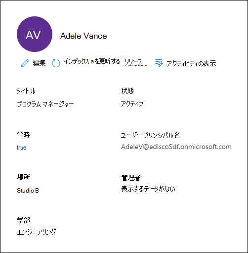
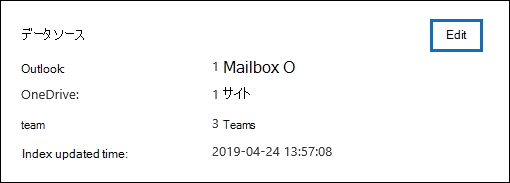

# 電子情報開示 (プレミアム) ケースでカストディアンを管理する

Microsoft Purview 電子情報開示 (プレミアム) ケースの [**データ ソース**] タブの [**カストディアン**] ページには、ケースに追加されたすべてのカストディアンの一覧が含まれています。 ケースにカストディアンを追加すると、各カストディアンに関する詳細が自動的にAzure Active Directoryから収集され、電子情報開示 (プレミアム) で表示されます。

## カストディアンの詳細を表示する

カストディアンの詳細を表示するには、[カストディアン] タブの一覧から **カスト** ディアンをクリックします。ポップアップ ページが表示され、カストディアンに関する次の情報が含まれています。

- 連絡先情報

  - **タイトル**。 カストディアンの役職。
  
  - **ユーザー プリンシパル名**。 カストディアンのユーザー プリンシパル名 (UPN) (AdeleV@contoso.onmicrosoft.com など)。
  
  - **Location**。 カストディアンの勤務先内のオフィスの場所。
  
  - **マネージャー**。 カストディアンのマネージャー。 指定されたマネージャーは、このカストディアンのエスカレーション通信を受け取ります。
  
  - **部門**。 カストディアンが動作する部署の名前。

- ケース情報

  - **状態**。 ケース内のカストディアンの状態。 **[アクティブ]** の状態は、カストディアンがケースの一部であることを示します。 カストディアンがケースから解放された場合、状態は **[リリース済み]** に変更されます。
  
  - **保持します**。 保管担当者が保留になっているかどうかを示します。

- データの場所と保持情報

  

  - **保管場所**。 カストディアンに関連付け、ケースの一部であるデータ ソース (メールボックス、サイト、Teams) の数と種類を示します。

    - 各データの場所には、保留状態が表示されます。 保留状態に使用できる値: **保留中**、**保留中でない****、進行中です**。

    - データ ソースの保留状態が表示されない場合は、ケース **の [保留** ] タブに一覧表示されている保管担当者保留の状態を確認してください。 カストディアンホールドは、特定のデータ ソースが保留されている場所を識別します。

## カストディアンを編集する

ケースが進行すると、特定のカストディアンとケースに関連する追加のデータ ソースが存在する可能性があります。 その他のシナリオでは、レビューされ、関連していないと見なされた特定のデータ ソースを削除することができます。

カストディアンに関連付けられているデータ ソースを更新するには、

1. **電子情報開示>電子情報開示 (プレミアム)** に移動し、ケースを開きます。
  
2. [ **データ ソース] タブを** クリックします。
  
3. 一覧からカストディアンを選択し、ポップアップ ページで **[編集]** をクリックします。

    
  
4. カストディアンのプライマリ メールボックスとOneDrive アカウントを追加または削除するには:

    - カストディアンを展開して、以前にカストディアンに関連付けられているプライマリ データの場所を表示します。

    - **[メールボックス**] または **[OneDrive**] の横にある **[編集]** をクリックして、保管担当者のメールボックスまたはOneDrive場所を追加します。

    - **[メールボックス**] または **[OneDrive**] の横にある **[クリア**] を選択して、保管担当者のメールボックスまたはOneDriveアカウントをこの保管担当者のデータの場所として関連付けから削除します。

5. 特定の保管担当者に他のメールボックス、サイト、Teams、またはYammer グループを追加または削除するには、サービスの横にある **[編集]** をクリックしてデータの場所を追加します。

   - **Exchange**: 他のメールボックスをカストディアンに関連付けるために使用します。 検索ボックスに、ユーザー メールボックスまたは配布グループの名前またはエイリアス (3 文字以上) を入力します。 保管担当者に割り当てるメールボックスを選択し、[ **追加**] をクリックします。

   - **SharePoint**: SharePoint サイトをカストディアンに関連付けるために使用します。 一覧でサイトを選択するか、検索ボックスに URL を入力してサイトを検索します。 カストディアンに割り当てるサイトを選択し、[ **追加**] をクリックします。

   - **Teams**: カストディアンが現在メンバーであるMicrosoft Teamsを割り当てる場合に使用します。 カストディアンに割り当てるチームを選択し、[ **追加**] をクリックします。 チームを追加すると、そのチームに関連付けられているSharePoint サイトメールボックスとグループ メールボックスが自動的に識別および検索され、管理者に割り当てられます。

   - **Yammer**: カストディアンが現在メンバーになっているYammer グループを割り当てる場合に使用します。 カストディアンに割り当てるグループを選択し、[ **追加**] をクリックします。 チームを追加すると、そのグループに関連付けられているSharePoint サイトメールボックスとグループ メールボックスが自動的に識別されて検索され、管理者に割り当てられます。

   > [!NOTE]
   > **Exchange** と **SharePoint** の場所ピッカーを使用すると、カストディアンがメンバーではないチームやYammer グループなど、組織内のメールボックスまたはサイトをカストディアンに関連付けることができます。 これを行うには、各チームまたはYammer グループに関連付けられているメールボックスとサイトの両方を追加する必要があります。

6. カストディアンのデータの場所を編集したら、[ **次へ** ] をクリックして **[保留設定]** ページに移動します。  

7. [ **保留設定]** ページで、保管担当者の保留設定を更新します。

## カストディアン データのインデックスを再作成する

法的調査のためのほとんどの電子情報開示ワークフローでは、カストディアンが訴訟に追加された後、カストディアンのデータのサブセットが検索されます。 ファイル サイズが非常に大きいか、データが破損する可能性があるため、カストディアンに関連付けられているデータ ソース内の一部の項目に部分的にインデックスが作成される可能性があります。 電子情報開示 (プレミアム) の[高度なインデックス](indexing-custodian-data.md)作成機能を使用すると、必要に応じてこれらの項目のインデックスを再作成することで、部分的にインデックスが作成されたアイテムの大部分を自動的に修復できます。

ケースにカストディアンが追加されると、カストディアンに関連付けられているデータ ソースにあるデータは、(高度なインデックス作成プロセスによって) 自動的にインデックスが再作成されます。 つまり、データをダウンロードして修復し、オフラインで検索する必要はなくなります)。 ただし、訴訟のライフサイクル中に、新しいデータ ソースがカストディアンに関連付けられている可能性があります。 この場合、高度なインデックス作成プロセスを再実行して、部分的にインデックスが作成されたアイテムを修復し、カストディアンのデータのインデックスを更新することで、カストディアンのデータのインデックスを再作成できます。

インデックスの再作成プロセスをトリガーして、部分的にインデックスが作成された項目に対処するには、

1. **電子情報開示>電子情報開示 (プレミアム)** に移動し、ケースを開きます。

2. [ **ソース]** タブをクリックします。

3. [ **カストディアン]** ページで、データのインデックスを再作成する必要があるカストディアンを選択します。

4. ポップアップ ページで、[ **インデックスの更新**] をクリックします。

   インデックス ジョブが作成されたことを示すダイアログが表示されます。

カストディアン データのインデックスの再作成は、実行時間の長いプロセスです。作成された対応するジョブの名前は、 **保管担当者データのインデックスの再作成** です。 [ **インデックス作成ジョブ** の状態] 列の状態を監視することで、[ジョブ] タブまたは [ **カストディアン** ] タブで進行状況 **を** 追跡できます。

詳細については、以下を参照してください。

- [処理中のエラーの操作](processing-data-for-case.md)

- [ジョブを管理する](managing-jobs-ediscovery20.md)

## ケースからカストディアンを解放する

ケースが終了した場合、カストディアンがケースのコンテンツを保持する義務がなくなった場合、またはカストディアンがケースに関連しなくなったと見なされた場合、カストディアンは解放されます。 

保留通知が発行された後にカストディアンを解放すると、リリース通知がカストディアンに送信されます。 さらに、カストディアンに関連付けられたデータ ソースに配置されたすべての保留は削除されます。 保管担当者が *サイレント ホールド* に配置され、法的保留通知が発行されなかった場合、リリース通知は送信されませんが、その保管担当者に関連付けられたデータ ソースに配置された保留は削除されます。

カストディアンを解放するには:

1. **電子情報開示>電子情報開示 (プレミアム)** に移動し、ケースを開きます。

2. [ **ソース]** タブをクリックします。

3. [ **カストディアン** ] ページで、ケースから解放されるカストディアンを選択します。

4. ポップアップ ページで、[ **カストディアンのリリース**] をクリックします。

   保管担当者に関連付けられたデータ ソースに保留が配置された場合、保留は削除され、別の電子情報開示 (プレミアム) ケースに関連付けられているその他の保留は引き続き適用されることを説明する警告ページが表示されます。 これには、他の種類の保持機能と保持機能 (Microsoft 365アイテム保持ポリシーなど) が含まれます。

5. [ **はい** ] をクリックして、カストディアンを解放することを確認します。 

    **[カストディアン**] タブのこのユーザーの状態は **[リリース済み]** に設定され、ポップアップ ページの **[保留] 状態** は False に変更 **されます**。

> [!NOTE]
> カストディアンは、複数の訴訟に同時に関与する可能性があります。 カストディアンが特定のケースから解放された場合、他のケースの保留と通知は影響を受けなくなります。
