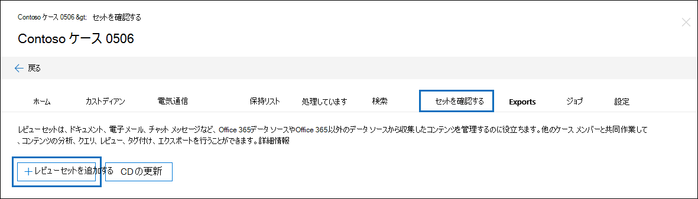

# 電子情報開示でレビュー セットを管理する (プレミアム)

[!include[Purview banner](../includes/purview-rebrand-banner.md)]

レビュー セットは、ケースのデータを分析、クエリ、表示、確認、タグ付け、エクスポートできるドキュメントの静的セットです。 これらのタスクの実行の詳細については、次を参照してください。

- [レビュー セット内のデータを分析する](analyzing-data-in-review-set.md)

- [レビュー セット内のデータをクエリする](review-set-search.md)

- [レビュー セット内のドキュメントを表示する](view-documents-in-review-set.md)

- [レビュー セット内のドキュメントをタグ付けする](tagging-documents.md)

- [ケース データをエクスポートする](exporting-data-ediscover20.md)

## レビュー セットを作成する

[レビュー セットの追加] をクリックすると、[ **校閲セット** ] タブで **レビュー セットを** 作成できます。

[ **レビュー セットの追加]** ポップアップ ページで、レビュー セットの名前を入力し、[ **保存**] をクリックします。 新しいレビュー セットは、[レビュー **セット] タブ** の一覧に表示されます。

![[校閲セット] タブに新しいレビュー セットが一覧表示されます。](../media/AeDnewreviewset.png)

電子情報開示 (プレミアム) ケースでレビュー セットにデータを追加する方法は 3 つあります。

1. [検索結果をレビュー セットに追加する](add-data-to-review-set.md)

2. [レビューセットにMicrosoft 365 以外のデータを読み込む](load-non-Office-365-data-into-a-review-set.md)

3. [別のレビュー セットからレビュー セットにデータを追加](add-data-to-review-set-from-another-review-set.md)

> [!NOTE]
> レビュー セットからアイテムを削除することはできません。また、ケースからレビュー セットを削除することはできません。 レビュー セットを削除し、その中のデータを削除するには、レビュー セットが配置されている電子情報開示 (プレミアム) ケースを削除する必要があります。 詳細については、「[Close or delete an eDiscovery (Premium) case (電子情報開示 (プレミアム) ケースを閉じるか、または削除する)](close-or-delete-case.md)」を参照してください。
