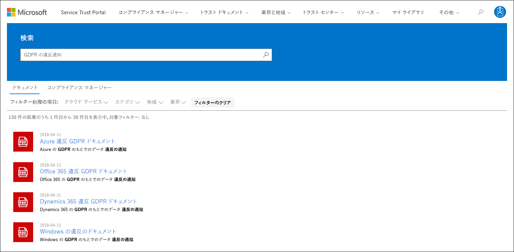
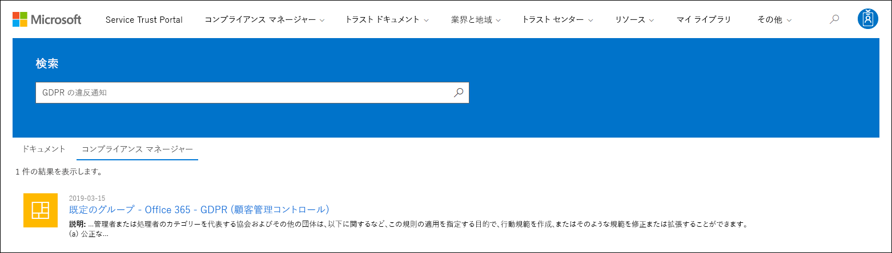

# Microsoft コンプライアンス マネージャー (クラシック)

> [!IMPORTANT]
> **コンプライアンス マネージャー (クラシック) は、Microsoft Service Trust Portal からまもなく削除されます。** [Microsoft 365 コンプライアンス センターの新しいコンプライアンス マネージャー](https://compliance.microsoft.com/)に切り替えることをお勧めします。これにより、ユーザー エクスペリエンスが向上し、コントロール マッピングが更新されます。 クラシック バージョンの評価をお持ちのお客様は、新しいコンプライアンス マネージャーで新しい評価を作成する必要があります。 評価、管理、およびその他のデータを含む既存のデータは、新しいコンプライアンス マネージャーに転送されません。

*コンプライアンス マネージャーは、21Vianet が運用している Office 365、Office 365 Germany、Office 365 U.S. Government Community High (GCC High)、Office 365 Department of Defense では使用できません。*

コンプライアンス マネージャーは、当社の [Microsoft Service Trust Portal](./get-started-with-service-trust-portal.md) に記載されているワークフローベースのリスク評価ツールです。コンプライアンス マネージャーを使用すると、Microsoft Office 365、Microsoft Dynamics 365、Microsoft Azure などの Microsoft プロフェッショナル サービスや Microsoft クラウド サービスに関連する組織の規制遵守活動の追跡、割り当て、検証を行うことができます。

コンプライアンス マネージャーには、次のような機能があります。

- ISO 27001、ISO 27018、NIST などの各種の標準に対する、サード パーティからの Microsoft クラウド サービスのさまざまな監査の一環として、マイクロソフトが監査担当者および規制機関に提供する詳細情報と、マイクロソフトが HIPAA や EU の一般データ保護規制 (GDPR) などの規制遵守のために内部で編集する情報を組み合わせます。内部で編集する情報には、組織が標準と規制に遵守しているかどうかについてのユーザーの自己評価も含めます。

- コンプライアンスと評価に関連するアクティビティの割り当て、追跡、記録をできるようにします。チーム間の障壁が少なくなり、組織のコンプライアンスの目標を達成しやすくなります。

- コンプライアンス スコアを使用することができます。組織の進行状況を追跡し、監査コントロールに優先順位を付けることができ、組織が危険にさらされにくくなります。

- コンプライアンス アクティビティに関連する証拠と他の成果物のアップロードおよび管理を行うためのリポジトリがセキュリティで保護されます。

- マイクロソフトと組織が実施するコンプライアンス アクティビティに関する豊富な詳細レポートを Microsoft Excel 形式で作成します。それらのレポートは、監査担当者、規制機関、その他のコンプライアンス関係者に提供することができます。

> [!IMPORTANT]
> コンプライアンス マネージャーは、データ保護とコンプライアンスの現状の要約と、データ保護とコンプライアンスを改善するための推奨事項を提供するダッシュボードです。コンプライアンス マネージャーに表示される顧客アクションは推奨事項です。実装前に、各組織がそれぞれの規制環境でこれらの推奨事項が有効かどうかを評価する必要があります。コンプライアンス マネージャーでの推奨事項はコンプライアンスを保証するものではありませんので、ご注意ください。

## コンプライアンス マネージャーとは?

コンプライアンス マネージャーは、クラウドの共有責任モデル内でコンプライアンスを管理するために設計されたワークフロー ベースのリスク評価ツールです。コンプライアンス マネージャーが提供するダッシュボード ビューには、標準と規則、および Microsoft のコントロール実装の詳細、テスト結果、顧客コントロール実装ガイダンス、組織が入力する進捗管理などの評価が表示されます。コンプライアンス マネージャーは、証明書評価コントロールの定義、コントロールの実装とテストに関するガイダンス、コントロールでの危険度に重点を置いたスコア、ロールベースのアクセス管理、およびインプレース コントロール アクション割り当てのワークフローを提供して、コントロールの実装、テストの状態、証拠の管理を追跡できるようにします。コンプライアンス マネージャーは、ユーザーが論理的に評価をグループ化し、同じコントロールまたは関連するコントロールに評価コントロール テストを適用できるようにして、コンプライアンスの作業負荷を最適化し、作業の重複を削減します。コンプライアンス マネージャーを使用しないと、異なる証明書間の同じコントロールの要件を満たすための作業が重複してしまう可能性があります。

## コンプライアンス マネージャーでの Assessment

コンプライアンス マネージャーのコア コンポーネントは *Assessment* (評価) と呼ばれます。これは、証明書基準やデータ保護規則 (ISO 27001:2013、GDPR など) についての Microsoft サービスに対する評価を指します。Assessment により、組織のデータ保護およびコンプライアンスへの取り組みが、選択された Microsoft クラウド サービスの業界標準に準じているかどうかを確認することができます。評価対象の証明書標準にマップされるコントロールを実装すると、Assessment は完了します。

Assessment の構造は、マイクロソフトとお客様の組織の間で共有される責任に基づいています。クラウド内のセキュリティとコンプライアンス リスクを評価し、コンプライアンス標準、データ保護標準、規制、また法律によって指定されたデータ保護のセーフガードを実装する仕組みになっています。

Assessment は、以下の複数のコンポーネントで構成されています。

- **In-Scope Services** - 各評価は Microsoft サービスの特定のセットに適用されます。評価が適用されるサービスは [In-Scope Services] セクションに記載されています。

- **マイクロソフト管理のコントロール** - マイクロソフトは、さまざまな標準および規制遵守の一環として、クラウド サービスごとに一連の *コントロール* の実装と管理を行っています。これらのコントロールは、Assessment が適用されている証明書または規制の構造に沿った形で、*コントロール ファミリー* に編成されています。マイクロソフトがコントロールをどのように実装し、また、独立したサード パーティの監査担当者によって実装がいつどのようにテストおよび検証されたかについての詳細情報を、コンプライアンス マネージャーで、マイクロソフト管理のコントロールごとに確認できます。

  ここでは、Office 365 と GDPR の Assessment からの **[セキュリティ]** コントロール ファミリーにおける 3 つのマイクロソフト管理のコントロールの例を紹介します。

  

  1. a. マイクロソフト管理のコントロールにマップされる証明書または規制からの次の情報を指定します。

     - **コントロール ID** - コントロールのマップ先の証明書または規制のセクションまたは記事番号。

     - **タイトル** - 対応する証明書または規制のタイトル。

     - **記事 ID** - このフィールドは GDPR 評価の場合にのみ含まれ、対応する GDPR 記事番号の指定に使用します。

     - **説明** - 選択したマイクロソフト管理のコントロールにマップされる標準または規制の本文。

  1. コントロールのコンプライアンス スコアで、マイクロソフト管理の各コントロールに関連付けられる (非準拠またはコントロールの失敗による) リスクのレベルを示します。詳細については、「[コンプライアンス スコアについて](#understanding-the-compliance-score)」を参照してください。なお、コンプライアンス スコアは 1 から 10 段階で評価され、色分けされています。黄色はリスクの低いコントロール、オレンジは中程度のリスクのコントロール、赤は高いリスクのコントロールを示します。

  1. コントロールの実装状態、コントロールがテストされた日付、テストを実施した担当者、およびテスト結果に関する情報。

  1. [**詳細**] をクリックすると、コントロールごとに、コントロールの Microsoft の実装についての詳細と、独立したサードパーティの監査人によってコントロールがテストおよび検証された方法についての詳細を含む、追加の情報が表示されます。

- **顧客管理のコントロール** - お客様の組織が管理するコントロールのコレクションです。組織には、所定の標準や規則へのコンプライアンスのプロセスの一環として、これらのコントロールを実装する責任があります。顧客管理のコントロールも、対応する証明書または規制のコントロール ファミリーに編成されます。コンプライアンス活動の一環として、マイクロソフトが提案する推奨アクションを実装するには、顧客管理のコントロールを使用します。組織は、それぞれの顧客管理のコントロールにおける規範的なガイダンスと推奨される顧客アクションを使用して、そのコントロールの実装と評価のプロセスを管理できます。

  Assessment における顧客管理のコントロールには、Assessment 完了までの組織の手順の管理および追跡ができる、組み込みのワークフロー管理機能もあります。たとえば、組織のコンプライアンス責任者は、実施項目を IT 管理者に割り当てることができます。IT 管理者は、コントロールに関する推奨アクションを実施する責任者でもあり、アクション実施に必要な権限を持ちます。割り当てが完了すると、IT 管理者は実装タスク (構成またはポリシー設定のスクリーンショットなど) の証拠をアップロードできます。それから、実施項目をコンプライアンス責任者に再度割り当てて、収集した証拠の評価、コントロール実装のテスト、実装日とテスト結果の記録を、コンプライアンス マネージャーで実施できます。詳細については、記事の「[評価プロセスの管理](#managing-the-assessment-process)」セクションを参照してください。

## アクセス許可とロールベースのアクセス制御

コンプライアンス マネージャーでは、役割に基づくアクセス許可モデルが使用されています。コンプライアンス マネージャーにはユーザー ロールが割り当てられているユーザーのみがアクセスでき、各ユーザーに許可される操作は役割の種類によって制限されます。

なお、既定の **ゲスト アクセス** ロールはなくなりました。 コンプライアン スマネージャーにアクセスして操作するには、各ユーザーは役割を割り当てられている必要があります。

以下の表では、各コンプライアンス マネージャーのアクセス許可と、ユーザーに許可されている操作について説明しています。また、この表は、各アクセス許可が割り当てられるロールも示しています。

|アクセス許可|コンプライアンス マネージャー リーダー|コンプライアンス マネージャー投稿者|コンプライアンス マネージャー評価者|コンプライアンス マネージャー管理者|ポータル管理者|
|---|:---:|:---:|:---:|:---:|:---:|
|**データの読み取り** - ユーザーはデータを読み取ることができますが、編集はできません。||||||
|**データの編集** - ユーザーは [テスト結果] および [テスト日] フィールドを除くすべてのフィールドを編集できます。||||||
|**テスト結果の編集** - ユーザーは [テスト結果] および [テスト日] フィールドを編集できます。||||||
|**評価の管理** - ユーザーは、Assessment の作成、アーカイブ、削除ができます。||||||
|**ユーザーの管理** - ユーザーは、組織内の他のユーザーをリーダー、投稿者、評価者、管理者のロールに追加できます。組織内でグローバル管理者ロールを持つユーザーのみが、ユーザーをポータル管理者ロールに追加したり、ポータル管理者ロールからユーザーを削除したりすることができます。||||||
|

## コンプライアンス スコアについて

コンプライアンス マネージャーのダッシュボードでは、Office 365 の評価の合計スコアがタイルの右上隅に表示されます。これは Assessment のコンプライアンス スコアの総計で、Assessment での実装およびテストの実行が記録された各コントロールの評価に関する取得ポイントの累計です。Assessment を追加すると、コンプライアンス スコアが既にある程度完了していることが確認できます。これは、マイクロソフトが実装し、独立したサードパーティがテストしたマイクロソフト管理のコントロールのポイントが、コンプライアンス スコアに既に適用されているためです。

残りのポイントは、正常な顧客コントロール評価、および顧客管理のコントロールの実装とテストから取得されます。それぞれのポイントには特定の値があり、その値はコンプライアンス スコア全体に計上されます。

各 Assessment では、リスクベースのコンプライアンス スコアが表示されます。このスコアは、Assessment の各コントロール (マイクロソフト管理のコントロールと顧客管理のコントロールを含む) に関連するリスクのレベル (コンプライアンス違反またはコントロールの失敗によるリスク) を評価するのに役立ちます。顧客管理のコントロールそれぞれには、取得できる可能性があるポイント数 (* 重大度ランキングと呼ばれます) が 1 から 10 のスケールで割り当てられます。コントロールが失敗した場合、高いリスク要因に関連するコントロールには高いポイントが付与され、リスクの低いコントロールには低いポイントが付与されます。

たとえば、以下のユーザー アクセスの管理評価コントロールは、リスクの重大度ランキングが非常に高く、10 の値が割り当てられています。

対照的に、以下のバックアップ評価コントロールは、リスクの重大度ランキングが低く、3 の値が割り当てられています。

コンプライアンス マネージャーでは、各コントロールに既定の重大度ランキングが割り当てられます。リスクのランキングは、以下の基準に基づいて算出されます。

- コントロールがインシデントの発生を阻止するのか (最も高いランク)、発生したインシデントを検出するか、あるいはインシデントの影響を修正するか (最も低いランク)。重大度ランキングでは、脅威防止の必須のコントロールには、最も高いポイント数が割り当てられます。(必須か任意かに関わらず) 検出または修正のコントロールには最も低いポイント数が割り当てられます。

- (実装後) これらのコントロールが必須で、ユーザーがバイパスできない (たとえば、ユーザーがパスワードをリセットし、パスワードの長さと文字の要件を満たす必要があるなど)、それとも任意でユーザーがバイパスできるか (たとえば、ユーザーがコンピューターから離れるときに画面をロックすることを求める業務ルールなど)。

- データの機密性、整合性、可用性のリスクに関するコントロールの場合は、これらのリスクが内部と外部のどちらの脅威から生じるのか、またその脅威が悪意のあるものか偶発的なものなのかに基づいて算出します (たとえば、外部の攻撃者がネットワークに侵入し、個人を特定できる情報にアクセスするのを阻止するコントロールには、従業員がネットワーク ルーターの設定を誤って構成してネットワークを停止させる問題を防ぐコントロールよりも多くのポイントが割り当てられます)。

- 各コントロールの契約、規制、公約などの法的および外的要因に関連するリスク。

コントロールに表示されているコンプライアンス スコアの値は、合格/不合格 (コントロールが実装され、その後の評価テストに合格したかどうか) に基づいて、*合計値* としてコンプライアンス スコアの合計に適用されます。一部の実装へのクレジットは値には反映されません。コントロールの **実装状態** が **[実装済み]** または **[別の実装]** に設定され、**テスト結果** が **[合格]** に設定されている場合にのみ、割り当て済みのポイントがコンプライアンス スコアの合計に追加されます。

最も重要な点は、コンプライアンス スコアを使用すると、コントロール関連の障害が発生した場合にリスクが高くなる可能性があるコントロールを識別でき、どのコントロールの実装に重点を置くかの優先順位を設定しやすくなることです。リスクベースの優先順位の設定に加えて、評価コントロールが他のコントロール (同じ評価内または同じ評価グループの別の評価内のいずれか) に関連する場合、1 つのコントロールが正常に完了すると、コントロールのテスト結果が同期され、作業が大幅に削減されるという利点もあります。

たとえば、次の図の Office 365 - GDPR Assessment では 46% が評価済みです。111 個のコントロール評価のうち 51 個が完了しており、コンプライアンス スコアの合計は、取得可能な 600 のうちの 289 になります。

評価内で、GDPR コントロール 7.5.5 は他の 5 つのコントロール (7.4.1、7.4.3、7.4.4、7.4.8、7.4.9) に関連しており、重大度を示すリスクの評価スコアが、それぞれに中から高の 6 または 8 が設定されています。評価フィルターを使用して、これらのコントロールすべてを選択し、評価ビューに表示されるようにしたところ、次の図でいずれも評価されていないことがわかります。

 これら 6 つのコントロールは関連しているので、いずれか 1 つのテストが完了すると、この評価内の関連するコントロールの間でテスト結果が同期されます (同じ評価グループ内の評価での関連するコントロールの場合も同様です)。GDPR コントロール 7.5.5 の実装とテストが完了すると、コントロールの詳細領域が更新されて、6 つのコントロールすべてが評価されたことが表示されます。対応する数値が加算され、評価されたコントロールの数が 57 で、評価済みが 51% となっています。コンプライアンス スコアの合計も 40 増えています。

関連する他のコントロールに影響を与える方法で、関連するコントロールの実装状態を変更しようとすると、この更新の確認ダイアログ ボックスが表示されます。

> [!NOTE]
> 現時点では、Office 365 クラウド サービスの Assessment にのみ、コンプライアンス スコアが含まれています。Azure と Dynamics の Assessment の場合は、評価の状態が表示されます。

## コンプライアンス スコアの手法

コンプライアンス スコア (Microsoft Secure Score など) は、他の動作ベースのスコア システムと似ています。組織は、データ保護、プライバシー、セキュリティに関連するアクティビティを実行することで、組織のコンプライアンス スコアを上げることができます。

> [!NOTE]
> 組織が特定の標準や規制を遵守しているかの絶対的測定値は、コンプライアンス スコアでは表せません。ユーザーが設定した、個人のデータやプライバシーに関するリスクを軽減できるコントロールをどの程度採用したかがコンプライアンス スコアによって表されます。標準や規制に準じていることを保証するサービスは提供されておらず、コンプライアンス スコアも何かを保証するものではありませんので、ご注意ください。

コンプライアンス マネージャーでの Assessment は、クラウド コンピューティングの共有責任モデルに基づいています。共有責任モデルでは、クラウドに保存されているお客様のデータの保護に対する責任は、マイクロソフトと各お客様の間で共有されます。

以下の Office 365 GDPR Assessment に示すように、マイクロソフトとお客様はそれぞれ、評価されている標準または規制の要件を満たすように設計されている、さまざまなアクションを実行する責任があります。さまざまな標準と規制に必要なアクションを合理化し理解するため、コンプライアンス マネージャーでは、すべての標準と規制がコントロール フレームワークのように処理されます。そのため、Assessment ごとにマイクロソフトおよびお客様によって実行されるアクションには、さまざまなコントロールの実装と検証が含まれます。

一般的なアクションの基本ワークフローは次のとおりです。

1. 組織のコンプライアンス、リスク、プライバシーやデータ保護の責任者は、コントロール実装のタスクを組織内の次のようなユーザーに割り当てます。

   - ビジネス ポリシーの所有者

   - IT 担当者

   - 組織内の別の個人ユーザーで、タスク実行の責任者

2. 上記ユーザーは、コントロールを実装するために必要なタスクを実行し、実装の証拠をコンプライアンス マネージャーにアップロードし、アクションに関連付けられているコントロールを実装済みとして記録します。これらのタスクが完了したら、検証の評価者にアクションを割り当てます。次のようなユーザーが評価者となります。

   - 組織内のコントロールを検証する内部評価者

   - コンプライアンスの検査、検証、証明を行う外部評価者 (Microsoft クラウド サービスを監査する、独立したサード パーティの組織など)

3. 評価者は、コントロールの検証と証拠の精査を行い、評価済みとしてコントロールと評価の結果を記録します (例: 合格)。

Assessment に関連付けられたコントロールをすべて評価すると、Assessment は完了したものと見なされます。

マイクロソフトが責任を持つコントロールの要件を満たすために、コンプライアンス マネージャーのすべての Assessment は、マイクロソフトが実施するアクションの詳細情報と共にプリロードされます。この情報には、マイクロソフトが各コントロールを実装した方法、Microsoft の実装を評価した方法とタイミング、サード パーティの監査人による検証方法とタイミングに関する詳細が含まれます。そのため、各 Assessment のマイクロソフト管理のコントロールは評価済みとして記録され、Assessment のコンプライアンス スコアに反映されます。

各 Assessment には、共有責任モデルに基づくコンプライアンス スコアの合計が含まれます。Office 365 のコントロールに関するマイクロソフトの実装とテストは、GDPR 評価関連の取得可能な合計ポイントの一部に該当します。ユーザーが、各顧客アクションの実装とテストを完了すると、その Assessment のコンプライアンス スコアにはコントロールに割り当てられた値が追加されます。

### リスクベースのスコアリングの手法

コンプライアンス マネージャーでは、1 から 10 の範囲によるリスクベースのスコアリングの手法を使用します。コントロールが失敗したイベントまたは非準拠のイベントにおいて、高いリスクが示されているコントロールには、高い値が割り当てられます。コンプライアンス スコアに適用されるスコアリング システムは、次のような重要な要因に基づいています。

- コントロールの本質

- 脅威の種類に基づくコントロールのリスク レベル

- コントロールの外的要因

### コントロールの本質

コントロールの本質は、コントロールが必須か任意のどちらであるか、および予防、検出、または修正のいずれであるかに基づきます。

### 必須または任意

*必須のコントロール* は、意図的にも偶発的にもバイパスできないコントロールです。一般的な必須のコントロールの例は、パスワードの長さ、複雑さ、有効期限の要件を設定する一元管理されたパスワード ポリシーです。システムにアクセスするためには、ユーザーはこれらの要件に準拠する必要があります。

*任意のコントロール* は、ユーザーがポリシーを理解し、状況に応じて実行するものです。たとえば、退席するときにコンピューターのロックをユーザーに要求するポリシーは、ユーザーに依存するものであるため、任意のコントロールになります。

### 予防、検出、または修正

*予防のコントロール* は、特定のリスクを防ぐものです。たとえば、暗号化による保存情報の保護は、攻撃や漏洩などに対する予防のコントロールです。また、職務権限の分離は、利益を公正に分かち合い、不正行為を防ぐための予防のコントロールになります。

*検出のコントロール* は、リスクにつながる不規則な状態や行動を検出するために、システムをアクティブに監視するもので、侵入の検出や違反の発生の判別に使用できます。システム アクセスの監査や、特権のある管理操作の監査は、検出のコントロールで監視の部類に該当します。規制のコンプライアンスの監査は、プロセスの問題を見つけるために使用する、検出のコントロールになります。

*修正のコントロール* は、セキュリティに関するインシデントの影響を最小限に抑えるものです。直後の影響を少なくするための是正措置を取り、可能であればダメージの修復を行います。プライバシーに関するインシデントへの対応は、ダメージを抑え、違反発生後にシステムを通常の稼働状態に復元する修正のコントロールになります。

これらの要因を使用して各コントロールを評価することで、コントロールの本質を判断します。そして、コントロールの本質に、その本質が表すリスクに相当する値を割り当てます。

**脅威**:

|コントロール|必須|任意|
|---|---|----|
|**予防**|高リスク|中程度のリスク|
|**検出**|中程度のリスク|低リスク|
|**修正**|中程度のリスク|低リスク|

脅威は、データの CIA (機密性、整合性、可用性) トライアドと呼ばれる、基本的でかつ広く受け入れられているセキュリティ標準に対してリスクを引き起こすものを意味します。

- 機密性は、信頼でき、承認された関係者のみが情報の閲覧と確認ができることを意味します。

- 整合性は、情報が承認されていない関係者によって変更または破棄されていないこと意味します。

- 可用性は、高いレベルのサービスの品質で情報にアクセスする用意ができていることを意味します。

これらの特性に欠けていることはすべて、システム全体の侵害と見なされます。脅威の原因は内部ソースと外部ソースの両方が考えられ、脅威を行った者の目的に関しては、偶発的である場合と悪意がある場合があります。これらの要因は、脅威マトリックスで予測され、シナリオの各組み合わせに、高、中、低のいずれかの脅威レベルが割り当てられます。

|要因|内部|内部|外部|外部|
|---|---|---|---|----|
||*悪意*|*偶発的*|*悪意*|*偶発的*|
|**機密性**|(高、中、低)|(高、中、低)|(高、中、低)|(高、中、低)|
|**整合性**|(高、中、低)|(高、中、低)|(高、中、低)|(高、中、低)|
|**可用性**|(高、中、低)|(高、中、低)|(高、中、低)|(高、中、低)|
|

**外的要因**:

|契約書|規制|公約|
|---|---|---|
|(高、中、低)|(高、中、低)|(高、中、低)|

適用される規制、契約、公約などの外的要因は、データを保護してデータ違反を防ぐように設計されたコントロールに影響を及ぼす場合があります。そのため、これらの要因のそれぞれに、高、中、低のリスク値が割り当てられます。

CIA/脅威および法的/外的要因で示された、可能性のある 15 個のリスク シナリオでの高、中、低のリスク値の予想発生回数は、リスクの重み付けのために結合されます。リスクの重み付けでは、指定された値におけるリスクの可能性と発生数が重要視されます。リスクの重み付けの検討は、コントロールの重大度ランキングを計算するときに行います。

コントロールの重大度ランキングに基づいて、コントロールにコンプライアンス スコアの値として 1 (低) から 10 (高) の数値が割り当てられ、次のリスクのカテゴリに分類されます。

|リスク レベル|コントロール値|
|---|:---:|
|低|1-3|
|中|6|
|高|8|
|重大|10|

最も高いコンプライアンス スコアの値で評価コントロールの優先度を設定することで、組織は最もリスクの高い項目に集中できるようになります。コントロールの評価を完了するごとに、組織は、評価に対するコンプライアンス スコアの合計にさらにポイントが追加された形で、比例的に高い値のフィードバックを受け取ります。

### スコアリングの手法の要約

コンプライアンス スコアはコンプライアンス マネージャーのコア コンポーネントで、組織がコンプライアンスを理解し管理するのに役立ちます。評価のためのコンプライアンス スコアは、所定の標準や規制に対する組織のコンプライアンス状況を数値で表したもので、高いスコアは (Assessment に割り当てられた最大ポイントを上限として) 組織のコンプライアンスへの取り組みがより適切であることを意味します。評価コントロールをリスクの重大度により 1 - 10 (低 - 高) で行うコンプライアンス スコアリングの手法と、完了したコントロールの評価がどのようにコンプライアンス スコアの合計に加点されるかを理解することは、組織がアクションの優先順位を決めるうえで重要になります。

## Assessment のグループ化

新しい Assessment を作成するときは、グループを作成して Assessment を割り当てるか、既存のグループに Assessment を割り当てるかの選択が求められます。グループを使用すると、Assessment を論理的に整理し、同じまたは関連する顧客管理のコントロールを持つ Assessment 間で、共通の情報やワークフロー タスクを共有できます。

たとえば、年ごとや、組織内のチーム/部門/機関ごとに Assessment をグループ化することができます。さらに、そのグループ化した Assessment を年ごとにグループにまとめることもできます。グループとその中に含まれる可能性のある Assessment の例を次に示します。

- GDPR Assessment - 2018

  - Office 365 + GDPR

  - Azure + GDPR

  - Dynamics + GDPR

- Azure Assessment - 2018

  - Azure + GDPR

  - Azure + ISO 27001:2013

  - Azure + ISO 27018:2014

- データ セキュリティとプライバシー Assessment

  - Office 365 + ISO 27001:2013

  - Office 365 + ISO 27018:2014

  - Azure + ISO 27001:2013

  - Azure + ISO 27018:2014

> [!TIP]
> 組織のグループ化の戦略を決めてから、新しい評価を追加することをお勧めします。

Assessment のグループ化の要件は以下のとおりです。

- グループ名 (* グループ ID とも呼ばれます) は組織内で一意にする必要があります。

- グループには同じ証明書/規制の Assessment を含めることができますが、各グループには、特定のクラウド サービス/証明書ペアの Assessment を 1 つしか含めることができません。たとえば、1 つのグループに Office 365 と GDPR の 2 つの Assessment を含めることはできません。各クラウド サービスの対応する証明書/規制が異なっていれば、1 つのグループに同じクラウド サービスに対する複数の Assessment を含めることができます。

評価グループに評価を追加すると、そのグループを変更することはできません。評価グループの名前は変更できますが、変更すると、そのグループに関連付けられているすべての評価の評価グループ名が変更されます。また、評価と新しい評価グループを作成し、既存の評価から情報をコピーすることができます。これにより、その評価の複製を別の評価グループに効率良く作成することができます。評価をアーカイブすると、その評価と評価グループ間の関連性がなくなってしまうため、それ以降、関連する他の評価を更新しても、アーカイブした評価には反映されなくなります。

前述のように、グループを使用することの重要な利点の 1 つは、同じグループ内の 2 つの異なる Assessment が同じ顧客管理のコントロールを共有している場合 (各コントロールの顧客アクションが同じになる)、1 つの Assessment で、実装の詳細、テスト情報、コントロールに関する状態のすべてが完了すると、同じグループ内の他のすべての Assessment でも同じコントロールに同期されることです。つまり、いくつかの Assessment が同じコントロールを共有し、それらの Assessment が同じグループにある場合、コントロールの評価プロセスを 1 つの Assessment で管理するだけで済みます。このコントロールの結果は自動的に他の Assessment に同期されます。たとえば、ISO 27001 と ISO 27018 のどちらにもパスワード ポリシーに関連するコントロールがあります。両方の評価が同じ Assessment グループにある限り、どちらか一方の Assessment でコントロールのテスト状態が "合格" に設定されると、そのコントロールは他の Assessment でも更新されます ("合格" と記録されます)。

この例として、Office 365 - GDPR 評価内のコントロール 6.10.1.2 と Office 365 - NIST 800-53 評価内のコントロール SC-13 の 2 つの関連する評価コントロールについて考えてみます。それぞれがパブリック ネットワークでデータの暗号化を処理する必要があります。これらは、2 つの異なる評価内の関連する評価コントロールで、両方とも既定のグループ内にあります。これら 2 つの Assessment が表示された次のコンプライアンス マネージャーのダッシュボードに示されるように、最初はどちらの評価でも顧客コントロール評価が完了していません。

**[Office 365 - GDPR]** 評価をクリックして、フィルター コントロールを使用し、GDPR コントロール 6.10.1.2 を表示します。関連コントロールとして、NIST 800-53 コントロール SC-13 が表示されていることが確認できます。

ここでは、GDPR コントロール 6.10.1.2 の実装とテストが完了していることを示しています。

グループ化された評価内の関連コントロールに移動すると、NIST 800-53 SC-13 も同じ日時で完了済みとして記録されていることが確認できます。その他の実装やテストの作業は必要ありません。

ダッシュボードに戻ると、各評価で 1 つのコントロール評価が完了しており、各評価のコンプライアンス スコアの合計が 8 (その共有コントロールのコンプライアンス スコア値) 増えていることが確認できます。

## 管理機能

テナント管理者アカウントでのみ使用できる特定の管理機能があり、グローバル管理者としてログインした場合にのみ表示されます。

> [!NOTE]
> 管理者はドロップダウン リストの [制限付きドキュメントへのアクセス] アクセス許可を使用して、マイクロソフトが Service Trust Portal で共有する制限付きドキュメントへのアクセスをユーザーに許可できます。制限付きドキュメントの機能は現在使用できませんが、近日中にリリースされる予定です。

### コンプライアンス マネージャーのロールをユーザーに割り当てる

コンプライアンス マネージャーの各ロールのアクセス許可は、少し異なります。Service Trust Portal を使用すると、各ロールに割り当てられているアクセス許可を表示したり、どのユーザーがどのロールに属しているかを確認したりすることができます。ロールへのユーザーの追加、あるいはロールからのユーザーの削除も行えます。これを実行するには、**[管理]** メニュー項目を選択し、**[設定]** を設定します。

![STP 管理者メニュー - [設定] を選択済み。](../media/65a82b1b-d462-452f-988b-7e4263bd638e.png)

コンプライアンス マネージャーのロールにユーザーを追加したり、ロールからユーザーを削除したりするには、次の操作を行います。

1. [https://servicetrust.microsoft.com](https://servicetrust.microsoft.com) に移動します。

2. Azure Active Directory 全体管理者アカウントでサインインします。

3. Service Trust Portal のトップ メニュー バーで、**[管理]** を選択してから、**[設定]** を選択します。

4. **[ロールの選択]** ドロップダウン リストで、管理するロールをクリックします。

5. 各ロールに追加されたユーザーは、**[ロールの選択]** ページに一覧表示されます。

6. このロールにユーザーを追加するには、**[追加]** をクリックします。**[ユーザーの追加]** ダイアログ ボックスで [ユーザー] フィールドをクリックします。使用可能なユーザーの一覧をスクロールしたり、ユーザー名を入力して検索語句に基づいて一覧をフィルター処理したりすることができます。そのロールでプロビジョニングするには、ユーザー名をクリックして、**[ユーザーの追加]** 一覧にそのアカウントを追加します。複数のユーザーを同時に追加する場合は、ユーザー名を入力して一覧をフィルター処理します。その後、ユーザーをクリックして一覧にユーザーを追加します。追加したユーザーに対して選択したロールのプロビジョニングを行うには、**[保存]** をクリックします。

   

7. このロールからユーザーを削除するには、ユーザーを選択し、**[削除]** をクリックします。

   

## ユーザー プライバシーの設定

一部の規制に関しては、組織がユーザーの履歴データを削除できるようにする必要があります。これを有効にするために、コンプライアンス マネージャーでは **ユーザー プライバシーの設定** 機能が用意されており、管理者は次の操作を行うことができます。

- [ユーザーの検索](#search-for-a-user)

- [アカウント データ履歴のレポートのエクスポート](#export-a-report-of-account-data-history)

- [実施項目の再割り当て](#reassign-action-items)

- [ユーザー データの履歴の削除](#delete-user-data-history)

### ユーザーの検索

ユーザー アカウントを検索するには、次のようにします。

1. エイリアス (@ 記号の左側の情報) を入力し、右側のドメイン サフィックス一覧をクリックしてドメイン名を選択し、ユーザーのメール アドレスを入力します。入力したメール アドレスが、複数の登録済みのドメインを持つテナントの場合は、メール アドレスのドメイン名のサフィックスを参照して、アドレスが正しいかどうか再確認することができます。

2. ユーザー名を正しく入力したら、**[検索]** をクリックします。

3. ユーザー アカウントが見つからない場合は、'ユーザーが見つかりませんでした' というエラー メッセージがページ上に表示されます。もう一度試すには、ユーザーのメール アドレス情報を確認して、必要に応じて修正を行い、**[検索]** をクリックします。

4. ユーザー アカウントが見つかった場合、ボタンのテキストは **[検索]** から **[クリア]** に変更されます。これは、返されたユーザー アカウントは以下に示される追加機能の操作のコンテキストであり、この追加機能を実行すると、このユーザー アカウントに適用されることを示します。

5. 検索結果をクリアして別のユーザーを検索するには、**[クリア]** ボタンをクリックします。

### アカウント データ履歴のレポートのエクスポート

ユーザー アカウントが識別されたら、このアカウントへのリンクが存在する依存関係のレポートを生成する必要がある場合があります。この情報によって、実施項目を再度割り当てて開いたり、前にアップロードした証拠へのアクセス許可を得たりすることができます。

 レポートを生成してエクスポートするには:

1. [**エクスポート**] をクリックして、現在、返されたユーザー アカウントに割り当てられているコンプライアンス マネージャー コントロールの実施項目のレポート、およびそのユーザーによってアップロードされたドキュメントのリストを作成してダウンロードします。割り当てられた項目やアップロードされたドキュメントがない場合、"このユーザーのデータがありません" というエラー メッセージが表示されます。

2. レポートはアクティブなブラウザー ウィンドウのバックグラウンドでダウンロードされます。ダウンロードのポップアップが表示されない場合は、ブラウザーのダウンロード履歴を確認する必要があります。

3. ドキュメントを開いてレポート データを確認します。

> [!NOTE]
> このデータは、実施項目の割り当て履歴の変更状態を保持および表示する、履歴のレポートではありません。生成されたレポートは、レポート実行時 (レポートに書き込まれた日付と時刻のタイムスタンプ) に割り当てられたコントロールの実施項目のスナップショットです。たとえば、後で実施項目の再割り当てをすると、同じユーザー用にこのレポートが再度生成される場合は、スナップショット レポート データが異なります。

### 実施項目の再割り当て

この機能で、組織はユーザー アカウントのアクティブまたは未処理の依存関係を削除することができます。すべての実施項目の所有権 (アクティブと完了済みの実施項目の両方が含まれます) を、返されたユーザー アカウントから、以下で選択した新しいユーザーに再割り当てすると削除できるようになります。この操作では、返されたユーザー アカウントのドキュメントのアップロード履歴は変更されません。

 他のユーザーに実施項目を再割り当てするには、次のようにします。

1. 参照する入力ボックスをクリックして、返されたユーザーの実施項目を割り当てる必要がある、組織内の別のユーザーを選択します。

2. **[置換]** を選択して、コントロールの実施項目すべてを、返されたユーザーから新しく選択したユーザーに再割り当てします。

3. "これにより、コントロールの実施項目すべてが現在のユーザーから選択したユーザーに再割り当てされます。この操作は元に戻すことができません。続行しますか?" というメッセージが確認ダイアログ ボックスに表示されます。

4. 続行するには **[OK]** をクリックします。続行しない場合は **[キャンセル]** をクリックします。

> [!NOTE]
> すべての実施項目 (アクティブと完了済みの両方) が新しく選択したユーザーに割り当てられますが、この操作はドキュメントのアップロード履歴には反映されません。前に割り当てられたユーザーによってアップロードされたドキュメントには、前に割り当てられたユーザーの日時と名前が引き続き表示されます。

前に割り当てられたユーザーを削除するためにドキュメントのアップロード履歴を変更するには、手動でプロセスを実行する必要があります。その場合、管理者は次のようにする必要があります。

1. 以前にダウンロードしたエクスポート レポートを開きます。

2. 目的のコントロールの実施項目を特定し、そこに移動します。

3. **[ドキュメントの管理]** をクリックして、そのコントロールの証拠のリポジトリに移動します。

4. ドキュメントをダウンロードします。

5. 証拠のリポジトリでドキュメントを削除します。

6. ドキュメントを再度アップロードします。ドキュメントには、新しいアップロードの日付、時刻、アップロードしたユーザー名が反映されるようになります。

### ユーザー データの履歴の削除

この操作を行うと、返されたユーザーに割り当てられたすべての実施項目におけるコントロールの実施項目は '割り当てなし' の設定になります。また、返されたユーザーによってアップロードされたドキュメントに関する場合で、値によってアップロードされたものは '削除されたユーザー' として設定されます。

 ユーザー アカウントの実施項目とドキュメントのアップロード履歴を削除するには、次のようにします。

1. **[削除]** をクリックします。

    "これによりコントロールの実施項目すべての割り当てと、選択したユーザーのドキュメントのアップロード履歴が削除されます。この操作は元に戻すことができません。続行しますか?" というメッセージが確認ダイアログ ボックスに表示されます。

2. 続行するには **[OK]** をクリックします。続行しない場合は **[キャンセル]** をクリックします。

## コンプライアンス マネージャーの使用

コンプライアンス マネージャーには、コンプライアンスと、評価に関連するアクティビティの割り当て、追跡、記録ができるツールが用意されています。チーム間の障壁が少なくなり、組織のコンプライアンスの目標が達成しやすくなります。

## コンプライアンス マネージャーへのアクセス

コンプライアンス マネージャーには Service Trust Portal からアクセスします。Microsoft アカウントまたは Azure Active Directory の組織アカウントを持つすべてのユーザーがコンプライアンス マネージャーにアクセスできます。

1. [https://servicetrust.microsoft.com](https://servicetrust.microsoft.com/) に移動します。

2. Azure Active Directory (Azure AD) ユーザー アカウントでサインインします。

3. Service Trust Portal で、**[コンプライアンス マネージャー]** をクリックします。

4. 秘密保持契約書が表示されたら、内容を確認し、**[同意する]** をクリックして続行します。これを実行するのは 1 回のみです。クリックすると、コンプライアンス マネージャーのダッシュボードが表示されます。

   作業を開始するために、既定で以下の Assessment を追加してあります。

   

5. コンプライアンス マネージャーのショート ツアーを開始するには、![コンプライアンス マネージャーの [ヘルプ] アイコン](../media/c1b3092f-6ac7-43ab-b1c4-63a54598450c.png) **[ヘルプ]** をクリックします。

## 実施項目の表示

コンプライアンス マネージャーには、割り当て済みのコントロール評価の実施項目すべてが表示される便利なビューが用意されているため、迅速かつ簡単に実施項目の操作を行うことができます。評価に関連するタブをクリックして、すべての実施項目を表示したり、特定の証明書に対応する実施項目を選択したりすることができます。たとえば、次の図では [GDPR] タブが選択されており、その GDPR 評価に関連するコントロールが表示されています。

実施項目を表示するには、次のようにします。

1. コンプライアンス マネージャーのダッシュ ボードに移動します。

2. **[実施項目]** リンクをクリックすると、ページが更新され、自分に割り当てられている実施項目が表示されます。

   既定では、すべての実施項目が表示されます。複数の証明書に実施項目がある場合は、評価コントロールの上のタブに証明書の名前が表示されます。特定の証明書の実施項目を表示するには、そのタブをクリックします。

## Assessment の追加

コンプライアンス マネージャーに Assessment を追加するには、次のようにします。

1. コンプライアンス マネージャーのダッシュボードで、![[追加] アイコン](../media/ITPro-EAC-AddIcon.gif) **[Assessment の追加]** をクリックします。

2. **[Assessment の追加]** ウィンドウでは、新しいグループを作成して Assessment を追加したり、既存のグループに追加したりすることができます (組み込みのグループ名は "初期グループ" です)。選択したオプションに応じて、新しいグループの名前を入力するか、ドロップダウン リストから既存のグループを選択します。詳細については、「[Assessment のグループ化](#grouping-assessments)」を参照してください。

   グループを作成する場合、既存のグループの情報を新しいアセスメントにコピーすることもできます。つまり、コピー元グループ内におけるアセスメントの顧客管理のコントロールの [実装の詳細]、[テスト計画]、[管理応答] の各フィールドに追加されたすべての情報が、新しいアセスメントの同じ (または関連する) 顧客管理のコントロールにコピーされます。既存のグループに新しいアセスメントを追加する場合、そのグループ内のアセスメントの共通情報が新しいアセスメントにコピーされます。詳細については、「[既存のアセスメントから情報をコピーする](#copying-information-from-existing-assessments)」を参照してください。

3. **[次へ]** をクリックし、以下のことを行います。

   1. Microsoft クラウド サービスを選択して、**[製品の選択]** ドロップダウン リストからコンプライアンスを評価します。

   1. **[証明書の選択]** ドロップダウン リストから、選択したクラウド サービスを評価する証明書を選択します。

4. **[ダッシュボードに追加]** をクリックして、Assessment を作成します。評価は、既存のタイル一覧の最後に新しいタイルとしてコンプライアンス マネージャーのダッシュボードに追加されます。

   コンプライアンス マネージャーのダッシュボードの **Assessment タイル** には、評価グループ、評価の名前 (サービス名と選択した証明書の組み合わせとして自動的に作成されます)、作成日と最終変更日、コンプライアンス スコアの合計 (実装およびテストして合格した割り当て済みコントロールのリスク値すべての合計)、評価されたコントロールの数を示す進捗状況インジケーター (下部) が表示されます。

5. Assessment 名をクリックして開き、Assessment の詳細を表示します。

6. **[アクション]** メニューをクリックして、割り当て済みの実施項目の表示、評価グループの名前の変更、評価レポートのエクスポート、または評価のアーカイブを行います。

   

## 既存の Assessment から情報をコピーする

前述のように、評価グループを作成する場合、既存のグループの Assessment から新しいグループの新しい Assessment に情報をコピーすることができます。これにより、完了した評価とテスト作業を、新しい Assessment の同じ顧客管理のコントロールに適用することができます。たとえば、組織内のすべての GDPR に関連する Assessment のグループがある場合、グループに新しい Assessment を追加するときに、既存の評価作業から共通の情報をコピーできます。

お客様から新しい Assessment に次の情報をコピーすることができます。

- Assessment ユーザー。Assessment ユーザーは、コントロールが割り当てられているユーザーです。

- 状態、テスト日、テスト結果。

- 実装の詳細とテスト計画の情報。

同じ Assessment グループ内の共有している顧客管理のコントロールからの情報も同期されます。また、同じ Assessment 内の関連する顧客管理のコントロールの情報も同期されます。

## Assessment の表示

1. 表示したい評価に対応する Assessment タイルを見つけて、評価名をクリックして開くと、その Assessment に関連付けられたマイクロソフト管理のコントロールと顧客管理のコントロールが、Assessment の範囲内のクラウド サービスの一覧と共に表示されます。以下は、Office 365 と GDPR の Assessment の例です。

   

2. このセクションには、Assessment グループの名前、製品、Assessment 名、評価コントロールの数など、Assessment の要約情報が表示されます。

3. このセクションには、Assessment フィルター コントロールが表示されます。Assessment フィルター コントロールの使用方法の詳細については、「[評価プロセスの管理](#managing-the-assessment-process)」セクションを参照してください。

4. このセクションには、評価の範囲内のそれぞれのクラウド サービスが表示されます。

5. このセクションには、マイクロソフト管理のコントロールが含まれます。関連するコントロールは、コントロール ファミリー別にまとめられています。コントロール ファミリーをクリックして展開すると、それぞれのコントロールが表示されます。

6. このセクションには、顧客管理のコントロールが含まれます。ここもコントロールは、コントロール ファミリー別にまとめられています。コントロール ファミリーをクリックして展開すると、それぞれのコントロールが表示されます。

7. コントロール ファミリにあるコントロールの合計数と、評価されたコントロールの数が表示されます。顧客管理のコントロール評価への組織の進捗状況を追跡する機能は、コンプライアンス マネージャーの重要な機能です。詳細については、「[コンプライアンス スコアについて](#understanding-the-compliance-score)」セクションを参照してください。

## 評価プロセスの管理

最初は、アセスメントの作成者のみがアセスメント ユーザーです。顧客管理の各コントロールにおいて、組織内の担当者に実施項目を割り当てると、その担当者はアセスメント ユーザーになり、推奨される顧客アクションを実行し、証拠の収集およびアップロードができるようになります。実施項目を割り当てると、推奨される顧客アクションと実施項目の優先度などの詳細を含むメールを担当者に送信することができます。メール通知には、[**実施項目**] ダッシュボードへのリンクが記載されます。このダッシュボードでは、その担当者に割り当てられたすべての実施項目が一覧表示されます。

ここでは、コンプライアンス マネージャーのワークフロー機能を使用して実行できるタスクを一覧表示しています。

1. **フィルター オプションを使用して特定の評価コントロールを見つける** - コンプライアンス マネージャーには、**フィルター オプション** が用意されています。これにより、評価コントロールを表示するための詳細な選択基準に基づいて、コンプライアンス作業の特定分野を正確に見極めることができます。

   **[フィルター オプション]** コントロールの表示または非表示を切り替えるには、ページの右側にあるじょうごアイコンをクリックします。これらのコントロールを使用すると、フィルター条件を指定できるため、条件を満たす評価コントロールだけが下部に表示されます。

   - **記事** - 記事名をフィルター処理し、その記事に関連付けられている評価コントロールを返します。たとえば、"記事 (5)" と入力すると、名前にその文字列が含まれる記事の選択リストが返されます (記事 (5)(1)(a)、記事 (5)(1)(b)、記事 (5)(1)(c) など)。記事 (5)(1)(c) を選択すると、記事 (5)(1)(c) に関連付けられているコントロールが返されます。これは、OR 演算子を複数の値と共に使用する複数選択フィールドです。たとえば、記事 (5)(1)(a) を選択してから記事 (5)(1)(c) を追加すると、記事 (5)(1)(a) または記事 (5)(1)(c) に関連付けられているコントロールが、フィルターによって返されます。

     

   - **コントロール** - フィルターに一致する名前を持つコントロールの一覧を返します。たとえば、7.3 と入力すると、7.3.1、7.3.4、7.3.5 などの項目の選択リストが返されます。これは、OR 演算子を複数の値と共に使用する複数選択フィールドです。たとえば、7.3.1 を選択してから、7.3.4 を追加すると、7.3.1 または 7.3.4 に関連付けられているコントロールが、フィルターによって返されます。

     

   - **割り当て済みのユーザー** - 選択したユーザーに割り当てられているコントロールの一覧を返します。

   - **状態** - 選択した状態のコントロールの一覧を返します。

   - **テスト結果** - 選択したテスト結果を持つコントロールの一覧を返します。

   フィルター条件を適用すると、フィルター条件に応じて、該当するコントロールの表示が変更されます。コントロール ファミリーのセクションを展開すると、コントロールの詳細が下に表示されます。

   

2. 目的のフィルターを選択しても、結果が表示されない場合は、指定したフィルター条件に該当するコントロールがないことを意味します。たとえば、**[割り当て済みのユーザー]** で特定のユーザーを選択して、**[コントロール]** でそのユーザーに割り当てられていないコントロール名を選択すると、下のページには評価が表示されません。

3. **ユーザーへの実施項目の割り当て** - 実施項目を担当者に割り当てて、証明書/規則の要件の実装や、組織の実装要件のテスト、検証、文書化などができます。実施項目を割り当てると、推奨される顧客アクションと実施項目の優先度などの詳細が記載されたメールをその担当者に送信できるようになります。実施項目の割り当てを解除したり、別の担当者に再割り当てしたりすることもできます。

4. **ドキュメントの管理** - 顧客管理のコントロールには、実装のタスク実行に関連するドキュメントと、テストと検証のタスクを実行するドキュメントを管理する場所もあります。コンプライアンス マネージャーでデータを編集する権限を持つすべての人は、[**ドキュメントの管理**] をクリックしてドキュメントをアップロードできます。ドキュメントのアップロード後、[**ドキュメントの管理**] をクリックしてファイルの表示とダウンロードが行えます。

5. **実装およびテスト詳細の入力** - すべての顧客管理のコントロールには編集可能なフィールドがあります。ユーザーはそのフィールドに実装の詳細を入力して、証明書や規則の要件を満たすために組織が行った手順を文書化したり、組織がどのように要件を満たしているかを検証したりできます。

6. **状態の設定** - 評価プロセスの一環として、各項目の状態を設定します。使用できるステータスの値は、**実装済み**、**別の実装**、**計画済み**、**範囲外** です。

7. **テスト日とテスト結果の入力** - コンプライアンス マネージャー評価者の役割を持つ人は、適切なテストが実施されたことを検証し、実装の詳細、テスト計画、テスト結果、アップロードされた証拠をレビューして、テスト日とテスト結果を入力します。使用できるテスト結果の値は、**合格**、**不合格 - リスク低**、**不合格 - リスク中**、**不合格 - リスク高** です。

## アクション アイテムの管理

組織内で評価プロセスに関与している人々は、コンプライアンス マネージャーを活用して、使用しているすべてのアセスメントから顧客管理のコントロールをレビューすることができます。ユーザーがコンプライアンス マネージャーにサインインし、［**実施項目**］ ダッシュボードを開くと、割り当てられている実施項目のリストが表示されます。ユーザーに割り当てられているコンプライアンス マネージャーの役割によっては、実装やテストの詳細の入力、状態の更新、実施項目の割り当てなどが行えます。

証明書のコントロールの実装とテストは通常、それぞれ異なる担当者によって行われるため、初めは実装を行う人にコントロールの実施項目を割り当てることができます。実装が完了すると、その人は、コントロールのテストと、証拠のアップロードを行う次の担当者にコントロールの実施項目を再割り当てすることができます。このコントロール操作の割り当て/再割り当ては、多くのアクセス許可を持つ、コンプライアンス マネージャーの役割を持つユーザーが実行できます。これにより、コントロール割り当ての集中管理や、実装者からテスト担当者への、コントロール実施項目の適切な分散ルーティングが可能になります。

実施項目を割り当てるには、次のようにします。

1. コンプライアンス マネージャーのダッシュボードで、操作する評価の評価タイルを見つけて、評価名をクリックし、評価の詳細ページに移動します。

2. **[フィルター]** をクリックし、フィルター コントロールを使用して、割り当てる特定の評価コントロールを検索します。または、

3. 顧客管理のコントロールのセクションまで下にスクロールして、コントロール ファミリーを展開し、割り当てる評価が見つかるまで、評価コントロールのリストをスクロールします。

4. **[割り当て済みのユーザー]** の列で、**[割り当て]** をクリックします。

5. **[実施項目の割り当て]** ダイアログ ボックスで、[割り当て先] フィールドをクリックして、操作を割り当てることができるユーザーのリストを設定します。リストをスクロールして対象のユーザーを見つけるか、フィールドへの入力を行ってユーザー名を検索します。

6. この実施項目を割り当てるユーザーをクリックします。

7. ユーザーにメール通知を送信する場合は、**[メール通知を送信する]** チェック ボックスがオンになっていることを確認します。

8. そのユーザーに表示するメモの内容を入力し、**[割り当て]** をクリックします。

   割り当てられたユーザーは、実施項目の割り当てに関する通知と、前の操作で入力したメモを受け取ります。

実施項目に関連するメモは、[メモ] セクションに保存されるため、次に実施項目を割り当てるときに使用できます。これらのメモは読み取り専用ではないため、実施項目を割り当てる人は、編集、置換、削除の操作を行えます。

## Assessment から情報をエクスポートする

Assessment を Excel ファイルにエクスポートすることができます。それは、組織内のコンプライアンス関係者がレビューでき、監査担当者や規制機関に提供することができます。この評価レポートは、レポート作成日時の評価のスナップショットです。このレポートには、その評価のマイクロソフト管理のコントロールと顧客管理のコントロールの両方の詳細 (コントロールの実装状態、コントロールのテスト日、テストの結果など)、およびアップロードされた証拠のドキュメントへのリンクが記載されています。評価レポートのエクスポートは、評価をアーカイブする前に実施することをお勧めします。アーカイブ済みの評価にはアップロードされたドキュメントへのリンクが反映されません。

Assessment レポートをエクスポートするには、次のようにします。

- コンプライアンス マネージャーのダッシュボードで、エクスポートする評価のタイルの **[操作]** リンクをクリックし、**[Excel にエクスポート]** を選択します。

  または

- Assessment の詳細ページを表示している場合は、**[Excel にエクスポート]** ボタンをクリックします。ボタンは、評価のコンプライアンス スコアの上のページの右上隅にあります。

評価レポートは、ブラウザー セッションでダウンロードされます。ダウンロードを通知するポップアップが表示されない場合は、ブラウザーのダウンロード フォルダーを確認する必要があります。

## Assessment のアーカイブ

Assessment が完了し、コンプライアンスに使用する必要がない場合は、アーカイブできます。Assessment をアーカイブすると、Assessment ダッシュボードから削除されます。

> [!NOTE]
> Assessment のアーカイブ後は、'アーカイブされていない状態' にしたり、読み取り/書き込みの進行中の状態に戻したりすることはできません。アーカイブされた Assessment には、アップロードされた証拠のドキュメントへのリンクが反映されませんので、アーカイブ前に Assessment のエクスポートを実行することを強くお勧めします。エクスポートした評価レポートには、証拠のドキュメントへのリンクが記載されているため、レポートからドキュメントにアクセスすることができます。

評価のアーカイブを行うには、次のようにします。

1. アーカイブしたい評価のダッシュボード タイルで、**[操作]** をクリックします。

2. **[Assessment のアーカイブ]** を選択します。

   **[Assessment のアーカイブ]** ダイアログ ボックスが表示され、評価をアーカイブするかどうかの確認を求められます。

3. 続行してアーカイブする場合は **[アーカイブ]** をクリックし、アーカイブしない場合は **[キャンセル]** をクリックします。

アーカイブした Assessment を表示するには、次のようにします。

1. コンプライアンス マネージャーのダッシュボードで、**[アーカイブ済みを表示]** チェック ボックスをオンにします。

   アーカイブされた評価は、**アーカイブした評価** というタイトルが付いたバーの下の残りのアクティブな評価の下にある新しいセクションに表示されます。

2. 表示する評価の名前をクリックします。

アーカイブした評価を表示しても、通常は編集できるコントロール (実装、テスト結果) はアクティブにならず、**[管理対象ドキュメント]** ボタンもありません。

## 検索を使用する

ページの右上隅の虫眼鏡をクリックして検索入力フィールドを拡大し、検索用語を入力した後に Enter キーを押します。検索ウィンドウの入力フィールドに検索用語が入力された状態で、検索コントロールが表示され、その下に検索結果が表示されます。

既定では、検索はドキュメントの検索結果を返します。表示されるドキュメント一覧を絞り込むには、[フィルター] ドロップダウン リストを使用します。検索結果をビューに追加したり、ビューから削除したりすることができます。同時に複数のフィルター属性を使用すると、返されるドキュメントを、特定のクラウド サービス、コンプライアンスやセキュリティ プラクティスのカテゴリ、全世界の地域、業種などに絞り込むことができます。ドキュメントをダウンロードするには、ドキュメント名のリンクをクリックします。

コンプライアンス マネージャー評価コントロールの検索結果を表示するには、[コンプライアンス マネージャー] リンクをクリックします。表示される検索結果には、評価作成日、評価グループ名、該当するクラウド サービス、コントロールがマイクロソフト管理であるか顧客管理であるかが表示されます。

> [!NOTE]
> Service Trust Portal のレポートとドキュメントは、公開後少なくとも 12 か月間、またはドキュメントの新しいバージョンが使用可能になるまで、ダウンロードできます。

## ローカライズのサポート

Service Trust Portal では、ページ コンテンツをさまざまな言語で表示できます。ページの言語を変更するには、ページ左下隅の地球のアイコンをクリックし、変更したい言語を選択します。

## 顧客管理のコントロールの変更ログ

コンプライアンス マネージャーは、規制要件の変更および Microsoft のクラウド サービスの変更に常に対応するために定期的に更新される設計になっています。これらの更新プログラムには、顧客管理のコントロールに対する変更が含まれます。追加または変更されているコンテンツの詳細や、変更が既存の Assessment に及ぼす影響に関するガイダンスなど、そのような変更が及ぼす影響を理解するのに役立つ変更ログが用意されています。一般的に、次の 2 種類の変更があります。

- **メジャー** 変更とは、顧客アクションへの重要な変更を指します。コントロールや特定の番号付き手順の追加や削除、あるいは、責任、推奨事項、証拠などに関するガイダンスの変更などが該当します。メジャー変更については、影響を受ける統制の実装や評価を再評価することをお勧めします。

- **マイナー** 変更は、顧客アクションへの小規模な変更を指します。入力ミスの修正や書式設定の問題、ハイパーリンクの更新や修正などが該当します。マイナー変更では通常、コントロールの再評価は必要ありませんが、更新された顧客アクションを確認することをお勧めします。

### 顧客管理のコントロール - 2018 年 7 月の変更ログ

|コントロール ID|評価|変更の種類|変更の説明|お客様への推奨アクション|
|---|---|---|---|---|---|---|---|---|
|45 C.F.R. § 164.308(a)(7)(ii)(A)|Office 365: HIPAA|メジャー|Office 365 の HIPAA Assessment に HITECH コントロールが追加されました。 |追加されたコントロールと推奨される顧客アクションを確認してください|
|45 C.F.R.  164.312(a)(6)(ii)|Office 365: HIPAA|メジャー|Office 365 の HIPAA Assessment に HITECH コントロールが追加されました。|追加されたコントロールと推奨される顧客アクションを確認してください|
45 C.F.R. § 164.312(c)(1)| Office 365: HIPAA|メジャー| Office 365 の HIPAA Assessment に HITECH コントロールが追加されました。 |追加されたコントロールと推奨される顧客アクションを確認してください|
45 C.F.R.  § 164.316(b)(2)(iii)| Office 365: HIPAA|メジャー|Office 365 の HIPAA Assessment に HITECH コントロールが追加されました。|追加されたコントロールと推奨される顧客アクションを確認してください|
|

### 顧客管理のコントロール - 2018 年 4 月の変更ログ

|GDPR|HIPAA|ISO 27001|ISO 27018|NIST 800-53|NIST 800-171|変更の種類|変更の説明|お客様への推奨アクション|
|---|---|---|---|---|---|---|---|---|
|6.13.2|||C.16.1.1|||メジャー|以前の番号は 6.12.1.1 です。 
 推奨事項に詳細を追加しました。|コントロールの再評価: 顧客アクションの更新されたガイダンスを確認し、コントロールの実装と評価の推奨される手順を実行します。|
||||||3.1.6|メジャー|監査の有効化と監査ログの検索を含むガイダンスに手順を追加しました。|顧客アクションの更新された推奨事項を確認してください。|
|6.8.2|||A.10.2|||メジャー|以前の番号は 6.7.2.9 です。 
 追加の推奨事項、および実施項目をガイダンスに追記して更新しました。|コントロールの再評価: 顧客アクションの更新されたガイダンスを確認し、コントロールの実装と評価の推奨される手順を実行します。|
|6.6.4|45 C.F.R. § 164.312(a)(2)(i) 
 45 C.F.R. § 164.312(d)|A.9.4.2||IA-2|3.5.1|メジャー|以前の番号は 6.5.2.3 です。 
 追加の推奨事項、および実施項目をガイダンスに追記して更新しました。|コントロールの再評価: 顧客アクションの更新されたガイダンスを確認し、コントロールの実装と評価の推奨される手順を実行します。|
|6.13.1|45 C.F.R. § 164.308(a)(1)(i)|A.16.1|C.16.1|IR-4(a)|3.6.1|メジャー|以前の番号は 6.12.1 です。 
 追加の推奨事項、および実施項目をガイダンスに追記して更新しました。|コントロールの再評価: 顧客アクションの更新されたガイダンスを確認し、コントロールの実装と評価の推奨される手順を実行します。|
|6.7||||||メジャー|以前の番号は 6.6.1.1 です。
 追加の推奨事項、および実施項目をガイダンスに追記して更新しました。|コントロールの再評価: 顧客アクションの更新されたガイダンスを確認し、コントロールの実装と評価の推奨される手順を実行します。|
|6.6.5|||A.10.8|IA-3|3.5.2|メジャー|以前の番号は 6.5.4.2 です。 
 追加の推奨事項、および実施項目をガイダンスに追記して更新しました。|コントロールの再評価: 顧客アクションの更新されたガイダンスを確認し、コントロールの実装と評価の推奨される手順を実行します。|
|6.15.1||||||メジャー|以前の番号は 6.14.1.3 です。 
 追加の推奨事項、および実施項目をガイダンスに追記して更新しました。|コントロールの再評価: 顧客アクションの更新されたガイダンスを確認し、コントロールの実装と評価の推奨される手順を実行します。|
|||||AC-2(h)(2)||マイナー|[監査の有効化] ブレードへのリンクを追加しました。|必要な操作はありません。|
|||||AC-2(7)(b)||マイナー|[監査の有効化] ブレードへのリンクを追加しました。|必要な操作はありません。|
|||||AC-2(h)(1)||マイナー|[監査の有効化] ブレードへのリンクを追加しました。|必要な操作はありません。|
||45 C.F.R. § 164.308(a)(5)(ii)(C)|||AC-2(g)||マイナー|[監査の有効化] ブレードへのリンクを追加しました。|必要な操作はありません。|
|||||AC-2(12)||マイナー|[監査の有効化] ブレードへのリンクを追加しました。|必要な操作はありません。|
||45 C.F.R. § 164.312(b)|A.12.4.3||AU-2(d)||マイナー|[監査の有効化] ブレードへのリンクを追加しました。|必要な操作はありません。|
|||||AC-2(4)||マイナー|[監査の有効化] ブレードへのリンクを追加しました。|必要な操作はありません。|
||||||3.1.7|マイナー|[監査の有効化] ブレードへのリンクを追加しました。|必要な操作はありません。|
|||A.16.1.7|C.12.4.2, Part 2|||マイナー|[監査の有効化] ブレードへのリンクを追加しました。|必要な操作はありません。|
|||||AC-2(h)(3)||マイナー|[監査の有効化] ブレードへのリンクを追加しました。|必要な操作はありません。|
|||A.12.4.2||||マイナー|[監査の有効化] ブレードへのリンクを追加しました。|必要な操作はありません。|
|||A.7.2.8||||マイナー|コンテンツ検索のブレードと DSR ポータルへのリンクを追加しました。|必要な操作はありません。|
||45 C.F.R. § 164.308(a)(3)(ii)(C)|||||マイナー|[監査の有効化] ブレードへのリンクと、Office 365 の管理者の役割のサポート トピックへのリンクを追加しました。|必要な操作はありません。|
|5.2.1||||||マイナー|以前の番号は 5.2.2 です。 
 ガイダンス内のお客様の責任範囲を明確にしました。|顧客アクションの更新された推奨事項を確認してください。|
|6.11.1|45 C.F.R. § 164.312(e)(2)(ii)|A.10.11   A.10.12   A.18.1.5|C.10.1.1|SC-13|3.13.11|マイナー|以前の番号は 6.10.1.2 です。 
 入力ミスを修正しました。|必要な操作はありません。|
|7.5.1||||||マイナー|以前の番号は A.7.4.1 です。 
 入力ミスを修正しました。|必要な操作はありません。|
|||A.8.2.3|||3.1.3|マイナー|不要な文を削除しました。|必要な操作はありません。|
||45 C.F.R. § 164.308(a)(4)(i)|A.6.1.2||AC-5(a)|3.1.2    3.1.4|マイナー|追加の推奨事項、および実施項目をガイダンスに追記して更新しました。|顧客アクションの更新された推奨事項を確認してください。|
||45 C.F.R. § 164.308(a)(7)(ii)(E)|||RA-2(a)||マイナー|FWLink を使用するために、インポート サービスのヘルプ トピックを更新しました。|必要な操作はありません。|
|

### GDPR Assessment コントロール ID 変更の参照情報 - 2018 年 2 月の変更ログ

|以前のコントロール ID (2017 年 11 月プレビュー)|新しいコントロール ID (2018 年 2 月 GA リリース)|
|---|---|
|5.2.2|5.2.1|
|5.2.3|5.2.2|
|5.2.4|5.2.3|
|6.1.1.1|6.2|
|6.10.1.2|6.11.1|
|6.10.2.5|6.11.2|
|6.11.1.2|6.12|
|6.12.1|6.13.1|
|6.12.1.1|6.13.2|
|6.12.1.5|6.13.3|
|6.14.1.3|6.15.1|
|6.14.2.1|6.15.2|
|6.14.2.3|6.15.3|
|6.2.1.1|6.3|
|6.3.2.2|6.4|
|6.4.3.1|6.5.2|
|6.4.3.2|6.8.1|
|6.4.3.3|6.5.3|
|6.5.2|6.6.1|
|6.5.2.1|6.6.2|
|6.5.2.2|6.6.3|
|6.5.2.3|6.6.4|
|6.5.4.2|6.6.5|
|6.6.1.1|6.7|
|6.7.2.7|6.8.1|
|6.7.2.9|6.8.2|
|6.8.1.4|6.9.1|
|6.8.4.1|6.9.3|
|6.8.4.2|6.9.4|
|6.9.2.1|6.10.1|
|6.9.2.3|6.10.2|
|A.7.1.1|7.2.1|
|A.7.1.2|7.2.2|
|A.7.1.3|7.2.3|
|A.7.1.4|7.2.4|
|A.7.1.5|7.2.5|
|A.7.1.6|7.2.6|
|A.7.1.7|7.2.7|
|A.7.2.1|7.3.1|
|A.7.2.10|7.3.9|
|A.7.2.11|7.3.10|
|A.7.2.2|7.3.2|
|A.7.2.3|7.3.3|
|A.7.2.4|7.3.4|
|A.7.2.5|7.3.5|
|A.7.2.6|7.3.6|
|A.7.2.7|7.3.7|
|A.7.2.8|7.3.8|
|A.7.3.1|7.4.1|
|A.7.3.10|7.4.10|
|A.7.3.2|7.4.2|
|A.7.3.3|7.4.3|
|A.7.3.4|7.4.4|
|A.7.3.5|7.4.5|
|A.7.3.6|7.4.6|
|A.7.3.7|7.4.7|
|A.7.3.8|7.4.8|
|A.7.3.9|7.4.9|
|A.7.4.1|7.5.1|
|A.7.4.2|7.5.2|
|A.7.4.3|7.5.3|
|A.7.4.4|7.5.4|
|A.7.4.5|7.5.5|
|B.8.1.1|8.2.1|
|B.8.1.2|8.2.2|
|B.8.1.3|8.2.3|
|B.8.1.4|8.2.4|
|B.8.1.5|8.2.5|
|B.8.1.6|8.2.6|
|B.8.2.1|8.3.1|
|B.8.3.1|8.4.1|
|B.8.3.2|8.4.2|
|B.8.3.3|8.4.3|
|B.8.4.1|8.5.1|
|B.8.4.2|8.5.2|
|B.8.4.3|8.5.4|
|B.8.4.4|8.5.5|
|B.8.4.5|8.5.3|
|B.8.4.6|8.5.6|
|B.8.4.7|8.5.7|
|B.8.4.8|8.5.8|
|