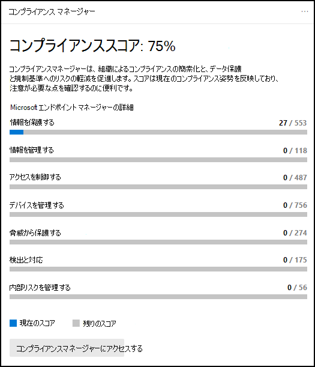
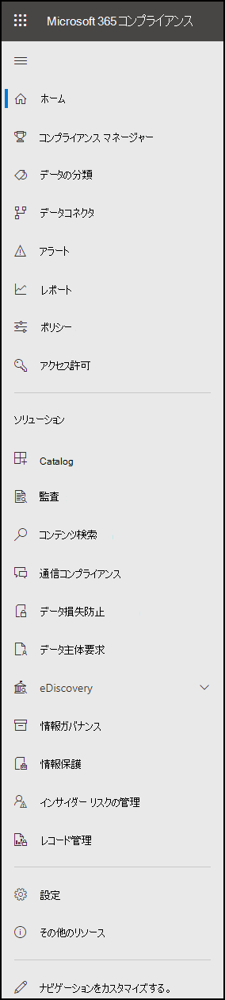

# Microsoft Purview コンプライアンス ポータル

[!include[Purview banner](../includes/purview-rebrand-banner.md)]

組織のコンプライアンス体制に関心がある場合は、 <a href="https://go.microsoft.com/fwlink/p/?linkid=2077149" target="_blank">Microsoft Purview コンプライアンス ポータル</a>を気に入る必要があります。 Microsoft Purview コンプライアンス ポータルでは、組織のコンプライアンス ニーズに管理するために必要なデータとツールに簡単にアクセスできます。

この記事を読んで、コンプライアンス ポータル、それに [アクセスする方法](#how-do-i-access-the-compliance-portal)、 [および次の手順](#next-steps)について説明します。

## Microsoft Purview へようこそ

コンプライアンス ポータルに初めてアクセスすると、次のウェルカム メッセージが表示されます。

ウェルカム バナーには、次の手順で開始する方法に関するいくつかのポインターと、フィードバックをお寄せいただく招待が表示されます。

## カード セクション

コンプライアンス ポータルに初めてアクセスすると、ホーム ページのカード セクションに、組織がデータ コンプライアンスをどのように行っているか、組織で利用できるソリューション、アクティブなアラートの概要が一目でわかります。

ここから、以下の操作を行うことができます。

- **Microsoft Purview コンプライアンス マネージャー** カードを確認します。これにより、[コンプライアンス マネージャー](compliance-manager.md) ソリューションが表示されます。 コンプライアンス マネージャーは、コンプライアンスの管理方法を簡略化するのに役立ちます。 これは、データ保護と規制基準に関するリスクを軽減するのに役立つ推奨されるアクションの完了に向けた進行状況を測定するリスクベースのスコアを計算します。 また、ワークフロー機能と組み込みの制御マッピングも提供され、改善アクションを効率的に実行するのに役立ちます。

    

- エンド ツー エンドのコンプライアンス シナリオを管理するために使用できる [統合ソリューション](microsoft-365-solution-catalog.md)のコレクションへのリンクである新しいソリューション **カタログ** カードを確認します。 ソリューションの機能とツールには、ポリシー、アラート、レポートなどの組み合わせが含まれる場合があります。

    

- **アクティブなアラート** カードを確認します。このカードには、最も [アクティブなアラート](alert-policies.md)の概要が含まれ、重大度、状態、カテゴリなど、より詳細な情報を表示できるリンクが含まれています。

    

また、[**カードの追加]** 機能を使用して、組織のクラウド アプリのコンプライアンスを示すカードや、共有ファイルを持つユーザーに関するデータを表示するカードなど、[Defender for Cloud アプリ](/cloud-app-security/)やデータを探索できるその他のツールへのリンクを追加することもできます。

## より多くのコンプライアンス機能と機能への簡単なナビゲーション

ホーム ページのカード内のリンクに加えて、画面の左側にナビゲーション ウィンドウが表示され、 [アラート](../security/office-365-security/alerts.md)、 [レポート](reports-in-security-and-compliance.md)、 [ポリシー](alert-policies.md)、コンプライアンス ソリューションなどへの簡単なアクセスが提供されます。 カスタマイズされたナビゲーション ウィンドウのオプションを追加または削除するには、ナビゲーション ウィンドウのナビゲーション コントロールの **カスタマイズ** を使用します。 これにより、[ **ナビゲーション ウィンドウのカスタマイズ** ] 設定が開き、ナビゲーション ウィンドウに表示される項目を構成できます。

 

****

|ナビゲーション|Comments|
|---|---|
||[ **ホーム** ] を選択して、コンプライアンス ポータルのメイン ページに戻ります。 
 **コンプライアンス マネージャー** にアクセスして、コンプライアンス スコアを確認し、組織の [コンプライアンスの管理を](compliance-manager.md)開始します。 
 [ **データ分類** ] セクションを選択して、 [トレーニング可能な分類子](classifier-learn-about.md)、 [機密情報の種類のエンティティ定義](sensitive-information-type-entity-definitions.md)、コンテンツ、 [アクティビティ エクスプローラーに](data-classification-activity-explorer.md) アクセスします。 
 **[データ コネクタ**] を選択して、Microsoft 365 サブスクリプション内のデータをインポートおよびアーカイブ [するようにコネクタを構成](archiving-third-party-data.md)します。 
 アラートに移動して **アラート** を表示および解決 [する](alert-policies.md) 
**レポート** にアクセスして、[ラベルの使用状況と保持](sensitivity-labels.md)、[DLP ポリシーの一致とオーバーライド](view-the-dlp-reports.md)、[共有ファイル](/cloud-app-security/file-filters)、[使用中のサード パーティ製アプリ](/cloud-app-security/discovered-apps)などのデータを表示します。 
 **[ポリシー]** に移動して、データの管理、デバイスの管理、アラートの受信を行うポリシーを設定 [します](../security/office-365-security/alerts.md)。 [DLP](dlp-learn-about-dlp.md) ポリシーと[アイテム保持](retention.md)ポリシーにアクセスすることもできます。 
 [ **アクセス許可]** を選択して、組織内でコンプライアンス ポータルにアクセスできるユーザーを管理し、コンテンツを表示し、タスクを完了します。 
 [ **ソリューション** ] セクションのリンクを使用して、組織のコンプライアンス ソリューションにアクセスします。 これには、次のものが含まれます。 
 [カタログ](microsoft-365-solution-catalog.md)   組織で利用できるインテリジェントなコンプライアンスとリスク管理ソリューションを見つけて、学習し、使用を開始します。 
 [監査](search-the-audit-log-in-security-and-compliance.md)   監査ログを使用して、一般的なサポートとコンプライアンスの問題を調査します。 
 [コンテンツ検索](search-for-content.md)   コンテンツ検索を使用すると、Exchange メールボックス内の電子メール、SharePoint サイトやOneDriveの場所のドキュメント、Microsoft TeamsとSkype for Businessでのインスタント メッセージングの会話をすばやく検索できます。 
 [通信コンプライアンス](communication-compliance.md)   不適切なメッセージを自動的にキャプチャし、ポリシー違反の可能性を調査し、修復する手順を実行することで、通信リスクを最小限に抑えます。 
 [Microsoft Purview データ損失防止について学習する](dlp-learn-about-dlp.md)   機密性の高いコンテンツが組織全体、クラウド、デバイスで使用および共有されている状態を検出し、偶発的なデータ損失を防ぐのに役立ちます。 
 [データ サブジェクト要求](/compliance/regulatory/gdpr-manage-gdpr-data-subject-requests-with-the-dsr-case-tool)   一般データ保護規則 (GDPR) のデータ主体の要求に対応するために、ユーザーの個人データを検索してエクスポートします。 
 [電子情報開示](overview-ediscovery-20.md)   このセクションを展開して、組織の内部および外部の調査に対応するコンテンツの保持、収集、レビュー、分析、エクスポートにコアと電子情報開示 (プレミアム) を使用します。 
 [データ ライフサイクル管理](manage-data-governance.md)   重要なデータをインポート、格納、分類する機能を使用して機密データのライフサイクルを管理し、必要なものを保持し、不要なものを削除できるようにします。 
 [情報保護](information-protection.md)   組織全体のライフサイクルを通じて、機密データとビジネスクリティカルなデータを検出、分類、保護します。 
 [インサイダー リスク管理](insider-risk-management.md)   組織全体で危険なアクティビティを検出し、インサイダーのリスクと脅威を迅速に特定し、調査し、アクションを実行できるようにします。 
 [レコード管理](records-management.md)   ビジネス、法的、または規制上の記録保持要件に対する価値の高いアイテムの保持と削除を管理します。|
|

## コンプライアンス ポータルにアクセス操作方法?

コンプライアンス ポータルにアクセスするには、グローバル管理者、 [https://compliance.microsoft.com](https://compliance.microsoft.com) コンプライアンス管理者、またはコンプライアンス データ管理者としてサインインします。

## 次の手順

- **Microsoft Purview コンプライアンス マネージャーにアクセス** して、コンプライアンス スコアを確認し、組織のコンプライアンスの管理を開始します。 詳細については、「 [コンプライアンス マネージャー](compliance-manager.md)」を参照してください。

- 内部リスクを最小限に抑え、組織内の危険なアクティビティの検出、調査、およびアクションを実行できるように、**インサイダー リスク管理ポリシーを構成** します。 See [Learn about insider risk management](insider-risk-management.md).

- **組織のデータ損失防止ポリシーを確認** し、必要に応じて必要な変更を加えます。 詳細については、「 [データ損失防止の詳細](dlp-learn-about-dlp.md)」を参照してください。

- **Microsoft Defender for Cloud Appsについて知り、設定** します。 [クイック スタート: Microsoft Defender for Cloud Appsの概要に関するページを](/cloud-app-security/getting-started-with-cloud-app-security)参照してください。

- **コミュニケーション コンプライアンス ポリシーについて説明し、** 企業の行動規範ポリシー違反を迅速に特定して修復します。 See [Learn about communication compliance](communication-compliance.md).

- **コンプライアンス ポータルに頻繁にアクセス** し、発生するアラートや潜在的なリスクを確認してください。 [https://compliance.microsoft.com](https://compliance.microsoft.com) に移動し、サインインします。
