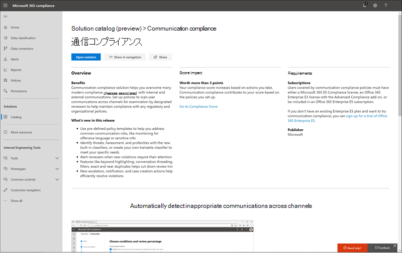

# Microsoft Purview ソリューション カタログ

[!include[Purview banner](../includes/purview-rebrand-banner.md)]

Microsoft 365でコンプライアンス タスクをすばやく開始する方法をお探しですか? [Microsoft Purview ソリューション カタログ](https://compliance.microsoft.com/solutioncatalog)を確認して、コンプライアンスソリューションとリスク管理ソリューションの検出、学習、および迅速な開始を行います。

Microsoft 365のコンプライアンス ソリューションは、エンド ツー エンドのコンプライアンス シナリオの管理に役立つ統合機能のコレクションです。 ソリューションの機能とツールには、ポリシー、アラート、レポートなどの組み合わせが含まれる場合があります。

この記事を読んで、Microsoft Purview コンプライアンス ポータルの新しいソリューション カタログ、 [それを入手する方法](#how-do-i-get-this) 、 [および次の手順](#next-steps)について説明します。

## カタログの組織

ソリューション カタログは、Microsoft 365 サブスクリプションで使用できる各コンプライアンス ソリューションの情報カードを含むセクションにまとめられます。 各セクションには、コンプライアンス領域別にグループ化されたソリューションのカードが含まれています。

ソリューション カードの **[表示** ] を選択すると、コンプライアンス ソリューションと開始方法に関する詳細情報が表示されます。 この情報には、概要、構成前の要件、学習リソース、ナビゲーション ウィンドウにカードをピン留めできるコントロール、およびソリューションをリンク、電子メール、またはMicrosoft Teams メッセージとして共有するオプションが含まれます。

## [情報保護&ガバナンス] セクション

[ **情報保護&ガバナンス** ] セクションでは、Microsoft Purview ソリューションを使用して組織内のデータを保護および管理する方法を一目で確認できます。

ここから、次の解決策のカードが表示されます。

- [Microsoft Purview データ損失防止](dlp-learn-about-dlp.md): 機密性の高いコンテンツが組織全体、クラウド、デバイスで使用および共有されるのを検出し、偶発的なデータ損失を防ぐのに役立ちます。
- [データ ライフサイクル管理](manage-data-governance.md): ビジネスに不可欠なデータをインポート、格納、分類するためのソリューションを使用してコンテンツ ライフサイクルを管理し、必要なものを保持し、不要なものを削除できるようにします。
- [情報保護](information-protection.md): 組織全体のライフサイクルを通じて、機密性の高いビジネスクリティカルなコンテンツを検出、分類、保護します。
- [レコード管理](records-management.md): インテリジェントな分類を使用して、組織内の規制、法的、およびビジネスクリティカルなレコードの保持スケジュールを自動化し、簡素化します。

## インサイダー リスク管理セクション

ホーム ページの **Insider リスク管理** セクションでは、組織が内部リスクを特定し、分析し、害を及ぼす前にアクションを実行する方法を一目で確認できます。

ここから、次の解決策のカードが表示されます。

- [コミュニケーション コンプライアンス](communication-compliance.md): 不適切なメッセージを自動的にキャプチャし、ポリシー違反の可能性を調査し、害を最小限に抑えるための措置を講じるのを支援することで、通信リスクを最小限に抑えます。
- [インサイダー リスク管理](insider-risk-management.md): 組織内の危険なアクティビティを検出して、インサイダーリスクと脅威を迅速に特定、調査、およびアクションを実行できるようにします。

## [検出&応答] セクション

ホーム ページ **の [検出&応答** ] セクションには、組織が関連データに関するコンプライアンスの問題をすばやく見つけ、調査し、対応する方法が一目でわかります。

ここから、次の解決策のカードが表示されます。

- [監査](search-the-audit-log-in-security-and-compliance.md): 組織のユーザーと管理者のアクティビティを記録して、監査ログを検索し、すべての場所とサービスにわたるアクティビティの包括的な一覧を調査できるようにします。
- [データ主体の要求](/compliance/regulatory/gdpr-manage-gdpr-data-subject-requests-with-the-dsr-case-tool): GDPR のデータ主体の要求に対応するためにユーザーの個人データを検索してエクスポートします。
- [電子情報開示](manage-legal-investigations.md)
    - [電子情報開示 (Standard)](./get-started-core-ediscovery.md): コンテンツの場所全体を検索して、法的な検出要求や電子情報開示のケースに対応してデータを識別、保持、エクスポートします。
    - [電子情報開示 (プレミアム)](overview-ediscovery-20.md): 検出要求に関連するデータをさらに分析するのに役立つインテリジェントな分析と機械学習を提供することで、電子情報開示機能に基づいています。

## これを取得操作方法?

Microsoft Purview ソリューション カタログにアクセスするには、グローバル管理者、コンプライアンス管理者、またはコンプライアンス データ管理者としてサインイン [https://compliance.microsoft.com](https://compliance.microsoft.com) します。 画面の左側にあるナビゲーション ウィンドウで [ **カタログ** ] を選択して、カタログのホーム ページを開きます。

## 次の手順

- **Microsoft Purview コンプライアンス マネージャーにアクセス** すると、組織の主要な標準と規制に対するコンプライアンスの状態を理解できます。 全体的なコンプライアンス体制を強化するために実行できる推奨されるアクションが提供され、これらのアクションを効率的に実行するのに役立つワークフロー機能が提供されます。 詳細については、「 [コンプライアンス マネージャー](compliance-manager.md)」を参照してください。

- 内部リスクを最小限に抑え、組織内の危険なアクティビティの検出、調査、およびアクションを実行できるように、**インサイダー リスク管理ポリシーを構成** します。 See [Learn about insider risk management](insider-risk-management.md).

- 会社の行動規範ポリシー違反を迅速に特定して修復するための **コミュニケーション コンプライアンス ポリシーについて説明** し、作成します。 [コミュニケーション コンプライアンスに関する](communication-compliance.md)情報を参照してください。

- **Microsoft Purview Information Protection** では、Microsoft Purview ソリューションを使用して、どこに住んでも旅行しても機密情報を検出、分類、保護する方法について説明します。
    - **Microsoft Defender for Cloud Appsについて知り、設定** します。 [クイック スタート: Microsoft Defender for Cloud Appsの概要に関するページを](/cloud-app-security/getting-started-with-cloud-app-security)参照してください。
    - **分類子を使用して概要します**。 コンテンツを分類し、適切に保護および処理できるようにラベルを付けるのが、情報保護規範の出発点です。 [トレーニング可能な分類子の詳細 (プレビュー)に関するページを](classifier-learn-about.md)参照してください。

- **Microsoft Purview ソリューション カタログに頻繁にアクセス** し、コンプライアンス ニーズに役立つ新しいソリューションを確認してください。 サインインし、左側の [https://compliance.microsoft.com](https://compliance.microsoft.com) ナビゲーション ウィンドウで **[カタログ** ] を選択します。
