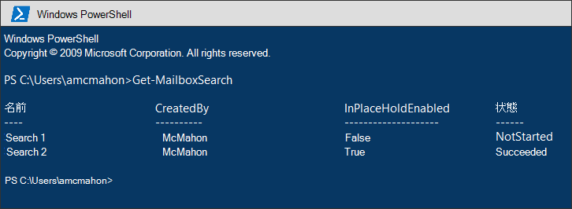
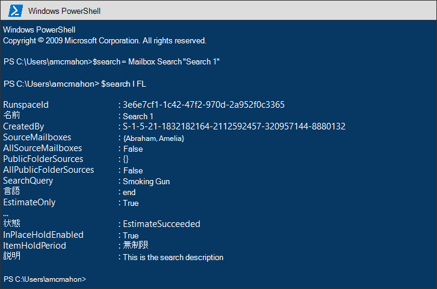
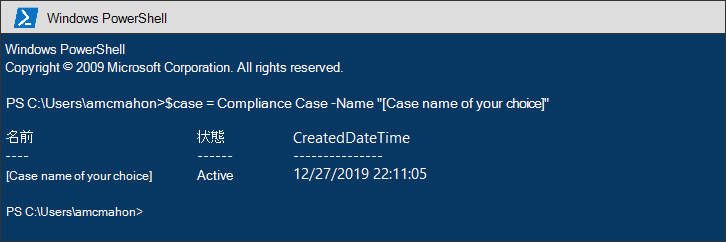
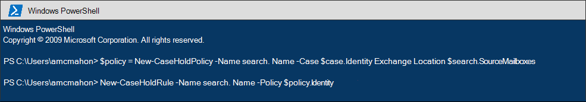
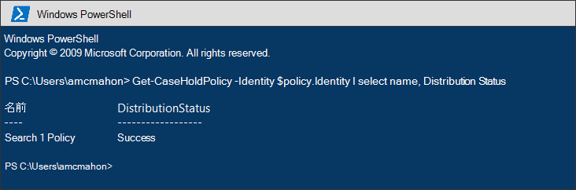
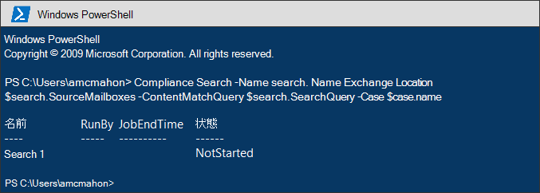
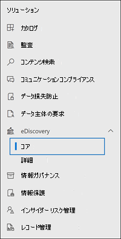
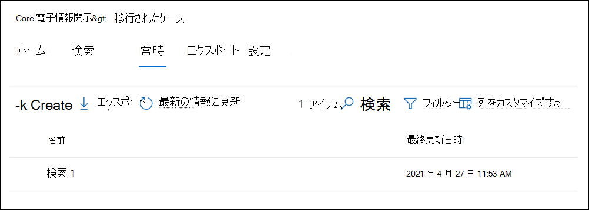
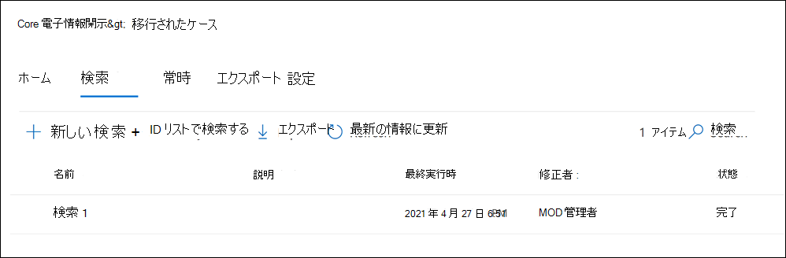

# <a name="migrate-legacy-ediscovery-searches-and-holds-to-the-compliance-portal"></a>従来の電子情報開示の検索と保留をコンプライアンス ポータルに移行する

[!include[Purview banner](../includes/purview-rebrand-banner.md)]

Microsoft Purview コンプライアンス ポータルでは、電子情報開示の使用に関するエクスペリエンスが向上します。これには、信頼性の向上、パフォーマンスの向上、電子情報開示ワークフローに合わせた多くの機能が用意されています。これには、コンテンツを問題別に整理するためのケース、コンテンツと分析をレビューするためのレビュー セットが含まれており、ほぼ重複するグループ化、電子メール スレッド、テーマ分析、予測コーディングなどのデータをカリングするのに役立ちます。

この記事では、お客様が新機能と改善された機能を利用できるように、Exchange<a href="https://go.microsoft.com/fwlink/p/?linkid=2059104" target="_blank">管理センター</a>からコンプライアンス ポータルに電子情報開示の検索と保留In-Place移行する方法に関する基本的なガイダンスを提供します。

> [!NOTE]
> さまざまなシナリオがあるため、この記事では、コンプライアンス ポータルで検索と保留を電子情報開示 (Standard) ケースに移行するための一般的なガイダンスを提供します。 電子情報開示ケースの使用は必ずしも必要ではありませんが、組織内の電子情報開示ケースにアクセスできるユーザーを制御するためのアクセス許可を割り当てることで、セキュリティのレイヤーが追加されます。

## <a name="before-you-begin"></a>開始する前に

- この記事で説明する PowerShell コマンドを実行するには、コンプライアンス ポータルの電子情報開示マネージャー役割グループのメンバーである必要があります。 また、<a href="https://go.microsoft.com/fwlink/p/?linkid=2059104" target="_blank">Exchange管理センター</a>の探索管理役割グループのメンバーである必要もあります。

- この記事では、電子情報開示ホールドを作成する方法に関するガイダンスを提供します。 ホールド ポリシーは、非同期プロセスを通じてメールボックスに適用されます。 電子情報開示ホールドを作成するときは、CaseHoldPolicy と CaseHoldRule の両方を作成する必要があります。それ以外の場合、保留は作成されず、コンテンツの場所は保留にされません。

## <a name="step-1-connect-to-exchange-online-powershell-and-security--compliance-center-powershell"></a>手順 1: PowerShell とセキュリティ & コンプライアンス センター PowerShell をExchange OnlineするConnect

最初の手順は、Exchange Online PowerShell と Security & Compliance Center PowerShell に接続することです。 次のスクリプトをコピーし、PowerShell ウィンドウに貼り付けてから実行できます。 接続先の組織の資格情報を求めるメッセージが表示されます。 

```powershell
$UserCredential = Get-Credential
$sccSession = New-PSSession -ConfigurationName Microsoft.Exchange -ConnectionUri https://ps.compliance.protection.outlook.com/powershell-liveid -Credential $UserCredential -Authentication Basic -AllowRedirection
Import-PSSession $sccSession -DisableNameChecking
$exoSession = New-PSSession -ConfigurationName Microsoft.Exchange -ConnectionUri https://ps.outlook.com/powershell-liveid/ -Credential $UserCredential -Authentication Basic -AllowRedirection
Import-PSSession $exoSession -AllowClobber -DisableNameChecking
```

この PowerShell セッションでは、次の手順でコマンドを実行する必要があります。

## <a name="step-2-get-a-list-of-in-place-ediscovery-searches-by-using-get-mailboxsearch"></a>手順 2: Get-MailboxSearchを使用してIn-Place電子情報開示検索の一覧を取得する

認証が完了したら、 **Get-MailboxSearch** コマンドレットを実行して、In-Place電子情報開示検索の一覧を取得できます。 次のコマンドをコピーして PowerShell に貼り付けてから実行します。 検索の一覧には、名前とIn-Place保留の状態が表示されます。

```powershell
Get-MailboxSearch
```

コマンドレットの出力は次のようになります。



## <a name="step-3-get-information-about-the-in-place-ediscovery-searches-and-in-place-holds-you-want-to-migrate"></a>手順 3: 移行するIn-Place電子情報開示検索とIn-Place保留に関する情報を取得する

ここでも **Get-MailboxSearch** コマンドレットを使用しますが、今回は検索のプロパティを取得します。 これらのプロパティは、後で使用するために変数に格納できます。 次の例では **、Get-MailboxSearch** コマンドレットの結果を変数に格納し、検索のプロパティを表示します。

```powershell
$search = Get-MailboxSearch -Identity "Search 1"
```

```powershell
$search | FL
```

これら 2 つのコマンドの出力は、次のようになります。



> [!NOTE]
> この例のIn-Placeホールドの期間は無期限です (*ItemHoldPeriod: Unlimited*)。 これは、電子情報開示と法的調査のシナリオで一般的です。 保持期間の値が無期限と異なる場合、保持が保持シナリオでコンテンツを保持するために使用されている可能性があります。 保持シナリオでは、Security & Compliance Center PowerShell で電子情報開示コマンドレットを使用する代わりに、 [New-RetentionCompliancePolicy](/powershell/module/exchange/new-retentioncompliancepolicy) と [New-RetentionComplianceRule](/powershell/module/exchange/new-retentioncompliancerule) を使用してコンテンツを保持することをお勧めします。 これらのコマンドレットを使用した結果は **、New-CaseHoldPolicy** と **New-CaseHoldRule** の使用に似ていますが、保持期間の有効期限が切れた後にコンテンツを削除するなど、保持期間と保持アクションを指定できます。 また、保持コマンドレットを使用しても、保持保持を電子情報開示ケースに関連付ける必要はありません。

## <a name="step-4-create-a-case-in-the-microsoft-purview-compliance-portal"></a>手順 4: Microsoft Purview コンプライアンス ポータルでケースを作成する

電子情報開示ホールドを作成するには、保留を関連付ける電子情報開示ケースを作成する必要があります。 次の例では、任意の名前を使用して電子情報開示ケースを作成します。 後で使用できるように、新しいケースのプロパティを変数に格納します。 ケースの作成後にコマンドを実行すると、 `$case | FL` これらのプロパティを表示できます。

```powershell
$case = New-ComplianceCase -Name "[Case name of your choice]"
```


## <a name="step-5-create-the-ediscovery-hold"></a>手順 5: 電子情報開示ホールドを作成する

ケースが作成されたら、保留リストを作成し、前の手順で作成したケースに関連付けることができます。 ケースホールド ポリシーとケースホールド ルールの両方を作成する必要があることを忘れないでください。 ケースホールド ポリシーを作成した後にケースホールド ルールが作成されない場合、電子情報開示ホールドは作成されず、コンテンツは保留にされません。

次のコマンドを実行して、移行する電子情報開示ホールドを再作成します。 これらの例では、移行する手順 3 の In-Place Hold のプロパティを使用します。 最初のコマンドは、新しいケース ホールド ポリシーを作成し、プロパティを変数に保存します。 2 番目のコマンドでは、対応するケース ホールド ルールが作成されます。

```powershell
$policy = New-CaseHoldPolicy -Name $search.Name -Case $case.Identity -ExchangeLocation $search.SourceMailboxes
```

```powershell
New-CaseHoldRule -Name $search.Name -Policy $policy.Identity
```



## <a name="step-6-verify-the-ediscovery-hold"></a>手順 6: 電子情報開示ホールドを確認する

保留の作成に問題がないことを確認するには、保留の配布状態が成功したことを確認することをお勧めします。 配布とは、前の手順で *ExchangeLocation* パラメーターで指定したすべてのコンテンツの場所にホールドが適用されたことを意味します。 これを行うには、 **Get-CaseHoldPolicy** コマンドレットを実行します。 前の手順で作成した *$policy* 変数に保存されたプロパティは変数で自動的に更新されないため、コマンドレットを再実行してディストリビューションが成功したことを確認する必要があります。 ケース ホールド ポリシーが正常に配布されるまでには、5 分から 24 時間かかる場合があります。

次のコマンドを実行して、電子情報開示ホールドが正常に配布されたことを確認します。

```powershell
Get-CaseHoldPolicy -Identity $policy.Identity | Select name, DistributionStatus
```

*DistributionStatus* プロパティの **Success** の値は、ホールドがコンテンツの場所に正常に配置されたことを示します。 ディストリビューションがまだ完了していない場合は、 **保留中** の値が表示されます。



## <a name="step-7-create-the-search"></a>手順 7: 検索を作成する

最後の手順では、手順 3 で特定した検索を再作成し、ケースに関連付けます。 検索を作成した後は、 **Start-ComplianceSearch** コマンドレットを使用して実行するか、後で実行できます。

```powershell
New-ComplianceSearch -Name $search.Name -ExchangeLocation $search.SourceMailboxes -ContentMatchQuery $search.SearchQuery -Case $case.name
```



## <a name="step-8-verify-the-case-hold-and-search-in-the-compliance-portal"></a>手順 8: コンプライアンス ポータルでケース、ホールド、検索を確認する

すべてが正しく設定されていることを確認するには、コンプライアンス ポータルの [[https://compliance.microsoft.com](https://compliance.microsoft.com)**電子情報開示> Core**] をクリックします。



手順 3 で作成したケースは、 **電子情報開示 (Standard)** ページに一覧表示されます。 ケースを開き、[保留] タブの一覧の手順 4 で作成した **保留リスト** に注目します。保留リストを選択すると、ポップアップ ページに詳細が表示されます。これには、保留が適用されるメールボックスの数や配布状態が含まれます。



手順 7 で作成した検索は、ケースの [ **検索** ] タブに一覧表示されます。



In-Place電子情報開示検索を移行しても電子情報開示ケースに関連付けない場合は、コンプライアンス ポータルの [コンテンツ検索] ページに一覧表示されます。

## <a name="more-information"></a>詳細

- Exchange<a href="https://go.microsoft.com/fwlink/p/?linkid=2059104" target="_blank">管理センター</a>での電子情報開示&保留のIn-Placeの詳細については、次を参照してください。
  
  - [インプレース電子情報開示 (eDiscovery)](/exchange/security-and-compliance/in-place-ediscovery/in-place-ediscovery)

  - [インプレース保持と訴訟ホールド](/exchange/security-and-compliance/in-place-and-litigation-holds)

- 記事で使用されている PowerShell コマンドレットの詳細については、次を参照してください。

  - [Get-MailboxSearch](/powershell/module/exchange/get-mailboxsearch)
  
  - [New-ComplianceCase](/powershell/module/exchange/new-compliancecase)

  - [New-CaseHoldPolicy](/powershell/module/exchange/new-caseholdpolicy)
  
  - [New-CaseHoldRule](/powershell/module/exchange/new-caseholdrule)

  - [Get-CaseHoldPolicy](/powershell/module/exchange/get-caseholdpolicy)
  
  - [New-ComplianceSearch](/powershell/module/exchange/new-compliancesearch)

  - [Start-ComplianceSearch](/powershell/module/exchange/start-compliancesearch)

- コンプライアンス ポータルの詳細については、「 [Microsoft Purview コンプライアンス ポータルの概要](microsoft-365-compliance-center.md)」を参照してください。