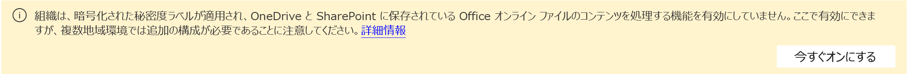

# データを保護するための既定のラベルとポリシー

>*[セキュリティとコンプライアンスのための Microsoft 365 ライセンス ガイダンス](/office365/servicedescriptions/microsoft-365-service-descriptions/microsoft-365-tenantlevel-services-licensing-guidance/microsoft-365-security-compliance-licensing-guidance)。*

対象となるお客様は、Microsoft Purview の情報保護の既定のラベルとポリシーをアクティブ化できます。 

- 秘密度ラベルと秘密度ラベル ポリシー
- クライアント側の自動ラベル付け
- サービス側の自動ラベル付け
- Teams とデバイスのデータ損失防止 (DLP) ポリシー

これらの既定の構成を使用すると、Microsoft 365 の Microsoft Purview の情報保護をすばやく起動して実行できます。 これらの変更は、現状通り使用したり、わずかに変更を加えたり、ビジネス要件に合わせて完全にカスタマイズしたりすることができます。 

対象となるお客様には、[Microsoft Purview の無料試用版](compliance-easy-trials.md)をお持ちのお客様と、Microsoft 365 E5 プランを既にお持ちのお客様が含まれます。

- **新しいお客様**: Microsoft Purview を導入してから 30 日以内であれば、テナントはリストされたすべてのデフォルト設定を有効にすることができます。これらの設定は、いつでも無効化、削除、編集することができます。

- **既存のお客様**: Microsoft Purview を取得して 30 日を超えている場合は、同等の構成をまだ構成していない場合は、既定の構成をアクティブ化できます。

    | 既定の構成| 値 |
    |:-----|:-----|
    |秘密度ラベルと秘密度ラベル ポリシー | 発行された秘密度ラベル |
    |クライアント側の自動ラベル付け | Office アプリで自動的に適用 (またはユーザーに推奨) するように構成された 1 つ以上の秘密度ラベル|
    |サービス側の自動ラベル付け | 有効になっている少なくとも 1 つの自動ラベル付けポリシー|
    |Teams 向け DLP | Teams の少なくとも 1 つの DLP ポリシー|
    |デバイス用の DLP | デバイス用の少なくとも 1 つの DLP ポリシー|

## 既定のラベルとポリシーをアクティブ化する

これらの事前構成済みのラベルとポリシーを取得するには、次の手順を実行します: 

1. [Microsoft Purview コンプライアンス ポータル](https://compliance.microsoft.com/)から [**ソリューション**]  >  [**Information protection**] を選択します。
    
    このオプションがすぐに表示されない場合は、まずナビゲーション ウィンドウから **[すべて 表示]** を選択します。 
    
2. Microsoft Purview の情報保護の既定のラベルとポリシーの対象である場合は、次の情報が表示されるので、既定のラベルとポリシーをアクティブ化できます。次に例を示します。
    
    :::image type="content" alt-text="事前に構成されたラベルとポリシーの Microsoft Purview の情報保護のアクティブ化" source="../media/mip-preconfigured.png" lightbox="../media/mip-preconfigured.png":::
    
    ライセンス認証オプションでこの情報が表示されない場合は、現時点では秘密度ラベルと秘密度ポリシーの自動作成をご利用いただけません。 この状態が変更されたか、後でもう一度ご確認ください。または、次の設定情報を使用して手動で同じラベルとポリシーを作成することもできます。

3. 次に、SharePoint と OneDrive の秘密度ラベルを有効にします。この手順は、Office for the Web で秘密度ラベルを使用し、SharePoint と OneDrive の自動ラベル付けポリシーを使用するための前提条件です。
   
    Information Protection の [**概要**] タブの上部にある次のバナーを使用して、[**今すぐ有効にする**] を選択します。 このバナーが表示されていない場合は、SharePoint と OneDrive の秘密度ラベルがテナントに対して既に有効になっています。
    
    
    
    この機能の詳細については、「[SharePoint および OneDrive で Office ファイルの秘密度ラベルを有効にする](sensitivity-labels-sharepoint-onedrive-files.md)」を参照してください。

## 既定の秘密度ラベル

公開されている秘密度ラベルがない場合は、次のラベルが作成されます。

|ラベル名|ユーザー向けの説明を編集|Settings|
|-------------------------------|---------------------------|-----------------|
|個人|ビジネス以外のデータ (個人使用のみ)。|**範囲**: アイテム (ファイル、電子メール)   **コンテンツのマーキング**: いいえ  **自動ラベル付け**: いいえ   **グループ設定**: いいえ  **サイト設定**: いいえ   **データベース列の自動ラベル付け**: なし|
|公開|公開使用向けに明確に準備、承認されているビジネス データ。|**範囲**: アイテム (ファイル、電子メール)   **コンテンツのマーキング**: いいえ  **自動ラベル付け**: いいえ   **グループ設定**: いいえ  **サイト設定**: いいえ   **データベース列の自動ラベル付け**: なし|
|全般|パブリック使用を目的としていないビジネス データ。 ただし、必要に応じて、外部パートナーと共有できます。 たとえば、会社の内戦電話ディレクトリ、組織図、社内規準、およびほとんどの内部通信がこれに含まれます。|**範囲**: アイテム (ファイル、電子メール)   **コンテンツのマーキング**: いいえ  **自動ラベル付け**: いいえ   **グループ設定**: いいえ  **サイト設定**: いいえ   **データベース列の自動ラベル付け**: なし|
|全般   \ 誰でも (無制限)|パブリック消費を目的としているのではなく、必要に応じて外部パートナーと共有できる組織データ。 たとえば、機密情報やリリースされたマーケティング資料が含まれない顧客とのやり取りが含まれます。|**範囲**: アイテム (ファイル、電子メール)   **コンテンツのマーキング**: いいえ  **自動ラベル付け**: いいえ   **グループ設定**: いいえ  **サイト設定**: いいえ   **データベース列の自動ラベル付け**: なし|
|全般   \ すべての従業員 (無制限)|パブリック消費を目的としない組織データ。 このコンテンツを外部パートナーと共有する必要がある場合は、他のデータ所有者と共有しても問題ないかどうかを確認し、ラベルを [全般 \ すべてのユーザー] (無制限) に変更します。 たとえば、会社の内戦電話ディレクトリ、組織図、社内規準、およびほとんどの内部通信がこれに含まれます。|**範囲**: アイテム (ファイル、電子メール)   **コンテンツのマーキング**: いいえ  **自動ラベル付け**: いいえ   **グループ設定**: いいえ  **サイト設定**: いいえ   **データベース列の自動ラベル付け**: なし|
|社外秘|権限のないユーザーと共有すると、ビジネスに損害を与える可能性のある機密性の高いビジネス データ。例としては、契約書、セキュリティ レポート、予測サマリー、販売取引データなどがあります。|**範囲**: アイテム (ファイル、電子メール)   **コンテンツのマーキング**: いいえ  **自動ラベル付け**: いいえ   **グループ設定**: いいえ  **サイト設定**: いいえ   **データベース列の自動ラベル付け**: なし|
|社外秘   \ 誰でも (無制限)|暗号化する必要はない機密データ。 このオプションは、注意して適切な業務上の正当性を持って使用します。|このラベルは、[クライアント側の自動 ラベル付け](#client-side-auto-labeling)と[サービス側の自動ラベル付け](#service-side-auto-labeling)で選択されます。   **範囲**: アイテム (ファイル、電子メール)   **コンテンツのマーキング**: フッター: 機密文書  **自動ラベル付け**: ユーザーがラベルを適用することをお勧めします   **グループ設定**: いいえ  **サイト設定**: いいえ   **データベース列の自動ラベル付け**: なし|
|社外秘   \ すべての社員|すべての従業員に完全な権限を与える保護を必要とする機密データ。 データ所有者は、コンテンツを追跡したり、取り消したりできます。|このラベルは、[クライアント側の自動 ラベル付け](#client-side-auto-labeling)と[サービス側の自動ラベル付け](#service-side-auto-labeling)で選択されます。   **範囲**: アイテム (ファイル、電子メール)   **暗号化**: 組織のすべてのユーザーとグループ: 共同作成者  **コンテンツのマーキング**: フッター: 機密文書  **自動ラベル付け**: ユーザーがラベルを適用することをお勧めします   **グループ設定**: いいえ  **サイト設定**: いいえ   **データベース列の自動ラベル付け**: なし |
|社外秘   \ 信頼できるユーザー|組織内外の信頼できるユーザーと共有できる機密データ。 これらのユーザーは、必要に応じてデータを再共有できます。|**範囲**: アイテム (ファイル、電子メール)   **暗号化**: ユーザーがアクセス許可を割り当てることを許可します:   - Outlook の暗号化のみ  - Word、PowerPoint、Excel でユーザーにメッセージを表示する  **コンテンツのマーキング**: フッター: 機密文書  **自動ラベル付け**: いいえ   **グループ設定**: いいえ  **サイト設定**: いいえ   **データベース列の自動ラベル付け**: なし|
|非常に機密性の高い社外秘|権限のないユーザーと共有すると、ビジネスに損害を与える可能性のある非常に機密性の高いビジネス データ。例としては、従業員情報と顧客情報、パスワード、ソース コード、発表前の財務レポートなどがあります。|**範囲**: アイテム (ファイル、電子メール)   **コンテンツマーキング**: 透かし: 極秘  **自動ラベル付け**: いいえ   **グループ設定**: いいえ  **サイト設定**: いいえ   **データベース列の自動ラベル付け**: なし|
|非常に機密性の高い社外秘   \ すべての社員|すべての従業員がこのコンテンツに対するアクセス許可を表示、編集、返信できるようにする非常に機密性の高いデータ。データ所有者は、コンテンツを追跡および取り消すことができます。|**範囲**: アイテム (ファイル、電子メール)   **暗号化**: 組織のすべてのユーザーとグループ: 共同作成者  **コンテンツのマーキング**: フッター: 高機密  **自動ラベル付け**: いいえ   **グループ設定**: いいえ  **サイト設定**: いいえ   **データベース列の自動ラベル付け**: なし|
|非常に機密性の高い社外秘   \ 特定のユーザー |保護が必要で、指定したユーザーが選択したアクセス許可レベルでのみ表示できる、機密性の高いデータ。|**範囲**: アイテム (ファイル、電子メール)   **暗号化**: ユーザーがアクセス許可を割り当てることを許可します:  - Outlook の転送不可  - Word、PowerPoint、Excel でユーザーにメッセージを表示する  **コンテンツのマーキング**: フッター: 高機密  **自動ラベル付け**: いいえ   **グループ設定**: いいえ  **サイト設定**: いいえ   **データベース列の自動ラベル付け**: なし|

> [!NOTE]
> ラベル名と説明は、米国英語、簡体字中国語、繁体字、フランス語、ドイツ語、イタリア語、日本語、韓国語、ブラジル・ポルトガル語、ロシア語、スペイン語の各地域で自動的に使用できます。
> 
> 追加の言語が必要な場合は、[PowerShell を使用して](create-sensitivity-labels.md#example-configuration-to-configure-a-sensitivity-label-for-different-languages)翻訳を指定できます。

これらの構成設定と、感度ラベルを使って何ができるのかについての詳細は、「[感度ラベルで実行できること](sensitivity-labels.md#what-sensitivity-labels-can-do)」をご覧ください。

これらの既定の秘密度ラベルを編集する必要がある場合は、「[秘密度ラベルの作成および構成](create-sensitivity-labels.md#create-and-configure-sensitivity-labels)」を参照してください。

## 既定の秘密度ラベル ポリシー

既定の秘密度ラベル ポリシーを使用すると、ユーザーは機密ラベルを使用してドキュメントやメールにラベルを付け始めることができます。次の構成になっています:

- テナント内のすべてのユーザーに既定のラベルを発行
- ラベル付けされていないドキュメントとメールの **全般** \ **すべての従業員 (無制限)** の既定のラベル
- ユーザーがラベルを削除したり、ラベルの分類を下げる場合には、正当な理由を示す必要があります

これらのポリシー設定、および使用可能な他のポリシー設定の詳細については、「[感度ラベルで実行できること](sensitivity-labels.md#what-label-policies-can-do)」を参照してください。

これらの既定のポリシー設定を編集する必要がある場合は、「[ラベル ポリシーを作成して感度ラベルを発行する](create-sensitivity-labels.md#publish-sensitivity-labels-by-creating-a-label-policy)」を参照してください。

Windows、macOS、iOS、Android の Office アプリにこれらのラベル付けを使用すると、ユーザーには 4 時間以内に新しいラベルが表示されます。web 上のWord、Excel、PowerPoint の場合は更新を行ってから 1 時間以内に新しいラベルが表示されます。ただし、変更がすべてのアプリとサービスに複製されるまでに最大 24 時間かかる場合があります。

## クライアント側の自動ラベル付け

既定のクライアント側の自動ラベル付け構成では、作業中のドキュメントまたはメールでクレジット カード番号が検出されたときに、ユーザーに秘密度ラベルの適用が自動的に推奨されます。 この構成は、自動的に適用されるのではなく、推奨事項として、コンテンツに関する内容を強調表示するための適切な最初のステップとして機能し、ドキュメントやメールにラベルを付ける方法をユーザーに紹介します。

クライアント側の自動ラベル付けは、Office アプリ Word、Excel、PowerPoint、および Outlook で使用されているドキュメントとメールでのみ機能します。 

既定のクライアント側の自動ラベル付けには、次の構成があります。 

- ドキュメントまたはメールにクレジット カード番号が 1 - 9 件見つかった場合は、機密ラベル **機密** \ **すべてのユーザー (無制限)** を適用することをお勧めします。 

- ドキュメントまたはメールにクレジット カード番号のインスタンスが 10 個以上ある場合は、機密ラベル **社外秘** \ **すべての従業員** に適用することをお勧めします 

> [!NOTE]
> 独自の秘密度ラベルが発行されていることを検出した場合は、自動ラベル付け用に独自のラベルのいずれかを選択し、自動的に構成するように求められます。

クライアント側の自動ラベル付け構成を編集する場合は、「[Office アプリの自動ラベル付けを構成する方法](apply-sensitivity-label-automatically.md#how-to-configure-auto-labeling-for-office-apps)」を参照してください。

## サービス側の自動ラベル付け 

サービス側の自動ラベル付けにより、保存中の機密ドキュメントや転送中のメールにラベルを付けることができます。 既定のサービス側の自動ラベル付けポリシーでは、すべての SharePoint サイトまたは OneDrive サイトに保存されているドキュメント、および Exchange Online 経由で送信されるすべての電子メールに対して、シミュレーション モードで実行するポリシーが作成されます。 

シミュレーション モードでは、ポリシーを有効にするまで、アイテムには実際にラベル付けされません。 ポリシーを手動で有効にすることも、既定の設定を変更しない限り、シミュレーションの完了時から数日以内にポリシーに変更がない場合、ポリシーは自動的に有効になります。

> [!NOTE]
> 自動ラベル付けポリシーの自動的な有効化は新しい機能で、新しい自動ラベル付けポリシーに対して段階的にロールアウトされます。 この構成がすぐに表示されない場合もあれば、すべてのポリシーに対して表示されない場合もあります。

ほとんどの場合、編集されていないポリシーが自動的に有効になる日数は 7 日です。 ただし、2022 年 6 月 23 日からの新規顧客に固有の場合、最初の日数は 25 日で、ポリシーの編集後は 7 日です。

シミュレーション モードでは、ポリシーが有効になったときにラベル付けされる項目をプレビューできるため、実際のラベル付けのためにポリシーをテナントに展開する前に、ラベル付け機能に自信を持つことができます。 

既定のサービス側の自動ラベル付けポリシーには、次の構成があります。 

すべての Teams のお客様:

- ドキュメントに 1 から 9 個のクレジット カード番号が見つかった場合は、機密度ラベル **［機密］** \ **［すべてのユーザー (無制限)］** を適用します
    
- ドキュメントまたはメールにクレジット カード番号のインスタンスが 10 個以上ある場合は、機密ラベル **［機密］** \ **［すべての従業員］** に適用することをお勧めします 

> [!NOTE]
> 独自の秘密度ラベルが発行されていることを検出した場合は、自動ラベル付けポリシーに独自のラベルのいずれかを選択するように求められます。

2022 年 6 月 23 日以降の新規のお客様の場合、Microsoft 365 テナントは米国リージョンにあります。

- ドキュメントに 1 から 9 個の米国個人データと本名が見つかった場合は、機密度ラベル **［機密］** \ **［すべてのユーザー (無制限)］** を適用します

- ドキュメントに 10 以上の米国個人データと本名が見つかった場合は、機密度ラベル **［機密］** \ **［すべての従業員］** を適用します 

2022 年 6 月 23 日以降の新規顧客には、設定ごとに 2 つの自動ラベル付けポリシーがあります。 1 つのポリシーは Exchange の場所用で、もう 1 つは SharePoint と OneDrive の場所用です。 ポリシーは同時に作成されますが、SharePoint と OneDrive のシミュレーションはすぐに有効になるわけではありません。
- Exchange の場所: 自動ラベル付けポリシーが作成され、すぐにシミュレーションが開始されます。
- SharePoint と OneDrive の場所: 自動ラベル付けポリシーは作成されますが、シミュレーションが自動的に開始されるまで 25 日間待機します。 この延期期間により、ファイルを作成してこれらの場所に保存する時間が確保されます。 

シミュレーションが完了したら、結果を確認し、問題がなければポリシーをオンにします。 2022 年 6 月 23 日以降、既定では、ポリシーが設定された期間内に編集されていない場合 (新規のお客様の場合は 25 日間、それ以外の場合は 7 日間) ポリシーは自動的に有効になります。

シミュレーション モードの詳細については、「[シミュレーション モードについて](apply-sensitivity-label-automatically.md#learn-about-simulation-mode)」を参照してください。

サービス側の自動ラベル付けポリシーを編集する場合は、「[SharePoint、OneDrive、および Exchange の自動ラベル付けポリシーを構成する方法](apply-sensitivity-label-automatically.md#how-to-configure-auto-labeling-policies-for-sharepoint-onedrive-and-exchange)」を参照してください。

## Teams 向け DLP

Teams の既定の DLP ポリシーは、すべての Teams チャットとチャネル メッセージにクレジット カード番号が存在するかどうかを検出します。 この機密情報が検出されると、管理者は重要度の低いアラート通知を受け取ります。

このポリシーは、ユーザーから見ると目立たず、ポリシー ヒントが表示されるわけでもなければメッセージがブロックされるわけでもありませんが、管理者はこれらのメッセージで共有されている機密情報のレコードを保持することになります。必要に応じて、設定を編集して、この既定の構成を変更できます。

このポリシーの結果を表示するには、[DLP アクティビティ エクスプローラー](dlp-learn-about-dlp.md#dlp-activity-explorer)を使用します。

DLP ポリシーを編集する場合は、「[DLP ポリシーの作成、テスト、調整](create-test-tune-dlp-policy.md)」を参照してください。

## デバイス用の DLP

デバイスの既定の DLP ポリシーは、Microsoft Purview にオンボードされている Windows 10 デバイスにクレジット カード番号が存在することを検出します。次に、以下のアクションを監査 (ブロックしない) します: 

- クラウド サービス ドメインへのアップロードまたは許可されていないブラウザーによるアクセス

- クリップボード、USB、またはネットワーク共有へのコピー 

- 許可されていないアプリによるアクセス 

- 印刷 

- 許可されていない Bluetooth アプリを使用したコピーまたは移動 

- リモート デスクトップ サービス 

コンテンツにクレジット カードのインスタンスが 10 個以上含まれており、一覧表示されているアクティビティの 1 つ以上が検出された場合、重大度が中程度のアラート通知が管理者に送信されます。

このポリシーは、ユーザーから見ると目立たず、ポリシー ヒントが表示されるわけでもなければ操作がブロックされるわけでもありませんが、管理者はすべての疑わしいアクティビティのレコードを保持することになります。 必要に応じて、これらの設定を編集して、この既定の構成を変更できます。

このポリシーの結果を表示するには、[DLP アクティビティ エクスプローラー](dlp-learn-about-dlp.md#dlp-activity-explorer)を使用します。

DLP ポリシーを編集する場合は、「[DLP ポリシーの作成、テスト、調整](create-test-tune-dlp-policy.md)」を参照してください。

## その他のリソース

秘密度ラベル、データ損失防止、および Microsoft Purview の情報保護で使用できるすべての機能の詳細については、次のリソースを参照してください:

- [機密ラベルについて詳しく見る](sensitivity-labels.md)
- [データ損失防止について](dlp-learn-about-dlp.md)
- [Microsoft Purview を使用してデータを保護する](information-protection.md)
