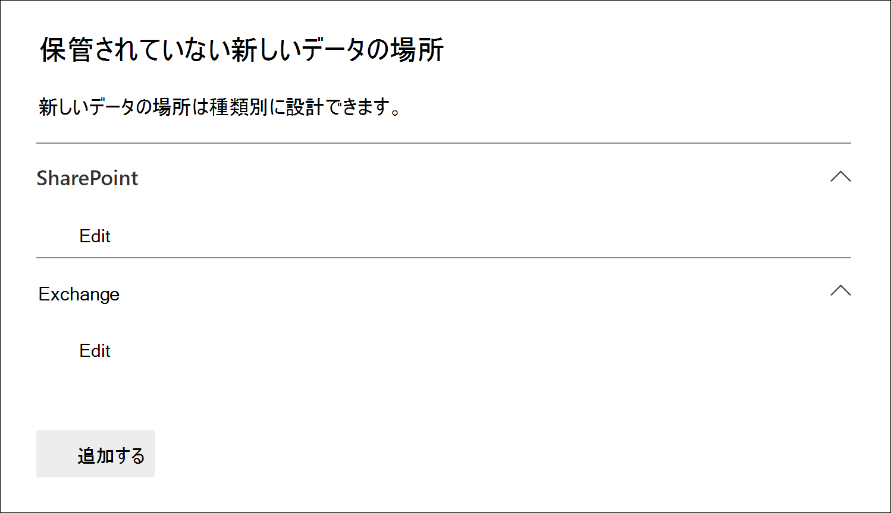

# 非保管データ ソースを電子情報開示 (Premium) ケースに追加する

Microsoft Purview eDiscovery (Premium) の場合、Microsoft 365 データ ソースをケースのカストディアンに関連付ける必要があるわけではありません。 ただし、そのデータを検索し、レビュー セットに追加し、分析して確認できるように、そのデータをケースに関連付ける必要がある場合があります。 電子情報開示 (Premium) の機能は非 *親権データ ソース* と呼ばれ、カストディアンに関連付けなくてもケースにデータを追加できます。 また、カストディアンに関連付けられているデータで使用できる非保管データにも、同じ電子情報開示 (Premium) 機能が適用されます。 非カストディアル データに適用できる最も便利な点の 2 つは、それを保留にして [、高度なインデックス作成](indexing-custodian-data.md)を使用して処理することです。

## 非保管データ ソースを追加する

電子情報開示 (Premium) ケースで非保管データ ソースを追加および管理するには、次の手順に従います。

1. **電子情報開示 (Premium)** ホーム ページで、データを追加するケースをクリックします。

2. [**データ ソース**] タブをクリックし、[**データ ソース** > の **追加] を** クリックします。

3. [ **新しい非保管データの場所** ] ポップアップ ページで、ケースに追加するデータ ソースを選択します。 **SharePoint** または **Exchange** セクションを展開し、[**編集]** をクリックすると、複数のメールボックスとサイトを追加できます。

   

   - **SharePoint** - **[編集]** をクリックしてサイトを追加します。 一覧からサイトを選択するか、検索バーにサイトの URL を入力してサイトを検索できます。 非カストディアン データ ソースとして追加するサイトを選択し、[ **追加**] をクリックします。

   - **Exchange** - **[編集]** をクリックしてメールボックスを追加します。 メールボックスまたは配布グループの検索ボックスに、名前またはエイリアス (3 文字以上) を入力します。 非カストディアン データ ソースとして追加するメールボックスを選択し、[ **追加**] をクリックします。

   > [!NOTE]
   > **SharePoint** セクションと **Exchange** セクションを使用して、チームまたは Yammer グループに関連付けられているサイトとメールボックスを非管理データ ソースとして追加できます。 チームまたは Yammer グループに関連付けられているメールボックスとサイトを個別に追加する必要があります。   また、ルート サイト URL (SharePoint `https://contoso-my.sharepoint.com/personal/`  `https://contoso-my.sharepoint.com/`データ ソースなど) を SharePoint データ ソースとして追加することもサポートされていません。 特定のサイトを追加する必要があります。

4. 非保管データ ソースを追加した後、それらの場所を保留にするかしないかのオプションを使用できます。 データ ソースの横にある **[保留** ] チェック ボックスをオンまたはオフにして保留にします。

5. [**新しい非親権データの場所**] ポップアップ ページの下部にある [**追加]** をクリックして、ケースにデータ ソースを追加します。

   追加した非保管データ ソースは、[ **データ ソース** ] ページに一覧表示されます。 非保管データ ソースは、[**ソースの種類**] 列の **[データの場所**] の値によって識別されます。

   ![[データ ソース] タブの非親権データ ソース。](../media/NonCustodialDataSources2.png)

非保管データ ソースをケースに追加すると、非 *カストディアル データのインデックス再作成* という名前のジョブが作成され、ケースの [ **ジョブ** ] タブに表示されます。 ジョブが作成されると、開始された高度なインデックス作成プロセスとデータ ソースのインデックスが再作成されます。

## 非保管データ ソースの保留を管理する

非親権データ ソースに保留を配置すると、ケースの非保管データ ソースを含む保留ポリシーが自動的に作成されます。 その他の非保管データ ソースを保留にすると、そのデータ ソースはこの保留ポリシーに追加されます。

1. 電子情報開示 (Premium) ケースを開き、[ **保留** ] タブを選択します。

2. **[NCDSHold-\<GUID\>**] をクリックします。ここで、GUID 値はケースに一意です。

   ポップアップ ページには、保留中の非保管データ ソースに関する情報と統計情報が表示されます。

   

3. [ **保留の編集]** をクリックして、保留に配置された非保管データ ソースを表示し、次の管理タスクを実行します。

   - [ **場所]** ページでは、保留リストから削除することで、非保管データ ソースを解放できます。 データ ソースを解放しても、非親権データ ソースはケースから削除されません。 データ ソースに配置されたホールドのみが削除されます。

   - [ **クエリ** ] ページで保留を編集し、ケース内のすべての非親権データ ソースに適用されるクエリ ベースの保留を作成できます。
