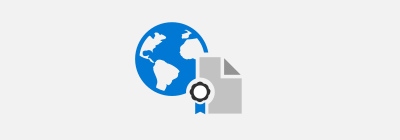

# Microsoft  コンプライアンスのサービス

Microsoft は、お客様の組織がデータの収集と使用を管理する国内、地域、および業界固有の要件に準拠するための包括的なコンプライアンス製品を提供しています。

<ul class="panelContent cardsD">
    <li>
        <a href="">
        

            

                

                    

                        

                            
                        

                    

                    

                        <h3>グローバル</h3>
                        
<a href="offering-cis-benchmark.md">CIS ベンチマーク</a>

                        
<a href="offering-csa-star-attestation.md">CSA-STAR 構成証明</a>

                        
<a href="offering-csa-star-certification.md">CSA-STAR 認定資格</a>

                        
<a href="offering-csa-star-self-assessment.md">CSA-スター自己評価</a>

                        
<a href="offering-ISO-20000-1-2011.md">ISO 20000-1:2011</a>

                        
<a href="offering-ISO-22301.md">ISO 22301</a>

                        
<a href="offering-ISO-27001.md">ISO 27001</a>

                        
<a href="offering-ISO-27017.md">ISO 27017</a>

                        
<a href="offering-ISO-27018.md">ISO 27018</a>

                        
<a href="offering-ISO-27701.md">ISO 27701</a>

                        
<a href="offering-ISO-9001.md">ISO 9001</a>

                        
<a href="offering-soc.md">SOC</a>

                        
<a href="offering-wcag-2-1.md">WCAG</a>

                    

                

            

        

        </a>
    </li>
    <li>
        <a href="">
        

            

                

                    

                        

                            
                        

                    

                    

                        <h3>米国政府機関</h3>
                        
<a href="offering-cjis.md">CJIS</a>

                        
<a href="offering-cnssi-1253.md">CNSSI 1253</a>

                        
<a href="offering-dfars.md">DFARS</a>

                        
<a href="offering-dod-disa-l2-l4-l5.md">DoD DISA、L4、L5</a>

                        
<a href="offering-doe-10-cfr-part-810.md">DoE 10 CFR Part 810</a>

                        
<a href="offering-ear.md">イヤー (US エクスポート Adm.)</a>

                        
<a href="offering-fedramp.md">FedRAMP</a>

                        
<a href="offering-fips-140-2.md">FIPS 140-2</a>

                        
<a href="offering-irs-1075.md">IRS 1075</a>

                        
<a href="offering-itar.md">ITAR</a>

                        
<a href="offering-nist-sp-800-171.md">NIST 800-171</a>

                        
<a href="offering-nist-csf.md">NIST CSF</a>

                        
<a href="offering-section-508-vpats.md">VPATS 第 508</a>

                    

                

            

        

        </a>
    </li>
    <li>
        <a href="">
        

            

                

                    

                        

                            
                        

                    

                    

                        <h3>業種</h3>
                        
<a href="offering-23-nycrr-part-500.md">23 NYCRR Part 500</a>

                        
<a href="offering-afm-dnb-netherlands.md">AFM + DNB (オランダ)</a>

                        
<a href="offering-apra-australia.md">APRA (オーストラリア)</a>

                        
<a href="offering-amf-acpr-france.md">AMF と ACPR (フランス)</a>

                        
<a href="offering-cdsa.md">CDSA</a>

                        
<a href="offering-cftc-1-31-us.md">CFTC 1.31 (US)</a>

                        
<a href="offering-dpp-uk.md">DPP (英国)</a>

                        
<a href="offering-eba-eu.md">EBA (EU)</a>

                        
<a href="offering-fact-uk.md">FACT (英国)</a>

                        
<a href="offering-fca-uk.md">FCA (英国)</a>

                        
<a href="offering-fda-cfr-title-21-part-11.md">FDA CFR Title 21 Part 11</a>

                        
<a href="offering-ferpa.md">FERPA</a>

                        
<a href="offering-ffiec-us.md">FFIEC (米国)</a>

                        
<a href="offering-finma-switzerland.md">FINMA (スイス)</a>

                        
<a href="offering-finra-4511.md">FINRA 4511</a>

                        
<a href="offering-fisc-japan.md">FISC (日本)</a>

                        
<a href="offering-fsa-denmark.md">FSA (デンマーク)</a>

                        
<a href="offering-glba.md">GLBA</a>

                        
<a href="offering-gxp.md">GxP</a>

                        
<a href="offering-hds-france.md">HDS (フランス)</a>

                        
<a href="offering-hipaa-hitech.md">HIPAA/ヒットエコー</a>

                        
<a href="offering-hitrust.md">HITRUST</a>

                        
<a href="offering-knf-poland.md">KNF (ポーランド)</a>

                        
<a href="offering-mars-e.md">MARS-E</a>

                        
<a href="offering-mas-abs-singapore.md">MA + ABS (シンガポール)</a>

                        
<a href="offering-mpaa.md">MPAA</a>

                        
<a href="offering-nbb-fsma-belgium.md">NBB + FSMA (ベルギー)</a>

                        
<a href="offering-nen-7510-netherlands.md">NEN-7510 (オランダ)</a>

                        
<a href="offering-nerc-cip.md">NERC</a>

                        
<a href="offering-nhs-ig-toolkit-uk.md">NHS IG ツールキット (英国)</a>

                        
<a href="offering-osfi-canada.md">OSFI (カナダ)</a>

                        
<a href="offering-pci-dss.md">PCI DSS</a>

                        
<a href="offering-rbi-irdai-india.md">RBI + IRDAI (インド)</a>

                        
<a href="offering-sec-17a-4.md">SEC 17a-4</a>

                        
<a href="offering-sec-reg-sci.md">SEC 規制 SCI</a>

                        
<a href="offering-shared-assessments.md">共有評価</a>

                        
<a href="offering-sox.md">SOX</a>

                        
<a href="offering-tisax-germany.md">TISAX (ドイツ)</a>

                        
<a href="offering-trusight.md">TruSight</a>

                    

                

            

        

        </a>
    </li>
    <li>
        <a href="">
        

            

                

                    

                        

                            
                        

                    

                    

                        <h3>地域</h3>
                        
<a href="offering-bir-2012-netherlands.md">BIR 2012 (オランダ)</a>

                        
<a href="offering-c5-germany.md">C5 (ドイツ)</a>

                        
<a href="offering-ccpa.md">CCPA (米国-カリフォルニア)</a>

                        
<a href="offering-ccsl-irap-australia.md">IRAP/CCSL (オーストラリア)</a>

                        
<a href="offering-cs-mark-gold-japan.md">CS マークゴールド (日本)</a>

                        
<a href="offering-cyber-essentials-plus-uk.md">Cyber Essentials Plus (英国)</a>

                        
<a href="offering-canadian-privacy-laws.md">カナダのプライバシーに関する法律</a>

                        
<a href="https://www.trustcenter.cn/compliance/default.html#DJCP">DJCP (中国)</a>

                        
<a href="offering-en-301-549-eu.md">EN 301 549 (EU)</a>

                        
<a href="offering-ens-spain.md">ENS (スペイン)</a>

                        
<a href="offering-enisa.md">ENISA IAF (EU)</a>

                        
<a href="offering-eu-model-clauses.md">EU モデル条項</a>

                        
<a href="offering-eu-us-privacy-shield.md">EU-US Privacy シールド</a>

                        
<a href="https://www.trustcenter.cn/compliance/default.html#GB18030">GB 18030 (中国)</a>

                        
<a href="gdpr.md">GDPR (EU)</a>

                        
<a href="offering-g-cloud-uk.md">G-Cloud (英国)</a>

                        
<a href="https://www.idw.de/the-idw/about-the-idw">IDW PS 951 (ドイツ)</a>

                        
<a href="offering-ISMS-korea.md">ISMS (韓国)</a>

                        
<a href="offering-it-grundschutz-workbook-germany.md">IT Grundschutz Workbook (ドイツ)</a>

                        
<a href="offering-lopd-spain.md">LOPD (スペイン)</a>

                        
<a href="offering-meity-india.md">MeitY (インド)</a>

                        
<a href="offering-mtcs-singapore.md">MTCS (シンガポール)</a>

                        
<a href="offering-my-number-act-japan.md">マイナンバー (日本)</a>

                        
<a href="offering-nz-cc-framework-nz.md">NZ CC Framework (ニュージーランド)</a>

                        
<a href="offering-pasf-uk.md">PASF (英国)</a>

                        
<a href="offering-pdpa-argentina.md">PDPA (アルゼンチン)</a>

                        
<a href="https://aka.ms/TRUCS-Compliance">TRUCS (中国)</a>

                    

                

            

        

        </a>
    </li>
</ul>
