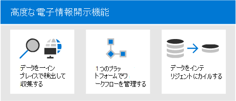

# 概要 Microsoft 365 Advanced eDiscovery

このAdvanced eDiscoveryソリューションMicrosoft 365既存の Microsoft 電子情報開示と分析機能に基付けされています。 Advanced eDiscoveryは、組織の内部および外部調査に対応するコンテンツを保存、収集、分析、レビュー、エクスポートするためのエンドツーエンドのワークフローを提供します。 また、訴訟チームが法的情報保留通知ワークフロー全体を管理して、ケースに関係するカストディアンとコミュニケーションを取ることができます。

## Advanced eDiscovery機能

Advanced eDiscoveryデータを検出することで、組織が法的な問題や内部調査に対応するのに役立ちます。 電子情報開示ワークフローをシームレスに管理するには、関心のある人物とそのデータ ソースを特定し、データを保持するためにホールドをシームレスに適用してから、法的ホールド通信プロセスを管理します。 ソースからデータを収集することで、ライブ データ プラットフォームMicrosoft 365必要な情報をすばやく見つけ出します。 ディープ インデックス作成、電子メール スレッド、重複に近い検出などのインテリジェントな機械学習機能は、大量のデータを関連するデータ セットに削減するのにも役立ちます。

以下のセクションでは、これらの機能が組織Advanced eDiscovery役立つ方法について説明します。

### データを一インプレイスで検出して収集する

従来、複数のサードパーティの電子情報開示ソリューションに依存する組織では、大量のデータを Microsoft 365 からコピーして、重複するデータをホストする必要があります。 これにより、関連するデータを見つける時間が増え、複数のソリューションを管理するリスク、コスト、複雑さも増します。

Advanced eDiscoveryのMicrosoft 365を使用すると、ソースでデータを検出し、セキュリティとコンプライアンスの境界内Microsoft 365を保つことができます。  Advanced eDiscovery は、ライブ システムからデータを一元的に収集することで、ソースに戻る際の摩擦を軽減し、従来の電子情報開示ソリューションでジャーナリングの遅れによって発生する、不足しているコンテンツを見つけ出す必要のない作業を減らします。

Teams、Yammer、Yammer、SharePoint Online、OneDrive for Business、および Exchange Online内のデータのネイティブ検索および収集機能は、データ検出をさらに強化します。 たとえば、次Advanced eDiscovery。

- (会話Teamsメッセージを返す代わりに) 会話を再構築します。

- 電子メール メッセージやチャット内のリンクや最新の添付ファイルを使用して、ユーザーと共有されるクラウドベースのTeamsします。

- 何百種類ものファイル形式以外のファイルMicrosoft 365サポートされています。

- データ コネクタによって Microsoft 365 でインポートおよびアーカイブされるサードパーティソース (ブルームバーグ、Facebook、Slack、ズーム 会議など) からデータを収集[します。](archiving-third-party-data.md)

### 1 つのプラットフォームで電子情報開示ワークフローを管理する

Advanced eDiscoveryは、信頼する必要がある電子情報開示ソリューションの数を減らすのに役立ちます。 このワークフローは、合理化されたエンドツーエンドのワークフローを提供します。このワークフローはすべて、Microsoft 365。 Advanced eDiscovery は、一意の共有データ ソースを関心のあるユーザー (保管担当者と呼ばれる) に自動的にマッピングし、分析とレビューのために収集する前に、潜在的に関連するデータに関するレポートと分析を提供することで、関連する情報の潜在的なソースを特定して収集する摩擦を軽減します。

さらに、Microsoft Graph API は、電子情報開示ワークフローを自動化し、カスタム ソリューションのAdvanced eDiscoveryを拡張するのに役立ちます。

### データをインテリジェントにカイルする

インテリジェントな機械学習機能は、Advanced eDiscoveryするデータ量を減らすのに役立ちます。 これらのインテリジェントな機能は、大量のデータを関連するセットに削減し、カイルするのに役立ちます。 たとえば、組み込みのレビュー セット クエリは、重複の近くを識別して一意のコンテンツのみをフィルター処理するのに役立ちます。 この機能により、確認するデータ量を大幅に削減できます。

機械学習機能を追加すると、関連性モジュールのようなスマート タグとテクノロジ支援レビュー ツールを使用して、関連するデータをさらに絞り込み、特定できます。

## Advanced eDiscovery検出参照モデルとの位置合わせ

電子情報開示リファレンス モデル (EDRM) Advanced eDiscovery Microsoft 365電子情報開示プロセスと一致する、Advanced eDiscoveryの組み込みワークフロー。

(画像ソース提供:edrm.net。 ソース イメージは、クリエイティブ コモンズ アトリビューション 3.0 [報告されていないライセンス] で利用できます。

Advanced eDiscovery が、いかに高いレベルで EDRM ワークフローをサポートするかについて説明します。

- **ID。** 調査に関心のある潜在的な人物を特定したら、Advanced eDiscovery ケースにカストディアン (調査に関連する情報を保持している可能性があるため *データ カストディアン* とも呼ばれます) として追加できます。 ユーザーをカストディアンとして追加すると、カストディアン ドキュメントを簡単に保持、収集、および確認できます。

- **保持。** Advanced eDiscovery を使用すると、調査に関連するデータを保持および保護するために、ケースでカストディアンに関連付けられているデータ ソースに訴訟ホールドを配置することができます。 非カストディアン データを保留にすることもできます。 Advanced eDiscovery には組み込みの通信ワークフローもあり、カストディアンに訴訟ホールド通知を送信し、その受信確認を追跡できます。

- **コレクション。** 調査に関連するデータ ソースを特定 (および保持) したら、Advanced eDiscovery 検索の組み込み検索ツールを使用して、ケースに関連する可能性があるカストディアン データ ソース (および該当する場合は非カストディアン データ ソース) からライブ データを収集できます。

- **処理。** ケースに関連するすべてのデータを収集したら、次の手順は、詳細確認と分析用のプロセスです。 Advanced eDiscovery では、コレクションフェーズで識別したインプレースデータは、Azure Storage (*レビュー セット* と呼ばれる) にコピーされます。これによってケース データを静的に表示できます。 

- **確認します。** データをレビュー セットに追加した後、特定のドキュメントを表示し、追加のクエリを実行して、データをケースに最も関連のあるものに減らします。 また、特定のドキュメントに注釈を付けたり、タグを付けたりすることもできます。

- **分析。** Advanced eDiscovery には、調査に関連していないと判断したレビュー セットのデータをさらに選別するのに役立つ統合分析ツールが用意されています。 Advanced eDiscovery では、関連するデータの量を減らすだけでなく、レビュー プロセスを簡易化して効率化するようにコンテンツを整理できるため、法的レビュー コストを節約するのにも役立ちます。

- **実稼働** と **プレゼンテーション。** 準備ができたら、法的レビュー用のレビュー セットからドキュメントをエクスポートできます。 ドキュメントをネイティブ形式または EDRM で指定された形式でエクスポートして、サード パーティ製のレビュー アプリケーションにインポートできます。

## サブスクリプションとライセンス

ユーザーのライセンスAdvanced eDiscovery適切な組織のサブスクリプションとユーザーごとのライセンスが必要です。

- **組織のサブスクリプション:** 組織内のAdvanced eDiscoveryにMicrosoft 365 コンプライアンス センターするには、組織に次のいずれかを指定する必要があります。

  - Microsoft 365 E5 または Office 365 E5 サブスクリプション
  
  - E5 コンプライアンス アドオンが含まれている Microsoft 365 E3 サブスクリプション

  - Microsoft 365 E3 E5 電子情報開示と監査アドオンを使用したサブスクリプションの作成

  - Microsoft 365 EducationA5 または Office 365 Education A5 サブスクリプション

   既存の Microsoft 365 E5 プランをお持ちで、Advanced eDiscovery を試す場合は、Microsoft 365 を既存のサブスクリプションに追加するか、Microsoft 365 E5 の試用版にサインアップできます。

- **ユーザーごとのライセンス:** Advance 電子情報開示ケースでユーザーを保管担当者として追加するには、組織のサブスクリプションに応じて、そのユーザーに次のいずれかのライセンスを割り当てる必要があります。

  - Microsoft 365: ユーザーには、Microsoft 365 E5 ライセンス、E5 コンプライアンス アドオン ライセンス、または E5 電子情報開示および監査アドオン ライセンスが割り当てられている必要があります。 Microsoft 365 Education A5 ライセンスを割り当てる必要があります。

  - Office 365: ユーザーには、A5 ライセンスまたは Office 365 E5割りOffice 365 Education必要があります。

   ライセンスを割り当てる方法については、「ユーザーにライセンスを割り当 [てる」を参照してください](/microsoft-365/admin/manage/assign-licenses-to-users)。

> [!NOTE]
> ユーザーは、E5 ライセンスまたは A5 ライセンス (または適切なアドオン ライセンス) のみを保管担当者として追加する必要があります。Advanced eDiscoveryします。 IT 管理者、電子情報開示管理者、弁護士、パラリーガル、または Advanced eDiscovery を使用してケースを管理し、ケース データを確認する調査担当者は、E5、A5、またはアドオン ライセンスを必要とします。

## Advanced eDiscoveryを開始する

この手順を開始するには、2 つの迅速かつ簡単なAdvanced eDiscovery。

|手順  |説明  |
|:---------|:---------|
|[Advanced eDiscovery を設定する](get-started-with-advanced-ediscovery.md)| サブスクリプションとライセンス要件を確認した後で、アクセス許可を割り当て、組織全体の設定を構成して、サブスクリプションの使用を開始Advanced eDiscovery。|
|[ケースの作成と管理](create-and-manage-advanced-ediscoveryv2-case.md) | 組織内のすべての法的および他のAdvanced eDiscoveryのワークフローを管理するケースを作成します。|
|||

## Advanced eDiscoveryアーキテクチャ

単一地域環境と複数地域環境でのエンドツーエンドのワークフローと[、EDRM](#advanced-ediscovery-alignment-with-the-electronic-discovery-reference-model)に合わせて配置されたエンドツーエンドのデータ フローを示す Advanced eDiscovery アーキテクチャ図を次に示します。

[画像として表示する](../media/solutions-architecture-center/m365-advanced-ediscovery-architecture.png)

[PDF ファイルとしてダウンロードする](https://download.microsoft.com/download/d/1/c/d1ce536d-9bcf-4d31-b75b-fcf0dc560665/m365-advanced-ediscovery-architecture.pdf)

[ファイルとしてVisioする](https://download.microsoft.com/download/d/1/c/d1ce536d-9bcf-4d31-b75b-fcf0dc560665/m365-advanced-ediscovery-architecture.vsdx)

## トレーニング

Advanced eDiscovery の基本で IT 管理者、電子情報開示マネージャー、コンプライアンス調査チームをトレーニングすると、電子情報開示ツールを使用して組織を迅速に開始Microsoft 365できます。 Microsoft 365、組織内のこれらのユーザーが電子情報開示を開始するのに役立つ次のリソースを提供します。電子情報開示と監査機能について説明[Microsoft 365。](/learn/modules/describe-ediscovery-capabilities-of-microsoft-365)
