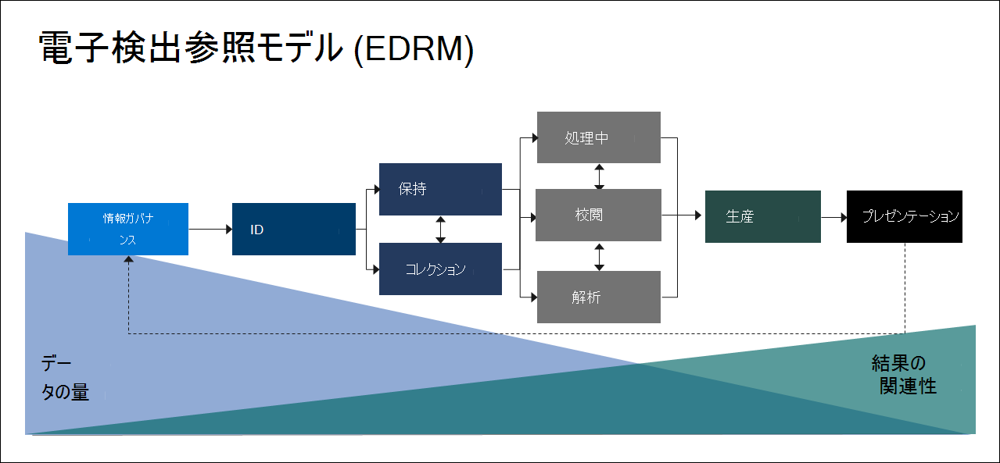

# Microsoft Purview 電子情報開示の概要 (プレミアム)

[!include[Purview banner](../includes/purview-rebrand-banner.md)]

Microsoft Purview 電子情報開示 (プレミアム) ソリューションは、既存の Microsoft 電子情報開示と分析機能に基づいています。 電子情報開示 (プレミアム) は、組織の内部および外部の調査に対応するコンテンツを保持、収集、分析、レビュー、エクスポートするためのエンドツーエンドのワークフローを提供します。 また、訴訟チームが法的情報保留通知ワークフロー全体を管理して、ケースに関係するカストディアンとコミュニケーションを取ることができます。

## 電子情報開示 (プレミアム) 機能

電子情報開示 (プレミアム) は、組織が存在するデータを検出することで、法的事項や内部調査に対応するのに役立ちます。 電子情報開示ワークフローをシームレスに管理するには、関心のあるユーザーとそのデータ ソースを識別し、データを保持するために保留をシームレスに適用し、訴訟ホールド通信プロセスを管理します。 ソースからデータを収集することで、ライブ Microsoft 365 プラットフォームを検索して、必要なものを迅速に見つけることができます。 ディープ インデックス作成、電子メール スレッド処理、ほぼ重複データ検出などのインテリジェントな機械学習機能も、大量のデータを関連するデータ セットに削減するのに役立ちます。

次のセクションでは、これらの電子情報開示 (プレミアム) 機能が組織にどのように役立つかについて説明します。

### インプレース でデータを検出して収集する

従来、複数のサード パーティ製の電子情報開示ソリューションに依存している組織では、大量のデータを処理するためにMicrosoft 365から大量のデータをコピーし、重複するデータをホストする必要がありました。 この必要性により、関連するデータを見つける時間が長くなり、複数のソリューションを管理するリスク、コスト、複雑さが増します。

Microsoft 365の電子情報開示 (プレミアム) を使用すると、ソースでデータを検出し、Microsoft 365セキュリティとコンプライアンスの境界内に留まります。  ライブ システムからインプレース データを収集することで、電子情報開示 (プレミアム) はソースに戻る手間を軽減し、不足しているコンテンツを見つける必要のない作業を減らします。これは、従来の電子情報開示ソリューションでラグを記録するときに発生することがよくあります。

Teams、Yammer、SharePoint Online、OneDrive for Business、Exchange Onlineのデータのネイティブ検索機能と収集機能により、データ検出がさらに強化されます。 たとえば、電子情報開示 (プレミアム):

- 会話Teams再構築します (会話から個々のメッセージを返す代わりに)。

- 電子メール メッセージやTeams チャット内のリンクまたは最新の添付ファイルを使用して、ユーザーと共有されるクラウドベースのコンテンツを収集します。

- 何百もの非Microsoft 365 ファイルの種類に対するサポートが組み込まれています。

- データ コネクタによってMicrosoft 365にインポートおよびアーカイブされたサード パーティのソース (Bloomberg、Facebook、Slack、Zoom [Meetings](archiving-third-party-data.md) など) からデータを収集します。

### 1 つのプラットフォームで電子情報開示ワークフローを管理する

電子情報開示 (プレミアム) を使用すると、信頼する必要がある電子情報開示ソリューションの数を減らすことができます。 これにより、合理化されたエンドツーエンドのワークフローが提供されます。これらはすべてMicrosoft 365内で発生します。 電子情報開示 (プレミアム) は、一意の共有データ ソースを対象ユーザー (*カストディアン*) に自動的にマッピングし、分析とレビューのために収集する前に関連する可能性のあるデータに関するレポートと分析を提供することで、関連情報の潜在的なソースを特定して収集する際の摩擦を軽減するのに役立ちます。

さらに、Microsoft Graph API は、電子情報開示ワークフローを自動化し、カスタム ソリューションの電子情報開示 (プレミアム) を拡張するのに役立ちます。

### データをインテリジェントにカリングする

電子情報開示 (プレミアム) のインテリジェントな機械学習機能は、確認するデータの量を減らすのに役立ちます。 これらのインテリジェントな機能は、大量のデータを適切なセットに削減し、カリングするのに役立ちます。 たとえば、組み込みのレビュー セット クエリは、ほぼ重複を識別することで、一意のコンテンツのみをフィルター処理するのに役立ちます。 この機能により、確認するデータの量を大幅に削減できます。

追加の機械学習機能を使用すると、関連性モジュールなどのスマート タグとテクノロジ支援レビュー ツールを使用して、関連するデータをさらに絞り込んで識別できます。

## 電子情報開示 (プレミアム) と電子探索参照モデルの配置

Microsoft 365の電子情報開示 (プレミアム) の組み込みのワークフローは、電子情報開示参照モデル (EDRM) で概説された電子情報開示プロセスと一致します。

(edrm.net の EDRM モデルに基づく画像)

高いレベルでは、電子情報開示 (プレミアム) が EDRM ワークフローをサポートする方法を次に示します。

- **識別。** 調査に関心のある潜在的な人物を特定した後、電子情報開示 (プレミアム) ケースに保管担当者 (*データカストディアン* とも呼ばれます) を追加できます。 ユーザーをカストディアンとして追加すると、カストディアン ドキュメントを簡単に保持、収集、および確認できます。

- **保存。** 調査に関連するデータを保持および保護するために、電子情報開示 (プレミアム) を使用すると、ケース内のカストディアンに関連付けられているデータ ソースを法的に保持できます。 非カストディアン データを保留にすることもできます。 電子情報開示 (プレミアム) には通信ワークフローも組み込まれているため、訴訟ホールド通知をカストディアンに送信し、確認を追跡できます。

- **コレクション。** 調査に関連するデータ ソースを特定 (および保持) した後は、電子情報開示 (プレミアム) で組み込みの検索ツールを使用して、ケースに関連する可能性のある保管データ ソース (および非保管データ ソース (該当する場合)) からライブ データを検索および収集できます。

- **処理。** ケースに関連するすべてのデータを収集したら、次の手順は、詳細確認と分析用のプロセスです。 電子情報開示 (プレミアム) では、コレクション フェーズで特定したインプレース データがAzure Storageの場所 (*レビュー セット* と呼ばれます) にコピーされ、ケース データの静的ビューが提供されます。 

- **レビュー。** レビュー セットにデータが追加された後、特定のドキュメントを表示し、追加のクエリを実行して、データをケースに最も関連するものに減らすことができます。 また、特定のドキュメントに注釈を付けたり、タグを付けたりすることもできます。

- **分析。** 電子情報開示 (プレミアム) は、調査に関連しないと判断したレビュー セットからデータをさらにカリングするのに役立つ統合分析ツールを提供します。 Advanced eDiscovery では、関連するデータの量を減らすだけでなく、レビュー プロセスを簡易化して効率化するようにコンテンツを整理できるため、法的レビュー コストを節約するのにも役立ちます。

- **運用環境** と **プレゼンテーション。** 準備ができたら、法的レビュー用のレビュー セットからドキュメントをエクスポートできます。 ドキュメントをネイティブ形式または EDRM で指定された形式でエクスポートして、サード パーティ製のレビュー アプリケーションにインポートできます。

## サブスクリプションとライセンス

電子情報開示 (プレミアム) のライセンスには、適切な組織のサブスクリプションとユーザーごとのライセンスが必要です。

- **組織のサブスクリプション:** Microsoft Purview コンプライアンス ポータルで電子情報開示 (プレミアム) にアクセスするには、組織に次のいずれかが必要です。

  - Microsoft 365 E5 または Office 365 E5 サブスクリプション
  
  - E5 コンプライアンス アドオンが含まれている Microsoft 365 E3 サブスクリプション

  - E5 電子情報開示と監査アドオンを使用してサブスクリプションをMicrosoft 365 E3する

  - A5 サブスクリプションまたは A5 サブスクリプションOffice 365 Education Microsoft 365 Educationする

   既存のMicrosoft 365 E5 プランがなく、電子情報開示 (プレミアム) を試したい場合は、既存のサブスクリプションに[Microsoft 365を追加](/office365/admin/try-or-buy-microsoft-365)するか、Microsoft 365 E5の[試用版にサインアップ](https://www.microsoft.com/microsoft-365/enterprise)できます。

- **ユーザーごとのライセンス:** 事前電子情報開示ケースでユーザーをカストディアンとして追加するには、組織のサブスクリプションに応じて、そのユーザーに次のいずれかのライセンスを割り当てる必要があります。

  - Microsoft 365: ユーザーには、次のいずれかを割り当てる必要があります。
  
    - Microsoft 365 E5 ライセンス、E5 コンプライアンス アドオン ライセンス、または E5 電子情報開示および監査アドオン

    - フロントライン ユーザー Microsoft 365 F5 コンプライアンスまたは F5 セキュリティ & コンプライアンス アドオンを割り当てる必要がある

    - Microsoft 365 Educationユーザーに A5 ライセンスを割り当てる必要がある

  - Office 365: ユーザーには、Office 365 E5またはOffice 365 Education A5 ライセンスが割り当てられている必要があります。

ライセンスの詳細については、[Microsoft 365比較表](https://go.microsoft.com/fwlink/?linkid=2139145)の「電子情報開示と監査」セクションをダウンロードして参照してください。

ライセンスを割り当てる方法については、「 [ユーザーにライセンスを割り当てる」を参照してください](/microsoft-365/admin/manage/assign-licenses-to-users)。

> [!NOTE]
> ユーザーは、電子情報開示 (プレミアム) ケースに保管担当者として追加する E5 または A5 ライセンス (または適切なアドオン ライセンス) のみを必要とします。 IT 管理者、電子情報開示マネージャー、弁護士、paralegals、または電子情報開示 (プレミアム) を使用してケースを管理し、ケース データを確認する調査担当者には、E5、A5、アドオン ライセンスは必要ありません。

## 電子情報開示 (プレミアム) を開始する

電子情報開示 (プレミアム) を使用するには、2 つの簡単で簡単な手順があります。

|手順  |説明  |
|:---------|:---------|
|[電子情報開示 (プレミアム) を設定する](get-started-with-advanced-ediscovery.md)| サブスクリプションとライセンスの要件を確認したら、アクセス許可を割り当て、組織全体の設定を構成して電子情報開示 (プレミアム) の使用を開始できます。|
|[ケースの作成と管理](create-and-manage-advanced-ediscoveryv2-case.md) | 組織内のすべての法的および他の種類の調査に対して電子情報開示 (プレミアム) ワークフローを管理するケースを作成します。|
|||

## 電子情報開示 (プレミアム) アーキテクチャ

単一地域環境と複数地域環境のエンド ツー エンド ワークフローと、[EDRM](#ediscovery-premium-alignment-with-the-electronic-discovery-reference-model) に整合したエンド ツー エンドデータ フローを示す電子情報開示 (プレミアム) アーキテクチャ図を次に示します。

[イメージとして表示する](../media/solutions-architecture-center/m365-advanced-ediscovery-architecture.png)

[PDF ファイルとしてダウンロードする](https://download.microsoft.com/download/d/1/c/d1ce536d-9bcf-4d31-b75b-fcf0dc560665/m365-advanced-ediscovery-architecture.pdf)

[Visio ファイルとしてダウンロードする](https://download.microsoft.com/download/d/1/c/d1ce536d-9bcf-4d31-b75b-fcf0dc560665/m365-advanced-ediscovery-architecture.vsdx)

## トレーニング

電子情報開示 (プレミアム) の基本に関する IT 管理者、電子情報開示マネージャー、コンプライアンス調査チームのトレーニングは、組織が電子情報開示ツールMicrosoft 365より迅速に使用を開始するのに役立ちます。 Microsoft 365は、組織内のユーザーが電子情報開示を開始するのに役立つ次のリソースを提供します。[Microsoft 365の電子情報開示と監査機能について説明](/learn/modules/describe-ediscovery-capabilities-of-microsoft-365)します。
