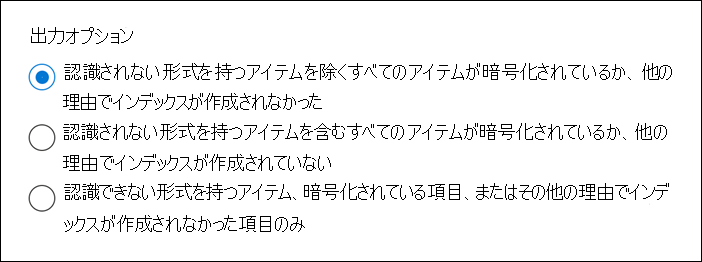

# <a name="partially-indexed-items-in-ediscovery"></a>電子情報開示で部分的にインデックスが作成されたアイテム

Microsoft Purview コンプライアンス ポータルから実行する Microsoft Purview 電子情報開示検索では、検索を実行すると、推定検索結果に部分的にインデックスが付けられたアイテムが自動的に含まれます。 部分的にインデックスが作成されたアイテムは、SharePoint サイトとOneDrive for Business サイト上のメールボックス アイテムとドキュメントExchangeであり、何らかの理由で検索用に完全にインデックスが作成されませんでした。 Exchangeでは、通常、部分的にインデックスが作成されたアイテムには、電子メール メッセージに添付されているファイル (インデックスを作成できないファイルの種類) が含まれます。 電子情報開示検索を実行すると、アイテムにインデックスを作成できず、部分的にインデックスが作成されたアイテムとして返されるその他の理由を次に示します。
  
- ファイルの種類が認識できないか、インデックス作成でサポートされていない。

- メッセージには、イメージ ファイルなど、開けない添付ファイルがあります。これは、部分的にインデックスが付けられた電子メール アイテムの最も一般的な原因です。

- この種のファイルのインデックス付けはサポートされているが、特定のファイルでインデックス付けエラーが発生した。

- 電子メール メッセージに添付されているファイルが多すぎます。

- 電子メール メッセージに添付されているファイルが大きすぎます。

- ファイルが Microsoft 以外のテクノロジで暗号化されている。

- ファイルがパスワードで保護されている。

> [!NOTE]
> ほとんどの組織では、コンテンツの量が 1% 未満で、部分的にインデックスが作成されたサイズで 12% 未満です。 ボリュームとサイズの違いの理由は、大きなファイルが完全にインデックスを作成できないコンテンツを含む確率が高いからです。
  
法的調査では、組織で部分的にインデックスが作成されたアイテムを確認することが必要になる場合があります。 また、検索結果をローカル コンピューターにエクスポートするとき、または電子情報開示 (プレミアム) で分析用に結果を準備するときに、部分的にインデックスが作成されたアイテムを含めるかどうかを指定することもできます。 詳細については、「 [電子情報開示での部分的にインデックスが付けられたアイテムの調査](investigating-partially-indexed-items-in-ediscovery.md)」を参照してください。
  
## <a name="file-types-not-indexed-for-search"></a>検索用にインデックスが作成されないファイルの種類

ビットマップ ファイルや MP3 ファイルなど特定の種類のファイルには、インデックス付けが可能なコンテンツが含まれていません。 その結果、ExchangeおよびSharePoint内の検索インデックス 作成サーバーでは、これらの種類のファイルに対してフルテキスト インデックス作成は実行されません。 これらの種類のファイルは、サポートされていないファイルの種類と見なされます。 既定でまたは管理者によって、フルテキスト インデックス付けが無効になっている種類のファイルもあります。 サポートされていないファイルの種類と無効なファイルの種類は、コンテンツ検索でインデックスのないアイテムとしてラベル付けされます。 前述のように、検索を実行したり、検索結果をローカル コンピューターにエクスポートしたり、電子情報開示 (プレミアム) の検索結果を準備したりするときに、部分的にインデックスが作成されたアイテムを検索結果のセットに含めることができます。
  
サポートされているファイル形式と無効なファイル形式の一覧については、次のトピックを参照してください。
  
-  -  Exchange [Search によってインデックス付けされたExchange File 形式](/exchange/file-formats-indexed-by-exchange-search-exchange-2013-help)

-  -  Exchange [Get-SearchDocumentFormat](/powershell/module/exchange/get-searchdocumentformat)

-  -  SharePoint [Default は、SharePointでファイル名拡張子と解析されたファイルの種類をクロールしました](/SharePoint/technical-reference/default-crawled-file-name-extensions-and-parsed-file-types)
  
## <a name="messages-and-documents-with-partially-indexed-file-types-can-be-returned-in-search-results"></a>部分的にインデックスが付けられたファイルの種類を持つメッセージとドキュメントは、検索結果に返すことができます

部分的にインデックスが付けられた添付ファイルを含む電子メール メッセージや、部分的にインデックスが付けられたすべてのSharePointドキュメントが、部分的にインデックス付きのアイテムとして自動的に返されるわけではありません。 これは、電子メール メッセージの **Subject** プロパティやドキュメントの **タイトル** プロパティや **作成者** プロパティなど、他のメッセージやドキュメントのプロパティにインデックスが作成され、検索できるためです。 たとえば、"財務" のキーワード検索では、そのキーワードが電子メール メッセージの件名またはドキュメントのファイル名またはタイトルに表示される場合、部分的にインデックスが付けられた添付ファイルを含むアイテムが返されます。 ただし、キーワードがファイルの本文にのみ表示される場合、メッセージまたはドキュメントは部分的にインデックス付きのアイテムとして返されます。
  
同様に、部分的にインデックスが付けられた添付ファイルと、部分的にインデックスが付けられたファイルの種類のドキュメントを含むメッセージは、インデックスが作成され検索可能な他のメッセージまたはドキュメントのプロパティが検索条件と一致する場合に検索結果に含まれます。 検索用のインデックスが付けられたメッセージ プロパティには、送信日と受信日、送信者と受信者、添付ファイルの名前、およびメッセージ本文のテキストが含まれます。 検索用にインデックスが作成されたドキュメント プロパティには、作成日と変更日が含まれます。 そのため、メッセージ添付ファイルは部分的にインデックスが付けられたアイテムであっても、他のメッセージまたはドキュメントプロパティの値が検索条件と一致する場合、通常の検索結果にメッセージが含まれます。
  
コンプライアンス ポータルの電子情報開示ツールを使用して検索できる電子メールとドキュメントのプロパティの一覧については、「電子情報開示の [キーワード クエリと検索条件」を](keyword-queries-and-search-conditions.md)参照してください。
  
> [!NOTE]
> インデックス付きフォルダーからインデックスが作成されていないフォルダーにメールボックス アイテムが移動された場合、フラグはアイテムのインデックスを解除するように設定され、アイテムはインデックスから削除され、検索できません。 その後、同じアイテムがインデックス付きフォルダーに戻された場合、フラグはリセットされません。 つまり、アイテムのインデックスは作成されず、検索できなくなります。

## <a name="partially-indexed-items-included-in-the-search-results"></a>検索結果に含まれる部分的にインデックスが付けられたアイテム

組織では、部分的にインデックスが付けられたアイテムに対して追加の分析を識別して実行し、それらが何であるか、何が含まれているか、およびそれらが特定の調査に関連しているかどうかを判断することが必要になる場合があります。 前に説明したように、検索されるコンテンツの場所の部分的にインデックスが付けられたアイテムは、推定検索結果に自動的に含まれます。 検索結果をエクスポートするとき、または電子情報開示 (プレミアム) の検索結果を準備するときに、これらの部分的にインデックスが作成されたアイテムを含めるオプションがあります。
  
部分的にインデックスが付けられた項目については、次の点に注意してください。
  
- 電子情報開示検索を実行すると、部分的にインデックスが付けられたExchangeアイテムの合計数とサイズ (検索クエリによって返されます) がポップアップ ページの検索統計情報に表示され、**インデックスのないアイテム** としてラベル付けされます。 ポップアップ ページに表示される部分的にインデックス付きアイテムに関する統計情報には、SharePoint サイトやOneDrive アカウントに部分的にインデックスが付けられたアイテムは含まれません。

- 結果をエクスポートする検索が、特定のコンテンツの場所または組織内のすべてのコンテンツの場所を検索した場合、検索条件に一致するアイテムを含むコンテンツの場所からのインデックスのないアイテムのみがエクスポートされます。 In other words, if no search results are found in a mailbox or site, then any unindexed items in that mailbox or site won't be exported. その理由は、組織内の多数の場所から部分的にインデックスが作成されたアイテムをエクスポートすると、エクスポート エラーの可能性が高まり、検索結果のエクスポートとダウンロードにかかる時間が長くなる可能性があるためです。

    検索のすべてのコンテンツの場所から部分的にインデックスが作成されたアイテムをエクスポートするには、すべてのアイテムを (検索クエリからキーワードを削除して) 返すように検索を構成し、検索結果をエクスポートするときに部分的にインデックスが付けられたアイテムのみをエクスポートします ([認識 **されない形式のアイテムのみ]、[暗号化されている]、[出力オプション] の他の理由でインデックスが作成されていない項目のみ**)。

- 検索結果にすべてのメールボックス アイテムを含める場合、または検索クエリでキーワードが指定されていない場合、または日付範囲のみを指定する場合、部分的にインデックスが付けられたアイテムが含まれる PST ファイルに部分的にインデックスが付けられたアイテムはコピーされない可能性があります。 これは、部分的にインデックスが付けられたアイテムを含むすべてのアイテムが、通常の検索結果に自動的に含まれるためです。

- 部分的にインデックスが作成されたアイテムはプレビューできません。 検索結果をエクスポートして、検索によって返された部分的にインデックス付きのアイテムを表示する必要があります。

   さらに、検索結果をエクスポートし、エクスポートに部分的にインデックスが付けられたアイテムを含めると、SharePointアイテムから部分的にインデックスが作成されたアイテムが **Uncrawlable** という名前のフォルダーにエクスポートされます。 部分的にインデックスが付けられたExchange項目をエクスポートする場合、部分的にインデックスが付けられたアイテムが検索クエリとエクスポート設定の構成と一致するかどうかによって、エクスポート方法が異なります。 

- 次の表は、インデックス付きアイテムと部分的にインデックスが付けられたアイテムのエクスポート動作と、それぞれ異なるエクスポート構成設定に含まれるかどうかを示しています。

  |**構成をエクスポートする**|**検索クエリに一致するインデックス付きアイテム**|**検索クエリに一致する部分的にインデックスが付けられたアイテム**|**検索クエリと一致しない部分インデックス付きアイテム**|
  |:-----|:-----|:-----|:-----|
  |インデックス付きのアイテムのみをエクスポートする  <br/> |Exported<br/> |エクスポート (エクスポートされるインデックス付きアイテムに含まれる)<br/>  |エクスポートされない <br/>|
  |部分的にインデックスが付けられたアイテムのみをエクスポートする  <br/> |エクスポートされない  <br/> |エクスポート (部分的にインデックスが付けられたアイテムとして)<br/> |エクスポート (部分的にインデックスが付けられたアイテムとして)|
  |インデックス付きアイテムと部分的にインデックス付きアイテムをエクスポートする  <br/> |Exported<br/> |エクスポート (エクスポートされるインデックス付きアイテムに含まれる)<br/>  |エクスポート (部分的にインデックスが付けられたアイテムとして)<br/>|
  ||||
  
## <a name="workaround-for-using-a-date-range-to-exclude-partially-indexed-items"></a>日付範囲を使用して部分的にインデックスが作成されたアイテムを除外する場合の回避策

コンテンツ検索と Microsoft Purview 電子情報開示 (Standard) では、日付範囲を使用して、部分的にインデックスが付けられたアイテムが検索クエリによって返されないように除外することはできません。 つまり、日付範囲の範囲外にある部分的にインデックスが付けられたアイテムは、検索統計と部分的にインデックス付きアイテムをエクスポートするときに、部分的にインデックスが付けられたアイテムとして引き続き含まれます。 電子情報開示 (プレミアム) では、検索クエリで日付範囲を使用して、部分的にインデックスが作成されたアイテムを除外できます。

この制限の回避策として、次の手順をお勧めします。

1. 要件を満たし、目的の結果を返す検索クエリを使用して検索を作成して実行します。

2. 手順 1 から検索結果をエクスポートしますが、部分的にインデックスが付けられたアイテムはエクスポートに含めないでください。 これを行うには、認識 **できない形式のアイテム、暗号化されているアイテム、または他の理由でインデックスが作成されていないアイテムを除くすべての項目** をエクスポート オプションで選択します。<sup>1</sup>

   

3. 手順 1 で使用したのと同じ検索クエリを使用する (および同じ場所を検索する) 2 番目の検索を作成して実行します。 **AND** 演算子を使用して、元のクエリに次の句を追加します。

   ```text
   <original query> AND ((IndexingErrorCode>0 OR IndexingErrorCode<0) AND sent:date1..date2)
   ```

   この句を追加すると、元の検索クエリと一致し、特定の日付範囲内にある部分的にインデックスが付けられたアイテムが返されます。<sup>2</sup>

4. 手順 3 から検索結果をエクスポートし、今回は部分的にインデックスが付けられたアイテムをエクスポートに含めます。 これを行うには、認識 **できない形式のアイテムを含む、[すべての項目] を選択するか、暗号化されているか、他の理由でインデックスが作成されていない** エクスポート オプションを選択します。

   > [!NOTE]
   > <sup>1</sup> 手順 2 の出力により、インデックス付きアイテムのみがエクスポートされます。<br/>
   > <sup>2</sup> 手順 3 で使用する条件は、指定した日付範囲内にあるインデックス作成エラーのある項目のみを識別します。 完全にインデックスが作成された項目は返されません。 つまり、手順 4 でエクスポートされたアイテムには、日付範囲内にあるインデックスのないアイテムのみが含まれます。 エクスポートにはインデックス付きアイテムは含まれません。 その結果、手順 2 と手順 4 の組み合わされた出力には、指定した日付範囲内にあるすべてのインデックス付きアイテムとインデックスなしアイテムが含まれます。

手順 3 で作成した 2 番目の検索と対応するエクスポートを使用して、元の検索クエリに一致する部分的にインデックスが付けられたアイテムを表示して理解します。 2 番目の検索からのエクスポートには、必要に応じてそれらを確認できるように、エクスポートされたすべての部分的にインデックスが付けられたアイテムも含まれます。

> [!TIP]
> 前の手順では、実際の検索結果をエクスポートするか、レポートのみをエクスポートできます。

## <a name="indexing-limits-for-messages"></a>メッセージのインデックス作成の制限

次の表では、電子情報開示検索で電子メール メッセージが部分的にインデックス付けされたアイテムとして返される可能性があるインデックス作成の制限についてMicrosoft 365。
  
SharePoint ドキュメントのインデックス作成制限の一覧については、「[SharePoint Online の検索制限」を](/sharepoint/search-limits)参照してください。
  
|**インデックス作成の制限**|**メモ**|**説明**|
|:-----|:-----|:-----|
|添付ファイルの最大サイズ (Excel ファイルを除く)  <br/> |150 MB  <br/> |インデックス作成のために解析する電子メール添付ファイルの最大サイズ。 この制限を超える添付ファイルはインデックス作成のために解析されず、添付ファイルを含むメッセージは部分的にインデックス付けされたものとしてマークされます。  <br/><br/> **メモ：** 解析とは、インデックス 作成サービスが添付ファイルからテキストを抽出し、句読点やスペースなどの不要な文字を削除し、テキストを単語 (トークン化と呼ばれるプロセス) に分割し、インデックスに格納するプロセスです。           |
|Excel ファイルの最大サイズ  <br/> |4 MB  <br/> |サイト上にある、またはインデックス作成のために解析される電子メール メッセージに添付されているExcel ファイルの最大サイズ。 この制限を超えるExcel ファイルは解析されず、ファイルまたは添付ファイルを含むメッセージの電子メールはインデックスなしとしてマークされます。  <br/> |
|添付ファイルの最大数  <br/> |250  <br/> |インデックス作成のために解析される電子メール メッセージに添付されたファイルの最大数。 メッセージに 250 を超える添付ファイルがある場合は、最初の 250 個の添付ファイルが解析およびインデックス付けされ、解析されなかった追加の添付ファイルが含まれていたため、メッセージは部分的にインデックス付けとしてマークされます。  <br/> |
|添付ファイルの最大深度  <br/> |30  <br/> |解析される入れ子になった添付ファイルの最大数。 たとえば、電子メール メッセージに別のメッセージが添付されていて、添付メッセージに Word 文書が添付されている場合、Word 文書と添付メッセージにインデックスが作成されます。 この動作は、最大 30 個の入れ子になった添付ファイルに対して続行されます。  <br/> |
|添付されたイメージの最大数  <br/> |0  <br/> |電子メール メッセージに添付されているイメージは、パーサーによってスキップされ、インデックスは作成されません。  <br/> |
|アイテムの解析に費やされた最大時間  <br/> |30 秒  <br/> |インデックス作成のために項目の解析には最大 30 秒かかります。 解析時間が 30 秒を超えると、アイテムは部分的にインデックス付けされたとしてマークされます。  <br/> |
|パーサーの最大出力  <br/> |200 万文字  <br/> |インデックスが作成されたパーサーからのテキスト出力の最大量。 たとえば、パーサーがドキュメントから 800 万文字を抽出した場合、最初の 200 万文字のみがインデックス付けされます。  <br/> |
|最大注釈トークン  <br/> |200 万  <br/> |電子メール メッセージにインデックスが付けられると、各単語には、その単語のインデックスを作成する方法を指定するさまざまな処理手順で注釈が付けられます。 処理命令の各セットは、注釈トークンと呼ばれます。 Office 365でサービスの品質を維持するために、電子メール メッセージの注釈トークンは 200 万個に制限されています。  <br/> |
|インデックス内の最大本文サイズ  <br/> |6,700 万文字  <br/> |電子メール メッセージの本文とそのすべての添付ファイルの合計文字数。 電子メール メッセージにインデックスが作成されると、メッセージの本文とすべての添付ファイル内のすべてのテキストが 1 つの文字列に連結されます。 インデックスが作成されるこの文字列の最大サイズは 6,700 万文字です。  <br/> |
|本文内の最大一意トークン  <br/> |100 万  <br/> |前述のように、トークンは、コンテンツからテキストを抽出し、句読点とスペースを削除し、インデックスに格納されている単語 (トークンと呼ばれる) に分割した結果です。 たとえば、この語句  `"cat, mouse, bird, dog, dog"` には 5 つのトークンが含まれています。 ただし、一意のトークンは 4 つだけです。 電子メール メッセージごとに 100 万個の一意のトークンが制限されているため、ランダム トークンでインデックスが大きくなりすぎないようにすることができます。  <br/> |
||||

## <a name="more-information-about-partially-indexed-items"></a>部分的にインデックスが付けられたアイテムの詳細

- 既に説明したように、メッセージとドキュメントのプロパティとそのメタデータにインデックスが作成されるため、そのキーワードがインデックス付きメタデータに表示されると、キーワード検索によって結果が返される場合があります。 ただし、サポートされていないファイルの種類のアイテムのコンテンツにのみキーワードが表示される場合、同じキーワード検索では同じ項目が返されない場合があります。 この場合、アイテムは部分的にインデックスが付けられたアイテムとして返されます。

- 部分的にインデックスが付けられたアイテムが検索クエリ条件と一致したために検索結果に含まれる場合、推定検索統計情報に部分的にインデックスが付けられたアイテムとして含まれません。 また、検索結果をエクスポートするときに、部分的にインデックスが作成されたアイテムには含まれません。

- ファイルの種類はインデックス作成でサポートされており、インデックスが作成されますが、インデックス付けエラーや検索エラーが発生し、部分的にインデックス付きアイテムとしてファイルが返される可能性があります。 たとえば、大きなExcel ファイルの検索は部分的に成功する可能性があります (最初の 4 MB はインデックスが作成されるため)、ファイル サイズの制限を超えたため失敗します。 この場合、検索結果と部分的にインデックスが付けられたアイテムとして同じファイルが返される可能性があります。

- [Microsoft 暗号化テクノロジ](encryption.md)で暗号化され、検索の条件に一致する電子メール メッセージに添付されているファイルはプレビューでき、エクスポート時に暗号化が解除されます。 現時点では、Microsoft 暗号化テクノロジで暗号化され (SharePointまたはOneDrive for Businessに格納されている) ファイルには、部分的にインデックスが作成されます。

- S/MIME で暗号化された電子メール メッセージは、部分的にインデックスが作成されます。 これには、添付ファイルの有無に関係なく、暗号化されたメッセージが含まれます。

- Azure Rights Management を使用して保護された電子メール メッセージにはインデックスが作成され、検索クエリと一致する場合は検索結果に含まれます。 Rights-protected 電子メール メッセージは復号化され、プレビューおよびエクスポートできます。 この機能では、既定で eDiscover Manager ロール グループに割り当てられている RMS 復号化ロールが割り当てられている必要があります。

- 電子情報開示ケースに関連付けられたクエリ ベースの保留リストを作成すると、部分的にインデックスが付けられたアイテムはすべて保留になります。 これには、ホールドの検索クエリ条件と一致しない部分的にインデックスが付けられたアイテムが含まれます。 クエリ ベースの電子情報開示保留の作成の詳細については、「 [電子情報開示ホールドの作成](create-ediscovery-holds.md)」を参照してください。

## <a name="see-also"></a>関連項目

[電子情報開示で部分的にインデックスが付けられたアイテムの調査](investigating-partially-indexed-items-in-ediscovery.md)
