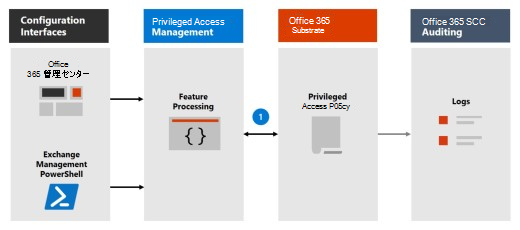

# 特権アクセス管理の詳細

Microsoft Purview Privileged Access Management では、Office 365の特権管理タスクに対するきめ細かなアクセス制御が可能です。 これは、機密データや重要な構成設定への継続的なアクセス権を持つ既存の特権管理アカウントが使用される違反から組織を保護するために役立ちます。 特権アクセス管理では、ユーザーが Just-In-Time のアクセスを要求し、広範囲で時間に制約がある承認ワークフローを介して、昇格した特権タスクを完了する必要があります。 この構成では、機密性の高いデータや重要な構成の設定を危険にさらすことなくタスクが行えるように、ユーザーに十分なアクセス権が与えられます。 特権アクセス管理を有効にすると、組織は永続的な特権をゼロで運用し、永続的な管理アクセスの脆弱性に対する防御層を提供できます。

統合された Customer Lockbox と特権アクセス管理ワークフローの概要については、この [カスタマー ロックボックスと特権アクセス管理のビデオ](https://go.microsoft.com/fwlink/?linkid=2066800)を参照してください。

## 保護レイヤー

特権アクセス管理は、Microsoft 365 セキュリティ アーキテクチャ内の他のデータおよびアクセス機能保護を補完します。 セキュリティへの統合および階層化アプローチの一部として特権アクセス管理を含めると、機密情報と Microsoft 365 の構成設定の保護を最大化するセキュリティ モデルが実現されます。 図に示すように、特権アクセス管理は、Microsoft 365 データのネイティブ暗号化と Microsoft 365 サービスの役割ベースのアクセス制御セキュリティ モデルで提供される保護に基づいて構築されています。 [Azure AD Privileged Identity Management](/azure/active-directory/active-directory-privileged-identity-management-configure)で使用する場合、これらの 2 つの機能により、さまざまなスコープで Just-In-Time アクセスを使用してアクセス制御が提供されます。

特権アクセス管理は **タスク** レベルで定義され、スコープが設定されますが、Azure AD Privileged Identity Managementは、複数のタスクを実行する機能を持つ **ロール** レベルで保護を適用します。 Azure AD Privileged Identity Managementでは、主に AD ロールとロール グループのアクセスを管理できますが、Microsoft Purview Privileged Access Management はタスク レベルでのみ適用されます。

- **Azure AD Privileged Identity Managementを既に使用しているときに特権アクセス管理を有効にする:** 特権アクセス管理を追加すると、Microsoft 365 データへの特権アクセスに対する保護と監査機能の別の詳細なレイヤーが提供されます。

- **Microsoft Purview Privileged Access Management を既に使用している間に Azure AD Privileged Identity Managementを有効にする:** Azure AD Privileged Identity Managementを Microsoft Purview Privileged Access Management に追加すると、主にユーザー ロールまたは ID によって定義されている Microsoft 365 の外部のデータへの特権アクセスを拡張できます.  

## 特権アクセス管理アーキテクチャとプロセス フロー

次の各プロセス フローでは、特権アクセスのアーキテクチャと、それが Microsoft 365 の基盤、監査、および Exchange Management の実行空間とどのように相互作用するかについて説明します。

### 手順 1: 特権アクセス ポリシーを構成する

[Microsoft 365 管理センター](https://admin.microsoft.com)または Exchange Management PowerShell を使用して特権アクセス ポリシーを構成する場合は、ポリシーと特権アクセス機能プロセスと、Microsoft 365 環境のポリシー属性を定義します。 アクティビティはセキュリティ &amp; コンプライアンス センターに記録されます。 ポリシーが有効になり、承認の受信要求を処理する準備が整いました。

### 手順 2: アクセス要求

[Microsoft 365 管理センター](https://admin.microsoft.com)または Exchange Management PowerShell を使用すると、ユーザーは管理者特権または特権タスクへのアクセスを要求できます。 特権アクセス機能は、構成された特権アクセス ポリシーに対して処理するための要求を Microsoft 365 の基盤に送信し、アクティビティをセキュリティ &amp; コンプライアンス センター ログに記録します。

### 手順 3: アクセスの承認

承認要求が生成され、保留中の要求通知が承認者にメールで送信されます。 承認された場合、特権アクセス要求は承認として処理され、タスクを完了する準備が整います。 拒否された場合、タスクはブロックされ、要求者へのアクセスは許可されません。 アクセスの要求者にはメール メッセージで要求の承認または拒否が通知されます。

### 手順 4: アクセスの処理

承認された要求の場合、タスクは Exchange 管理実行空間によって処理されます。 承認は、特権アクセス ポリシーに対してチェックされ、Microsoft 365 サブストレートによって処理されます。 タスクのすべてのアクティビティは、セキュリティ &amp; コンプライアンス センターに記録されます。

## よく寄せられる質問

### Office 365で特権アクセスを使用できる SKU は何ですか?

特権アクセス管理は、Microsoft 365 およびOffice 365サブスクリプションとアドオンの幅広い選択でお客様が利用できます。 詳細については、「 [特権アクセス管理の概要](privileged-access-management-configuration.md) 」を参照してください。

### 特権アクセスは、Exchange 以外のワークロードOffice 365いつサポートされますか?

特権アクセス管理は、間もなく他のOffice 365ワークロードで利用できるようになります。 詳細については、 [Microsoft 365 ロードマップ](https://www.microsoft.com/microsoft-365/roadmap) を参照してください。

### 組織には 30 を超える特権アクセス ポリシーが必要ですが、この制限は引き上げされますか?

はい。組織ごとに 30 個の特権アクセス ポリシーの現在の制限を引き上げることは、機能ロードマップにあります。

### Office 365で特権アクセスを管理するには、グローバル 管理である必要がありますか?

いいえ。Office 365で特権アクセスを管理するアカウントに Exchange ロール管理ロールが割り当てられている必要があります。 ロール管理ロールをスタンドアロン アカウントのアクセス許可として構成しない場合、グローバル管理者ロールには既定でこのロールが含まれており、特権アクセスを管理できます。 承認者のグループに含まれるユーザーは、グローバル 管理である必要はありません。また、PowerShell で要求を確認および承認するためにロール管理ロールを割り当てる必要はありません。

### 特権アクセス管理は Customer Lockbox とどのように関連していますか?

[Customer Lockbox](/office365/admin/manage/customer-lockbox-requests) を使用すると、Microsoft がデータにアクセスするときに組織のアクセス制御レベルを設定できます。 特権アクセス管理を使用すると、すべての Microsoft 365 特権タスクに対して組織内できめ細かなアクセス制御を行うことができます。

## 始める準備はいいですか。

[特権アクセス管理のために組織の構成を](privileged-access-management-configuration.md)開始します。

## 詳細情報

[対話型ガイド: 特権アクセス管理を使用して管理者タスクを監視および制御する](https://content.cloudguides.com/guides/Privileged%20Access%20Management)
