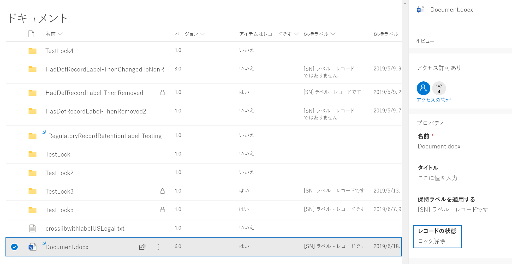
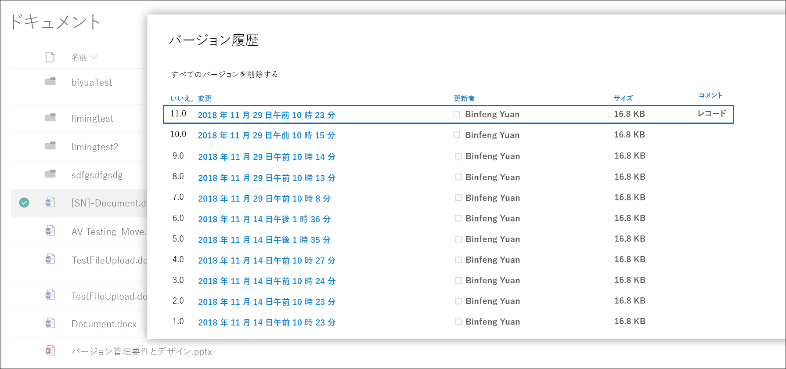
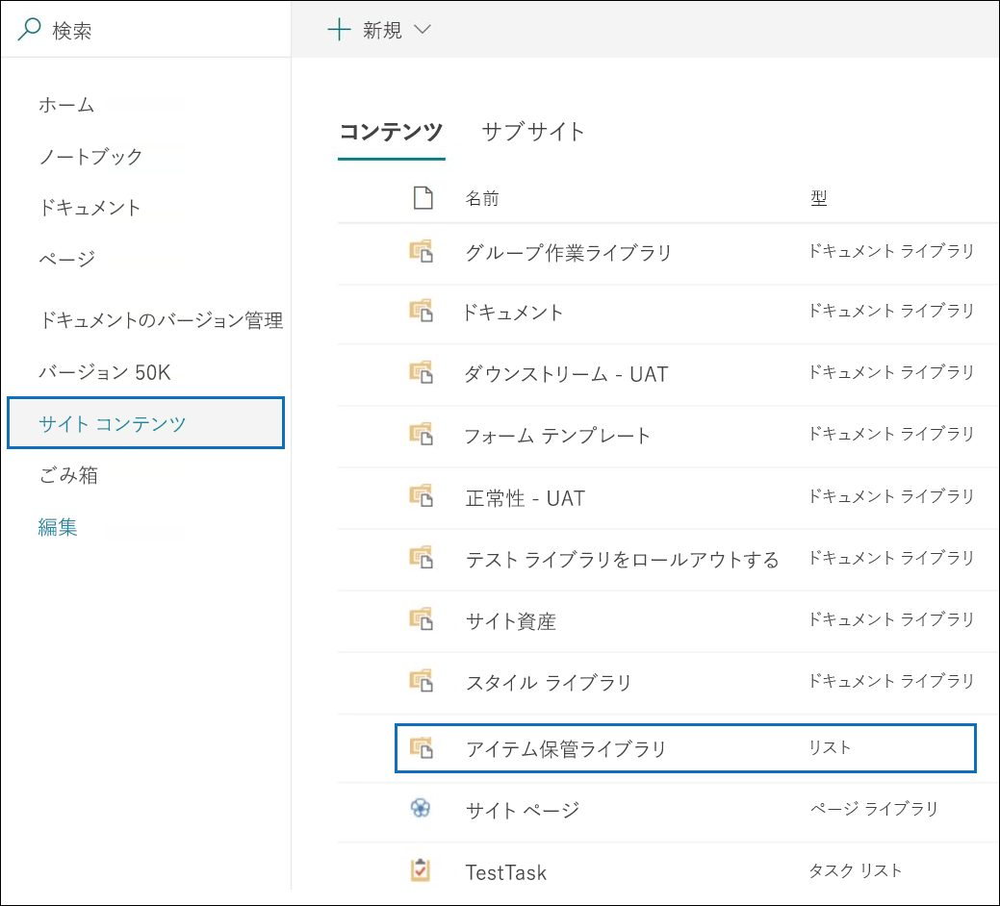
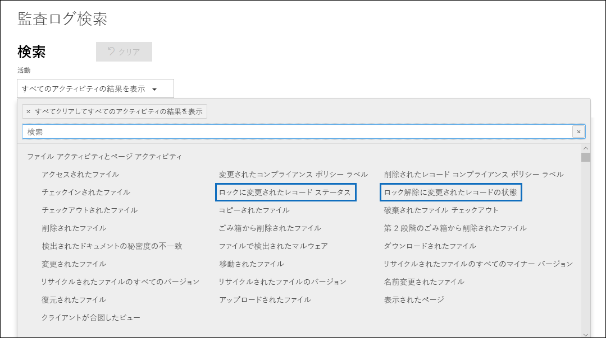

# レコードについての詳細Learn about records

>*[セキュリティとコンプライアンスのための Microsoft 365 ライセンス ガイダンス](https://aka.ms/ComplianceSD)。**[Microsoft 365 licensing guidance for security & compliance](https://aka.ms/ComplianceSD).*

Microsoft 365 でレコードを管理することで、組織は企業のポリシー、法的および規制上の義務を順守し、リスクや法的責任を軽減することもできます。Managing records in Microsoft 365 helps your organization comply with corporate policies and legal or regulatory obligations, while also reducing risk and legal liability.

コンテンツがレコードとしてマークされているときには:When content is marked as a record:

- [アクションが許可またはブロックされている](#compare-restrictions-for-what-actions-are-allowed-or-blocked) という観点から、アイテムに制限がかけられています。Restrictions are placed on the items in terms of what [actions are allowed or blocked](#compare-restrictions-for-what-actions-are-allowed-or-blocked).

- アイテムに関する追加のアクティビティが記録されます。Additional activities about the item are logged.

- アイテムが保持期間の終了時に削除された時点で、廃棄の証明を取得します。You have proof of disposition when the items are deleted at the end of their retention period.

[保持ラベル](retention.md#retention-labels)を使用して、コンテンツをレコードとしてマークします。You use [retention labels](retention.md#retention-labels) to mark content as a record. それらの保持ラベルを発行してユーザーや管理者が手動でコンテンツに適用できるようにするか、レコードとしてマークするコンテンツにそれらのラベルを自動的に適用することができます。You can either publish those labels so that users and administrators can manually apply them to content, or auto-apply those labels to content that you want to mark as a record.

保持ラベルを使用してコンテンツをレコードとして宣言することで、Microsoft 365 環境全体で単一かつ一貫したレコード管理戦略を実装することができます。By using retention labels to mark content as records, you can implement a single and consistent strategy for managing records across your Microsoft 365 environment.

## 許可またはブロックするアクションの制限を比較するCompare restrictions for what actions are allowed or blocked

次の表を使用して、標準の保持ラベルを適用した結果、コンテンツに適用される制限事項、およびコンテンツをレコードとしてマークする保持ラベルを特定します。Use the following table to identify what restrictions are placed on content as a result of applying a standard retention label, and retention labels that mark content as a record. 

標準的な保持ラベルには、コンテンツをレコードとしてマークすることなくデータを保持する構成があります。A standard retention label has the configuration to retain data without marking content as a record.

>[!NOTE] 
> 完全性を期すために、テーブルにはロックされたレコードの列とロック解除されたレコードの列が含まれています。これは、SharePoint と OneDrive には適用できますが、Exchange には適用されません。For completeness, the table includes columns for a locked and unlocked record, which is applicable to SharePoint and OneDrive, but not Exchange. レコードをロックまたはロック解除する機能は、Exchange アイテムでサポートされていない [レコード バージョン管理](#record-versioning) を使用します。The ability to lock and unlock a record uses [record versioning](#record-versioning) that isn't supported for Exchange items. そのため、レコードとしてマークされているすべての Exchange アイテムについて、[**レコード - ロック済み**] 列に動作がマップされ、[**レコード - ロック解除**] は関連がありません。So for all Exchange items that are marked as a record, the behavior maps to the **Record - locked** column, and the **Record - unlocked column** is not relevant.

|アクションAction| 保持ラベルRetention label |レコード - ロック済みRecord - locked| レコード - ロック解除Record - unlocked|
|:-----|:-----|:-----|:-----|:-----|
|コンテンツを編集するEdit contents|可Allowed | **ブロック済み****Blocked** | 可Allowed|
|名前の変更など、プロパティを編集するEdit properties, including rename|可Allowed |可Allowed | 可Allowed|
|削除Delete|許可 1Allowed 1 |**ブロック済み****Blocked** | **ブロック済み****Blocked**|
|コピーCopy|可Allowed |可Allowed | 可Allowed|
|コンテナー内の移動 2Move within container 2|可Allowed |可Allowed | 可Allowed|
|コンテナー間の移動 2Move across containers 2|可Allowed |ロック解除されていない場合は許可Allowed if never unlocked | 可Allowed|
|開く/読み取りOpen/Read|可Allowed |可Allowed | 可Allowed|
|ラベルを変更するChange label|可Allowed |許可-コンテナー管理のみAllowed - container admin only | 許可-コンテナー管理のみAllowed - container admin only|
|ラベルを削除するRemove label|可Allowed |許可-コンテナー管理のみAllowed - container admin only | 許可-コンテナー管理のみAllowed - container admin only|

脚注:Footnotes:

1 セキュリティ保護された場所にコピーを保持することによって、OneDrive と Exchange ではサポートされますが、SharePoint ではブロックされます。1 Supported by OneDrive and Exchange by retaining a copy in a secured location, but blocked by SharePoint.

ユーザーが SharePoint のラベル付きドキュメントを削除しようとしたときに表示されるメッセージは、次のとおりです。Message a user sees if they try to delete a labeled document in SharePoint:

2 コンテナーには、SharePoint ドキュメント ライブラリと Exchange メールボックスが含まれます。2 Containers include SharePoint document libraries and Exchange mailboxes.

## 保持ラベルを使用してレコードを宣言するUsing retention labels to declare records

保持ラベルを作成するときに、保持ラベルを使用してコンテンツをレコードとしてマークするオプションがあります。When you create a retention label, you have the option to use the retention label to mark the content as a record:

1. Microsoft 365 コンプライアンス センターで、[**レコードの管理**] [\>ファイル プラン\*\*] に移動します。In the Microsoft 365 compliance center, go to **Records Management** \> **File Plan**. [**ファイルプラン**] ページで、[**ラベルの作成**] を選びます。On the **File plan** page, select **Create a label**.

2. ウィザードの [**ラベルの設定**] ページで、コンテンツをレコードとして分類するオプションを選択します。On the **Label settings** page in the wizard, choose the option to classify content as a record.
    
   ![[このラベルを使用して、コンテンツをレコードに分類する] チェックボックスをクリックします](../media/recordversioning6.png)

3. 必要に応じて、SharePoint や OneDrive のドキュメントと Exchange メールに保持ラベルを適用します。Apply the retention label to SharePoint or OneDrive documents and Exchange emails, as needed. 手順については、以下を参照してください。For instructions:
    
    - [アイテム保持ラベルを作成してアプリに適用するCreate retention labels and apply them in apps](create-apply-retention-labels.md)
    
    - [保持ラベルをコンテンツに自動的に適用するApply a retention label to content automatically](apply-retention-labels-automatically.md)

### コンテンツに構成した保持ラベルを適用するApplying the configured retention label to content

保持ラベルは、コンテンツをレコードとしてマークする場合、ユーザーが以下のようにアプリ内でそれを適用できるようになります。When retention labels that mark content as a record are made available for users to apply them in apps:

- Exchange の場合、メールボックスへの書き込みアクセス権を持つすべてのユーザーは、これらのラベルを適用できます。For Exchange, any user with write-access to the mailbox can apply these labels. 
- SharePoint および OneDrive の場合、既定のメンバー グループ (投稿アクセス許可レベル) のすべてのユーザーがこれらのラベルを適用できます。For SharePoint and OneDrive, any user in the default Members group (the Contribute permission level) can apply these labels.

保持ラベルを使用してレコードとしてマークされたドキュメントの例は、以下のとおりです。Example of a document marked as record by using a retention label:

## レコードのバージョン管理Record versioning

ドキュメントをレコードとしてマークし、レコードに対して実行できるアクションを制限する機能は、あらゆるレコード管理ソリューションに不可欠な目標です。The ability to mark a document as a record and restrict actions that can be performed on the record is an essential goal for any records management solution. ただし、後進のバージョンを作成するためには、他のユーザーと共同作業を行うことも必要になる場合があります。However, collaboration might also be needed for people to create subsequent versions.

たとえば、販売契約をレコードとしてマークする場合、新しい条件で契約を更新し、そして前のレコード バージョンを保持したまま最新バージョンを新しいレコードとしてマークする必要があります。For example, you might mark a sales contract as a record, but then need to update the contract with new terms and mark the latest version as a new record while still retaining the previous record version. これらのタイプのシナリオでは、SharePoint と OneDrive が*レコードのバージョン管理*をサポートしています。For these types of scenarios, SharePoint and OneDrive support *record versioning*. OneNote ノートブックのフォルダーは、レコードのバージョン管理をサポートしていません。OneNote notebook folders don't support record versioning.

レコードのバージョン管理を使用するには、最初にドキュメントにラベルを付けて、レコードとしてマークします。To use record versioning, first label the document and mark it as a record. この時点で、*レコード ステータス* と呼ばれるドキュメント プロパティが保持ラベルの横に表示され、初期レコード ステータスは **ロック済み** になります。At this point, a document property, called *Record status* is displayed next to the retention label, and the initial record status is **Locked**. 

次のことができます。You can now do the following things:

  - **レコード ステータス プロパティをロック解除およびロックすることにより、ドキュメントの個々のバージョンをレコードとして継続的に編集および保持します。****Continually edit and retain individual versions of the document as records, by unlocking and locking the Record status property.** **レコード ステータス** プロパティが **ロックされています** に設定されている場合のみ、新しいバージョンのレコードが保持されます。Only when the **Record status** property is set to **Locked** is a new version of the record retained. このロックとロック解除の切り替えにより、ドキュメントの不要なバージョンおよびコピーを保持するリスクが軽減されます。This toggle of locked and unlocked reduces the risk of retaining unnecessary versions and copies of the document.

  - **サイト コレクション内にあるインプレース レコード リポジトリにレコードを自動的に保存します。****Have the records automatically stored in an in-place records repository located within the site collection.** SharePoint および OneDrive の各サイト コレクションは、アイテム保管ライブラリのコンテンツを保持します。Each site collection in SharePoint and OneDrive preserves content in its Preservation Hold library. レコード バージョンは、このライブラリの [レコード] フォルダーに保存されます。Record versions are stored in the Records folder in this library.

  - **すべてのバージョンを含むエバーグリーン ドキュメントを維持します。****Maintain an evergreen document that contains all versions.** 既定では、各 SharePoint および OneDrive ドキュメントには、アイテム メニューで利用可能なバージョン履歴があります。By default, each SharePoint and OneDrive document has a version history available on the item menu. このバージョン履歴ではどのバージョンがレコードであるかを簡単に確認し、それらのドキュメントを表示できます。In this version history, you can easily see which versions are records and view those documents.

レコードのバージョン管理は、アイテムをレコードとしてマークする保持ラベルを持つすべてのドキュメントで自動的に使用できます。Record versioning is automatically available for any document that has a retention label that marks the item as a record. ユーザーが詳細ウィンドウでドキュメントのプロパティを表示すると、**レコード ステータス** が **ロック済み** から **ロック解除** に切り替わります。When a user views the document properties by using the details pane, they can toggle the **Record status** from **Locked** to **Unlocked**. このアクションにより、アイテム保管ライブラリの [レコード] フォルダーにレコードが作成され、保存期間の残りの期間はそこに保存されます。This action creates a record in the Records folder in the Preservation Hold library, where it resides for the remainder of its retention period. 

ドキュメントのロックが解除されている間、標準の編集権限を持つすべてのユーザーがファイルを編集できます。While the document is unlocked, any user with standard edit permissions can edit the file. ただし、これはまだレコードであるため、ユーザーはファイルを削除することができません。However, users can't delete the file, because it's still a record. 編集が完了すると、**レコードの状態** を **ロック解除** から **ロック済み** に切り替えることができ、この状態の間はそれ以上の編集ができなくなります。When editing is complete, a  user can then toggle the **Record status** from **Unlocked** to **Locked**, which prevents further edits while in this status.
  

### レコードのロックおよびロック解除Locking and unlocking a record

コンテンツをレコードとしてマークする保持ラベルがドキュメントに適用された後、投稿権限またはより狭い権限レベルを持つユーザーは、レコードをロック解除したり、ロック解除されたレコードをロックしたりできます。After a retention label that marks content as a record is applied to a document, any user with Contribute permissions or a narrower permission level can unlock a record or lock an unlocked record.
  

ユーザーがレコードのロックを解除すると、以下のアクションが発生します。When a user unlocks a record, the following actions occur:

1. 現在のサイト コレクションにアイテム保管ライブラリがない場合は、それが作成されます。If the current site collection doesn't have a Preservation Hold library, one is created.

2. アイテム保管ライブラリに [レコード] フォルダーがない場合は、[レコード] フォルダーが作成されます。If the Preservation Hold library doesn't have a Records folder, one is created.

3. [**コピー先**] アクションは、ドキュメントの最新バージョンを [レコード] フォルダーにコピーします。A **Copy to** action copies the latest version of the document to the Records folder. [**コピー先**] アクションには最新バージョンのみが含まれ、以前のバージョンは含まれません。The **Copy to** action includes only the latest version and no prior versions. このコピーされたドキュメントはドキュメントのレコード バージョンと見なされ、ファイル名の形式は以下のようになります: \[タイトル GUID バージョン\#\]This copied document is now considered a record version of the document, and its file name has the format: \[Title GUID Version\#\]

4. [レコード] フォルダーに作成されたコピーは元のドキュメントのバージョン履歴に追加され、このバージョンでは、[コメント] フィールドに**レコード**という単語が表示されます。The copy created in the Records folder is added to the version history of the original document, and this version shows the word **Record** in the comments field.

5. 元のドキュメントは、編集可能ですが削除はされない、新しいバージョンです。The original document is a new version that can be edited, but not deleted. ドキュメントが編集可能になった場合でもドキュメントはまだレコードであるため、ドキュメント ライブラリの [**アイテムはレコードです**] 列には引き続き [**はい**] の値が表示されます。The document library column **Item is a Record** still shows the **Yes** value because the document is still a record, even if it can now be edited.

ユーザーがレコードをロックすると、元のドキュメントは再び編集ができなくなります。When a user locks a record, the original document again can't be edited. ただしこれは、バージョンをアイテム保管ライブラリの [レコード] フォルダーにコピーするレコードのロックを解除するアクションです。But it is the action of unlocking a record that copies a version to the Records folder in the Preservation Hold library.

### レコードのバージョンRecord versions

ユーザーがレコードのロックを解除するたびに、最新バージョンがアイテム保管ライブラリの [レコード] フォルダーにコピーされ、そのバージョンには**レコード**の値がバージョン履歴の [**コメント**] フィールドに含まれます。Each time a user unlocks a record, the latest version is copied to the Records folder in the Preservation Hold library, and that version contains the value of **Record** in the **Comments** field of the version history.
  

バージョン履歴を表示するには、ドキュメント ライブラリでドキュメントを選択し、[アイテム] メニューの [**バージョン履歴**] をクリックします。To view the version history, select a document in the document library and then click **Version history** in the item menu.

### レコードが保存される場所Where records are stored

レコードは、サイト コレクションのトップレベル サイトにあるアイテム保管ライブラリの [レコード] フォルダーに保存されます。Records are stored in the Records folder in the Preservation Hold library in the top-level site in the site collection. トップレベル サイトの左側のナビゲーションで、[**サイト コンテンツ**] \> [**アイテム保管ライブラリ**] を選択します。In the left navigation on the top-level site, choose **Site contents** \> **Preservation Hold Library**.
  

  

![アイテム保管ライブラリの [レコード] フォルダー](../media/recordversioning12.png)

アイテム保管ライブラリは、サイト コレクション管理者にのみ表示されます。The Preservation Hold library is visible only to site collection admins. また、アイテム保管ライブラリは規定では存在しません。Also, the Preservation Hold library doesn't exist by default. 保持ラベルまたは保持ポリシーの対象となるコンテンツがサイト コレクション内で初めて削除された場合にのみ作成されます。It's created only when content subject to a retention label or retention policy is deleted for the first time in the site collection.

### レコードのバージョン管理イベントの監査ログの検索Searching the audit log for record versioning events

レコードのロックおよびロック解除のアクションは、監査ログに記録されます。The actions of locking and unlocking records are logged in the audit log. **レコード ステータスがロックに変更されました**および**レコード ステータスがロック解除に変更されました**の特定のアクティビティを検索できます。これらのアクティビティはセキュリティ/コンプライアンス センター内にあり、[**ファイルとページのアクティビティ**] セクションは [**アクティビティ**] ドロップダウン リストに、そしてこのドロップダウン リストは [**監査ログの検索**] ページ にあります。You can search for the specific activities **Changed record status to locked** and **Changed record status to unlocked**, which are located in the **File and page activities** section in the **Activities** dropdown list on the **Audit log search** page in the security and compliance center.
  

これらのイベントの検索に関する詳細情報については、「[セキュリティ/コンプライアンス センターで監査ログを検索する](search-the-audit-log-in-security-and-compliance.md#file-and-page-activities)」の "ファイルとページのアクティビティ" セクションを参照してください。For more information about searching for these events, see the "File and page activities" section in [Search the audit log in the Security & Compliance Center](search-the-audit-log-in-security-and-compliance.md#file-and-page-activities).

## 次の手順Next steps

レコード管理に使用する保持ラベルをまだ作成していない場合は、「[アイテム保持ポリシーと保持ラベルの使用を開始する](get-started-with-retention.md)」を参照してください。If you don't yet have retention labels to use for records management, see [Get started with retention policies and retention labels](get-started-with-retention.md).

レコードの廃棄の詳細については、「[コンテンツの廃棄](disposition.md)」 を参照してください。To learn about disposition of records, see [Disposing of content](disposition.md).
