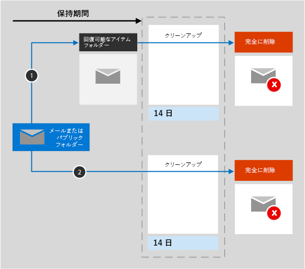

# Exchange の保持の詳細

[!include[Purview banner](../includes/purview-rebrand-banner.md)]

この記事の情報は[保持の詳細](retention.md)に関する記事を補足するもので、Exchange に固有の情報が含まれています。その他のワークロードについては、以下を参照してください。

- [SharePoint と OneDrive の保持の詳細](retention-policies-sharepoint.md)
- [Microsoft Teams の保持の詳細](retention-policies-teams.md)
- [Yammerの保持の詳細](retention-policies-yammer.md)

## 保持と削除の対象となる機能

添付ファイル付きのメール メッセージ (下書きを含む)、終了日がある場合のタスク、およびメモの Exchange アイテムは、アイテム保持ポリシーと保持ラベルを使用して保持および削除できます。 

終了日がある予定表アイテムはアイテム保持ポリシーでサポートされていますが、保持ラベルではサポートされていません。

連絡先、および終了日が設定されていないタスクおよび予定表アイテムはサポートされません。

Skype や Teams メッセージなど、メールボックスに保存されているその他のアイテムは、Exchange のアイテム保持ポリシーやラベルには含まれません。これらのアイテムには独自のアイテム保持ポリシーがあります。

メールボックスには、保持設定が適用される前に少なくとも10 MBのデータが必要であり、保持ラベルをメールボックスに公開できます。

## Exchange の保持のしくみ

メールボックスとパブリック フォルダーの両方とも、アイテムを保持するために、[[回復可能なアイテム] フォルダー](/exchange/security-and-compliance/recoverable-items-folder/recoverable-items-folder) を使用します。電子情報開示のアクセス許可を割り当てられているユーザーだけが、他のユーザーの [回復可能なアイテム] フォルダーのアイテムを表示できます。
  
ユーザーが [削除済みアイテム] フォルダー以外のフォルダー内のメッセージを削除すると、既定では、メッセージは [削除済みアイテム] フォルダーに移動します。ただし、ユーザーは任意のフォルダー内のアイテムを論理的に削除 (Shift + 削除) できます。これにより、削除済みアイテム フォルダーはバイパスされ、アイテムは回復可能なアイテム フォルダーに直接移動されます。
  
Exchange データに保持設定を適用すると、[回復可能なアイテム] フォルダー内のアイテムがタイマー ジョブによって定期的に評価されます。 アイテムが、アイテムを保持するために少なくとも 1 つのアイテム保持ポリシーまたは保持ラベルのルールと一致しない場合、そのアイテムは [回復可能なアイテム] フォルダーから完全に削除されます (物理的な削除とも呼ばれます)。

> [!NOTE]
> [データ保持の第 1 原則により](retention.md#the-principles-of-retention-or-what-takes-precedence)、別のアイテム保持ポリシーまたは保持ラベルのために同じアイテムを保持する必要がある場合、または法的、調査上の理由から電子情報開示の保留リストにある場合、完全な削除は常に中断されます。

タイマー ジョブの実行には最大 7 日かかる場合があり、Exchange の場所には少なくとも 10 MB が必要です。
  
ユーザーがメールボックス アイテムのプロパティ (件名、本文、添付ファイル、送信者と受信者、メッセージの送信日や受信日など) を変更しようとすると、変更がコミットされる前に、元のアイテムのコピーが [回復可能なアイテム] フォルダーに保存されます。この処理は、それ以降の変更のたびに実行されます。[回復可能なアイテム] フォルダー内のコピーは、保持期間の期限に達すると、完全に削除されます。

保持設定が Exchange のコンテンツに適用された後のコンテンツのパスは、保持設定が保持および削除、保持のみ、あるいは削除のみのどれであるかによって異なります。

保持設定が保持および削除の場合

1. **保持期間中、ユーザーがアイテムを変更または完全に削除した場合** (Shift キーと Delete キーを押すか、[削除済みアイテム] から削除): アイテムは [回復可能なアイテム] フォルダーに移動 (編集する場合はコピー) されます。ここで、タイマー ジョブが定期的に実行され、アイテム保持ポリシーの有効期間が過ぎたアイテムを特定します。このようなアイテムは、保持期間の最終日から 14 日以内に完全に削除されます。既定の設定は 14 日間ですが、最長 30 日間まで変更できます。

2. 保持期間中に **アイテムが変更または削除されていない場合は**、同じプロセスがメールボックス内のすべてのフォルダーに対して定期的に実行され、アイテム保持期間を過ぎたアイテムを特定します。これに該当するアイテムは、保持期間の最終日から 14 日以内に完全に削除されます。既定の設定は 14 日間ですが、最長 30 日間まで設定できます。 

保持設定が保持のみ、または削除のみの場合、コンテンツ パスは保持か削除かで異なります。

### 保持設定が保持のみのコンテンツ パス

1. 保持期間中に、**アイテムが変更または削除された場合**、元のアイテムのコピーが [回復可能なアイテム] フォルダーに作成され、保持期間の終了まで保持されます。保持期間が終了すると、[回復可能なアイテム] フォルダー内のコピーは、アイテムの有効期限が切れてから 14 日以内に完全に削除されます。 

2. 保持期間中に **アイテムが変更または削除されてない場合**、保持期間の前後には何も起こりません。アイテムは、元の場所に残ります。

### 保持設定が削除のみのコンテンツ パス

1. 設定した期間中に **アイテムが削除されない場合**: アイテム保持ポリシーで構成された期間の最後に、アイテムは [回復可能なアイテム] フォルダーに移動されます。 

2. 設定した期間中に **アイテムが削除された場合**: アイテムはすぐに [回復可能なアイテム] フォルダーに移動されます。 ユーザーが [回復可能なアイテム] フォルダーからアイテムを削除するかフォルダーを空にすると、そのアイテムは完全に削除されます。 それ以外の場合、14 日が経過すると、アイテムは [回復可能なアイテム] フォルダーから完全に削除されます。 

## 有効期限のユーザー通知

Exchange のアイテム保持ポリシーは、他のMicrosoft 365 ワークロードのアイテム保持ポリシーとは異なり、各メール メッセージの上部にアイテムの有効期限が最も短いアイテム保持ポリシーの名前と、そのアイテムの計算された有効期限を表示することで、ユーザー プレゼンスを提供します。アイテム保持ポリシーがアイテムを削除しない (保持のみ) 場合、ユーザーにはこの通知は表示されません。

保持ラベルが電子メール メッセージに適用されている場合、そのラベルの名前と対応する有効期限が常に表示され、メールボックスに適用されるすべてのアイテム保持ポリシーの名前と日付が置き換えられます。

このコンテキストでは、電子メールが削除される有効期限は、ユーザーが電子メール メッセージが自動的に [回復可能なアイテム] フォルダーに移動することを期待できる日付であることに注意してください (まだ存在しない場合)。 [回復可能なアイテム] フォルダー内のメールは完全には削除されませんが、保持するように保持設定の対象になっている場合や、法的または調査上の理由から電子情報開示ホールドの下にある場合は、コンプライアンスのために残ります。

## ユーザーが組織を離れる場合 

組織を退職するユーザーのメールボックスがアイテム保持のポリシーに含まれている場合は、そのユーザーの Microsoft 365 アカウントが削除されたときに、メールボックスが非アクティブなメールボックスになります。非アクティブなメールボックスのコンテンツは、引き続きメールボックスが非アクティブになる前に実施されたアイテム保持ポリシーの適用対象であり、電子情報開示の検索に表示されます。詳細については、「[Exchange Online の非アクティブなメールボックス](inactive-mailboxes-in-office-365.md)」を参照してください。

データが完全に削除されたため、または保持期間が終了したために保存設定が適用されなくなった場合、Exchange 管理者は[非アクティブなメール ボックスを削除](delete-an-inactive-mailbox.md)できるようになりました。このシナリオでは、非アクティブなメール ボックスは自動的に削除されません。

## 構成ガイダンス

Microsoft 365 で初めてアイテム保持を構成する場合は、「[情報ガバナンスを開始する](get-started-with-data-lifecycle-management.md)」を参照してください。

Exchange のアイテム保持ポリシーまたは保持ラベルを構成する準備ができたら、以下の手順をご覧ください。
- [アイテム保持ポリシーを作成して構成する](create-retention-policies.md)
- [アイテム保持ラベルを発行してアプリに適用する](create-apply-retention-labels.md)
- [保持ラベルをコンテンツに自動的に適用する](apply-retention-labels-automatically.md)
