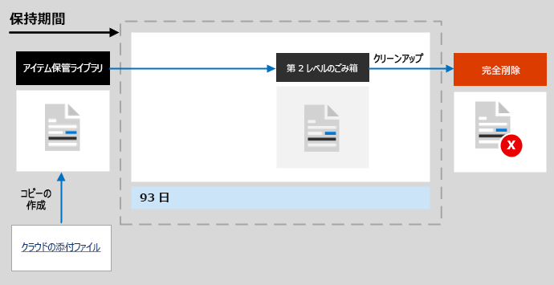

# SharePoint と OneDrive の保持の詳細

>*[セキュリティとコンプライアンスのための Microsoft 365 ライセンス ガイダンス](/office365/servicedescriptions/microsoft-365-service-descriptions/microsoft-365-tenantlevel-services-licensing-guidance/microsoft-365-security-compliance-licensing-guidance)。*

この記事の情報は[保持の詳細](retention.md)に関する記事を補足するもので、SharePoint と OneDrive に固有の情報が含まれています。

その他のワークロードについては、以下を参照してください。

- [Microsoft Teams の保持の詳細](retention-policies-teams.md)
- [Yammerの保持の詳細](retention-policies-yammer.md)
- [Exchange の保持の詳細](retention-policies-exchange.md)

## 保持と削除の対象となる機能

SharePoint または OneDrive サイトに保存されているすべてのファイルは、アイテム保持ポリシーまたは保持ラベルを適用することで保持できます。 

削除できるファイルは次のとおりです。

- アイテム保持ポリシーを使用する場合は、**サイト アセット** などの SharePoint ドキュメント ライブラリで自動的に作成された任意のファイルを含む、ドキュメント ライブラリのすべてのファイル。
    
- 保持ラベルを使用する場合は、ドキュメント ライブラリのすべてのファイル、およびフォルダー内に存在しないルート レベルのすべてのファイル。
    
> [!TIP]
> [保持ラベル用の自動適用ポリシーを使用したクエリ](apply-retention-labels-automatically.md#auto-apply-labels-to-content-with-keywords-or-searchable-properties) を使用する場合、次のエントリを使用して特定のドキュメント ライブラリを除外することができます。`NOT(DocumentLink:"<URL to document library>")`

リスト アイテムはアイテム保持ポリシーではサポートされていませんが、システム リストの項目を除き、保持ラベルではサポートされています。 これらは、SharePoint によってシステムの管理やマスター ページ カタログ、ソリューション カタログ、データ ソースの追加に使用される非表示リストです。 保持ラベルがサポートされているリスト アイテムに適用されると、保持設定に従って常に保持されますが、検索で非表示になっている場合は削除されません。

ドキュメントが添付されているサポートされるリスト アイテムに保持ラベルを適用する場合:
- 標準の保持ラベルの場合 (アイテムがレコードとして宣言されていない):
    - ドキュメントの添付ファイルは、ラベルの保持設定を自動的に継承しませんが、個別にラベルを付けることができます。
- アイテムをレコードとして宣言する保持ラベルの場合: 
    - ドキュメントにまだラベルが付けられていない場合、ドキュメントの添付ファイルはラベルから保持設定を自動的に継承します。

アイテム保持ポリシーと保持ラベルの両方のアイテム保持設定は、ライブラリ、リスト、およびフォルダーを含む組織構造には適用されません。

アイテム保持ポリシーと自動適用のラベル ポリシーの場合: 保持設定を適用するには、SharePoint サイトにインデックスを作成する必要があります。 ただし、SharePoint ドキュメント ライブラリ内のアイテムが検索結果に表示されないように構成されている場合、この構成ではファイルは保持設定から除外されません。

## SharePoint と OneDrive の保持のしくみ

SharePoint と OneDrive では、保持する必要のあるコンテンツを保存するためにアイテム保管ライブラリが作成されます (サイトに存在しない場合)。 アイテム保管ライブラリは、インタラクティブに使用するようには設計されていませんが、コンプライアンス上の理由で必要な場合は、代わりにファイルを自動的に保存します。 この機能は、以下のように実行されます。

保持の対象であるアイテムをユーザーが変更または削除した場合、保持設定の適用以降にそのコンテンツが変更されたかどうかがチェックされます。 保持設定が適用されてから最初の変更である場合、そのコンテンツはアイテム保管ライブラリにコピーされます。これにより、ユーザーは元のコンテンツを変更または削除できるようになります。

タイマー ジョブは、アイテム保管ライブラリで定期的に実行されます。 アイテム保管ライブラリに 30 日以上存在するコンテンツの場合、このジョブでは、コンテンツに対する保持設定で使用されたすべてのクエリに対してコンテンツが比較されます。 構成された保持期間以前のコンテンツは、アイテム保管ライブラリから削除されます。元の場所がまだそこにある場合は削除されます。 このタイマー ジョブは 7 日ごとに実行されます。つまり、最短の 30 日と合わせて、コンテンツがアイテム保管ライブラリから削除されるまでに最長 37 日かかる場合があります。

ファイルを保存保留ライブラリにコピーするためのこの動作は、保存設定が適用されたときに存在するコンテンツに適用されます。 さらに、保持ポリシーの場合、ポリシーに含まれた後にサイトに作成または追加された新しいコンテンツは、保存保留ライブラリに保持されます。 ただし、新しいコンテンツは最初に編集されたときはアイテム保管ライブラリにコピーされず、削除されたときのみコピーされます。 ファイルのすべてのバージョンを保持するには、元のサイトで[バージョン管理](#how-retention-works-with-document-versions)がオンになっている必要があります。
  
ユーザーが、保持の対象となるライブラリ、リスト、フォルダー、またはサイトを削除しようとすると、エラー メッセージが表示されます。 ユーザーは、保持の対象となるフォルダー内のファイルを最初に移動または削除した場合に、フォルダーを削除できます。

また、以下のような状況でラベル付きアイテムを削除しようとすると、ユーザーにエラー メッセージが表示されます。 アイテムはアイテム保管ライブラリにコピーされませんが、元の場所に残ります。

- ユーザーがラベル付きアイテムを削除できるレコード管理設定がオフになっています。
    
    この設定を確認または変更するには、Microsoft 365 コンプライアンス センターで **[レコード管理]** ノードから **[レコード管理]**、 > **[レコード管理設定]**、 > **[保持ラベル]**、 > **[アイテムの削除]** の順に移動します。 SharePoint と OneDrive の設定は別です。

- 保持ラベルはアイテムをレコードとしてマークし、それは[ロック済み](record-versioning.md)です。
    
    レコードのロックが解除された場合のみ、最終バージョンのコピーがアイテム保管ライブラリに保存されます。

- 保持ラベルは、常にアイテムの編集や削除ができないようにする[規制レコード](records-management.md#compare-restrictions-for-what-actions-are-allowed-or-blocked)としてアイテムをマークします。

保持設定が OneDrive アカウントや SharePoint サイトのコンテンツに割り当てられた後のコンテンツのパスは、保持設定が保持および削除、保持のみ、あるいは削除のみのどれであるかによって異なります。

保持設定が保持および削除の場合

  
1. 保存期間中に **コンテンツが変更または削除された場合**、アイテム保持設定が割り当てられたときに存在していた元のコンテンツのコピーが [アイテム保管ライブラリ] に作成されます。 そこで、タイマー ジョブは保持期間が終了したアイテムを識別します。 これらのアイテムは、第 2 段階のごみ箱に移動され、93 日が経過すると完全に削除されます。 第 2 段階のごみ箱はエンド ユーザーには表示されません (第 1 段階のごみ箱のみが表示されます) が、サイト コレクション管理者はそこからコンテンツを表示および復元できます。

    > [!NOTE]
    > 不注意によるデータの損失を防ぐために、アイテム保管ライブラリからコンテンツを完全に削除しないようになりました。 代わりにごみ箱からのみコンテンツを完全に削除するため、 [アイテム保管ライブラリ] のすべてのコンテンツは、第 2 段階のごみ箱を通過するようになります。
    
2. **保持期間中にコンテンツが変更または削除されていない場合**、タイマー ジョブは、保持期間の満了日にこのコンテンツを [第 1 段階のごみ箱] に移動します。ユーザーがそこからコンテンツを削除するか、このごみ箱を空にする (パージとしても知られています) 場合、ドキュメントは第 2 段階のごみ箱に移動されます。第 1 段階、第 2 段階のどちらのごみ箱も保持期間は 93 日です。93 日目に、第 1 段階、第 2 段階のどちらにあっても、ドキュメントは完全に削除されます。[ごみ箱] はインデックス付けされていないため、検索することができません。結果として、電子情報開示検索をしても、保留にする [ごみ箱] のコンテンツを検索することができません。

> [!NOTE]
> [データ保持の第 1 原則により](retention.md#the-principles-of-retention-or-what-takes-precedence)、別のアイテム保持ポリシーまたは保持ラベルのために同じアイテムを保持する必要がある場合、または法的、調査上の理由から電子情報開示の保留リストにある場合、完全な削除は常に中断されます。

保持設定が保持のみ、または削除のみの場合、コンテンツ パスは保持か削除かで異なります。

### 保持設定が保持のみのコンテンツ パス

1. 保持期間中に **コンテンツが変更または削除された場合**、元のドキュメントのコピーがアイテム保管ライブラリに作成され、保持期間が終了するまで保持されます。保持期間が終了すると、アイテム保管ライブラリ内のコピーは第 2 段階のごみ箱に移動され、93 日後に完全に削除されます。

2. 保持期間中に **コンテンツが変更または削除されてない場合**、保持期間の前後には何も起こりません。ドキュメントは、元の場所に残ります。

### 保持設定が削除のみの場合のコンテンツ パス

1. 構成期間中に **コンテンツが削除された場合**、ドキュメントは第 1 段階のごみ箱に移動されます。 ユーザーがそこからドキュメントを削除するか、このごみ箱を空にする場合、ドキュメントは第 2 段階のごみ箱に移動されます。 93 日間の保持期間は、第 1 段階と第 2 段階の両方のごみ箱に及びます。93 日が経過すると、ドキュメントは第 1 段階または第 2 段階のごみ箱から完全に削除されます。 構成期間中にコンテンツが変更された場合、構成期間後も、コンテンツは同じ削除パスに従います。

2. 構成期間中に **コンテンツが削除されない場合**: アイテム保持ポリシーで構成された期間の終了時に、ドキュメントは第 1 段階のごみ箱に移動されます。ユーザーがそこからドキュメントを削除するか、この [ごみ箱] を空にする (パージとしても知られています) 場合、ドキュメントは第 2 段階のごみ箱に移動されます。第 1 段階、第 2 段階のどちらの [ごみ箱] も保持期間は 93 日です。93 日目に、第 1 段階、第 2 段階のどちらの [ごみ箱] にあっても、ドキュメントは完全に削除されます。[ごみ箱] はインデックス付けされていないため、検索することができません。結果として、電子情報開示検索をしても、保留にする [ごみ箱] のコンテンツを検索することができません。

## クラウド添付ファイルでのデータ保持の方法

クラウドの添付ファイルは、ユーザーが共有するファイルへリンクが埋め込まれたもので、ユーザーが Outlook メールや Teams メッセージで共有するときに保持したり削除できます。 [クラウド添付ファイルに保持ラベルを自動的に適用すると](apply-retention-labels-automatically.md#auto-apply-labels-to-cloud-attachments), 保持ラベルは、アイテム保管ライブラリに格納されている共有ファイルのコピーに適用されます。

このシナリオでは、アイテムにラベルが付けられた時点に基づき保持期間を開始するようにラベル設定を構成することをお勧めします。 アイテムの作成日時や最終変更日時に基づいて保持期間を構成した場合、この日付は共有時の元のファイルから取得されます。 保持の開始を最終変更日時に構成した場合、この設定はアイテム保管ライブラリのコピーには影響しません。

ただし、元のファイルを変更し、再び共有する場合、アイテム保管ライブラリ内に新しいバージョンとしてのファイルのコピーが保存され、ラベルが付けられます。

元のファイルが再共有されても変更されない場合、アイテム保管ライブラリのコピーのラベル付けされた日付が更新されます。 この操作により、保持期間の開始がリセットされるため、アイテムにラベルが付けられた時点に基づき保持期間の開始を構成することをお勧めします。

保持ラベルは元のファイルに適用されないため、ラベル付けされたファイルはユーザーによって変更または削除されることはありません。 ラベル付けされたファイルは、タイマー ジョブによって保持期間が終了したことが確認されるまで、アイテム保管ライブラリに残ります。 アイテムを削除するように保持設定が構成されている場合、ファイルは第 2 段階のごみ箱に移動され、93 日後に完全に削除されます。

アイテム保管ライブラリに格納されているコピーは、クラウドの添付ファイルが共有されてから通常1時間以内に作成されます。

## OneNote コンテンツでの保持のしくみ

OneNote コンテンツを含む場所、または保持ラベルを含む場所にアイテム保持ポリシーを適用すると、OneNote フォルダーのバックグラウンドにある別の OneNote セクションは、保持設定を継承する個々のファイルになります。 つまり、指定した保持設定に従って、各セクションが個別に保持され削除されます。

OneNote ページ自体の更新日は、作成後も変更されません。

## 文書のバージョンを保持する方法

バージョン管理は、SharePoint および OneDrive のすべてのドキュメントリストと ライブラリの機能です。規定で、バージョン管理は少なくとも 500 のメジャー バージョンを保持しますが、この制限は増やすことができます。詳細については、「[リストまたはライブラリのバージョン管理を有効にして構成する](https://support.office.com/article/1555d642-23ee-446a-990a-bcab618c7a37)」および「[リストとライブラリでバージョン管理が機能するしくみ](https://support.microsoft.com/office/how-versioning-works-in-lists-and-libraries-0f6cd105-974f-44a4-aadb-43ac5bdfd247)」を参照してください。
  
バージョンを含むドキュメントが、そのコンテンツを保持するために保持設定が適用される場合、アイテム保管ライブラリにコピーされるバージョンは別のアイテムとして存在します。 保持期間の終了時に削除するように設定が構成されている場合:

- アイテム保持期間がコンテンツの作成日時に基づいている場合、それぞれのバージョンには、元のドキュメントと同じ有効期限日が設定されます。元のドキュメントとそのバージョンは、すべて同時に期限が切れます。

- アイテム保持期間がコンテンツの最終更新日時に基づいている場合、それぞれのバージョンには、そのバージョンを作成するために元のドキュメントを変更した日時に基づいた独自の有効期限日が設定されます。元のドキュメントとそのバージョンは、個別に期限が切れます。

アイテム保持アクションがドキュメントを削除する場合、アイテム保管ライブラリに含まれていないすべてのバージョンは、現在のバージョンに従って同時に削除されます。

保持ポリシー (またはeDiscovery の保留) の対象となるアイテムの場合、ドキュメントの保持期間に達するまで（またはeDiscovery の保留がリリースされるまで）、ドキュメントライブラリのバージョン管理の制限は無視されます。このシナリオでは、以前のバージョンは自動的には削除されず、ユーザーはバージョンを削除できません。

コンテンツがアイテム保持ポリシーの対象ではない場合（またはeDiscoveryの保留になっていない場合）、これは保持ラベルのケースではありません。 その代わり、新しいバージョンに対応するために古いバージョンが自動的に削除されるようにバージョン管理の制限が守られますが、ユーザーは引き続きバージョンを削除できません。

## ユーザーが組織を離れる場合

**SharePoint**:

ユーザーのメールボックスや OneDrive アカウントとは異なり、SharePoint は共同作業環境とみなされるため、ユーザーが組織を離れるときも、そのユーザーが作成したコンテンツは影響を受けません。

**OneDrive**:

ユーザーが組織を離れる場合、アイテム保持ポリシーの対象ファイル、または保持ラベルが付いているファイルは、ポリシーまたはラベルで指定されている保持期間の間、保持設定の対象となります。 その間も、すべての共有アクセスは機能し続け、コンテンツ検索や電子情報開示でコンテンツを検出することができます。 

保持期間が期限切れとなり、保持設定に削除アクションが含まれている場合、コンテンツはサイトコレクションのごみ箱に移動し、管理者以外はアクセスできなくなります。

## 構成ガイダンス

Microsoft 365 で初めてアイテム保持を構成する場合は、「[情報ガバナンスを開始する](get-started-with-information-governance.md)」を参照してください。

Exchange のアイテム保持ポリシーまたは保持ラベルを構成する準備ができたら、以下の手順をご覧ください。
- [アイテム保持ポリシーを作成して構成する](create-retention-policies.md)
- [アイテム保持ラベルを作成してアプリに適用する](create-apply-retention-labels.md)
- [保持ラベルをコンテンツに自動的に適用する](apply-retention-labels-automatically.md)