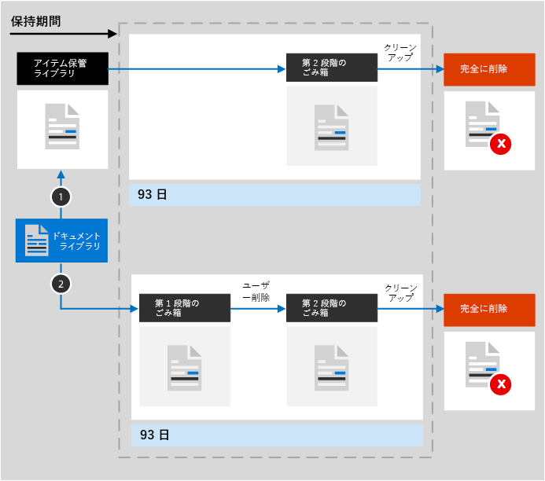
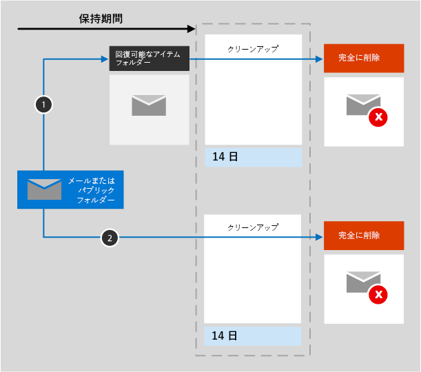
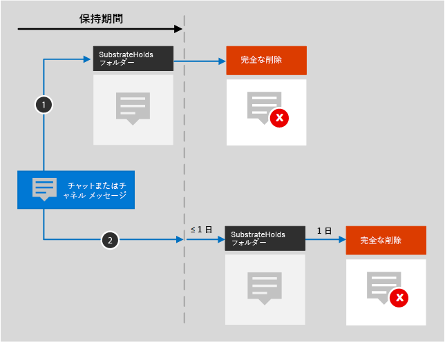

# アイテム保持ポリシーの概要

ほとんどの組織では、電子メール、ドキュメント、インスタント メッセージなどのデータの量と複雑さが日々増しています。次の必要性から、これらの情報を効果的に管理することが重要です。
  
- **最小限の期間コンテンツを保持することを要求する業界の規制や内部ポリシーを積極的に遵守する**: たとえば、米国企業改革法により、特定の種類のコンテンツを 7 年間保持することが求められる場合があります。 
    
- **訴訟やセキュリティ違反が発生した場合にリスクを軽減する**: このために、保持する必要がなくなった古いコンテンツは完全に削除します。 
    
- **組織内での効率的な知識の共有と迅速な対応に役立てる**: このために、ユーザーは現時点で関連性のあるコンテンツのみを対象に作業するようにします。 
    
アイテム保持ポリシーは、これらすべての目標の達成に役立ちます。一般に、コンテンツの管理に求められる操作は次の 2 つです。
  
- **コンテンツの保持**: 保持期間が満了するまではコンテンツの完全な削除ができないようにします。 
    
- **コンテンツの削除**: 保持期間の満了時点でコンテンツを完全に削除します。 
    
アイテム保持ポリシーにより、次のことが可能になります。
  
- コンテンツを保持するか、コンテンツを削除するか、またはその両方を行う (コンテンツを保持した後に削除する) かを事前に決定する。
    
- 組織全体または特定の場所またはユーザーに単一のポリシーを適用します。
    
- 特定のキーワードまたは[特定の種類の機密情報](what-the-sensitive-information-types-look-for.md)を含むコンテンツなど、すべてのコンテンツまたは特定の条件を満たすコンテンツにポリシーを適用します。
    
コンテンツがアイテム保持ポリシーの対象になったときに、そのコンテンツは所定の場所に維持されるため、ユーザーは何も変更されなかったかのように元の場所でコンテンツに対する編集や作業を続行できます。ただし、ポリシーの対象になっているコンテンツを編集または削除すると、コピーが安全な場所に保存され、ポリシーが有効な間はその場所で保持されます。
  
最後に、一部の組織は米国証券取引委員会 (SEC) の規則 17a-4 などの規制に従う必要があります。この規則では、アイテム保持ポリシーを一旦オンにすると、その後オフにすることや制限を緩和することはできないと定められています。この要件を満たすために、保持ロックを使用できます。 ポリシーが一旦ロックされると、誰も (管理者を含む) ポリシーをオフにしたり、制限を緩和したりすることができなくなります。
  
アイテム保持ポリシーの作成と管理は、次の場所で実行します

- [Microsoft 365 コンプライアンス センター](https://compliance.microsoft.com/)の [**ポリシー**] ページ。
- [**保持**] ページ ([**情報ガバナンス**] 下にあり、[Office 365 セキュリティ&amp; コンプライアンス センター](https://protection.office.com/)内にあります)。
  
## アイテム保持ポリシーは所定の場所にあるコンテンツに対してどのように作用するか

サイトやメールボックスなどの場所をアイテム保持ポリシーに含めたときにも、コンテンツは元の場所に引き続き保持されます。そのため、ユーザーは何事もなかったかのように、自分のドキュメントやメールに対する作業を継続できます。ただし、ポリシーに含まれるコンテンツを編集したり削除したりした場合、ポリシーを適用したときの状態でコンテンツのコピーが保持されます。
  
SharePoint サイト コレクションの場合、ユーザーがコンテンツを編集または削除したときに、元のコンテンツのコピーが [アイテム保管ライブラリ] に保持されます。メールおよびパブリック フォルダーの場合、コピーは [回復可能なアイテム] フォルダーに保持されます。これらの安全な場所と保持されているコンテンツは、ほとんどのユーザーには見えません。 アイテム保持ポリシーを使用すると、コンテンツがポリシーの対象であることを知る必要さえありません。
  
注:
  
- Teams (チャット) のコンテンツは Exchange に格納されます。ここでは、メッセージの種類 (メールまたは会話) に応じてポリシーが適用されます。
    
- Office 365 グループに適用されるアイテム保持ポリシーには、グループ メールボックスおよびサイトの両方が含まれます。

- アイテム保管ライブラリは、サイトのストレージ クォータを消費します。
    
### OneDrive アカウントと SharePoint サイトのコンテンツ

アイテム保持ポリシーは、サイト コレクションのレベルで適用されます。 アイテム保持ポリシーに SharePoint サイト コレクションまたは OneDrive アカウントを含めると、[アイテム保管ライブラリ] が作成されます (存在しない場合)。 このライブラリは、サイト コレクションのトップレベル サイトの [**サイト コンテンツ**] ページで表示できます。 [アイテム保管ライブラリ] はサイト コレクションの所有者にしか表示されないため、ほとんどのユーザーはこのライブラリを表示できません。
  
ユーザーがアイテム保持ポリシーの対象となるサイトのコンテンツを変更または削除しようとすると、ポリシーが適用されて以来コンテンツが変更されたかどうかがまずポリシーによってチェックされます。 ポリシーが適用されてからこれが最初の変更である場合、アイテム保持ポリシーはコンテンツを [アイテム保管ライブラリ] にコピーし、そしてユーザーが元のコンテンツを変更または削除できるようにします。 コンテンツがアイテム保持ポリシーで使用されるクエリと一致しない場合でも、サイト コレクション内のコンテンツはすべて [アイテム保管ライブラリ] にコピーできます。
  
その後、タイマー ジョブがアイテム保管ライブラリをクリーンアップします。 タイマー ジョブは定期的に実行され、サイトの保持ポリシーで使用されたすべてのクエリに対してアイテム保管ライブラリのすべてのコンテンツが比較されます。 少なくともクエリの 1 つにコンテンツが一致しない限り、タイマー ジョブはアイテム保管ライブラリからそのコンテンツを完全に削除します。
  
これは、アイテム保持ポリシーが適用されたときに存在していたコンテンツに当てはまります。これに加えて、サイト コレクションがポリシーの対象になった後で作成または追加された新しいコンテンツは、削除後も保持されます。ただし、新しいコンテンツは、削除された場合にのみアイテム保管ライブラリにコピーされ、最初の編集時にはコピーされません。すべてのファイルのバージョンを保持するには、バージョン管理を有効にする必要があります。バージョン管理については、後述のセクションで説明します。
  
ユーザーがアイテム保持ポリシーの対象となるライブラリ、リスト、フォルダー、またはサイトを削除しようとすると、エラーが表示されることに注意してください。 ユーザーは、ポリシーの対象となるフォルダー内のファイルを最初に移動または削除した場合に、フォルダーを削除できます。 また、アイテム保持ポリシーを作成するときではなく、最初のアイテムをライブラリにコピーする必要がある場合にのみ、[アイテム保管ライブラリ] が作成されます。 したがって、ポリシーをテストするには、最初にポリシーの対象となるサイト内のドキュメントを編集または削除してから、[アイテム保管ライブラリ] を参照して、保持されているコピーを表示する必要があります。
  
OneDrive アカウントまたは SharePoint サイトにアイテム保持ポリシーが割り当てられていると、コンテンツは次の 2 つの経路のどちらかで処理されます。

  
1. 保存期間中に**コンテンツが変更または削除された場合**、アイテム保持ポリシーが割り当てられたときに存在していた元のコンテンツのコピーが [アイテム保管ライブラリ] に作成されます。 そこでタイマー ジョブが定期的に実行され、保持期間が終了したアイテムを識別し、それらのアイテムは93日目に、完全に削除される第 2 段階の [ごみ箱] に移動されます。 第 2 段階のごみ箱はエンド ユーザーには表示されません (第 1 段階のごみ箱のみが表示されます) が、サイト コレクション管理者はそこからコンテンツを表示および復元できます。

    > [!NOTE]
    > アイテム保管ライブラリからコンテンツを削除する方法が最近変更されました。 不注意によるデータの損失を防ぐために、アイテム保管ライブラリからコンテンツを完全に削除しないようになりました。 代わりにごみ箱からのみコンテンツを完全に削除するため、 [アイテム保管ライブラリ] のすべてのコンテンツは、第 2 段階のごみ箱を通過するようになります。
    
2. 保持期間中に**コンテンツが変更または削除されない場合**、保持期間の終了時にコンテンツは第 1 段階のごみ箱に移動されます。 ユーザーがそこからコンテンツを削除するか、このごみ箱を空にする (パージとしても知られています) 場合、ドキュメントは第 2 段階のごみ箱に移動されます。 93 日間の保持期間は、第 1 段階と第 2 段階の両方のごみ箱に及びます。93 日が経過すると、ドキュメントは第 1 ステージまたは第 2 ステージのごみ箱のどこからでも完全に削除されます。 [ごみ箱] にはインデックスが付けられていないため、検索ではそこにコンテンツを見つけることができません。 つまり、電子情報開示の保留では、それを保持するためのごみ箱内のコンテンツを見つけることができません。 
    
### メールボックス内およびパブリック フォルダー内にあるコンテンツ

ユーザーのメールや予定表などのアイテムには、メールボックス レベルでアイテム保持ポリシーが適用されます。パブリック フォルダーには、メールボックス レベルではなく、フォルダー レベルでアイテム保持ポリシーが適用されます。メールボックスとパブリック フォルダーの両方で、アイテム保持のために [回復可能なアイテム] フォルダーが使用されます。別のユーザーの [回復可能なアイテム] フォルダーに含まれるアイテムは、電子情報開示のアクセス許可が割り当てられているユーザーのみが閲覧できます。
  
既定では、ユーザーが [削除済みアイテム] フォルダー以外のフォルダー内のメッセージを削除すると、そのメッセージは [削除済みアイテム] フォルダーに移動されます。ユーザーが [削除済みアイテム] フォルダー内のアイテムを削除すると、そのメッセージは [回復可能なアイテム] フォルダーに移動されます。また、ユーザーは任意のフォルダー内のアイテムを論理的に削除できます (Shift キーと Delete キーを同時に押します)。この操作により、アイテムは [削除済みアイテム] フォルダーをバイパスして、[回復可能なアイテム] フォルダーに直接移動されます。
  
[回復可能なアイテム] フォルダー内のアイテムは、プロセスによって定期的に評価されます。どのアイテム保持ポリシーとも一致しないアイテムは、[回復可能なアイテム] フォルダーから完全に削除されます (この削除は物理的な削除とも呼ばれます)。
  
メールボックスのアイテムのある種のプロパティ (件名、本文、添付ファイル、送信者と受信者、メッセージの送受信日付など) が変更されそうになると、変更が確定される前に元のアイテムのコピーが [回復可能なアイテム] フォルダーに保存されます。 2 番目以降の変更ごとに、この操作が繰り返されます。 保持期間が終了すると、[回復可能なアイテム] フォルダー内のコピーは完全に削除されます。
  
組織を退職するユーザーのメールボックスがアイテム保持ポリシーに含まれている場合は、そのユーザーの Office 365 アカウントが削除されたときに、メールボックスが非アクティブなメールボックスになります。非アクティブなメールボックスのコンテンツは、引き続きメールボックスが非アクティブになる前に実施されたアイテム保持ポリシーの適用対象であり、電子情報開示の検索に表示されます。詳細については、「[Exchange Online の非アクティブなメールボックス](inactive-mailboxes-in-office-365.md)」を参照してください。
  
アイテム保持ポリシーがメールボックスまたはパブリック フォルダーに割り当てられた後は、コンテンツは次の 2 つのパスのいずれかをたどることができます。

1. 保持期間中に**ユーザーがアイテムを変更または完全に削除した場合**。ユーザーが Shift キーと Delete キーを同時に押すか、[削除済みアイテム] から削除を実行すると、アイテムは [回復可能なアイテム] フォルダーに移動されます (編集の場合はコピーされます)。ここでは、プロセスが定期的に実行され、アイテム保持ポリシーの有効期間を経過したアイテムが識別されます。これに該当するアイテムは、保持期間の満了日から 14 日以内に完全に削除されます。既定の設定は 14 日間ですが、最長 30 日間にまで変更できます。
    
2. 保存期間中に**アイテムが変更または削除されない場合**、メールボックス内のすべてのフォルダーで同じプロセスが定期的に実行され、保持期間が終了したアイテムを識別します。これらのアイテムは保持期間の終了後 14 日以内に完全に削除されます。 既定の設定は 14 日間ですが、最長 30 日間まで設定できます。 
    
## アイテム保持ポリシーはサイト コレクションのドキュメントのバージョンにどのように作用するか

バージョン管理は、SharePoint Online および OneDrive for Business のすべてのドキュメント ライブラリの機能です。 規定ではバージョン管理は少なくとも 500 のメジャー バージョンを保持しますが、この制限は増やすことができます。 詳細については、「[リストまたはライブラリのバージョン管理を有効にし、構成する](https://support.office.com/article/1555d642-23ee-446a-990a-bcab618c7a37)」を参照してください。
  
保持ポリシー (削除のみではなくコンテンツを保持する保持ポリシー) は、SharePoint サイト コレクションまたは OneDrive アカウント内のドキュメントのすべてのバージョンを保持します。 保留または保持ポリシーの対象となるドキュメントが編集されるたびに、バージョンがアイテム保管ライブラリにコピーされます。 保留または保持ポリシーの対象となるドキュメントが削除されるたびに、バージョン管理が有効である場合、すべてのバージョンがアイテム保管ライブラリにコピーされます。 アイテム保管ライブラリ内のドキュメントの各バージョンは、独自の保持期間を持つ個別のアイテムとして存在します。
  
- アイテム保持ポリシーがコンテンツの作成日時に基づいている場合、それぞれのバージョンには、元のドキュメントと同じ有効期限日が設定されます。元のドキュメントとそのバージョンは、すべて同時に期限が切れます。
    
- アイテム保持ポリシーがコンテンツの最終更新日時に基づいている場合、それぞれのバージョンには、そのバージョンを作成するために元のドキュメントを変更した日時に基づいた独自の有効期限日が設定されます。元のドキュメントとそのバージョンは、個別に期限が切れます。

> [!NOTE]
> 保存されたバージョンの SharePoint および OneDrive ドキュメントは、eDiscovery ツールで検索できません。

## コンテンツを特定の期間保持する

アイテム保持ポリシーを使用すると、コンテンツを無期限に、または特定の日数、月数、または年数の間保持することができます。 コンテンツが保持される期間は、アイテム保持ポリシーが適用された時点からではなくコンテンツの経過時間から計算されます。 経過時間は、コンテンツが作成された日時に基づく場合と、(OneDrive および SharePoint の場合) コンテンツが最後に変更された日時に基づく場合から選択できます。
  
たとえば、サイト コレクションのコンテンツを最終変更日から 7 年間保持するとします。そのサイト コレクションのドキュメントが過去 6 年間変更されていない場合、そのドキュメントは、もう 1 年間のみ保持されます。そのドキュメントが再度編集された場合、ドキュメントの経過時間は新しい最終変更日から計算され、その時点から 7 年間保持されます。
  
同様に、メールボックスのコンテンツを 7 年間保持するとします。メッセージが 6 年前に送信されていた場合、そのメッセージは、もう 1 年間のみ保持されます。Exchange のコンテンツの経過時間は、常に、受信日または送信日に基づいて計算されます。最終更新日に基づいてコンテンツを保持するポリシーは、OneDrive および SharePoint のサイト コンテンツにのみ適用されます。
  
保持期間の終了時にコンテンツを完全に削除するかどうかを選択できます。 アイテム保持ポリシーは、古いコンテンツを保持せずに削除することもできます。 次のセクションを参照してください。
  
![[アイテム保持設定] ページ](media/b05f84e5-fc71-4717-8f7b-d06a29dc4f29.png)
  
## 特定の経過時間を超えた古いコンテンツを削除する

アイテム保持ポリシーは、コンテンツを保持してから削除することも、古いコンテンツを保持せずに削除することもできます。
  
アイテム保持ポリシーによってコンテンツを削除する場合、アイテム保持ポリシーに指定した期間は、ポリシーが割り当てられた時点からではなく、コンテンツが作成または変更された時点から計算されることを理解しておくことが重要です。
  
![[削除の設定]](media/042f9571-96f4-458f-8f38-fad3ed68ed31.png)
  
たとえば、3 年間経過後のコンテンツを削除するアイテム保持ポリシーを作成して、そのポリシーをすべての OneDrive アカウントに割り当てるとします。また、該当するアカウントには 4 年から 5 年前に作成されたコンテンツが数多く含まれているとします。この場合、そのアイテム保持ポリシーを初めて割り当てたときに、多数のコンテンツがすぐに削除されます。こうした理由から、**コンテンツを削除するアイテム保持ポリシーは、コンテンツに大きな影響を与えることになります**。 
  
そのため、サイト コレクションに初めてポリシーを割り当てるときには、その前に、既存のコンテンツの経過時間と、そのコンテンツにポリシーが及ぼす影響について考慮する必要があります。また、新しいポリシーを割り当てる前に、サイト所有者に連絡して、発生する可能性のある影響について評価するための時間を与えるようにしてください。アイテム保持ポリシーの作成前に設定を確認すると、この警告が表示されます。
  

  
## 特定の条件を満たすコンテンツにのみポリシーを適用するための高度な設定

アイテム保持ポリシーは、その場所に含まれるすべてのコンテンツに適用することも、特定のキーワードや[特定の種類の機密情報](what-the-sensitive-information-types-look-for.md)を含むコンテンツにのみ適用するように選択することもできます。
  

  
### 特定のキーワードを含むコンテンツを保持する

特定の条件を満たすコンテンツにのみアイテム保持ポリシーを適用して、そのコンテンツのみを保持できます。現時点で利用可能な条件では、特定の単語や語句を含むコンテンツにアイテム保持ポリシーを適用することがサポートされています。AND、OR、NOT などの検索演算子を使用すると、クエリの範囲を絞り込むことができます。これらの演算子の詳細については、「[コンテンツ検索のキーワード クエリと検索条件](keyword-queries-and-search-conditions.md)」を参照してください。
  
検索可能なプロパティ (**件名:** など) の追加については間もなくサポートされます。
  
クエリベースの保持では、検索インデックスを使用してコンテンツを識別します。
  

  
### 機密情報が含まれているコンテンツを保持する

アイテム保持ポリシーは、[特定の種類の機密情報](what-the-sensitive-information-types-look-for.md)が含まれているコンテンツにのみ適用できます。たとえば、納税者番号、社会保障番号、パスポート番号などの個人を特定できる情報 (PII) が含まれているコンテンツにのみ固有の保持要件を適用することができます。
  

  
注:
  
- 機密情報に対応する高度な保持は、Exchange のパブリック フォルダーや Skype for Business には適用されません (これらの場所が機密情報の種類をサポートしていないため)。
    
- Exchange Online では、機密情報の識別にメール フロー ルール (トランスポート ルールとも呼ばれる) が使用されていることを理解している必要があります。このルールは、転送中のメッセージには有効ですが、既にメールボックスに保存されているアイテムには作用しません。つまり、Exchange Online の場合、アイテム保持ポリシーでは、そのポリシーがメールボックスに適用された**後**に受信したメッセージに対してのみ機密情報の識別と保持が可能になります (前のセクションで説明したクエリ ベースの保持では、コンテンツを識別する際に検索インデックスが使用されるため、このような制限はありません)。 
    
## アイテム保持ポリシーを組織全体または特定の場所に適用する

アイテム保持ポリシーは、組織全体、場所全体、または特定の場所やユーザーのみに簡単に適用できます。
  
### 組織全体のポリシー

アイテム保持ポリシーの強力な機能の 1 つとして、既定ではポリシーが Office 365 全体の場所に適用されます。これには、次の場所が含まれます。
  
- Exchange 電子メール
    
- SharePoint サイト コレクション
    
- OneDrive アカウント
    
- Office 365 グループ (グループのメールボックス、サイト、およびドキュメントのコンテンツに適用されます。 Planner、Yammer、CRM Microsoft Teams、PowerBI、Stream、Exchange、SharePoint チーム サイトのコンテンツのサポートは近日開始予定です。)
    
- Exchange パブリック フォルダー
    

  
その他の組織全体のアイテム保持ポリシーに関する重要な機能は、次のとおりです。
  
- ポリシーに含めることができるメールボックスまたはサイトの数に制限はありません。
    
- Exchange の場合、ポリシーの適用後に作成された新しいメールボックスには、そのポリシーが自動的に継承されます。
  
### 場所全体に適用されるポリシー

場所を選択すると、Exchange メールや OneDrive アカウントなど、場所全体を簡単に含めたり除外したりできます。 これを行うには、その場所の [**状態**] をオンまたはオフに切り替えます。 
  
組織全体のポリシーと同様に、場所全体の任意の組み合わせにポリシーを適用する場合は、ポリシーに含めることができるメールボックスまたはサイトの数に制限はありません。たとえば、ポリシーにすべての Exchange 電子メールとすべての SharePoint サイトを含めると、数に関係なくすべてのサイトとメールボックスが含まれるようになります。また、Exchange の場合、ポリシーの適用後に作成された新しいメールボックスには、そのポリシーが自動的に継承されます。
 
![[場所の選択] ページ](media/6ac0c2d6-1abf-4690-b3f6-9ca506887ba3.png)
  
### 特定の追加または除外を含むポリシー

保持ポリシーは、特定のユーザーや、Office 365 グループ、またはサイトに適用することもできます。そのためには、目的の場所の **[状態]** をオンに切り替えてから、リンクを使用して特定のユーザー、Office 365 グループ、またはサイトを含めたり除外したりします。 
  
ただし、1,000 を超える特定の場所を含めたり除外したりする保持ポリシーには、次の制限があります。
  
- これに該当する保持ポリシーに含めることができるメールボックスは 1,000 個以下、サイト コレクションは 100 個以下です。
    
- 1 つのテナントに含めることができる、アイテム保持ポリシーは 10,000 個以下です。
    
こうした制限はありますが、組織全体のポリシーまたは場所全体に適用されるポリシーを適用することで、この制限を取り除くことができます。
  
### Skype の場所

Exchange メールとは異なり Skype の場所の状態をオンに切り替えてすべてのユーザーを含めることはできませんが、そのロケーションをオンにしてから、会話を保持するユーザーを手動で選択できます。
  
Skype for Business ユーザーを選択すると、列ヘッダーの [**名前**] ボックスを選択して、すべてのユーザーをすばやく含めることができます。 ただし、各ユーザーはポリシーの特定のインクルージョンとしてカウントされることを理解することが重要です。 したがって、1,000 人を超えるユーザーを含める場合は、前のセクションで述べた制限が適用されます。 ここですべての Skype ユーザーを選択することは、組織全体のポリシーに規定ですべての Skype ユーザーを含めることができた場合と同じではありません。 
  

  
Outlook のフォルダー **[会話履歴]** は、Skype のアーカイブには作用しない機能です。**[会話履歴]** はエンド ユーザーが無効にできますが、Skype のアーカイブの場合はユーザーがアクセスできない (電子情報開示には使用できる) 非表示フォルダーに Skype の会話のコピーが保存されます。

### Teams の場所

アイテム保持ポリシーは、Teams のチャットとチャネル メッセージの保持に使用できます。Teams のチャットは、チャットに参加していた各ユーザーのメールボックス内の隠しフォルダーに保存されます。また、Teams のチャネル メッセージは、チーム用のグループ メールボックス内の同様の隠しフォルダーに保存されます。ただし、Teams は Azure が提供するチャット サービスを使用し、そのサービスでも、このデータが保存されることを理解しておくことが重要です。また、このサービスは、既定でデータを無期限に保存します。このため、Teams のデータの保持および削除する場合は、Teams の場所を使用することを強くお勧めします。Teams の場所を使用すると、Exchange メールボックスと基になる Azure が提供するチャット サービスの両方から完全にデータが削除されます。詳細については、「[Microsoft Teams のセキュリティとコンプライアンスの概要](https://go.microsoft.com/fwlink/?linkid=871258)」を参照してください。
  
Teams チャットおよびチャネル メッセージは、Exchange または Office 365 グループの場所にあるユーザーまたはグループのメールボックスに適用されるアイテム保持ポリシーの影響を受けません。 Teams のチャットとチャネル メッセージは Exchange に保存されますが、それらは Teams の場所に適用されるアイテム保持ポリシーの影響のみを受けます。
  
アイテム保持ポリシーがチームに割り当てられた後は、チャットおよびチャネル メッセージは次の 2 つのパスのいずれかをたどることができます。

1. 保存期間中に**ユーザーがチャットまたはチャネル メッセージを変更または削除した場合**、メッセージは SubstrateHolds フォルダー (すべてのユーザーまたはグループ メールボックスの非表示フォルダー) に移動 (または編集の場合はコピー) され、 保持期間が終了するまで、このフォルダに保存されます。 メッセージは保持期間が終了する日に完全に削除されます。

2. 保持期間中に**チャットまたはチャネル メッセージが削除されない場合**、メッセージは保持期間が切れた後 1 日以内に SubstrateHolds フォルダーに移動されます (0 から 24 時間かかります)。 メッセージは SubstrateHolds フォルダーに移動した 1 日後に完全に削除されます。 

> [!NOTE]
> SubstrateHolds フォルダー内のメッセージは、電子情報開示ツールで検索できます。 メッセージが完全に削除された後は、電子情報開示検索で返されることはありません。

Teams の保持機能の最適化に継続的に取り組んでおり、今後数か月以内に新しい機能をリリースする予定です。 それまでの間、注意すべき制限事項がいくつかあります。
  
- **Teams には、個別のアイテム保持ポリシーが必要です**。 アイテム保持ポリシーを作成して、Teams の場所をオンに切り替えると、その他のすべての場所がオフに切り替わります。 Teams を含むアイテム保持ポリシーには、Teams のみを含めることが可能で、他の場所は含まれません。 
    
- **Teams は組織全体のポリシーに含まれていません**。 組織全体のポリシーを作成する場合、Teams は別のアイテム保持ポリシーを必要とするため、含まれません。 
    
- **Teams は高度なアイテム保持をサポートしていません**。 アイテム保持ポリシーを作成するときに、[特定の条件を満たすコンテンツにのみポリシーを適用するための高度な設定](#advanced-settings-that-apply-a-policy-only-to-content-that-meets-certain-conditions)を選択した場合、Teams の場所は使用できません。 現時点で Teams での保持は、チャットおよびチャネル メッセージのすべてのコンテンツに適用されます。 

- **プライベート チャネルの Teams コンテンツは、サポートされていません**。 現時点では、Teams 用に作成されたアイテム保持ポリシーはプライベート チャネル メッセージには適用されません。 標準チャネルのメッセージのみが、Teams 用に作成されたアイテム保持ポリシーの対象となります。 プライベート チャネルのアイテム保持ポリシーのサポートは、近日公開予定です。 
    
- **Teams は、期限切れのメッセージをクリーンアップするために最大 3 日を要する場合があります**。 Teams に適用されるアイテム保持ポリシーは、保持期間が終了するとチャットとチャネル メッセージを削除します。 ただし、これらのメッセージをクリーンアップして完全に削除するには、最大 3 日を要する場合があります。 またチャットおよびチャネル メッセージは、保持期間が終了しメッセージが完全に削除されたときに電子情報開示ツールで検索できるようになります。

   > [!NOTE]
   > 以前は、アイテム保持ポリシーでは作成から 30 日未満の Teams コンテンツを削除できませんでしたが、この制限は削除されました。 Teams コンテンツの保持期間は、選択した任意の日数で、最短 1 日から設定することができます。 保持期間が 1 日の場合、保持期間が終了してからメッセージが完全に削除されるまでに最大 3 日を要します。
    
チームでは、チャット内で共有されるファイルは、ファイルを共有したユーザーの OneDrive アカウントに保存されます。 チャネルにアップロードされたファイルは、チームの SharePoint 内に保存されます。 そのため、チーム内のファイルを保持または削除するには、SharePoint と OneDrive の場所に特に適用されるアイテム保持ポリシーを作成する必要があります。 特定のチームのみのファイルにポリシーを適用する場合は、チーム用の SharePoint サイトおよびチーム内のユーザーの OneDrive アカウントを選択できます。
  
Teams に適用するアイテム保持ポリシーには、[保持ロック](#locking-a-retention-policy)を使用できます。
  

  
> [!NOTE]
> 組織内の Skype または Teams の場所用にアイテム保持ポリシーを作成する場合、ユーザーが Outlook デスクトップ クライアントでメールボックス フォルダーのプロパティを表示すると、これらのポリシーの 1 つが既定のフォルダーポリシーとして表示されます。 これは、Outlook の誤表示の問題であり、[既知の問題](https://support.microsoft.com/help/4491013/outlook-client-displays-teams-or-skype-for-business-retention-policies)です。 既定のフォルダー ポリシーとして表示されるのは、フォルダーに適用されるメールボックス保持ポリシーです。 Skype または Teams の保持ポリシーは、ユーザーのメールボックスには適用されません。  

### Office 365 グループの場所

Office 365 グループのコンテンツを保持するには、Office 365 グループの場所を使用する必要があります。 Office 365 グループには Exchange メールボックスがありますが、Exchange の場所全体が含まれるアイテム保持ポリシーには、Office 365 グループのメールボックスのコンテンツは含まれません。 Office 365 グループに適用されるアイテム保持ポリシーには、グループ メールボックスおよびサイトの両方が含まれます。 Office 365 グループに適用されるアイテム保持ポリシーは、Microsoft Teams を含む Office 365 グループによって作成されたリソースを保護します。

また、Exchange の場所を使用して特定のグループ メールボックスを含めたり除外したりすることはできません。 最初は Exchange の場所でグループ メールボックスを選択できますが、アイテム保持ポリシーを保存しようとすると、"RemoteGroupMailbox" は Exchange の場所の有効な選択ではないというエラーが表示されます。 

## アイテム保持ポリシーから特定の種類の Exchange アイテムを除外する
PowerShell を使用すると、アイテム保持ポリシーから特定の種類の Exchange アイテムを除外できます。たとえば、メールボックス内のボイスメール メッセージや IM 会話などの Skype for Business Online のコンテンツを除外できます。さらに、予定表、メモ、タスク アイテムを除外することもできます。この機能は、PowerShell を使用してのみ利用できます。アイテム保持ポリシーを作成するときの UI では、この機能を利用できません。
  
この操作を行うには、`New-RetentionComplianceRule` および `Set-RetentionComplianceRule` コマンドレットの `ExcludedItemClasses` パラメーターを使用します。PowerShell の詳細については、後述のセクション「[アイテム保持ポリシーの PowerShell コマンドレットを検索する](#find-the-powershell-cmdlets-for-retention-policies)」を参照してください。

## アイテム保持ポリシーをロックする
一部の組織は、米国証券取引委員会 (SEC) 規則 17a-4 のような規制機関によって定義された規則に準拠する必要があります。その規則には、アイテム保持ポリシーをオンにした後で、そのポリシーをオフにすることや、制限を緩和したりすることが禁止されています。保持ロックを使用すると、管理者を含めて誰もポリシーをオフにしたり、制限を緩和したりできなくなるようにポリシーをロックできます。
  
ポリシーがロックされると、そのポリシーは誰もオフにしたり、無効にしたりできなくなります。また、ポリシーが適用されているコンテンツを保持期間中に変更したり削除したりすることもできません。ポリシーがロックされると、アイテム保持ポリシーには、場所を追加する変更または保持期間を延長する変更のみが可能になります。ロックされたポリシーは増強することができますが、縮小したりオフにしたりすることはできません。
  
そのため、アイテム保持ポリシーをロックする前に、組織のコンプライアンス要件を理解しておくことと、ポリシーのロックが必要であると確信するまでは**ポリシーをロックしない**ことが**非常に重要**になります。

### PowerShell を使用してアイテム保持ポリシーをロックする
  
アイテム保持ポリシーは、PowerShell を使用してのみロックできます。

まず、[Office 365 セキュリティ/コンプライアンス センター PowerShell へ接続します](https://docs.microsoft.com/powershell/exchange/office-365-scc/connect-to-scc-powershell/connect-to-scc-powershell?view=exchange-ps)。

次に、アイテム保持ポリシーの一覧を表示し、ロックするポリシーの名前を検索し、`Get-RetentionCompliancePolicy` を実行します。

3 番目に、アイテム保持ポリシーに保持ロックを設定するには`Set-RetentionCompliancePolicy`を実行しますが、その際に`RestrictiveRetention`パラメーターを true に設定する必要があります。 次に例を示します。

`Set-RetentionCompliancePolicy -Identity “<Name of Policy>” – RestrictiveRetention $true`

そのコマンドレットを実行すると、確認メッセージが表示されます。**[すべてにはい]** を選択します。

アイテム保持ポリシーに保持ロックが設定されました。 `Get-RetentionCompliancePolicy`を実行すると、`RestrictiveRetention`パラメーターは true に設定されます。 次に例を示します。

`Get-RetentionCompliancePolicy -Identity “<Name of Policy>” |Fl`

  
## アイテム保持ポリシーを解除する

アイテム保持ポリシーはいつでもオフまたは削除できます。 この操作を行うと、[アイテム保管ライブラリ] で保持されている SharePoint や OneDrive のコンテンツは、すぐには完全に削除されません。 代わりに、不注意によるデータの損失を防ぐために、30 日間の猶予期間があります。そのポリシーのコンテンツの有効期限は、[アイテム保管ライブラリ] には表示されず、必要に応じてコンテンツを復元できます。 猶予期間中にアイテム保持ポリシーをもう一度有効にすることもできます。そのポリシーのコンテンツは削除されません。

この SharePoint と OneDrive の 30 日の猶予期間は、Exchange の 30 日の保留期間に対応しています。 詳しくは、[メールボックスの管理についての詳細](identify-a-hold-on-an-exchange-online-mailbox.md#managing-mailboxes-on-delay-hold) をご覧ください。。

## 保持の原則、すなわち優先順位について

コンテンツには複数のアイテム保持ポリシーが適用され、各ポリシーに異なるアクション (保持または削除、あるいはその両方) と保持期間が設定されている場合が多くあります。どれが優先されるのでしょうか? 概ね、あるポリシーで保持されているコンテンツを別のポリシーで完全に削除することはできないので、ご安心ください。
  

  
さまざまなアイテム保持ポリシーが、どのようにコンテンツに適用されるかを理解するために、次に示す保持の原則を覚えておいてください。
  
1. **削除よりも保持が優先されます。** 3 年後に Exchange メールを削除するというアイテム保持ポリシーがあり、加えて 5 年間 Exchange メールを保持してから削除するという別のアイテム保持ポリシーもあるとします。 作成後 3 年に達するコンテンツはすべて削除され、ユーザーのビューから非表示になりますが、コンテンツが完全に削除される 5 年に達するまで、[回復可能なアイテム] フォルダーに保持されます。 
    
2. **最長の保持期間が優先されます。** コンテンツがコンテンツを保持する複数のポリシーの対象である場合、最長の保持期間が終了するまで保持されます。 
    
3. **明示的に含める方が、暗黙的に含めるよりも優先されます。** これは、次のことを意味します。 
    
    1. 保持設定を持つラベルが、Exchange メールや OneDrive ドキュメントなどのアイテムにユーザーによって手動で割り当てられた場合、そのラベルはサイトまたはメールボックス レベルで割り当てられたポリシーおよびドキュメント ライブラリによって割り当てられた規定のラベルの両方よりも優先されます。 たとえば、明示的なラベルが 10 年間保持するように指示し、サイトに割り当てられているポリシーが 5 年間のみ保持するように指示している場合、ラベルが優先されます。 自動適用ラベルは Office 365 によって自動的に適用されるため、明示的ではなく暗黙的と見なされます。
    
    2. アイテム保持ポリシーに特定のユーザーのメールボックスまたは OneDrive for Business のアカウントなどの特定の場所が含まれている場合、そのポリシーは、すべてのユーザーのメールボックスまたは OneDrive for Business のアカウントに適用されるが、そのユーザーのメールボックスを特に含まない別の保持ポリシーよりも優先されます。
    
4. **最短の削除期間が優先されます。** 同様に、コンテンツを削除する複数のポリシー (保持なし) の対象となるコンテンツは、最短保持期間の終了時に削除されます。 
    
保持の原則は上位から下位のタイブレーク フローとして機能することを理解します。すべてのポリシーまたはラベルによって適用された複数のルールがあるレベルで同じ場合、フローは次の下位レベルに移動し、ルールが適用される優先順位を決定します。
  
最後に、アイテム保持ポリシーまたはラベルでは、電子情報開示のために保留中のコンテンツを完全に削除することはできません。保留が解除されると、コンテンツは再び上記に記載されたクリーンアップ プロセスの対象となります。
  
## 別の機能の代わりにアイテム保持ポリシーを使用する

1 つのアイテム保持ポリシーは、組織全体や、Exchange Online、SharePoint Online、OneDrive for Business、Office 365 グループなどの Office 365 全体の場所に簡単に適用できます。 Office 365 内の任意の場所でコンテンツを保持または削除する必要がある場合、アイテム保持ポリシーの使用をお勧めします。 (保持設定でラベルを使用することもできます。 詳細については、「[ラベルの概要](labels.md)」を参照してください。
  
Office 365 のコンテンツを保持または削除するために以前使用されていた別の機能がいくつかあります。 その一覧を次に示します。 これらの機能は、保持ポリシーおよび保持ラベルと共存して引き続き機能します。 ただし、情報ガバナンスのために、これらすべての機能の代わりにアイテム保持ポリシーまたはラベルを使用することをお勧めします。 アイテム保持ポリシーのみ、Office 365 全体でコンテンツの保持と削除の両方を行えます。
  
### Exchange Online

- [Office 365 のセキュリティ センター/コンプライアンス センターでの電子情報開示のケースの管理](https://support.office.com/article/edea80d6-20a7-40fb-b8c4-5e8c8395f6da) (電子情報開示の保留リスト) 
    
- [インプレース ホールドと訴訟ホールド](https://go.microsoft.com/fwlink/?linkid=846124) (電子情報開示の保留リスト) 

- [Exchange Online メールボックスに適用されている保留の種類を特定する方法](identify-a-hold-on-an-exchange-online-mailbox.md)
    
- [保持タグおよびアイテム保持ポリシー](https://go.microsoft.com/fwlink/?linkid=846125)。[メッセージング レコード管理 (MRM)](https://go.microsoft.com/fwlink/?linkid=846126) とも呼ばれます (削除のみ) 
    
### Sharepoint Online と OneDrive for Business

- [Office 365 のセキュリティ センター/コンプライアンス センターでの電子情報開示のケースの管理](https://support.office.com/article/edea80d6-20a7-40fb-b8c4-5e8c8395f6da) (電子情報開示の保留リスト) 
    
- [電子情報開示センターでのコンテンツのケースへの追加とソースの保留リストへの配置](https://support.office.com/article/54d70de9-1ec2-4325-84f3-aeb588554479) (電子情報開示の保留リスト) 
    
- [ドキュメント削除ポリシーの概要](https://support.office.com/article/55e8d858-f278-482b-a198-2e62d6a2e6e5) (削除のみ) 
    
- [インプレース レコード管理の構成](https://support.office.com/article/7707a878-780c-4be6-9cb0-9718ecde050a) (保持) 
    
- [サイトのクローズと削除のポリシーを使用する](https://support.office.com/article/a8280d82-27fd-48c5-9adf-8a5431208ba5) (削除のみ) 
    
- [情報管理ポリシー](intro-to-info-mgmt-policies.md) (削除のみ) 
    
以前に情報ガバナンスを目的として電子情報開示の保留のいずれかを使用したことがある場合は、その代替として積極的なコンプライアンスのためにアイテム保持ポリシーを使用する必要があります。 保留は電子情報開示にのみ使用するようにしてください。
  
### アイテム保護ポリシーによる情報管理ポリシーの上書き

SharePoint のサイトでは、[情報管理ポリシー](intro-to-info-mgmt-policies.md)を使用してコンテンツを保持している場合があります。 リストまたはライブラリに対してコンテンツ タイプ ポリシーまたは情報管理ポリシーを既に使用しているサイトに、保持ポリシーを適用すると、前者のポリシーは無視され、保持ポリシーが有効になります。 
  
## 保持ポリシーの変更点

保持ポリシーを使用していた場合、そのポリシーは保持アクションのみを使用するアイテム保持ポリシーに自動的に変換されます。このポリシーがコンテンツを削除することはありません。 保持ポリシーは引き続き機能し、ユーザーによる変更を必要とせずにコンテンツを保持します。 これらのポリシーは、[**ポリシー**] ページ ([Microsoft 365 コンプライアンス センター](https://compliance.microsoft.com/)内)、または [**保持**] ページ ([**情報ガバナンス**] 下、[セキュリティ &amp;コンプライアンス センター](https://protection.office.com/)内) にあります。 保持ポリシーを編集して保持期間を変更することはできますが、それ以外の変更 (場所の追加や削除など) はできません。 
  
## アクセス許可

アイテム保持ポリシーを作成するコンプライアンス チームのメンバーには、[セキュリティ &amp;コンプライアンス センター](https://protection.office.com/)へのアクセス許可が必要です。 既定により、テナント管理者はこの場所へのアクセス権を持ち、コンプライアンス責任者やその他のユーザーに[セキュリティ &amp; コンプライアンス センター](https://protection.office.com/)へのアクセス権を付与できます (テナント管理者のすべての権限が付与されるわけではありません)。これを行うには、[セキュリティ &amp; コンプライアンス センター](https://protection.office.com/)の [**権限**] ページに移動し、[**コンプライアンス管理者**] 役割グループを編集して、その役割グループにメンバーを追加することをお勧めします。 
  
詳細については、「[Office 365 セキュリティ/コンプライアンス センターへのアクセス権をユーザーに付与する](/security/office-365-security/grant-access-to-the-security-and-compliance-center)」を参照してください。 

これらのアクセス許可は、アイテム保持ポリシーを作成して適用するためにのみ必要です。ポリシーの適用には、コンテンツへのアクセスは不要です。
  
## アイテム保持ポリシーの PowerShell コマンドレットを検索する

アイテム保持ポリシーのコマンドレットを使用するには、次の操作を行う必要があります。
  
1. [リモート PowerShell を使用して Office 365 セキュリティ/コンプライアンス センターに接続する](https://go.microsoft.com/fwlink/?LinkID=799771&amp;clcid=0x409)
    
2. [Office 365 セキュリティ/コンプライアンス センターのコマンドレット](https://go.microsoft.com/fwlink/?LinkID=799772&amp;clcid=0x409)を使用する
    
## 詳細情報

- [ラベルの概要](labels.md)
- [SharePoint Online の制限](https://docs.microsoft.com/office365/servicedescriptions/sharepoint-online-service-description/sharepoint-online-limits)
- [Microsoft Teams の制限事項と仕様](https://docs.microsoft.com/microsoftteams/limits-specifications-teams) 
    
