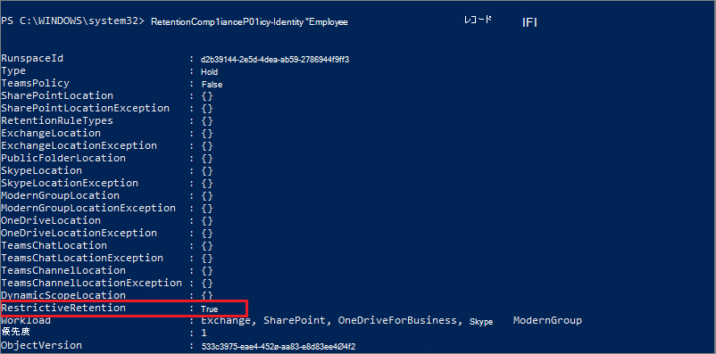

# <a name="use-preservation-lock-to-restrict-changes-to-retention-policies-and-retention-label-policies"></a>保管ロックを使用して、アイテム保持ポリシーと保持ラベル ポリシーへの変更を制限する

>*[セキュリティとコンプライアンスのための Microsoft 365 ライセンス ガイダンス](/office365/servicedescriptions/microsoft-365-service-descriptions/microsoft-365-tenantlevel-services-licensing-guidance/microsoft-365-security-compliance-licensing-guidance)。*

> [!IMPORTANT]
> 現在、[ アダプティブ ポリシー スコープ](retention.md#adaptive-or-static-policy-scopes-for-retention) で保持ロックはサポートされていません。

保管ロックは、アイテム保持ポリシーまたは保持ラベル ポリシーをロックして、グローバル管理者を含む誰もがポリシーをオフにしたり、ポリシーを削除したり、制限を緩和したりできないようにします。 この構成は、規制要件のために必要になる場合があります。また、不正な管理者からの保護に役立ちます。

保持ポリシーがロックされている場合:

- ポリシーを無効にしたり削除したりすることはできません
- 場所は追加できますが、削除できません
- 保持期間を延長することはできますが、短縮することはできません

保持ラベル ポリシーがロックされている場合:

- ポリシーを無効にしたり削除したりすることはできません
- 場所は追加できますが、削除できません
- ラベルは追加できますが、削除できません

つまり、ロックされたアイテム保持ポリシーを増やしたり延長したりすることは可能ですが、減らしたり、オフにしたりすることはできません。

> [!IMPORTANT]
> アイテム保持ポリシーまたは保持ラベル ポリシーをロックする前に、その影響を理解し、それが組織に必要であるかどうかを確認することが非常に重要です。 たとえば、規制要件を満たす必要がある場合があります。 保管ロックを適用すると、管理者はこれらのポリシーを無効にすることも削除することもできなくなります。

[発行](create-apply-retention-labels.md)または[自動適用](apply-retention-labels-automatically.md)する[アイテム保持ポリシー](create-retention-policies.md)、または保持ラベル ポリシーを作成した後、保管ロックを構成します。

> [!NOTE]
> ラベル ポリシーをロックしても、管理者はロックされたポリシーに含まれているラベルの保持期間を短縮できます。 アイテムを[規制レコード](records-management.md#records)としてマークするようにラベルを構成するときに、この要件を他の制限とともに満たすことができます。

## <a name="how-to-lock-a-retention-policy-or-retention-label-policy"></a>アイテム保持ポリシーまたは保持ラベル ポリシーをロックする方法

保管ロックを使用する必要がある場合は、PowerShell を使用する必要があります。 管理者は、保管ロックが適用された後に保持に関するポリシーを無効にしたり、削除したりすることができないため、この機能の有効化は、偶発的な構成を予防するものとして UI で使用することはできません。

すべての保持に関するポリシーおよびそのいかなる構成も、保管ロックをサポートします。

1. [セキュリティ/コンプライアンス センター PowerShell に接続します](/powershell/exchange/connect-to-scc-powershell)。

2. [Get-RetentionCompliancePolicy](/powershell/module/exchange/get-retentioncompliancepolicy) を実行してロックするポリシーの名前を検索します。例えば:
    
   

3. ポリシーに保管ロックを設定するには、ポリシーの名前を指定して [Set-RetentionCompliancePolicy](/powershell/module/exchange/set-retentioncompliancepolicy) コマンドレットを実行し、*RestrictiveRetention* パラメーターを true に設定します。
    
    ```powershell
    Set-RetentionCompliancePolicy -Identity "<Name of Policy>" –RestrictiveRetention $true
    ```
    
    例:
    
    
    
     メッセージが表示されたら、この構成に含まれる制限事項を読んで確認し、**Y** を選びます。
    
   

アイテム保持ポリシーに保管ロックが設定されました。 確認するには、`Get-RetentionCompliancePolicy` をもう一度実行しますが、ポリシーの名前を指定してポリシー パラメーターを表示します。

```powershell
Get-RetentionCompliancePolicy -Identity "<Name of Policy>" |Fl
```

**RestrictiveRetention** が **True** に設定されていることを確認する必要があります。



## <a name="see-also"></a>関連項目

[情報ガバナンスおよびレコード管理の規制要件を満たすために役立つリソース](retention-regulatory-requirements.md)