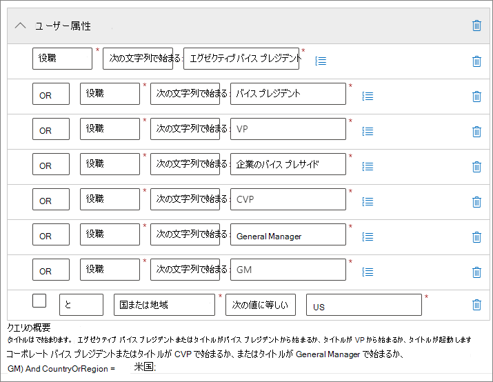
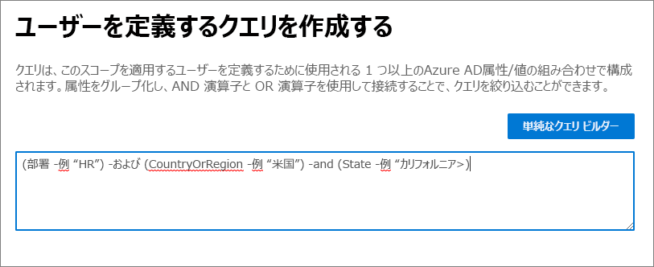

# <a name="common-settings-for-retention-policies-and-retention-label-policies"></a>保持ポリシーと保持ラベルの制限

>*[セキュリティとコンプライアンスのための Microsoft 365 ライセンス ガイダンス](https://aka.ms/ComplianceSD)。*

保持の設定の多くは、保持ポリシーと保持ラベル ポリシーの両方に共通です。 これらの設定を構成して、コンテンツを事前に保持したり、コンテンツを削除したり、コンテンツを保持して削除したりするには、次の情報を使用します。

保持のためにこれらのポリシーをサポートするシナリオについては、以下を参照してください。

- [保持ポリシーと作成と構成](create-retention-policies.md)。
- [アイテム保持ラベルを作成してアプリに適用する](create-apply-retention-labels.md)
- [保持ラベルをコンテンツに自動的に適用する](apply-retention-labels-automatically.md)

各シナリオに固有の設定については、それぞれのドキュメントで説明します。

保持ポリシーと Microsoft 365 内のデータ保持の仕組みに関する概要情報については、「アイテム[保持ポリシーおよび保持ラベルの詳細](retention.md)」をご覧ください。

## <a name="scopes---adaptive-and-static"></a>スコープ - アダプティブおよび静的

アダプティブ スコープと静的スコープをよくご存じではない場合や、保持用のポリシーを構成するときに使用するスコープを選択する場合は、「[保持のアダプティブ ポリシーまたは静的ポリシーのスコープ](retention.md#adaptive-or-static-policy-scopes-for-retention)」を参照してください。 

アダプティブ スコープと静的スコープのどちらを使用するかを決定したら、次の情報を使用して構成します:
- [アダプティブ スコープの構成情報](#configuration-information-for-adaptive-scopes)
- [静的スコープの構成情報](#configuration-information-for-static-scopes)

> [!TIP]
> 静的スコープを使用するポリシーがあり、それらをアダプティブ スコープに変換する場合は、既存のポリシーをそのままにして、同じ保持設定でアダプティブ スコープを使用する新しいポリシーを作成します。 静的スコープを使用して古いポリシーを無効または削除する前に、これらの新しいポリシーが正しいユーザー、サイト、およびグループを対象としていることを確認します。

### <a name="configuration-information-for-adaptive-scopes"></a>アダプティブ スコープの構成情報

> [!NOTE]
> 新しい機能としてのアダプティブ スコープは現在プレビュー段階であり、変更される可能性があります。 代替オプションは静的スコープであり、アダプティブ スコープが導入される前と同じ動作を提供し、アダプティブ スコープがビジネス要件を満たしていない場合に使用できます。

アダプティブ スコープを使用することを選択すると、必要なアダプティブ スコープの種類を選択するように求められます。 アダプティブ スコープには 3 つの異なる種類があり、それぞれが異なる属性またはプロパティをサポートしています。

| アダプティブ スコープの種類 | サポートされている属性またはプロパティは次の通りです |
|:-----|:-----|
|**Users** - 適用対象:  <br/> Exchange メール <br/> OneDrive: アカウント <br/> Teams のチャット <br/> Teams の非公開チャネル メッセージ <br/> Yammer ユーザーのメッセージ| 名 <br/> 姓 <br/>表示名 <br/> 役職 <br/> 部署 <br/> 事業所 <br/>番地 <br/> 都市 <br/>都道府県 <br/>郵便番号 <br/> 国または地域 <br/> 電子メール アドレス <br/> Alias <br/> Exchange カスタム属性: CustomAttribute1 - CustomAttribute15|
|**SharePoint sites** - 適用対象:  <br/> - SharePoint サイト <br/> - OneDrive アカウント |サイトの URL <br/>サイト名 <br/> SharePoint カスタム プロパティ: RefinableString00 - RefinableString99 |
|**Microsoft 365 Groups** - 適用対象:  <br/> - Microsoft 365 グループ <br/> - Teams チャネルのメッセージ <br/> - Yammer コミュニティのメッセージ |名前 <br/> 表示名 <br/> 説明 <br/> 電子メール アドレス <br/> Alias <br/> Exchange カスタム属性: CustomAttribute1 - CustomAttribute15 |

サイトのプロパティ名は SharePoint サイトのマネージド プロパティに基づいており、ユーザーとグループの属性名は、Azure AD 属性にマップされる[フィルター可能な受信者プロパティ](/powershell/exchange/recipientfilter-properties#filterable-recipient-properties)に基づいています。 例:

- **Alias** は LDAP 名 **mailNickname** にマップされ、Azure AD 管理センターで **Email** と表示されます。
- **Email アドレス** は LDAP 名 **proxyAddresses** にマップされ、Azure AD 管理センターで **Proxy アドレス** として表示されます。

表にリストされている属性とプロパティは、単純なクエリ ビルダーを使用してアダプティブ スコープを構成するときに簡単に指定できます。 次のセクションで説明するように、追加の属性とプロパティは高度なクエリ ビルダーでサポートされています。

> [!TIP]
> 高度なクエリ ビルダーの使用に関する追加情報については、次のウェビナーを参照してください: [アダプティブ ポリシー スコープを使用したユーザーおよびグループの高度なクエリの構築](https://mipc.eventbuilder.com/event/52683/occurrence/49452/recording?rauth=853.3181650.1f2b6e8b4a05b4441f19b890dfeadcec24c4325e90ac492b7a58eb3045c546ea)

保持のための単一のポリシーには、1 つまたは複数のアダプティブ スコープを含めることができます。

#### <a name="to-configure-an-adaptive-scope"></a>アダプティブ スコープを構成するには

アダプティブ スコープを構成する前に、前のセクションを使用して、作成するスコープの種類と使用する属性と値を特定します。 他の管理者と協力してこの情報を確認し、SharePoint サイトの場合は、プロパティのインデックスが作成されていることを確認する必要がある場合があります。

1. [Microsoft 365 コンプライアンス センター](https://compliance.microsoft.com/)で、次のいずれかの場所に移動します。
    
    - レコード管理を使用している場合:
        - **[ソリューション]** > **「レコード管理]** > **[アダプティブ スコープ]** タブ > + **「スコープの作成]**
        
    - レコード管理を使用していない場合:
       - **[ソリューション]** > **[情報ガバナンス]** > **[アダプティブ スコープ]** タブ > + **「スコープの作成]**
    
    ナビゲーション ウィンドウにすぐに解決方法が表示されない場合 最初に [**すべて表示**] を選択します。 

2. 構成のプロンプトに従って、最初にスコープの種類を選択し、動的メンバーシップの構築に使用する属性またはプロパティを選択し、属性またはプロパティの値を入力します。
    
    たとえば、ヨーロッパのユーザーを識別するために使用するアダプティブ スコープを構成するには、まずスコープの種類として **Users** を選択します。 次に、**Country または region** 属性を選択し、**Europe** を入力します:
    
    
    
    1 日に 1 回、このクエリはAzure AD に対して実行され、アカウントで **Country または region** 属性が **Europe** に指定されたすべてのユーザーを識別します。
    
    > [!IMPORTANT]
    > クエリはすぐには実行されないため、値を正しく入力したかどうかの検証はできません。
    
    **[属性の追加]** (ユーザーとグループの場合) または **[プロパティの追加]** (サイトの場合) を選択して、スコープの種類でサポートされている属性またはプロパティの任意の組み合わせを使用し、論理演算子と共にクエリを構築します。 サポートされている演算子は、**EQUAL**、**NOT EQUAL****START WITH** および **NOT STRT WITH** で、選択した属性またはプロパティをグループ化できます。 例:
    
    
    
    または、**[高度なクエリ ビルダー]** を選択して、独自のクエリを指定することもできます。
    
    - **User** および **Microsoft 365 Group** スコープの場合は、[OPATH フィルタリング構文](/powershell/exchange/recipient-filters)を使用します。 たとえば、部署、国、州ごとにメンバーシップを定義するユーザー スコープを作成するには、次のようにします:
    
        
    
    - **SharePoint sites** スコープの場合は、キーワード クエリ言語 (KQL) を使用します。 KQL を使用してインデックス付きサイト プロパティを使用して SharePoint を検索する方法はすでにご存じかも知れません。 これらの KQL クエリを指定するには「[Keyword Query Language (KQL) 構文リファレンス](/sharepoint/dev/general-development/keyword-query-language-kql-syntax-reference)」を参照してください。
    
    高度なクエリ ビルダーを使用する利点の 1 つは、クエリ演算子の選択肢が広いということです。
    - **and**
    - **or**
    - **not**
    - **eq** (等しい)
    - **ne** (等しくない)
    - **lt** (より小さい)
    - **gt** (より大きい)
    - **like** (文字列比較
    - **notlike** (文字列比較
    
    スコープ構成とは別に、[これらの高度なクエリを検証](#validating-advanced-queries)できます。
    
    > [!TIP]
    > 非アクティブなメールボックスを除外する場合は、高度なクエリ ビルダーを使用する必要があります。 または逆に、非アクティブなメールボックスのみをターゲットにします。 この構成では、OPATH プロパティ *IsInactiveMailbox* を使用します。
    > 
    > - 非アクティブなメールボックスを除外するには、クエリに次のものが含まれていることを確認してください: `(IsInactiveMailbox -eq "False")`
    > - 非アクティブなメールボックスのみをターゲットにするには、次のように指定します: `(IsInactiveMailbox -eq "True")`

3. 必要な数だけアダプティブ スコープを作成します。 保持用のポリシーを作成するときに、1 つ以上のアダプティブ スコープを選択できます。

> [!NOTE]
> クエリが完全に設定されるまでに最大 5 日かかる場合があり、変更はすぐには行われません。 新たに作成されたスコープを保持ポリシーに追加する前に数日待機することで、この延期期間を考慮します。

アダプティブ スコープの現在のメンバーシップとメンバーシップの変更を確認するには:

1. **アダプティブ スコープ** ページでスコープをダブルクリックします (または選択して Enter キーを押します)。

2. ポップアップ **[詳細]** ウィンドウで、**[スコープの詳細]** を選択します。 
    
    現在スコープ内にあるすべてのユーザー、サイト、またはグループが自動的に追加または削除された場合、そのメンバーシップの日付と時刻を識別する情報を確認します。

> [!TIP]
> [ポリシー検索](retention.md#policy-lookup) オプションを使用すると、特定のユーザー、サイト、および Microsoft 365 グループに現在割り当てられているポリシーを識別できます。

#### <a name="validating-advanced-queries"></a>高度なクエリの検証

PowerShell と SharePoint 検索を使用して、高度なクエリを手動で検証できます:
- スコープの種類 **Users** と **Microsoft 365 Groups** には PowerShell を使います
- スコープの種類 **SharePoint sites** には SharePoint 検索を使います

PowerShell を使用してクエリを実行するには:

1. [適切な Exchange Online 管理者権限](/powershell/exchange/find-exchange-cmdlet-permissions#use-powershell-to-find-the-permissions-required-to-run-a-cmdlet)を持つアカウントを使用して [Exchange Online PowerShell に接続します](/powershell/exchange/connect-to-exchange-online-powershell)。

2. [Get-Recipient](/powershell/module/exchange/get-recipient) または [Get-Mailbox](/powershell/module/exchange/get-mailbox) のいずれかを *-Filter* パラメーターと一緒に使用し、中括弧 (`{`,`}`) で囲まれたアダプティブ スコープの [OPATH クエリ](/powershell/exchange/filter-properties)を使用します。 属性値にスペースが含まれている場合は、属性値を二重引用符または単一引用符で囲みます。 

    **ユーザー** スコープを検証する場合は、コマンドに `-RecipientTypeDetails UserMailbox` を含めます。**Microsoft 365 グループ** スコープの場合は、`-RecipientTypeDetails GroupMailbox` を含めます。

    > [!TIP]
    > クエリ サポートで使用する [OPATH プロパティ](/powershell/exchange/filter-properties)を選択したコマンドレットに応じて、`Get-Mailbox` または `Get-Recipient` のどちらを使用して検証するかを決定できます。

    たとえば、**ユーザー** スコープを検証するには、次を使用できます。
    
    ````PowerShell
    Get-Recipient -RecipientTypeDetails UserMailbox -Filter {Department -eq "Sales and Marketing"} -ResultSize Unlimited
    ````
    
    **Microsoft 365 グループ** スコープを検証するには、次を使用できます。
    
    ```PowerShell
    Get-Mailbox -RecipientTypeDetails GroupMailbox -Filter {CustomAttribute15 -eq "Sales and Marketing"} -ResultSize Unlimited
    ```

3. 出力が、アダプティブ スコープの予想されるユーザーまたはグループと一致することを確認します。 そうでない場合は、Azure AD または Exchange の関連する管理者にクエリと値を確認します。
 
SharePoint 検索を使用してクエリを実行するには:

1. グローバル管理者アカウントまたは SharePoint 管理者ロールを持つアカウントを使用して、`https://<your_tenant>.sharepoint.com/search` に移動します。

2. 検索バーを使用して KQL クエリを指定します。

3. 検索結果が、アダプティブ スコープの想定されるサイト URL と一致することを確認します。 一致しない場合は、SharePoint の管理者にクエリと URL を確認します。

### <a name="configuration-information-for-static-scopes"></a>静的スコープの構成情報

静的スコープを使用する場合は、選択した場所 (場所全体) のすべてのインスタンスにポリシーを適用するか、特定のインスタンスを含めるか除外するか (特定の包含または除外) を決定する必要があります。

#### <a name="a-policy-that-applies-to-entire-locations"></a>場所全体に適用されるポリシー

Skype for Business を除き、既定では、選択した場所のすべてのインスタンスがポリシーに自動的に含まれます。インスタンスの包含を指定する必要はありません。

たとえば、**Exchange email** の場所 **すべての受信者**。 この既定の設定では、既存のすべてのユーザー メールボックスがポリシーに含まれ、ポリシーの適用後に作成された新しいメールボックスは自動的にポリシーを継承します。

#### <a name="a-policy-with-specific-inclusions-or-exclusions"></a>特定の追加または除外を含むポリシー

省略可能な構成を使用して、特定のユーザー、特定の Microsoft 365 グループ、特定のサイトに保持設定を適用する場合にのみ、ポリシーごとに注意すべき制限事項があることに注意してください。詳細については、「[アイテム保持ポリシーと保持ラベルポリシーの制限](retention-limits.md)」を参照してください。 

省略可能な構成を使用して保持設定を適用するには、目的の場所の [**状態**] が [**オン**] であることを確認した上で、リンクを使用して特定のユーザー、Microsoft 365 グループ、またはサイトを含めたり除外したりします。

> [!WARNING]
> 含まれるインスタンスを構成してから最後のものを削除すると、その場所の構成は **All** に戻ります。  ポリシーを保存する前に、これが意図した構成であることをご確認ください。
>
> たとえば、データを削除するように設定されているアイテム保持ポリシーに含める SharePoint サイトを 1 つ指定していて、そのサイトを削除した場合、既定では、すべての SharePoint サイトがデータを完全に削除するアイテム保持ポリシーの対象となります。 Exchange 受信者、OneDrive アカウント、Teams チャット ユーザーなどに含むものにも同様に適用されます。
>
> このシナリオでは、その場所の **All** 設定をアイテム保持ポリシーの対象にしたくない場合、場所をオフに切り替えます。 あるいは、除外インスタンスをポリシーの適用から除外するように指定します。

## <a name="locations"></a>場所

保持ポリシー内の場所は、Exchange 電子メールや SharePoint サイトなどの保持設定をサポートする特定の Microsoft 365 サービスを識別します。 ポリシーにそれらを選択するときに知っておくべき構成の詳細と考えられる例外がある場所については、次のセクションを使用してください。

### <a name="configuration-information-for-exchange-email-and-exchange-public-folders"></a>Exchange メールと Exchange パブリック フォルダーの構成情報

**Exchange メール** の場所は、メールボックスのレベルで保持設定を適用することにより、ユーザーのメール、予定表、およびその他のメールボックス アイテムの保持をサポートします。共有メールボックスもサポートされています。

リソース メールボックス、連絡先、および Microsoft 365 グループ メールボックスは、Exchange メールではサポートされていません。 Microsoft 365 グループ メールボックスの場合は、代わりに **Microsoft 365 グループ** の場所を選択します。

ポリシーの構成によっては、[非アクティブなメールボックス](create-and-manage-inactive-mailboxes.md)が含まれる場合と含まれない場合があります。

- 既定の **すべての受信者** 構成を使用する場合、静的ポリシー スコープには非アクティブなメールボックスが含まれますが、[特定の包含または除外](#a-policy-with-specific-inclusions-or-exclusions)ではサポートされていません。 ただし、ポリシーの適用時にアクティブなメールボックスを持つ受信者を含めたり除外したりして、後でメールボックスが非アクティブになった場合、保持設定は引き続き適用または除外されます。

- アダプティブ ポリシー スコープには、既定で、スコープのクエリを満たすときに非アクティブなメールボックスが含まれます。 高度なクエリ ビルダーと OPATH プロパティ *IsInactiveMailbox* を使用して、それらを除外できます。
    
    ```console
    (IsInactiveMailbox -eq "False")
    ```

静的ポリシー スコープを使用し、含めるまたは除外する受信者を選択する場合、複数の受信者を 1 人ずつ選択するのではなく、効率的に選択する方法として、配布グループとメール対応のセキュリティ グループを選択できます。 このオプションを使用すると、バックグラウンドでは、これらのグループは構成時に自動的に展開され、グループ内のユーザーのメールボックスを選択します。 これらのグループのメンバーシップが後で変更されても、アダプティブ ポリシー スコープとは異なり、既存の保持ポリシーは自動的に更新されません。

Exchange の保持設定を構成するときに含めるメールボックスのアイテムと除外するアイテムの詳細については、「[保持と削除に含めるもの](retention-policies-exchange.md#whats-included-for-retention-and-deletion)」を参照してください。

**Exchange パブリック フォルダー** の場所は保持設定をすべてのパブリック フォルダーに適用し、フォルダーまたはメールボックス レベルでは適用できません。

#### <a name="exceptions-for-auto-apply-policies-configured-for-sensitive-information-types"></a>機密情報の種類に対して構成された自動適用ポリシーの例外

機密情報の種類を使用する自動適用ポリシーを構成し、**Exchange email** の場所を選択する場合:

- Microsoft 365 グループ メールボックスが含まれます。

- 特定のメールボックスを識別するようにアダプティブ スコープを構成した場合でも、すべてのメールボックスが自動的に含まれます。 静的ポリシー スコープを選択した場合、含める受信者または除外する受信者を指定することはできません。

### <a name="configuration-information-for-sharepoint-sites-and-onedrive-accounts"></a>SharePoint サイトと OneDrive アカウントの構成情報

**SharePoint sites** の場所を選択すると、保持ポリシーでは、SharePoint​​ コミュニケーション サイト、Microsoft 365 グループによって接続されていないチーム サイト、クラシック サイトのドキュメントを保持および削除することができます。 **アダプティブ ポリシー スコープ** を使用していない限り、Microsoft 365 グループによって接続されているチーム サイトは、このオプションでサポートされていないため、代わりにグループのメールボックス、サイト、ファイル内のコンテンツに適用されている [[Microsoft 365 グループ](#exceptions-for-adaptive-policy-scopes)] の場所を使用します。

SharePoint と OneDrive の保持設定を構成するときに含めるものと除外するものの詳細については、「[保持と削除に含めるもの](retention-policies-sharepoint.md#whats-included-for-retention-and-deletion)」を参照してください。 

SharePoint サイトまたは OneDrive アカウントの場所を指定する場合、サイトにアクセスするためのアクセス許可は必要ありません。 静的スコープの場合、**[場所の編集]** ページで URL を指定した時点では、検証は行われません。 ただし、指定した SharePoint サイトは、構成の最後に存在していることが確認されます。 この確認が失敗した場合は、入力した URL の検証が失敗したことを示すメッセージが表示され、検証が成功するまで、保持ポリシーは作成できません。 このメッセージが表示されたら、構成手順に戻って URL を変更するか、保持ポリシーからサイトを削除します。

個々の OneDrive アカウントを指定するには、「[組織内のすべてのユーザーの OneDrive の URL 一覧を取得する](/onedrive/list-onedrive-urls)」を参照してください。

> [!NOTE]
> 個々の OneDrive アカウントを指定する場合、OneDrive アカウントが[事前にプロビジョ二ング](/onedrive/pre-provision-accounts)されていない限り、ユーザーが初めて OneDrive にアクセスするまで URL は作成されないことに注意してください。
> 
> また、ユーザーのUPNが変更されると、OneDrive の URL が[自動的に変更](/onedrive/upn-changes)されます。  たとえば、結婚などの名前が変わるイベント。 または、組織の名前変更やビジネス再構築をサポートするためのドメイン名の変更。 UPN が変更された場合は、保持設定に指定した OneDrive URL を更新する必要があります。
> 
> 静的スコープに含める、または除外する個々のユーザーの URL を確実に指定する必要があるため、[アダプティブ スコープ](retention.md#adaptive-or-static-policy-scopes-for-retention) で **User** スコープの種類を指定するほうがこの目的には適しています。

#### <a name="exceptions-for-adaptive-policy-scopes"></a>アダプティブ ポリシー スコープの例外

アダプティブ ポリシー スコープを使用する保持用のポリシーを構成し、**SharePoint サイト** の場所を選択する場合:

- SharePoint 通信サイト、Microsoft 365 グループによって接続されていないチーム サイト、およびクラシック サイトに加えて、OneDrive サイトとMicrosoft 365 グループに接続されているサイトが含まれています。

### <a name="configuration-information-for-microsoft-365-groups"></a>Microsoft 365 グループの構成情報

Microsoft 365 グループ (以前の Office 365 グループ) のコンテンツを保持または削除するには、**Microsoft 365 グループ** の場所を使用する必要があります。 この場所には、グループ メールボックスと SharePoint チーム サイトが含まれます。

> [!NOTE]
> Microsoft 365 グループには Exchange メールボックスがありますが、**Exchange メール** の場所が含まれるアイテム保持ポリシーには、Microsoft 365 グループのメールボックスのコンテンツは含まれません。 

静的スコープを使う場合: 最初は **Exchange メール** の場所でグループ メールボックスを含めるか除外するかを指定できますが、保持ポリシーを保存しようとすると、Exchange の場所では "RemoteGroupMailbox" を選択できないというエラーが表示されます。

既定では、Microsoft 365 グループに適用される保持ポリシーには、グループのメールボックスと SharePoint チーム サイトが含まれます。 SharePoint の Teams サイトに保存されたファイルは、場所でカバーされていますが、独自の保持ポリシーの場所を持つ Teams のチャットや Teams のチャネルはカバーされません。

保持ポリシーを Microsoft 365 メールボックスのみ、または接続された SharePoint チーム サイトのみに適用するために既定を変更するには、次のいずれかの値を指定した *Applications* パラメーターを指定して [Set-RetentionCompliancePolicy](/powershell/module/exchange/set-retentioncompliancepolicy) PowerShell コマンドレットを使用します。

- グループに接続されている Microsoft 365 メールボックスのみの場合は `Group:Exchange`。
- グループに接続されている SharePoint サイトのみの場合は `Group:SharePoint`。

選択した Microsoft 365 グループのメールボックスと SharePoint サイトの両方の既定値に戻すには、`Group:Exchange,SharePoint`を指定します。

#### <a name="exceptions-for-auto-apply-policies-configured-for-sensitive-information-types"></a>機密情報の種類に対して構成された自動適用ポリシーの例外

機密情報の種類を使用する自動適用ポリシーを構成し、**Microsoft 365 グループ** の場所を選択する場合:

- Microsoft 365 グループ メールボックスは含まれません。 これらのメールボックスをポリシーに含めるには、代わりに **Exchange メール** の場所を選択します。

#### <a name="what-happens-if-a-microsoft-365-group-is-deleted-after-a-policy-is-applied"></a>ポリシーの適用後に Microsoft 365 グループが削除された場合の動作

保持ポリシーを Microsoft 365 グループに適用した後、そのグループは Azure ActiveDirectory から削除されます。

- グループに接続された SharePoint サイトは保持され、**Microsoft 365 グループ** の場所のアイテム保持ポリシーによって引き続き管理されます。 グループが削除される前にサイトにアクセスしていたユーザーは引き続きサイトにアクセスでき、新しいアクセス許可は SharePoint を介して管理する必要があります。
    
    この時点では、削除されたグループを指定できないため、Microsoft 365 グループの場所からサイトを除外することはできません。 このサイトからアイテム保持ポリシーを解除する必要がある場合は、Microsoft サポートに連絡してください。 たとえば、[Microsoft 365 管理センターへの問い合わせ](https://admin.microsoft.com/Adminportal/Home#/support)を行います。

- 削除されたグループのメールボックスは非アクティブになり、SharePoint サイトと同様に、保持設定の対象となります。 詳細については、「[Exchange Online の非アクティブなメールボックス](inactive-mailboxes-in-office-365.md)」を参照してください。

### <a name="configuration-information-for-skype-for-business"></a>Skype for Business の構成情報

> [!NOTE]
> Skype for Business は [2021 年 7 月 31 日に廃止](https://techcommunity.microsoft.com/t5/microsoft-teams-blog/skype-for-business-online-to-be-retired-in-2021/ba-p/777833)されました。Microsoft Teams への移行をお勧めします。 ただし、既存の顧客Skype for Business保持ポリシーは引き続きサポートされます。

Exchange メールとは異なり Skype の場所の状態をオンに切り替えて自動的にすべてのユーザーを含めることはできませんが、そのロケーションをオンにしてから、会話を保持するユーザーを手動で選択する必要があります。


この **[編集]** オプションを選択した後、**[Skype for Business]** ウィンドウで、**[名前]** 列の前にある非表示のボックスを選択することで、すべてのユーザーをすばやく含めることができます。 ただし、各ユーザーはポリシーの特定のインクルージョンとしてカウントされることを理解することが重要です。 したがって、このボックスを選択して 1,000 人のユーザーを含める場合、含める 1,000 人のユーザーを手動で選択した場合と同じです。これは、Skype for Business でサポートされる最大数です。

**[会話履歴]** (Outlook のフォルダー) は、Skype のアーカイブとは関係のない機能です。**[会話履歴]** はエンド ユーザーが無効にできますが、Skype のアーカイブの場合はユーザーにはアクセスできない (電子情報開示には使用できる) 非表示フォルダーに Skype の会話のコピーが保存されます。

## <a name="settings-for-retaining-and-deleting-content"></a>コンテンツを保持および削除するための設定

保持ポリシーでコンテンツを保持および削除するための設定を選択すると、保持ポリシーは、指定された期間、次のいずれかの構成になります。

- 保持のみ

    この構成では、[**特定の期間アイテムを保持する**] と [**保持期間の終了時: 何もしない**] を選択します。または、[**アイテムを永久に保持する**] を選択します。

- 保持してから削除

    この構成では、[**特定の期間アイテムを保持する**] と [**保持期間の終了時: アイテムを自動的に削除する**] を選択します。

- 削除のみ

    この構成では、[**アイテムが特定の年齢に達したときにのみアイテムを削除する**] を選択します。

### <a name="retaining-content-for-a-specific-period-of-time"></a>コンテンツを特定の期間保持する

コンテンツを保持する保持ラベルまたはポリシーを構成する場合は、アイテムを特定の日数、月数、年数の間保持することを選択します。 または、アイテムを永久に保持します。 保持期間は、ポリシーが割り当てられた時点からではなく、指定した保持期間の開始に従って計算されます。

保持期間の開始については、コンテンツがいつ作成されたか、またはコンテンツが最後に変更されたときの SharePoint、OneDrive、Microsoft 365 グループのファイルのみサポートされるかを選択できます。 保持ラベルについては、コンテンツにラベルが付けられたときとイベントが発生したときから保持期間を開始できます。

例:

- SharePoint: サイト コレクションのコンテンツを最後に変更してから 7 年間このアイテムを保持する場合に、そのサイト コレクションのドキュメントが 6 年変更されていないと、そのドキュメントが変更されなければあと 1 年間しか保持されません。そのドキュメントがもう一度編集された場合、ドキュメントの古さは最後に変更された日付から計算され、その後 7 年間保留にされます。

- Exchange: メールボックスのアイテムを 7 年間保持する場合、あるメッセージが 6 年前に送信されているときは、あと 1 年間のみ保持されます。Exchange アイテムの場合、経過時間は受信メールの受信日または送信メールの送信日に基づいています。最終更新日に基づいてアイテムを保持するポリシーは、OneDrive および SharePoint のコンテンツ サイトにのみ適用されます。

保持期間の終了時にコンテンツを完全に削除するかどうかを選択します。

![[アイテム保持設定] ページ。](../media/b05f84e5-fc71-4717-8f7b-d06a29dc4f29.png)

### <a name="deleting-content-thats-older-than-a-specific-age"></a>特定の経過時間を超えた古いコンテンツを削除する

保持ポリシーは、アイテムを保持してから削除することも、古いアイテムを保持せずに削除することもできます。

どちらの場合も、ポリシーによってアイテムを削除する場合、指定した期間は、ポリシーが割り当てられた時点からではなく、指定した保持期間の開始に従って計算されることを理解しておくことが重要です。 たとえば、アイテムが作成、変更、ラベル付けされた時点からです。

このため、まず、既存のコンテンツの古さと、ポリシーがそのコンテンツに与える影響を考慮してください。また、新しいポリシーを割り当てる前にユーザーに伝えて、考えられる影響を評価する時間を与える必要がある場合もあります。

### <a name="a-policy-that-applies-to-entire-locations"></a>場所全体に適用されるポリシー

場所を選択すると、Skype for Business を除き、場所の状態が [**オン**] の場合の既定の設定は [**すべて**] になります。

アイテム保持ポリシーが場所全体の任意の組み合わせに適用される場合、ポリシーに含めることができる受信者、サイト、アカウント、グループなどの数に制限はありません。

たとえば、ポリシーにすべての Exchange メールとすべての SharePoint サイトが含まれている場合、数に関係なくすべてのサイトと受信者が含められます。また、Exchange の場合、ポリシーの適用後に作成された新しいメールボックスには、そのポリシーが自動的に継承されます。

### <a name="a-policy-with-specific-inclusions-or-exclusions"></a>特定の追加または除外を含むポリシー

省略可能な構成を使用して、特定のユーザー、特定の Microsoft 365 グループ、特定のサイトに保持設定を適用する場合にのみ、ポリシーごとに注意すべき制限事項があることに注意してください。詳細については、「[アイテム保持ポリシーと保持ラベルポリシーの制限](retention-limits.md)」を参照してください。 

省略可能な構成を使用して保持設定を適用するには、目的の場所の [**状態**] が [**オン**] であることを確認した上で、リンクを使用して特定のユーザー、Microsoft 365 グループ、またはサイトを含めたり除外したりします。

> [!WARNING]
> 含まれる内容を構成してから最後のものを削除すると、その場所の構成は **All** に戻ります。  ポリシーを保存する前に、これが意図した構成であることをご確認ください。
>
> たとえば、データを削除するように設定されているアイテム保持ポリシーに含める SharePoint サイトを 1 つ指定していて、そのサイトを削除した場合、既定では、すべての SharePoint サイトがデータを完全に削除するアイテム保持ポリシーの対象となります。 Exchange 受信者、OneDrive アカウント、Teams チャット ユーザーなどに含まれる内容にも同様に適用されます。
>
> このシナリオでは、その場所の **All** 設定をアイテム保持ポリシーの対象にしたくない場合、場所をオフに切り替えます。 あるいは、ポリシーの適用から除外されるように指定することもできます。

## <a name="updating-policies-for-retention"></a>保持ポリシーの更新

保持ポリシーを作成して保存した後には変更できない設定があり、それらは以下のものを含みます:
- 保持ポリシー名と保持期間を除く保持設定、および保持期間を開始するタイミング。

アイテム保持ポリシーを編集し、アイテムが既にアイテム保持ポリシーの元の設定の対象となっている場合、更新された設定は、新しく特定されたアイテムに加えて、このアイテムに自動的に適用されます。

通常、この更新はかなり迅速ですが、数日かかる場合があります。 Microsoft 365 の場所間でのポリシーの複製が完了すると、Microsoft 365 コンプライアンス センターの保持ポリシーの状態が [**On (保留中)**] から [**オン (成功)**] に変わります。

## <a name="locking-the-policy-to-prevent-changes"></a>変更を防止するためにポリシーをロックする

ポリシーをオフにしたり、ポリシーを削除したり、制限を緩和したりすることができないようにする必要がある場合は、「[保管ロックを使用して、アイテム保持ポリシーと保持ラベル ポリシーへの変更を制限する](retention-preservation-lock.md)」を参照してください。
