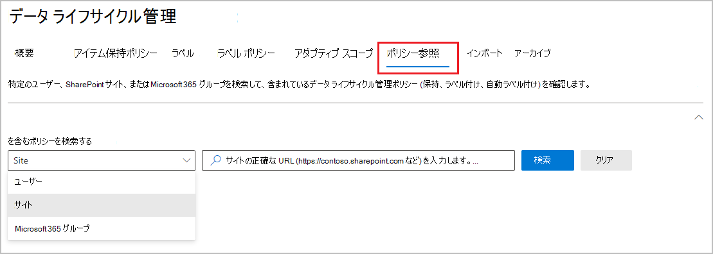

# アイテム保持ポリシーと保持ラベルの詳細

>*[セキュリティとコンプライアンスのための Microsoft 365 ライセンス ガイダンス](/office365/servicedescriptions/microsoft-365-service-descriptions/microsoft-365-tenantlevel-services-licensing-guidance/microsoft-365-security-compliance-licensing-guidance)。*

> [!NOTE]
> Teams でアイテム保持ポリシーに関するメッセージが表示される場合、あるいはアプリ内の保持ラベルについて質問がある場合は、IT 部門に連絡して、ポリシーがどのように構成されているかを確認します。その際、次の記事も参考にしてください。
>
> - [Teams のアイテム保持ポリシーに関するメッセージ](https://support.microsoft.com/office/teams-messages-about-retention-policies-c151fa2f-1558-4cf9-8e51-854e925b483b)
> - [SharePoint または OneDrive のファイルに保持ラベルをつける](https://support.microsoft.com/office/apply-retention-labels-to-files-in-sharepoint-or-onedrive-11a6835b-ec9f-40db-8aca-6f5ef18132df)
>
> このページの情報は、コンプライアンス上の理由からアイテム保持ポリシーと保持ラベルを作成できる IT 管理者向けです。

ほとんどの組織では、電子メール、ドキュメント、インスタント メッセージなどのデータの量と複雑さが日々増しています。次の必要性から、これらの情報を効果的に管理することが重要です。

- **最小限の期間コンテンツを保持することを要求する業界の規制や内部ポリシーを積極的に遵守する**: たとえば、米国企業改革法により、特定の種類のコンテンツを 7 年間保持することが求められる場合があります。

- **訴訟やセキュリティ違反が発生した場合にリスクを軽減する**: このために、保持する必要がなくなった古いコンテンツは完全に削除します。

- **組織内での効率的な知識の共有と迅速な対応に役立てる**: このために、ユーザーは現時点で関連性のあるコンテンツのみを対象に作業するようにします。

保持設定を構成すると、これらの目標を達成できるようになります。 コンテンツの管理には、一般的に次の 2 つのアクションが必要です。

| アクション| 用途 |
|:-----|:-----|
|コンテンツを保持する | 完全に削除せず、電子情報開示で利用できるようにする |
|コンテンツを削除する | 組織からコンテンツを完全に削除する|

これら 2 つの保持アクションを使用して、次の結果が得られるように保持設定を構成できます。

- 保持のみ: コンテンツを無期限または指定した期間保持します。
- 削除のみ: 指定した期間の後にコンテンツを完全に削除します。
- 保持してから削除: コンテンツを指定した期間保持してから完全に削除します。

これらの保持設定は所定の場所にあるコンテンツに作用し、コンプライアンス上の理由でコンテンツを保持する必要がある場合でも、追加のストレージを作成して構成するための追加のオーバーヘッドを節約できます。 また、このデータをコピーして同期するために、カスタマイズしたプロセスを実装する必要もありません。

次のセクションを使用して、アイテム保持ポリシーとアイテム保持ラベルの機能、使用する時期、さらに相互補足する方法についての詳細情報を参照します。 ただし、一部の一般的なシナリオの保持設定を開始して展開する準備が出来ている場合は、「[データ ライフサイクル管理の使用を開始する](get-started-with-data-lifecycle-management.md)」を参照してください。

## 保持設定が所定の場所にあるコンテンツに作用するしくみ

コンテンツに保持設定が割り当てられるとき、そのコンテンツは元の場所にそのまま残ります。このため、ユーザーは何事もなかったかのように、ドキュメントやメールで作業を続けることができます。ただし、保持ポリシーに含まれているコンテンツをユーザーが編集または削除すると、そのコンテンツのコピーが自動的に保持されます。

- SharePoint および OneDrive サイトの場合: コピーは、**アイテム保管** ライブラリに保持されます。

- Exchange メールボックスの場合: コピーは、**[回復可能なアイテム]** フォルダーに保持されます。

- TeamsとYammerのメッセージ： **SubstrateHolds** という名前の隠しフォルダーに Exchange **回復可能アイテム** フォルダー内のサブフォルダーとして保存されます。

> [!NOTE]
> アイテム保管ライブラリはサイトのストレージ クォータに含まれているため、SharePoint および Microsoft 365 グループの保持設定を使用する場合は、ストレージを増やすことが必要な場合があります。
>
セキュリティで保護されているこれらの場所や保持されているコンテンツは、ほとんどのユーザーには表示されません。 ほとんどの場合、ユーザーは自分が作業しているコンテンツが保持設定の対象であることを知る必要さえありません。

保持設定がさまざまなワークロードに対してどのように機能するかの詳細については、次の記事を参照してください。

- [SharePoint と OneDrive の保持の詳細](retention-policies-sharepoint.md)
- [Microsoft Teams の保持の詳細](retention-policies-teams.md)
- [Yammerの保持の詳細](retention-policies-yammer.md)
- [Exchange の保持の詳細](retention-policies-exchange.md)

## アイテム保持ポリシーと保持ラベル

アイテム保持設定をコンテンツに割り当てるには、**アイテム保持ポリシー** と **保持ラベルをラベル ポリシーで** 使用します。 これらの方法のいずれかを使用するか、組み合わせることも可能です。

サイト レベルやメールボックス レベルで同一の保持設定を割り当てるには、アイテム保持ポリシーを使用します。一方、アイテム レベル (フォルダー、ドキュメント、メール) で保持設定を割り当てるには、保持ラベルを使用します。

たとえば、SharePoint サイト内のすべてのドキュメントを 5 年間保持する必要がある場合は、同じ保持ラベルをサイト内のすべてのドキュメントに適用するよりも、アイテム保持ポリシーを使用する方が効率的です。 一方、サイト内の一部のドキュメントは 5 年間保持し、一部は 10 年間保持する必要がある場合、アイテム保持ポリシーではこれを行うことができません。 アイテム レベルで保持設定を指定する必要がある場合は、保持ラベルを使用します。

アイテム保持ポリシーとは異なり、保持ラベルによる保持設定は、コンテンツが Microsoft 365 テナントの別の場所に移動された場合は、コンテンツとともに移動します。 また、保持ラベルには、アイテム保持ポリシーではサポートされていない次の機能があります。

- コンテンツの保持期間や最終更新日以外に、コンテンツにラベルが付けられた時点やイベントに基づいて保持期間を開始するオプション。

- [トレーニング可能な分類子](classifier-learn-about.md)を使用して、ラベル付けするコンテンツを識別する。

- SharePoint アイテムまたは Exchange メッセージに既定のラベルを適用します。

- 保持期間の終了時にサポートされるアクション:
  - コンテンツを完全に削除する前にコンテンツを確認する[処理確認](./disposition.md)。
  - 別の保持ラベルを自動的に適用する

- ラベル設定の一部として、コンテンツを [[レコード]](records-management.md#records) としてマークし、保持期間の終了時にコンテンツが削除されるときに[廃棄の証明](disposition.md#disposition-of-records)を常に取得する。

### アイテム保持ポリシー

アイテム保持ポリシーは、次の場所に適用できます。

- Exchange メール
- SharePoint サイト
- OneDrive アカウント
- Microsoft 365 グループ
- Skype for Business
- Exchange パブリック フォルダー
- チームのチャネル メッセージ
- Teams のチャット
- Teams の非公開チャネル メッセージ
- Yammer コミュニティのメッセージ
- Yammer ユーザーのメッセージ

> [!NOTE]
> Teams チャネル メッセージには、標準チャンネルだけでなく、[共有チャネル](/MicrosoftTeams/shared-channels) (現在プレビュー段階) が含まれるようになりました。

複数の場所にも特定の場所やユーザーにも、1 つのポリシーを非常に効率的に適用できます。

保持期間の開始時に、コンテンツがいつ作成されたか、またはファイルと、コンテンツが最後に変更された SharePoint、OneDrive、Microsoft 365 グループの場所でのみサポートされるかを選択することができます。

アイテムは、アイテム保持ポリシーで指定されたコンテナーからアイテム保持設定を継承します。 ポリシーがコンテンツを保持するように構成されているときに、それらがそのコンテナーの外部に移動された場合、そのアイテムのコピーがワークロードのセキュリティで保護された場所に保持されます。 ただし、保持設定は、新しい場所ではコンテンツとともに移動することはありません。 必要な場合は、アイテム保持ポリシーの代わりに保持ラベルを使用します。

### 保持ラベル

保持ラベルは、異なる保持設定を必要とするさまざまな種類のコンテンツに対して使用できます。例:

- 最低限の期間、保持する必要のある納税申告書。

- 特定の期間が経過した後、完全に削除する必要があるプレス資料。

- 特定の期間保持した後に完全に削除する必要がある競合企業のリサーチ。

- 編集も削除もできないように、レコードとしてマークする必要がある就労ビザ。

いずれの場合も、保持ラベルを使用すると、アイテム レベル (ドキュメントやメール) でガバナンス制御用の保持設定を適用できます。

保持ラベルを使用すると、次のことができます。

- Outlook、Outlook on the web、OneDrive、SharePoint、Microsoft 365 グループのコンテンツに、**組織内のユーザーが保持ラベルを手動で適用** できるようにします。多くの場合、コンテンツの種類を最も良く理解しているのはそれを扱っているユーザーです。そこでユーザーにコンテンツを分類し、適切なアイテム保持設定を適用してもらいます。

- コンテンツが特定の条件に一致する場合、メールまたは Teams で共有されているクラウド添付ファイルを含む場合、または次のものを含む場合は、**保持ラベルをそのコンテンツに自動的に適用** します。
  - 特定の種類の機密情報。
  - 作成したクエリに一致する特定のキーワード。
  - トレーニング可能な分類子のパターン マッチ。

- **コンテンツにラベルが付けられた時点から保持期間を開始する**。SharePoint サイトや OneDrive アカウントのドキュメント、およびメール アイテムに対してこの操作を行えます。

- 従業員の退職、契約の期限切れなど、**イベントの発生時に保持期間を開始する**。

- SharePoint の **ドキュメント ライブラリ、フォルダー、またはドキュメント セットに既定の保持ラベルを適用** することにより、この場所に保存するすべてのドキュメントに既定の保持ラベルが継承されるようになります。

- [レコード管理](records-management.md)戦略の一部として **アイテムをレコードとしてマーク** します。 このラベル付けされたコンテンツが Microsoft 365 に残っている場合は、規制上の理由により必要なコンテンツに追加の制限が適用されます。 詳細については、「[許可またはブロックするアクションの制限を比較する](records-management.md#compare-restrictions-for-what-actions-are-allowed-or-blocked)」を参照してください。

保持ラベルは、[秘密度ラベル](sensitivity-labels.md)とは異なり、コンテンツが Microsoft 365 以外の場所に移動した場合は保持されません。

#### アクションを適用しないでコンテンツを分類する

保持ラベルの主な目的はコンテンツを保持または削除することですが、保持やその他のアクションを有効にしないで保持ラベルを使用することもできます。 この場合、テキスト ラベルとしてのみ保持ラベルを使用し、他のアクションは適用しません。

たとえば、アクションを含まない "後で確認" という名前の保持ラベルを作成して適用し、後からそのコンテンツを見つけるためにそのラベルを使用できます。

#### DLP ポリシーで保持ラベルを条件として使用する

SharePoint のドキュメントの Microsoft Purview データ損失防止 (DLP) ポリシーの条件として、保持ラベルを指定することができます。 たとえば、指定された保持ラベルがドキュメントに適用されている場合はそのドキュメントが組織外に共有されないように、DLP ポリシーを構成できます。

詳細については、「[DLP ポリシーでの条件としての保持ラベルの使用](data-loss-prevention-policies.md#using-a-retention-label-as-a-condition-in-a-dlp-policy)」を参照してください。

#### 保持ラベルと保持ラベルを適用するポリシー

保持ラベルを発行すると、それらは **保持ラベル ポリシー** に含まれます。管理者とユーザーは、このポリシーをコンテンツに適用できます。次の図で説明します。

1. 1 つの保持ラベルを複数の保持ラベル ポリシーに含めることができます。

2. 保持ラベル ポリシーは保持ラベルを発行する場所を指定します。 同一の場所を複数の保持ラベル ポリシーに含めることができます。

また、1 つ以上の **自動適用ポリシー** を作成して、それぞれに保持ラベルを 1 つ指定することもできます。 このポリシーを使うと、ポリシーで指定した条件が満たされた場合に、保持ラベルが自動的に適用されます。

#### 保持ラベルのポリシーと場所

保持ラベルの内容に応じて、保持ラベルをさまざまな場所に発行できます。

| 保持ラベルの種類 | ラベル ポリシーの適用先 |
|:-----|:-----|
|管理者とエンド ユーザーに発行されたラベル  |Exchange、SharePoint、OneDrive、Microsoft 365 グループ  |
|機密情報の種類またはトレーニング可能な分類子に基づいて自動適用されたラベル  |Exchange、SharePoint、OneDrive  |
|キーワードまたはクエリに基づく自動適用  |Exchange、SharePoint、OneDrive、Microsoft 365 グループ  |
|クラウド添付ファイルに自動適用  |SharePoint、OneDrive、Microsoft 365 グループ  |

Exchange パブリックフォルダー、Skype、Teams、Yammer メッセージは保持ラベルをサポートしていません。 これらの場所のコンテンツを保持または削除するには、代わりにデータ保持ポリシーを使用します。

#### 一度に 1 つの保持ラベルのみ

メールやドキュメントに一度に適用できる保持ラベルは、1 つのみです。 保持ラベルは、エンド ユーザーや管理者が[手動](create-apply-retention-labels.md#manually-apply-retention-labels)で適用することも、次のいずれかの方法を使用して自動で適用することもできます。

- [自動適用ラベル ポリシー](apply-retention-labels-automatically.md)
- [SharePoint Syntex のドキュメント理解モデル](../contentunderstanding/apply-a-retention-label-to-a-model.md)
- [Outlook](create-apply-retention-labels.md#applying-a-default-retention-label-to-an-outlook-folder) または [SharePoint の既定のラベル](create-apply-retention-labels.md#applying-a-default-retention-label-to-all-content-in-a-sharepoint-library-folder-or-document-set)
- [Outlook のルール](create-apply-retention-labels.md#automatically-applying-a-retention-label-to-email-by-using-rules)

標準的な保持ラベルの場合 (アイテムを[レコードや規制レコード](records-management.md#records)としてマークしません)。

- 管理者とエンド ユーザーは、コンテンツに適用されている既存の保持ラベルを手動で変更または削除できます。

- コンテンツに既に保持ラベルが適用されている場合、既存のラベルが自動的に削除されたり、別の保持ラベルに置き換えられたりすることはありません。ただし、例外が 1 つあり、既存のラベルが既定のラベルとして適用されている場合です。 既定のラベルを使用する場合、別の既定のラベルに置き換えるか、自動的に削除できるシナリオがいくつかあります。

- コンテンツに既に保持ラベルが適用されている場合、既存のラベルは自動的に削除されたり、別の保持ラベルに置き換えられたりすることはありません。ただし、次の 2 つの例外が考えられます。

  - 既存のラベルは、保持期間の終了時に別の保持ラベルを自動的に適用するように構成されます。
  - 既存のラベルが既定のラベルとして適用されました。既定のラベルを使用する場合、別の既定のラベルに置き換えたり、自動的に削除したりできるシナリオがいくつかあります。

  既定のラベルを使用して適用した場合のラベルの動作については、以下を参照してください。

  - SharePoint の既定のラベル: [SharePoint の既定のラベルを使用した場合のラベルの動作](create-apply-retention-labels.md#label-behavior-when-you-use-a-default-label-for-sharepoint)
  - Outlook の既定のラベル: [Outlook フォルダーに既定の保持ラベルを適用する](create-apply-retention-labels.md#applying-a-default-retention-label-to-an-outlook-folder)

- 保持ラベルを適用できる自動適用ラベル ポリシーが複数あり、コンテンツが複数のポリシーの条件を満たしている場合、(作成日を基準にして) 最も古い自動適用ラベル ポリシーの保持ラベルが適用されます。

保持ラベルがアイテムをレコードまたは規制レコードとしてマークする場合、これらのラベルは、構成された保持期間中に自動的に変更されることはありません。 コンテナーの管理者のみが、アイテムをレコードとしてマークする保持ラベルを手動で変更または削除することができますが、規制レコードについてはできません。 詳細については、「[許可またはブロックされているアクションの制限を比較する](records-management.md#compare-restrictions-for-what-actions-are-allowed-or-blocked)」を参照してください。

#### 保持ラベルの監視

Microsoft Purview コンプライアンス ポータルから、[**データの分類**] と [**概要**] ページを選択して、テナントでの保持ラベルの使用方法を監視し、ラベル付けされたアイテムの場所を特定します。重要な前提条件を含む詳細については、「[データ分類に関する詳細](data-classification-overview.md)」を参照してください。

詳細については、[コンテンツ エクスプローラー](data-classification-content-explorer.md) と [アクティビティ エクスプローラー](data-classification-activity-explorer.md) を使用します。

> [!TIP]
>トレーニング可能な分類子や機密情報タイプなど、他のデータ分類インサイトのいくつかを使用することを検討して、レコードとして保持または削除する必要がある、またはレコードとして管理する必要があるコンテンツを特定できるようにします。

#### コンテンツ検索を使用した特定の保持ラベルを持つすべてのコンテンツの検索

保持ラベルがユーザーによって、または自動適用されてコンテンツに適用された後、コンテンツ検索を使用して、特定の保持ラベルが適用されているすべてのアイテムを検索できます。

コンテンツ検索を作成する場合は、[**保持ラベル** ] 条件を選択し、完全なラベル名またはラベル名の一部を入力し、ワイルドカードを使用します。詳細については、「[コンテンツ検索のキーワード クエリと検索条件](keyword-queries-and-search-conditions.md)」をご参照ください。

## アイテム保持ポリシーと保持ラベルの機能比較

次の表は、アイテム保持ポリシーと保持ラベルのどちらを使用するかを、機能に基づいて決定するのに役立ちます。

|機能|アイテム保持ポリシー |保持ラベル|
|:-----|:-----|:-----|:-----|
|保持してから削除、保持のみ、削除のみを指定できる保持設定 |はい |はい |
|サポートされるワークロード:  - Exchange  - SharePoint  - OneDrive  - Microsoft 365 グループ  - Skype for Business  - Teams - Yammer|  はい   はい   はい   はい   はい   はい   はい |   はい (パブリック フォルダーを除く)   はい   はい   はい   不要   不要   いいえ |
|保持の自動適用 | はい | はい |
|保持期間の終了時に異なる保持設定を自動的に適用する | いいえ | はい |
|条件に基づいて適用される保持   - 機密情報の種類、KQL クエリとキーワード、トレーニング可能な分類子、クラウド添付ファイル| いいえ | はい |
|保持の手動適用 | いいえ | はい |
|エンド ユーザーの操作 | いいえ | はい |
|コンテンツが移動された場合の保持 | いいえ | はい (Microsoft 365 テナント内で) |
|レコードとしてアイテムを宣言| 不要 | はい |
|ラベル作成時またはイベント発生時に保持期間を開始 | 不要 | はい |
|処理確認 | いいえ| はい |
|廃棄の証明 (最大 7 年間) | いいえ |はい、処分レビューを使用するか、アイテムがレコードとしてマークされている場合|
|管理者アクティビティを監査する| はい | はい|
|保持アクションの監査| いいえ | はい \* |
|保持対象のアイテムの特定   - コンテンツ検索   - データ分類ページ、コンテンツ エクスプローラー、アクティビティ エクスプローラー |   不要   不要 |   はい   はい|

**脚注:**

\*コンテンツをレコードまたは規制レコードとしてマークしない保持ラベルの場合、監査イベントは、SharePoint または OneDrive のアイテムにラベルが適用、変更、または削除された場合に制限されます。保持ラベルの監査の詳細については、このページの「[保持アクションの監査](#auditing-retention-actions)」セクションを参照してください。

### アイテム保持ポリシーと保持ラベルの組み合わせ

アイテム保持ポリシーのみ使用するか、保持ラベルのみ使用するかどちらかを選ぶ必要はありません。 実際には両方のメソッドが一緒に使用され、より包括的なソリューションのために相互補完します。

次の例は、同じ場所のアイテム保持ポリシーと保持ラベルを組み合わせることができる方法のごく一部にすぎません。

アイテム保持ポリシーと保持ラベルを組み合わせて使用する方法、および組み合わせて使用した場合の結果の確認方法の詳細については、このページの[保持の原則と優先順位](#the-principles-of-retention-or-what-takes-precedence)について説明しているセクションを参照してください。

#### ユーザーが自動削除をオーバーライドする例

シナリオ: 既定で、ユーザーの OneDrive アカウントのコンテンツは 5 年後に自動的に削除されるが、ユーザーは特定のドキュメントに対してこれをオーバーライドするオプションを持っている必要がある。

1. 最終更新日から 5 年後にコンテンツを自動的に削除するアイテム保持ポリシーを作成して構成し、すべての OneDrive アカウントにそのポリシーを適用します。

2. コンテンツを無期限に保持する保持ラベルを作成して構成し、すべての OneDrive アカウントに対して発行するラベル ポリシーにこのラベルを追加します。 5 年間更新されない場合でも自動削除されないようにする必要のある特定のドキュメントに対して、このラベルを手動で適用する方法をユーザーに説明します。

#### アイテムを長期間保持する例

シナリオ: 既定で、SharePoint アイテムは自動的に保持され、5 年後に削除されますが、特定のライブラリ内のドキュメントは 10 年間保持する必要がある。

1. 5 年後にコンテンツを自動的に保持して削除するアイテム保持ポリシーを作成して構成し、そのポリシーをすべての SharePoint および Microsoft 365 グループ インスタンスに適用します。

2. コンテンツを 10 年間自動的に保持する保持ラベルを作成して構成します。 このラベルをすべての SharePoint および Microsoft 365 グループ インスタンスに公開するラベル ポリシーに追加して、SharePoint 管理者がこのラベルを既定のラベルとして適用し、特定のドキュメント ライブラリのすべてのアイテムに継承できるようにします。

#### 短時間でアイテムを削除する例

シナリオ: 既定で、メールは保持されないが、10 年後に自動的に削除される。 ただし、プレリリース コード名を持つ特定のプロジェクトに関連するメールは、1 年後に自動的に削除する必要がある。

1. 10 年後にコンテンツを自動的に削除するアイテム保持ポリシーを作成して構成し、そのポリシーをすべての Exchange 受信者に適用します。

2. 1 年後にコンテンツを自動的に削除する保持ラベルを作成して構成します。 このラベルを関連するメールに適用するオプションは次のとおりです:
    - プロジェクト コード名をキーワードとして使用してコンテンツを識別する自動ラベル付けポリシーを作成し、そのポリシーをすべての Exchange 受信者に適用します
    - ラベルを発行し、Outlook で、このラベルを適用する 自動ルールを作成する方法をプロジェクトに関与するユーザーに指示します
    - ラベルを発行し、プロジェクトに関連するすべてのメールに対して Outlook でフォルダーを作成し、発行済みラベルをフォルダーに適用するようにユーザーに指示した後、プロジェクト関連のすべてのメールをこのフォルダーに移動する Outlook ルールを作成します。

## 保持設定が適用されるまでにかかる時間

ワークロードの保持ポリシーとラベル ポリシーを送信して保持ラベルを自動的に適用する場合、保持設定がコンテンツに適用されるまで最大 7 日かかります。

- [アイテム保持ポリシーが有効になるまでの所要時間](create-retention-policies.md#how-long-it-takes-for-retention-policies-to-take-effect)
- [保持ラベルが有効になるまでの所要時間](apply-retention-labels-automatically.md#how-long-it-takes-for-retention-labels-to-take-effect)

同様に、ラベルを公開した後、保持ラベルがアプリに表示されるまで最大 7 日かかります。

- [保持ラベルが適用できるようになったとき](create-apply-retention-labels.md#when-retention-labels-become-available-to-apply)

多くの場合、ポリシーが有効になり、ラベルは 7 日より早く表示されます。 ただし、このプロセスに影響を与える可能性のある変数が多数あるため、最大 7 日間の計画を立てることをお勧めします。

## 保持のためのアダプティブ ポリシー スコープまたは静的ポリシー スコープ

保持ポリシーまたは保持ラベル ポリシーを作成する場合、ポリシーのスコープを定義するには、アダプティブ ポリシーと静的ポリシーの間で選択する必要があります。

- **アダプティブ スコープ** は、指定したクエリを使用します。そのため、メンバーシップは静的ではなく、選択した場所に指定した属性またはプロパティに対して毎日実行することで動的になります。1 つのポリシーで複数のアダプティブ スコープを使用することができます。

    例: 役員の電子メールや OneDrive ドキュメントの保持期間は、標準ユーザーよりも長く必要です。 "Executive" の Azure AD 属性の役職を使用するアダプティブ スコープを持つ保持ポリシーを作成し、ポリシーに対する Exchange メールと OneDrive アカウントの場所を選択します。 これらのユーザーのメール アドレスや OneDrive の URL は指定する必要がなく、アダプティブ スコープによって自動的に取得されます。 新しいエグゼクティブの場合は、保持ポリシーを再構成する必要はなく、対応するメールと OneDrive の値を持つ当該新規ユーザーが自動的に取得されます。

- **スタティック スコープ** は、クエリを使用せず、指定した場所のすべてのインスタンスに適用できる、またはその場所の特定のインスタンスに包含と除外を使用できるという点で構成が制限されています。これら 3 つの選択肢はそれぞれ、"組織全体"、"包含"、"除外" と呼ばれることもあります。

    例: 役員の電子メールや OneDrive ドキュメントの保持期間は、標準ユーザーよりも長く必要です。 ポリシーの Exchange メールと OneDrive アカウントの場所を選択する静的スコープを持つアイテム保持ポリシーを作成します。 Exchange メールの場所では、役員だけを含むグループを識別できるため、保持ポリシーにこのグループを指定すると、ポリシーの作成時に、それぞれのメール アドレスを持つグループ メンバーシップが取得されます。 OneDrive アカウントの場所については、役員ごとに個々の OneDrive URL を特定して指定する必要があります。 新しい役員の場合は、アイテム保持ポリシーを再構成して、新しいメール アドレスと OneDrive URL を追加する必要があります。 また、役員の UPN に変更がある場合には必ず OneDrive URL を更新する必要があります。

    既定では、ユーザーが初めて OneDrive にアクセスするまでこれらの URL は作成されないため、OneDrive の URL を確実に指定することは特に困難です。 また、知らない間にユーザーの UPN が変更されると、OneDrive の URL が自動的に変更されてしまいます。

アダプティブ スコープを使用する利点:

- [ポリシーあたりのアイテム数](retention-limits.md#maximum-number-of-items-per-policy)に制限はありません。アダプティブ ポリシーは、[テナントごとのポリシーの最大数](retention-limits.md#maximum-number-of-policies-per-tenant)の制限の対象となりますが、構成の柔軟性が高いほど、ポリシーがはるかに少なくなる可能性があります。

- リテンション期間の要件に対するより強力なターゲット設定。たとえば、この目的でグループを作成および管理する管理オーバーヘッドなしで、既存の Azure AD 属性を使用して、場所に応じて異なる保持設定をユーザーに割り当てることができます。

- クエリ ベースのメンバーシップは、部門間の通信に依存するグループ メンバーシップや外部プロセスに確実に反映されない可能性があるビジネスの変更に対する回復性を提供します。

- 1 つの保持ポリシーには、Microsoft Teams と Yammer の両方の場所を含め、静的スコープを使用する場合、これらの場所には独自の保持ポリシーが必要です。

- 非アクティブなメールボックスのみに特定の保持設定を適用できます。静的スコープでは、ポリシーが割り当てられた時点で、静的スコープは非アクティブなメールボックスを持つ受信者の特定の包含をサポートしていないため、この構成は不可能です。

静的スコープを使用する利点:

- ワークロードに対してすべてのインスタンスを自動的に選択する場合は、構成が簡単になります。

    "includes" と "excludes" の場合、指定する必要があるインスタンスの数が少なく、変更しない場合は、最初は簡単な構成にできます。 ただし、これらの数のインスタンスが増え始め、ポリシーの再構成が必要な変更が組織で頻繁に行われるようになると、アダプティブ スコープの構成が簡単になり、保守が大幅に容易になります。

- **Skype for Business** と **Exchange パブリック フォルダー** の場所では、アダプティブ スコープはサポートされていません。 これらの場所では、静的スコープを使用する必要があります。

構成情報については、「[アダプティブ スコープの構成](retention-settings.md#configuration-information-for-adaptive-scopes)」を参照してください。

録画ウェビナー (登録が必要) を見る場合は、「[アダプティブ スコープの詳細解説](https://mipc.eventbuilder.com/event/45703)」をご覧ください。

> [!IMPORTANT]
> 現時点では、アダプティブ スコープでは [保持ポリシーと保持ラベル ポリシーを制限するための保管ロック](#use-preservation-lock-to-restrict-changes-to-policies)をサポートしていません。

## ポリシー検索

Microsoft 365 の場所に対して複数の保持ポリシーと、発行または自動適用する複数の保持ラベル ポリシーを構成できます。 特定のユーザー、サイト、および Microsoft 365 グループに割り当てられている保持のポリシーを検索するには、Microsoft Purview コンプライアンス ポータルの [**データ ライフサイクル管理**] または [**レコード管理**] ソリューションの **[ポリシー検索]** を使用します。

次に例を示します。

ユーザーの正確な電子メール アドレス、サイトの正確な URL、または Microsoft 365 グループの正確な電子メール アドレスを指定する必要があります。たとえば、ワイルドカードや部分一致は使用できません。

サイトのオプションには、OneDrive アカウントが含まれます。ユーザーの OneDrive アカウントの URL を指定する方法については、「[組織内のすべてのユーザー OneDrive URL の一覧を取得する](/onedrive/list-onedrive-urls)」を参照してください。

## 保持の原則と優先順位

保持ラベルとは異なり、同じコンテンツに複数のアイテム保持ポリシーを適用できます。 各アイテム保持ポリシーの結果は、保持アクションと削除アクションとなります。 さらに、そのアイテムに対して、保持ラベルからのそれらのアクションが適用される可能性もあります。

このシナリオでは、アイテムが互いに競合する可能性のある複数の保持設定の対象となる可能性があります。その場合、結果を決定するために何が優先されるのかを説明します。

単一のアイテム保持ポリシーまたは単一の保持ラベルのどちらが優先されるのではなく、アイテムが保持される期間 (該当する場合) およびアイテムが削除される時期 (該当する場合) によって、結果が決まります。 これらの 2 つのアクションは、アイテムに適用されるすべての保持設定から、互いに独立して計算されます。

たとえば、あるアイテムに対して、削除のみのアクション用に構成された 1 つのアイテム保持ポリシーと、保持してから削除するように構成された別のアイテム保持ポリシーが適用される場合があります。 その場合、このアイテムは 1 つの保持アクションと、2 つの削除アクションを持つことになります。 保持アクションと削除アクションが互いに競合している可能性があり、2 つの削除アクションについては日付が競合している可能性があります。 保持の原則は結果を説明します。

高いレベルにおいて、保持は完全な削除より常に優先され、最長の保持期間が優先されることが保証されます。 常にこれらの 2 つの単純なルールによって、アイテムが保持される期間が決まります。

アイテムがいつ完全に削除されるかを決定する要素は他にもいくつかあります。たとえば、保持ラベルからの削除アクションは、アイテム保持ポリシーからの削除アクションよりも常に優先されます。

次のフロー図を使って、単一のアイテムの保持と削除の結果を説明します。各レベルは、上から下への競合のタイブレーカーとして機能します。 それ以上の競合がないために結果が最初のレベルによって決定される場合、次のレベルに進む必要はありません。

> [!IMPORTANT]
> 保持ラベルを使用している場合: 原則を適用して同じアイテムの複数の保持設定の結果を判断する前に、[どの保持ラベルが適用されているか](#only-one-retention-label-at-a-time)を確認してください。

各原則を詳しく説明する前に、アイテムの保持期間と、アイテム保持ポリシーまたは保持ラベルで指定された保持期間の違いを理解することが重要です。 その理由として、規定の構成では、アイテムが作成された場合に保持期間を開始し、保持期間の終了がアイテムに固定されるようになっていますが、ファイルでは、ファイルが最後に変更されたときから保持期間を開始する構成もサポートされているためです。 この代替の構成を使用して、ファイルが変更されるたびに保持期間の開始日がリセットされ、アイテムの保持期間の終了日が延長されます。 保持ラベルは、ラベル付けされた時点およびイベントの開始時に保持期間を開始することもサポートしています。

"はい" か "いいえ" で答える一連の質問を使用して実際の原則を適用するために、[保持フローチャート](retention-flowchart.md)を使用することもできます。

4 つの原則について説明します。

1. **削除よりも保持が優先されます。** コンテンツを保持するための保持設定がされている場合、コンテンツは完全には削除されません。 この原則により、コンプライアンス上の理由でコンテンツが確実に保持されますが、削除プロセスは引き続き開始でき (ユーザーが開始またはシステムによって開始される) ため、ユーザーのメイン ビューからコンテンツが削除される可能性があります。 ただし、完全な削除は一時停止されます。 コンテンツを保存する方法と場所の詳細については、ワークロードごとに次のリンクを使用してください。

    - [SharePoint と OneDrive の保持のしくみ](retention-policies-sharepoint.md#how-retention-works-for-sharepoint-and-onedrive)
    - [Microsoft Teams での保持のしくみ](retention-policies-teams.md#how-retention-works-with-microsoft-teams)
    - [Yammer での保持のしくみ](retention-policies-yammer.md#how-retention-works-with-yammer)
    - [Exchange の保持のしくみ](retention-policies-exchange.md#how-retention-works-for-exchange)

    **最初の原則の例**: あるメール メッセージが、作成の 3 年後にアイテムを削除するように構成された Exchange のアイテム保持ポリシーの対象であり、同時に、作成後 5 年間アイテムを保持するように構成された保持ラベルも適用されているとします。

    この保持アクションは削除よりも優先されるため、メール メッセージは 5 年間保持されます。 保持アクションの実行中に削除アクションが一時停止されたため、メール メッセージは 5 年の終わりに完全に削除されます。

2. **最長の保持期間が優先されます。** 期間の異なる複数の保持設定がコンテンツに対して指定されている場合、そのコンテンツはアイテムの最長の保持期間が終了するまで保持されます。

    > [!NOTE]
    > 5 年の保持期間は、ファイルが最後に変更されたときに開始するように構成されており、7年の保持期間は、ファイルの作成時に開始するように構成されているため、アイテム保持ポリシーまたは保持ラベルの 5 年の保持期間が、アイテム保持ポリシーまたはラベルの 7 年の保持期間より優先させることは可能です。

    **この第二原則の例**: マーケティング SharePoint サイトのドキュメントに、2 つのアイテム保持ポリシーが適用されるとします。 1 つ目のアイテム保持ポリシーは、すべての SharePoint サイトが 作成後5 年間アイテムを保持するように構成されています。 2 つ目のアイテム保持ポリシーは、特定の SharePoint サイトはアイテムを作成後 10 年間保持するように構成されています。

    この マーケティング SharePoint サイトのドキュメントは、アイテムの最長の保持期間である 10 年間保持されます。

3. **削除操作において、明示的の方が黙示的よりも優先されます。** 保持の競合が解決されたら、削除の競合のみが残ります:

    1. 保持ラベルは (適用されている場合でも) アイテム保持ポリシーと比較して明示的な保持を提供します。これは、保持設定がコンテナーから黙示的に割り当てられるのではなく、個々のアイテムに対して適用されるためです。 つまり、保持ラベルからの削除アクションは、アイテム保持ポリシーからの削除アクションよりも常に優先されます。

        **この第三原則の例**: あるドキュメントに、それぞれ 5 年と 10 年の削除アクションを持つ 2 つのアイテム保持ポリシーと、7 年の削除アクションを持つ保持ラベルが適用されるとします。

        保持ラベルからの削除アクションが優先されるため、このドキュメントは 7 年後に完全に削除されます。

    2. アイテム保持ポリシーのみがある場合: 場所のアイテム保持ポリシーで、特定のインスタンス (Exchange 電子メールの特定のユーザーなど) を含むアダプティブ スコープまたは静的スコープを使用する場合、その保持ポリシーは、同じ場所のすべてのインスタンスに対して構成されている静的スコープよりも優先されます。

        1 つの場所のすべてのインスタンスに対して構成される静的スコープは、"組織全体のポリシー" と呼ばれる場合があります。 たとえば、**Exchange メール** と既定の設定の **すべての受信者** です。 または、**SharePoint サイト** と既定の設定の **すべてのサイト** も該当します。 保持ポリシーが組織全体ではなく、アダプティブ スコープまたは特定のインスタンスを含む静的スコープで構成されている場合は、このレベルで優先順位が等しくなります。

        **この第三原則 (ポリシー) の例 1**: あるメール メッセージに 2 つのアイテム保持ポリシーが適用されるとします。 1 つ目のアイテム保持ポリシーはスコープがなく、10 年後にアイテムを削除します。 2 つ目のアイテム保持ポリシーは、特定のメールボックスにスコープされ、5 年後にアイテムを削除します。

        メール メッセージは、範囲指定されたアイテム保持ポリシーからの削除アクションが組織全体のアイテム保持ポリシーよりも優先されるため、5 年後に完全に削除されます。

        **この第三原則 (ポリシー) の例 2**: あるユーザーの OneDrive アカウントのドキュメントに、2 つのアイテム保持ポリシーが適用されるとします。 1 つ目のアイテム保持ポリシーは、このユーザーの OneDrive アカウントを含むようにスコープされていて、10 年後の削除アクションがあります。 2 つ目のアイテム保持ポリシーは、このユーザーの OneDrive アカウントを含むようにスコープされていて、7 年後の削除アクションがあります。

        このドキュメントがいつ完全に削除されるかは、両方のアイテム保持ポリシーが特定のインスタンスを含むスコープになっているため、このレベルでは特定できません。

4. **最短の削除期間が優先されます。** アイテム保持ポリシーからアイテムが削除される時期と、上記のレベルから解決できなかった結果を決定するために適用可能: コンテンツはアイテムの最短保持期間の終了時に完全に削除されます。

    > [!NOTE]
    > 最初のポリシーは、ファイルの作成時に基づいて保持期間の開始を構成し、第二のアイテム保持ポリシーは、ファイルが最後に変更された時点から開始するように構成されているため、7 年間の保持期間があるアイテム保持ポリシーが、5 年間のアイテム保持ポリシーよりも優先されることは可能です。

    **この第四原則の例**: あるユーザーの OneDrive アカウントのドキュメントに、2 つのアイテム保持ポリシーが適用されるとします。 1 つ目のアイテム保持ポリシーは、このユーザーの OneDrive アカウントを含むようにスコープされていて、ファイルの作成後10 年での削除アクションがあります。 2 つ目のアイテム保持ポリシーは、このユーザーの OneDrive アカウントを含むようにスコープされていて、ファイルの作成後 7 年での削除アクションがあります。

    このドキュメントは、これら 2 つのスコープされたアイテム保持ポリシーから最短のアイテムの保持期間である 7 年後に完全に削除されます。

電子情報開示の対象となるアイテムも、1 つ目の保持の原則に該当します。それらは、アイテム保持ポリシーまたは保持ラベルによって完全に削除することはできません。 その保留が解除されても、保持の原則が引き続き適用されます。 たとえば、有効期限が切れていない保持期間や削除アクションの対象となる可能性があります。

### 保持アクションと削除アクションを組み合わせた保持例の原則

次の例は、異なる保持アクションと削除アクションを組み合わせた場合の保持の原則を説明するために、より複雑になっています。 例をわかりやすくするために、すべてのアイテム保持ポリシーと保持ラベルは、アイテムの作成時に保持期間を開始する既定の設定を使用しるため、保持期間の終了日はアイテムに対して同じです。

1. あるアイテムに次の保持設定が適用されているとします。

    - 5 年後に削除のみのアイテム保持ポリシー
    - 3 年間保持して削除するアイテム保持ポリシー
    - 7 年間の保持のみの保持ラベル

    **結果**: 保持は削除よりも優先され、7 年間がアイテムの最長の保持期間であるため、アイテムは 7 年間保持されます。 この保持期間の終了時にアイテムは完全に削除されます。これは、アイテム保持ポリシーの削除アクションによるものです。

    2 つのアイテム保持ポリシーの削除アクションの日付は異なりますが、アイテムを完全に削除できる最も早い時期は、両方の削除日よりも長い最長の保持期間の終了時です。

2. あるアイテムに次の保持設定が適用されているとします。

    - 10 年後にのみ削除される組織全体のアイテム保持ポリシー
    - 5 年間保持して削除する特定のインスタンスをスコープに含む保持ポリシー
    - 3 年間保持して削除する保持ラベル

    **結果**: アイテムは 5 年間保持されます。これは、アイテムの保持期間が最も長いためです。 この保持期間の終了時にアイテムは完全に削除されます。これは、保持ラベルの 3 年間保持後の削除アクションによるものです。 保持ラベルからの削除は、すべてのアイテム保持ポリシーからの削除よりも優先されます。 この例では、すべての競合は 3 番目のレベルで解決されます。

## 保管ロックを使用してポリシーへの変更を制限する

一部の組織は、米国証券取引委員会 (SEC) 規則 17a-4 など、規制機関によって定義された規則に準拠する必要があります。その場合、保持ポリシーをオンにした後、それをオフにしたり、制限を緩和したりすることはできません。

保管ロックを使用すると、アイテム保持ポリシーまたは保持ラベル ポリシーがロックされ、管理者を含むいかなるユーザーも、ポリシーをオフにしたり、削除、またはその制限を緩和したりすることができなくなるため、組織はこのような規制要件を確実に満たすことができます。

アイテム保持ポリシーまたは保持ラベル ポリシーを作成した後に、PowerShell を使用して保管ロックを適用します。 詳細と手順については、「[保管ロックを使用して、アイテム保持ポリシーと保持ラベル ポリシーへの変更を制限する](retention-preservation-lock.md)」を参照してください。

## 保持に関するポリシーを解放する

保持のポリシーに保存ロックが設定されていない場合、いつでもポリシーを削除できます。これにより、保持ポリシーの保持設定が効果的にオフになり、保持ラベル ポリシーから保持ラベルを適用できなくなります。 以前に適用された保持ラベルは、構成された保持設定のままであり、これらのラベルについては、アイテムにラベルが付けられた時期に基づかない場合でも、保持期間を更新できます。

ポリシーを維持して、場所の状態をオフに変更するか、ポリシーを無効にすることもできます。 もう 1 つのオプションとして、特定のユーザー、サイト、グループなどが含まれないようにポリシーを再構成することができます。

特定の場所に関する追加情報:

- **SharePoint サイトとOneDrive アカウント:**

    SharePoint サイトと OneDrive アカウントの保持ポリシーをリリースすると、ポリシーからの保持の対象となるコンテンツは、不注意によるデータの損失を防ぐために 30 日間保持され続けます。 この 30 日間の猶予期間中、削除されたファイルは引き続き保持されます (ファイルは引き続き保存保留ライブラリに追加されます) が、定期的に保存保留ライブラリをクリーンアップするタイマー ジョブはこれらのために中断されます。 必要に応じてファイルを復元できるようにします。

    この 30 日間の支払猶予期間の例外は、ポリシーを更新して 1 つ以上の SharePoint の詳細なサイトまたは OneDrive のアカウントを除外する場合に適用されます。この場合、タイマー ジョブは 30 日間の延期期間なしでアイテム保管ライブラリ内のこれらの場所のファイルを削除します。

    保存保持ライブラリの詳細については、「[SharePoint と OneDrive の保持のしくみ](retention-policies-sharepoint.md#how-retention-works-for-sharepoint-and-onedrive)」を参照してください。

    猶予期間中の動作のため、ポリシーを再度有効にするか、ロケーション ステータスを 30 日以内にオンに戻すと、この期間中に永続的なデータ損失なしにポリシーが再開されます。

- **Exchange のメールと Microsoft 365 グループ**

  ポリシーのリリース時に[非アクティブ](inactive-mailboxes-in-office-365.md)であったメール ボックスの保持ポリシーをリリースすると、次のようになります。

  - 保持ポリシーがメール ボックスに明示的に適用されている場合、保持設定は適用されなくなります。 保持設定が適用されていない場合、非アクティブなメール ボックスは通常の方法で自動削除の対象になります。

    明示的な保持ポリシーには、アダプティブ ポリシー スコープ、またはポリシーが適用された後に非アクティブになったときにアクティブなメール ボックスを指定したインクルード構成の静的ポリシー スコープが必要です。

  - 保持ポリシーがメール ボックスに暗黙的に適用され、構成された保持アクションが保持される場合、保持ポリシーは引き続き適用され、非アクティブなメール ボックスが自動削除の対象になることはありません。 保持期間が終了したために保持アクションが適用されなくなった場合、Exchange 管理者は[非アクティブなメール ボックスを手動で削除](delete-an-inactive-mailbox.md)できるようになりました

    暗黙的な保持ポリシーには、**すべての受信者** {Exchange メールの場合) または **すべてのグループ** (Microsoft 365 グループの場合) 構成の静的ポリシー スコープが必要です。

    保持ポリシーが適用されている非アクティブなメール ボックスの詳細については、「[非アクティブなメール ボックスと Microsoft 365 のデータ保持ポリシー](inactive-mailboxes-in-office-365.md#inactive-mailboxes-and-microsoft-365-retention)」を参照してください。

## アイテム保持構成とアクションの監査

[監査が有効](turn-audit-log-search-on-or-off.md)である場合、管理者の構成 (アイテム保持ポリシーおよび保持ラベル) と保持アクション (保持ラベルのみ) の両方で保持の監査イベントがサポートされます。

### アイテム保持構成の監査

アイテム保持ポリシー向けの管理者の構成および保持ラベルは、アイテム保持ポリシーと保持ラベルが作成され、再構成され、または削除された場合に監査イベントとして記録されます。

監査イベントの完全なリストについては、「[アイテム保持ポリシーと保持ラベルのアクティビティ](search-the-audit-log-in-security-and-compliance.md#retention-policy-and-retention-label-activities)」を参照してください。

### 保持アクションの監査

監査イベントとして記録される保持アクションは、保持ラベルにのみ利用でき、以下のアイテム保持ポリシーには利用できません。

- SharePoint または OneDrive で、アイテムから保持ラベルが適用、変更、削除された場合:
  - **ファイルアクティビティとページ アクティビティ** から、ファイルの [**変更された保持ラベル**] を選択します

- SharePoint でラベル付けされたアイテムがレコードとしてマークされた場合は、ユーザーがこれをロック解除またはロックします。
  - **[ファイル アクティビティとページ アクティビティ]** から、**[レコード ステータスがロック解除に変更されました]** と **[レコード ステータスが、ロックに変更されました]** を選択します

- レコードとしてコンテンツをマークする保持ラベルまたは規制レコードが、Exchange でアイテムに適用されている場合です。
  - **Exchange メールボックス アクティビティ** で、 [**メッセージをレコードとしてラベル付け**] を選択します

- SharePoint、OneDrive または Exchange で、ラベル付けされたアイテムがレコードまたは規制レコードとしてマークされ、完全に削除された場合:
  - **ファイルおよびページ アクティビティ** で、**レコードとしてマークされた削除済みファイル** を選択します

- 処理レビュー担当者がアイテムの保持期間の終了に達したアイテムに対してアクションを実行する場合:
  - **[処理確認アクティビティ]** から、**[承認された破棄]**、**[延長保有期間]**、**[アイテムのラベル変更]**、または **[レビュー担当者の追加]** を選択します

## アイテム保持ポリシーと保持ラベルの PowerShell コマンドレット

大規模な構成、自動化のためのスクリプト、または高度な構成シナリオで必要になる可能性のある Purview 保持コマンドレットに [Office 365 セキュリティ/コンプライアンス センターの PowerShell](/powershell/exchange/scc-powershell) を使用します。

使用可能なコマンドレットの一覧について、およびさまざまな場所でサポートされているコマンドレットを特定するには、「[アイテム保持ポリシーと保持ラベルの PowerShell コマンドレット](retention-cmdlets.md)」を参照してください。

## アイテム保持ポリシーと保持ラベルまたは電子情報開示用の保留を使用する場合

保持の設定と[電子情報開示ケースを使用して作成した保留](create-ediscovery-holds.md)は、両方ともデータが完全に削除されるのを防ぐことができますが、さまざまなシナリオに対応できるように設計されています。 違いを理解し、どちらを使用するかを決定するために、以下のガイダンスをご利用ください。

- アイテム保持ポリシーや保持ラベルで指定する保持の設定は、コンプライアンス要件に合わせてデータを保持または削除する長期的なデータ ライフサイクル管理戦略のために設計されています。 その範囲は通常、個々のユーザーよりも場所やコンテンツに焦点を合わせた幅広いものとなっています。 保持期間の開始日と終了日は構成可能で、追加の管理者が介入することなくコンテンツを自動的に削除できるオプションがあります。

- 電子情報開示 (電子情報開示 （標準） または 電子情報開示 (プレミアム) ケース) のための保留は、法的な調査のためにデータを保存する限られた期間のために設計されています。 範囲については、特定のユーザーが所有するコンテンツに限定されます。 保持期間の開始日と終了日は構成できませんが、個々の管理者の操作に依存し、保留が解除されたときにコンテンツを自動的に削除するオプションはありません。

保持と保留を比較するための概要

|考慮事項|保持 |電子情報開示の保留|
|:-----|:-----|:-----|:-----|
|ビジネス ニーズ: |コンプライアンス |法務 |
|時間の範囲: |長期 |短期 |
|フォーカス: |広範囲、コンテンツベース |限定的、ユーザーベース |
|開始日と終了日の構成が可能: |必要 |いいえ |
|コンテンツの削除 |はい (オプション) |いいえ |
|管理費: |低い |高い |

コンテンツが保持の設定と電子情報開示の保留の両方の対象になっている場合、電子情報開示の保留のためのコンテンツの保存が常に優先されます。 このように、管理者が手動で保留を解除するまでデータは保持されるため、[保持の原則](#the-principles-of-retention-or-what-takes-precedence)は電子情報開示の保留にまで拡張されます。 ただし、このような優先順位があるにもかかわらず、長期的なデータ ライフサイクル管理のために電子情報開示の保留を使用することはできません。 データの自動削除について心配がある場合は、アイテムを無期限に保持するように保持の設定を構成したり、保持ラベルを用いて[処理確認](disposition.md#disposition-reviews)を使用したりすることができます。

古い電子情報開示ツールを使用してデータを保存している場合は、以下のリソースを参照してください。

- Exchange:
  - [インプレース保持と訴訟ホールド](/exchange/security-and-compliance/in-place-and-litigation-holds)
  - [Exchange Online メールボックスに適用されている保留の種類を特定する方法](./identify-a-hold-on-an-exchange-online-mailbox.md)

- SharePoint と OneDrive
  - [電子情報開示センターでのコンテンツのケースへの追加とソースの保留リストへの配置](/SharePoint/governance/add-content-to-a-case-and-place-sources-on-hold-in-the-ediscovery-center)

- [従来の電子情報開示ツールの廃止](legacy-ediscovery-retirement.md)

## 以前の機能の代わりにアイテム保持ポリシーと保持ラベルを使用する

データ ライフサイクル管理を目的として、Microsoft 365 のコンテンツをプロアクティブに保持または削除する必要がある場合は、次に示す以前の機能の代わりにアイテム保持ポリシーと保持ラベルを使用することをお勧めします。

これらの以前の機能を現在使用している場合、それらも Microsoft 365 のアイテム保持ポリシーおよび保持ラベルと並行して機能し続けます。 ただし、今後は、Microsoft 365 のアイテム保持ポリシーと保持ラベルを使用して、Microsoft 365 の複数のワークロードにわたるコンテンツの保持と削除の両方を管理する単一のソリューションを活用することをお勧めします。

**Exchange Online の古い機能:**

- [メッセージング レコード管理 (MRM)](/exchange/security-and-compliance/messaging-records-management/messaging-records-management) とも呼ばれる、[保持タグおよびアイテム保持ポリシー](/exchange/security-and-compliance/messaging-records-management/retention-tags-and-policies) (削除のみ)

  ただし、次の MRM 機能を使用する場合は、現在 Microsoft 365 のアイテム保持ポリシーでサポートされていないことに注意してください。

  - 指定された期間が経過すると、ユーザーのプライマリ メールボックスからアーカイブ メールボックスにメールを自動的に移動する[アーカイブ メールボックス](enable-archive-mailboxes.md)のアーカイブ ポリシー。 アーカイブ ポリシー (任意の設定) は、ユーザーのプライマリ メールボックスとアーカイブ メールボックスに適用される Microsoft 365 のアイテム保持ポリシーと組み合わせて使用できます。

  - 管理者がメールボックス内の特定のフォルダーに適用するアイテム保持ポリシー。 Microsoft 365 のアイテム保持ポリシーは、メールボックス内のすべてのフォルダーに適用されます。 ただし、管理者は、ユーザーが Outlook のフォルダーに[既定の保持ラベル](create-apply-retention-labels.md#applying-a-default-retention-label-to-an-outlook-folder)として適用できる保持ラベルを使用して、さまざまな保持設定を構成できます。

- [訴訟ホールド](create-a-litigation-hold.md) (保持のみ)

   訴訟ホールドは引き続きサポートされています。必要に応じて、Microsoft 365または電子情報開示の保持を[使用することをお勧めします](#when-to-use-retention-policies-and-retention-labels-or-ediscovery-holds)。

**SharePoint と OneDrive の古い機能:**

- [ドキュメント削除ポリシーの概要](https://support.office.com/article/Create-a-document-deletion-policy-in-SharePoint-Server-2016-4fe26e19-4849-4eb9-a044-840ab47458ff) (削除のみ)

- [インプレース レコード管理の構成](https://support.office.com/article/7707a878-780c-4be6-9cb0-9718ecde050a) (保持のみ)

- [サイトのクローズと削除のポリシーを使用する](https://support.microsoft.com/en-us/office/use-policies-for-site-closure-and-deletion-a8280d82-27fd-48c5-9adf-8a5431208ba5) (削除のみ)

- [情報管理ポリシー](intro-to-info-mgmt-policies.md) (削除のみ)

コンテンツ タイプ ポリシーまたは情報管理ポリシーの SharePoint サイトを構成して、リストまたはライブラリのコンテンツを保持している場合は、前者のポリシーは無視され、保持ポリシーが有効になります。

## 関連情報

- [SharePoint Online の制限](/office365/servicedescriptions/sharepoint-online-service-description/sharepoint-online-limits)
- [Microsoft Teams の制限事項と仕様](/microsoftteams/limits-specifications-teams) 
- [データ ライフサイクル管理およびレコード管理の規制要件を満たすために役立つリソース](retention-regulatory-requirements.md)

## 構成ガイダンス

「[データ ライフサイクル管理の使用を開始する](get-started-with-data-lifecycle-management.md)」をご参照ください。この記事では、サブスクリプション、アクセス許可を説明し、保持シナリオのエンド ツー エンド構成ガイダンスへのリンクを提供しています。
