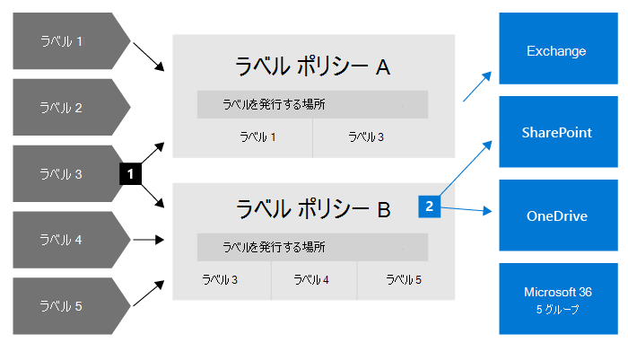
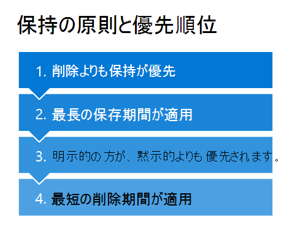

# アイテム保持ポリシーと保持ラベルの詳細

>*[セキュリティとコンプライアンスのための Microsoft 365 ライセンス ガイダンス](/office365/servicedescriptions/microsoft-365-service-descriptions/microsoft-365-tenantlevel-services-licensing-guidance/microsoft-365-security-compliance-licensing-guidance)。*

> [!NOTE]
> Teams でアイテム保持ポリシーに関するメッセージが表示される場合、あるいはアプリ内の保持ラベルについて質問がある場合は、IT 部門に連絡して、ポリシーがどのように構成されているかを確認します。その際、次の記事も参考にしてください。
> -  [Teams のアイテム保持ポリシーに関するメッセージ](https://support.microsoft.com/office/teams-messages-about-retention-policies-c151fa2f-1558-4cf9-8e51-854e925b483b)
> - [SharePoint または OneDrive のファイルに保持ラベルをつける](https://support.microsoft.com/office/apply-retention-labels-to-files-in-sharepoint-or-onedrive-11a6835b-ec9f-40db-8aca-6f5ef18132df)
>
> このページの情報は、コンプライアンス上の理由からアイテム保持ポリシーと保持ラベルを作成できる IT 管理者向けです。

ほとんどの組織では、電子メール、ドキュメント、インスタント メッセージなどのデータの量と複雑さが日々増しています。次の必要性から、これらの情報を効果的に管理することが重要です。

- **最小限の期間コンテンツを保持することを要求する業界の規制や内部ポリシーを積極的に遵守する**: たとえば、米国企業改革法により、特定の種類のコンテンツを 7 年間保持することが求められる場合があります。

- **訴訟やセキュリティ違反が発生した場合にリスクを軽減する**: このために、保持する必要がなくなった古いコンテンツは完全に削除します。

- **組織内での効率的な知識の共有と迅速な対応に役立てる**: このために、ユーザーは現時点で関連性のあるコンテンツのみを対象に作業するようにします。

保持設定を構成すると、これらの目標を達成できるようになります。 コンテンツの管理には、一般的に次の 2 つのアクションが必要です。

| アクション| 用途 |
|:-----|:-----|
|コンテンツを保持する | 完全に削除せず、電子情報開示で利用できるようにする |
|コンテンツを削除する | 組織からコンテンツを完全に削除する|

これら 2 つの保持アクションを使用して、次の結果が得られるように保持設定を構成できます。

- 保持のみ: コンテンツを無期限または指定した期間保持します。
- 削除のみ: 指定した期間の後にコンテンツを完全に削除します。
- 保持してから削除: コンテンツを指定した期間保持してから完全に削除します。

これらの保持設定は所定の場所にあるコンテンツに作用し、コンプライアンス上の理由でコンテンツを保持する必要がある場合でも、追加のストレージを作成して構成するための追加のオーバーヘッドを節約できます。 また、このデータをコピーして同期するために、カスタマイズしたプロセスを実装する必要もありません。

次のセクションを使用して、アイテム保持ポリシーとアイテム保持ラベルの機能、使用する時期、さらに相互補足する方法についての詳細情報を参照します。 ただし、一部の一般的なシナリオでアイテム保持設定を開始して展開する準備ができている場合は、[アイテム保持ポリシーおよび保持ラベルの使用を開始する](get-started-with-retention.md) を参照してください。

## 保持設定が所定の場所にあるコンテンツに作用するしくみ

コンテンツに保持設定が割り当てられるとき、そのコンテンツは元の場所にそのまま残ります。このため、ユーザーは何事もなかったかのように、ドキュメントやメールで作業を続けることができます。ただし、アイテム保持ポリシーに含まれているコンテンツをユーザーが編集または削除すると、そのコンテンツのコピーが自動的に保持されます。
  
- SharePoint および OneDrive サイトの場合: コピーは、**アイテム保管** ライブラリに保持されます。

- Exchange メールボックスの場合: コピーは、**[回復可能なアイテム]** フォルダーに保持されます。 

- TeamsとYammerのメッセージ： **SubstrateHolds** という名前の隠しフォルダーに Exchange **回復可能アイテム** フォルダー内のサブフォルダーとして保存されます。

> [!NOTE]
> アイテム保管ライブラリは、サイトのストレージ クォータから除外されていないストレージを消費します。 SharePoint グループや Microsoft 365 グループに対して保持設定を使用する場合は、ストレージを増やすことが必要な場合があります。
> 
セキュリティで保護されているこれらの場所や保持されているコンテンツは、ほとんどのユーザーには表示されません。 ほとんどの場合、ユーザーは自分が作業しているコンテンツが保持設定の対象であることを知る必要さえありません。

保持設定がさまざまなワークロードに対してどのように機能するかの詳細については、次の記事を参照してください。

- [SharePoint と OneDrive の保持の詳細](retention-policies-sharepoint.md)
- [Microsoft Teams の保持の詳細](retention-policies-teams.md)
- [Yammerの保持の詳細](retention-policies-yammer.md)
- [Exchange の保持の詳細](retention-policies-exchange.md)

## アイテム保持ポリシーと保持ラベル

アイテム保持設定をコンテンツに割り当てるには、**アイテム保持ポリシー** と **保持ラベルをラベル ポリシーで** 使用します。 これらの方法のいずれかを使用するか、組み合わせることも可能です。

サイト レベルやメールボックス レベルで同一の保持設定を割り当てるには、アイテム保持ポリシーを使用します。一方、アイテム レベル (フォルダー、ドキュメント、メール) で保持設定を割り当てるには、保持ラベルを使用します。

たとえば、SharePoint サイト内のすべてのドキュメントを 5 年間保持する必要がある場合は、同じ保持ラベルをサイト内のすべてのドキュメントに適用するよりも、アイテム保持ポリシーを使用する方が効率的です。 一方、サイト内の一部のドキュメントは 5 年間保持し、一部は 10 年間保持する必要がある場合、アイテム保持ポリシーではこれを行うことができません。 アイテム レベルで保持設定を指定する必要がある場合は、保持ラベルを使用します。 

アイテム保持ポリシーとは異なり、保持ラベルによる保持設定は、コンテンツが Microsoft 365 テナントの別の場所に移動された場合は、コンテンツとともに移動します。 また、保持ラベルには、アイテム保持ポリシーではサポートされていない次の機能があります。 
 
- コンテンツの保持期間や最終更新日以外に、コンテンツにラベルが付けられた時点やイベントに基づいて保持期間を開始するオプション。

- [トレーニング可能な分類子](classifier-learn-about.md)を使用して、ラベル付けするコンテンツを識別する。

- SharePoint ドキュメントに既定のラベルを適用する。

- コンテンツを完全に削除する前にコンテンツを確認する[廃棄確認](./disposition.md) のサポート。

- ラベル設定の一部として、コンテンツを [[レコード]](records-management.md#records) としてマークし、保持期間の終了時にコンテンツが削除されるときに [廃棄の証明](disposition.md#disposition-of-records) を常に取得する。

### アイテム保持ポリシー

アイテム保持ポリシーは、次の場所に適用できます。
- Exchange メール
- SharePoint サイト
- OneDrive アカウント
- Microsoft 365 グループ
- Skype for Business
- Exchange パブリック フォルダー
- チームのチャネル メッセージ
- Teams のチャット
- Teams の非公開チャネル メッセージ
- Yammer コミュニティのメッセージ
- Yammer ユーザーのメッセージ

複数の場所にも特定の場所やユーザーにも、1 つのポリシーを非常に効率的に適用できます。

保持期間の開始時に、コンテンツがいつ作成されたか、またはファイルと、コンテンツが最後に変更された SharePoint、OneDrive、Microsoft 365 グループの場所でのみサポートされるかを選択することができます。

アイテムは、アイテム保持ポリシーで指定されたコンテナーからアイテム保持設定を継承します。 ポリシーがコンテンツを保持するように構成されているときに、それらがそのコンテナーの外部に移動された場合、そのアイテムのコピーがワークロードのセキュリティで保護された場所に保持されます。 ただし、保持設定は、新しい場所ではコンテンツとともに移動することはありません。 必要な場合は、アイテム保持ポリシーの代わりに保持ラベルを使用します。

### 保持ラベル

保持ラベルは、異なる保持設定を必要とするさまざまな種類のコンテンツに対して使用できます。 例:
  
- 最低限の期間、保持する必要のある納税申告書。 
    
- 特定の期間が経過した後、完全に削除する必要があるプレス資料。 
    
- 特定の期間保持した後に完全に削除する必要がある競合企業のリサーチ。 
    
- 編集も削除もできないように、レコードとしてマークする必要がある就労ビザ。 
    
いずれの場合も、保持ラベルを使用すると、アイテム レベル (ドキュメントやメール) でガバナンス制御用の保持設定を適用できます。
  
保持ラベルを使用すると、次のことができます。
  
- **組織のユーザーが保持ラベルを手動で適用できるようにする**。ユーザーが保持ラベルを手動で適用できるのは、Outlook および Outlook on the web、OneDrive、SharePoint​​、Microsoft 365 グループ内のコンテンツです。 多くの場合、ユーザーは自分が操作するコンテンツの種類を最もよく知っているので、コンテンツを分類して適切な保持設定を適用できます。 
    
- コンテンツに次のものが含まれている場合など、特定の条件に一致するときには、**保持ラベルをコンテンツに自動的に適用** できます。 
    - 特定の種類の機密情報。
    - 作成したクエリに一致する特定のキーワード。
    - トレーニング可能な分類子のパターン マッチ。

- **コンテンツにラベルが付けられた時点から保持期間を開始する**。SharePoint サイトや OneDrive アカウントのドキュメント、および予定表アイテム以外のメール アイテムに対してこの操作を行えます。 この構成の保持ラベルを予定表アイテムに適用すると、保持期間はアイテムが送信された時点から開始されます。

- 従業員の退職、契約の期限切れなど、**イベントの発生時に保持期間を開始する**。

- SharePoint の **ドキュメント ライブラリ、フォルダー、またはドキュメント セットに既定の保持ラベルを適用** することにより、この場所に保存するすべてのドキュメントに既定の保持ラベルが継承されるようになります。

さらに、保持ラベルは、Microsoft 365 アプリとサービス全体でのメールとドキュメントの[レコード管理](records-management.md)をサポートします。 保持ラベルを使用して、アイテムをレコードとしてマークできます。 この問題が発生し、コンテンツが Microsoft 365 に残っている場合は、このラベルで規制上の理由から必要になることがあるコンテンツがさらに制限されます。 詳細については、「[許可またはブロックするアクションの制限を比較する](records-management.md#compare-restrictions-for-what-actions-are-allowed-or-blocked)」を参照してください。

保持ラベルは、[秘密度ラベル](sensitivity-labels.md)とは異なり、コンテンツが Microsoft 365 以外の場所に移動した場合は保持されません。

テナントでサポートされる保持ラベルの数に制限はありません。 ただし、10,000 はテナントでサポートされるポリシーの最大数であり、これらには、ラベルを適用するポリシー (保持ラベル ポリシーと自動適用アイテム保持ポリシー) とアイテム保持ポリシーが含まれます。

#### アクションを適用しないでコンテンツを分類する

保持ラベルの主な目的はコンテンツを保持または削除することですが、保持やその他のアクションを有効にしないで保持ラベルを使用することもできます。 この場合、テキスト ラベルとしてのみ保持ラベルを使用し、他のアクションは適用しません。
  
たとえば、アクションを含まない "後で確認" という名前の保持ラベルを作成して適用し、後からそのコンテンツを見つけるためにそのラベルを使用できます。
  

#### DLP ポリシーで保持ラベルを条件として使用する

SharePoint のドキュメントのデータ損失防止 (DLP) ポリシーの条件として、保持ラベルを指定することができます。 たとえば、指定された保持ラベルがドキュメントに適用されている場合はそのドキュメントが組織外に共有されないように、DLP ポリシーを構成できます。

詳細については、「[DLP ポリシーでの条件としての保持ラベルの使用](data-loss-prevention-policies.md#using-a-retention-label-as-a-condition-in-a-dlp-policy)」を参照してください。

#### 保持ラベルと保持ラベルを適用するポリシー

保持ラベルを発行すると、それらは **保持ラベル ポリシー** に含まれます。管理者とユーザーは、このポリシーをコンテンツに適用できます。 次の図で説明します。

1. 1 つの保持ラベルを複数の保持ラベル ポリシーに含めることができます。

2. 保持ラベル ポリシーは保持ラベルを発行する場所を指定します。 同一の場所を複数の保持ラベル ポリシーに含めることができます。

また、1 つ以上の **自動適用ポリシー** を作成して、それぞれに保持ラベルを 1 つ指定することもできます。 このポリシーを使うと、ポリシーで指定した条件が満たされた場合に、保持ラベルが自動的に適用されます。

#### 保持ラベルのポリシーと場所

保持ラベルの内容に応じて、多様な種類の保持ラベルをさまざまな場所に発行できます。
  
| 保持ラベルの種類 | ラベル ポリシーの適用先 |
|:-----|:-----|
|管理者とエンド ユーザーに発行されたラベル    |Exchange、SharePoint、OneDrive、Microsoft 365 グループ    |
|機密情報の種類またはトレーニング可能な分類子に基づいて自動適用されたラベル    |Exchange (すべてのメールボックスのみ)、SharePoint、OneDrive    |
|クエリに基づいて自動適用されたラベル    |Exchange、SharePoint、OneDrive、Microsoft 365 グループ    |
   
Exchange で自動で付けることができる保持ラベルは、新しく送信されたメッセージ (送信中のデータ) にのみ適用され、現在メールボックスにあるすべてのアイテム (保存データ) には適用されません。また、機密情報の種類やトレーニング可能な分類子向けの自動適用の保持ラベルは、すべてのメールボックスにのみ適用されます。特定のメールボックスを選択することはできません。
  
Exchange パブリックフォルダー、Skype、Teams、Yammer メッセージは保持ラベルをサポートしていません。 これらの場所のコンテンツを保持または削除するには、代わりにアイテム保持ポリシーを使用します。

#### 一度に 1 つの保持ラベルのみ

メールやドキュメントに一度に適用できる保持ラベルは、1 つのみです。 保持ラベルは、エンド ユーザーや管理者が[手動](create-apply-retention-labels.md#manually-apply-retention-labels)で適用することも、次のいずれかの方法を使用して自動で適用することもできます。

- [自動適用ラベル ポリシー](apply-retention-labels-automatically.md)
- [SharePoint Syntex のドキュメント理解モデル](../contentunderstanding/apply-a-retention-label-to-a-model.md)
- [Outlook](create-apply-retention-labels.md#applying-a-default-retention-label-to-an-outlook-folder) または [SharePoint の既定のラベル](create-apply-retention-labels.md#applying-a-default-retention-label-to-all-content-in-a-sharepoint-library-folder-or-document-set)
- [Outlook のルール](create-apply-retention-labels.md#automatically-applying-a-retention-label-to-email-by-using-rules)

標準的な保持ラベルの場合 (アイテムを[レコードや規制レコード](records-management.md#records)としてマークしません)。

- 管理者とエンド ユーザーは、コンテンツに適用されている既存の保持ラベルを手動で変更または削除できます。 

- コンテンツに既に保持ラベルが適用されている場合、既存のラベルが自動的に削除されたり、別の保持ラベルに置き換えられたりすることはありません。ただし、例外が 1 つあり、既存のラベルが既定のラベルとして適用されている場合です。
    
    既定のラベルを使用して適用した場合のラベルの動作については、以下を参照してください。
    - SharePoint の既定のラベル: [SharePoint の既定のラベルを使用した場合のラベルの動作](create-apply-retention-labels.md#label-behavior-when-you-use-a-default-label-for-sharepoint)
    - Outlook の既定のラベル: [Outlook フォルダーに既定の保持ラベルを適用する](create-apply-retention-labels.md#applying-a-default-retention-label-to-an-outlook-folder)

- 保持ラベルを適用できる自動適用ラベル ポリシーが複数あり、コンテンツが複数のポリシーの条件を満たしている場合、(作成日を基準にして) 最も古い自動適用ラベル ポリシーの保持ラベルが適用されます。

保持ラベルがアイテムをレコードまたは規制レコードとしてマークしている場合、これらのラベルが自動的に変更されることはありません。 コンテナーの管理者のみが、アイテムをレコードとしてマークする保持ラベルを手動で変更または削除することができますが、規制レコードについてはできません。 詳細については、「[許可またはブロックされているアクションの制限を比較する](records-management.md#compare-restrictions-for-what-actions-are-allowed-or-blocked)」を参照してください。

#### 保持ラベルの監視

Microsoft 365 コンプライアンス センターから、[**データ分類**]、[**概要**] ページを使用して、保持ラベルがテナントでどのように使用されているかを監視し、ラベル付きアイテムの場所を特定します。 重要な前提条件を含む詳細については、「[データ分類の説明](data-classification-overview.md)」を参照してください。

詳細については、[コンテンツ エクスプローラー](data-classification-content-explorer.md) と [アクティビティ エクスプローラー](data-classification-activity-explorer.md) を使用します。

> [!TIP]
>トレーニング可能な分類子や機密情報タイプなど、他のデータ分類インサイトのいくつかを使用することを検討して、レコードとして保持または削除する必要がある、またはレコードとして管理する必要があるコンテンツを特定できるようにします。

#### コンテンツ検索を使用した特定の保持ラベルを持つすべてのコンテンツの検索

保持ラベルがユーザーによって、または自動適用されてコンテンツに適用された後、コンテンツ検索を使用して、特定の保持ラベルが適用されているすべてのアイテムを検索できます。

コンテンツ検索を作成するとき、**保持 ラベル** の条件を選択し、完全な保持ラベル名を入力するか、ラベル名の一部を入力してワイルドカードを使用します。 詳細については、「[コンテンツ検索のキーワード クエリと検索条件](keyword-queries-and-search-conditions.md)」を参照してください。
  

## アイテム保持ポリシーと保持ラベルの機能比較

次の表は、アイテム保持ポリシーと保持ラベルのどちらを使用するかを、機能に基づいて決定するのに役立ちます。

|機能|アイテム保持ポリシー |保持ラベル|
|:-----|:-----|:-----|:-----|
|保持してから削除、保持のみ、削除のみを指定できる保持設定 |はい |はい |
|サポートされるワークロード:  - Exchange  - SharePoint  - OneDrive  - Microsoft 365 グループ  - Skype for Business  - Teams - Yammer|  はい   はい   はい   はい   はい   はい   はい |   はい (パブリック フォルダーを除く)   はい   はい   はい   いいえ   いいえ   いいえ |
|保持の自動適用 | はい | はい |
|条件に基づいて適用される保持   - 機密情報の種類、KQL クエリとキーワード、トレーニング可能な分類子| いいえ | はい |
|保持の手動適用 | いいえ | はい |
|エンド ユーザー向け UI の存在 | いいえ | はい |
|コンテンツが移動された場合の保持 | いいえ | はい (Microsoft 365 テナント内で) |
|レコードとしてアイテムを宣言| 不要 | はい |
|ラベル作成時またはイベント発生時に保持期間を開始 | 不要 | はい |
|処理確認 | いいえ| はい |
|廃棄の証明 (最大 7 年間) | いいえ |はい、処分レビューを使用するか、アイテムがレコードとしてマークされている場合|
|管理者アクティビティを監査する| はい | はい|
|保持アクションの監査| いいえ | はい \* |
|保持対象のアイテムの特定   - コンテンツ検索   - データ分類ページ、コンテンツ エクスプローラー、アクティビティ エクスプローラー |   不要   いいえ |   はい   はい|

**脚注:**

\* コンテンツをレコードまたは規制レコードとしてマークしない保持ラベルの場合、監査イベントは SharePoint または OneDrive でアイテムが適用済みラベル、変更済みラベル、または削除済みラベルを所有する場合に限定されます。 保持ラベル向けの監査の詳細については、このページの[保持アクションの監査](#auditing-retention-actions) セクションを参照してください。

### アイテム保持ポリシーと保持ラベルの組み合わせ

アイテム保持ポリシーのみ使用するか、保持ラベルのみ使用するかどちらかを選ぶ必要はありません。 実際には両方のメソッドが一緒に使用され、より包括的なソリューションのために相互補完します。 例:

1. 最終更新日から 5 年後にコンテンツを自動的に削除するアイテム保持ポリシーを作成して構成し、すべての OneDrive アカウントにそのポリシーを適用します。

2. コンテンツを無期限に保持する保持ラベルを作成して構成し、すべての OneDrive アカウントに対して発行するラベル ポリシーにこのラベルを追加します。 5 年間更新されない場合でも自動削除されないようにする必要のある特定のドキュメントに対して、このラベルを手動で適用する方法をユーザーに説明します。

アイテム保持ポリシーと保持ラベルを組み合わせて使用する方法、および組み合わせて使用した場合の結果の確認方法の詳細については、保持の原則と優先順位について説明している次のセクションを参照してください。

## 保持の原則と優先順位

保持ラベルとは異なり、同じコンテンツに複数のアイテム保持ポリシーを適用できます。 各アイテム保持ポリシーの結果は、保持アクションと削除アクションとなります。 さらに、そのアイテムに対して、保持ラベルからのそれらのアクションが適用される可能性もあります。

このシナリオでは、アイテムが互いに競合する可能性のある複数の保持設定の対象となる可能性があります。その場合、結果を決定するために何が優先されるのかを説明します。

単一のアイテム保持ポリシーまたは単一の保持ラベルのどちらが優先されるのではなく、アイテムが保持される期間 (該当する場合) およびアイテムが削除される時期 (該当する場合) によって、結果が決まります。 これらの 2 つのアクションは、アイテムに適用されるすべての保持設定から、互いに独立して計算されます。

たとえば、あるアイテムに対して、削除のみのアクション用に構成された 1 つのアイテム保持ポリシーと、保持してから削除するように構成された別のアイテム保持ポリシーが適用される場合があります。 その場合、このアイテムは 1 つの保持アクションと、2 つの削除アクションを持つことになります。 保持アクションと削除アクションが互いに競合している可能性があり、2 つの削除アクションについては日付が競合している可能性があります。 保持の原則は結果を説明します。

高いレベルにおいて、保持は完全な削除より常に優先され、最長の保持期間が優先されることが保証されます。 常にこれらの 2 つの単純なルールによって、アイテムが保持される期間が決まります。

アイテムがいつ完全に削除されるかを決定する要素は他にもいくつかあります。たとえば、保持ラベルからの削除アクションは、アイテム保持ポリシーからの削除アクションよりも常に優先されます。

次のフロー図を使って、単一のアイテムの保持と削除の結果を説明します。各レベルは、上から下への競合のタイブレーカーとして機能します。 それ以上の競合がないために結果が最初のレベルによって決定される場合、次のレベルに進む必要はありません。

> [!IMPORTANT]
> 保持ラベルを使用している場合: このフロー図を使用して同じアイテムの複数の保持設定の結果を判断する前に、[どの保持ラベルが適用されているか](#only-one-retention-label-at-a-time)を確認してください。

  
4 つの原則について説明します。
  
1. **削除よりも保持が優先されます。** コンテンツを保持するための保持設定がされている場合、コンテンツは完全には削除されません。 この原則により、コンプライアンス上の理由でコンテンツが確実に保持されますが、削除プロセスは引き続き開始され、ユーザー ビューと検索からコンテンツを削除できます。 たとえば、SharePoint の場合、ドキュメントは、元のフォルダーから Preservation Holds フォルダーに移動します。 ただし、完全な削除は一時停止されます。 コンテンツを保存する方法と場所の詳細については、ワークロードごとに次のリンクを使用してください。
    
    - [SharePoint と OneDrive の保持のしくみ](retention-policies-sharepoint.md#how-retention-works-for-sharepoint-and-onedrive)
    - [Microsoft Teams での保持のしくみ](retention-policies-teams.md#how-retention-works-with-microsoft-teams)
    - [Yammer での保持のしくみ](retention-policies-yammer.md#how-retention-works-with-yammer)
    - [Exchange の保持のしくみ](retention-policies-exchange.md#how-retention-works-for-exchange)
    
    例: あるメール メッセージが、3 年後にアイテムを削除するように構成された Exchange のアイテム保持ポリシーの対象であり、同時に、5 年間アイテムを保持するように構成された保持ラベルも適用されているとします。
    
    この保持アクションは削除よりも優先されるため、メール メッセージは 5 年間保持されます。 保持アクションの実行中に削除アクションが一時停止されたため、メール メッセージは 5 年の終わりに完全に削除されます。

2. **最長の保持期間が優先されます。** 期間の異なる複数の保持設定がコンテンツに対して指定されている場合、そのコンテンツはアイテムの最長の保持期間が終了するまで保持されます。
    
    例: マーケティング SharePoint サイトのドキュメントに、2 つのアイテム保持ポリシーが適用されるとします。 1 つ目のアイテム保持ポリシーは、すべての SharePoint サイトが 5 年間アイテムを保持するように構成されています。 2 つ目のアイテム保持ポリシーは、特定の SharePoint サイトはアイテムを 10 年間保持するように構成されています。
    
    この マーケティング SharePoint サイトのドキュメントは、最長の保持期間である 10 年間保持されます。

3. **削除操作において、明示的の方が黙示的よりも優先されます。** 保持の競合が解決されたら、削除の競合のみが残ります: 
    
    1. 保持ラベルは (適用されている場合でも) アイテム保持ポリシーと比較して明示的な保持を提供します。これは、保持設定がコンテナーから黙示的に割り当てられるのではなく、個々のアイテムに対して適用されるためです。 つまり、保持ラベルからの削除アクションは、アイテム保持ポリシーからの削除アクションよりも常に優先されます。
        
        例: あるドキュメントに、それぞれ 5 年と 10 年の削除アクションを持つ 2 つのアイテム保持ポリシーと、7 年の削除アクションを持つ保持ラベルが適用されるとします。
        
        保持ラベルからの削除アクションが優先されるため、このドキュメントは 7 年後に完全に削除されます。
    
    2. アイテム保持ポリシーのみの場合: 場所のアイテム保持ポリシーがインクルード構成 (Exchange メールの特定のユーザーなど) を使用するようにスコープされている場合、そのアイテム保持ポリシーは同じ場所のスコープのないアイテム保持ポリシーよりも優先されます。
        
        スコープのないアイテム保持ポリシーでは、特定のインスタンスを指定せずに場所を選択します。 たとえば、**Exchange メール** と既定の設定の **すべての受信者** は、スコープのないアイテム保持ポリシーです。 または、**SharePoint サイト** と既定の設定の **すべてのサイト** も該当します。 アイテム保持ポリシーでスコープが設定されている場合、このレベルでは同じ優先順位になります。
        
        例 1: あるメール メッセージに 2 つのアイテム保持ポリシーが適用されるとします。 1 つ目のアイテム保持ポリシーはスコープがなく、10 年後にアイテムを削除します。 2 つ目のアイテム保持ポリシーは、特定のメールボックスにスコープされ、5 年後にアイテムを削除します。
        
        スコープのあるアイテム保持ポリシーからの削除アクションがスコープのないアイテム保持ポリシーよりも優先されるため、メール メッセージは 5 年後に完全に削除されます。
        
        例 2: あるユーザーの OneDrive アカウントのドキュメントに、2 つのアイテム保持ポリシーが適用されるとします。 1 つ目のアイテム保持ポリシーは、このユーザーの OneDrive アカウントを含むようにスコープされていて、10 年後の削除アクションがあります。 2 つ目のアイテム保持ポリシーは、このユーザーの OneDrive アカウントを含むようにスコープされていて、7 年後の削除アクションがあります。
        
        両方のアイテム保持ポリシーがスコープされているため、このドキュメントがいつ完全に削除されるのかをこのレベルで決定することはできません。

4. **最短の削除期間が優先されます。** アイテム保持ポリシーからアイテムが削除される時期と、上記のレベルから解決できなかった結果を決定するために適用可能: コンテンツはアイテムの最短保持期間の終了時に完全に削除されます。
    
    例: あるユーザーの OneDrive アカウントのドキュメントに、2 つのアイテム保持ポリシーが適用されるとします。 1 つ目のアイテム保持ポリシーは、このユーザーの OneDrive アカウントを含むようにスコープされていて、10 年後の削除アクションがあります。 2 つ目のアイテム保持ポリシーは、このユーザーの OneDrive アカウントを含むようにスコープされていて、7 年後の削除アクションがあります。
    
    このドキュメントは、これら 2 つのスコープされたアイテム保持ポリシーで最短の保持期間である 7 年後に完全に削除されます。

電子情報開示の対象となるアイテムも、1 つ目の保持の原則に該当することに注意してください。それらは、アイテム保持ポリシーまたは保持ラベルによって完全に削除することはできません。 その保留が解除されても、保持の原則が引き続き適用されます。 たとえば、有効期限が切れていない保持期間や削除アクションの対象となる可能性があります。

保持アクションと削除アクションを組み合わせたより複雑な例:

1. あるアイテムに次の保持設定が適用されているとします。
    
    - 5 年後に削除のみのアイテム保持ポリシー
    - 3 年間保持して削除するアイテム保持ポリシー
    - 7 年間の保持のみの保持ラベル
    
    **結果**: 保持は削除よりも優先され、7 年間が最長の保持期間であるため、アイテムは 7 年間保持されます。 この保持期間の終了時にアイテムは完全に削除されます。これは、アイテム保持ポリシーの削除アクションによるものです。
    
    2 つのアイテム保持ポリシーの削除アクションの日付は異なりますが、アイテムを完全に削除できる最も早い時期は、両方の削除日よりも長い最長の保持期間の終了時です。 

2.  あるアイテムに次の保持設定が適用されているとします。
    
    - 10 年後に削除のみのスコープのないアイテム保持ポリシー
    - 5 年間保持して削除するスコープのあるアイテム保持ポリシー
    - 3 年間保持して削除する保持ラベル
    
    **結果**: アイテムは 5 年間保持されます。これは、保持期間が最も長いためです。 この保持期間の終了時にアイテムは完全に削除されます。これは、保持ラベルの 3 年間保持後の削除アクションによるものです。 保持ラベルからの削除は、すべてのアイテム保持ポリシーからの削除よりも優先されます。 この例では、すべての競合は 3 番目のレベルで解決されます。

## 保管ロックを使用してポリシーへの変更を制限する

一部の組織は、米国証券取引委員会 (SEC) 規則 17a-4 など、規制機関によって定義された規則に準拠する必要があります。その場合、保持ポリシーをオンにした後、それをオフにしたり、制限を緩和したりすることはできません。 

保管ロックを使用すると、アイテム保持ポリシーまたは保持ラベル ポリシーがロックされ、管理者を含むいかなるユーザーも、ポリシーをオフにしたり、削除、またはその制限を緩和したりすることができなくなるため、組織はこのような規制要件を確実に満たすことができます。
  
アイテム保持ポリシーまたは保持ラベル ポリシーを作成した後に、PowerShell を使用して保管ロックを適用します。 詳細と手順については、「[保管ロックを使用して、アイテム保持ポリシーと保持ラベル ポリシーへの変更を制限する](retention-preservation-lock.md)」を参照してください。

## 保持に関するポリシーを解放する

保管ロックが適用されていない保持に関するポリシーの場合は、いつでもポリシーを削除できます。それにより、以前に適用された保持設定は事実上無効になります。 ポリシーを維持して、場所の状態をオフに変更するか、ポリシーを無効にすることもできます。 ポリシーが SharePoint の特定のサイトや OneDrive のアカウントを含めるように構成されている場合は、ポリシーを編集して 1 つ以上のエントリを削除してポリシーをこれらのサイトやアカウントに開放することもできます。
 
これらのアクションのいずれかを実行すると、ポリシーからの保持の対象となる SharePoint または OneDrive コンテンツは、不注意によるデータの損失を防ぐために 30 日間保持され続けます。 この 30 日間の猶予期間中、削除されたファイルは引き続き保持されます (ファイルは引き続き保存保留ライブラリに追加されます) が、定期的に保存保留ライブラリをクリーンアップするタイマー ジョブはこれらのために中断されます。 必要に応じてファイルを復元できるようにします。

この 30 日間の支払猶予期間の例外は、ポリシーを更新して 1 つ以上の SharePoint の詳細なサイトまたは OneDrive のアカウントを除外する場合に適用されます。この場合、タイマー ジョブは 30 日間の延期期間なしでアイテム保管ライブラリ内のこれらの場所のファイルを削除します。

保存保持ライブラリの詳細については、「[SharePoint と OneDrive の保持のしくみ](retention-policies-sharepoint.md#how-retention-works-for-sharepoint-and-onedrive)」を参照してください。

猶予期間中の動作のため、ポリシーを再度有効にするか、ロケーション ステータスを 30 日以内にオンに戻すと、この期間中に永続的なデータ損失なしにポリシーが再開されます。

## アイテム保持構成とアクションの監査

[監査が有効](turn-audit-log-search-on-or-off.md)である場合、管理者の構成 (アイテム保持ポリシーおよび保持ラベル) と保持アクション (保持ラベルのみ) の両方で保持の監査イベントがサポートされます。

### アイテム保持構成の監査

アイテム保持ポリシー向けの管理者の構成および保持ラベルは、アイテム保持ポリシーと保持ラベルが作成され、再構成され、または削除された場合に監査イベントとして記録されます。

監査イベントの完全なリストについては、「[アイテム保持ポリシーと保持ラベルのアクティビティ](search-the-audit-log-in-security-and-compliance.md#retention-policy-and-retention-label-activities)」を参照してください。

### 保持アクションの監査

監査イベントとして記録される保持アクションは、保持ラベルにのみ利用でき、以下のアイテム保持ポリシーには利用できません。

- SharePoint または OneDrive で、アイテムから保持ラベルが適用、変更、削除された場合:
    - **ファイルアクティビティとページ アクティビティ** から、ファイルの [**変更された保持ラベル**] を選択します 

- SharePoint でラベル付けされたアイテムがレコードとしてマークされた場合は、ユーザーがこれをロック解除またはロックします。
    - **[ファイル アクティビティとページ アクティビティ]** から、**[レコード ステータスがロック解除に変更されました]** と **[レコード ステータスが、ロックに変更されました]** を選択します

- レコードとしてコンテンツをマークする保持ラベルまたは規制レコードが、Exchange でアイテムに適用されている場合です。
    - **Exchange メールボックス アクティビティ** で、 [**メッセージをレコードとしてラベル付け**] を選択します

- SharePoint、OneDrive または Exchange で、ラベル付けされたアイテムがレコードまたは規制レコードとしてマークされ、完全に削除された場合:
    - **ファイルおよびページ アクティビティ** で、**レコードとしてマークされた削除済みファイル** を選択します

## アイテム保持ポリシーと保持ラベルの PowerShell コマンドレット

保持コマンドレットを使用するには、最初に [Office 365 セキュリティ/コンプライアンス センターの PowerShell](/powershell/exchange/connect-to-scc-powershell) に接続する必要があります。 次に、次のいずれかのコマンドレットを使用します。

- [Get-ComplianceTag](/powershell/module/exchange/get-compliancetag)

- [New-ComplianceTag](/powershell/module/exchange/new-compliancetag)

- [Remove-ComplianceTag](/powershell/module/exchange/remove-compliancetag)

- [Set-ComplianceTag](/powershell/module/exchange/set-compliancetag)

- [Enable-ComplianceTagStorage](/powershell/module/exchange/enable-compliancetagstorage)

- [Get-ComplianceTagStorage](/powershell/module/exchange/get-compliancetagstorage)

- [Get-RecordReviewNotificationTemplateConfig](/powershell/module/exchange/get-recordreviewnotificationtemplateconfig)

- [Get-RetentionCompliancePolicy](/powershell/module/exchange/get-retentioncompliancepolicy)

- [New-RetentionCompliancePolicy](/powershell/module/exchange/new-retentioncompliancepolicy)

- [Remove-RetentionCompliancePolicy](/powershell/module/exchange/remove-retentioncompliancepolicy)

- [Set-RecordReviewNotificationTemplateConfig](/powershell/module/exchange/set-recordreviewnotificationtemplateconfig)

- [Set-RetentionCompliancePolicy](/powershell/module/exchange/set-retentioncompliancepolicy)

- [Get-RetentionComplianceRule](/powershell/module/exchange/get-retentioncompliancerule)

- [New-RetentionComplianceRule](/powershell/module/exchange/new-retentioncompliancerule)

- [Remove-RetentionComplianceRule](/powershell/module/exchange/remove-retentioncompliancerule)

- [Set-RetentionComplianceRule](/powershell/module/exchange/set-retentioncompliancerule)

## アイテム保持ポリシーと保持ラベルまたは電子情報開示用の保留を使用する場合

保持の設定と[電子情報開示ケースを使用して作成した保留](create-ediscovery-holds.md)は、両方ともデータが完全に削除されるのを防ぐことができますが、さまざまなシナリオに対応できるように設計されています。 違いを理解し、どちらを使用するかを決定するために、以下のガイダンスをご利用ください。

- アイテム保持ポリシーや保持ラベルで指定する保持の設定は、コンプライアンス要件に合わせてデータを保持または削除する長期的な情報ガバナンス戦略のために設計されています。 その範囲は通常、個々のユーザーよりも場所やコンテンツに焦点を合わせた幅広いものとなっています。 保持期間の開始日と終了日は構成可能で、追加の管理者が介入することなくコンテンツを自動的に削除できるオプションがあります。

- 電子情報開示 (コア電子情報開示または Advanced eDiscovery ケース) のための保留は、法的な調査のためにデータを保存する限られた期間のために設計されています。 範囲については、特定のユーザーが所有するコンテンツに限定されます。 保持期間の開始日と終了日は構成できませんが、個々の管理者の操作に依存し、保留が解除されたときにコンテンツを自動的に削除するオプションはありません。

保持と保留を比較するための概要

|考慮事項|保持 |電子情報開示の保留|
|:-----|:-----|:-----|:-----|
|ビジネス ニーズ: |コンプライアンス |法務 |
|時間の範囲: |長期 |短期 |
|フォーカス: |広範囲、コンテンツベース |限定的、ユーザーベース |
|開始日と終了日の構成が可能: |必要 |いいえ |
|コンテンツの削除 |はい (オプション) |いいえ |
|管理費: |低い |高い |

コンテンツが保持の設定と電子情報開示の保留の両方の対象になっている場合、電子情報開示の保留のためのコンテンツの保存が常に優先されます。 このように、管理者が手動で保留を解除するまでデータは保持されるため、[保持の原則](#the-principles-of-retention-or-what-takes-precedence)は電子情報開示の保留にまで拡張されます。 ただし、このような優先順位があるにもかかわらず、長期的な情報ガバナンスのために電子情報開示の保留を使用することはできません。 データの自動削除について心配がある場合は、アイテムを無期限に保持するように保持の設定を構成したり、保持ラベルを用いて[処理確認](disposition.md#disposition-reviews)を使用したりすることができます。

古い電子情報開示ツールを使用してデータを保存している場合は、以下のリソースを参照してください。

- Exchange: 
    - [インプレース保持と訴訟ホールド](/exchange/security-and-compliance/in-place-and-litigation-holds)
    - [Exchange Online メールボックスに適用されている保留の種類を特定する方法](./identify-a-hold-on-an-exchange-online-mailbox.md)

- SharePoint と OneDrive 
    - [電子情報開示センターでのコンテンツのケースへの追加とソースの保留リストへの配置](/SharePoint/governance/add-content-to-a-case-and-place-sources-on-hold-in-the-ediscovery-center)

- [従来の電子情報開示ツールの廃止](legacy-ediscovery-retirement.md)

## 以前の機能の代わりにアイテム保持ポリシーと保持ラベルを使用する

情報ガバナンスを目的として、Microsoft 365 のコンテンツをプロアクティブに保持または削除する必要がある場合は、次に示す以前の機能の代わりにアイテム保持ポリシーと保持ラベルを使用することをお勧めします。

これらの以前の機能を現在使用している場合、それらもアイテム保持ポリシーおよび保持ラベルと並行して機能し続けます。 ただし、今後はアイテム保持ポリシーと保持ラベルを使用することをお勧めします。 それらは、Microsoft 365 全体でコンテンツの保持と削除の両方を集中管理する単一のメカニズムを提供します。

**Exchange Online の古い機能:**

- [メッセージング レコード管理 (MRM)](/exchange/security-and-compliance/messaging-records-management/messaging-records-management) とも呼ばれる、[保持タグおよびアイテム保持ポリシー](/exchange/security-and-compliance/messaging-records-management/retention-tags-and-policies) (削除のみ)

**SharePoint と OneDrive の古い機能:**

- [ドキュメント削除ポリシーの概要](https://support.office.com/article/Create-a-document-deletion-policy-in-SharePoint-Server-2016-4fe26e19-4849-4eb9-a044-840ab47458ff) (削除のみ)
    
- [インプレース レコード管理の構成](https://support.office.com/article/7707a878-780c-4be6-9cb0-9718ecde050a) (保持のみ) 
    
- [サイトのクローズと削除のポリシーを使用する](https://support.microsoft.com/ja-JP/office/use-policies-for-site-closure-and-deletion-a8280d82-27fd-48c5-9adf-8a5431208ba5) (削除のみ)
    
- [情報管理ポリシー](intro-to-info-mgmt-policies.md) (削除のみ)
     
コンテンツ タイプ ポリシーまたは情報管理ポリシーの SharePoint サイトを構成して、リストまたはライブラリのコンテンツを保持している場合は、前者のポリシーは無視され、保持ポリシーが有効になります。 

## 関連情報

- [SharePoint Online の制限](/office365/servicedescriptions/sharepoint-online-service-description/sharepoint-online-limits)
- [Microsoft Teams の制限事項と仕様](/microsoftteams/limits-specifications-teams) 
- [情報ガバナンスおよびレコード管理の規制要件を満たすために役立つリソース](retention-regulatory-requirements.md)

## 構成ガイダンス

[アイテム保持ポリシーおよび保持ラベルの使用をはじめる](get-started-with-retention.md)をご参照ください。 この記事には、サブスクリプション、アクセス許可についての説明、および保持を行う際のエンド ツー エンド構成を行う方法についてのリンクがあります。