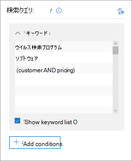
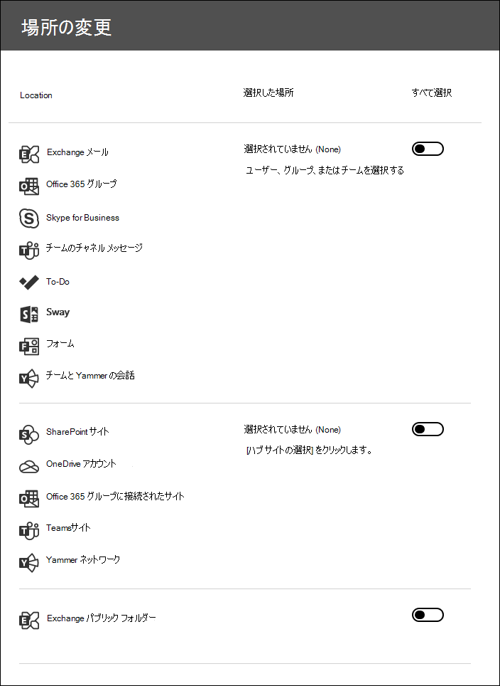

# コア電子情報開示ケースのコンテンツを検索する

コア電子情報開示ケースが作成され、ケースに関心のあるユーザーが保持された後、ケースに関連するコンテンツの1つ以上の検索を作成して実行することができます。 コア電子情報開示ケースに関連付けられている検索は、Microsoft 365 コンプライアンスセンターの [**コンテンツ検索**] ページにリストされていません。 これらの検索は、検索が関連付けられているコア eDiscover ケースの [**検索**] ページに一覧表示されます。 また、ケースに関連付けられた検索は、case メンバーのみがアクセスできることを意味します。

コア電子情報開示検索を作成するには、次のようにします。
  
1. に[https://compliance.microsoft.com](https://compliance.microsoft.com)移動し、適切な電子情報開示のアクセス許可が割り当てられているユーザーアカウントの資格情報を使用してサインインします。

2. Microsoft 365 コンプライアンスセンターの左側のナビゲーションウィンドウで、[**すべて表示**] をクリックし、[**電子情報開示 > Core**] をクリックします。

3. [**コア電子情報開示**] ページで、関連付けられた検索を作成するケースを選択し、[ **case を開く**] をクリックします。

4. ケースの**ホーム**ページで、[**検索**] タブをクリックします。
  
5. [**検索**] ページで、[**新しい検索**] をクリックします。

6. [**新しい検索**] ページで、キーワードと条件を追加して検索クエリを作成できます。 

    
  
   a. [送信日時] や [受信日時] などのキーワード、メッセージプロパティ、またはドキュメントのプロパティ (ファイル名、ドキュメントが最後に変更された日付など) を指定できます。 **AND**、 **or**、 **NOT**、 **NEAR**、 **onear**などのブール演算子を使用するより複雑なクエリを使用することができます。 また、ドキュメント内の機密情報 (社会保障番号など) を検索したり、外部共有されているドキュメントを検索したりできます。 [キーワード] ボックスを空のままにすると、指定したコンテンツの場所にあるすべてのコンテンツが検索結果に含まれます。

   b. [**キーワードリストを表示**する] チェックボックスをオンにして、各行にキーワードを入力することができます。 このようにすると、各行のキーワードは、作成された検索クエリの**or**演算子によって接続されます。 リストには、最大20個のキーワードを入力できます。

    
  
    キーワード リストを使用するのはなぜですか。各キーワードと一致するアイテム数を示す統計情報を取得することができます。これは、最も有効な (および最も有効でない) キーワードをすばやく識別するのに役立ちます。行で (かっこで囲まれた) キーワード フレーズを使用することもできます。検索統計の詳細については、「[コンテンツ検索結果のキーワード統計の表示](view-keyword-statistics-for-content-search.md)」を参照してください。

    キーワード リストの使用の詳細については、「[検索クエリを作成する](content-search.md#building-a-search-query)」を参照してください。

   c. [**条件**] をクリックして検索クエリに条件を追加すると、検索を絞り込んだり、より絞り込みのある結果セットを返すことができます。 各条件によって、作成された KQL 検索クエリに句が追加され、ユーザーが検索を開始するとそのクエリが実行されます。 条件は、**AND** 演算子によって (キーワード ボックスで指定された) キーワード クエリに論理的に結合されます。 これは、アイテムが検索結果に含める必要があることを意味します。 このように、条件を使用して結果を絞り込むことができます。

    検索クエリの作成と条件の使用の詳細については、[コンテンツ検索のキーワード クエリ](keyword-queries-and-search-conditions.md)に関するページを参照してください。

7. [**場所: 保留になっている場所**] で、検索するコンテンツの場所を選択します。同じ検索で、メールボックス、サイト、パブリック フォルダーを検索できます。

    
  
    - **すべての場所**。 組織内のすべてのコンテンツの場所を検索するには、このオプションを選択します。 このオプションを選択すると、すべての Exchange メールボックス (すべての Microsoft Teams、Yammer グループ、Office 365 グループのメールボックスを含む)、すべての SharePoint および OneDrive for Business サイト (すべての Microsoft Teams、Yammer グループ、および Office 365 グループのサイトが含まれます)、すべてのパブリックフォルダーを検索することを選択できます。
    
    - **保留中のすべての場所**。 このオプションを選択すると、ケースで電子情報開示の対象となっているすべてのコンテンツの場所を検索します。 ケースに複数の保留が含まれている場合は、すべての保留リストからのコンテンツの場所が検索されます。 また、コンテンツの場所がクエリベースの保留リストに設定されている場合、この手順で作成しているコンテンツ検索を実行すると、保留中のアイテムのみが検索されます。 たとえば、特定の日付より前に送信または作成されたアイテムを保持するクエリベースのケースホールドにユーザーが配置された場合、それらのアイテムのみが検索されます。 これは、ケースホールドクエリとコンテンツ検索クエリを**and**演算子で接続することによって実現されます。 詳細については、「 [eDiscovery ホールドの検索場所](create-ediscovery-holds.md#search-locations-on-ediscovery-hold)」を参照してください。
    
    - **特定の場所**。 検索するメールボックスとサイトを選択するには、このオプションを選択します。 このオプションを選択して [**変更**] をクリックすると、場所の一覧が表示されます。 任意の、またはすべてのユーザー、グループ、チーム、またはサイトの場所を検索することができます。 組織内のパブリックフォルダーを検索することもできます。
    
      
  
     このオプションを選択し、保留中のコンテンツの場所を検索すると、クエリベースのケース保持からのクエリは検索クエリに適用されません。 言い換えると、クエリベースの大文字小文字の保持によって保持されているコンテンツだけでなく、すべてのコンテンツが検索されます。

8. 検索するコンテンツの場所を選択したら、[**完了**]、[**次へ**] の順にクリックします。

9. [**新しい検索**] ページで、[名前を**付けて保存 & 実行**] をクリックして、検索の名前を入力します。 コア電子情報開示ケースに関連付けられた検索には、Office 365 組織内で一意の名前を指定する必要があります。

10. [**保存**] をクリックして検索の設定を保存し、検索を開始します。

  検索が完了すると、検索結果をプレビューできます。 必要に応じて、[**検索**] ページの [**更新**] をクリックして、リストに作成した検索を表示します。

11. 検索に関する統計情報を含むフライアウトページを表示し、検索の統計の表示や検索結果のエクスポートなどの他のタスクを実行するには、検索をクリックします。

## コンテンツの場所の検索に関する詳細情報

- [**ユーザー、グループ、またはチームの選択**] をクリックして検索するメールボックスを指定するときに、表示されるメールボックス ピッカーは空の状態です。これは、パフォーマンスを向上させるための仕様です。このリストに受信者を追加するには、[**ユーザー、グループ、またはチームの選択**] をクリックし、検索ボックスに名前 (3 文字以上) を入力して、名前の横にあるチェック ボックスをオンにしてから [**選択**] をクリックします。

- 検索するメールボックスの一覧に、非アクティブなメールボックス、Microsoft Teams、Yammer グループ、Office 365 グループ、および配布グループを追加することができます。 動的配布グループはサポートされていません。 Microsoft Teams、Yammer グループ、または Office 365 グループを追加する場合は、グループまたはチームのメールボックスが検索されます。グループメンバーのメールボックスは検索されません。

- サイトを追加するには、[**サイトの選択**] をクリックし、[**サイトの選択**] をもう一度クリックして、検索する各サイトの URL を入力します。 Microsoft teams、Yammer グループ、または Office 365 グループの SharePoint サイトの URL を追加することもできます。
