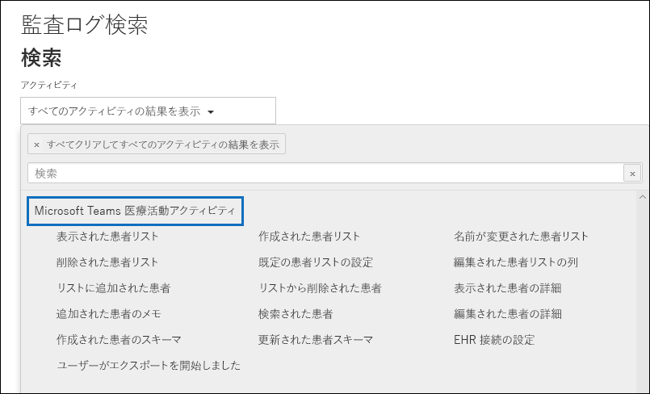

# <a name="search-the-audit-log-in-the-compliance-portal"></a>コンプライアンス ポータルで監査ログを検索する

[!include[Purview banner](../includes/purview-rebrand-banner.md)]

ユーザーが特定のドキュメントを表示したかどうか、またはメールボックスからアイテムを削除したかどうかを確認する必要がありますか。 その場合は、Microsoft Purview コンプライアンス ポータルで監査ログ検索を使用して統合監査ログを検索し、組織内のユーザーと管理者のアクティビティを確認できます。 何十もの Microsoft 365 サービスやソリューションで実行された何千ものユーザーや管理者の操作は、組織の統一された監査ログにキャプチャされ、記録されて保持されます。 組織内のユーザーは、監査ログ検索ツールを使用して、これらの操作の監査レコードを検索、表示、(CSV ファイルに) エクスポートできます。

## <a name="microsoft-365-services-that-support-auditing"></a>監査をサポートする Microsoft 365 サービス

なぜ統合監査ログが必要なのか さまざまな Microsoft 365 サービスで実行されるアクティビティを監査ログで検索できるからです。 次の表に、統合監査ログでサポートされている Microsoft 365 サービスと機能のリストを (アルファベット順に) 示します。

| Microsoft 365 サービスまたは機能 | レコードの種類|
|:---------|:---------|
| Azure Active Directory|AzureActiveDirectory、AzureActiveDirectoryAccountLogon、AzureActiveDirectoryStsLogon |
| Azure Information Protection|AipDiscover、AipSensitivityLabelAction、AipProtectionAction、AipFileDeleted、AipHeartBeat |
| コミュニケーション コンプライアンス|ComplianceSuperVisionExchange|
| コンテンツ エクスプローラー|LabelContentExplorer|
| データ コネクタ|ComplianceConnector|
| データ損失防止 (DLP)|ComplianceDLPSharePoint、ComplianceDLPExchange、DLPEndpoint|
| Dynamics 365|CRM|
| 電子情報開示|検出、AeD|
| 完全に一致するデータ|MipExactDataMatch|
| Exchange Online|ExchangeAdmin、ExchangeItem、ExchangeItemAggregated |
| フォーム|MicrosoftForms|
| 情報バリア|InformationBarrierPolicyApplication|
| Microsoft 365 Defender|AirInvestigation、AirManualInvestigation、AirAdminActionInvestigation、MS365DCustomDetection|
| Microsoft Teams|MicrosoftTeams|
| MyAnalytics|MyAnalyticsSettings|
| OneDrive for Business|OneDrive|
| Power Apps|PowerAppsApp、PowerAppsPlan|
| Power Automate|MicrosoftFlow|
| Power BI|PowerBIAudit|
| 検疫する|検疫する|
| アイテム保持ポリシーと保持ラベル|MIPLabel、MipAutoLabelExchangeItem、MipAutoLabelSharePointItem、MipAutoLabelSharePointPolicyLocation|
| 機密情報の種類|DlpSensitiveInformationType|
| 秘密度ラベル|MIPLabel、SensitivityLabelAction、SensitivityLabeledFileAction、SensitivityLabelPolicyMatch|
| 暗号化されたメッセージ ポータル|OMEPortal|
| SharePoint Online|SharePoint、SharePointFileOperation、SharePointSharingOperation、SharePointListOperation、SharePointCommentOperation |
| ストリーム|MicrosoftStream|
| 脅威インテリジェンス|ThreatIntelligence、ThreatIntelligenceUrl、ThreatFinder、ThreatIntelligenceAtpContent|
| Workplace Analytics|WorkplaceAnalytics|
| Yammer|Yammer|
| SystemSync| DataShareCreated、DataShareDeleted、GenerateCopyOfLakeData、DownloadCopyOfLakeData |

前の表に示した、各サービスで監査される操作の詳細については、この記事の「[監査されたアクティビティ](#audited-activities)」セクションを参照してください。

前の表では、Exchange Online PowerShell または PowerShell スクリプトを使用して **Search-UnifiedAuditLog** コマンドレットを使用して、対応するサービス内のアクティビティの監査ログを検索するために使用するレコードの種類の値も示しています。 一部のサービスには、同じサービス内のさまざまな種類のアクティビティに対して複数のレコードの種類があります。 監査レコードの種類のより完全なリストについては、「[Office 365 マネージメント アクティビティ API スキーマ](/office/office-365-management-api/office-365-management-activity-api-schema#auditlogrecordtype)」を参照してください。

 PowerShell を使用して監査ログを検索する方法の詳細については、以下を参照してください。

- [Search-UnifiedAuditLog](/powershell/module/exchange/search-unifiedauditlog)

- [PowerShell スクリプトを使用して監査ログを検索する](audit-log-search-script.md)

## <a name="before-you-search-the-audit-log"></a>監査ログを検索する前に

監査ログの検索を開始する前に、次の項目を必ず確認してください。

- Microsoft 365 および Office 365 Enterprise 組織では、監査ログ検索は規定でオンになっています。 監査ログ検索が有効になっていることを確認するには、Exchange Online PowerShell で次のコマンドを実行します。

  ```powershell
  Get-AdminAuditLogConfig | FL UnifiedAuditLogIngestionEnabled
  ```

  *UnifiedAuditLogIngestionEnabled* プロパティの値`True`は、監査ログ検索が有効になっていることを示します。 詳細については、「[監査ログの検索を有効または無効にする](turn-audit-log-search-on-or-off.md)」をご覧ください。

- 監査ログを検索するには、Exchange Online で閲覧限定の監査ログまたは監査ログの役割が割り当てられている必要があります。既定では、これらの役割は Exchange 管理センターの [**アクセス許可**] ページでコンプライアンス管理役割グループまたは組織管理役割グループに割り当てられています。Office 365 および Microsoft 365 のグローバル管理者は自動的に、組織管理役割グループのメンバーとして Exchange Online に追加されます。最小限の特権レベルで監査ログを検索する権限をユーザーに付与するには、Exchange Online でカスタムの役割グループを作成し、閲覧限定の監査ログまたは監査ログの役割を追加し、この新しい役割グループのメンバーとしてユーザーを追加します。詳細については、「[Exchange Online での役割グループの管理](/Exchange/permissions-exo/role-groups)」を参照してください。

  > コンプライアンス ポータルの **[アクセス許可]** ページでユーザーに View-Only Audit Logs (閲覧限定の監査ログ) または Audit Logs (監査ログ) の役割を割り当てると、監査ログを検索できなくなります。Exchange Online でアクセス許可を割り当てる必要があります。これは、監査ログの検索に使用される基本のコマンドレットが ExchangeOnline コマンドレットだからです。

- 監査対象アクティビティがユーザーまたは管理者によって実行されると、監査レコードが生成され、組織の監査ログに格納されます。監査レコードの保持期間 (および監査ログで検索可能な期間) は、Office 365 または Microsoft 365 Enterprise サブスクリプション、具体的には、特定のユーザーに割り当てられたライセンスの種類によって異なります。

  - Office 365 E5 または Microsoft 365 E5 ライセンスが割り当てられたユーザー (または Microsoft 365 E5 Compliance または Microsoft 365 E5 eDiscovery and Audit アドオン ライセンスを持っているユーザー) の場合、Azure Active Directory、Exchange、および SharePoint アクティビティの監査レコードは、既定で 1 年間保持されます。 また、組織では、監査ログの保持ポリシーを作成して、その他のサービスのアクティビティについての監査レコードを最大 1 年間保持します。 詳細については、「[監査ログ保持ポリシーを管理する](audit-log-retention-policies.md)」を参照してください。

    > [!NOTE]
    > 監査レコードを 1 年間保持するプライベート プレビュー プログラムに参加した場合、一般提供のロールアウト日前に生成された監査レコードの保持期間はリセットされません。

  - その他 (E5 以外) の Office 365 または Microsoft 365 ライセンスが割り当てられているユーザーの場合、監査レコードは 90 日間保持されます。 統合監査ログをサポートする Office 365 および Microsoft 365 サブスクリプションのリストについては、「[セキュリティおよびコンプライアンス ポータル サービスの説明](/office365/servicedescriptions/office-365-platform-service-description/office-365-securitycompliance-center)」を参照してください。

    > [!NOTE]
    > デフォルトでメールボックス監査がオンになっている場合でも、一部のユーザーのメールボックス監査イベントが、コンプライアンス ポータルまたは Office 365 マネージメント アクティビティ API の監査ログ検索で見つからないことに気付く場合があります。詳細については、「[メールボックス監査ログの詳細](enable-mailbox-auditing.md#more-information)」を参照してください。

- 組織の監査ログ検索をオフにしたい場合は、Exchange Online PowerShell で次のコマンドを実行します。

  ```powershell
  Set-AdminAuditLogConfig -UnifiedAuditLogIngestionEnabled $false
  ```

    監査検索を再度有効にするには、Exchange Online PowerShell で次のコマンドを実行できます。

  ```powershell
  Set-AdminAuditLogConfig -UnifiedAuditLogIngestionEnabled $true
  ```

  詳細については、「[監査ログの検索を無効にする](turn-audit-log-search-on-or-off.md)」を参照してください。

- 前述のように、監査ログの検索に使用される基になるコマンドレットは Exchange Online コマンドレットであり、これは **Search-UnifiedAuditLog** です。つまり、コンプライアンス ポータルの **[監査]** ページにある検索ツールを使用する代わりに、このコマンドレットを使用して監査ログを検索できます。 このコマンドレットは、Exchange Online PowerShell で実行する必要があります。 詳細については、[Search-UnifiedAuditLog](/powershell/module/exchange/search-unifiedauditlog) を参照してください。

  **Search-UnifiedAuditLog** コマンドレットによって返された検索結果を CSV ファイルにエクスポートする方法の詳細については、「[監査ログ レコードをエクスポート、構成、表示する](export-view-audit-log-records.md#tips-for-exporting-and-viewing-the-audit-log)」の「監査ログをエクスポート、表示するためのヒント」のセクションを参照してください。

- プログラムを使用して監査ログからデータをダウンロードする場合、PowerShell スクリプトを使用する代わりに、Office 365 マネージメント アクティビティ API を使用することをお勧めします。Office 365 マネージメント アクティビティ API は、組織の運用、セキュリティ、コンプライアンス監視ソリューションの開発に使用する REST Web サービスです。詳細については、「[Office 365 マネージメント アクティビティ API リファレンス](/office/office-365-management-api/office-365-management-activity-api-reference)」を参照してください。

- Azure Active Directory (Azure AD) は、Microsoft 365 のディレクトリ サービスです。統合監査ログには、<a href="https://go.microsoft.com/fwlink/p/?linkid=2024339" target="_blank">Microsoft 365 管理センター</a>または Azure 管理ポータルで実行されたユーザー、グループ、アプリケーション、ドメイン、ディレクトリの各アクティビティが含まれます。Azure AD の完全な一覧については、「[Azure Active Directory 監査レポート イベント](/azure/active-directory/reports-monitoring/concept-audit-logs)」を参照してください。

- Microsoft は、イベント発生後に、対応する監査レコードが監査ログ検索の結果に返される時間を保証しません。 コア サービス (Exchange、SharePoint、OneDrive、Teams など) の場合、イベントの可用性は通常 60 分から 90 分です。 その他のサービスでは、監査レコードの可用性が長くなる可能性があります。 ただし、(サーバーの停止など) 避けられない問題の中には、監査レコードの可用性を遅延させる、監査サービスの外部で発生する避けられない問題もあります。 これらの理由により、Microsoft は時間を確約しておりません。

- Power BI の監査ログは、既定で有効になりません。監査ログで Power BI アクティビティを検索するには、Power BI 管理ポータルで監査を有効にする必要があります。手順については、[Power BI 管理ポータル](/power-bi/service-admin-portal#audit-logs)の [監査ログ] セクションを参照してください。

## <a name="search-the-audit-log"></a>監査ログの検索

以下に、Microsoft 365 で監査ログを検索するためのプロセスを示します。

[手順 1: 監査ログの検索を実行する](#step-1-run-an-audit-log-search)

[手順 2: 検索結果を表示する](#step-2-view-the-search-results)

[手順 3: 検索結果をファイルにエクスポートする](#step-3-export-the-search-results-to-a-file)

### <a name="step-1-run-an-audit-log-search"></a>手順 1: 監査ログの検索を実行する

1. <https://compliance.microsoft.com> に移動し、サインインします。

    > [!TIP]
    > (通常のセッションではなく) プライベート ブラウズ セッションを使用してコンプライアンス ポータルにアクセスします。これにより、現在ログオンして、利用している資格情報が使用されなくなります。**Ctrl + Shift + N** キーを押して、Microsoft Edge で InPrivate ブラウズ セッションを開くか、Google Chrome のプライベート ブラウズ セッション (シークレット ウィンドウと呼ばれます) を開きます。

2. コンプライアンス ポータルの左側のウィンドウで、**[監査]** をクリックします。

    [**監査**] ページが表示されます。

    ![検索条件を設定し、[検索] をクリックしてレポートを実行する。](../media/AuditLogSearchPage1.png)

    > [!NOTE]
    > **[ユーザーと管理者のアクティビティの記録を開始する]** リンクが表示される場合は、クリックして監査を有効にします。このリンクが表示されない場合、組織の監査機能は有効です。

3. **[検索]** タブで、次の検索条件を設定します。

   1. **開始日** と **終了日**。既定では過去 7 日間が選択されています。特定の期間内に発生したイベントを表示するには、その日付と時刻の範囲を選択します。日付と時刻は、現地時間で指定します。指定できる最大の日付範囲は 90 日間です。選択された日付範囲が 90 日間より長い場合、エラーが表示されます。

    > [!TIP]
    > 最大の日付範囲である 90 日を使用する場合は、[**開始日**] で現在の時刻を選択してください。それ以外の時刻を選択すると、開始日が終了日より前であるというエラーが返されます。過去 90 日以内に監査を有効にした場合、最大の日付範囲の開始日を監査を有効にした日付より前にすることはできません。

   2. [**アクティビティ**]: ドロップダウン リストをクリックすると、検索できるアクティビティが表示されます。ユーザーと管理者のアクティビティが、関連するアクティビティのグループに編成されています。特定のアクティビティを選択することも、アクティビティ グループ名をクリックして、グループ内のすべてのアクティビティを選択することもできます。選択したアクティビティをクリックして、選択を解除することもできます。検索の実行後、選択したアクティビティの監査ログ エントリのみが表示されます。[**すべてのアクティビティの結果を表示**] を選択すると、選択したユーザーまたはユーザーのグループによって実行されたすべてのアクティビティの結果が表示されます。<br/><br/>監査ログには、100 件以上のユーザーおよび管理者アクティビティが記録されます。各種サービスの各アクティビティの説明を確認するには、本記事のこのトピックの「**監査されるアクティビティ**」タブをクリックしてください。

   3. **ユーザー**: このボックスをクリックし、検索結果を表示する 1 人以上のユーザーを選択します。このボックスで選択したユーザーによって実行された、選択されたアクティビティの監査ログ エントリが結果の一覧に表示されます。組織のすべてのユーザー (およびサービス アカウント) のエントリを返すには、このボックスを空白のままにします。

   4. **ファイル、フォルダーまたはサイト**: 指定したキーワードを含むファイルまたはフォルダーに対するアクティビティを検索するには、ファイルまたはフォルダー名の一部またはすべてを入力します。ファイルまたはフォルダーの URL を指定することもできます。URL を使用する場合、必ず全ての URL パスを入力してください。または URL の一部だけを入力する場合は、特殊文字またはスペースを含めることはできません。(ただし、ワイルドカード文字 (\*) の使用はサポートされています)。<br/><br/>組織内のすべてのファイルおよびフォルダーのエントリを返すには、このボックスを空白のままにします。

    > [!TIP]
    >
    > - ある **サイト** に関するすべてのアクティビティを検索する場合、URL の後ろにワイルドカード文字 (\*) を追加して、そのサイトのすべてのエントリが返されるようにします (例: `"https://contoso-my.sharepoint.com/personal*"`)。
    >
    > - 特定の **ファイル** に関連するすべてのアクティビティを探す場合は、ファイル名の前にワイルドカード文字 (\*) を追加すると、そのファイルのすべてのエントリが返されます (例: `"*Customer_Profitability_Sample.csv"`)。

4. [**検索**] をクリックして、設定した検索条件で検索を実行します。

   検索結果が読み込まれ、しばらくすると、それらが新しいページに表示されます。検索が完了すると、見つかった検索結果の件数が表示されます。最大 50,000 件のイベントが 150 件ずつ表示されます。検索条件に一致するイベントが 50,000 件を超える場合は、返された 50,000 件の並べ替えられていないイベントのみが表示されます。

   

#### <a name="tips-for-searching-the-audit-log"></a>監査ログを検索するためのヒント

- アクティビティ名をクリックすると、検索する特定のアクティビティを選択できます。また、グループ名をクリックして、グループ内のすべてのアクティビティ (たとえば、**ファイルおよびフォルダー アクティビティ**) を検索することもできます。アクティビティを選択した場合、それをクリックして選択を取り消すことができます。さらに、検索ボックスを使用して、入力したキーワードを含むアクティビティを表示することもできます。

  

- Exchange 管理監査ログのイベントを表示するには、[**アクティビティ**] の一覧で [**すべてのアクティビティの結果を表示**] を選択する必要があります。この監査ログのイベントについては、結果の [**アクティビティ**] 列にコマンドレット名 (**Set-Mailbox** など) が表示されます。詳細については、この記事の内容にある [**監査されるアクティビティ**] タブ、[**Exchange 管理アクティビティ**] の順にクリックしてください。

  同様に、**[アクティビティ]** のリストに対応する項目がない監査アクティビティがいくつかあります。これらのアクティビティの操作の名前がわかっている場合は、すべてのアクティビティを検索し、検索結果を CSV ファイルにエクスポートした後に操作をフィルター処理できます。

- 現在の検索条件をクリアするには、[**クリア**] をクリックします。日付の範囲は、既定の過去 7 日間に戻ります。[**すべてをクリアしてすべてのアクティビティの結果を表示する**] をクリックして、選択したすべてのアクティビティを取り消すこともできます。

- 50,000 件の結果が見つかった場合は、検索条件を満たすイベントが 50,000 件を超えていると考えることができます。検索条件を絞り込んで検索を再実行して結果を返す数を減らすか、**[結果のエクスポート]**\>**[すべての結果をダウンロード]** を選択して、すべての検索結果をエクスポートできます。

### <a name="step-2-view-the-search-results"></a>手順 2: 検索結果を表示する

監査ログの検索の結果は、**[監査ログの検索]** ページの **[結果]** の下に表示されます。前述のとおり、最大 50,000 件 (最新) のイベントが 150 件ずつ表示されます。さらにイベントを表示するには、結果ウィンドウにあるスクロール バーを使用するか、**Shift + End** キーを押して、次の 150 件のイベントを表示することができます。

検索結果には、検索によって返された各イベントに関する次の情報が含まれます。

- [**日付**]: イベントが発生した日付と時刻 (ローカル時刻)。

- **IP アドレス**: アクティビティが記録されたときに使用されたデバイスの IP アドレス。IP アドレスは、IPv4 または IPv6 アドレスの形式で表示されます。

   > [!NOTE]
  > 一部のサービスでは、このフィールドに表示される値は、ユーザーに代わってサービスを呼び出す信頼できるアプリケーション (Office on the web アプリなど) の IP アドレスであり、アクティビティを実行したユーザーが使用するデバイスの IP アドレスではない場合があります。 また、Azure Active Directory 関連のイベントの管理者のアクティビティ (またはシステムアカウントによって実行されるアクティビティ) の場合、IP アドレスはログに記録されず、このフィールドに表示される値は `null` になります。

- [**ユーザー**]: イベントをトリガーしたアクションを実行したユーザー (またはサービス アカウント)。

- **アクティビティ**: ユーザーが実行したアクティビティ。この値は [**アクティビティ**] ドロップダウン リストで選択したアクティビティと一致します。Exchange 管理監査ログのイベントの場合は、この列の値は、Exchange コマンドレットです。

- **項目**: 対応するアクティビティの結果として作成または変更されたオブジェクト。たとえば、表示または変更されたファイルや、更新されたユーザー アカウントなど。すべてのアクティビティについて、この列の値が表示されるとは限りません。

- **詳細**: アクティビティに関する追加情報。この列の値も、すべてのアクティビティについて表示されるとは限りません。

> [!TIP]
> 検索結果を並べ替えるには、[**結果**] の列見出しをクリックします。検索結果を昇順または降順で並べ替えることができます。検索結果を日付の古い順または新しい順に並べ替える場合は、[**日付**] ヘッダーをクリックします。

#### <a name="view-the-details-for-a-specific-event"></a>特定のイベントの詳細を表示する

イベントの詳細情報を表示するには、検索結果一覧のイベント レコードをクリックします。イベント レコードの詳細なプロパティが記載されたポップアップ ページが表示されます。表示されるプロパティは、イベントが発生するサービスによって変わります。 

### <a name="step-3-export-the-search-results-to-a-file"></a>手順 3: 検索結果をファイルにエクスポートする

監査ログの検索の結果を、ローカル コンピューター上のコンマ区切り値 (CSV) ファイルにエクスポートできます。このファイルを Microsoft Excel で開き、検索、並べ替え、フィルター処理、および単一の列 (複数値のプロパティが含まれる) の複数列への分割などの機能を使用できます。

1. 監査ログの検索を実行して、目的の結果が得られるまで検索条件を変更します。

2. 検索結果ページで、[**エクスポート**] > 、[**すべての結果をダウンロード**] の順にクリックします。

   検索条件を満たす監査ログからのすべてのエンティティは、CSV ファイルにエクスポートされます。 監査ログからの生データは、CSV ファイルにダウンロードされます。 監査ログ エントリからの追加情報は、CSV ファイルの [**AuditData**] という名前の列に含まれます。

     > [!IMPORTANT]
     > 1 回の監査ログの検索で、最大 50,000 件のエントリを CSV ファイルにダウンロードできます。50,000 件のエントリが CSV ファイルにダウンロードされた場合、検索条件に一致したエントリが 50,000 件を超える可能性があります。この制限を超えてエクスポートするには、日付範囲を使用して監査ログ エントリの件数を削減してみてください。50,000 件を超えるエントリをエクスポートするには、日付範囲を狭めて検索を複数回実行することが必要な場合があります。

3. エクスポート処理が完了すると、ウィンドウの上部に、CSV ファイルを開いてローカル コンピュータに保存するように促すメッセージが表示されます。ダウンロード フォルダーでも、CSV ファイルにアクセスできます。

#### <a name="more-information-about-exporting-and-viewing-audit-log-search-results"></a>監査ログの検索結果のエクスポートと表示に関する詳細情報

- すべての検索結果をダウンロードすると、CSV ファイルには **CreationDate**、**UserIds**、**Operations**、**AuditData** の各列が含まれます。 **AuditData** 列には、各イベントに関する追加情報が含まれます (コンプライアンス ポータルで検索結果を表示するときに、ポップアップ ページに表示される詳細情報と同様)。 この列のデータは、監査ログ レコードの複数のプロパティを含む JSON オブジェクトで構成されています。 この JSON オブジェクトに含まれる *property:value* の各ペアは、コンマで区切られます。 Excel の Power Query エディターに含まれる JSON 変換ツールを使用すると、[**AuditData**] 列を複数の列に分割し、JSON オブジェクトのプロパティごとに個別の列を設定できます。 このようにすると、これらの 1 つ以上のプロパティで並べ替えやフィルター処理を行うことができます。 Power Query エディターを使用して JSON オブジェクトを変換するための詳しい手順については、「[監査ログ レコードをエクスポート、構成、表示する](export-view-audit-log-records.md)」を参照してください。

  **AuditData** 列を分割した後、[**操作**] 列でフィルター処理して、特定の種類のアクティビティの詳細なプロパティを表示できます。

- さまざまなサービスのイベントを含む検索クエリからすべての結果をダウンロードした場合、CSV ファイルの **AuditData** 列には、アクションが実行されたサービスに応じて、異なるプロパティが含まれます。たとえば、Exchange および Azure AD の監査ログのエントリには、アクションが成功したかどうかを示す **ResultStatus** という名前のプロパティが含まれます。SharePoint で発生したイベントには、このプロパティは含まれませんが、ファイルおよびフォルダーに関連するアクティビティのサイト URL を識別するプロパティが含まれます。この動作の違いを軽減するために、異なる検索を使用して、1 つのサービスのみのアクティビティに関する結果をエクスポートすることを検討してください。

  すべての結果をダウンロードする場合に CSV ファイルの **[AuditData]** 列に一覧表示されるプロパティの多く、および各プロパティが適用されるサービスについては、「[監査ログの詳細なプロパティ](detailed-properties-in-the-office-365-audit-log.md)」を参照してください。

## <a name="audited-activities"></a>監査されるアクティビティ

このセクションの表では、Microsoft 365 で監査されるアクティビティについて説明します。これらのイベントは、セキュリティおよびコンプライアンス ポータルで監査ログを探索することで検索できます。

次の表は、関連するアクティビティまたは特定のサービスのアクティビティをグループ別にまとめたものです。これらの表には、**[アクティビティ]** ドロップダウン リストに表示されるフレンドリ名、および監査レコードの詳細情報および CSV ファイル (検索結果を CSV にエクスポートした場合) に表示される対応する操作の名前が含まれます。詳細情報については、「[監査ログの詳細なプロパティ](detailed-properties-in-the-office-365-audit-log.md)」を参照してください。

特定の表に移動するには、次のいずれかのリンクをクリックしてください。

:::row:::
    :::column:::
        [ファイル アクティビティとページ アクティビティ](#file-and-page-activities)
    :::column-end:::
    :::column:::
        [フォルダー アクティビティ](#folder-activities)
    :::column-end:::
    :::column:::
        [SharePoint リスト アクティビティ](#sharepoint-list-activities)
    :::column-end:::
:::row-end:::

:::row:::
    :::column:::
        [共有アクティビティとアクセス要求アクティビティ](#sharing-and-access-request-activities)
    :::column-end:::
    :::column:::
        [同期アクティビティ](#synchronization-activities)
    :::column-end:::
    :::column:::
        [サイトの権限のアクティビティ](#site-permissions-activities)
    :::column-end:::
:::row-end:::

:::row:::
    :::column:::
        [サイト管理アクティビティ](#site-administration-activities)
    :::column-end:::
    :::column:::
        [Exchange メールボックスのアクティビティ](#exchange-mailbox-activities)
    :::column-end:::
    :::column:::
        [ユーザー管理アクティビティ](#user-administration-activities)
    :::column-end:::
:::row-end:::

:::row:::
    :::column:::
        [Azure AD グループ管理アクティビティ](#azure-ad-group-administration-activities)
    :::column-end:::
    :::column:::
        [アプリケーション管理アクティビティ](#application-administration-activities)
    :::column-end:::
    :::column:::
        [役割管理アクティビティ](#role-administration-activities)
    :::column-end:::
:::row-end:::

:::row:::
    :::column:::
        [ディレクトリ管理アクティビティ](#directory-administration-activities)
    :::column-end:::
    :::column:::
        [電子情報開示アクティビティ](#ediscovery-activities)
    :::column-end:::
    :::column:::
        [電子情報開示 (プレミアム) のアクティビティ](#ediscovery-premium-activities)
    :::column-end:::
:::row-end:::

:::row:::
    :::column:::
        [Power BI アクティビティ](#power-bi-activities)
    :::column-end:::
    :::column:::
        [Microsoft Workplace Analytics](#workplace-analytics-activities)
    :::column-end:::
    :::column:::
        [Microsoft Teams アクティビティ](#microsoft-teams-activities)
    :::column-end:::
:::row-end:::

:::row:::
    :::column:::
        [Microsoft Teams 医療活動アクティビティ](#microsoft-teams-healthcare-activities)
    :::column-end:::
    :::column:::
        [Microsoft Teams Shifts アクティビティ](#microsoft-teams-shifts-activities)
    :::column-end:::
    :::column:::
        [Yammer アクティビティ](#yammer-activities)
    :::column-end:::
:::row-end:::

:::row:::
    :::column:::
        [Microsoft Power Automate のアクティビティ](#microsoft-power-automate-activities)
    :::column-end:::
    :::column:::
        [Microsoft Power Apps のアクティビティ](#microsoft-power-apps-activities)
    :::column-end:::
    :::column:::
        [Microsoft Stream アクティビティ](#microsoft-stream-activities)
    :::column-end:::
:::row-end:::

:::row:::
    :::column:::
        [コンテンツ エクスプローラー アクティビティ](#content-explorer-activities)
    :::column-end:::
    :::column:::
        [検疫アクティビティ](#quarantine-activities)
    :::column-end:::
    :::column:::
        [Microsoft Forms アクティビティ](#microsoft-forms-activities)
    :::column-end:::
:::row-end:::

:::row:::
    :::column:::
        [機密ラベル アクティビティ](#sensitivity-label-activities)
    :::column-end:::
    :::column:::
        [アイテム保持ポリシーと保持ラベルのアクティビティ](#retention-policy-and-retention-label-activities)
    :::column-end:::
    :::column:::
        [ブリーフィング メール アクティビティ](#briefing-email-activities)
    :::column-end:::
:::row-end:::

:::row:::
    :::column:::
        [MyAnalytics アクティビティ](#myanalytics-activities)
    :::column-end:::
    :::column:::
        [情報バリア アクティビティ](#information-barriers-activities)
    :::column-end:::
    :::column:::
        [処理確認アクティビティ](#disposition-review-activities)
    :::column-end:::
:::row-end:::

:::row:::
    :::column:::
        [コミュニケーション コンプライアンス アクティビティ](#communication-compliance-activities)
    :::column-end:::
    :::column:::
        [アクティビティを報告する](#report-activities)
    :::column-end:::
    :::column:::
        [Exchange 管理アクティビティ](#exchange-admin-audit-log)
    :::column-end:::
:::row-end:::

:::row:::
    :::column:::
        [暗号化されたメッセージ ポータル アクティビティ](#encrypted-message-portal-activities)
    :::column-end:::
    :::column:::
        [SystemSync アクティビティ](#systemsync-activities)
    :::column-end:::
    :::column:::
        
    :::column-end:::
:::row-end:::

### <a name="file-and-page-activities"></a>ファイル アクティビティとページ アクティビティ

次の表では、SharePoint Online および OneDrive for Business 内のファイル アクティビティとページ アクティビティについて説明します。

|フレンドリ名|操作​​|説明|
|:-----|:-----|:-----|
|ファイルがアクセスされました|FileAccessed|ユーザーまたはシステム アカウントがファイルにアクセスします。ユーザーがファイルにアクセスすると、同じユーザーの FileAccessed イベントは、次の 5 分間、同じファイルに対して再度ログに記録されません。|
|(なし)|FileAccessedExtended|これは、"ファイルへのアクセス" (FileAccessed) アクティビティに関連します。同じユーザーが長時間 (最大 3 時間) にわたって、ファイルに継続的にアクセスすると、FileAccessedExtended イベントがログに記録されます。 <br/><br/> FileAccessedExtended イベントをログに記録する目的は、ファイルが継続的にアクセスされたときにログに記録される FileAccessed イベントの数を減らすことにあります。これにより、本質的に同じユーザーのアクティビティであるファイル アクセスに対する無意味な複数の FileAccessed レコードが減り、初期の (より重要な) FileAccessed イベントに注目できます。|
|ファイルの保持ラベルが変更されました|ComplianceSettingChanged|保持ラベルがドキュメントに適用またはドキュメントから削除されました。 このイベントは、保持ラベルが手動または自動でメッセージに適用されたときにトリガーされます。|
|レコードのステータスがロックに変更されました|LockRecord|ドキュメントをレコードとして分類する保持ラベルのレコード ステータスがロックされました。 これは、ドキュメントを変更したり削除したりできないことを意味します。 ドキュメントのレコード ステータスを変更できるのは、共同作成者以上のアクセス許可がサイトで割り当てられているユーザーだけです。|
|レコード ステータスが、ロック解除に変更されました|UnlockRecord|ドキュメントをレコードとして分類する保持ラベルのレコード ステータスのロックが解除されました。 これは、ドキュメントを変更したり削除したりできることを意味します。 ドキュメントのレコード ステータスを変更できるのは、共同作成者以上のアクセス許可がサイトで割り当てられているユーザーだけです。|
|ファイルのチェックイン|FileCheckedIn|ユーザーがドキュメント ライブラリからチェックアウトしたドキュメントをチェックインしました。|
|ファイルのチェックアウト|FileCheckedOut|ユーザーがドキュメント ライブラリにあるドキュメントをチェックアウトしました。ユーザーは、共有されているドキュメントをチェックアウトし、変更できます。|
|ファイルのコピー|FileCopied|ユーザーがサイトのドキュメントをコピーしました。コピーしたファイルは、サイトの別のフォルダーに保存できます。|
|ファイルの削除|FileDeleted|ユーザーがサイトからドキュメントを削除しました。|
|ごみ箱からのファイルの削除|FileDeletedFirstStageRecycleBin|ユーザーがサイトのごみ箱からファイルを削除しました。|
|第 2 段階のごみ箱からのファイルの削除|FileDeletedSecondStageRecycleBin|ユーザーがサイトの第 2 段階のごみ箱からファイルを削除しました。|
|レコードとしてマークされたファイルの削除|RecordDelete|レコードとしてマークされたドキュメントまたはメールが削除されました。 アイテムがレコードとしてみなされるのは、アイテムをレコードとしてマークする保持ラベルがコンテンツに適用されている場合です。|
|検出されたドキュメントの秘密度の不一致|DocumentSensitivityMismatchDetected|ユーザーが、機密ラベルで保護されているサイトにドキュメントをアップロードし、そのドキュメントの機密ラベルが、サイトに適用されている機密ラベルよりも優先度が高くなっています。 たとえば、「社外秘」というラベルの付いたドキュメントが、「一般」というラベルの付いたサイトにアップロードされている場合です。 <br/><br/> ドキュメントの機密ラベルが、サイトに適用されている機密ラベルよりも優先度が低い場合、このイベントは発生しません。 たとえば、「一般」というラベルの付いたドキュメントが、「社外秘」というラベルの付いたサイトにアップロードされている場合です。 機密ラベルの優先度の詳細については、「[ラベルの優先度 (順序の問題)](sensitivity-labels.md#label-priority-order-matters)」を参照してください。|
|ファイルでのマルウェアの検出|FileMalwareDetected|SharePoint ウイルス対策エンジンにより、ファイル内でマルウェアが検出されました。|
|ファイル チェックアウトの破棄|FileCheckOutDiscarded|ユーザーは、チェックアウトしたファイルを破棄します (または元に戻します)。つまり、チェックアウト時にファイルに加えた変更はすべて破棄され、ドキュメント ライブラリ内のドキュメントのバージョンには保存されないということです。|
|ファイルのダウンロード|FileDownloaded|ユーザーがサイトからドキュメントをダウンロードしました。|
|ファイルの変更|FileModified|ユーザーまたはシステム アカウントがサイトにあるドキュメントのコンテンツまたはプロパティを変更します。 同じユーザーが同じドキュメントのコンテンツまたはプロパティを変更すると、システムは別の FileModified イベントをログに記録するまで 5 分待機します。|
|(なし)|FileModifiedExtended|これは、"ファイルの変更" (FileModified) アクティビティに関連しています。同じユーザーが長時間 (最大 3 時間) にわたって、ファイルの変更を継続的に行うと、FileModifiedExtended イベントがログに記録されます。 <br/><br/> FileModifiedExtended イベントをログに記録する目的は、ファイルの変更が継続的に行われたときにログに記録される FileModified イベントの数を減らすことにあります。これにより、本質的に同じユーザーのアクティビティであるファイル変更に対する無意味な複数の FileModified レコードを減り、初期 (のより重要な) FileModified イベントに注目できます。|
|ファイルの移動|FileMoved|ユーザーがドキュメントをサイトの現在の場所から新しい場所に移動しました。|
|(なし)|FilePreviewed|ユーザーが SharePoint または OneDrive for Business サイトにあるファイルをプレビューします。 通常、これらのイベントは、イメージ ギャラリーの表示などの 1 つのアクティビティに基づいて、大きいボリュームで発生します。|
|実行された検索クエリ|SearchQueryPerformed|ユーザーまたはシステム アカウントが SharePoint または OneDrive for Business で検索を実行します。サービス アカウントにより検索クエリが実行される一般的なシナリオとして、電子開示情報の保留またはアイテム保持ポリシーがサイトおよび OneDrive アカウントに適用される場合や、保持ラベルまたは機密ラベルがサイト コンテンツに自動適用される場合があります。|
|リサイクルされたファイル | FileRecycled | ユーザーはファイルを SharePoint のごみ箱に移動しました。 |
|リサイクルされたフォルダー | FolderRecycled | ユーザーはフォルダーを SharePoint のごみ箱に移動しました。 |
|リサイクルされたファイルのすべてのマイナー バージョン|FileVersionsAllMinorsRecycled|ユーザーが、ファイルのバージョン履歴からすべてのマイナー バージョンを削除しました。削除されたバージョンは、サイトのごみ箱に移動されます。|
|ファイルのすべてのバージョンのリサイクル|FileVersionsAllRecycled|ユーザーが、ファイルのバージョン履歴からすべてのバージョンを削除しました。削除されたバージョンは、サイトのごみ箱に移動されます。|
|ファイルのバージョンのリサイクル|FileVersionRecycled|ユーザーが、ファイルのバージョン履歴から 1 つのバージョンを削除しました。削除されたバージョンは、サイトのごみ箱に移動されます。|
|ファイルの名前変更|FileRenamed|ユーザーがドキュメントの名前を変更しました。|
|ファイルの復元|FileRestored|ユーザーがサイトのごみ箱からドキュメントを復元しました。|
|ファイルのアップロード|FileUploaded|ユーザーがサイトのフォルダーにドキュメントをアップロードしました。|
|ページの表示|PageViewed|ユーザーがサイトのページを表示しました。 ドキュメント ライブラリにあるファイルの Web ブラウザーを使用した表示は、これに含まれません。 ユーザーがページを表示すると、同じユーザーの PageViewed イベントは、次の 5 分間、同じページに対して再度ログに記録されません。|
|(なし)|PageViewedExtended|これは、"ページの表示" (PageViewed) アクティビティに関連しています。同じユーザーが長時間 (最大 3 時間) にわたって、継続的に Web ページを表示すると、PageViewedExtended イベントがログに記録されます。 <br/><br/> PageViewedExtended イベントをログに記録する目的は、ページが継続的に表示されたときにログに記録される PageViewed イベントの数を減らすことにあります。これにより、本質的に同じユーザーのアクティビティであるページ表示に対する無意味な複数の PageViewed レコードが減り、初期 (のより重要な) PageViewed イベントに注目できます。|
|クライアントが表示をシグナル|ClientViewSignaled|ユーザーのクライアント (Web サイトやモバイル アプリなど) が、示されるページをユーザーが表示したことをシグナルしました。 多くの場合、ページでの PagePrefetched イベントに続いてこのアクティビティがログに記録されます。 <br/><br/>**注**: ClientViewSignaled イベントはサーバーではなくクライアントによりシグナルされるため、イベントがサーバーによってログに記録されず、監査ログに表示されない場合があります。 また、監査レコードの情報の信頼性が低い可能性もあります。 ただし、ユーザーの ID はシグナルの作成に使用されたトークンによって検証されるため、対応する監査レコードに記載されているユーザーの ID は正確です。 システムは、同じユーザーのクライアントがページがユーザーによって再び表示されたことを通知するときに、同じイベントをログに記録するまで 5 分待機します。|
|(なし)|PagePrefetched|示されるページにユーザーがアクセスした際のパフォーマンスを上げるため、ユーザーのクライアント (Web サイトやモバイル アプリなど) がそのページを要求しました。 このイベントは、ページの内容がユーザーのクライアントに配信されたことを示すため、ログに記録されます。 このイベントは、ユーザーがページに移動したことをはっきりと示します。 <br/><br/> (ユーザーの要求に従って) ページのコンテンツがクライアントによってレンダリングされると、ClientViewSignaled イベントが生成されます。 プレフェッチの指摘はすべてのクライアントでサポートされているわけではないため、プレフェッチされた一部のアクティビティは PageViewed イベントとしてログ記録される可能性があります。|

#### <a name="frequently-asked-questions-about-fileaccessed-and-filepreviewed-events"></a>FileAccessed および FilePreviewed イベントに関するよくある質問

**ユーザー以外のアクティビティによって、「OneDriveMpc-Transform_Thumbnail」などのユーザー エージェントを含む FilePreviewed 監査レコードがトリガーされる可能性はありますか?**

ユーザー以外の操作がこのようなイベントを生成するシナリオは認識していません。ユーザー プロファイル カードを開く (Outlook on the web のメッセージで名前またはメール アドレスをクリックする) などのユーザー操作は、同様のイベントを生成します。

**OneDriveMpc-Transform_Thumbnail の呼び出しは、常にユーザーによって意図的にトリガーされていますか?**

いいえ。ただし、ブラウザーの事前取得の結果として、同様のイベントがログに記録される可能性があります。

**Microsoft が登録した IP アドレスからの FilePreviewed イベントが表示された場合、それはプレビューがユーザーのデバイスの画面に表示されたことを意味しますか?**

いいえ。ブラウザーの事前取得の結果として、イベントがログに記録された可能性があります。

**ドキュメントをプレビューしているユーザーが FileAccessed イベントを生成するシナリオはありますか?**

FilePreviewed イベントと FileAccessed イベントの両方が、ユーザーの呼び出しがファイルの読み取り (またはファイルのサムネイル レンダリングの読み取り) につながったことを示します。 これらのイベントはプレビューとアクセスの意図を一致させることを目的としていますが、イベントの区別はユーザーの意図を保証するものではありません。

#### <a name="the-appsharepoint-user-in-audit-records"></a>監査レコード内の app\@sharepoint ユーザー

一部のファイルアクティビティ (およびその他の SharePoint 関連のアクティビティ) の監査レコードでは、([ユーザー] および [UserId] フィールドで識別された) アクティビティを実行したユーザーが app@sharepoint であることがわかります。 これは、アクティビティを実行した「ユーザー」がアプリケーションだったことを示します。 この場合、アプリケーションには、ユーザー、管理者、またはサービスの代理として、組織全体のアクション (SharePoint サイトまたは OneDrive アカウント検索など) を実行するためのアクセス許可が SharePoint に与えられています。 アプリケーションに対するアクセス許可を与えるこのプロセスは、*SharePoint アプリ専用* アクセスと呼ばれます。 これは、アクションを実行するために SharePoint に提示された認証が、ユーザーの代わりに、アプリケーションによって処理されたことを示します。 そのため、app@sharepoint ユーザーが特定の監査レコードで識別されます。 詳細については、「[SharePoint アプリ専用のアクセスを許可する](/sharepoint/dev/solution-guidance/security-apponly-azureacs)」を参照してください。

たとえば、多くの場合、app@sharepoint は、"Performed search query" および "Accessed file" のイベントのユーザーとして識別されます。 これは、組織で SharePoint アプリ専用アクセスを持つアプリケーションのみが検索クエリを実行し、アイテム保持ポリシーをサイトおよび OneDrive アカウントに適用するときにファイルにアクセスするためです。

ここでは、アクティビティを実行したユーザーとして監査レコード内で app@sharepoint が識別される可能性のある他のいくつかのシナリオを次に示します。

- Microsoft 365 グループ。 ユーザーまたは管理者が新しいグループを作成すると、サイト コレクションの作成、リストの更新、および SharePoint グループへのメンバーの追加のために監査レコードが生成されます。 これらのタスクは、グループを作成したユーザーの代わりにアプリケーションで実行されます。

- Microsoft Teams。Microsoft 365 グループと同様に、サイト コレクションの作成、リストの更新、およびチームの作成時に SharePoint グループにメンバーを追加するための監査レコードが生成されます。

- コンプライアンス機能。管理者が、保持ポリシー、電子情報開示の保持、機密ラベルの自動適用などのコンプライアンス機能を実装する場合。

これらのシナリオおよび他のシナリオでは、指定したユーザーとして app@sharepoint を使用した複数の監査レコードが、非常に短い時間枠内、多くの場合数秒以内に作成されています。 これは、ユーザーが開始した同じタスクによってトリガーされた可能性も示しています。 監査レコード内の ApplicationDisplayName および EventData フィールドを確認することにより、イベントをトリガーしたシナリオまたはアプリケーションを特定できる場合があります。

### <a name="folder-activities"></a>フォルダー アクティビティ

次の表では、SharePoint Online および OneDrive for Business 内のフォルダー アクティビティについて説明します。 前に説明したように、一部の SharePoint アクティビティの監査レコードには、アクションを開始したユーザーまたは管理者に代わって app@sharepoint ユーザーがアクティビティを実行したことが示されます。 詳細については、監査レコード内の[ app\@sharepoint ユーザーを参照してください](#the-appsharepoint-user-in-audit-records)。

|フレンドリ名|操作​​|説明|
|:-----|:-----|:-----|
|フォルダーがコピーされました|FolderCopied|ユーザーがフォルダーをサイトから SharePoint または OneDrive for Business の別の場所にコピーしました。|
|フォルダーの作成|FolderCreated|ユーザーがサイトにフォルダーを作成しました。|
|フォルダーの削除|FolderDeleted|ユーザーがサイトからフォルダーを削除しました。|
|ごみ箱からのフォルダーの削除|FolderDeletedFirstStageRecycleBin|ユーザーがサイトのごみ箱からフォルダーを削除しました。|
|第 2 段階のごみ箱からのフォルダーの削除|FolderDeletedSecondStageRecycleBin|ユーザーがサイトの第 2 段階のごみ箱からフォルダーを削除しました。|
|フォルダーの変更|FolderModified|ユーザーがサイトのフォルダーを変更しました。これには、フォルダーのメタデータの変更 (タグおよびプロパティの変更など) が含まれます。|
|フォルダーの移動|FolderMoved|ユーザーがフォルダーをサイトの別の場所に移動しました。|
|フォルダーの名前変更|FolderRenamed|ユーザーがサイトのフォルダーの名前を変更しました。|
|フォルダーの復元|FolderRestored|ユーザーがサイトのごみ箱から削除されたフォルダーを復元しました。|

### <a name="sharepoint-list-activities"></a>SharePoint リスト アクティビティ

次の表では、ユーザーが SharePoint Online のリストとリストアイテムを操作する際に関連するアクティビティを説明します。 前に説明したように、一部の SharePoint アクティビティの監査レコードには、アクションを開始したユーザーまたは管理者に代わって app@sharepoint ユーザーがアクティビティを実行したことが示されます。 詳細については、監査レコード内の[ app\@sharepoint ユーザーを参照してください](#the-appsharepoint-user-in-audit-records)。

|フレンドリ名|操作​​|説明|
|:-----|:-----|:-----|
|リストの作成|ListCreated|ユーザーが SharePoint リストを作成しました。|
|リスト列の作成|ListColumnCreated|ユーザーが SharePoint リスト列を作成しました。 リスト列は、1 つまたは複数の SharePoint リストに関連付けられている列です。|
|リスト コンテンツ タイプの作成|ListContentTypeCreated|ユーザーがリスト コンテンツ タイプを作成しました。リスト コンテンツ タイプは、1 つまたは複数の SharePoint リストに関連付けられているコンテンツ タイプです。|
|リスト アイテムの作成|ListItemCreated|ユーザーが既存の SharePoint リストにアイテムを作成しました。|
|サイト列の作成|SiteColumnCreated|ユーザーが SharePoint サイト列を作成しました。 サイト列とは、リストに関連付けられていない列のことです。 サイト列は、特定の Web のすべてのリストで使用できるメタデータ構造でもあります。|
|サイト コンテンツ タイプの作成|サイトの ContentType の作成|ユーザーがサイト コンテンツ タイプを作成しました。 サイト コンテンツ タイプは、親サイトに関連付けられているコンテンツ タイプです。|
|リストの削除|ListDeleted|ユーザーが SharePoint リストを削除しました。|
|リスト列の削除|削除されたリスト列|ユーザーが SharePoint リスト列を削除しました。|
|リスト コンテンツ タイプの削除|ListContentTypeDeleted|ユーザーがリスト コンテンツ タイプを削除しました。|
|リスト アイテムの削除|削除されたリスト アイテム|ユーザーが SharePoint リスト アイテムを削除しました。|
|サイト列の削除|SiteColumnDeleted|ユーザーが SharePoint サイト列を削除しました。|
|サイト コンテンツ タイプの削除|SiteContentTypeDeleted|ユーザーがサイト コンテンツ タイプを削除しました。|
|リスト アイテムのリサイクル|ListItemRecycled|ユーザーが SharePoint リスト アイテムをごみ箱に移動しました。|
|リストの復元|ListRestored|ユーザーが SharePoint リストをごみ箱から復元しました。|
|リスト アイテムの復元|ListItemRestored|ユーザーが SharePoint リスト アイテムをごみ箱から復元しました。|
|リストの更新|ListUpdated|ユーザーが 1 つ以上のプロパティを変更して SharePoint リストを更新しました。|
|リスト列の更新|ListColumnUpdated|ユーザーが 1 つ以上のプロパティを変更して SharePoint リスト列を更新しました。|
|リスト コンテンツ タイプの更新|ListContentTypeUpdated|ユーザーが 1 つ以上のプロパティを変更してリスト コンテンツ タイプを更新しました。|
|リスト アイテムの更新|ListItemUpdated|ユーザーが 1 つ以上のプロパティを変更して SharePoint リスト アイテムを更新しました。|
|サイト列の更新|SiteColumnUpdated|ユーザーが 1 つ以上のプロパティを変更して SharePoint サイト列を更新しました。|
|サイト コンテンツ タイプの更新|SiteContentTypeUpdated|ユーザーが 1 つ以上のプロパティを変更してサイト コンテンツ タイプを更新しました。|

### <a name="sharing-and-access-request-activities"></a>共有アクティビティとアクセス要求アクティビティ

次の表では、SharePoint Online および OneDrive for Business のユーザー共有アクティビティおよびアクセス要求アクティビティについて説明します。共有イベントの場合、**[結果]** の下の **[詳細]** 列で、項目の共有相手のユーザーまたはグループの名前と、そのユーザーまたはグループが組織内のメンバーかゲストかが識別されます。詳細については、「[監査ログで共有監査を使用する](use-sharing-auditing.md)」を参照してください。

> [!NOTE]
> ユーザーは、ユーザー オブジェクトの UserType プロパティに従って *メンバー* または *ゲスト* のいずれかになります。通常、メンバーは従業員で、ゲストは組織外の共同作業者です。ユーザーが共有への招待を承諾すると (ユーザーがまだ組織のメンバーではない場合)、組織のディレクトリ内にそのユーザー用のゲスト アカウントが作成されます。ゲスト ユーザーがディレクトリ内にアカウントを持つと、リソースをそれらのユーザーと直接共有できます (ユーザーが招待を要求する必要はありません)。

|フレンドリ名|操作​​|説明|
|:-----|:-----|:-----|
|サイト コレクションへのアクセス許可レベルの追加|PermissionLevelAdded|サイト コレクションにアクセス許可レベルが追加されました。|
|アクセス要求の承諾|AccessRequestAccepted|サイト、フォルダー、またはドキュメントに対するアクセス要求が承諾されて、要求したユーザーがアクセスを許可されました。|
|共有への招待の承諾|SharingInvitationAccepted|ユーザー (メンバーまたはゲスト) が共有の招待を承諾し、リソースに対するアクセス権が付与されました。このイベントには、招待されたユーザーと招待の承諾に使用されたメール アドレス (招待されたユーザーのメール アドレスとは異なる可能性があります) に関する情報が含まれています。多くの場合、このアクティビティには、リソースに対してどのようなアクセス権がユーザーに付与されたか、という 2 つ目のイベントが伴います。たとえば、リソースに対するアクセス権を持つグループへのユーザーの追加などです。 |
|共有の招待がブロックされました|SharingInvitationBlocked|組織内のユーザーによって送信された共有への招待は、ターゲット ユーザーのドメインに基づいて外部共有を許可または拒否する外部共有ポリシーのためにブロックされます。この場合、次の理由により、共有への招待がブロックされました。 <br/> ターゲット ユーザーのドメインが、許可されたドメインの一覧に含まれていない。 <br/> または <br/> ターゲット ユーザーのドメインが、ブロックするドメインの一覧に含まれている。 <br/> ドメインに基づく外部共有の許可またはブロックの詳細については、「[SharePoint Online and OneDrive for Business での制限付きドメイン共有](/sharepoint/restricted-domains-sharing)」を参照してください。|
|アクセス要求の作成|AccessRequestCreated|アクセス許可がないサイト、フォルダー、またはドキュメントに対するアクセスをユーザーが要求しました。|
|会社の共有可能なリンクの作成|CompanyLinkCreated|ユーザーがリソースへの全社的なリンクを作成しました。全社的なリンクは、組織内のメンバーのみが使用できます。ゲストは使用できません。|
|匿名リンクの作成|AnonymousLinkCreated|ユーザーがリソースへの匿名リンクを作成しました。このリンクを使用できるすべてのユーザーが、認証なしでリソースにアクセスできます。|
|セキュリティで保護されたリンクの作成|SecureLinkCreated|セキュリティで保護された、このアイテムへの共有リンクが作成されました。|
|共有への招待の作成|SharingInvitationCreated|ユーザーが、組織のディレクトリ内に含まれていないユーザーと SharePoint Online または OneDrive for Business のリソースを共有しました。|
|セキュリティで保護されたリンクの削除|SecureLinkDeleted|セキュリティで保護されたリンクが削除されました。|
|アクセス要求の拒否|AccessRequestDenied|サイト、フォルダー、またはドキュメントに対するアクセスが拒否されました。|
|会社の共有可能なリンクが削除されました|CompanyLinkRemoved|ユーザーがリソースへの全社的なリンクを削除しました。リソースへのアクセスにリンクを使用できなくなります。|
|匿名リンクの削除|AnonymousLinkRemoved|ユーザーがリソースに対する匿名リンクを削除しました。リソースにアクセスするリンクは使用できなくなります。|
|ファイル、フォルダー、サイトが共有されました|SharingSet|ユーザー (メンバーまたはゲスト) が、組織のディレクトリ内のユーザーと SharePoint または OneDrive for Business のファイル、フォルダー、またはサイトを共有しました。このアクティビティの [**詳細**] 列の値で、リソースを共有したユーザー名と、そのユーザーがメンバーかゲストかが識別されます。<br/><br/> 多くの場合、このアクティビティには、リソースに対してどのようなアクセス権がユーザーに付与されたか、という 2 つ目のイベントが伴います。たとえば、リソースに対するアクセス権を持つグループへのユーザーの追加などです。|
|アクセス要求の更新|AccessRequestUpdated|アイテムに対するアクセス要求が更新されました。|
|匿名リンクの更新|AnonymousLinkUpdated|ユーザーがリソースへの匿名リンクを更新しました。検索結果をエクスポートする場合、更新されたフィールドが EventData プロパティに含まれます。|
|共有への招待の更新|SharingInvitationUpdated|外部共有への招待が更新されました。|
|匿名リンクの使用|AnonymousLinkUsed|匿名ユーザーが匿名リンクを使用してリソースにアクセスしました。ユーザーの ID が不明な可能性がありますが、ユーザーの IP アドレスなどの他の詳細を取得できます。|
|ファイル、フォルダー、またはサイトの共有解除|SharingRevoked|ユーザー (メンバーまたはゲスト) が、以前別のユーザーと共有していたファイル、フォルダー、またはサイトの共有を解除しました。|
|会社の共有可能なリンクの使用|CompanyLinkUsed|ユーザーが全社的なリンクを使用してリソースにアクセスしました。|
|セキュリティで保護されたリンクの使用|SecureLinkUsed|ユーザーが、セキュリティで保護されたリンクを使用しました。|
|セキュリティで保護されたリンクへのユーザーの追加|AddedToSecureLink|ユーザーが、セキュリティで保護された共有リンクを使用できるエンティティの一覧に追加されました。|
|セキュリティで保護されたリンクからのユーザーの削除|RemovedFromSecureLink|ユーザーが、セキュリティで保護された共有リンクを使用できるエンティティの一覧から削除されました。|
|共有への招待の取り消し|SharingInvitationRevoked|ユーザーが、リソースの共有への招待を取り消しました。|

### <a name="synchronization-activities"></a>同期アクティビティ

次の表では、SharePoint Online および OneDrive for Business 内のファイル同期アクティビティを一覧表示します。

|フレンドリ名|操作​​|説明|
|:-----|:-----|:-----|
|コンピューターによってファイルの同期が許可されました|ManagedSyncClientAllowed|ユーザーがサイトとの同期関係を正常に確立しました。ユーザーのコンピューターは、組織のドキュメント ライブラリにアクセスできるドメインのリスト (*信頼できる宛先のリスト* と呼ばれる) に追加されているドメインのメンバーであるため、同期関係は正常に確立されています。<br/><br/> この機能の詳細については、「[Windows PowerShell コマンドレットを使用して宛先セーフ リスト上のドメインに対して OneDrive 同期を有効にする](/powershell/module/sharepoint-online/)」 を参照してください。|
|コンピューターに対するファイル同期のブロック|UnmanagedSyncClientBlocked|ユーザーが、組織のドメインのメンバーではないか、組織のドキュメント ライブラリにアクセスできるドメインのリスト (*信頼できる宛先のリスト* と呼ばれる) に追加されていないドメインのメンバーであるコンピューターから、サイトとの同期関係を確立しようとしました。同期関係は許可されず、ユーザーのコンピューターは、ドキュメント ライブラリのファイルの同期、ダウンロード、またはアップロードを行うことができません。 <br/><br/> この機能については、「[Windows PowerShell コマンドレットを使用して宛先セーフ リスト上のドメインに対して OneDrive 同期を有効にする](/powershell/module/sharepoint-online/)」 を参照してください。|
|コンピューターへのファイルのダウンロード|FileSyncDownloadedFull|ユーザーは、OneDrive 同期アプリ (OneDrive.exe) を使用して、SharePoint ドキュメント ライブラリまたは OneDrive for Business からコンピューターにファイルをダウンロードします。|
|コンピューターへのファイル変更のダウンロード|FileSyncDownloadedPartial|このイベントは、古い OneDrive for Business 同期アプリ (Groove.exe) とともに非推奨になりました。|
|ファイルがドキュメント ライブラリにアップロードされました|FileSyncUploadedFull|ユーザーは、OneDrive 同期アプリ (OneDrive.exe) を使用して、SharePoint ドキュメント ライブラリまたは OneDrive for Business に新しいファイルまたはファイルへの変更をアップロードします。|
|ドキュメント ライブラリへのファイル変更のアップロード|FileSyncUploadedPartial|このイベントは、古い OneDrive for Business 同期アプリ (Groove.exe) とともに非推奨になりました。|

### <a name="site-permissions-activities"></a>サイトの権限のアクティビティ

次の表では、SharePoint でのアクセス許可の割り当てとグループの使用によるサイトへのアクセス権の付与に関連するイベントを一覧表示します。 前に説明したように、一部の SharePoint アクティビティの監査レコードには、アクションを開始したユーザーまたは管理者に代わって app@sharepoint ユーザーがアクティビティを実行したことが示されます。 詳細については、監査レコード内の[ app\@sharepoint ユーザーを参照してください](#the-appsharepoint-user-in-audit-records)。

|フレンドリ名|操作​​|説明|
|:-----|:-----|:-----|
|サイト コレクション管理者の追加|SiteCollectionAdminAdded|サイト コレクションの管理者または所有者が、サイトのサイト コレクション管理者としてユーザーを追加しました。サイト コレクションの管理者は、サイト コレクションとすべてのサブサイトに対するフル コントロール権限を持ちます。このアクティビティは、管理者が、ユーザーの OneDrive アカウントへのアクセス権限を (SharePoint 管理センターでユーザー プロファイルを編集、または [Microsoft 365 管理センターを使用することによって](/office365/admin/add-users/get-access-to-and-back-up-a-former-user-s-data)) 自分自身に付与する際にも記録されます。|
|SharePoint グループへのユーザーまたはグループの追加|AddedToGroup|ユーザーが SharePoint グループにメンバーまたはゲストを追加しました。これは、意図したアクション、または別のアクティビティ (共有イベントなど) の結果の可能性があります。|
|アクセス許可レベルの継承の停止|PermissionLevelsInheritanceBroken|アイテムが変更されたので、アクセス許可レベルが親から継承されなくなりました。|
|共有の継承の停止|SharingInheritanceBroken|アイテムが変更されたので、共有アクセス許可が親から継承されなくなりました。|
|グループの作成|GroupAdded|サイトの管理者または所有者がサイトのグループを作成したか、グループが作成されるタスクを実行しました。たとえば、ユーザーがファイルを共有するためのリンクを初めて作成すると、システム グループがユーザーの OneDrive for Business サイトに追加されます。このイベントは、ユーザーが共有ファイルに対する編集アクセス許可を含むリンクを作成した結果の場合もあります。|
|グループの削除|GroupRemoved|ユーザーがサイトからグループを削除しました。|
|アクセス要求の設定の変更|WebRequestAccessModified|サイトでアクセス要求の設定が変更されました。|
|[メンバーが共有可能] 設定の変更|WebMembersCanShareModified|サイトで [**メンバーが共有可能**] 設定が変更されました。|
|サイト コレクションのアクセス許可レベルの変更|PermissionLevelModified|サイト コレクションでアクセス許可レベルが変更されました。|
|サイト アクセス許可の変更|SitePermissionsModified|サイトの管理者または所有者 (つまりシステム アカウント) がサイトのグループに割り当てられたアクセス許可レベルを変更しました。すべてのアクセス許可がグループから削除された場合にも、このアクティビティがログに記録されます。<br/><br/> **注**: この操作は、SharePoint Online で廃止されました。関連イベントを検出するには、**サイト コレクション管理者の追加**、**SharePoint グループへのユーザーまたはグループの追加**、**ユーザーに対するグループ作成の許可**、**作成されたグループ**、**削除されたグループ** などの他のアクセス許可関連のアクティビティを検索できます。|
|サイト コレクションからのアクセス許可レベルの削除|PermissionLevelRemoved|サイト コレクションからアクセス許可レベルが削除されました。|
|サイト コレクション管理者の削除|SiteCollectionAdminRemoved|サイト コレクションの管理者または所有者が、サイトのサイト コレクション管理者としてのユーザーを削除しました。このアクティビティは、管理者が、ユーザーの OneDrive アカウントのサイト コレクション管理者リストから (SharePoint 管理センターでユーザー プロファイルを編集することによって) 自分自身を削除する際にも記録されます。 このアクティビティを監査ログの検索結果で返すには、すべてのアクティビティを検索する必要があります。|
|SharePoint グループからのユーザーまたはグループの削除|RemovedFromGroup|ユーザーが SharePoint グループからメンバーまたはゲストを削除しました。これは、意図したアクション、または別のアクティビティ (共有解除イベントなど) の結果の可能性があります。|
|サイト管理者アクセス許可の要求|SiteAdminChangeRequest|ユーザーが、サイト コレクションのサイト コレクション管理者として追加するように要求しました。サイト コレクション管理者には、サイト コレクションとすべてのサブサイトのフル コントロール権限があります。|
|共有の継承の復元|SharingInheritanceReset|変更が加えられたので、共有アクセス許可が親から継承されなくなりました。|
|グループの更新|GroupUpdated|サイトの管理者または所有者がサイトのグループの設定を変更しました。これには、グループ名の変更、グループのメンバーシップを表示または変更できるユーザーの変更、メンバーシップ要求の処理方法の変更などがあります。|

### <a name="site-administration-activities"></a>サイト管理アクティビティ

次の表では、SharePoint Online 内のサイト管理タスクによって発生するイベントを一覧表示します。 前に説明したように、一部の SharePoint アクティビティの監査レコードには、アクションを開始したユーザーまたは管理者に代わって app@sharepoint ユーザーがアクティビティを実行したことが示されます。 詳細については、監査レコード内の[ app\@sharepoint ユーザーを参照してください](#the-appsharepoint-user-in-audit-records)。

|フレンドリ名|操作​​|説明|
|:-----|:-----|:-----|
|許可されるデータの場所の追加|AllowedDataLocationAdded|SharePoint 管理者またはグローバル管理者が、複数地域環境で許可されるデータの場所を追加しました。|
|適用除外ユーザー エージェントの追加|ExemptUserAgentSet|SharePoint 管理者またはグローバル管理者が、SharePoint 管理センターで適用除外ユーザー エージェントの一覧にユーザー エージェントを追加しました。|
|地理的位置の管理者の追加|GeoAdminAdded|SharePoint 管理者またはグローバル管理者が、地理的位置の管理者としてユーザーを追加しました。|
|ユーザーに対するグループ作成の許可|AllowGroupCreationSet|サイトの管理者または所有者がアクセス許可レベルをサイトに追加しました。そのアクセス許可が割り当てられているユーザーは、そのサイトのグループを作成することが許可されます。|
|サイトの地域の移動の取り消し|SiteGeoMoveCancelled|SharePoint 管理者または全体管理者が、SharePoint サイトまたは OneDrive サイトの地域の移動を正常に取り消しました。複数地域機能を使用すると、組織は複数の Microsoft データセンター地域 (地域と呼ばれる) にまたがることができます。詳細については、「[OneDrive および SharePoint Online の複数地域機能](../enterprise/multi-geo-capabilities-in-onedrive-and-sharepoint-online-in-microsoft-365.md)」を参照してください。|
|共有ポリシーの変更|SharingPolicyChanged|SharePoint 管理者または全体管理者が、Office 365 管理センター、SharePoint 管理センター、または SharePoint Online 管理シェルを使用して SharePoint 共有ポリシーを変更しました。組織の共有ポリシーに加えられた変更はすべて記録されます。変更されたポリシーは、イベント レコードの詳細プロパティの **ModifiedProperties** フィールドで識別されます。|
|デバイス アクセス ポリシーの変更|DeviceAccessPolicyChanged|SharePoint 管理者またはグローバル管理者が、組織の管理されていないデバイスに関するポリシーを変更しました。このポリシーは、組織に参加していないデバイスからの SharePoint、OneDrive、Microsoft 365 へのアクセスを制御します。このポリシーを構成するには、Enterprise Mobility + Security サブスクリプションが必要です。詳細については、「[非管理対象デバイスからのアクセスを制御する](/sharepoint/control-access-from-unmanaged-devices)」を参照してください。|
|適用除外ユーザー エージェントの変更|CustomizeExemptUsers|SharePoint 管理者または全体管理者が、SharePoint 管理センターで適用除外ユーザー エージェントの一覧をカスタマイズしました。インデックスを作成する Web ページ全体を受け取らせないように除外するユーザー エージェントを指定できます。つまり、除外対象として指定されたユーザー エージェントが InfoPath フォームを検出すると、フォームは、Web ページ全体ではなく XML ファイルとして返されます。これにより InfoPath フォームのインデックス作成の速度が向上します。|
|ネットワーク アクセス ポリシーの変更|NetworkAccessPolicyChanged|SharePoint 管理者または全体管理者が、SharePoint 管理センター内で、または SharePoint Online PowerShell を使用して、場所に基づくアクセス ポリシー (信頼されたネットワーク境界とも呼ばれる) を変更しました。この種類のポリシーは、指定された承認済み IP アドレスの範囲に基づいて、組織内の SharePoint および OneDrive リソースにアクセスできるユーザーを制御します。詳細については、「[ネットワークの場所に基づいて SharePoint Online および OneDrive データへのアクセスを制御する](/sharepoint/control-access-based-on-network-location)」を参照してください。|
|サイトの地域の移動の完了|SiteGeoMoveCompleted|組織で全体管理者によってスケジュールされたサイトの地域の移動が正常に完了しました。複数地域機能を使用すると、組織は複数の Microsoft データセンター地域 (geo と呼ばれる) にまたがることができます。詳細については、「[OneDrive および SharePoint Online の複数地域機能](../enterprise/multi-geo-capabilities-in-onedrive-and-sharepoint-online-in-microsoft-365.md)」を参照してください。|
|送信接続の作成|SendToConnectionAdded|SharePoint 管理者または全体管理者が、SharePoint 管理センターの [レコード管理] ページで、新しい送信接続を作成しました。[送信接続] では、ドキュメント リポジトリまたはレコード センターの設定を指定します。送信接続を作成すると、コンテンツ オーガナイザーにより、指定された場所にドキュメントを送信できます。|
|サイト コレクションの作成|SiteCollectionCreated|SharePoint 管理者または全体管理者が、SharePoint Online 組織でサイト コレクションを作成したか、ユーザーが OneDrive for Business サイトをプロビジョニングしました。|
|孤立したハブ サイトの削除|HubSiteOrphanHubDeleted|SharePoint 管理者またはグローバル管理者が、孤立したハブサイトを削除しました。これは、それに関連付けられているサイトがないハブサイトです。 孤立したハブは、元のハブサイトの削除が原因である可能性が大きいです。|
|送信接続の削除|SendToConnectionRemoved|SharePoint 管理者または全体管理者が、SharePoint 管理センターの [レコード管理] ページで、送信接続を削除しました。|
|サイトの削除|SiteDeleted|サイト管理者がサイトを削除しました。|
|ドキュメント プレビューの有効化|PreviewModeEnabledSet|サイト管理者がサイトのドキュメントのプレビューを有効にしました。|
|レガシー ワークフローの有効化|LegacyWorkflowEnabledSet|サイト管理者または所有者が、SharePoint 2013 ワークフロー タスク コンテンツの種類をサイトに追加します。グローバル管理者は、SharePoint 管理センターの組織全体のワーク フローを有効にすることもできます。|
|オンデマンドでの Office の有効化|OfficeOnDemandSet|サイト管理者が Office オンデマンドを有効にして、ユーザーが最新バージョンの Office デスクトップ アプリケーションにアクセスできるようにします。Office オンデマンドは SharePoint 管理センターで有効化され、インストール済みの完全な Office アプリケーションを含む Microsoft 365 サブスクリプションを必要とします。|
|人の検索の検索先の有効化|PeopleResultsScopeSet|サイト管理者が、サイトの人の検索の検索先を作成しました。|
|RSS フィードの有効化|NewsFeedEnabledSet|サイトの管理者または所有者がサイトの RSS フィードを有効にしました。全体管理者は、SharePoint 管理センターで組織全体の RSS フィードを有効にすることができます。|
|サイトのハブサイトへの結合|HubSiteJoined|サイト所有者が、サイトをハブサイトに関連付けました。|
|サイト コレクション クォータの変更|SiteCollectionQuotaModified|サイト管理者は、サイト コレクションのクォータを変更します。|
|ハブサイトの登録|HubSiteRegistered|SharePoint またはグローバル管理者がハブ サイトを作成しました。 その結果、サイトがハブ サイトとして登録されます。|
|許可されるデータの場所の削除|AllowedDataLocationDeleted|SharePoint 管理者またはグローバル管理者が、複数地域環境で許可されるデータの場所を削除しました。|
|地理的位置の管理者の削除|GeoAdminDeleted|SharePoint 管理者またはグローバル管理者が、ユーザーの地理的位置の管理者の役割を削除しました。|
|サイトの名前変更|SiteRenamed|サイトの管理者または所有者がサイトの名前を変更しました|
|サイトの地域の移動のスケジュール設定|SiteGeoMoveScheduled|SharePoint 管理者または全体管理者が、SharePoint サイトまたは OneDrive サイトの地域の移動のスケジュールを正常に設定しました。Multi-Geo Capabilities を使用すると、組織は複数の Microsoft データセンター地域 (geo と呼ばれる) にまたがることができます。詳細については、「[OneDrive および SharePoint Online の複数地域機能](../enterprise/multi-geo-capabilities-in-onedrive-and-sharepoint-online-in-microsoft-365.md)」を参照してください。|
|ホスト サイトの設定|HostSiteSet|SharePoint 管理者または全体管理者が、個人用サイトまたは OneDrive for Business サイトをホストするために指定されたサイトを変更しました。|
|地理的位置のストレージ クォータの構成|GeoQuotaAllocated|SharePoint 管理者またはグローバル管理者が、複数地域環境での地理的位置のストレージ クォータを構成しました。|
|サイトのハブサイトへの結合解除|HubSiteUnjoined|サイト所有者が、ハブサイトへのサイトの関連付けを解除しました。|
|ハブサイトの登録解除|HubSiteUnregistered|SharePoint またはグローバル管理者が、ハブサイトとしてのサイトの登録を解除しました。 ハブサイトが解除されると、そのサイトはハブサイトとして機能しなくなります。|

### <a name="exchange-mailbox-activities"></a>Exchange メールボックス アクティビティ

次の表に、メールボックス監査ログに記録される可能性があるアクティビティを示します。 メールボックス所有者、委任されたユーザー、または管理者によって実行されたメールボックス アクティビティは、監査ログに最大 90 日間自動的に記録されます。 管理者は、組織のすべてのユーザーについて、メールボックス監査ログをオフにできます。 この場合、いずれのユーザーのメールボックス操作もログに記録されません。 詳細については、「[メールボックスの監査を管理する](enable-mailbox-auditing.md)」を参照してください。

 メールボックス操作の検索は、[Exchange Online PowerShell](/powershell/exchange/connect-to-exchange-online-powershell) で [Search-MailboxAuditLog](/powershell/module/exchange/search-mailboxauditlog) コマンドレットを使用しても行えます。

|フレンドリ名|操作​​|説明|
|:-----|:-----|:-----|
|メールボックス アイテムへのアクセス|MailItemsAccessed|メールボックスでメッセージが読み取りまたはアクセスされました。 このアクティビティの監査レコードは、次の 2 つのうちいずれかの方法でトリガーされます。メール クライアント (Outlook など) でメッセージに対するバインド操作が実行されたとき、またはメール プロトコル (Exchange ActiveSync や IMAP など) によりメール フォルダーのアイテムが同期されたとき。 このアクティビティは、Office 365 または Microsoft 365 E5 ライセンスを持つユーザーのみに記録されます。 このアクティビティの監査レコードの分析は、攻撃されたメール アカウントを調査するときに便利です。 詳細については、[[監査 (プレミアム)]](advanced-audit.md#audit-premium-events) の「監査 (プレミアム) イベント」セクションを参照してください。 |
|代理メールボックス アクセス許可の追加|Add-MailboxPermission|管理者は、FullAccess メール ボックス権限をユーザー (代理人と呼ばれる) に別の人のメール ボックスに割り当てました。 FullAccess アクセス許可では、代理人は、他のユーザーのメールボックスを開き、メールボックスの内容の閲覧および管理を行うことができます。 このアクティビティの監査レコードは、Microsoft 365 サービスのシステム アカウントが組織に代わって定期的にメンテナンス タスクを実行するときにも生成されます。 システム アカウントによって実行される一般的なタスクは、システム メールボックスのアクセス許可を更新することです。 詳細については、「[Exchange メール ボックス監査レコードのシステム アカウント](#system-accounts-in-exchange-mailbox-audit-records)」を参照してください。|
|代理人アクセス許可を持つユーザーが予定表フォルダーに追加または削除されました|UpdateCalendarDelegation|ユーザーが、別のユーザーのメールボックスの予定表に代理人として追加または削除されました。 予定表の委任により、同じ組織の他のユーザーに、メールボックス所有者の予定表を管理する権限が付与されます。|
|フォルダーへのアクセス許可が追加されました|AddFolderPermissions|フォルダーのアクセス許可が追加されました。フォルダーのアクセス許可では、メールボックス内にあるフォルダーとそれらのフォルダーに格納されているメッセージにアクセスできる組織内のユーザーを管理します。|
|別のフォルダーへのメッセージのコピー|Copy|メッセージが別のフォルダーにコピーされました。|
|メールボックス アイテムの作成|Create|メールボックスの予定表、連絡先、メモ、または仕事フォルダーでアイテムが作成されます。たとえば、新しい会議出席依頼が作成されます。メッセージの作成、送信、または受信は監査されません。また、メールボックス フォルダーの作成も監視されません。|
|Outlook Web App の新しい受信トレイ ルールの作成|New-InboxRule|メールボックスの所有者またはメールボックスにアクセスできる別のユーザーが、Outlook Web App で受信トレイ ルールを作成しました。|
|削除済みアイテム フォルダーからのメッセージの削除|SoftDelete|メッセージが削除済みアイテム フォルダーから完全に削除されたか、削除されました。これらのアイテムは、回復可能なアイテム フォルダーに移動されます。ユーザーを選択し、**Shift + Delete** キーを押した場合も、メッセージが回復可能なアイテム フォルダーに移動されます。|
|メッセージをレコードとして分類しました|ApplyRecordLabel|メッセージがレコードとして分類されました。これは、コンテンツをレコードとして分類する保持ラベルが手動または自動でメッセージに適用されるときに発生します。|
|別のフォルダーへのメッセージの移動|Move|メッセージが別のフォルダーに移動されました。|
|削除済みアイテム フォルダーへのメッセージの移動|MoveToDeletedItems|メッセージが削除され、削除済みアイテム フォルダーに移動されました。|
|フォルダーのアクセス許可の変更|UpdateFolderPermissions|フォルダーのアクセス許可が変更されました。フォルダーのアクセス許可は、メールボックスのフォルダーとそのフォルダー内のメッセージにアクセスできる組織内のユーザーを制御します。|
|Outlook Web App の受信トレイ ルールが変更されました|Set-InboxRule|メールボックスの所有者またはメールボックスにアクセスできる別のユーザーが、Outlook Web App を使用して受信トレイ ルールを変更しました。|
|メールボックスからのメッセージの消去|HardDelete|メッセージが回復可能なアイテム フォルダーから削除されました (メールボックスから完全に削除されました)。|
|代理メールボックス アクセス許可の削除|Remove-MailboxPermission|管理者がユーザーのメールボックスから FullAccess アクセス許可 (代理人に割り当て済み) を削除しました。FullAccess アクセス許可が削除されると、代理人は、他のユーザーのメールボックスを開くことも、その内容にアクセスすることもできません。|
|フォルダーからアクセス許可が削除されました|RemoveFolderPermissions|フォルダーのアクセス許可が削除されました。フォルダーのアクセス許可では、メールボックス内にあるフォルダーとそれらのフォルダーに格納されているメッセージにアクセスできる組織内のユーザーを管理します。|
|送信済メッセージ|Send|メッセージが送信、返信、または転送されました。 このアクティビティは、Office 365 または Microsoft 365 E5 ライセンスを持つユーザーのみに記録されます。 詳細については、[[監査 (プレミアム)]](advanced-audit.md#audit-premium-events) の「監査 (プレミアム) イベント」セクションを参照してください。|
|送信者権限を使ったメッセージの送信|SendAs|メッセージが、メールボックス所有者として送信するアクセス許可を使用して送信されました。これは、メールボックスの所有者から送信されているかのように、別のユーザーがメッセージを送信したことを意味します。|
|代理送信権限を使ったメッセージの送信|SendOnBehalf|SendOnBehalf アクセス許可を使用してメッセージが送信されました (他のユーザーがこのメールボックスの所有者の代理人としてメッセージを送信しました)。この場合は、メッセージの名目上の送信者と実際の送信者が受信者に示されます。|
|Outlook クライアントの受信トレイ ルールの更新|UpdateInboxRules|メールボックスの所有者またはメールボックスにアクセスできる他のユーザーが、Outlook クライアントを使用して受信トレイ ルールを作成、変更、または削除しました。|
|メッセージの更新|Update|メッセージまたはそのプロパティが変更されました。|
|メールボックスへのユーザーのサインイン|MailboxLogin|ユーザーが自分のメールボックスにサインインしました。|
|メッセージをレコードとしてラベル付けする||ユーザーがメール メッセージに保持ラベルを適用しました。このラベルは、アイテムをレコードとしてマークするように構成されています。 |

#### <a name="system-accounts-in-exchange-mailbox-audit-records"></a>Exchange メール ボックス監査レコードのシステム アカウント

一部のメール ボックス アクティビティ (特に **Add-MailboxPermissions**) の監査レコードでは、アクティビティを実行した (そして、User フィールドと UserId フィールドで識別された) ユーザーが NT AUTHORITY\SYSTEM または NT AUTHORITY\SYSTEM(Microsoft.Exchange.Servicehost)であることに気付く場合があります。  これは、アクティビティを実行した "ユーザー" が Microsoft クラウドの Exchange サービスのシステム アカウントであったことを示しています。 このシステム アカウントは、多くの場合、組織に代わってスケジュールされたメンテナンス タスクを実行します。 たとえば、NT AUTHORITY\SYSTEM(Microsoft.Exchange.ServiceHost) アカウントによって実行される一般的な監査アクティビティは、システム メール ボックスである DiscoverySearchMailbox のアクセス許可を更新することです。 この更新プログラムの目的は、FullAccess 権限 (既定) がDiscoverySearchMailbox の DiscoveryManagement 役割グループに割り当てられていることを確認することです。 これにより、電子情報開示管理者は組織内で必要なタスクを実行できます。

**Add-MailboxPermission** の監査レコードで識別される可能性のある別のシステム ユーザー アカウントは、Administrator@apcprd03.prod.outlook.com です。 このサービスアカウントは、FullAccess アクセス許可の確認と更新に関連するメールボックス監査レコードにも含まれ、DiscoverySearchMailbox システム メールボックスの DiscoveryManagement 役割グループに割り当てられます。 具体的には、Administrator@apcprd03.prod.outlook.com アカウントを識別する監査レコードは、通常、Microsoft サポート担当者が組織に代わってRBAC 役割診断ツールを実行したときにトリガーされます。

### <a name="user-administration-activities"></a>ユーザー管理アクティビティ

次の表では、管理者が [Microsoft 365 管理センター](https://go.microsoft.com/fwlink/p/?linkid=2024339)または Azure 管理ポータルを使用してユーザー アカウントを追加または変更したときに記録されるユーザー管理アクティビティを一覧表示します。

> [!NOTE]
> 次の表の **[操作]** 列にリストされている操作名には、ピリオド ( `.` ) が含まれています。 監査ログの検索、監査保持ポリシーの作成、アラート ポリシーの作成、またはアクティビティ アラートの作成時に PowerShell コマンドで操作を指定する場合は、操作名にピリオドを含める必要があります。 また、操作名を含める場合は、二重引用符 (`" "`) を使用してください。

|アクティビティ|操作​​|説明|
|:-----|:-----|:-----|
|ユーザーが追加されました|ユーザーを追加します。|ユーザー アカウントが作成されました。|
|ユーザー ライセンスの変更|ユーザー ライセンスを変更します。|ユーザーに割り当てられたライセンスが変更されました。変更されたライセンスを表示するには、対応する "**ユーザーが更新されました**" アクティビティを参照してください。|
|ユーザー パスワードが変更されました|ユーザー パスワードを変更します。|ユーザーがパスワードを変更します。 ユーザーがパスワードをリセットするには、組織内のすべてのユーザーまたは選択したユーザーに対して、セルフサービスパスワードリセットを有効にする必要があります。 Azure Active Directory でセルフサービスのパスワードリセットアクティビティを追跡することもできます。 詳細情報については、[Azure ADパスワード管理に関するレポート　オプション](/azure/active-directory/authentication/howto-sspr-reporting)をご覧ください。
|ユーザーの削除|ユーザーを削除します。|ユーザー アカウントが削除されました。|
|Reset user password|ユーザー パスワードを再設定します。|管理者がユーザーのパスワードを再設定します。|
|ユーザーへパスワードの変更を強制するプロパティの設定|ユーザー パスワードの強制変更を設定します。|管理者が、ユーザーが次に Microsoft 365 にサインインしたときにパスワードを強制的に変更させるプロパティを設定しました。|
|Set license properties|ライセンス プロパティを設定する|管理者が、ユーザーに割り当てられたライセンスのプロパティを変更しました。|
|ユーザーの更新|ユーザーを更新します。|管理者がユーザー アカウントの 1 つ以上のプロパティを変更しました。更新可能なユーザー プロパティの一覧については、「[Azure Active Directory 監査レポート イベント](/azure/active-directory/reports-monitoring/concept-audit-logs)」の「ユーザー属性の更新」セクションを参照してください。|

### <a name="azure-ad-group-administration-activities"></a>Azure AD グループ管理アクティビティ

次の表に、管理者かユーザーが Microsoft 365 グループを作成または変更したとき、あるいは管理者が [Microsoft 365 管理センター](https://go.microsoft.com/fwlink/p/?linkid=2024339)か Azure 管理ポータルを使用してセキュリティ グループを作成したときに記録されるグループ管理アクティビティを示します。Microsoft 365 のグループの詳細については、「[Microsoft 365 管理センターでグループを表示、作成、削除する](../admin/create-groups/create-groups.md)」を参照してください。

> [!NOTE]
> 次の表の **[操作]** 列にリストされている操作名には、ピリオド ( `.` ) が含まれています。 監査ログの検索、監査保持ポリシーの作成、アラート ポリシーの作成、またはアクティビティ アラートの作成時に PowerShell コマンドで操作を指定する場合は、操作名にピリオドを含める必要があります。 また、操作名を含める場合は、二重引用符 (`" "`) を使用してください。

|フレンドリ名|操作​​|説明|
|:-----|:-----|:-----|
|グループの追加|グループを追加します。|グループが作成されました。|
|グループへのメンバーの追加|グループにメンバーを追加する|メンバーがグループに追加されました。|
|グループの削除|グループを削除します。|グループが削除されました。|
|グループからのメンバーの削除|グループからメンバーを削除します。|メンバーがグループから削除されました。|
|グループの更新|グループを更新します。|グループのプロパティが変更されました。|

### <a name="application-administration-activities"></a>アプリケーション管理アクティビティ

次の表では、管理者が Azure AD にアプリケーションを登録したか、登録されているアプリケーションを変更したときに記録されるアプリケーション管理アクティビティを一覧表示します。認証を Azure AD に依存するアプリケーションはすべて、Azure AD に登録する必要があります。

> [!NOTE]
> 次の表の **[操作]** 列にリストされている操作名には、ピリオド ( `.` ) が含まれています。 監査ログの検索、監査保持ポリシーの作成、アラート ポリシーの作成、またはアクティビティ アラートの作成時に PowerShell コマンドで操作を指定する場合は、操作名にピリオドを含める必要があります。 また、操作名を含める場合は、二重引用符 (`" "`) を使用してください。

|フレンドリ名|操作​​|説明|
|:-----|:-----|:-----|
|委任エントリが追加されました|委任エントリを追加します。|Azure AD 内のアプリケーションに対して認証アクセス許可が作成または付与されました。|
|サービス プリンシパルの追加|サービス プリンシパルを追加します。|Azure AD にアプリケーションが登録されました。Azure AD では、アプリケーションはサービス プリンシパルで表されます。|
|サービス プリンシパルへの資格情報の追加|サービス プリンシパル資格情報を追加します。|Azure AD 内のサービス プリンシパルに資格情報が追加されました。Azure AD では、サービス プリンシパルはアプリケーションを表します。|
|委任エントリの削除|委任エントリを削除します。|Azure AD 内のアプリケーションから認証アクセス許可が削除されました。|
|ディレクトリからのサービス プリンシパルの削除|サービス プリンシパルを削除します。|Azure AD からアプリケーションが削除/登録解除されました。Azure AD では、アプリケーションはサービス プリンシパルで表されます。|
|サービス プリンシパルからの資格情報の削除|サービス プリンシパル資格情報を削除します。|Azure AD 内のサービス プリンシパルから資格情報が削除されました。Azure AD では、サービス プリンシパルはアプリケーションを表します。|
|委任エントリの設定|委任エントリを設定します。|Azure AD 内のアプリケーションの認証アクセス許可が更新されました。|

### <a name="role-administration-activities"></a>役割管理アクティビティ

次の表に、管理者が [Microsoft 365 管理センター](https://go.microsoft.com/fwlink/p/?linkid=2024339)または Azure 管理ポータルで管理者の役割を管理したときに記録される Azure AD の役割管理アクティビティを示します。

> [!NOTE]
> 次の表の **[操作]** 列にリストされている操作名には、ピリオド ( `.` ) が含まれています。 監査ログの検索、監査保持ポリシーの作成、アラート ポリシーの作成、またはアクティビティ アラートの作成時に PowerShell コマンドで操作を指定する場合は、操作名にピリオドを含める必要があります。 また、操作名を含める場合は、二重引用符 (`" "`) を使用してください。

|フレンドリ名|操作​​|説明|
|:-----|:-----|:-----|
|役割にメンバーが追加されました|役割にメンバーを追加しました。|Microsoft 365 の管理者の役割にユーザーが追加されました。|
|ディレクトリ ロールからのユーザーの削除|役割からメンバーを削除します。|Microsoft 365 の管理者の役割からユーザーが削除されました。|
|会社の連絡先情報の設定|会社の連絡先情報を設定します。|組織の会社レベルの連絡先設定が更新されました。これには、Microsoft 365 によって送信されるサブスクリプション関連のメールのメール アドレスと、サービスに関する技術的な通知が含まれます。|

### <a name="directory-administration-activities"></a>ディレクトリ管理アクティビティ

次の表に、管理者が [Microsoft 365 管理センター](https://go.microsoft.com/fwlink/p/?linkid=2024339)または Azure 管理ポータルで組織を管理したときに記録される Azure AD ディレクトリおよびドメイン関連のアクティビティを示します。

> [!NOTE]
> 次の表の **[操作]** 列にリストされている操作名には、ピリオド ( `.` ) が含まれています。 監査ログの検索、監査保持ポリシーの作成、アラート ポリシーの作成、またはアクティビティ アラートの作成時に PowerShell コマンドで操作を指定する場合は、操作名にピリオドを含める必要があります。 また、操作名を含める場合は、二重引用符 (`" "`) を使用してください。

|フレンドリ名|操作​​|説明|
|:-----|:-----|:-----|
|ドメインが会社に追加されました|ドメインを会社に追加します。|組織にドメインが追加されました。|
|ディレクトリへのパートナーの追加|パートナーを会社に追加します。|パートナー (代理管理者) が組織に追加されました。|
|会社からのドメインの削除|会社からドメインを削除します。|組織からドメインが削除されました。|
|ディレクトリからのパートナーの削除|会社からパートナーを削除します。|組織からパートナー (代理管理者) が削除されました。|
|会社情報の設定|会社情報を設定します。|組織の会社情報が更新されました。これには、Microsoft 365 によって送信されるサブスクリプション関連のメールのメール アドレスと、Microsoft 365 サービスに関する技術的な通知が含まれます。|
|ドメイン認証の設定|ドメイン認証を設定します。|組織のドメイン認証設定が変更されました。|
|ドメインのフェデレーション設定の更新|ドメインのフェデレーション設定を行います。|組織のフェデレーション (外部共有) 設定が変更されました。|
|Set password policy|パスワード ポリシーを設定します。|組織のユーザー パスワードの長さと文字の制約が変更されました。|
|Azure AD Sync の有効化|DirSyncEnabled フラグを設定します。|Azure AD Sync のディレクトリを有効にするプロパティが設定されました。|
|ドメインの更新|ドメインを更新します。|組織のドメインの設定が更新されました。|
|ドメインの検証|ドメインを確認します。|組織がドメインの所有者であるかどうかが検証されました。|
|メールで確認済みのドメインの検証|メールで確認されたドメインを確認します。|メールによる確認を使用して、組織がドメインの所有者であるかどうかが検証されました。|

### <a name="ediscovery-activities"></a>電子情報開示アクティビティ

セキュリティおよびコンプライアンス ポータルで、または対応する PowerShell コマンドレットを実行して遂行するコンテンツ検索および電子情報開示関連のアクティビティは、監査ログに記録されます。これには、次のアクティビティが含まれます:

- 電子情報開示ケースの作成と管理

- コンテンツ検索の作成、開始、編集

- コンテンツ検索アクション (検索結果のプレビュー、エクスポート、削除など) の実行

- コンテンツ検索用のアクセス許可フィルターの構成

- 電子情報開示管理者の役割の管理

記録される電子情報開示アクティビティの一覧と詳細な説明については、「[監査ログで電子情報開示アクティビティを検索する](search-for-ediscovery-activities-in-the-audit-log.md)」を参照してください。

> [!NOTE]
> **[アクティビティ]** ドロップダウン リストの **[電子情報開示アクティビティ]** と **[電子情報開示 (プレミアム) のアクティビティ]** に一覧表示されるアクティビティによって発生するイベントが、検索結果に表示されるまで最大 30 分かかります。これに対して、電子情報開示コマンドレット アクティビティによって発生する、対応するイベントが検索結果に表示されるまで最大 24 時間かかります。

### <a name="ediscovery-premium-activities"></a>電子情報開示 (プレミアム) のアクティビティ

監査ログで Microsoft Purview 電子情報開示 (プレミアム) のアクティビティを検索できます。 これらのアクティビティの説明については、「[監査ログで電子情報開示アクティビティを検索する](search-for-ediscovery-activities-in-the-audit-log.md#ediscovery-premium-activities)」の「電子情報開示 (プレミアム) のアクティビティ」セクションを参照してください。

### <a name="power-bi-activities"></a>Power BI アクティビティ

監査ログで、Power BI のアクティビティを検索できます。Power BI アクティビティについては、「[組織内での監査の使用](/power-bi/service-admin-auditing#activities-audited-by-power-bi)」の「Power BI の監査対象アクティビティ」セクションを参照してください。

Power BI の監査ログは、既定で有効になりません。監査ログで Power BI アクティビティを検索するには、Power BI 管理ポータルで監査を有効にする必要があります。手順については、[Power BI 管理ポータル](/power-bi/service-admin-portal#audit-logs)の [監査ログ] セクションを参照してください。

### <a name="workplace-analytics-activities"></a>Workplace Analytics アクティビティ

Workplace Analytics では、組織において各グループが共同作業を行う方法に関する洞察が得られます。次の表に、Microsoft Workplace Analytics での管理者役割とアナリスト役割を割り当てられたユーザーによって実行されるアクティビティを一覧表示しています。アナリスト役割を割り当てられたユーザーはすべてのサービス機能への完全なアクセス権を持ち、この製品を使用して分析を行うことができます。管理者役割を割り当てられたユーザーはプライバシーの設定とシステムの既定値を構成し、Workplace Analytics で組織データを準備、アップロード、検証することができます。詳細は、「[Workplace Analytics](/workplace-analytics/index-orig)」を参照してください。

|フレンドリ名|操作​​|説明|
|:-----|:-----|:-----|
|OData リンクのアクセス|AccessedOdataLink|アナリストはクエリの OData リンクにアクセスしました。|
|クエリのキャンセル|CanceledQuery|アナリストはクエリの実行をキャンセルしました。|
|会議の除外の作成|MeetingExclusionCreated|アナリストは会議の除外ルールを作成しました。|
|結果の削除|DeletedResult|アナリストはクエリ結果を削除しました。|
|レポートのダウンロード|DownloadedReport|アナリストはクエリ結果のファイルをダウンロードしました。|
|クエリの実行|ExecutedQuery|アナリストはクエリを実行しました。|
|データ アクセス設定の更新|UpdatedDataAccessSetting|管理者はデータ アクセス設定を更新しました。|
|プライバシー設定の更新|UpdatedPrivacySetting|管理者は、プライバシーの設定 (最小グループ サイズなど) を更新しました。|
|組織データのアップロード|UploadedOrgData|管理者は組織データのファイルをアップロードしました。|
|ユーザーが<sup>*</sup>にログインしました| UserLoggedIn |ユーザーが自分の Microsoft 365 ユーザー アカウントにサインインしました。|
|ユーザーが<sup>*</sup>からログオフしました| UserLoggedOff |ユーザーが Microsoft 365 ユーザー アカウントからサインアウトしました。
|参照の表示|ViewedExplore|アナリストは、1 つまたは複数の参照ページ タブで視覚エフェクトを表示しました。|

> [!NOTE]
> <sup>*</sup>これらは Azure Active Directory のサインインとサインオフ アクティビティです。 これらのアクティビティは、組織内で Workplace Analytics が有効になっていない場合でもログに記録されます。 ユーザー サインイン アクティビティの詳細については「[Azure Active Directory のサインイン ログ](/azure/active-directory/reports-monitoring/concept-sign-ins)」を参照してください。

### <a name="microsoft-teams-activities"></a>Microsoft Teams アクティビティ

監査ログで Microsoft Stream のユーザーおよび管理者のアクティビティを検索できます。 Teams は Microsoft 365 のチャット中心のワークスペースです。 これにより、チームの会話、会議、ファイル、およびノートが 1 つの場所に集められます。 監査されている Teams のアクティビティの説明については、「[Microsoft Teams でイベントの監査ログを検索する](/microsoftteams/audit-log-events#teams-activities)」を参照してください。

### <a name="microsoft-teams-healthcare-activities"></a>Microsoft Teams 医療活動アクティビティ

組織で Microsoft Teams の [患者用アプリケーション](/MicrosoftTeams/expand-teams-across-your-org/healthcare/patients-app-overview) を使用している場合は、患者アプリの使用に関連するアクティビティの監査ログを検索できます。 患者アプリをサポートするように使用環境が構成されている場合、これらのアクティビティの追加アクティビティグループは、**アクティビティ** 選択リストに表示されます。



患者アプリのアクティビティの説明については、[患者アプリの監査ログ](/MicrosoftTeams/expand-teams-across-your-org/healthcare/patients-audit)をご覧ください。

### <a name="microsoft-teams-shifts-activities"></a>Microsoft Teams Shifts アクティビティ

組織で Microsoft Teams の Shifts アプリを使用している場合は、Shifts アプリの使用に関連するアクティビティの監査ログを検索できます。 Shifts アプリをサポートするように使用環境が構成されている場合、これらのアクティビティの追加アクティビティ グループは、[**アクティビティ**] 選択リストに表示されます。

Shifts アプリのアクティビティの説明については、「[Microsoft Teams でイベントの監査ログを検索する](/microsoftteams/audit-log-events#shifts-in-teams-activities)」を参照してください。

### <a name="yammer-activities"></a>Yammer アクティビティ

次の表には、監査ログに記録された Yammer のユーザー アクティビティおよび管理者アクティビティの一覧が表示されています。監査ログから Yammer に関連するアクティビティを返すには、**[アクティビティ]** リストの **[すべてのアクティビティの結果を表示]** を選択する必要があります。日付範囲のボックスと **[ユーザー]** リストを使用して、検索結果を絞り込みます。

> [!NOTE]
> 一部の Yammer 監査アクティビティは、監査 (プレミアム) でのみ利用できます。 つまり、これらのアクティビティが監査ログに記録される前に、ユーザーに適切なライセンスを割り当てる必要があります。 監査 (プレミアム) でのみ利用できるアクティビティの詳細については、「[Microsoft 365 の監査 (プレミアム)](advanced-audit.md#audit-premium-events)」を参照してください。 監査 (プレミアム) のライセンス要件については、「[Microsoft 365 での監査ソリューション](auditing-solutions-overview.md#licensing-requirements)」を参照してください。 <br/><br/>次の表では、監査 (プレミアム) アクティビティがアスタリスク (*) で強調表示されています。

|フレンドリ名|操作​​|説明|
|:-----|:-----|:-----|
|データの保持ポリシーが変更されました|SoftDeleteSettingsUpdated|認証管理者が、ネットワーク データ保持ポリシーの設定を物理的な削除または論理的な削除に更新しました。この操作を実行できるのは、認証管理者のみです。|
|ネットワークの構成の変更|NetworkConfigurationUpdated|ネットワーク管理者または認証管理者が、Yammer ネットワークの構成を変更しました。これには、データのエクスポートの間隔の設定およびチャットの有効化が含まれます。|
|ネットワーク プロファイル設定の変更|ProcessProfileFields|ネットワーク管理者または認証管理者が、ネットワーク ユーザーのネットワークのメンバー プロファイルに表示される情報を変更しました。|
|プライベート コンテンツ モードの変更|SupervisorAdminToggled|認証管理者が、[*プライベート コンテンツ モード*] を有効または無効にしました。このモードでは、管理者は、プライベート グループの投稿を表示したり、個々のユーザー間 (またはユーザー グループ間) のプライベート メッセージを表示したりすることができます。この操作を実行できるのは、認証管理者のみです。|
|セキュリティの構成が変更されました|NetworkSecurityConfigurationUpdated|認証管理者が、Yammer ネットワークのセキュリティの構成を更新しました。これには、パスワードの有効期限ポリシーの設定や IP アドレスの制限の設定が含まれます。この操作を実行できるのは、認証管理者のみです。|
|ファイルの作成|FileCreated|ユーザーがファイルをアップロードしました。|
|グループの作成|GroupCreation|ユーザーがグループを作成しました。|
|メッセージの作成<sup>*</sup>|MessageCreated|ユーザーがメッセージを作成しました。|
|グループの削除|GroupDeletion|Yammer からグループが削除されました。|
|メッセージの削除|MessageDeleted|ユーザーがメッセージを削除しました。|
|ファイルのダウンロード|FileDownloaded|ユーザーがファイルをダウンロードしました。|
|データのエクスポート|DataExport|認証管理者が、Yammer ネットワーク データをエクスポートしました。この操作を実行できるのは、認証管理者のみです。|
|コミュニティへのアクセスに失敗しました<sup>*</sup>|CommunityAccessFailure|ユーザーはコミュニティへのアクセスに失敗しました。|
|ファイルへのアクセスに失敗しました<sup>*</sup>|FileAccessFailure|ユーザーはファイルへのアクセスに失敗しました。|
|メッセージへのアクセスに失敗しました<sup>*</sup>|MessageAccessFailure|ユーザーはメッセージへのアクセスに失敗しました。|
|ファイルの共有|FileShared|ユーザーが別のユーザーとファイルを共有しました。|
|ネットワーク ユーザーの一時停止|NetworkUserSuspended|ネットワーク管理者または認証管理者が、Yammer からユーザーを一時停止 (非アクティブ化) しました。|
|ユーザーの一時停止|UserSuspension|ユーザー アカウントが一時停止 (非アクティブ化) されました。|
|ファイルの説明の更新|FileUpdateDescription|ユーザーがファイルの説明を変更しました。|
|ファイル名の更新|FileUpdateName|ユーザーがファイルの名前を変更しました。|
|メッセージの更新<sup>*</sup>|MessageUpdated|ユーザーがメッセージを更新しました。|
|ファイルの表示|FileVisited|ユーザーがファイルを表示しました。|
|メッセージの表示<sup>*</sup>|MessageViewed|ユーザーがメッセージを表示しました。|

### <a name="microsoft-power-automate-activities"></a>Microsoft Power Automate のアクティビティ

Power Automate (旧称: Microsoft Flow) では、監査ログを検索できます。これらのアクティビティには、フローの作成、編集、および削除と、フローのアクセス許可の変更があります。Power Automate アクティビティの監査の詳細については、ブログ「[コンプライアンス ポータルで利用可能になった Power Automate 監査イベント](https://flow.microsoft.com/blog/security-and-compliance-center)」を参照してください。

### <a name="microsoft-power-apps-activities"></a>Microsoft Power Apps アクティビティ

Power Apps では、アプリ関連のアクティビティの監査ログを検索できます。 これらのアクティビティには、アプリの作成、起動、公開が含まれます。 アプリへのアクセス許可の割り当ても監査されます。 Power Apps のすべてのアクティビティの説明については、「[Activity logging for Power Apps のアクティビティのログ](/power-platform/admin/logging-powerapps#what-events-are-audited)」を参照してください。

### <a name="microsoft-stream-activities"></a>Microsoft Stream アクティビティ

監査ログで Microsoft Stream 内のアクティビティを検索できます。これらのアクティビティには、ユーザーによって実行される動画関連アクティビティ、グループ チャネル アクティビティ、管理アクティビティ (ユーザーの管理、組織設定の管理、レポートのエクスポートなど) が含まれます。これらのアクティビティについては、「[Microsoft Stream の監査ログ](/stream/audit-logs#actions-logged-in-stream)」の「Stream に記録されるアクション」セクションを参照してください。

### <a name="content-explorer-activities"></a>コンテンツ エクスプローラー アクティビティ

監査ログに記録されるコンテンツ エクスプローラーのアクティビティの一覧を次の表に記載します。 コンテンツ エクスプローラーは、コンプライアンス ポータルの [データ分類ツール] でアクセスできます。 詳細については、「[データ分類コンテンツ エクスプローラーの使用](data-classification-content-explorer.md)」を参照してください。

|フレンドリ名|操作​​|説明|
|:-----|:-----|:-----|
|項目がアクセスされました|LabelContentExplorerAccessedItem|管理者 (またはコンテンツ エクスプローラー コンテンツ ビューアー役割グループのメンバーであるユーザー) は、コンテンツ エクスプローラーを使用して電子メール メッセージまたは SharePoint/OneDrive ドキュメントを表示します。|

### <a name="quarantine-activities"></a>検疫アクティビティ

次の表に、監査ログで検索できる検疫アクティビティを示します。 検疫の詳細については、「[メール メッセージの検疫](../security/office-365-security/quarantine-email-messages.md)」を参照してください。

|フレンドリ名|操作​​|説明|
|:-----|:-----|:-----|
|削除された検疫メッセージ|QuarantineDelete|ユーザーが有害と見なされたメール メッセージを削除しました。|
|エクスポートされた検疫メッセージ|QuarantineExport|ユーザーが有害と見なされたメール メッセージをエクスポートしました。|
|プレビューされた検疫メッセージ|QuarantinePreview|ユーザーが有害と見なされたメール メッセージをプレビューしました。|
|解放された検疫メッセージ|QuarantineRelease|ユーザーが有害と見なされたメール メッセージを検疫から解放しました。|
|表示された検疫メッセージのヘッダー|QuarantineViewHeader|ユーザーが有害と見なされたメール メッセージのヘッダーを表示しました。|

### <a name="microsoft-forms-activities"></a>Microsoft Forms アクティビティ

このセクションの表には、監査ログに記録された Microsoft Forms のユーザー アクティビティおよび管理者アクティビティの一覧が表示されています。 Microsoft Forms は、データを収集し分析するために使用するフォーム/クイズ/アンケート ツールです。 下記の説明に別途記載するとおり、一部の操作には追加のアクティビティ パラメーターが含まれます。

Forms アクティビティが共同作成者または匿名のレスポンダーによって実行される場合、わずかに異なるログが記録されます。 詳細については、[共同作成者および匿名のレスポンダーによって実行される Forms アクティビティ セクション](#forms-activities-performed-by-coauthors-and-anonymous-responders)を参照してください。

> [!NOTE]
> 一部の Forms 監査アクティビティは、監査 (プレミアム) でのみ利用できます。 つまり、これらのアクティビティが監査ログに記録される前に、ユーザーに適切なライセンスを割り当てる必要があります。 監査 (プレミアム) でのみ利用できるアクティビティの詳細については、「[Microsoft 365 の監査 (プレミアム)](advanced-audit.md#audit-premium-events)」を参照してください。 監査 (プレミアム) のライセンス要件については、「[Microsoft 365 での監査ソリューション](auditing-solutions-overview.md#licensing-requirements)」を参照してください。 <br/><br/>次の表では、監査 (プレミアム) アクティビティがアスタリスク (*) で強調表示されています。

|フレンドリ名|操作​​|説明|
|:-----|:-----|:-----|
|コメントが作成される|CreateComment|フォーム所有者がコメントまたはスコアをクイズに追加する。|
|フォームが作成される|CreateForm|フォーム所有者が新しいフォームを作成する。 <br><br>プロパティ DataMode:string は、プロパティ値が DataSync と等しい場合、現在のフォームが新規または既存の Excel ブックと同期するように設定されていることを示します。 プロパティ ExcelWorkbookLink:string は、関連する現在のフォームの Excel ブック ID を示します。|
|フォームが編集される|EditForm|フォーム所有者が質問の作成、削除、編集など、フォームを編集する。 プロパティ *EditOperation:string* は、編集操作名を示します。 次の操作を実行できます。<br/>- CreateQuestion<br/>- CreateQuestionChoice <br/>- DeleteQuestion <br/>- DeleteQuestionChoice <br/>- DeleteFormImage <br/>- DeleteQuestionImage <br/>- UpdateQuestion <br/>- UpdateQuestionChoice <br/>- UploadFormImage/Bing/Onedrive <br/>- UploadQuestionImage <br/>- ChangeTheme <br><br>FormImage には、クエリ内や背景テーマなど、ユーザーが画像をアップロードできるフォーム内のすべての場所が含まれます。|
|フォームが移動される|MoveForm|フォーム所有者がフォームを移動する。 <br><br>プロパティ DestinationUserId:string は、フォームを移動したユーザーのユーザー ID を示します。 プロパティ NewFormId:string は、新たにコピーされたフォームの新しい ID です。 プロパティ IsDelegateAccess:boolean は、現在のフォーム移動アクションが管理委任ページ経由で実行されていることを示します。|
|フォームが削除される|DeleteForm|フォーム所有者がフォームを削除する。これには、SoftDelete (削除オプションが使用され、フォームがごみ箱に移動されます) と HardDelete (ごみ箱が空になります) が含まれます。|
|フォームが表示される (デザイン時)|ViewForm|フォーム所有者が既存のフォームを編集するために開く。 <br><br>プロパティ AccessDenied:boolean は、現在のフォームのアクセスがアクセス許可チェックで拒否されたことを示します。 プロパティ FromSummaryLink:boolean は、現在の要求が概要リンクページで発生したことを示します。|
|フォームがプレビューされる|PreviewForm|フォーム所有者がプレビュー機能を使用してフォームをプレビューする。|
|フォームがエクスポートされる|ExportForm|フォーム所有者が結果を Excel にエクスポートする。 <br><br>プロパティ ExportFormat:string は、Excel ファイルがダウンロードなのかオンラインなのかを示します。|
|コピー用のフォームの共有が許可される|AllowShareFormForCopy|フォームを他のユーザーと共有するためのテンプレート リンクをフォーム所有者が作成する。 このイベントは、フォーム所有者がテンプレート URL を生成するためにクリックした際にログに記録されます。|
|コピー用のフォームの共有が許可されない|DisallowShareFormForCopy|フォーム所有者がテンプレートリンクを削除する。|
|フォームの共同編集者が追加される|AddFormCoauthor|回答のデザインや表示のための共同作業リンクをユーザーが使用する。 このイベントは、共同作業 URL が最初に生成されたときではなくユーザーが共同作業 URL を使用したときにログに記録されます。|
|フォームの共同編集者が削除される|RemoveFormCoauthor|フォーム所有者が共同作業リンクを削除する。|
|回答ページが表示される|ViewRuntimeForm|ユーザーが回答ページを開いて表示する。 このイベントは、ユーザーが回答を送信するかどうかに関わらずログに記録されます。|
|回答が作成される|CreateResponse|新しい回答の受信と似ています。  ユーザーがフォームへの回答を送信しました。 <br><br>プロパティ ResponseId:string とプロパティ ResponderId:string は、どの結果が表示されたかを示します。 <br><br>匿名回答者の場合、ResponderId プロパティは null となります。|
|回答が更新される|UpdateResponse|フォーム所有者がクイズのコメントまたはスコアを更新した。 <br><br>プロパティ ResponseId:string とプロパティ ResponderId:string は、どの結果が表示されたかを示します。 <br><br>匿名回答者の場合、ResponderId プロパティは null となります。|
|すべての回答が削除される|DeleteAllResponses|フォーム所有者がすべての回答データを削除する。|
|回答が削除される|DeleteResponse|フォーム所有者が回答を 1 件削除する。 <br><br>プロパティ ResponseId:string は、削除される回答を示します。|
|複数の回答が表示される|ViewResponses|フォーム所有者が回答の集計リストを表示する。 <br><br>プロパティ ViewType:string は、フォーム所有者は「詳細」を表示しているのか、「集計」を表示しているのかを示します。|
|1 件の回答が表示される|ViewResponse|フォーム所有者が特定の 1 件の回答を表示する。 <br><br>プロパティ ResponseId:string とプロパティ ResponderId:string は、どの結果が表示されたかを示します。 <br><br>匿名回答者の場合、ResponderId プロパティは null となります。|
|概要リンクが作成される|GetSummaryLink|結果を共有するための概要結果リンクをフォーム所有者が作成する。|
|概要リンクが削除される|DeleteSummaryLink|フォーム所有者が概要結果リンクを削除する。|
|フォームのフィッシング状態が更新される|UpdatePhishingStatus|このイベントは、内部セキュリティ状態の詳細値が変更されたとき、この変更により最終的なセキュリティの状態 (たとえば、現在フォームは「終了済み」または「開始済み」) が変更されたかどうかに関わらずログに記録されます。 つまり、最終的なセキュリティ状態が変更されない場合でも、重複するイベントが表示されることがあります。 このイベントの可能な状態の値は次のとおりです。<br/>- 削除 <br/>- 管理者による削除 <br/>- 管理者のブロック解除 <br/>- 自動ブロック <br/>- 自動ブロック解除 <br/>- 顧客から報告 <br/>- 顧客からの報告をリセット|
|ユーザーのフィッシング状態が更新される|UpdateUserPhishingStatus|このイベントは、ユーザーのセキュリティ状態の値が変更されるたびにログに記録されます。 監査レコードのユーザー状態の値は、ユーザーが Microsoft Online の安全チームによって削除されたフィッシング フォームを作成したときに、**フィッシング詐欺師として確認されました**。 管理者がユーザーのブロックを解除すると、ユーザーの状態の値は **[通常のユーザーとしてリセット]** に設定されます。|
|Forms Pro の招待が送信される|ProInvitation|ユーザーがクリックして Pro の試用版をアクティブにする。|
|フォームの設定が更新される<sup>*</sup> |UpdateFormSetting|フォーム所有者は 1 つ以上のフォーム設定を更新します。 <br><br>プロパティ FormSettingName:string は、更新済みの機密設定の名前を示します。 プロパティ NewFormSettings:string は、更新済みの設定の名前および新しい値を示します。 プロパティ thankYouMessageContainsLink:boolean は、URL リンクを含む更新済みの感謝メッセージを示します。|
|ユーザー設定が更新される|UpdateUserSetting|フォーム所有者がユーザー設定を更新する。 <br><br>プロパティ UserSettingName:string は、設定名と新しい値を示します。|
|フォームが一覧表示される<sup>*</sup>|ListForms|フォーム所有者がフォームの一覧を表示している。 <br><br>プロパティ ViewType:string は、フォーム所有者が表示に使用しているビュー ([すべてのフォーム]、[自分と共有]、または [グループ フォーム]) を示します。|
|回答が送信される|SubmitResponse|ユーザーがフォームへの回答を送信する。 <br><br>プロパティ IsInternalForm:boolean は、回答者がフォーム所有者と同じ組織内にいるかどうかを示します。|
|すべてのユーザーを応答可能にする設定を有効にしました<sup>*</sup>|AllowAnonymousResponse|フォーム所有者が、すべてのユーザーにフォームへの応答を許可する設定をオンにしている。|
|すべてのユーザーを応答可能にする設定を無効にしました<sup>*</sup>|DisallowAnonymousResponse|フォーム所有者が、すべてのユーザーにフォームへの応答を許可する設定をオフにしている。|
|特定のユーザーを応答可能にする設定を有効にしました<sup>*</sup>|EnableSpecificResponse|フォーム所有者が、現在の組織の特定のユーザーまたは特定のグループのみフォームへの応答を許可する設定をオンにしている。|
|特定のユーザーを応答可能にする設定を無効にしました<sup>*</sup>|DisableSpecificResponse|フォーム所有者が、現在の組織の特定のユーザーまたは特定のグループのみフォームへの応答を許可する設定をオフにしている。|
|特定の回答者を追加しました<sup>*</sup>|AddSpecificResponder|フォーム所有者が特定の回答者リストに新しいユーザーまたはグループを追加する。|
|特定の回答者を削除しました<sup>*</sup>|RemoveSpecificResponder|フォーム所有者がに新しいユーザーまたはグループを特定の回答者リストから削除する。|
|共同作業を無効にしました<sup>*</sup>|DisableCollaboration|フォーム所有者がフォームでの共同作業の設定をオフにしている。|
|Office 365 での職場または学校アカウントの共同作業を有効にしました<sup>*</sup>|EnableWorkOrSchoolCollaboration|フォーム所有者が、Microsoft 365 の職場または学校アカウントを使用するユーザーにフォームの表示および編集を許可する設定をオンにしている。|
|所属組織内のユーザーの共同作業を有効にしました<sup>*</sup>|EnableSameOrgCollaboration|フォーム所有者が、現在の組織のユーザーにフォームの表示および編集を許可する設定をオンにしている。|
|特定のユーザーの共同作業を有効にしました<sup>*</sup>|EnableSpecificCollaboaration|フォーム所有者が、現在の組織の特定のユーザーまたは特定のグループのみフォームへの表示および編集を許可する設定をオンにしている。|
|Excel ブックに接続しました<sup>*</sup>|ConnectToExcelWorkbook|フォームを Excel ブックに接続しました。 <br><br>プロパティ ExcelWorkbookLink:string は、関連する現在のフォームの Excel ブック ID を示します。|
|コレクションの作成|CollectionCreated|フォーム所有者がコレクションを作成しました。|
|コレクションの更新|CollectionUpdated|フォーム所有者がコレクション プロパティを更新しました。|
|ごみ箱からのコレクションの削除|CollectionHardDeleted|フォーム所有者がごみ箱からコレクションを物理的に削除しました。|
|ごみ箱へのコレクションの移動|CollectionSoftDeleted|フォーム所有者がコレクションをごみ箱に移動しました。|
|コレクションの名前の変更|CollectionRenamed|フォーム所有者がコレクションの名前を変更しました。|
|フォームへのコレクションの移動|MovedFormIntoCollection|フォームの所有者がフォームをコレクションに移動しました。|
|フォームをコレクションから移動しました|MovedFormOutofCollection|フォームの所有者がフォームをコレクションから移動しました。|

#### <a name="forms-activities-performed-by-coauthors-and-anonymous-responders"></a>共同作成者および匿名のレスポンダーによって実行される Forms アクティビティ

Forms は、フォームの設計時および回答の分析時の協同作業をサポートします。 フォームの協力者は、*共同作成者* として知られています。 共同作成者は、フォームの削除または移動を除き、フォームの所有者が実行できるすべての操作を実行できます。 また、Forms を使用すると、匿名で回答できるフォームを作成できます。 これは、フォームに回答するためにレスポンダーが組織にサインインする必要がないことを意味します。

次の表は、共同作成者と匿名のレスポンダーによって実行されたアクティビティの監査アクティビティおよび監査レコードの情報を示しています。

|アクティビティの種類|内部または外部ユーザー|ログに記録されたユーザー ID|ログインしている組織|Forms ユーザーの種類|
|:-----|:-----|:-----|:-----|:-----|
|共同編集のアクティビティ|内部|UPN|フォームの所有者の組織|共同編集者|
|共同編集のアクティビティ|外部|UPN<br>|共同作成者の組織<br>|共同編集者|
|共同編集のアクティビティ|外部|`urn:forms:coauthor#a0b1c2d3@forms.office.com`<br>(ID の 2 番目の部分はハッシュであり、ユーザーによって異なります)|フォームの所有者の組織<br>|共同編集者|
|回答アクティビティ|外部|UPN<br>|レスポンダーの組織<br>|レスポンダー|
|回答アクティビティ|外部|`urn:forms:external#a0b1c2d3@forms.office.com`<br>(ユーザー ID の 2 番目の部分はハッシュであり、ユーザーによって異なります)|フォームの所有者の組織|レスポンダー|
|回答アクティビティ|匿名|`urn:forms:anonymous#a0b1c2d3@forms.office.com`<br>(ユーザー ID の 2 番目の部分はハッシュであり、ユーザーによって異なります)|フォームの所有者の組織|レスポンダー|

### <a name="sensitivity-label-activities"></a>機密ラベル アクティビティ

次の表に、[秘密度ラベル](sensitivity-labels.md)の使用によるイベントの一覧を示します。

|フレンドリ名|操作​​|説明|
|:-----|:-----|:-----|
|サイトに適用された機密ラベル|SensitivityLabelApplied|機密ラベルが SharePoint または Teams サイトに適用されました。|
|サイトから削除された機密ラベル|SensitivityLabelRemoved|SharePoint または Teams サイトから機密ラベルが削除されました。|
|ファイルに適用された機密ラベル|FileSensitivityLabelApplied|Microsoft 365 Apps、Office on the web または自動ラベル付けポリシーを使用して、機密ラベルがドキュメントに適用されました。|
|ファイルに適用された機密ラベルの変更|FileSensitivityLabelChanged<br /><br>SensitivityLabelUpdated|異なる機密ラベルがドキュメントに適用されました。 <br /><br>このアクティビティの操作は、ラベルの変更方法によって異なります。<br /> - Office on the webまたは自動ラベル付けポリシー (FileSensitivityLabelChanged) <br /> - Microsoft 365 Apps (SensitivityLabelUpdated)|
|サイトで変更された機密ラベル|SensitivityLabelChanged|異なる機密ラベルがSharePoint または Teams サイトに適用されました。|
|ファイルから削除された機密ラベル|FileSensitivityLabelRemoved|Microsoft 365 Apps、Office on the web、自動ラベル付けポリシー、[または Unlock-SPOSensitivityLabelEncryptedFile](/powershell/module/sharepoint-online/unlock-sposensitivitylabelencryptedFile)コマンドレットを使用して、ドキュメントから機密ラベルが削除されました。|

### <a name="retention-policy-and-retention-label-activities"></a>アイテム保持ポリシーと保持ラベルのアクティビティ

次の表では、[アイテム保持ポリシーと保持ラベル](retention.md)が作成、再構成、または削除された場合の構成アクティビティについて説明します。

|フレンドリ名|操作​​|説明|
|:-----|:-----|:-----|
| 変更済みのアダプティブ スコープ メンバーシップ |ApplicableAdaptiveScopeChange |ユーザー、サイト、またはグループがアダプティブ スコープに追加または削除されました。 これらの変更は、スコープのクエリを実行した結果です。 変更はシステムで行われたため、報告されたユーザーはユーザー アカウントではなく GUID で表示されます。|
| アイテム保持ポリシーの構成された設定 |NewRetentionComplianceRule |管理者が新しいアイテム保持ポリシーの保持設定を構成しました。 保持設定には、アイテムを保持する期間、保持期間が終了した際のアイテムへの処理 （アイテムの削除、保持、またはアイテムの保持と削除など）が含まれます。 このアクティビティは、[New-RetentionComplianceRule](/powershell/module/exchange/new-retentioncompliancerule) コマンドレットの実行にも対応します。|
| 作成されたアダプティブ スコープ |NewAdaptiveScope |管理者がアダプティブ スコープを作成しました。|
| 作成された保持ラベル |NewComplianceTag |管理者が新しい保持ラベルを作成しました。|
| アイテム保持ポリシーが作成されました |NewRetentionCompliancePolicy|管理者が新しいアイテム保持ポリシーを作成しました。|
| 削除されたアダプティブ スコープ | RemoveAdaptiveScope| 管理者がアダプティブ スコープを削除しました。|
| アイテム保持ポリシーから削除された設定| RemoveRetentionComplianceRule<br/>| 管理者がアイテム保持ポリシーの構成設定を削除しました。 ほとんどの場合、このアクティビティは、管理者がアイテム保持ポリシーを削除した場合、または [Remove-RetentionComplianceRule](/powershell/module/exchange/Remove-RetentionComplianceRule) コマンドレット を実行した場合に記録されます。|
| 削除された保持ラベル |RemovecomplianceTag | 管理者が保持ラベルを削除しました。|
| 削除されたアイテム保持ポリシー |RemoveRetentionCompliancePolicy<br/> |管理者がアイテム保持ポリシーを削除しました。 |
| 保持ラベルの規制レコード オプションを有効にする<br/> |SetRestrictiveRetentionUI |管理者が [Set-RegulatoryComplianceUI](/powershell/module/exchange/set-regulatorycomplianceui) コマンドレットを実行したため、管理者は保持ラベルの UI 構成オプションを選択して、コンテンツを規制レコードとしてマークできます。|
| 更新済みのアダプティブ スコープ | SetAdaptiveScope | 管理者が既存のアダプティブ スコープの説明またはクエリを変更しました。 |
| アイテム保持ポリシーの更新された設定 | SetRetentionComplianceRule | 管理者が既存のアイテム保持ポリシーの保持設定を変更しました。 保持設定には、アイテムを保持する期間、保持期間が終了した際のアイテムへの処理 （アイテムの削除、保持、またはアイテムの保持と削除など）が含まれます。 このアクティビティは、[Set-RetentionComplianceRule](/powershell/module/exchange/set-retentioncompliancerule) コマンドレットの実行にも対応しています。 |
| 更新された保持ラベル |SetComplianceTag  | 管理者が既存の保持ラベルを更新しました。|
| 更新アイテム保持ポリシー |SetRetentionCompliancePolicy |管理者が既存のアイテム保持ポリシーを更新しました。このイベントをトリガーする更新には、アイテム保持ポリシーが適用されるコンテンツの場所の追加または除外が含まれます。|

### <a name="briefing-email-activities"></a>ブリーフィング メール アクティビティ

Microsoft 365 監査ログに記録されるブリーフィング メールのアクティビティの一覧を次の表に記載します。ブリーフィング メールに関する詳細情報は以下を参照してください:

- [ブリーフィングメールの概要](/Briefing/be-overview)

- [ブリーフィング メールの構成](/Briefing/be-admin)

|**フレンドリ名**|**操作名**|**説明**|
|:----|:-----|:-----|
|更新された組織のプライバシー設定|UpdatedOrganizationBriefingSettings|管理者が、ブリーフィング メールの組織のプライバシー設定を更新します。 |
|更新されたユーザー プライバシーの設定|UpdatedUserBriefingSettings|管理者が、ブリーフィング メールのユーザー プライバシー設定を更新します。

### <a name="myanalytics-activities"></a>MyAnalytics アクティビティ

Microsoft 365 監査ログに記録されるMyAnalytics のアクティビティの一覧を次の表に記載します。 MyAnalytics の詳細については、「[管理者向けの MyAnalytics](/workplace-analytics/myanalytics/overview/mya-for-admins)」を参照してください。

|**フレンドリ名**|**操作名**|**説明**|
|:-----|:-----|:-----|
|更新された組織の MyAnalytics 設定|UpdatedOrganizationMyAnalyticsSettings|管理者は MyAnalytics の組織レベルの設定を更新します。 |
|更新されたユーザーの MyAnalytics 設定|UpdatedUserMyAnalyticsSettings|管理者が MyAnalytics のユーザー設定を更新します。|

### <a name="information-barriers-activities"></a>情報バリア アクティビティ

Microsoft 365 監査ログに記録される情報バリアのアクティビティの一覧を次の表に記載します。 情報バリアの詳細については、「[Microsoft 365 の情報の障壁について](information-barriers.md)」を参照してください。

|**フレンドリ名**|**操作名**|**説明**|
|:----------------|:------------|:--------------|
| サイトに追加されたセグメント | SegmentsAdded | SharePoint、グローバル管理者、またはサイト所有者が、1 つ以上の情報バリア セグメントをサイトに追加しました。 |
| サイトの変更されたセグメント | SegmentsChanged | SharePoint またはグローバル管理者が、サイトの 1 つ以上の情報バリア セグメントを変更しました。 |
| サイトから削除されたセグメント | SegmentsRemoved | SharePoint またはグローバル管理者が、サイトから 1 つ以上の情報バリア セグメントを削除しました。 |

### <a name="disposition-review-activities"></a>処理確認アクティビティ

次の表では、アイテムが構成済みの保持期間が終了した場合に処理レビュー担当者が行ったアクティビティを一覧表示しています。詳細については、「[コンテンツの表示と処理](disposition.md#viewing-and-disposing-of-content)」を参照してください。

|**フレンドリ名**|**操作名**|**説明**|
|:-----|:-----|:-----|
|承認された廃棄|ApproveDisposal|処理レビュー担当者は、アイテムを次の処理段階に移動するためにアイテムの廃棄を承認しました。 アイテムが処理レビューの一意の段階または最終段階にある場合、廃棄承認ではアイテムを完全な削除の対象としてマークしました。|
|延長保有期間|ExtendRetention|処理レビュー担当者は、アイテムの保持期間を延長しました。|
|再ラベル付けされたアイテム|RelabelItem|処理レビュー担当者がアイテム保持ラベルにもう一度ラベルを付けました。|
|追加されたレビュー担当者|AddReviewer|処理レビュー担当者は、現在の処理確認段階に 1 人以上の他のユーザーを追加しました。|

### <a name="communication-compliance-activities"></a>コミュニケーション コンプライアンス アクティビティ

Microsoft 365 監査ログに記録されるコミュニケーション コンプライアンス アクティビティの一覧を次の表に記載します。 詳細については、「[Microsoft 365 での通信コンプライアンスに関する詳細情報](communication-compliance.md)」を参照してください。

|**フレンドリ名**|**操作名**|**説明**|
|:-----|:-----|:-----|
|ポリシーの更新|SupervisionPolicyCreated, SupervisionPolicyUpdated, SupervisionPolicyDeleted|コミュニケーション コンプライアンス管理者がポリシーの更新を実行しました。|
|ポリシーとの一致|SupervisionRuleMatch|ユーザーがポリシーの条件に一致するメッセージを送信しました。|
|メッセージに適用されるタグ|SupervisoryReviewTag|タグがメッセージに適用されるか、またはメッセージが解決されます。|

### <a name="report-activities"></a>アクティビティを報告する

次の表に、Microsoft 365 監査ログに記録される使用状況レポートのアクティビティを示します。

|**フレンドリ名**|**操作名**|**説明**|
|:-----|:-----|:-----|
|使用状況レポートのプライバシー設定が更新されました|UpdateUsageReportsPrivacySetting|管理者が使用状況レポートのプライバシー設定を更新しました。 |

### <a name="exchange-admin-audit-log"></a>Exchange 管理者監査ログ

Exchange Online 組織で管理者 (または管理者のアクセス許可を割り当てられたユーザー) が変更を加えると、Exchange 管理者監査ログ (Microsoft 365 では既定で有効になります) により、監査ログにイベントが記録されます。Exchange 管理センターを使用するか、または Exchange PowerShell のコマンドレットを実行して加えられた変更は、Exchange 管理者監査ログに記録されます。監査ログには、動詞の **Get-**、**Search-**、または **Test-** で始まるコマンドレットは記録されません。Exchange 管理者監査ログの詳細については、「[管理者監査ログ](/exchange/administrator-audit-logging-exchange-2013-help)」を参照してください。

> [!IMPORTANT]
> Exchange 管理者監査ログ (または監査ログ) に記録されない一部の Exchange Online コマンドレット。 これらのコマンドレットの多くは、Exchange Online サービスの保守に関連しており、Microsoft データセンサーの担当者またはサービス アカウントによって実行されます。 "雑音の多い" 監査イベントが多数発生するため、これらのコマンドレットはログに記録されません。 監査されていない Exchange Online コマンドレットがある場合は、Microsoft サポートに設計変更要求 (DCR) を送信してください。

監査ログを検索するときに Exchange 管理者のアクティビティを検索するためのヒントをいくつか紹介します。

- Exchange 管理者監査ログのエントリを返すには、[**アクティビティ**] の一覧で [**すべてのアクティビティの結果を表示**] を選択する必要があります。特定の日付範囲内で特定の Exchange 管理者によって実行されるコマンドレットの検索結果を絞り込むには、日付範囲ボックスと [**ユーザー**] の一覧を使用します。

- Exchange 管理者監査ログのイベントを表示するには、**[アクティビティ]** 列をクリックして、コマンドレット名をアルファベット順に並べ替えます。

- 実行されたコマンドレット、使用されたパラメーターおよびパラメーター値、影響を受けたオブジェクトに関する情報を取得するには、[**すべての結果をダウンロードする**] オプションを選択することで検索結果をエクスポートできます。詳細については、「[監査ログ レコードをエクスポート、構成、表示する](export-view-audit-log-records.md)」をご覧ください。

- Exchange Online PowerShell の `Search-UnifiedAuditLog -RecordType ExchangeAdmin` コマンドを使用して、Exchange 管理者監査ログの監査レコードのみを返すこともできます。 Exchange コマンドレットの実行後、対応する監査ログ エントリが検索結果に返されるまで、最大で 30 分かかる場合があります。 詳細については、「[Search-UnifiedAuditLog](/powershell/module/exchange/search-unifiedauditlog)」を参照してください。 **Search-UnifiedAuditLog** コマンドレットによって返された検索結果を CSV ファイルにエクスポートする方法の詳細については、「[監査ログ レコードをエクスポート、構成、表示する](export-view-audit-log-records.md#tips-for-exporting-and-viewing-the-audit-log)」の「監査ログをエクスポート、表示するためのヒント」のセクションを参照してください。

- Exchange 管理センターを使用して、または Exchange Online PowerShell で **Search-AdminAuditLog** を実行して、Exchange 管理者監査ログのイベントを表示することもできます。 これは、Exchange Online 管理者が実行したアクティビティを特定するのに適した方法です。 手順については、以下を参照してください。

  - [管理者監査ログを表示する](/exchange/security-and-compliance/exchange-auditing-reports/view-administrator-audit-log)

  - [Search-AdminAuditLog](/powershell/module/exchange/search-adminauditlog)

   Exchange 管理者監査ログと監査ログの両方に同じ Exchange 管理者アクティビティが記録される点に注意してください。

### <a name="encrypted-message-portal-activities"></a>暗号化されたメッセージ ポータル アクティビティ

アクセス ログは、暗号化されたメッセージ ポータルを介して暗号化されたメッセージに対して使用できます。これにより、組織は、メッセージがいつ読み取られ、外部の受信者によって転送されたかを判断できます。 暗号化されたメッセージ ポータルアクティビティ ログの有効化と使用の詳細については、「[暗号化されたメッセージ ポータル アクティビティ ログ](ome-message-access-logs.md)」を参照してください。

追跡対象メッセージの各監査エントリには、次のフィールドが含まれます。

- MessageID - 追跡対象のメッセージの ID が含まれます。 これは、システムを介してメッセージを追跡するために使用されるキー識別子です。
- 受信者 - すべての受信者の電子メール アドレスのリスト。
- 差出人 - 送信元の電子メール アドレス。
- AuthenticationMethod - OTP、Yahoo、Gmail、Microsoft など、メッセージにアクセスするための認証メソッドについて説明します。
- AuthenticationStatus - 認証が成功したか失敗したことを示す値が含まれます。
- OperationStatus - 指定された操作が成功したか失敗したかを示します。
- AttachmentName - 添付ファイルの名前。
- OperationProperties - オプションのプロパティのリスト (送信された OTP パスコードの数、メールの件名など)。

### <a name="systemsync-activities"></a>SystemSync アクティビティ

次の表に、Microsoft 365 監査ログに記録される SystemSync のアクティビティを示します。

|**フレンドリ名**|**操作名**|**説明**|
|:-----|:-----|:-----|
|作成済の Data Share|DataShareCreated|データ エクスポートがユーザーによって作成された場合。|
|削除済みの Data Share|DataShareDeleted|データ エクスポートがユーザーによって削除された場合。|
|Lake Data のコピーを生成する|GenerateCopyOfLakeData|Lake Data のコピーが生成された場合。|
|Lake Data のコピーをダウンロードする|DownloadCopyOfLakeData|Lake Data のコピーがダウンロードされた場合。|


## <a name="frequently-asked-questions"></a>よく寄せられる質問

**現在監査対象となっている Microsoft 365 サービスは何ですか?**

Exchange Online、SharePoint Online、OneDrive for Business、Azure Active Directory、Microsoft Teams、Dynamics 365、Defender for Office 365、Power BI など、特に使用頻度の高いサービスが監査されます。 監査対象のサービスのリストについては、[この記事の冒頭](search-the-audit-log-in-security-and-compliance.md)を参照してください。

**Microsoft 365 の監査サービスでは、どんなアクティビティが監視されますか?**

監査されるアクティビティの一覧と説明については、この記事の「[監査されるアクティビティ](#audited-activities)」のセクションを参照してください。

**イベント発生後、監査レコードが使用できるようになるまでどのくらいの時間がかかりますか?**

ほとんどの監査データは 30 分以内に利用可能になりますが、イベントが発生してから対応する監査ログ エントリが検索結果に表示されるまでに最大 24 時間かかる場合があります。この記事の「[監査ログを検索する前に](#before-you-search-the-audit-log)」セクションの表に、さまざまなサービスのイベントが利用可能になるまでの時間を示します。

**監査レコードの保持期間はどのくらいですか?**

前述のように、Office 365 E5 または Microsoft E5 ライセンスが割り当てられたユーザー (または Microsoft 365 E5 アドオンライセンスを持っているユーザー) が実行したアクティビティの監査レコードは、1 年間保持されます。 統合監査ログをサポートする他のすべてのサブスクリプションの場合、監査レコードは 90 日間保持されます。

**プログラムを使用して監査データにアクセスできますか?**

はい。プログラムで監査ログを取得するには、Office 365 マネージメント アクティビティ API を使用します。使用を開始するには、「[Office 365 Management API の使用を開始する](/office/office-365-management-api/get-started-with-office-365-management-apis)」を参照してください。

**セキュリティ/コンプライアンス ポータルまたは Office 365 Management Activity API の使用以外に、監査ログを取得する方法はありますか?**

はい、次の方法を使用して、監査ログを取得できます。

- [Office 365 マネージメント アクティビティ API](/office/office-365-management-api/office-365-management-activity-api-reference)。

- Microsoft Purview コンプライアンス ポータルの [監査ログ検索ツール](search-the-audit-log-in-security-and-compliance.md)。

- Exchange Online PowerShell の [Search-UnifiedAuditLog](/powershell/module/exchange/search-unifiedauditlog) コマンドレット。

**監査ログを取得したい各サービスで監査を個別に有効にする必要がありますか?**

ほとんどのサービスでは、最初に組織の監査を有効にした後で、既定で監査が有効になります (この記事の「[監査ログを検索する前に](#before-you-search-the-audit-log)」セクションを参照してください)。

**監査サービスは、レコードの重複除去をサポートしますか?**

いいえ。監査サービス パイプラインはほとんどリアルタイムであるため、重複除去をサポートできません。

**監査データはどこに保存されますか?**

現在、NA (北米)、EMEA (ヨーロッパ、中東、アフリカ)、および APAC (アジア太平洋) 地域に、監査パイプラインを展開しています。 これらのリージョンに所属するテナントには、監査データがリージョンに格納されます。 複数地域テナントの場合、テナントのすべてのリージョンから収集された監査データは、テナントのホーム リージョンにのみ格納されます。 ただし、負荷分散や、ライブサイトの問題発生時にのみ、こういった地域にデータを転送する場合があります。 これらのアクティビティを実行すると、転送中のデータが暗号化されます。 

**監査データは暗号化されますか?**

監査データは、統合監査パイプラインが展開されるのと同じ地域の Exchange メールボックス(保存データ)に保存されます。 保管中のメールボック スデータは、Exchange によって暗号化されません。 ただし、Microsoft データセンターの Exchange サーバーは BitLocker を介して暗号化されるため、サービス レベルの暗号化はすべてのメールボックス データを暗号化します。 詳細の情報に、「[Skype for Business、OneDrive for Business、SharePoint Online、および Exchange Online 用の Microsoft 365 の暗号化](/compliance/assurance/assurance-encryption-for-microsoft-365-services)」を参照してください。

送信中のメールデータは常に暗号化されます。
