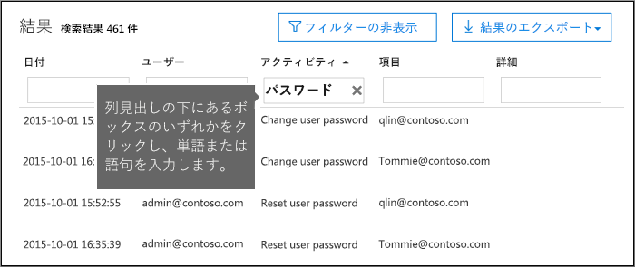

# <a name="search-the-audit-log-in-the-compliance-center"></a><span data-ttu-id="6a49c-103">コンプライアンス センターで監査ログを検索する</span><span class="sxs-lookup"><span data-stu-id="6a49c-103">Search the audit log in the compliance center</span></span>

<span data-ttu-id="6a49c-104">ユーザーが特定のドキュメントを表示したかどうか、またはメールボックスからアイテムを削除したかどうかを確認する必要がありますか。</span><span class="sxs-lookup"><span data-stu-id="6a49c-104">Need to find if a user viewed a specific document or purged an item from their mailbox?</span></span> <span data-ttu-id="6a49c-105">その場合は、Microsoft 365 コンプライアンス センターを使用して統合監査ログを検索し、組織内のユーザーと管理者のアクティビティを確認できます。</span><span class="sxs-lookup"><span data-stu-id="6a49c-105">If so, you can use the Microsoft 365 compliance center to search the unified audit log to view user and administrator activity in your organization.</span></span> <span data-ttu-id="6a49c-106">なぜ統合監査ログが必要なのでしょうか。</span><span class="sxs-lookup"><span data-stu-id="6a49c-106">Why a unified audit log?</span></span> <span data-ttu-id="6a49c-107">Microsoft 365 で以下の種類の[ユーザーおよび管理アクティビティ](#audited-activities)を検索できるためです:</span><span class="sxs-lookup"><span data-stu-id="6a49c-107">Because you can search for the following types of [user and admin activity](#audited-activities) in Microsoft 365:</span></span>

- <span data-ttu-id="6a49c-108">SharePoint Online および OneDrive for Business 内のユーザー アクティビティ</span><span class="sxs-lookup"><span data-stu-id="6a49c-108">User activity in SharePoint Online and OneDrive for Business</span></span>
- <span data-ttu-id="6a49c-109">Exchange Online 内のユーザー アクティビティ (Exchange メールボックス監査ログ)</span><span class="sxs-lookup"><span data-stu-id="6a49c-109">User activity in Exchange Online (Exchange mailbox audit logging)</span></span>
- <span data-ttu-id="6a49c-110">SharePoint Online 内の管理者アクティビティ</span><span class="sxs-lookup"><span data-stu-id="6a49c-110">Admin activity in SharePoint Online</span></span>
- <span data-ttu-id="6a49c-111">Azure Active Directory (Microsoft 365 のディレクトリ サービス) 内の管理者アクティビティ</span><span class="sxs-lookup"><span data-stu-id="6a49c-111">Admin activity in Azure Active Directory (the directory service for Microsoft 365)</span></span>
- <span data-ttu-id="6a49c-112">Exchange Online 内の管理者アクティビティ (Exchange 管理者監査ログ)</span><span class="sxs-lookup"><span data-stu-id="6a49c-112">Admin activity in Exchange Online (Exchange admin audit logging)</span></span>
- <span data-ttu-id="6a49c-113">セキュリティ/コンプライアンス センター内の電子情報開示アクティビティ</span><span class="sxs-lookup"><span data-stu-id="6a49c-113">eDiscovery activities in the security and compliance center</span></span>
- <span data-ttu-id="6a49c-114">Power BI 内のユーザーおよび管理者のアクティビティ</span><span class="sxs-lookup"><span data-stu-id="6a49c-114">User and admin activity in Power BI</span></span>
- <span data-ttu-id="6a49c-115">Microsoft Teams 内のユーザーおよび管理者のアクティビティ</span><span class="sxs-lookup"><span data-stu-id="6a49c-115">User and admin activity in Microsoft Teams</span></span>
- <span data-ttu-id="6a49c-116">Dynamics 365 内のユーザーおよび管理者のアクティビティ</span><span class="sxs-lookup"><span data-stu-id="6a49c-116">User and admin activity in Dynamics 365</span></span>
- <span data-ttu-id="6a49c-117">Yammer 内のユーザーおよび管理者のアクティビティ</span><span class="sxs-lookup"><span data-stu-id="6a49c-117">User and admin activity in Yammer</span></span>
- <span data-ttu-id="6a49c-118">Microsoft Power Automate 内のユーザーおよび管理者のアクティビティ</span><span class="sxs-lookup"><span data-stu-id="6a49c-118">User and admin activity in Microsoft Power Automate</span></span>
- <span data-ttu-id="6a49c-119">Microsoft Stream 内のユーザーおよび管理者のアクティビティ</span><span class="sxs-lookup"><span data-stu-id="6a49c-119">User and admin activity in Microsoft Stream</span></span>
- <span data-ttu-id="6a49c-120">Microsoft Workplace Analytics でのアナリストと管理者のアクティビティ</span><span class="sxs-lookup"><span data-stu-id="6a49c-120">Analyst and admin activity in Microsoft Workplace Analytics</span></span>
- <span data-ttu-id="6a49c-121">Microsoft Power Apps 内のユーザーおよび管理者のアクティビティ</span><span class="sxs-lookup"><span data-stu-id="6a49c-121">User and admin activity in Microsoft Power Apps</span></span>
- <span data-ttu-id="6a49c-122">Microsoft Forms 内のユーザーおよび管理者のアクティビティ</span><span class="sxs-lookup"><span data-stu-id="6a49c-122">User and admin activity in Microsoft Forms</span></span>
- <span data-ttu-id="6a49c-123">SharePoint Online または Microsoft Teams を使用するサイトの機密ラベルのユーザーおよび管理アクティビティ</span><span class="sxs-lookup"><span data-stu-id="6a49c-123">User and admin activity for sensitivity labels for sites that use SharePoint Online or Microsoft Teams</span></span>
- <span data-ttu-id="6a49c-124">ブリーフィング メールと MyAnalytics での管理者アクティビティ</span><span class="sxs-lookup"><span data-stu-id="6a49c-124">Admin activity in Briefing email and MyAnalytics</span></span>

## <a name="before-you-search-the-audit-log"></a><span data-ttu-id="6a49c-125">監査ログを検索する前に</span><span class="sxs-lookup"><span data-stu-id="6a49c-125">Before you search the audit log</span></span>

<span data-ttu-id="6a49c-126">監査ログの検索を開始する前に、次の項目を必ず確認してください。</span><span class="sxs-lookup"><span data-stu-id="6a49c-126">Be sure to read the following items before you start searching the audit log.</span></span>

- <span data-ttu-id="6a49c-127">Microsoft 365 および Office 365 Enterprise 組織では、監査ログ検索は規定でオンになっています。</span><span class="sxs-lookup"><span data-stu-id="6a49c-127">Audit log search is turned on by default for Microsoft 365 and Office 365 enterprise organizations.</span></span> <span data-ttu-id="6a49c-128">監査ログ検索が有効になっていることを確認するには、Exchange Online PowerShell で次のコマンドを実行します。</span><span class="sxs-lookup"><span data-stu-id="6a49c-128">To verify that audit log search is turned on, you can run the following command in Exchange Online PowerShell:</span></span>

  ```powershell
  Get-AdminAuditLogConfig | FL UnifiedAuditLogIngestionEnabled
  ```

  <span data-ttu-id="6a49c-129">*UnifiedAuditLogIngestionEnabled* プロパティの値`True`は、監査ログ検索が有効になっていることを示します。</span><span class="sxs-lookup"><span data-stu-id="6a49c-129">The value of `True` for the *UnifiedAuditLogIngestionEnabled* property indicates that audit log search is turned on.</span></span> <span data-ttu-id="6a49c-130">詳細については、「[監査ログの検索を有効または無効にする](turn-audit-log-search-on-or-off.md)」をご覧ください。</span><span class="sxs-lookup"><span data-stu-id="6a49c-130">For more information, see [Turn audit log search on or off](turn-audit-log-search-on-or-off.md).</span></span>

- <span data-ttu-id="6a49c-131">監査ログを検索するには、Exchange Online で閲覧限定の監査ログまたは監査ログの役割が割り当てられている必要があります。</span><span class="sxs-lookup"><span data-stu-id="6a49c-131">You have to be assigned the View-Only Audit Logs or Audit Logs role in Exchange Online to search the audit log.</span></span> <span data-ttu-id="6a49c-132">既定では、これらの役割は Exchange 管理センターの [**アクセス許可**] ページでコンプライアンス管理役割グループまたは組織管理役割グループに割り当てられています。</span><span class="sxs-lookup"><span data-stu-id="6a49c-132">By default, these roles are assigned to the Compliance Management and Organization Management role groups on the **Permissions** page in the Exchange admin center.</span></span> <span data-ttu-id="6a49c-133">Office 365 および Microsoft 365 のグローバル管理者は自動的に、組織管理役割グループのメンバーとして Exchange Online に追加されます。</span><span class="sxs-lookup"><span data-stu-id="6a49c-133">Global administrators in Office 365 and Microsoft 365 are automatically added as members of the Organization Management role group in Exchange Online.</span></span> <span data-ttu-id="6a49c-134">最小限の特権レベルで監査ログを検索する権限をユーザーに付与するには、Exchange Online でカスタムの役割グループを作成し、閲覧限定の監査ログまたは監査ログの役割を追加し、この新しい役割グループのメンバーとしてユーザーを追加します。</span><span class="sxs-lookup"><span data-stu-id="6a49c-134">To give a user the ability to search the audit log with the minimum level of privileges, you can create a custom role group in Exchange Online, add the View-Only Audit Logs or Audit Logs role, and then add the user as a member of the new role group.</span></span> <span data-ttu-id="6a49c-135">詳細については、「[Exchange Online で役割グループを管理する](/Exchange/permissions-exo/role-groups)」を参照してください。</span><span class="sxs-lookup"><span data-stu-id="6a49c-135">For more information, see [Manage role groups in Exchange Online](/Exchange/permissions-exo/role-groups).</span></span>

  > [!IMPORTANT]
  > <span data-ttu-id="6a49c-136">Microsoft 365 コンプライアンス センターの **[アクセス許可]** ページでユーザーに View-Only Audit Logs (閲覧限定の監査ログ) または Audit Logs (監査ログ) の役割を割り当てると、監査ログを検索できなくなります。</span><span class="sxs-lookup"><span data-stu-id="6a49c-136">If you assign a user the View-Only Audit Logs or Audit Logs role on the **Permissions** page in the Microsoft 365 compliance center, they won't be able to search the audit log.</span></span> <span data-ttu-id="6a49c-137">Exchange Online でアクセス許可を割り当てる必要があります。</span><span class="sxs-lookup"><span data-stu-id="6a49c-137">You have to assign the permissions in Exchange Online.</span></span> <span data-ttu-id="6a49c-138">これは、監査ログの検索に使用される基本のコマンドレットが ExchangeOnline コマンドレットだからです。</span><span class="sxs-lookup"><span data-stu-id="6a49c-138">This is because the underlying cmdlet used to search the audit log is an Exchange Online cmdlet.</span></span>

- <span data-ttu-id="6a49c-p106">監査対象アクティビティがユーザーまたは管理者によって実行されると、監査レコードが生成され、組織の監査ログに格納されます。監査レコードの保持期間 (および監査ログで検索可能な期間) は、Office 365 または Microsoft 365 Enterprise サブスクリプション、具体的には、特定のユーザーに割り当てられたライセンスの種類によって異なります。</span><span class="sxs-lookup"><span data-stu-id="6a49c-p106">When an audited activity is performed by a user or admin, an audit record is generated and stored in the audit log for your organization. The length of time that an audit record is retained (and searchable in the audit log) depends on your Office 365 or Microsoft 365 Enterprise subscription, and specifically the type of the license that is assigned to specific users.</span></span>

  - <span data-ttu-id="6a49c-141">Office 365 E5 または Microsoft 365 E5 ライセンスが割り当てられたユーザー (または Microsoft 365 E5 Compliance または Microsoft 365 E5 eDiscovery and Audit アドオン ライセンスを持っているユーザー) の場合、Azure Active Directory、Exchange、および SharePoint アクティビティの監査レコードは、既定で 1 年間保持されます。</span><span class="sxs-lookup"><span data-stu-id="6a49c-141">For users assigned an Office 365 E5 or Microsoft 365 E5 license (or users with a Microsoft 365 E5 Compliance or Microsoft 365 E5 eDiscovery and Audit add-on license), audit records for Azure Active Directory, Exchange, and SharePoint activity are retained for one year by default.</span></span> <span data-ttu-id="6a49c-142">また、組織では、監査ログの保持ポリシーを作成して、その他のサービスのアクティビティについての監査レコードを最大 1 年間保持します。</span><span class="sxs-lookup"><span data-stu-id="6a49c-142">Organizations can also create audit log retention policies to retain audit records for activities in other services for up to one year.</span></span> <span data-ttu-id="6a49c-143">詳細については、「[監査ログ保持ポリシーを管理する](audit-log-retention-policies.md)」を参照してください。</span><span class="sxs-lookup"><span data-stu-id="6a49c-143">For more information, see [Manage audit log retention policies](audit-log-retention-policies.md).</span></span>

    > [!NOTE]
    > <span data-ttu-id="6a49c-144">監査レコードを 1 年間保持するプライベート プレビュー プログラムに参加した場合、一般提供のロールアウト日前に生成された監査レコードの保持期間はリセットされません。</span><span class="sxs-lookup"><span data-stu-id="6a49c-144">If your organization participated in the private preview program for the one-year retention of audit records, the retention duration for audit records that were generated before the general availability rollout date will not be reset.</span></span>

  - <span data-ttu-id="6a49c-145">その他 (E5 以外) の Office 365 または Microsoft 365 ライセンスが割り当てられているユーザーの場合、監査レコードは 90 日間保持されます。</span><span class="sxs-lookup"><span data-stu-id="6a49c-145">For users assigned any other (non-E5) Office 365 or Microsoft 365 license, audit records are retained for 90 days.</span></span> <span data-ttu-id="6a49c-146">統合監査ログをサポートする Office 365 および Microsoft 365 サブスクリプションのリストについては、「[セキュリティおよびコンプライアンス センター サービスの説明](/office365/servicedescriptions/office-365-platform-service-description/office-365-securitycompliance-center)」を参照してください。</span><span class="sxs-lookup"><span data-stu-id="6a49c-146">For a list of Office 365 and Microsoft 365 subscriptions that support unified audit logging, see [the security and compliance center service description](/office365/servicedescriptions/office-365-platform-service-description/office-365-securitycompliance-center).</span></span>

    > [!NOTE]
    > <span data-ttu-id="6a49c-147">デフォルトでメールボックス監査がオンになっている場合でも、一部のユーザーのメールボックス監査イベントが、Microsoft 365 コンプライアンス センターまたは Office 365 マネージメント アクティビティ API の監査ログ検索で見つからないことに気付く場合があります。</span><span class="sxs-lookup"><span data-stu-id="6a49c-147">Even when mailbox auditing on by default is turned on, you might notice that mailbox audit events for some users aren't found in audit log searches in the Microsoft 365 compliance center or via the Office 365 Management Activity API.</span></span> <span data-ttu-id="6a49c-148">詳細については、「[More information about mailbox audit logging (メールボックス監査ログの詳細)](enable-mailbox-auditing.md#more-information)」を参照してください。</span><span class="sxs-lookup"><span data-stu-id="6a49c-148">For more information, see [More information about mailbox audit logging](enable-mailbox-auditing.md#more-information).</span></span>

- <span data-ttu-id="6a49c-149">組織の監査ログの検索を無効にする場合は、Exchange Online 組織に接続されたリモート PowerShell で次のコマンドを実行できます。</span><span class="sxs-lookup"><span data-stu-id="6a49c-149">If you want to turn off audit log search for your organization, you can run the following command in remote PowerShell connected to your Exchange Online organization:</span></span>

  ```powershell
  Set-AdminAuditLogConfig -UnifiedAuditLogIngestionEnabled $false
  ```

    <span data-ttu-id="6a49c-150">監査検索を再度有効にするには、Exchange Online PowerShell で次のコマンドを実行できます。</span><span class="sxs-lookup"><span data-stu-id="6a49c-150">To turn on audit search again, you can run the following command in Exchange Online PowerShell:</span></span>

  ```powershell
  Set-AdminAuditLogConfig -UnifiedAuditLogIngestionEnabled $true
  ```

  <span data-ttu-id="6a49c-151">詳細については、「[監査ログの検索を無効にする](turn-audit-log-search-on-or-off.md)」を参照してください。</span><span class="sxs-lookup"><span data-stu-id="6a49c-151">For more information, see [Turn off audit log search](turn-audit-log-search-on-or-off.md).</span></span>

- <span data-ttu-id="6a49c-152">前述のように、監査ログの検索に使用される基礎となるコマンドレットは Exchange Online コマンドレットの **Search-UnifiedAuditLog** です。</span><span class="sxs-lookup"><span data-stu-id="6a49c-152">As previously stated, the underlying cmdlet used to search the audit log is an Exchange Online cmdlet, which is **Search-UnifiedAuditLog**.</span></span> <span data-ttu-id="6a49c-153">つまり、Microsoft 365 コンプライアンス センターの **[監査ログの検索]** ページではなく、このコマンドレットを使用して監査ログを検索できます。</span><span class="sxs-lookup"><span data-stu-id="6a49c-153">That means you can use this cmdlet to search the audit log instead of using the **Audit log search** page in the Microsoft 365 compliance center.</span></span> <span data-ttu-id="6a49c-154">このコマンドレットは、Exchange Online 組織に接続されているリモートの PowerShell で実行する必要があります。</span><span class="sxs-lookup"><span data-stu-id="6a49c-154">You have to run this cmdlet in remote PowerShell connected to your Exchange Online organization.</span></span> <span data-ttu-id="6a49c-155">詳細については、「[Search-UnifiedAuditLog](/powershell/module/exchange/search-unifiedauditlog)」を参照してください。</span><span class="sxs-lookup"><span data-stu-id="6a49c-155">For more information, see [Search-UnifiedAuditLog](/powershell/module/exchange/search-unifiedauditlog).</span></span>

  <span data-ttu-id="6a49c-156">**Search-UnifiedAuditLog** コマンドレットによって返された検索結果を CSV ファイルにエクスポートする方法の詳細については、「[監査ログ レコードをエクスポート、構成、表示する](export-view-audit-log-records.md#tips-for-exporting-and-viewing-the-audit-log)」の「監査ログをエクスポート、表示するためのヒント」のセクションを参照してください。</span><span class="sxs-lookup"><span data-stu-id="6a49c-156">For information about exporting the search results returned by the **Search-UnifiedAuditLog** cmdlet to a CSV file, see the "Tips for exporting and viewing the audit log" section in [Export, configure, and view audit log records](export-view-audit-log-records.md#tips-for-exporting-and-viewing-the-audit-log).</span></span>

- <span data-ttu-id="6a49c-p111">プログラムを使用して監査ログからデータをダウンロードする場合、PowerShell スクリプトを使用する代わりに、Office 365 マネージメント アクティビティ API を使用することをお勧めします。Office 365 マネージメント アクティビティ API は、組織の運用、セキュリティ、コンプライアンス監視ソリューションの開発に使用する REST Web サービスです。詳細については、「[Office 365 マネージメント アクティビティ API リファレンス](/office/office-365-management-api/office-365-management-activity-api-reference)」を参照してください。</span><span class="sxs-lookup"><span data-stu-id="6a49c-p111">If you want to programmatically download data from the audit log, we recommend that you use the Office 365 Management Activity API instead of using a PowerShell script. The Office 365 Management Activity API is a REST web service that you can use to develop operations, security, and compliance monitoring solutions for your organization. For more information, see [Office 365 Management Activity API reference](/office/office-365-management-api/office-365-management-activity-api-reference).</span></span>

- <span data-ttu-id="6a49c-p112">イベントが発生してから対応する監査ログ レコードが監査ログ検索の結果に返されるまで最長 30 分または最長 24 時間かかる場合があります。次の表は、Office 365 のさまざまなサービスで、この処理に要する時間を示しています。</span><span class="sxs-lookup"><span data-stu-id="6a49c-p112">It can take up to 30 minutes or up to 24 hours after an event occurs for the corresponding audit log record to be returned in the results of an audit log search. The following table shows the time it takes for the different services in Office 365.</span></span>

  <br>

  ****

  |<span data-ttu-id="6a49c-162">Microsoft 365 サービスまたは機能</span><span class="sxs-lookup"><span data-stu-id="6a49c-162">Microsoft 365 service or feature</span></span>|<span data-ttu-id="6a49c-163">30 分</span><span class="sxs-lookup"><span data-stu-id="6a49c-163">30 minutes</span></span>|<span data-ttu-id="6a49c-164">24 時間</span><span class="sxs-lookup"><span data-stu-id="6a49c-164">24 hours</span></span>|
  |---|:---:|:---:|
  |<span data-ttu-id="6a49c-165">Defender for Office 365 および脅威インテリジェンス</span><span class="sxs-lookup"><span data-stu-id="6a49c-165">Defender for Office 365 and Threat Intelligence</span></span>|||
  |<span data-ttu-id="6a49c-167">Azure Active Directory (ユーザー ログイン イベント)</span><span class="sxs-lookup"><span data-stu-id="6a49c-167">Azure Active Directory (user login events)</span></span>|||
  |<span data-ttu-id="6a49c-169">Azure Active Directory (管理イベント)</span><span class="sxs-lookup"><span data-stu-id="6a49c-169">Azure Active Directory (admin events)</span></span>|||
  |<span data-ttu-id="6a49c-171">データ損失防止</span><span class="sxs-lookup"><span data-stu-id="6a49c-171">Data Loss Prevention</span></span>|||
  |<span data-ttu-id="6a49c-173">Dynamics 365 CRM</span><span class="sxs-lookup"><span data-stu-id="6a49c-173">Dynamics 365 CRM</span></span>|||
  |<span data-ttu-id="6a49c-175">電子情報開示</span><span class="sxs-lookup"><span data-stu-id="6a49c-175">eDiscovery</span></span>|||
  |<span data-ttu-id="6a49c-177">Exchange Online</span><span class="sxs-lookup"><span data-stu-id="6a49c-177">Exchange Online</span></span>|||
  |<span data-ttu-id="6a49c-179">Microsoft Power Automate</span><span class="sxs-lookup"><span data-stu-id="6a49c-179">Microsoft Power Automate</span></span>|||
  |<span data-ttu-id="6a49c-181">Microsoft Project</span><span class="sxs-lookup"><span data-stu-id="6a49c-181">Microsoft Project</span></span>|||
  |<span data-ttu-id="6a49c-183">Microsoft Stream</span><span class="sxs-lookup"><span data-stu-id="6a49c-183">Microsoft Stream</span></span>|||
  |<span data-ttu-id="6a49c-185">Microsoft Teams</span><span class="sxs-lookup"><span data-stu-id="6a49c-185">Microsoft Teams</span></span>|||
  |<span data-ttu-id="6a49c-187">Power アプリ</span><span class="sxs-lookup"><span data-stu-id="6a49c-187">Power Apps</span></span>|||
  |<span data-ttu-id="6a49c-189">Power BI</span><span class="sxs-lookup"><span data-stu-id="6a49c-189">Power BI</span></span>|||
  |<span data-ttu-id="6a49c-191">Microsoft 365 コンプライアンス センター</span><span class="sxs-lookup"><span data-stu-id="6a49c-191">Microsoft 365 compliance center</span></span>|||
  |<span data-ttu-id="6a49c-193">機密ラベル</span><span class="sxs-lookup"><span data-stu-id="6a49c-193">Sensitivity labels</span></span>|||
  |<span data-ttu-id="6a49c-195">SharePoint Online と OneDrive for Business</span><span class="sxs-lookup"><span data-stu-id="6a49c-195">SharePoint Online and OneDrive for Business</span></span>|||
  |<span data-ttu-id="6a49c-197">Workplace Analytics</span><span class="sxs-lookup"><span data-stu-id="6a49c-197">Workplace Analytics</span></span>|||
  |<span data-ttu-id="6a49c-199">Yammer</span><span class="sxs-lookup"><span data-stu-id="6a49c-199">Yammer</span></span>|||
  |<span data-ttu-id="6a49c-201">Microsoft Forms</span><span class="sxs-lookup"><span data-stu-id="6a49c-201">Microsoft Forms</span></span>|||
  |

- <span data-ttu-id="6a49c-203">Azure Active Directory (Azure AD) は、Office 365 のディレクトリ サービスです。</span><span class="sxs-lookup"><span data-stu-id="6a49c-203">Azure Active Directory (Azure AD) is the directory service for Office 365.</span></span> <span data-ttu-id="6a49c-204">統合監査ログには、Microsoft 365 管理センターまたは Azure 管理ポータルで実行されたユーザー、グループ、アプリケーション、ドメイン、およびディレクトリのアクティビティが記録されます。</span><span class="sxs-lookup"><span data-stu-id="6a49c-204">The unified audit log contains user, group, application, domain, and directory activities performed in the Microsoft 365 admin center or in the Azure management portal.</span></span> <span data-ttu-id="6a49c-205">Azure AD のイベントの全リストについては、「[Azure Active Directory 監査レポートのイベント](/azure/active-directory/reports-monitoring/concept-audit-logs)」を参照してください。</span><span class="sxs-lookup"><span data-stu-id="6a49c-205">For a complete list of Azure AD events, see [Azure Active Directory Audit Report Events](/azure/active-directory/reports-monitoring/concept-audit-logs).</span></span>

- <span data-ttu-id="6a49c-206">Power BI の監査ログは、既定では有効になっていません。</span><span class="sxs-lookup"><span data-stu-id="6a49c-206">Audit logging for Power BI isn't enabled by default.</span></span> <span data-ttu-id="6a49c-207">監査ログ内の Power BI アクティビティを検索するには、Power BI 管理ポータルで監査を有効にする必要があります。</span><span class="sxs-lookup"><span data-stu-id="6a49c-207">To search for Power BI activities in the audit log, you have to enable auditing in the Power BI admin portal.</span></span> <span data-ttu-id="6a49c-208">手順については、[Power BI 管理ポータル](/power-bi/service-admin-portal#audit-logs)の「監査ログ」セクションをご覧ください。</span><span class="sxs-lookup"><span data-stu-id="6a49c-208">For instructions, see the "Audit logs" section in [Power BI admin portal](/power-bi/service-admin-portal#audit-logs).</span></span>

## <a name="search-the-audit-log"></a><span data-ttu-id="6a49c-209">監査ログの検索</span><span class="sxs-lookup"><span data-stu-id="6a49c-209">Search the audit log</span></span>

<span data-ttu-id="6a49c-210">以下に、Microsoft 365 で監査ログを検索するためのプロセスを示します。</span><span class="sxs-lookup"><span data-stu-id="6a49c-210">Here's the process for searching the audit log in Microsoft 365.</span></span>

[<span data-ttu-id="6a49c-211">手順 1: 監査ログの検索を実行する</span><span class="sxs-lookup"><span data-stu-id="6a49c-211">Step 1: Run an audit log search</span></span>](#step-1-run-an-audit-log-search)

[<span data-ttu-id="6a49c-212">手順 2: 検索結果を表示する</span><span class="sxs-lookup"><span data-stu-id="6a49c-212">Step 2: View the search results</span></span>](#step-2-view-the-search-results)

[<span data-ttu-id="6a49c-213">手順 3: 検索結果をフィルター処理する</span><span class="sxs-lookup"><span data-stu-id="6a49c-213">Step 3: Filter the search results</span></span>](#step-3-filter-the-search-results)

[<span data-ttu-id="6a49c-214">手順 4: 検索結果をファイルにエクスポートする</span><span class="sxs-lookup"><span data-stu-id="6a49c-214">Step 4: Export the search results to a file</span></span>](#step-4-export-the-search-results-to-a-file)

### <a name="step-1-run-an-audit-log-search"></a><span data-ttu-id="6a49c-215">手順 1: 監査ログの検索を実行する</span><span class="sxs-lookup"><span data-stu-id="6a49c-215">Step 1: Run an audit log search</span></span>

1. <span data-ttu-id="6a49c-216"><https://compliance.microsoft.com> に移動し、サインインします。</span><span class="sxs-lookup"><span data-stu-id="6a49c-216">Go to <https://compliance.microsoft.com> and sign in.</span></span>

    > [!TIP]
    > <span data-ttu-id="6a49c-p115">現在ログオンしている資格情報が使用されないようにするために、プライベート ブラウズ セッション (通常のセッションではありません) を使用して Microsoft 365 コンプライアンス センターにアクセスします。Internet Explorer または Microsoft Edge で InPrivate ブラウズ セッションを開くには、Ctrl + Shift + P キーを押します。Google Chrome でプライベート ブラウズ セッション (シークレット ウィンドウと呼ばれる) を開くには、Ctrl + Shift + N キーを押します。</span><span class="sxs-lookup"><span data-stu-id="6a49c-p115">Use a private browsing session (not a regular session) to access the Microsoft 365 compliance center because this will prevent the credential that you are currently logged on with from being used. To open an InPrivate Browsing session in Internet Explorer or Microsoft Edge, just press CTRL+SHIFT+P. To open a private browsing session in Google Chrome (called an incognito window), press CTRL+SHIFT+N.</span></span>

2. <span data-ttu-id="6a49c-220">Microsoft 365 コンプライアンス センターの左側のウィンドウで、**[監査]** をクリックします。</span><span class="sxs-lookup"><span data-stu-id="6a49c-220">In the left pane of the Microsoft 365 compliance center, click **Audit**.</span></span>

    <span data-ttu-id="6a49c-221">[**監査**] ページが表示されます。</span><span class="sxs-lookup"><span data-stu-id="6a49c-221">The **Audit** page is displayed.</span></span>

    ![検索条件を設定し、[検索] をクリックしてレポートを実行する](../media/AuditLogSearchPage1.png)

    > [!NOTE]
    > <span data-ttu-id="6a49c-223">[**ユーザーと管理者のアクティビティの記録を開始する**] リンクが表示される場合は、クリックして監査を有効にします。</span><span class="sxs-lookup"><span data-stu-id="6a49c-223">If the **Start recording user and admin activity** link is displayed, click it to turn on auditing.</span></span> <span data-ttu-id="6a49c-224">このリンクが表示されない場合、組織の監査機能は有効です。</span><span class="sxs-lookup"><span data-stu-id="6a49c-224">If you don't see this link, auditing is turned on for your organization.</span></span>

3. <span data-ttu-id="6a49c-225">**[検索]** タブで、次の検索条件を設定します。</span><span class="sxs-lookup"><span data-stu-id="6a49c-225">On the **Search** tab, configure the following search criteria:</span></span>

   1. <span data-ttu-id="6a49c-226">[**開始日**] と [**終了日**]: 既定で過去 7 日間が選択されています。</span><span class="sxs-lookup"><span data-stu-id="6a49c-226">**Start date** and **End date**: The last seven days are selected by default.</span></span> <span data-ttu-id="6a49c-227">日付と時間の範囲を選択し、その期間内に発生したイベントを表示します。</span><span class="sxs-lookup"><span data-stu-id="6a49c-227">Select a date and time range to display the events that occurred within that period.</span></span> <span data-ttu-id="6a49c-228">日付と時刻は、ローカル時刻で表示されます。</span><span class="sxs-lookup"><span data-stu-id="6a49c-228">The date and time are presented in local time.</span></span> <span data-ttu-id="6a49c-229">指定できる日付範囲は最大 90 日です。</span><span class="sxs-lookup"><span data-stu-id="6a49c-229">The maximum date range that you can specify is 90 days.</span></span> <span data-ttu-id="6a49c-230">選択した日付範囲が 90 日間よりも大きい場合は、エラーが表示されます。</span><span class="sxs-lookup"><span data-stu-id="6a49c-230">An error is displayed if the selected date range is greater than 90 days.</span></span>

    > [!TIP]
    > <span data-ttu-id="6a49c-p118">最大の日付範囲である 90 日を使用する場合は、[**開始日**] で現在の時刻を選択してください。それ以外の時刻を選択すると、開始日が終了日より前であるというエラーが返されます。過去 90 日以内に監査を有効にした場合、最大の日付範囲の開始日を監査を有効にした日付より前にすることはできません。</span><span class="sxs-lookup"><span data-stu-id="6a49c-p118">If you're using the maximum date range of 90 days, select the current time for the **Start date**. Otherwise, you'll receive an error saying that the start date is earlier than the end date. If you've turned on auditing within the last 90 days, the maximum date range can't start before the date that auditing was turned on.</span></span>

   2. <span data-ttu-id="6a49c-234">[**アクティビティ**]: ドロップダウン リストをクリックして検索できるアクティビティを表示します。</span><span class="sxs-lookup"><span data-stu-id="6a49c-234">**Activities**: Click the drop-down list to display the activities that you can search for.</span></span> <span data-ttu-id="6a49c-235">ユーザーと管理者のアクティビティが、関連するアクティビティのグループに編成されています。</span><span class="sxs-lookup"><span data-stu-id="6a49c-235">User and admin activities are organized into groups of related activities.</span></span> <span data-ttu-id="6a49c-236">特定のアクティビティを選択することも、アクティビティ グループ名をクリックして、グループ内のすべてのアクティビティを選択することもできます。</span><span class="sxs-lookup"><span data-stu-id="6a49c-236">You can select specific activities or you can click the activity group name to select all activities in the group.</span></span> <span data-ttu-id="6a49c-237">選択したアクティビティをクリックして、選択を解除することもできます。</span><span class="sxs-lookup"><span data-stu-id="6a49c-237">You can also click a selected activity to clear the selection.</span></span> <span data-ttu-id="6a49c-238">検索の実行後、選択したアクティビティの監査ログ エントリのみが表示されます。</span><span class="sxs-lookup"><span data-stu-id="6a49c-238">After you run the search, only the audit log entries for the selected activities are displayed.</span></span> <span data-ttu-id="6a49c-239">[**すべてのアクティビティの結果を表示**] を選択すると、選択したユーザーまたはユーザーのグループによって実行されたすべてのアクティビティの結果が表示されます。</span><span class="sxs-lookup"><span data-stu-id="6a49c-239">Selecting **Show results for all activities** displays results for all activities performed by the selected user or group of users.</span></span><br/><br/><span data-ttu-id="6a49c-240">監査ログには、100 件以上のユーザーおよび管理者アクティビティが記録されます。</span><span class="sxs-lookup"><span data-stu-id="6a49c-240">Over 100 user and admin activities are logged in the audit log.</span></span> <span data-ttu-id="6a49c-241">各種サービスの各アクティビティの説明を確認するには、本記事のこのトピックの「**監査されるアクティビティ**」タブをクリックしてください。</span><span class="sxs-lookup"><span data-stu-id="6a49c-241">Click the **Audited activities** tab at the topic of this article to see the descriptions of every activity in each of the different services.</span></span>

   3. <span data-ttu-id="6a49c-242">[**ユーザー**]: このボックスをクリックし、検索結果を表示する 1 人以上のユーザーを選択します。</span><span class="sxs-lookup"><span data-stu-id="6a49c-242">**Users**: Click in this box and then select one or more users to display search results for.</span></span> <span data-ttu-id="6a49c-243">このボックスで選択したユーザーによって実行された選択したアクティビティの監査ログ エントリが結果の一覧に表示されます。</span><span class="sxs-lookup"><span data-stu-id="6a49c-243">The audit log entries for the selected activity performed by the users you select in this box are displayed in the list of results.</span></span> <span data-ttu-id="6a49c-244">組織のすべてのユーザー (およびサービス アカウント) のエントリを返すには、このボックスを空白のままにします。</span><span class="sxs-lookup"><span data-stu-id="6a49c-244">Leave this box blank to return entries for all users (and service accounts) in your organization.</span></span>

   4. <span data-ttu-id="6a49c-245">[**ファイル、フォルダー、またはサイト**]: 指定したキーワードを含むフォルダーのファイルに関連するアクティビティを検索するには、ファイルまたはフォルダー名の一部またはすべてを入力します。</span><span class="sxs-lookup"><span data-stu-id="6a49c-245">**File, folder, or site**: Type some or all of a file or folder name to search for activity related to the file of folder that contains the specified keyword.</span></span> <span data-ttu-id="6a49c-246">ファイルまたはフォルダーの URL を指定することもできます。</span><span class="sxs-lookup"><span data-stu-id="6a49c-246">You can also specify a URL of a file or folder.</span></span> <span data-ttu-id="6a49c-247">URL を使用する場合は、完全な URL パスを入力するか、URL の一部を入力する場合は、特殊文字やスペースを含めないでください。</span><span class="sxs-lookup"><span data-stu-id="6a49c-247">If you use a URL, be sure the type the full URL path or if you type a portion of the URL, don't include any special characters or spaces.</span></span><br/><br/><span data-ttu-id="6a49c-248">組織内のすべてのファイルおよびフォルダーのエントリを返すには、このボックスを空白のままにします。</span><span class="sxs-lookup"><span data-stu-id="6a49c-248">Leave this box blank to return entries for all files and folders in your organization.</span></span>

    > [!TIP]
    >
    > - <span data-ttu-id="6a49c-249">ある **サイト** に関するすべてのアクティビティを検索する場合、URL の後ろにワイルドカード文字 (\*) を追加して、そのサイトのすべてのエントリが返されるようにします (例: `"https://contoso-my.sharepoint.com/personal*"`)。</span><span class="sxs-lookup"><span data-stu-id="6a49c-249">If you're looking for all activities related to a **site**, add the wildcard symbol (\*) after the URL to return all entries for that site; for example, `"https://contoso-my.sharepoint.com/personal*"`.</span></span>
    >
    > - <span data-ttu-id="6a49c-250">特定の **ファイル** に関連するすべてのアクティビティを探す場合は、ファイル名の前にワイルドカード文字 (\*) を追加すると、そのファイルのすべてのエントリが返されます (例: `"*Customer_Profitability_Sample.csv"`)。</span><span class="sxs-lookup"><span data-stu-id="6a49c-250">If you're looking for all activities related to a **file**, add the wildcard symbol (\*) before the file name to return all entries for that file; for example, `"*Customer_Profitability_Sample.csv"`.</span></span>

4. <span data-ttu-id="6a49c-251">[**検索**] をクリックして、設定した検索条件で検索を実行します。</span><span class="sxs-lookup"><span data-stu-id="6a49c-251">Click **Search** to run the search using your search criteria.</span></span>

   <span data-ttu-id="6a49c-252">検索結果が読み込まれ、しばらくすると、新しいページに表示されます。</span><span class="sxs-lookup"><span data-stu-id="6a49c-252">The search results are loaded, and after a few moments they are displayed on a new page.</span></span> <span data-ttu-id="6a49c-253">検索が完了すると、検索結果の件数が表示されます。</span><span class="sxs-lookup"><span data-stu-id="6a49c-253">When the search is finished, the number of results found is displayed.</span></span> <span data-ttu-id="6a49c-254">イベント 150 件の増分で最大 5,000 件のイベントが表示されます。</span><span class="sxs-lookup"><span data-stu-id="6a49c-254">A maximum of 5,000 events will be displayed in increments of 150 events.</span></span> <span data-ttu-id="6a49c-255">検索条件を満たすイベントが 5,000 件を超える場合、最新の5,000 件のイベントが表示されます。</span><span class="sxs-lookup"><span data-stu-id="6a49c-255">If more than 5,000 events meet the search criteria, the most recent 5,000 events are displayed.</span></span>

   

#### <a name="tips-for-searching-the-audit-log"></a><span data-ttu-id="6a49c-257">監査ログを検索するためのヒント</span><span class="sxs-lookup"><span data-stu-id="6a49c-257">Tips for searching the audit log</span></span>

- <span data-ttu-id="6a49c-258">検索する特定のアクティビティを選択するには、アクティビティ名をクリックします。</span><span class="sxs-lookup"><span data-stu-id="6a49c-258">You can select specific activities to search for by clicking the activity name.</span></span> <span data-ttu-id="6a49c-259">またはグループ名をクリックして、グループ内のすべてのアクティビティ ([**ファイルとフォルダーのアクティビティ**] など) を検索できます。</span><span class="sxs-lookup"><span data-stu-id="6a49c-259">Or you can search for all activities in a group (such as **File and folder activities**) by clicking the group name.</span></span> <span data-ttu-id="6a49c-260">アクティビティが選択されている場合は、そのアクティビティをクリックして、選択を取り消すことができます。</span><span class="sxs-lookup"><span data-stu-id="6a49c-260">If an activity is selected, you can click it to cancel the selection.</span></span> <span data-ttu-id="6a49c-261">また、検索ボックスを使用して、入力したキーワードを含むアクティビティを表示することもできます。</span><span class="sxs-lookup"><span data-stu-id="6a49c-261">You can also use the search box to display the activities that contain the keyword that you type.</span></span>

  

- <span data-ttu-id="6a49c-263">Exchange 管理者監査ログのイベントを表示するには、[**アクティビティ**] リストの [**すべてのアクティビティの結果を表示**] を選択する必要があります。</span><span class="sxs-lookup"><span data-stu-id="6a49c-263">You have to select **Show results for all activities** in the **Activities** list to display events from the Exchange admin audit log.</span></span> <span data-ttu-id="6a49c-264">この監査ログのイベントには、結果の [**アクティビティ**] 列にコマンドレット名 (**Set-Mailbox** など) が表示されます。</span><span class="sxs-lookup"><span data-stu-id="6a49c-264">Events from this audit log display a cmdlet name (for example, **Set-Mailbox**) in the **Activity** column in the results.</span></span> <span data-ttu-id="6a49c-265">詳細については、 このトピックの [**監査されるアクティビティ**] タブをクリックし、[**Exchange 管理者アクティビティ**] をクリックします。</span><span class="sxs-lookup"><span data-stu-id="6a49c-265">For more information, click the **Audited activities** tab in this topic and then click **Exchange admin activities**.</span></span>

  <span data-ttu-id="6a49c-p126">同様に、[**アクティビティ**] の一覧に対応する項目がない監査アクティビティがいくつかあります。これらのアクティビティの操作名がわかっている場合は、[**アクティビティ**] 列のボックスに操作名を入力してすべてのアクティビティを検索し、結果をフィルター処理することができます。結果のフィルター処理の詳細については、「[手順 3: 検索結果をフィルター処理する](#step-3-filter-the-search-results)」を参照してください。</span><span class="sxs-lookup"><span data-stu-id="6a49c-p126">Similarly, there are some auditing activities that don't have a corresponding item in the **Activities** list. If you know the name of the operation for these activities, you can search for all activities, then filter the results by typing the name of the operation in the box for the **Activity** column. See [Step 3: Filter the search results](#step-3-filter-the-search-results) for more information about filtering the results.</span></span>

- <span data-ttu-id="6a49c-p127">現在の検索条件をクリアするには、[**クリア**] をクリックします。日付の範囲は、既定の過去 7 日間に戻ります。[**すべてをクリアしてすべてのアクティビティの結果を表示する**] をクリックして、選択したすべてのアクティビティを取り消すこともできます。</span><span class="sxs-lookup"><span data-stu-id="6a49c-p127">Click **Clear** to clear the current search criteria. The date range returns to the default of the last seven days. You can also click **Clear all to show results for all activities** to cancel all selected activities.</span></span>

- <span data-ttu-id="6a49c-272">5,000 件の結果が見つかった場合、検索条件に一致するイベントが 5,000 件を超えていると見なすことができます。</span><span class="sxs-lookup"><span data-stu-id="6a49c-272">If 5,000 results are found, you can probably assume that there are more than 5,000 events that met the search criteria.</span></span> <span data-ttu-id="6a49c-273">検索条件を絞り込み、返される結果が少なくなるように検索を再実行するか、[**結果のエクスポート**] \> [**すべての結果をダウンロード**] を選択して、すべての検索結果をエクスポートできます。</span><span class="sxs-lookup"><span data-stu-id="6a49c-273">You can either refine the search criteria and rerun the search to return fewer results, or you can export all of the search results by selecting **Export results** \> **Download all results**.</span></span>

### <a name="step-2-view-the-search-results"></a><span data-ttu-id="6a49c-274">手順 2: 検索結果を表示する</span><span class="sxs-lookup"><span data-stu-id="6a49c-274">Step 2: View the search results</span></span>

<span data-ttu-id="6a49c-p129">監査ログの検索の結果は、[**監査ログの検索**] ページの [**結果**] の下に表示されます。前述のとおり、最大 5,000 件 (最新) のイベントが 150 件ずつ表示されます。さらにイベントを表示するには、**結果** ウィンドウにあるスクロール バーを使用するか、**Shift + End** キーを押して、次の 150 件のイベントを表示することができます。</span><span class="sxs-lookup"><span data-stu-id="6a49c-p129">The results of an audit log search are displayed under **Results** on the **Audit log search** page. As previously stated a maximum of 5,000 (newest) events are displayed in increments of 150 events. To display more events you can use the scroll bar in the **Results** pane or you can press **Shift + End** to display the next 150 events.</span></span>

<span data-ttu-id="6a49c-278">検索結果には、検索によって返された各イベントに関する次の情報が含まれます。</span><span class="sxs-lookup"><span data-stu-id="6a49c-278">The results contain the following information about each event returned by the search:</span></span>

- <span data-ttu-id="6a49c-279">[**日付**]: イベントが発生した日付と時刻 (ローカル時刻)。</span><span class="sxs-lookup"><span data-stu-id="6a49c-279">**Date**: The date and time (in your local time) when the event occurred.</span></span>

- <span data-ttu-id="6a49c-p130">**IP アドレス**: アクティビティが記録されたときに使用されたデバイスの IP アドレス。IP アドレスは、IPv4 または IPv6 アドレスの形式で表示されます。</span><span class="sxs-lookup"><span data-stu-id="6a49c-p130">**IP address**: The IP address of the device that was used when the activity was logged. The IP address is displayed in either an IPv4 or IPv6 address format.</span></span>

   > [!NOTE]
  > <span data-ttu-id="6a49c-282">一部のサービスでは、このフィールドに表示される値は、ユーザーに代わってサービスを呼び出す信頼できるアプリケーション (Office on the web アプリなど) の IP アドレスであり、アクティビティを実行したユーザーが使用するデバイスの IP アドレスではない場合があります。</span><span class="sxs-lookup"><span data-stu-id="6a49c-282">For some services, the value displayed in this field might be the IP address for a trusted application (for example, Office on the web apps) calling into the service on behalf of a user and not the IP address of the device used by person who performed the activity.</span></span> <span data-ttu-id="6a49c-283">また、Azure Active Directory 関連のイベントの管理者のアクティビティ (またはシステムアカウントによって実行されるアクティビティ) の場合、IP アドレスはログに記録されず、このフィールドに表示される値は `null` になります。</span><span class="sxs-lookup"><span data-stu-id="6a49c-283">Also, for admin activity (or activity performed by a system account) for Azure Active Directory-related events, the IP address isn't logged and the value displayed in this field is `null`.</span></span>

- <span data-ttu-id="6a49c-284">[**ユーザー**]: イベントをトリガーしたアクションを実行したユーザー (またはサービス アカウント)。</span><span class="sxs-lookup"><span data-stu-id="6a49c-284">**User**: The user (or service account) who performed the action that triggered the event.</span></span>

- <span data-ttu-id="6a49c-p132">**アクティビティ**: ユーザーが実行したアクティビティ。この値は [**アクティビティ**] ドロップダウン リストで選択したアクティビティと一致します。Exchange 管理監査ログのイベントの場合は、この列の値は、Exchange コマンドレットです。</span><span class="sxs-lookup"><span data-stu-id="6a49c-p132">**Activity**: The activity performed by the user. This value corresponds to the activities that you selected in the **Activities** drop down list. For an event from the Exchange admin audit log, the value in this column is an Exchange cmdlet.</span></span>

- <span data-ttu-id="6a49c-p133">**項目**: 対応するアクティビティの結果として作成または変更されたオブジェクト。たとえば、表示または変更されたファイルや、更新されたユーザー アカウントなど。すべてのアクティビティについて、この列の値が表示されるとは限りません。</span><span class="sxs-lookup"><span data-stu-id="6a49c-p133">**Item**: The object that was created or modified as a result of the corresponding activity. For example, the file that was viewed or modified or the user account that was updated. Not all activities have a value in this column.</span></span>

- <span data-ttu-id="6a49c-291">[**詳細**]: アクティビティに関する追加の詳細。</span><span class="sxs-lookup"><span data-stu-id="6a49c-291">**Detail**: Additional information about an activity.</span></span> <span data-ttu-id="6a49c-292">ここでも、すべてのアクティビティに値があるとは限りません。</span><span class="sxs-lookup"><span data-stu-id="6a49c-292">Again, not all activities have a value.</span></span>

> [!TIP]
> <span data-ttu-id="6a49c-p135">検索結果を並べ替えるには、[**結果**] の列見出しをクリックします。検索結果を昇順または降順で並べ替えることができます。検索結果を日付の古い順または新しい順に並べ替える場合は、[**日付**] ヘッダーをクリックします。</span><span class="sxs-lookup"><span data-stu-id="6a49c-p135">Click a column header under **Results** to sort the results. You can sort the results from A to Z or Z to A. Click the **Date** header to sort the results from oldest to newest or newest to oldest.</span></span>

#### <a name="view-the-details-for-a-specific-event"></a><span data-ttu-id="6a49c-295">特定のイベントの詳細を表示する</span><span class="sxs-lookup"><span data-stu-id="6a49c-295">View the details for a specific event</span></span>

<span data-ttu-id="6a49c-296">イベントの詳細情報を表示するには、検索結果一覧のイベント レコードをクリックします。</span><span class="sxs-lookup"><span data-stu-id="6a49c-296">You can view more details about an event by clicking the event record in the list of search results.</span></span> <span data-ttu-id="6a49c-297">イベント レコードの詳細なプロパティが記載された [**詳細**] ページが表示されます。</span><span class="sxs-lookup"><span data-stu-id="6a49c-297">A **Details** page is displayed that contains the detailed properties from the event record.</span></span> <span data-ttu-id="6a49c-298">表示されるプロパティは、イベントが発生するサービスによって変わります。</span><span class="sxs-lookup"><span data-stu-id="6a49c-298">The properties that are displayed depend on the service in which the event occurs.</span></span> <span data-ttu-id="6a49c-299">これらの詳細な情報を表示するには、[**詳細情報**] をクリックします。</span><span class="sxs-lookup"><span data-stu-id="6a49c-299">To display these details, click **More information**.</span></span> <span data-ttu-id="6a49c-300">説明については、「[監査ログの詳細なプロパティ](detailed-properties-in-the-office-365-audit-log.md)」をご覧ください。</span><span class="sxs-lookup"><span data-stu-id="6a49c-300">For descriptions, see [Detailed properties in the audit log](detailed-properties-in-the-office-365-audit-log.md).</span></span>

![[詳細情報] をクリックして監査ログのイベント レコードの詳細なプロパティを表示する](../media/6df582ae-d339-4735-b1a6-80914fb77a08.png)

### <a name="step-3-filter-the-search-results"></a><span data-ttu-id="6a49c-302">手順 3: 検索結果をフィルター処理する</span><span class="sxs-lookup"><span data-stu-id="6a49c-302">Step 3: Filter the search results</span></span>

<span data-ttu-id="6a49c-p137">監査ログの検索結果は、並べ替えるだけでなく、フィルター処理することもできます。これは、特定のユーザーまたはアクティビティの結果をすばやくフィルター処理できる便利な機能です。最初に広範な検索条件を設定し、その結果をすばやくフィルター処理すると、特定のイベントを表示できます。その後、検索条件を絞り込み、検索を再実行すると、さらに範囲の狭い、より簡潔な検索結果を返すことができます。</span><span class="sxs-lookup"><span data-stu-id="6a49c-p137">In addition to sorting, you can also filter the results of an audit log search. This is a great feature that can help you quickly filter the results for a specific user or activity. You can initially create a wide search and then quickly filter the results to see specific events. Then you can narrow the search criteria and rerun the search to return a smaller, more concise set of results.</span></span>

<span data-ttu-id="6a49c-307">結果をフィルター処理するには、次の手順を実行します。</span><span class="sxs-lookup"><span data-stu-id="6a49c-307">To filter the results:</span></span>

1. <span data-ttu-id="6a49c-308">監査ログの検索を実行します。</span><span class="sxs-lookup"><span data-stu-id="6a49c-308">Run an audit log search.</span></span>

2. <span data-ttu-id="6a49c-309">結果が表示されたら、[**結果をフィルター**] をクリックします。</span><span class="sxs-lookup"><span data-stu-id="6a49c-309">When the results are displayed, click **Filter results**.</span></span>

   <span data-ttu-id="6a49c-310">各列見出しの下にキーワード ボックスが表示されます。</span><span class="sxs-lookup"><span data-stu-id="6a49c-310">Keyword boxes are displayed under each column header.</span></span>

3. <span data-ttu-id="6a49c-p138">フィルター処理の対象となる列の列見出しの下に表示されたボックスのいずれかをクリックして語句を入力します。検索結果が動的に調整され、フィルターに一致するイベントが表示されます。</span><span class="sxs-lookup"><span data-stu-id="6a49c-p138">Click one of the boxes under a column header and type a word or phrase, depending on the column you're filtering on. The results will dynamically readjust to display the events that match your filter.</span></span>

   

4. <span data-ttu-id="6a49c-314">フィルターを解除するには、フィルター ボックスの [**X**] をクリックするか、[**フィルターの非表示**] をクリックします。</span><span class="sxs-lookup"><span data-stu-id="6a49c-314">To clear a filter, click the **X** in the filter box or click **Hide filtering**.</span></span>

> [!TIP]
> <span data-ttu-id="6a49c-p139">Exchange 管理監査ログのイベントを表示するには、[**アクティビティ**] フィルター ボックスに「**-**」 (ダッシュ) を入力します。これにより、Exchange 管理イベントの [**アクティビティ**] 列に表示されるコマンドレット名が表示されます。この後、コマンドレット名をアルファベット順に並べ替えることができます。</span><span class="sxs-lookup"><span data-stu-id="6a49c-p139">To display events from the Exchange admin audit log, type a **-** (dash) in the **Activity** filter box. This will display cmdlet names, which are displayed in the **Activity** column for Exchange admin events. Then you can sort the cmdlet names in alphabetical order.</span></span>

### <a name="step-4-export-the-search-results-to-a-file"></a><span data-ttu-id="6a49c-318">手順 4: 検索結果をファイルにエクスポートする</span><span class="sxs-lookup"><span data-stu-id="6a49c-318">Step 4: Export the search results to a file</span></span>

<span data-ttu-id="6a49c-p140">監査ログの検索の結果を、ローカル コンピューター上のコンマ区切り値 (CSV) ファイルにエクスポートできます。このファイルを Microsoft Excel で開き、検索、並べ替え、フィルター処理、および単一の列 (複数値のプロパティが含まれる) の複数列への分割などの機能を使用できます。</span><span class="sxs-lookup"><span data-stu-id="6a49c-p140">You can export the results of an audit log search to a comma-separated value (CSV) file on your local computer. You can open this file in Microsoft Excel and use features such as search, sorting, filtering, and splitting a single column (that contains multiple properties) into multiple columns.</span></span>

1. <span data-ttu-id="6a49c-321">監査ログの検索を実行して、目的の結果が得られるまで検索条件を変更します。</span><span class="sxs-lookup"><span data-stu-id="6a49c-321">Run an audit log search, and then revise the search criteria until you have the desired results.</span></span>

2. <span data-ttu-id="6a49c-322">[**結果のエクスポート**] をクリックして、次のいずれかのオプションを選択します。</span><span class="sxs-lookup"><span data-stu-id="6a49c-322">Click **Export results** and select one of the following options:</span></span>

   - <span data-ttu-id="6a49c-323">[**読み込まれた結果を保存**]: [**監査ログの検索**] ページの [**結果**] に表示されたエントリのみをエクスポートするには、このオプションを選択します。</span><span class="sxs-lookup"><span data-stu-id="6a49c-323">**Save loaded results**: Choose this option to export only the entries that are displayed under **Results** on the **Audit log search** page.</span></span> <span data-ttu-id="6a49c-324">ダウンロードした CSV ファイルには、ページに表示されている同じ列 (およびデータ) (日付、ユーザー、アクティビティ、アイテム、詳細) が含まれています。</span><span class="sxs-lookup"><span data-stu-id="6a49c-324">The CSV file that is downloaded contains the same columns (and data) displayed on the page (Date, User, Activity, Item, and Details).</span></span> <span data-ttu-id="6a49c-325">CSV ファイルには、監査ログ エントリからの詳細な情報を含む追加の列 ([**その他**] と呼ばれる) が含まれます。</span><span class="sxs-lookup"><span data-stu-id="6a49c-325">An extra column (named **More**) is included in the CSV file that contains more information from the audit log entry.</span></span> <span data-ttu-id="6a49c-326">[**監査ログの検索**] ページに読み込まれた (および表示可能な) 同じ結果をエクスポートしているため、最大 5,000 件のエントリがエクスポートされます。</span><span class="sxs-lookup"><span data-stu-id="6a49c-326">Because you're exporting the same results that are loaded (and viewable) on the **Audit log search** page, a maximum of 5,000 entries are exported.</span></span>

   - <span data-ttu-id="6a49c-327">**[すべての結果をダウンロードする]**: 検索条件に一致する監査ログのすべてのエントリをエクスポートするには、このオプションを選択します。</span><span class="sxs-lookup"><span data-stu-id="6a49c-327">**Download all results**: Choose this option to export all entries from the audit log that meet the search criteria.</span></span> <span data-ttu-id="6a49c-328">検索結果セットが大きい場合、このオプションを選択すると、[**監査ログの検索**] ページに表示できる 5,000 個の監査レコードに加えて、監査ログのすべてのエントリがダウンロードされます。</span><span class="sxs-lookup"><span data-stu-id="6a49c-328">For a large set of search results, choose this option to download all entries from the audit log in addition to the 5,000 audit records that can be displayed on the **Audit log search** page.</span></span> <span data-ttu-id="6a49c-329">このオプションは、監査ログから CSV ファイルに生データをダウンロードし、**AuditData** という名前の列に監査ログ エントリからの追加情報を格納します。</span><span class="sxs-lookup"><span data-stu-id="6a49c-329">This option downloads the raw data from the audit log to a CSV file, and contains additional information from the audit log entry in a column named **AuditData**.</span></span> <span data-ttu-id="6a49c-330">このエクスポート オプションを選択した場合、ファイルが他のオプションを選択した場合にダウンロードされるファイルよりはるかに大きくなる可能性があるため、ファイルのダウンロードには時間がかかることがあります。</span><span class="sxs-lookup"><span data-stu-id="6a49c-330">It may take longer to download the file if you choose this export option because the file may be much larger than the one that's downloaded if you choose the other option.</span></span>

     > [!IMPORTANT]
     > <span data-ttu-id="6a49c-p143">1 回の監査ログの検索で、最大 50,000 件のエントリを CSV ファイルにダウンロードできます。50,000 件のエントリが CSV ファイルにダウンロードされた場合、検索条件に一致したエントリが 50,000 件を超える可能性があります。この制限を超えてエクスポートするには、日付範囲を使用して監査ログ エントリの件数を削減してみてください。50,000 件を超えるエントリをエクスポートするには、日付範囲を狭めて検索を複数回実行することが必要な場合があります。</span><span class="sxs-lookup"><span data-stu-id="6a49c-p143">You can download a maximum of 50,000 entries to a CSV file from a single audit log search. If 50,000 entries are downloaded to the CSV file, you can probably assume there are more than 50,000 events that met the search criteria. To export more than this limit, try using a date range to reduce the number of audit log entries. You might have to run multiple searches with smaller date ranges to export more than 50,000 entries.</span></span>

3. <span data-ttu-id="6a49c-335">エクスポート オプションを選択すると、ウィンドウの下部にメッセージが表示され、CSV ファイルを開く、[ダウンロード] フォルダーに保存する、または特定のフォルダーに保存するかを選択するように求められます。</span><span class="sxs-lookup"><span data-stu-id="6a49c-335">After you select an export option, a message is displayed at the bottom of the window that prompts you to open the CSV file, save it to the Downloads folder, or save it to a specific folder.</span></span>

#### <a name="more-information-about-exporting-and-viewing-audit-log-search-results"></a><span data-ttu-id="6a49c-336">監査ログの検索結果のエクスポートと表示に関する詳細情報</span><span class="sxs-lookup"><span data-stu-id="6a49c-336">More information about exporting and viewing audit log search results</span></span>

- <span data-ttu-id="6a49c-337">すべての検索結果をダウンロードすると、その CSV ファイルには **AuditData** という列が含まれており、その列に各イベントに関する追加情報が格納されています。</span><span class="sxs-lookup"><span data-stu-id="6a49c-337">If you download all search results, the CSV file contains a column named **AuditData**, which contains additional information about each event.</span></span> <span data-ttu-id="6a49c-338">この列のデータは、監査ログ レコードの複数のプロパティを含む JSON オブジェクトで構成されています。</span><span class="sxs-lookup"><span data-stu-id="6a49c-338">The data in this column consists of a JSON object that contains multiple properties from the audit log record.</span></span> <span data-ttu-id="6a49c-339">この JSON オブジェクトに含まれる *property:value* の各ペアは、コンマで区切られます。</span><span class="sxs-lookup"><span data-stu-id="6a49c-339">Each *property:value* pair in the JSON object is separated by a comma.</span></span> <span data-ttu-id="6a49c-340">Excel の Power Query エディターに含まれる JSON 変換ツールを使用すると、[**AuditData**] 列を複数の列に分割し、JSON オブジェクトのプロパティごとに個別の列を設定できます。</span><span class="sxs-lookup"><span data-stu-id="6a49c-340">You can use the JSON transform tool in the Power Query Editor in Excel to split **AuditData** column into multiple columns so that each property in the JSON object has its own column.</span></span> <span data-ttu-id="6a49c-341">このようにすると、これらの 1 つ以上のプロパティで並べ替えやフィルター処理を行うことができます。</span><span class="sxs-lookup"><span data-stu-id="6a49c-341">This lets you sort and filter on one or more of these properties.</span></span> <span data-ttu-id="6a49c-342">Power Query エディターを使用して JSON オブジェクトを変換するための詳しい手順については、「[監査ログ レコードをエクスポート、構成、表示する](export-view-audit-log-records.md)」を参照してください。</span><span class="sxs-lookup"><span data-stu-id="6a49c-342">For step-by-step instructions using the Power Query Editor to transform the JSON object, see [Export, configure, and view audit log records](export-view-audit-log-records.md).</span></span>

  <span data-ttu-id="6a49c-343">**AuditData** 列を分割した後、[**操作**] 列でフィルター処理して、特定の種類のアクティビティの詳細なプロパティを表示できます。</span><span class="sxs-lookup"><span data-stu-id="6a49c-343">After you split the **AuditData** column, you can filter on the **Operations** column to display the detailed properties for a specific type of activity.</span></span>

- <span data-ttu-id="6a49c-344">**[すべての結果をダウンロードする]** オプションは、監査ログから CSV ファイルに生データをダウンロードします。</span><span class="sxs-lookup"><span data-stu-id="6a49c-344">The **Download all results** option downloads the raw data from the audit log to a CSV file.</span></span> <span data-ttu-id="6a49c-345">このファイルには **[読み込まれた結果を保存]** オプションを選択した場合にダウンロードされるファイルと異なる列名 (CreationDate、UserIds、Operation、AuditData) が含まれます。</span><span class="sxs-lookup"><span data-stu-id="6a49c-345">This file contains different column names (CreationDate, UserIds, Operation, AuditData) than the file that's downloaded if you select the **Save loaded results** option.</span></span> <span data-ttu-id="6a49c-346">同じアクティビティに対する 2 つの別の CSV ファイル内の値が異なる場合もあります。</span><span class="sxs-lookup"><span data-stu-id="6a49c-346">The values in the two different CSV files for the same activity may also be different.</span></span> <span data-ttu-id="6a49c-347">たとえば、CSV ファイル内の [**アクション**] 列のアクティビティが、[**監査ログの検索**] ページの [**アクティビティ**] 列に表示される "わかりやすい" 名前とは異なる値になることがあります。</span><span class="sxs-lookup"><span data-stu-id="6a49c-347">For example, the activity in the **Action** column in the CSV file and may have a different value than the "user-friendly" name that's displayed in the **Activity** column on the **Audit log search** page.</span></span> <span data-ttu-id="6a49c-348">たとえば、MailboxLogin と メールボックスへのユーザーのサインインです。</span><span class="sxs-lookup"><span data-stu-id="6a49c-348">For example, MailboxLogin vs. User signed in to mailbox.</span></span>

- <span data-ttu-id="6a49c-349">さまざまなサービスのイベントが含まれている検索クエリからすべての結果をダウンロードすると、CSV ファイルの **[AuditData]** 列には、そのアクションが実行されたサービスに応じて異なるプロパティが含まれます。</span><span class="sxs-lookup"><span data-stu-id="6a49c-349">When you download all results from a search query that contains events from different services, the **AuditData** column in the CSV file contains different properties depending on which service the action was performed in.</span></span> <span data-ttu-id="6a49c-350">たとえば、Exchange と Azure AD の監査ログのエントリには、アクションが成功したかどうかを示す **ResultStatus** というプロパティが含まれます。</span><span class="sxs-lookup"><span data-stu-id="6a49c-350">For example, entries from Exchange and Azure AD audit logs include a property named **ResultStatus** that indicates if the action was successful or not.</span></span> <span data-ttu-id="6a49c-351">このプロパティは、SharePoint のイベントには含まれません。</span><span class="sxs-lookup"><span data-stu-id="6a49c-351">This property isn't included for events in SharePoint.</span></span> <span data-ttu-id="6a49c-352">同様に、SharePoint イベントには、ファイルおよびフォルダー関連のアクティビティのサイト URL を識別するプロパティがあります。</span><span class="sxs-lookup"><span data-stu-id="6a49c-352">Similarly, SharePoint events have a property that identifies the site URL for file and folder-related activities.</span></span> <span data-ttu-id="6a49c-353">この動作を軽減するには、別々の検索を使用して、1 つのサービスからのアクティビティの結果をエクスポートすることを検討してください。</span><span class="sxs-lookup"><span data-stu-id="6a49c-353">To mitigate this behavior, consider using different searches to export the results for activities from a single service.</span></span>

  <span data-ttu-id="6a49c-354">すべての結果をダウンロードする場合に CSV ファイルの **[AuditData]** 列に一覧表示されるプロパティの多く、および各プロパティが適用されるサービスについては、「[監査ログの詳細なプロパティ](detailed-properties-in-the-office-365-audit-log.md)」を参照してください。</span><span class="sxs-lookup"><span data-stu-id="6a49c-354">For a description of many of the properties that are listed in the **AuditData** column in the CSV file when you download all results, and the service each one applies to, see [Detailed properties in the audit log](detailed-properties-in-the-office-365-audit-log.md).</span></span>

## <a name="audited-activities"></a><span data-ttu-id="6a49c-355">監査されるアクティビティ</span><span class="sxs-lookup"><span data-stu-id="6a49c-355">Audited activities</span></span>

<span data-ttu-id="6a49c-p147">このセクションの表では、Office 365 で監査されるアクティビティについて説明します。セキュリティ/コンプライアンス センターで監査ログを検索することで、これらのイベントを検索できます。</span><span class="sxs-lookup"><span data-stu-id="6a49c-p147">The tables in this section describe the activities that are audited in Office 365. You can search for these events by searching the audit log in the security and compliance center.</span></span>

<span data-ttu-id="6a49c-358">以下の表は、関連するアクティビティまたは特定のサービスのアクティビティをグループ別にまとめたものです。</span><span class="sxs-lookup"><span data-stu-id="6a49c-358">These tables group related activities or the activities from a specific service.</span></span> <span data-ttu-id="6a49c-359">表には、[**アクティビティ**] ドロップダウン リストに表示されるフレンドリ名と、監査レコードの詳細情報および検索結果をエクスポートするときに CSV ファイルに表示される対応する操作名が含まれています。</span><span class="sxs-lookup"><span data-stu-id="6a49c-359">The tables include the friendly name that's displayed in the **Activities** drop-down list and the name of the corresponding operation that appears in the detailed information of an audit record and in the CSV file when you export the search results.</span></span> <span data-ttu-id="6a49c-360">詳細情報の説明については、「[監査ログの詳細なプロパティ](detailed-properties-in-the-office-365-audit-log.md)」をご覧ください。</span><span class="sxs-lookup"><span data-stu-id="6a49c-360">For descriptions of the detailed information, see [Detailed properties in the audit log](detailed-properties-in-the-office-365-audit-log.md).</span></span>

<span data-ttu-id="6a49c-361">特定の表に移動するには、次のいずれかのリンクをクリックしてください。</span><span class="sxs-lookup"><span data-stu-id="6a49c-361">Click one of the following links to go to a specific table.</span></span>

:::row:::
    :::column:::
        [<span data-ttu-id="6a49c-362">ファイル アクティビティとページ アクティビティ</span><span class="sxs-lookup"><span data-stu-id="6a49c-362">File and page activities</span></span>](#file-and-page-activities)
    :::column-end:::
    :::column:::
        [<span data-ttu-id="6a49c-363">フォルダー アクティビティ</span><span class="sxs-lookup"><span data-stu-id="6a49c-363">Folder activities</span></span>](#folder-activities)
    :::column-end:::
    :::column:::
        [<span data-ttu-id="6a49c-364">SharePoint リスト アクティビティ</span><span class="sxs-lookup"><span data-stu-id="6a49c-364">SharePoint list activities</span></span>](#sharepoint-list-activities)
    :::column-end:::
:::row-end:::

:::row:::
    :::column:::
        [<span data-ttu-id="6a49c-365">共有アクティビティとアクセス要求アクティビティ</span><span class="sxs-lookup"><span data-stu-id="6a49c-365">Sharing and access request activities</span></span>](#sharing-and-access-request-activities)
    :::column-end:::
    :::column:::
        [<span data-ttu-id="6a49c-366">同期アクティビティ</span><span class="sxs-lookup"><span data-stu-id="6a49c-366">Synchronization activities</span></span>](#synchronization-activities)
    :::column-end:::
    :::column:::
        [<span data-ttu-id="6a49c-367">サイトの権限のアクティビティ</span><span class="sxs-lookup"><span data-stu-id="6a49c-367">Site permissions activities</span></span>](#site-permissions-activities)
    :::column-end:::
:::row-end:::

:::row:::
    :::column:::
        [<span data-ttu-id="6a49c-368">サイト管理アクティビティ</span><span class="sxs-lookup"><span data-stu-id="6a49c-368">Site administration activities</span></span>](#site-administration-activities)
    :::column-end:::
    :::column:::
        [<span data-ttu-id="6a49c-369">Exchange メールボックスのアクティビティ</span><span class="sxs-lookup"><span data-stu-id="6a49c-369">Exchange mailbox activities</span></span>](#exchange-mailbox-activities)
    :::column-end:::
    :::column:::
        [<span data-ttu-id="6a49c-370">ユーザー管理アクティビティ</span><span class="sxs-lookup"><span data-stu-id="6a49c-370">User administration activities</span></span>](#user-administration-activities)
    :::column-end:::
:::row-end:::

:::row:::
    :::column:::
        [<span data-ttu-id="6a49c-371">Azure AD グループ管理アクティビティ</span><span class="sxs-lookup"><span data-stu-id="6a49c-371">Azure AD group administration activities</span></span>](#azure-ad-group-administration-activities)
    :::column-end:::
    :::column:::
        [<span data-ttu-id="6a49c-372">アプリケーション管理アクティビティ</span><span class="sxs-lookup"><span data-stu-id="6a49c-372">Application administration activities</span></span>](#application-administration-activities)
    :::column-end:::
    :::column:::
        [<span data-ttu-id="6a49c-373">役割管理アクティビティ</span><span class="sxs-lookup"><span data-stu-id="6a49c-373">Role administration activities</span></span>](#role-administration-activities)
    :::column-end:::
:::row-end:::

:::row:::
    :::column:::
        [<span data-ttu-id="6a49c-374">ディレクトリ管理アクティビティ</span><span class="sxs-lookup"><span data-stu-id="6a49c-374">Directory administration activities</span></span>](#directory-administration-activities)
    :::column-end:::
    :::column:::
        [<span data-ttu-id="6a49c-375">電子情報開示アクティビティ</span><span class="sxs-lookup"><span data-stu-id="6a49c-375">eDiscovery activities</span></span>](#ediscovery-activities)
    :::column-end:::
    :::column:::
        [<span data-ttu-id="6a49c-376">Advanced eDiscovery アクティビティ</span><span class="sxs-lookup"><span data-stu-id="6a49c-376">Advanced eDiscovery activities</span></span>](#advanced-ediscovery-activities)
    :::column-end:::
:::row-end:::

:::row:::
    :::column:::
        [<span data-ttu-id="6a49c-377">Power BI アクティビティ</span><span class="sxs-lookup"><span data-stu-id="6a49c-377">Power BI activities</span></span>](#power-bi-activities)
    :::column-end:::
    :::column:::
        [<span data-ttu-id="6a49c-378">Microsoft Workplace Analytics</span><span class="sxs-lookup"><span data-stu-id="6a49c-378">Microsoft Workplace Analytics</span></span>](#workplace-analytics-activities)
    :::column-end:::
    :::column:::
        [<span data-ttu-id="6a49c-379">Microsoft Teams アクティビティ</span><span class="sxs-lookup"><span data-stu-id="6a49c-379">Microsoft Teams activities</span></span>](#microsoft-teams-activities)
    :::column-end:::
:::row-end:::

:::row:::
    :::column:::
        [<span data-ttu-id="6a49c-380">Microsoft Teams 医療活動アクティビティ</span><span class="sxs-lookup"><span data-stu-id="6a49c-380">Microsoft Teams Healthcare activities</span></span>](#microsoft-teams-healthcare-activities)
    :::column-end:::
    :::column:::
        [<span data-ttu-id="6a49c-381">Microsoft Teams Shifts アクティビティ</span><span class="sxs-lookup"><span data-stu-id="6a49c-381">Microsoft Teams Shifts activities</span></span>](#microsoft-teams-shifts-activities)
    :::column-end:::
    :::column:::
        [<span data-ttu-id="6a49c-382">Yammer アクティビティ</span><span class="sxs-lookup"><span data-stu-id="6a49c-382">Yammer activities</span></span>](#yammer-activities)
    :::column-end:::
:::row-end:::

:::row:::
    :::column:::
        [<span data-ttu-id="6a49c-383">Microsoft Power Automate のアクティビティ</span><span class="sxs-lookup"><span data-stu-id="6a49c-383">Microsoft Power Automate activities</span></span>](#microsoft-power-automate-activities)
    :::column-end:::
    :::column:::
        [<span data-ttu-id="6a49c-384">Microsoft Power Apps のアクティビティ</span><span class="sxs-lookup"><span data-stu-id="6a49c-384">Microsoft Power Apps activities</span></span>](#microsoft-power-apps-activities)
    :::column-end:::
    :::column:::
        [<span data-ttu-id="6a49c-385">Microsoft Stream アクティビティ</span><span class="sxs-lookup"><span data-stu-id="6a49c-385">Microsoft Stream activities</span></span>](#microsoft-stream-activities)
    :::column-end:::
:::row-end:::

:::row:::
    :::column:::
        [<span data-ttu-id="6a49c-386">コンテンツ エクスプローラー アクティビティ</span><span class="sxs-lookup"><span data-stu-id="6a49c-386">Content explorer activities</span></span>](#content-explorer-activities)
    :::column-end:::
    :::column:::
        [<span data-ttu-id="6a49c-387">検疫アクティビティ</span><span class="sxs-lookup"><span data-stu-id="6a49c-387">Quarantine activities</span></span>](#quarantine-activities)
    :::column-end:::
    :::column:::
        [<span data-ttu-id="6a49c-388">Microsoft Forms アクティビティ</span><span class="sxs-lookup"><span data-stu-id="6a49c-388">Microsoft Forms activities</span></span>](#microsoft-forms-activities)
    :::column-end:::
:::row-end:::

:::row:::
    :::column:::
        [<span data-ttu-id="6a49c-389">機密ラベル アクティビティ</span><span class="sxs-lookup"><span data-stu-id="6a49c-389">Sensitivity label activities</span></span>](#sensitivity-label-activities)
    :::column-end:::
    :::column:::
        [<span data-ttu-id="6a49c-390">アイテム保持ポリシーと保持ラベルのアクティビティ</span><span class="sxs-lookup"><span data-stu-id="6a49c-390">Retention policy and retention label activities</span></span>](#retention-policy-and-retention-label-activities)
    :::column-end:::
    :::column:::
        [<span data-ttu-id="6a49c-391">ブリーフィング メール アクティビティ</span><span class="sxs-lookup"><span data-stu-id="6a49c-391">Briefing email activities</span></span>](#briefing-email-activities)
    :::column-end:::
:::row-end:::

:::row:::
    :::column:::
        [<span data-ttu-id="6a49c-392">MyAnalytics アクティビティ</span><span class="sxs-lookup"><span data-stu-id="6a49c-392">MyAnalytics activities</span></span>](#myanalytics-activities)
    :::column-end:::
    :::column:::
        [<span data-ttu-id="6a49c-393">情報バリア アクティビティ</span><span class="sxs-lookup"><span data-stu-id="6a49c-393">Information barriers activities</span></span>](#information-barriers-activities)
    :::column-end:::
    :::column:::
        [<span data-ttu-id="6a49c-394">Exchange 管理アクティビティ</span><span class="sxs-lookup"><span data-stu-id="6a49c-394">Exchange admin activities</span></span>](#exchange-admin-audit-log)
    :::column-end:::
:::row-end:::

### <a name="file-and-page-activities"></a><span data-ttu-id="6a49c-395">ファイル アクティビティとページ アクティビティ</span><span class="sxs-lookup"><span data-stu-id="6a49c-395">File and page activities</span></span>

<span data-ttu-id="6a49c-396">次の表では、SharePoint Online および OneDrive for Business 内のファイル アクティビティとページ アクティビティについて説明します。</span><span class="sxs-lookup"><span data-stu-id="6a49c-396">The following table describes the file and page activities in SharePoint Online and OneDrive for Business.</span></span>

|<span data-ttu-id="6a49c-397">フレンドリ名</span><span class="sxs-lookup"><span data-stu-id="6a49c-397">Friendly name</span></span>|<span data-ttu-id="6a49c-398">操作​​</span><span class="sxs-lookup"><span data-stu-id="6a49c-398">Operation</span></span>|<span data-ttu-id="6a49c-399">説明</span><span class="sxs-lookup"><span data-stu-id="6a49c-399">Description</span></span>|
|:-----|:-----|:-----|
|<span data-ttu-id="6a49c-400">ファイルがアクセスされました</span><span class="sxs-lookup"><span data-stu-id="6a49c-400">Accessed file</span></span>|<span data-ttu-id="6a49c-401">FileAccessed</span><span class="sxs-lookup"><span data-stu-id="6a49c-401">FileAccessed</span></span>|<span data-ttu-id="6a49c-402">ユーザーまたはシステム アカウントがファイルにアクセスします。</span><span class="sxs-lookup"><span data-stu-id="6a49c-402">User or system account accesses a file.</span></span>|
|<span data-ttu-id="6a49c-403">(なし)</span><span class="sxs-lookup"><span data-stu-id="6a49c-403">(none)</span></span>|<span data-ttu-id="6a49c-404">FileAccessedExtended</span><span class="sxs-lookup"><span data-stu-id="6a49c-404">FileAccessedExtended</span></span>|<span data-ttu-id="6a49c-405">これは、"ファイルへのアクセス" (FileAccessed) アクティビティに関連します。</span><span class="sxs-lookup"><span data-stu-id="6a49c-405">This is related to the "Accessed file" (FileAccessed) activity.</span></span> <span data-ttu-id="6a49c-406">同じユーザーが長時間 (最大 3 時間) にわたって、ファイルに継続的にアクセスすると、FileAccessedExtended イベントがログに記録されます。</span><span class="sxs-lookup"><span data-stu-id="6a49c-406">A FileAccessedExtended event is logged when the same person continually accesses a file for an extended period (up to 3 hours).</span></span> <br/><br/> <span data-ttu-id="6a49c-p150">FileAccessedExtended イベントをログに記録する目的は、ファイルが継続的にアクセスされたときにログに記録される FileAccessed イベントの数を減らすことにあります。これにより、本質的に同じユーザーのアクティビティであるファイル アクセスに対する無意味な複数の FileAccessed レコードが減り、初期の (より重要な) FileAccessed イベントに注目できます。</span><span class="sxs-lookup"><span data-stu-id="6a49c-p150">The purpose of logging FileAccessedExtended events is to reduce the number of FileAccessed events that are logged when a file is continually accessed. This helps reduce the noise of multiple FileAccessed records for what is essentially the same user activity, and lets you focus on the initial (and more important) FileAccessed event.</span></span>|
|<span data-ttu-id="6a49c-409">ファイルの保持ラベルが変更されました</span><span class="sxs-lookup"><span data-stu-id="6a49c-409">Changed retention label for a file</span></span>|<span data-ttu-id="6a49c-410">ComplianceSettingChanged</span><span class="sxs-lookup"><span data-stu-id="6a49c-410">ComplianceSettingChanged</span></span>|<span data-ttu-id="6a49c-411">保持ラベルがドキュメントに適用またはドキュメントから削除されました。</span><span class="sxs-lookup"><span data-stu-id="6a49c-411">A retention label was applied to or removed from a document.</span></span> <span data-ttu-id="6a49c-412">このイベントは、保持ラベルが手動または自動でメッセージに適用されたときにトリガーされます。</span><span class="sxs-lookup"><span data-stu-id="6a49c-412">This event is triggered when a retention label is manually or automatically applied to a message.</span></span>|
|<span data-ttu-id="6a49c-413">レコードのステータスがロックに変更されました</span><span class="sxs-lookup"><span data-stu-id="6a49c-413">Changed record status to locked</span></span>|<span data-ttu-id="6a49c-414">LockRecord</span><span class="sxs-lookup"><span data-stu-id="6a49c-414">LockRecord</span></span>|<span data-ttu-id="6a49c-415">ドキュメントをレコードとして分類する保持ラベルのレコード ステータスがロックされました。</span><span class="sxs-lookup"><span data-stu-id="6a49c-415">The record status of a retention label that classifies a document as a record was locked.</span></span> <span data-ttu-id="6a49c-416">これは、ドキュメントを変更したり削除したりできないことを意味します。</span><span class="sxs-lookup"><span data-stu-id="6a49c-416">This means the document can't be modified or deleted.</span></span> <span data-ttu-id="6a49c-417">ドキュメントのレコード ステータスを変更できるのは、共同作成者以上のアクセス許可がサイトで割り当てられているユーザーだけです。</span><span class="sxs-lookup"><span data-stu-id="6a49c-417">Only users assigned at least the contributor permission for a site can change the record status of a document.</span></span>|
|<span data-ttu-id="6a49c-418">レコード ステータスが、ロック解除に変更されました</span><span class="sxs-lookup"><span data-stu-id="6a49c-418">Changed record status to unlocked</span></span>|<span data-ttu-id="6a49c-419">UnlockRecord</span><span class="sxs-lookup"><span data-stu-id="6a49c-419">UnlockRecord</span></span>|<span data-ttu-id="6a49c-420">ドキュメントをレコードとして分類する保持ラベルのレコード ステータスのロックが解除されました。</span><span class="sxs-lookup"><span data-stu-id="6a49c-420">The record status of a retention label that classifies a document as a record was unlocked.</span></span> <span data-ttu-id="6a49c-421">これは、ドキュメントを変更したり削除したりできることを意味します。</span><span class="sxs-lookup"><span data-stu-id="6a49c-421">This means that the document can be modified or deleted.</span></span> <span data-ttu-id="6a49c-422">ドキュメントのレコード ステータスを変更できるのは、共同作成者以上のアクセス許可がサイトで割り当てられているユーザーだけです。</span><span class="sxs-lookup"><span data-stu-id="6a49c-422">Only users assigned at least the contributor permission for a site can change the record status of a document.</span></span>|
|<span data-ttu-id="6a49c-423">ファイルのチェックイン</span><span class="sxs-lookup"><span data-stu-id="6a49c-423">Checked in file</span></span>|<span data-ttu-id="6a49c-424">FileCheckedIn</span><span class="sxs-lookup"><span data-stu-id="6a49c-424">FileCheckedIn</span></span>|<span data-ttu-id="6a49c-425">ユーザーがドキュメント ライブラリからチェックアウトしたドキュメントをチェックインしました。</span><span class="sxs-lookup"><span data-stu-id="6a49c-425">User checks in a document that they checked out from a document library.</span></span>|
|<span data-ttu-id="6a49c-426">ファイルのチェックアウト</span><span class="sxs-lookup"><span data-stu-id="6a49c-426">Checked out file</span></span>|<span data-ttu-id="6a49c-427">FileCheckedOut</span><span class="sxs-lookup"><span data-stu-id="6a49c-427">FileCheckedOut</span></span>|<span data-ttu-id="6a49c-p154">ユーザーがドキュメント ライブラリにあるドキュメントをチェックアウトしました。ユーザーは、共有されているドキュメントをチェックアウトし、変更できます。</span><span class="sxs-lookup"><span data-stu-id="6a49c-p154">User checks out a document located in a document library. Users can check out and make changes to documents that have been shared with them.</span></span>|
|<span data-ttu-id="6a49c-430">ファイルのコピー</span><span class="sxs-lookup"><span data-stu-id="6a49c-430">Copied file</span></span>|<span data-ttu-id="6a49c-431">FileCopied</span><span class="sxs-lookup"><span data-stu-id="6a49c-431">FileCopied</span></span>|<span data-ttu-id="6a49c-p155">ユーザーがサイトのドキュメントをコピーしました。コピーしたファイルは、サイトの別のフォルダーに保存できます。</span><span class="sxs-lookup"><span data-stu-id="6a49c-p155">User copies a document from a site. The copied file can be saved to another folder on the site.</span></span>|
|<span data-ttu-id="6a49c-434">ファイルの削除</span><span class="sxs-lookup"><span data-stu-id="6a49c-434">Deleted file</span></span>|<span data-ttu-id="6a49c-435">FileDeleted</span><span class="sxs-lookup"><span data-stu-id="6a49c-435">FileDeleted</span></span>|<span data-ttu-id="6a49c-436">ユーザーがサイトからドキュメントを削除しました。</span><span class="sxs-lookup"><span data-stu-id="6a49c-436">User deletes a document from a site.</span></span>|
|<span data-ttu-id="6a49c-437">ごみ箱からのファイルの削除</span><span class="sxs-lookup"><span data-stu-id="6a49c-437">Deleted file from recycle bin</span></span>|<span data-ttu-id="6a49c-438">FileDeletedFirstStageRecycleBin</span><span class="sxs-lookup"><span data-stu-id="6a49c-438">FileDeletedFirstStageRecycleBin</span></span>|<span data-ttu-id="6a49c-439">ユーザーがサイトのごみ箱からファイルを削除しました。</span><span class="sxs-lookup"><span data-stu-id="6a49c-439">User deletes a file from the recycle bin of a site.</span></span>|
|<span data-ttu-id="6a49c-440">第 2 段階のごみ箱からのファイルの削除</span><span class="sxs-lookup"><span data-stu-id="6a49c-440">Deleted file from second-stage recycle bin</span></span>|<span data-ttu-id="6a49c-441">FileDeletedSecondStageRecycleBin</span><span class="sxs-lookup"><span data-stu-id="6a49c-441">FileDeletedSecondStageRecycleBin</span></span>|<span data-ttu-id="6a49c-442">ユーザーがサイトの第 2 段階のごみ箱からファイルを削除しました。</span><span class="sxs-lookup"><span data-stu-id="6a49c-442">User deletes a file from the second-stage recycle bin of a site.</span></span>|
|<span data-ttu-id="6a49c-443">レコードとしてマークされたファイルの削除</span><span class="sxs-lookup"><span data-stu-id="6a49c-443">Deleted file marked as a record</span></span>|<span data-ttu-id="6a49c-444">RecordDelete</span><span class="sxs-lookup"><span data-stu-id="6a49c-444">RecordDelete</span></span>|<span data-ttu-id="6a49c-445">レコードとしてマークされたドキュメントまたはメールが削除されました。</span><span class="sxs-lookup"><span data-stu-id="6a49c-445">A document or email that was marked as a record was deleted.</span></span> <span data-ttu-id="6a49c-446">アイテムがレコードとしてみなされるのは、アイテムをレコードとしてマークする保持ラベルがコンテンツに適用されている場合です。</span><span class="sxs-lookup"><span data-stu-id="6a49c-446">An item is considered a record when a retention label that marks items as a record is applied to content.</span></span>|
|<span data-ttu-id="6a49c-447">検出されたドキュメントの秘密度の不一致</span><span class="sxs-lookup"><span data-stu-id="6a49c-447">Detected document sensitivity mismatch</span></span>|<span data-ttu-id="6a49c-448">DocumentSensitivityMismatchDetected</span><span class="sxs-lookup"><span data-stu-id="6a49c-448">DocumentSensitivityMismatchDetected</span></span>|<span data-ttu-id="6a49c-449">ユーザーが、機密ラベルで保護されているサイトにドキュメントをアップロードし、そのドキュメントの機密ラベルが、サイトに適用されている機密ラベルよりも優先度が高くなっています。</span><span class="sxs-lookup"><span data-stu-id="6a49c-449">User uploads a document to a site that's protected with a sensitivity label and the document has a higher priority sensitivity label than the sensitivity label applied to the site.</span></span> <span data-ttu-id="6a49c-450">たとえば、「社外秘」というラベルの付いたドキュメントが、「一般」というラベルの付いたサイトにアップロードされている場合です。</span><span class="sxs-lookup"><span data-stu-id="6a49c-450">For example, a document labeled Confidential is uploaded to a site labeled General.</span></span> <br/><br/> <span data-ttu-id="6a49c-451">ドキュメントの機密ラベルが、サイトに適用されている機密ラベルよりも優先度が低い場合、このイベントは発生しません。</span><span class="sxs-lookup"><span data-stu-id="6a49c-451">This event isn't triggered if the document has a lower priority sensitivity label than the sensitivity label applied to the site.</span></span> <span data-ttu-id="6a49c-452">たとえば、「一般」というラベルの付いたドキュメントが、「社外秘」というラベルの付いたサイトにアップロードされている場合です。</span><span class="sxs-lookup"><span data-stu-id="6a49c-452">For example, a document labeled General is uploaded to a site labeled Confidential.</span></span> <span data-ttu-id="6a49c-453">機密ラベルの優先度の詳細については、「[ラベルの優先度 (順序の問題)](sensitivity-labels.md#label-priority-order-matters)」を参照してください。</span><span class="sxs-lookup"><span data-stu-id="6a49c-453">For more information about sensitivity label priority, see [Label priority (order matters)](sensitivity-labels.md#label-priority-order-matters).</span></span>|
|<span data-ttu-id="6a49c-454">ファイルでのマルウェアの検出</span><span class="sxs-lookup"><span data-stu-id="6a49c-454">Detected malware in file</span></span>|<span data-ttu-id="6a49c-455">FileMalwareDetected</span><span class="sxs-lookup"><span data-stu-id="6a49c-455">FileMalwareDetected</span></span>|<span data-ttu-id="6a49c-456">SharePoint ウイルス対策エンジンにより、ファイル内でマルウェアが検出されました。</span><span class="sxs-lookup"><span data-stu-id="6a49c-456">SharePoint anti-virus engine detects malware in a file.</span></span>|
|<span data-ttu-id="6a49c-457">ファイル チェックアウトの破棄</span><span class="sxs-lookup"><span data-stu-id="6a49c-457">Discarded file checkout</span></span>|<span data-ttu-id="6a49c-458">FileCheckOutDiscarded</span><span class="sxs-lookup"><span data-stu-id="6a49c-458">FileCheckOutDiscarded</span></span>|<span data-ttu-id="6a49c-p159">ユーザーは、チェックアウトしたファイルを破棄します (または元に戻します)。つまり、チェックアウト時にファイルに加えた変更はすべて破棄され、ドキュメント ライブラリ内のドキュメントのバージョンには保存されないということです。</span><span class="sxs-lookup"><span data-stu-id="6a49c-p159">User discards (or undoes) a checked out file. That means any changes they made to the file when it was checked out are discarded, and not saved to the version of the document in the document library.</span></span>|
|<span data-ttu-id="6a49c-461">ファイルのダウンロード</span><span class="sxs-lookup"><span data-stu-id="6a49c-461">Downloaded file</span></span>|<span data-ttu-id="6a49c-462">FileDownloaded</span><span class="sxs-lookup"><span data-stu-id="6a49c-462">FileDownloaded</span></span>|<span data-ttu-id="6a49c-463">ユーザーがサイトからドキュメントをダウンロードしました。</span><span class="sxs-lookup"><span data-stu-id="6a49c-463">User downloads a document from a site.</span></span>|
|<span data-ttu-id="6a49c-464">ファイルの変更</span><span class="sxs-lookup"><span data-stu-id="6a49c-464">Modified file</span></span>|<span data-ttu-id="6a49c-465">FileModified</span><span class="sxs-lookup"><span data-stu-id="6a49c-465">FileModified</span></span>|<span data-ttu-id="6a49c-466">ユーザーまたはシステム アカウントがサイトにあるドキュメントのコンテンツまたはプロパティを変更します。</span><span class="sxs-lookup"><span data-stu-id="6a49c-466">User or system account modifies the content or the properties of a document on a site.</span></span>|
|<span data-ttu-id="6a49c-467">(なし)</span><span class="sxs-lookup"><span data-stu-id="6a49c-467">(none)</span></span>|<span data-ttu-id="6a49c-468">FileModifiedExtended</span><span class="sxs-lookup"><span data-stu-id="6a49c-468">FileModifiedExtended</span></span>|<span data-ttu-id="6a49c-469">これは、"ファイルの変更" (FileModified) アクティビティに関連しています。</span><span class="sxs-lookup"><span data-stu-id="6a49c-469">This is related to the "Modified file" (FileModified) activity.</span></span> <span data-ttu-id="6a49c-470">同じユーザーが長時間 (最大 3 時間) にわたって、ファイルの変更を継続的に行うと、FileModifiedExtended イベントがログに記録されます。</span><span class="sxs-lookup"><span data-stu-id="6a49c-470">A FileModifiedExtended event is logged when the same person continually modifies a file for an extended period (up to 3 hours).</span></span> <br/><br/> <span data-ttu-id="6a49c-p161">FileModifiedExtended イベントをログに記録する目的は、ファイルの変更が継続的に行われたときにログに記録される FileModified イベントの数を減らすことにあります。これにより、本質的に同じユーザーのアクティビティであるファイル変更に対する無意味な複数の FileModified レコードを減り、初期 (のより重要な) FileModified イベントに注目できます。</span><span class="sxs-lookup"><span data-stu-id="6a49c-p161">The purpose of logging FileModifiedExtended events is to reduce the number of FileModified events that are logged when a file is continually modified. This helps reduce the noise of multiple FileModified records for what is essentially the same user activity, and lets you focus on the initial (and more important) FileModified event.</span></span>|
|<span data-ttu-id="6a49c-473">ファイルの移動</span><span class="sxs-lookup"><span data-stu-id="6a49c-473">Moved file</span></span>|<span data-ttu-id="6a49c-474">FileMoved</span><span class="sxs-lookup"><span data-stu-id="6a49c-474">FileMoved</span></span>|<span data-ttu-id="6a49c-475">ユーザーがドキュメントをサイトの現在の場所から新しい場所に移動しました。</span><span class="sxs-lookup"><span data-stu-id="6a49c-475">User moves a document from its current location on a site to a new location.</span></span>|
|<span data-ttu-id="6a49c-476">(なし)</span><span class="sxs-lookup"><span data-stu-id="6a49c-476">(none)</span></span>|<span data-ttu-id="6a49c-477">FilePreviewed</span><span class="sxs-lookup"><span data-stu-id="6a49c-477">FilePreviewed</span></span>|<span data-ttu-id="6a49c-478">ユーザーが SharePoint または OneDrive for Business サイトにあるファイルをプレビューします。</span><span class="sxs-lookup"><span data-stu-id="6a49c-478">User previews files on a SharePoint or OneDrive for Business site.</span></span> <span data-ttu-id="6a49c-479">通常、これらのイベントは、イメージ ギャラリーの表示などの 1 つのアクティビティに基づいて、大きいボリュームで発生します。</span><span class="sxs-lookup"><span data-stu-id="6a49c-479">These events typically occur in high volumes based on a single activity, such as viewing an image gallery.</span></span>|
|<span data-ttu-id="6a49c-480">実行された検索クエリ</span><span class="sxs-lookup"><span data-stu-id="6a49c-480">Performed search query</span></span>|<span data-ttu-id="6a49c-481">SearchQueryPerformed</span><span class="sxs-lookup"><span data-stu-id="6a49c-481">SearchQueryPerformed</span></span>|<span data-ttu-id="6a49c-482">ユーザーまたはシステム アカウントが SharePoint または OneDrive for Business で検索を実行します。</span><span class="sxs-lookup"><span data-stu-id="6a49c-482">User or system account performs a search in SharePoint or OneDrive for Business.</span></span> <span data-ttu-id="6a49c-483">サービス アカウントにより検索クエリが実行される一般的なシナリオとして、電子開示情報の保留またはアイテム保持ポリシーがサイトおよび OneDrive アカウントに適用される場合や、保持ラベルまたは機密ラベルがサイト コンテンツに自動適用される場合があります。</span><span class="sxs-lookup"><span data-stu-id="6a49c-483">Some common scenarios where a service account performs a search query include applying an eDiscovery holds and retention policy to sites and OneDrive accounts, and auto-applying retention or sensitivity labels to site content.</span></span>|
|<span data-ttu-id="6a49c-484">リサイクルされたファイルのすべてのマイナー バージョン</span><span class="sxs-lookup"><span data-stu-id="6a49c-484">Recycled all minor versions of file</span></span>|<span data-ttu-id="6a49c-485">FileVersionsAllMinorsRecycled</span><span class="sxs-lookup"><span data-stu-id="6a49c-485">FileVersionsAllMinorsRecycled</span></span>|<span data-ttu-id="6a49c-p164">ユーザーが、ファイルのバージョン履歴からすべてのマイナー バージョンを削除しました。削除されたバージョンは、サイトのごみ箱に移動されます。</span><span class="sxs-lookup"><span data-stu-id="6a49c-p164">User deletes all minor versions from the version history of a file. The deleted versions are moved to the site's recycle bin.</span></span>|
|<span data-ttu-id="6a49c-488">ファイルのすべてのバージョンのリサイクル</span><span class="sxs-lookup"><span data-stu-id="6a49c-488">Recycled all versions of file</span></span>|<span data-ttu-id="6a49c-489">FileVersionsAllRecycled</span><span class="sxs-lookup"><span data-stu-id="6a49c-489">FileVersionsAllRecycled</span></span>|<span data-ttu-id="6a49c-p165">ユーザーが、ファイルのバージョン履歴からすべてのバージョンを削除しました。削除されたバージョンは、サイトのごみ箱に移動されます。</span><span class="sxs-lookup"><span data-stu-id="6a49c-p165">User deletes all versions from the version history of a file. The deleted versions are moved to the site's recycle bin.</span></span>|
|<span data-ttu-id="6a49c-492">ファイルのバージョンのリサイクル</span><span class="sxs-lookup"><span data-stu-id="6a49c-492">Recycled version of file</span></span>|<span data-ttu-id="6a49c-493">FileVersionRecycled</span><span class="sxs-lookup"><span data-stu-id="6a49c-493">FileVersionRecycled</span></span>|<span data-ttu-id="6a49c-p166">ユーザーが、ファイルのバージョン履歴から 1 つのバージョンを削除しました。削除されたバージョンは、サイトのごみ箱に移動されます。</span><span class="sxs-lookup"><span data-stu-id="6a49c-p166">User deletes a version from the version history of a file. The deleted version is moved to the site's recycle bin.</span></span>|
|<span data-ttu-id="6a49c-496">ファイルの名前変更</span><span class="sxs-lookup"><span data-stu-id="6a49c-496">Renamed file</span></span>|<span data-ttu-id="6a49c-497">FileRenamed</span><span class="sxs-lookup"><span data-stu-id="6a49c-497">FileRenamed</span></span>|<span data-ttu-id="6a49c-498">ユーザーがサイトのドキュメントの名前を変更しました。</span><span class="sxs-lookup"><span data-stu-id="6a49c-498">User renames a document on a site.</span></span>|
|<span data-ttu-id="6a49c-499">ファイルの復元</span><span class="sxs-lookup"><span data-stu-id="6a49c-499">Restored file</span></span>|<span data-ttu-id="6a49c-500">FileRestored</span><span class="sxs-lookup"><span data-stu-id="6a49c-500">FileRestored</span></span>|<span data-ttu-id="6a49c-501">ユーザーがサイトのごみ箱からドキュメントを復元しました。</span><span class="sxs-lookup"><span data-stu-id="6a49c-501">User restores a document from the recycle bin of a site.</span></span>|
|<span data-ttu-id="6a49c-502">ファイルのアップロード</span><span class="sxs-lookup"><span data-stu-id="6a49c-502">Uploaded file</span></span>|<span data-ttu-id="6a49c-503">FileUploaded</span><span class="sxs-lookup"><span data-stu-id="6a49c-503">FileUploaded</span></span>|<span data-ttu-id="6a49c-504">ユーザーがサイトのフォルダーにドキュメントをアップロードしました。</span><span class="sxs-lookup"><span data-stu-id="6a49c-504">User uploads a document to a folder on a site.</span></span>|
|<span data-ttu-id="6a49c-505">ページの表示</span><span class="sxs-lookup"><span data-stu-id="6a49c-505">Viewed page</span></span>|<span data-ttu-id="6a49c-506">PageViewed</span><span class="sxs-lookup"><span data-stu-id="6a49c-506">PageViewed</span></span>|<span data-ttu-id="6a49c-p167">ユーザーがサイトのページを表示します。これには、Web ブラウザー使用してドキュメント ライブラリ内にあるファイルを表示する操作は含まれません。</span><span class="sxs-lookup"><span data-stu-id="6a49c-p167">User views a page on a site. This doesn't include using a Web browser to view files located in a document library.</span></span>|
|<span data-ttu-id="6a49c-509">(なし)</span><span class="sxs-lookup"><span data-stu-id="6a49c-509">(none)</span></span>|<span data-ttu-id="6a49c-510">PageViewedExtended</span><span class="sxs-lookup"><span data-stu-id="6a49c-510">PageViewedExtended</span></span>|<span data-ttu-id="6a49c-511">これは、"ページの表示" (PageViewed) アクティビティに関連しています。</span><span class="sxs-lookup"><span data-stu-id="6a49c-511">This is related to the "Viewed page" (PageViewed) activity.</span></span> <span data-ttu-id="6a49c-512">同じユーザーが長時間 (最大 3 時間) にわたって、継続的に Web ページを表示すると、PageViewedExtended イベントがログに記録されます。</span><span class="sxs-lookup"><span data-stu-id="6a49c-512">A PageViewedExtended event is logged when the same person continually views a web page for an extended period (up to 3 hours).</span></span> <br/><br/> <span data-ttu-id="6a49c-p169">PageViewedExtended イベントをログに記録する目的は、ページが継続的に表示されたときにログに記録される PageViewed イベントの数を減らすことにあります。これにより、本質的に同じユーザーのアクティビティであるページ表示に対する無意味な複数の PageViewed レコードが減り、初期 (のより重要な) PageViewed イベントに注目できます。</span><span class="sxs-lookup"><span data-stu-id="6a49c-p169">The purpose of logging PageViewedExtended events is to reduce the number of PageViewed events that are logged when a page is continually viewed. This helps reduce the noise of multiple PageViewed records for what is essentially the same user activity, and lets you focus on the initial (and more important) PageViewed event.</span></span>|
|<span data-ttu-id="6a49c-515">クライアントが表示をシグナル</span><span class="sxs-lookup"><span data-stu-id="6a49c-515">View signaled by client</span></span>|<span data-ttu-id="6a49c-516">ClientViewSignaled</span><span class="sxs-lookup"><span data-stu-id="6a49c-516">ClientViewSignaled</span></span>|<span data-ttu-id="6a49c-517">ユーザーのクライアント (Web サイトやモバイル アプリなど) が、示されるページをユーザーが表示したことをシグナルしました。</span><span class="sxs-lookup"><span data-stu-id="6a49c-517">A user's client (such as website or mobile app) has signaled that the indicated page has been viewed by the user.</span></span> <span data-ttu-id="6a49c-518">多くの場合、ページでの PagePrefetched イベントに続いてこのアクティビティがログに記録されます。</span><span class="sxs-lookup"><span data-stu-id="6a49c-518">This activity is often logged following a PagePrefetched event for a page.</span></span> <br/><br/><span data-ttu-id="6a49c-519">**注**: ClientViewSignaled イベントはサーバーではなくクライアントによりシグナルされるため、イベントがサーバーによってログに記録されず、監査ログに表示されない場合があります。</span><span class="sxs-lookup"><span data-stu-id="6a49c-519">**NOTE**: Because ClientViewSignaled events are signaled by the client, rather than the server, it's possible the event may not be logged by the server and therefore may not appear in the audit log.</span></span> <span data-ttu-id="6a49c-520">また、監査レコードの情報の信頼性が低い可能性もあります。</span><span class="sxs-lookup"><span data-stu-id="6a49c-520">It's also possible that information in the audit record may not be trustworthy.</span></span> <span data-ttu-id="6a49c-521">ただし、ユーザーの ID はシグナルの作成に使用されたトークンによって検証されるため、対応する監査レコードに記載されているユーザーの ID は正確です。</span><span class="sxs-lookup"><span data-stu-id="6a49c-521">However, because the user's identity is validated by the token used to create the signal, the user's identity listed in the corresponding audit record is accurate.</span></span> |
|<span data-ttu-id="6a49c-522">(なし)</span><span class="sxs-lookup"><span data-stu-id="6a49c-522">(none)</span></span>|<span data-ttu-id="6a49c-523">PagePrefetched</span><span class="sxs-lookup"><span data-stu-id="6a49c-523">PagePrefetched</span></span>|<span data-ttu-id="6a49c-524">示されるページにユーザーがアクセスした際のパフォーマンスを上げるため、ユーザーのクライアント (Web サイトやモバイル アプリなど) がそのページを要求しました。</span><span class="sxs-lookup"><span data-stu-id="6a49c-524">A user's client (such as website or mobile app) has requested the indicated page to help improve performance if the user browses to it.</span></span> <span data-ttu-id="6a49c-525">このイベントは、ページの内容がユーザーのクライアントに配信されたことを示すため、ログに記録されます。</span><span class="sxs-lookup"><span data-stu-id="6a49c-525">This event is logged to indicate that the page content has been served to the user's client.</span></span> <span data-ttu-id="6a49c-526">このイベントは、ユーザーがページに移動したことをはっきりと示します。</span><span class="sxs-lookup"><span data-stu-id="6a49c-526">This event isn't a definitive indication that the user navigated to the page.</span></span> <br/><br/> <span data-ttu-id="6a49c-527">(ユーザーの要求に従って) ページのコンテンツがクライアントによってレンダリングされると、ClientViewSignaled イベントが生成されます。</span><span class="sxs-lookup"><span data-stu-id="6a49c-527">When the page content is rendered by the client (as per the user's request) a ClientViewSignaled event should be generated.</span></span> <span data-ttu-id="6a49c-528">プレフェッチの指摘はすべてのクライアントでサポートされているわけではないため、プレフェッチされた一部のアクティビティは PageViewed イベントとしてログ記録される可能性があります。</span><span class="sxs-lookup"><span data-stu-id="6a49c-528">Not all clients support indicating a pre-fetch, and therefore some pre-fetched activities might instead be logged as PageViewed events.</span></span>|
||||

#### <a name="frequently-asked-questions-about-fileaccessed-and-filepreviewed-events"></a><span data-ttu-id="6a49c-529">FileAccessed および FilePreviewed イベントに関するよくある質問</span><span class="sxs-lookup"><span data-stu-id="6a49c-529">Frequently asked questions about FileAccessed and FilePreviewed events</span></span>

<span data-ttu-id="6a49c-530">**ユーザー以外のアクティビティによって、「OneDriveMpc-Transform_Thumbnail」などのユーザー エージェントを含む FilePreviewed 監査レコードがトリガーされる可能性はありますか?**</span><span class="sxs-lookup"><span data-stu-id="6a49c-530">**Could any non-user activities trigger FilePreviewed audit records that contain a user agent like "OneDriveMpc-Transform_Thumbnail"?**</span></span>

<span data-ttu-id="6a49c-531">ユーザー以外の操作がこのようなイベントを生成するシナリオは認識していません。</span><span class="sxs-lookup"><span data-stu-id="6a49c-531">We aren't aware of scenarios where non-user actions generate events like these.</span></span> <span data-ttu-id="6a49c-532">ユーザー プロファイル カードを開く (Outlook on the web のメッセージで名前またはメール アドレスをクリックする) などのユーザー操作は、同様のイベントを生成します。</span><span class="sxs-lookup"><span data-stu-id="6a49c-532">User actions like opening a user profile card (by clicking their name or email address in a message in Outlook on the web) would generate similar events.</span></span>

<span data-ttu-id="6a49c-533">**OneDriveMpc-Transform_Thumbnail の呼び出しは、常にユーザーによって意図的にトリガーされていますか?**</span><span class="sxs-lookup"><span data-stu-id="6a49c-533">**Are calls to the OneDriveMpc-Transform_Thumbnail always intentionally being triggered by the user?**</span></span>

<span data-ttu-id="6a49c-534">いいえ。</span><span class="sxs-lookup"><span data-stu-id="6a49c-534">No.</span></span> <span data-ttu-id="6a49c-535">ただし、ブラウザーの事前取得の結果として、同様のイベントがログに記録される可能性があります。</span><span class="sxs-lookup"><span data-stu-id="6a49c-535">But similar events can be logged as a result of browser pre-fetch.</span></span>

<span data-ttu-id="6a49c-536">**Microsoft が登録した IP アドレスからの FilePreviewed イベントが表示された場合、それはプレビューがユーザーのデバイスの画面に表示されたことを意味しますか?**</span><span class="sxs-lookup"><span data-stu-id="6a49c-536">**If we see a FilePreviewed event coming from a Microsoft-registered IP address, does that mean that the preview was displayed on the screen of the user's device?**</span></span>

<span data-ttu-id="6a49c-537">いいえ。</span><span class="sxs-lookup"><span data-stu-id="6a49c-537">No.</span></span> <span data-ttu-id="6a49c-538">ブラウザーの事前取得の結果として、イベントがログに記録された可能性があります。</span><span class="sxs-lookup"><span data-stu-id="6a49c-538">The event might have been logged as a result of browser pre-fetch.</span></span>

<span data-ttu-id="6a49c-539">**ドキュメントをプレビューしているユーザーが FileAccessed イベントを生成するシナリオはありますか?**</span><span class="sxs-lookup"><span data-stu-id="6a49c-539">**Are there scenarios where a user previewing a document generates FileAccessed events?**</span></span>

<span data-ttu-id="6a49c-540">FilePreviewed イベントと FileAccessed イベントの両方が、ユーザーの呼び出しがファイルの読み取り (またはファイルのサムネイル レンダリングの読み取り) につながったことを示します。</span><span class="sxs-lookup"><span data-stu-id="6a49c-540">Both the FilePreviewed and FileAccessed events indicate that a user's call led to a read of the file (or a read of a thumbnail rendering of the file).</span></span> <span data-ttu-id="6a49c-541">これらのイベントはプレビューとアクセスの意図を一致させることを目的としていますが、イベントの区別はユーザーの意図を保証するものではありません。</span><span class="sxs-lookup"><span data-stu-id="6a49c-541">While these events are intended to align with preview vs. access intention, the event distinction isn't a guarantee of the user's intent.</span></span>

#### <a name="the-appsharepoint-user-in-audit-records"></a><span data-ttu-id="6a49c-542">監査レコード内の app\@sharepoint ユーザー</span><span class="sxs-lookup"><span data-stu-id="6a49c-542">The app\@sharepoint user in audit records</span></span>

<span data-ttu-id="6a49c-543">一部のファイルアクティビティ (およびその他の SharePoint 関連のアクティビティ) の監査レコードでは、([ユーザー] および [UserId] フィールドで識別された) アクティビティを実行したユーザーが app@sharepoint であることがわかります。</span><span class="sxs-lookup"><span data-stu-id="6a49c-543">In audit records for some file activities (and other SharePoint-related activities), you may notice the user who performed the activity (identified in the User and UserId fields) is app@sharepoint.</span></span> <span data-ttu-id="6a49c-544">これは、アクティビティを実行した「ユーザー」がアプリケーションだったことを示します。</span><span class="sxs-lookup"><span data-stu-id="6a49c-544">This indicates that the "user" who performed the activity was an application.</span></span> <span data-ttu-id="6a49c-545">この場合、アプリケーションには、ユーザー、管理者、またはサービスの代理として、組織全体のアクション (SharePoint サイトまたは OneDrive アカウント検索など) を実行するためのアクセス許可が SharePoint に与えられています。</span><span class="sxs-lookup"><span data-stu-id="6a49c-545">In this case, the application was granted permissions in SharePoint to perform organization-wide actions (such as search a SharePoint site or OneDrive account) on behalf of a user, admin, or service.</span></span> <span data-ttu-id="6a49c-546">アプリケーションに対するアクセス許可を与えるこのプロセスは、*SharePoint アプリ専用* アクセスと呼ばれます。</span><span class="sxs-lookup"><span data-stu-id="6a49c-546">This process of giving permissions to an application is called *SharePoint App-Only* access.</span></span> <span data-ttu-id="6a49c-547">これは、アクションを実行するために SharePoint に提示された認証が、ユーザーの代わりに、アプリケーションによって処理されたことを示します。</span><span class="sxs-lookup"><span data-stu-id="6a49c-547">This indicates that the authentication presented to SharePoint to perform an action was made by an application, instead of a user.</span></span> <span data-ttu-id="6a49c-548">そのため、app@sharepoint ユーザーが特定の監査レコードで識別されます。</span><span class="sxs-lookup"><span data-stu-id="6a49c-548">This is why the app@sharepoint user is identified in certain audit records.</span></span> <span data-ttu-id="6a49c-549">詳細については、「[SharePoint アプリ専用のアクセスを許可する](/sharepoint/dev/solution-guidance/security-apponly-azureacs)」を参照してください。</span><span class="sxs-lookup"><span data-stu-id="6a49c-549">For more information, see [Grant access using SharePoint App-Only](/sharepoint/dev/solution-guidance/security-apponly-azureacs).</span></span>

<span data-ttu-id="6a49c-550">たとえば、多くの場合、app@sharepoint は、"Performed search query" および "Accessed file" のイベントのユーザーとして識別されます。</span><span class="sxs-lookup"><span data-stu-id="6a49c-550">For example, app@sharepoint is often identified as the user for "Performed search query" and "Accessed file" events.</span></span> <span data-ttu-id="6a49c-551">これは、組織で SharePoint アプリ専用アクセスを持つアプリケーションのみが検索クエリを実行し、アイテム保持ポリシーをサイトおよび OneDrive アカウントに適用するときにファイルにアクセスするためです。</span><span class="sxs-lookup"><span data-stu-id="6a49c-551">That's because an application with SharePoint App-Only access in your organization performs search queries and accesses files when applying retention policies to sites and OneDrive accounts.</span></span>

<span data-ttu-id="6a49c-552">ここでは、アクティビティを実行したユーザーとして監査レコード内で app@sharepoint が識別される可能性のある他のいくつかのシナリオを次に示します。</span><span class="sxs-lookup"><span data-stu-id="6a49c-552">Here are a few other scenarios where app@sharepoint may be identified in an audit record as the user who performed an activity:</span></span>

- <span data-ttu-id="6a49c-553">Microsoft 365 グループ。</span><span class="sxs-lookup"><span data-stu-id="6a49c-553">Microsoft 365 Groups.</span></span> <span data-ttu-id="6a49c-554">ユーザーまたは管理者が新しいグループを作成すると、サイト コレクションの作成、リストの更新、および SharePoint グループへのメンバーの追加のために監査レコードが生成されます。</span><span class="sxs-lookup"><span data-stu-id="6a49c-554">When a user or admin creates a new group, audit records are generated for creating a site collection, updating lists, and adding members to a SharePoint group.</span></span> <span data-ttu-id="6a49c-555">これらのタスクは、グループを作成したユーザーの代わりにアプリケーションで実行されます。</span><span class="sxs-lookup"><span data-stu-id="6a49c-555">These tasks are performed an application on behalf of the user who created the group.</span></span>

- <span data-ttu-id="6a49c-p181">Microsoft Teams。Microsoft 365 グループと同様に、サイト コレクションの作成、リストの更新、およびチームの作成時に SharePoint グループにメンバーを追加するための監査レコードが生成されます。</span><span class="sxs-lookup"><span data-stu-id="6a49c-p181">Microsoft Teams. Similar to Microsoft 365 Groups, audit records are generated for creating a site collection, updating lists, and adding members to a SharePoint group when a team is created.</span></span>

- <span data-ttu-id="6a49c-558">コンプライアンス機能。</span><span class="sxs-lookup"><span data-stu-id="6a49c-558">Compliance features.</span></span> <span data-ttu-id="6a49c-559">管理者が、保持ポリシー、電子情報開示の保持、機密ラベルの自動適用などのコンプライアンス機能を実装する場合。</span><span class="sxs-lookup"><span data-stu-id="6a49c-559">When an admin implements compliance features, such as retention policies, eDiscovery holds, and auto-applying sensitivity labels.</span></span>

<span data-ttu-id="6a49c-560">これらのシナリオおよび他のシナリオでは、指定したユーザーとして app@sharepoint を使用した複数の監査レコードが、非常に短い時間枠内、多くの場合数秒以内に作成されています。</span><span class="sxs-lookup"><span data-stu-id="6a49c-560">In these and other scenarios, you'll also notice that multiple audit records with app@sharepoint as the specified user were created within a short time frame, often within a few seconds of each other.</span></span> <span data-ttu-id="6a49c-561">これは、ユーザーが開始した同じタスクによってトリガーされた可能性も示しています。</span><span class="sxs-lookup"><span data-stu-id="6a49c-561">This also indicates they were probably triggered by the same user-initiated task.</span></span> <span data-ttu-id="6a49c-562">監査レコード内の ApplicationDisplayName および EventData フィールドを確認することにより、イベントをトリガーしたシナリオまたはアプリケーションを特定できる場合があります。</span><span class="sxs-lookup"><span data-stu-id="6a49c-562">Also, the ApplicationDisplayName and EventData fields in the audit record may help you identify the scenario or application that triggered the event.</span></span>

### <a name="folder-activities"></a><span data-ttu-id="6a49c-563">フォルダー アクティビティ</span><span class="sxs-lookup"><span data-stu-id="6a49c-563">Folder activities</span></span>

<span data-ttu-id="6a49c-564">次の表では、SharePoint Online および OneDrive for Business 内のフォルダー アクティビティについて説明します。</span><span class="sxs-lookup"><span data-stu-id="6a49c-564">The following table describes the folder activities in SharePoint Online and OneDrive for Business.</span></span> <span data-ttu-id="6a49c-565">前に説明したように、一部の SharePoint アクティビティの監査レコードには、アクションを開始したユーザーまたは管理者に代わって app@sharepoint ユーザーがアクティビティを実行したことが示されます。</span><span class="sxs-lookup"><span data-stu-id="6a49c-565">As previously explained, audit records for some SharePoint activities will indicate the app@sharepoint user performed the activity of behalf of the user or admin who initiated the action.</span></span> <span data-ttu-id="6a49c-566">詳細については、監査レコード内の[ app\@sharepoint ユーザーを参照してください](#the-appsharepoint-user-in-audit-records)。</span><span class="sxs-lookup"><span data-stu-id="6a49c-566">For more information, see [The app\@sharepoint user in audit records](#the-appsharepoint-user-in-audit-records).</span></span>

|<span data-ttu-id="6a49c-567">フレンドリ名</span><span class="sxs-lookup"><span data-stu-id="6a49c-567">Friendly name</span></span>|<span data-ttu-id="6a49c-568">操作​​</span><span class="sxs-lookup"><span data-stu-id="6a49c-568">Operation</span></span>|<span data-ttu-id="6a49c-569">説明</span><span class="sxs-lookup"><span data-stu-id="6a49c-569">Description</span></span>|
|:-----|:-----|:-----|
|<span data-ttu-id="6a49c-570">フォルダーがコピーされました</span><span class="sxs-lookup"><span data-stu-id="6a49c-570">Copied folder</span></span>|<span data-ttu-id="6a49c-571">FolderCopied</span><span class="sxs-lookup"><span data-stu-id="6a49c-571">FolderCopied</span></span>|<span data-ttu-id="6a49c-572">ユーザーがフォルダーをサイトから SharePoint または OneDrive for Business の別の場所にコピーしました。</span><span class="sxs-lookup"><span data-stu-id="6a49c-572">User copies a folder from a site to another location in SharePoint or OneDrive for Business.</span></span>|
|<span data-ttu-id="6a49c-573">フォルダーの作成</span><span class="sxs-lookup"><span data-stu-id="6a49c-573">Created folder</span></span>|<span data-ttu-id="6a49c-574">FolderCreated</span><span class="sxs-lookup"><span data-stu-id="6a49c-574">FolderCreated</span></span>|<span data-ttu-id="6a49c-575">ユーザーがサイトにフォルダーを作成しました。</span><span class="sxs-lookup"><span data-stu-id="6a49c-575">User creates a folder on a site.</span></span>|
|<span data-ttu-id="6a49c-576">フォルダーの削除</span><span class="sxs-lookup"><span data-stu-id="6a49c-576">Deleted folder</span></span>|<span data-ttu-id="6a49c-577">FolderDeleted</span><span class="sxs-lookup"><span data-stu-id="6a49c-577">FolderDeleted</span></span>|<span data-ttu-id="6a49c-578">ユーザーがサイトからフォルダーを削除しました。</span><span class="sxs-lookup"><span data-stu-id="6a49c-578">User deletes a folder from a site.</span></span>|
|<span data-ttu-id="6a49c-579">ごみ箱からのフォルダーの削除</span><span class="sxs-lookup"><span data-stu-id="6a49c-579">Deleted folder from recycle bin</span></span>|<span data-ttu-id="6a49c-580">FolderDeletedFirstStageRecycleBin</span><span class="sxs-lookup"><span data-stu-id="6a49c-580">FolderDeletedFirstStageRecycleBin</span></span>|<span data-ttu-id="6a49c-581">ユーザーがサイトのごみ箱からフォルダーを削除しました。</span><span class="sxs-lookup"><span data-stu-id="6a49c-581">User deletes a folder from the recycle bin on a site.</span></span>|
|<span data-ttu-id="6a49c-582">第 2 段階のごみ箱からのフォルダーの削除</span><span class="sxs-lookup"><span data-stu-id="6a49c-582">Deleted folder from second-stage recycle bin</span></span>|<span data-ttu-id="6a49c-583">FolderDeletedSecondStageRecycleBin</span><span class="sxs-lookup"><span data-stu-id="6a49c-583">FolderDeletedSecondStageRecycleBin</span></span>|<span data-ttu-id="6a49c-584">ユーザーがサイトの第 2 段階のごみ箱からフォルダーを削除しました。</span><span class="sxs-lookup"><span data-stu-id="6a49c-584">User deletes a folder from the second-stage recycle bin on a site.</span></span>|
|<span data-ttu-id="6a49c-585">フォルダーの変更</span><span class="sxs-lookup"><span data-stu-id="6a49c-585">Modified folder</span></span>|<span data-ttu-id="6a49c-586">FolderModified</span><span class="sxs-lookup"><span data-stu-id="6a49c-586">FolderModified</span></span>|<span data-ttu-id="6a49c-p185">ユーザーがサイトのフォルダーを変更しました。これには、フォルダーのメタデータの変更 (タグおよびプロパティの変更など) が含まれます。</span><span class="sxs-lookup"><span data-stu-id="6a49c-p185">User modifies a folder on a site. This includes changing the folder metadata, such as changing tags and properties.</span></span>|
|<span data-ttu-id="6a49c-589">フォルダーの移動</span><span class="sxs-lookup"><span data-stu-id="6a49c-589">Moved folder</span></span>|<span data-ttu-id="6a49c-590">FolderMoved</span><span class="sxs-lookup"><span data-stu-id="6a49c-590">FolderMoved</span></span>|<span data-ttu-id="6a49c-591">ユーザーがフォルダーをサイトの別の場所に移動しました。</span><span class="sxs-lookup"><span data-stu-id="6a49c-591">User moves a folder to a different location on a site.</span></span>|
|<span data-ttu-id="6a49c-592">フォルダーの名前変更</span><span class="sxs-lookup"><span data-stu-id="6a49c-592">Renamed folder</span></span>|<span data-ttu-id="6a49c-593">FolderRenamed</span><span class="sxs-lookup"><span data-stu-id="6a49c-593">FolderRenamed</span></span>|<span data-ttu-id="6a49c-594">ユーザーがサイトのフォルダーの名前を変更しました。</span><span class="sxs-lookup"><span data-stu-id="6a49c-594">User renames a folder on a site.</span></span>|
|<span data-ttu-id="6a49c-595">フォルダーの復元</span><span class="sxs-lookup"><span data-stu-id="6a49c-595">Restored folder</span></span>|<span data-ttu-id="6a49c-596">FolderRestored</span><span class="sxs-lookup"><span data-stu-id="6a49c-596">FolderRestored</span></span>|<span data-ttu-id="6a49c-597">ユーザーがサイトのごみ箱から削除されたフォルダーを復元しました。</span><span class="sxs-lookup"><span data-stu-id="6a49c-597">User restores a deleted folder from the recycle bin on a site.</span></span>|
||||

### <a name="sharepoint-list-activities"></a><span data-ttu-id="6a49c-598">SharePoint リスト アクティビティ</span><span class="sxs-lookup"><span data-stu-id="6a49c-598">SharePoint list activities</span></span>

<span data-ttu-id="6a49c-599">次の表では、ユーザーが SharePoint Online のリストとリストアイテムを操作する際に関連するアクティビティを説明します。</span><span class="sxs-lookup"><span data-stu-id="6a49c-599">The following table describes activities related to when users interact with lists and list items in SharePoint Online.</span></span> <span data-ttu-id="6a49c-600">前に説明したように、一部の SharePoint アクティビティの監査レコードには、アクションを開始したユーザーまたは管理者に代わって app@sharepoint ユーザーがアクティビティを実行したことが示されます。</span><span class="sxs-lookup"><span data-stu-id="6a49c-600">As previously explained, audit records for some SharePoint activities will indicate the app@sharepoint user performed the activity of behalf of the user or admin who initiated the action.</span></span> <span data-ttu-id="6a49c-601">詳細については、監査レコード内の[ app\@sharepoint ユーザーを参照してください](#the-appsharepoint-user-in-audit-records)。</span><span class="sxs-lookup"><span data-stu-id="6a49c-601">For more information, see [The app\@sharepoint user in audit records](#the-appsharepoint-user-in-audit-records).</span></span>

|<span data-ttu-id="6a49c-602">フレンドリ名</span><span class="sxs-lookup"><span data-stu-id="6a49c-602">Friendly name</span></span>|<span data-ttu-id="6a49c-603">操作​​</span><span class="sxs-lookup"><span data-stu-id="6a49c-603">Operation</span></span>|<span data-ttu-id="6a49c-604">説明</span><span class="sxs-lookup"><span data-stu-id="6a49c-604">Description</span></span>|
|:-----|:-----|:-----|
|<span data-ttu-id="6a49c-605">リストの作成</span><span class="sxs-lookup"><span data-stu-id="6a49c-605">Created list</span></span>|<span data-ttu-id="6a49c-606">ListCreated</span><span class="sxs-lookup"><span data-stu-id="6a49c-606">ListCreated</span></span>|<span data-ttu-id="6a49c-607">ユーザーが SharePoint リストを作成しました。</span><span class="sxs-lookup"><span data-stu-id="6a49c-607">A user created a SharePoint list.</span></span>|
|<span data-ttu-id="6a49c-608">リスト列の作成</span><span class="sxs-lookup"><span data-stu-id="6a49c-608">Created list column</span></span>|<span data-ttu-id="6a49c-609">ListColumnCreated</span><span class="sxs-lookup"><span data-stu-id="6a49c-609">ListColumnCreated</span></span>|<span data-ttu-id="6a49c-610">ユーザーが SharePoint リスト列を作成しました。</span><span class="sxs-lookup"><span data-stu-id="6a49c-610">A user created a SharePoint list column.</span></span> <span data-ttu-id="6a49c-611">リスト列は、1 つまたは複数の SharePoint リストに関連付けられている列です。</span><span class="sxs-lookup"><span data-stu-id="6a49c-611">A list column is a column that's attached to one or more SharePoint lists.</span></span>|
|<span data-ttu-id="6a49c-612">リスト コンテンツ タイプの作成</span><span class="sxs-lookup"><span data-stu-id="6a49c-612">Created list content type</span></span>|<span data-ttu-id="6a49c-613">ListContentTypeCreated</span><span class="sxs-lookup"><span data-stu-id="6a49c-613">ListContentTypeCreated</span></span>|<span data-ttu-id="6a49c-614">ユーザーがリスト コンテンツ タイプを作成しました。</span><span class="sxs-lookup"><span data-stu-id="6a49c-614">A user created a list content type.</span></span> <span data-ttu-id="6a49c-615">リスト コンテンツ タイプは、1 つまたは複数の SharePoint リストに関連付けられているコンテンツ タイプです。</span><span class="sxs-lookup"><span data-stu-id="6a49c-615">A list content type is a content type that's attached to one or more SharePoint lists.</span></span>|
|<span data-ttu-id="6a49c-616">リスト アイテムの作成</span><span class="sxs-lookup"><span data-stu-id="6a49c-616">Created list item</span></span>|<span data-ttu-id="6a49c-617">ListItemCreated</span><span class="sxs-lookup"><span data-stu-id="6a49c-617">ListItemCreated</span></span>|<span data-ttu-id="6a49c-618">ユーザーが既存の SharePoint リストにアイテムを作成しました。</span><span class="sxs-lookup"><span data-stu-id="6a49c-618">A user created an item in an existing SharePoint list.</span></span>|
|<span data-ttu-id="6a49c-619">サイト列の作成</span><span class="sxs-lookup"><span data-stu-id="6a49c-619">Created site column</span></span>|<span data-ttu-id="6a49c-620">SiteColumnCreated</span><span class="sxs-lookup"><span data-stu-id="6a49c-620">SiteColumnCreated</span></span>|<span data-ttu-id="6a49c-621">ユーザーが SharePoint サイト列を作成しました。</span><span class="sxs-lookup"><span data-stu-id="6a49c-621">A user created a SharePoint site column.</span></span> <span data-ttu-id="6a49c-622">サイト列とは、リストに関連付けられていない列のことです。</span><span class="sxs-lookup"><span data-stu-id="6a49c-622">A site column is a column that isn't attached to a list.</span></span> <span data-ttu-id="6a49c-623">サイト列は、特定の Web のすべてのリストで使用できるメタデータ構造でもあります。</span><span class="sxs-lookup"><span data-stu-id="6a49c-623">A site column is also a metadata structure that can be used by any list in a given web.</span></span>|
|<span data-ttu-id="6a49c-624">サイト コンテンツ タイプの作成</span><span class="sxs-lookup"><span data-stu-id="6a49c-624">Created site content type</span></span>|<span data-ttu-id="6a49c-625">サイトの ContentType の作成</span><span class="sxs-lookup"><span data-stu-id="6a49c-625">Site ContentType Created</span></span>|<span data-ttu-id="6a49c-626">ユーザーがサイト コンテンツ タイプを作成しました。</span><span class="sxs-lookup"><span data-stu-id="6a49c-626">A user created a site content type.</span></span> <span data-ttu-id="6a49c-627">サイト コンテンツ タイプは、親サイトに関連付けられているコンテンツ タイプです。</span><span class="sxs-lookup"><span data-stu-id="6a49c-627">A site content type is a content type that's attached to the parent site.</span></span>|
|<span data-ttu-id="6a49c-628">リストの削除</span><span class="sxs-lookup"><span data-stu-id="6a49c-628">Deleted list</span></span>|<span data-ttu-id="6a49c-629">ListDeleted</span><span class="sxs-lookup"><span data-stu-id="6a49c-629">ListDeleted</span></span>|<span data-ttu-id="6a49c-630">ユーザーが SharePoint リストを削除しました。</span><span class="sxs-lookup"><span data-stu-id="6a49c-630">A user deleted a SharePoint list.</span></span>|
|<span data-ttu-id="6a49c-631">リスト列の削除</span><span class="sxs-lookup"><span data-stu-id="6a49c-631">Deleted list column</span></span>|<span data-ttu-id="6a49c-632">削除されたリスト列</span><span class="sxs-lookup"><span data-stu-id="6a49c-632">List Column Deleted</span></span>|<span data-ttu-id="6a49c-633">ユーザーが SharePoint リスト列を削除しました。</span><span class="sxs-lookup"><span data-stu-id="6a49c-633">A user deleted a SharePoint list column.</span></span>|
|<span data-ttu-id="6a49c-634">リスト コンテンツ タイプの削除</span><span class="sxs-lookup"><span data-stu-id="6a49c-634">Deleted list content type</span></span>|<span data-ttu-id="6a49c-635">ListContentTypeDeleted</span><span class="sxs-lookup"><span data-stu-id="6a49c-635">ListContentTypeDeleted</span></span>|<span data-ttu-id="6a49c-636">ユーザーがリスト コンテンツ タイプを削除しました。</span><span class="sxs-lookup"><span data-stu-id="6a49c-636">A user deleted a list content type.</span></span>|
|<span data-ttu-id="6a49c-637">リスト アイテムの削除</span><span class="sxs-lookup"><span data-stu-id="6a49c-637">Deleted list item</span></span>|<span data-ttu-id="6a49c-638">削除されたリスト アイテム</span><span class="sxs-lookup"><span data-stu-id="6a49c-638">List Item Deleted</span></span>|<span data-ttu-id="6a49c-639">ユーザーが SharePoint リスト アイテムを削除しました。</span><span class="sxs-lookup"><span data-stu-id="6a49c-639">A user deleted a SharePoint list item.</span></span>|
|<span data-ttu-id="6a49c-640">サイト列の削除</span><span class="sxs-lookup"><span data-stu-id="6a49c-640">Deleted site column</span></span>|<span data-ttu-id="6a49c-641">SiteColumnDeleted</span><span class="sxs-lookup"><span data-stu-id="6a49c-641">SiteColumnDeleted</span></span>|<span data-ttu-id="6a49c-642">ユーザーが SharePoint サイト列を削除しました。</span><span class="sxs-lookup"><span data-stu-id="6a49c-642">A user deleted a SharePoint site column.</span></span>|
|<span data-ttu-id="6a49c-643">サイト コンテンツ タイプの削除</span><span class="sxs-lookup"><span data-stu-id="6a49c-643">Deleted site content type</span></span>|<span data-ttu-id="6a49c-644">SiteContentTypeDeleted</span><span class="sxs-lookup"><span data-stu-id="6a49c-644">SiteContentTypeDeleted</span></span>|<span data-ttu-id="6a49c-645">ユーザーがサイト コンテンツ タイプを削除しました。</span><span class="sxs-lookup"><span data-stu-id="6a49c-645">A user deleted a site content type.</span></span>|
|<span data-ttu-id="6a49c-646">リスト アイテムのリサイクル</span><span class="sxs-lookup"><span data-stu-id="6a49c-646">Recycled list item</span></span>|<span data-ttu-id="6a49c-647">ListItemRecycled</span><span class="sxs-lookup"><span data-stu-id="6a49c-647">ListItemRecycled</span></span>|<span data-ttu-id="6a49c-648">ユーザーが SharePoint リスト アイテムをごみ箱に移動しました。</span><span class="sxs-lookup"><span data-stu-id="6a49c-648">A user moved a SharePoint list item to the Recycle Bin.</span></span>|
|<span data-ttu-id="6a49c-649">リストの復元</span><span class="sxs-lookup"><span data-stu-id="6a49c-649">Restored list</span></span>|<span data-ttu-id="6a49c-650">ListRestored</span><span class="sxs-lookup"><span data-stu-id="6a49c-650">ListRestored</span></span>|<span data-ttu-id="6a49c-651">ユーザーが SharePoint リストをごみ箱から復元しました。</span><span class="sxs-lookup"><span data-stu-id="6a49c-651">A user restored a SharePoint list from the Recycle Bin.</span></span>|
|<span data-ttu-id="6a49c-652">リスト アイテムの復元</span><span class="sxs-lookup"><span data-stu-id="6a49c-652">Restored list item</span></span>|<span data-ttu-id="6a49c-653">ListItemRestored</span><span class="sxs-lookup"><span data-stu-id="6a49c-653">ListItemRestored</span></span>|<span data-ttu-id="6a49c-654">ユーザーが SharePoint リスト アイテムをごみ箱から復元しました。</span><span class="sxs-lookup"><span data-stu-id="6a49c-654">A user restored a SharePoint list item from the Recycle Bin.</span></span>|
|<span data-ttu-id="6a49c-655">リストの更新</span><span class="sxs-lookup"><span data-stu-id="6a49c-655">Updated list</span></span>|<span data-ttu-id="6a49c-656">ListUpdated</span><span class="sxs-lookup"><span data-stu-id="6a49c-656">ListUpdated</span></span>|<span data-ttu-id="6a49c-657">ユーザーが 1 つ以上のプロパティを変更して SharePoint リストを更新しました。</span><span class="sxs-lookup"><span data-stu-id="6a49c-657">A user updated a SharePoint list by modifying one or more properties.</span></span>|
|<span data-ttu-id="6a49c-658">リスト列の更新</span><span class="sxs-lookup"><span data-stu-id="6a49c-658">Updated list column</span></span>|<span data-ttu-id="6a49c-659">ListColumnUpdated</span><span class="sxs-lookup"><span data-stu-id="6a49c-659">ListColumnUpdated</span></span>|<span data-ttu-id="6a49c-660">ユーザーが 1 つ以上のプロパティを変更して SharePoint リスト列を更新しました。</span><span class="sxs-lookup"><span data-stu-id="6a49c-660">A user updated a SharePoint list column by modifying one or more properties.</span></span>|
|<span data-ttu-id="6a49c-661">リスト コンテンツ タイプの更新</span><span class="sxs-lookup"><span data-stu-id="6a49c-661">Updated list content type</span></span>|<span data-ttu-id="6a49c-662">ListContentTypeUpdated</span><span class="sxs-lookup"><span data-stu-id="6a49c-662">ListContentTypeUpdated</span></span>|<span data-ttu-id="6a49c-663">ユーザーが 1 つ以上のプロパティを変更してリスト コンテンツ タイプを更新しました。</span><span class="sxs-lookup"><span data-stu-id="6a49c-663">A user updated a list content type by modifying one or more properties.</span></span>|
|<span data-ttu-id="6a49c-664">リスト アイテムの更新</span><span class="sxs-lookup"><span data-stu-id="6a49c-664">Updated list item</span></span>|<span data-ttu-id="6a49c-665">ListItemUpdated</span><span class="sxs-lookup"><span data-stu-id="6a49c-665">ListItemUpdated</span></span>|<span data-ttu-id="6a49c-666">ユーザーが 1 つ以上のプロパティを変更して SharePoint リスト アイテムを更新しました。</span><span class="sxs-lookup"><span data-stu-id="6a49c-666">A user updated a SharePoint list item by modifying one or more properties.</span></span>|
|<span data-ttu-id="6a49c-667">サイト列の更新</span><span class="sxs-lookup"><span data-stu-id="6a49c-667">Updated site column</span></span>|<span data-ttu-id="6a49c-668">SiteColumnUpdated</span><span class="sxs-lookup"><span data-stu-id="6a49c-668">SiteColumnUpdated</span></span>|<span data-ttu-id="6a49c-669">ユーザーが 1 つ以上のプロパティを変更して SharePoint サイト列を更新しました。</span><span class="sxs-lookup"><span data-stu-id="6a49c-669">A user updated a SharePoint site column by modifying one or more properties.</span></span>|
|<span data-ttu-id="6a49c-670">サイト コンテンツ タイプの更新</span><span class="sxs-lookup"><span data-stu-id="6a49c-670">Updated site content type</span></span>|<span data-ttu-id="6a49c-671">SiteContentTypeUpdated</span><span class="sxs-lookup"><span data-stu-id="6a49c-671">SiteContentTypeUpdated</span></span>|<span data-ttu-id="6a49c-672">ユーザーが 1 つ以上のプロパティを変更してサイト コンテンツ タイプを更新しました。</span><span class="sxs-lookup"><span data-stu-id="6a49c-672">A user updated a site content type by modifying one or more properties.</span></span>|
||||

### <a name="sharing-and-access-request-activities"></a><span data-ttu-id="6a49c-673">共有アクティビティとアクセス要求アクティビティ</span><span class="sxs-lookup"><span data-stu-id="6a49c-673">Sharing and access request activities</span></span>

<span data-ttu-id="6a49c-674">次の表では、SharePoint Online および OneDrive for Business でのユーザー共有とアクセス要求アクティビティを説明します。</span><span class="sxs-lookup"><span data-stu-id="6a49c-674">The following table describes the user sharing and access request activities in SharePoint Online and OneDrive for Business.</span></span> <span data-ttu-id="6a49c-675">共有イベントの場合、[**結果**] の [**詳細**] 列で、アイテムを共有したユーザーまたはグループの名前と、そのユーザーまたはグループが組織のメンバーかゲストかが識別されます。</span><span class="sxs-lookup"><span data-stu-id="6a49c-675">For sharing events, the **Detail** column under **Results** identifies the name of the user or group the item was shared with and whether that user or group is a member or guest in your organization.</span></span> <span data-ttu-id="6a49c-676">詳細については、「[監査ログで共有監査を使用する](use-sharing-auditing.md)」を参照してください。</span><span class="sxs-lookup"><span data-stu-id="6a49c-676">For more information, see [Use sharing auditing in the audit log](use-sharing-auditing.md).</span></span>

> [!NOTE]
> <span data-ttu-id="6a49c-p192">ユーザーは、ユーザー オブジェクトの UserType プロパティに従って *メンバー* または *ゲスト* のいずれかになります。通常、メンバーは従業員で、ゲストは組織外の共同作業者です。ユーザーが共有への招待を承諾すると (ユーザーがまだ組織のメンバーではない場合)、組織のディレクトリ内にそのユーザー用のゲスト アカウントが作成されます。ゲスト ユーザーがディレクトリ内にアカウントを持つと、リソースをそれらのユーザーと直接共有できます (ユーザーが招待を要求する必要はありません)。</span><span class="sxs-lookup"><span data-stu-id="6a49c-p192">Users can be either  *members*  or  *guests*  based on the UserType property of the user object. A member is usually an employee, and a guest is usually a collaborator outside of your organization. When a user accepts a sharing invitation (and isn't already part of your organization), a guest account is created for them in your organization's directory. Once the guest user has an account in your directory, resources may be shared directly with them (without requiring an invitation).</span></span>

|<span data-ttu-id="6a49c-681">フレンドリ名</span><span class="sxs-lookup"><span data-stu-id="6a49c-681">Friendly name</span></span>|<span data-ttu-id="6a49c-682">操作​​</span><span class="sxs-lookup"><span data-stu-id="6a49c-682">Operation</span></span>|<span data-ttu-id="6a49c-683">説明</span><span class="sxs-lookup"><span data-stu-id="6a49c-683">Description</span></span>|
|:-----|:-----|:-----|
|<span data-ttu-id="6a49c-684">サイト コレクションへのアクセス許可レベルの追加</span><span class="sxs-lookup"><span data-stu-id="6a49c-684">Added permission level to site collection</span></span>|<span data-ttu-id="6a49c-685">PermissionLevelAdded</span><span class="sxs-lookup"><span data-stu-id="6a49c-685">PermissionLevelAdded</span></span>|<span data-ttu-id="6a49c-686">サイト コレクションにアクセス許可レベルが追加されました。</span><span class="sxs-lookup"><span data-stu-id="6a49c-686">A permission level was added to a site collection.</span></span>|
|<span data-ttu-id="6a49c-687">アクセス要求の承諾</span><span class="sxs-lookup"><span data-stu-id="6a49c-687">Accepted access request</span></span>|<span data-ttu-id="6a49c-688">AccessRequestAccepted</span><span class="sxs-lookup"><span data-stu-id="6a49c-688">AccessRequestAccepted</span></span>|<span data-ttu-id="6a49c-689">サイト、フォルダー、またはドキュメントに対するアクセス要求が承諾されて、要求したユーザーがアクセスを許可されました。</span><span class="sxs-lookup"><span data-stu-id="6a49c-689">An access request to a site, folder, or document was accepted and the requesting user has been granted access.</span></span>|
|<span data-ttu-id="6a49c-690">共有への招待の承諾</span><span class="sxs-lookup"><span data-stu-id="6a49c-690">Accepted sharing invitation</span></span>|<span data-ttu-id="6a49c-691">SharingInvitationAccepted</span><span class="sxs-lookup"><span data-stu-id="6a49c-691">SharingInvitationAccepted</span></span>|<span data-ttu-id="6a49c-p193">ユーザー (メンバーまたはゲスト) が共有の招待を承諾し、リソースに対するアクセス権が付与されました。このイベントには、招待されたユーザーと招待の承諾に使用されたメール アドレス (招待されたユーザーのメール アドレスとは異なる可能性があります) に関する情報が含まれています。多くの場合、このアクティビティには、リソースに対してどのようなアクセス権がユーザーに付与されたか、という 2 つ目のイベントが伴います。たとえば、リソースに対するアクセス権を持つグループへのユーザーの追加などです。 </span><span class="sxs-lookup"><span data-stu-id="6a49c-p193">User (member or guest) accepted a sharing invitation and was granted access to a resource. This event includes information about the user who was invited and the email address that was used to accept the invitation (they could be different). This activity is often accompanied by a second event that describes how the user was granted access to the resource, for example, adding the user to a group that has access to the resource.</span></span>|
|<span data-ttu-id="6a49c-695">共有の招待がブロックされました</span><span class="sxs-lookup"><span data-stu-id="6a49c-695">Blocked sharing invitation</span></span>|<span data-ttu-id="6a49c-696">SharingInvitationBlocked</span><span class="sxs-lookup"><span data-stu-id="6a49c-696">SharingInvitationBlocked</span></span>|<span data-ttu-id="6a49c-p194">組織内のユーザーによって送信された共有への招待は、ターゲット ユーザーのドメインに基づいて外部共有を許可または拒否する外部共有ポリシーのためにブロックされます。この場合、次の理由により、共有への招待がブロックされました。 </span><span class="sxs-lookup"><span data-stu-id="6a49c-p194">A sharing invitation sent by a user in your organization is blocked because of an external sharing policy that either allows or denies external sharing based on the domain of the target user. In this case, the sharing invitation was blocked because: </span></span><br/> <span data-ttu-id="6a49c-699">ターゲット ユーザーのドメインが、許可されたドメインの一覧に含まれていない。</span><span class="sxs-lookup"><span data-stu-id="6a49c-699">The target user's domain isn't included in the list of allowed domains.</span></span> <br/> <span data-ttu-id="6a49c-700">または</span><span class="sxs-lookup"><span data-stu-id="6a49c-700">Or</span></span> <br/> <span data-ttu-id="6a49c-701">ターゲット ユーザーのドメインが、ブロックするドメインの一覧に含まれている。</span><span class="sxs-lookup"><span data-stu-id="6a49c-701">The target user's domain is included in the list of blocked domains.</span></span> <br/> <span data-ttu-id="6a49c-702">ドメインに基づく外部共有の許可またはブロックの詳細については、「[SharePoint Online and OneDrive for Business での制限付きドメイン共有](/sharepoint/restricted-domains-sharing)」を参照してください。</span><span class="sxs-lookup"><span data-stu-id="6a49c-702">For more information about allowing or blocking external sharing based on domains, see [Restricted domains sharing in SharePoint Online and OneDrive for Business](/sharepoint/restricted-domains-sharing).</span></span>|
|<span data-ttu-id="6a49c-703">アクセス要求の作成</span><span class="sxs-lookup"><span data-stu-id="6a49c-703">Created access request</span></span>|<span data-ttu-id="6a49c-704">AccessRequestCreated</span><span class="sxs-lookup"><span data-stu-id="6a49c-704">AccessRequestCreated</span></span>|<span data-ttu-id="6a49c-705">アクセス許可がないサイト、フォルダー、またはドキュメントに対するアクセスをユーザーが要求しました。</span><span class="sxs-lookup"><span data-stu-id="6a49c-705">User requests access to a site, folder, or document they don't have permissions to access.</span></span>|
|<span data-ttu-id="6a49c-706">会社の共有可能なリンクの作成</span><span class="sxs-lookup"><span data-stu-id="6a49c-706">Created a company shareable link</span></span>|<span data-ttu-id="6a49c-707">CompanyLinkCreated</span><span class="sxs-lookup"><span data-stu-id="6a49c-707">CompanyLinkCreated</span></span>|<span data-ttu-id="6a49c-p195">ユーザーがリソースへの全社的なリンクを作成しました。全社的なリンクは、組織内のメンバーのみが使用できます。ゲストは使用できません。</span><span class="sxs-lookup"><span data-stu-id="6a49c-p195">User created a company-wide link to a resource. company-wide links can only be used by members in your organization. They can't be used by guests.</span></span>|
|<span data-ttu-id="6a49c-711">匿名リンクの作成</span><span class="sxs-lookup"><span data-stu-id="6a49c-711">Created an anonymous link</span></span>|<span data-ttu-id="6a49c-712">AnonymousLinkCreated</span><span class="sxs-lookup"><span data-stu-id="6a49c-712">AnonymousLinkCreated</span></span>|<span data-ttu-id="6a49c-p196">ユーザーがリソースへの匿名リンクを作成しました。このリンクを使用できるすべてのユーザーが、認証なしでリソースにアクセスできます。</span><span class="sxs-lookup"><span data-stu-id="6a49c-p196">User created an anonymous link to a resource. Anyone with this link can access the resource without having to be authenticated.</span></span>|
|<span data-ttu-id="6a49c-715">セキュリティで保護されたリンクの作成</span><span class="sxs-lookup"><span data-stu-id="6a49c-715">Created secure link</span></span>|<span data-ttu-id="6a49c-716">SecureLinkCreated</span><span class="sxs-lookup"><span data-stu-id="6a49c-716">SecureLinkCreated</span></span>|<span data-ttu-id="6a49c-717">セキュリティで保護された、このアイテムへの共有リンクが作成されました。</span><span class="sxs-lookup"><span data-stu-id="6a49c-717">A secure sharing link was created to this item.</span></span>|
|<span data-ttu-id="6a49c-718">共有への招待の作成</span><span class="sxs-lookup"><span data-stu-id="6a49c-718">Created sharing invitation</span></span>|<span data-ttu-id="6a49c-719">SharingInvitationCreated</span><span class="sxs-lookup"><span data-stu-id="6a49c-719">SharingInvitationCreated</span></span>|<span data-ttu-id="6a49c-720">ユーザーが、組織のディレクトリ内に含まれていないユーザーと SharePoint Online または OneDrive for Business のリソースを共有しました。</span><span class="sxs-lookup"><span data-stu-id="6a49c-720">User shared a resource in SharePoint Online or OneDrive for Business with a user who isn't in your organization's directory.</span></span>|
|<span data-ttu-id="6a49c-721">セキュリティで保護されたリンクの削除</span><span class="sxs-lookup"><span data-stu-id="6a49c-721">Deleted secure link</span></span>|<span data-ttu-id="6a49c-722">SecureLinkDeleted</span><span class="sxs-lookup"><span data-stu-id="6a49c-722">SecureLinkDeleted</span></span>|<span data-ttu-id="6a49c-723">セキュリティで保護されたリンクが削除されました。</span><span class="sxs-lookup"><span data-stu-id="6a49c-723">A secure sharing link was deleted.</span></span>|
|<span data-ttu-id="6a49c-724">アクセス要求の拒否</span><span class="sxs-lookup"><span data-stu-id="6a49c-724">Denied access request</span></span>|<span data-ttu-id="6a49c-725">AccessRequestDenied</span><span class="sxs-lookup"><span data-stu-id="6a49c-725">AccessRequestDenied</span></span>|<span data-ttu-id="6a49c-726">サイト、フォルダー、またはドキュメントに対するアクセスが拒否されました。</span><span class="sxs-lookup"><span data-stu-id="6a49c-726">An access request to a site, folder, or document was denied.</span></span>|
|<span data-ttu-id="6a49c-727">会社の共有可能なリンクが削除されました</span><span class="sxs-lookup"><span data-stu-id="6a49c-727">Removed a company shareable link</span></span>|<span data-ttu-id="6a49c-728">CompanyLinkRemoved</span><span class="sxs-lookup"><span data-stu-id="6a49c-728">CompanyLinkRemoved</span></span>|<span data-ttu-id="6a49c-p197">ユーザーがリソースへの全社的なリンクを削除しました。リソースへのアクセスにリンクを使用できなくなります。</span><span class="sxs-lookup"><span data-stu-id="6a49c-p197">User removed a company-wide link to a resource. The link can no longer be used to access the resource.</span></span>|
|<span data-ttu-id="6a49c-731">匿名リンクの削除</span><span class="sxs-lookup"><span data-stu-id="6a49c-731">Removed an anonymous link</span></span>|<span data-ttu-id="6a49c-732">AnonymousLinkRemoved</span><span class="sxs-lookup"><span data-stu-id="6a49c-732">AnonymousLinkRemoved</span></span>|<span data-ttu-id="6a49c-p198">ユーザーがリソースに対する匿名リンクを削除しました。リソースにアクセスするリンクは使用できなくなります。</span><span class="sxs-lookup"><span data-stu-id="6a49c-p198">User removed an anonymous link to a resource. The link can no longer be used to access the resource.</span></span>|
|<span data-ttu-id="6a49c-735">ファイル、フォルダー、サイトが共有されました</span><span class="sxs-lookup"><span data-stu-id="6a49c-735">Shared file, folder, or site</span></span>|<span data-ttu-id="6a49c-736">SharingSet</span><span class="sxs-lookup"><span data-stu-id="6a49c-736">SharingSet</span></span>|<span data-ttu-id="6a49c-737">ユーザー (メンバーまたはゲスト) が、組織のディレクトリ内のユーザーと SharePoint または OneDrive for Business のファイル、フォルダー、またはサイトを共有しました。</span><span class="sxs-lookup"><span data-stu-id="6a49c-737">User (member or guest) shared a file, folder, or site in SharePoint or OneDrive for Business with a user in your organization's directory.</span></span> <span data-ttu-id="6a49c-738">このアクティビティの [**詳細**] 列の値で、リソースを共有したユーザー名と、そのユーザーがメンバーかゲストかが識別されます。</span><span class="sxs-lookup"><span data-stu-id="6a49c-738">The value in the **Detail** column for this activity identifies the name of the user the resource was shared with and whether this user is a member or a guest.</span></span> <br/><br/> <span data-ttu-id="6a49c-p200">多くの場合、このアクティビティには、リソースに対してどのようなアクセス権がユーザーに付与されたか、という 2 つ目のイベントが伴います。たとえば、リソースに対するアクセス権を持つグループへのユーザーの追加などです。</span><span class="sxs-lookup"><span data-stu-id="6a49c-p200">This activity is often accompanied by a second event that describes how the user was granted access to the resource. For example, adding the user to a group that has access to the resource.</span></span>|
|<span data-ttu-id="6a49c-741">アクセス要求の更新</span><span class="sxs-lookup"><span data-stu-id="6a49c-741">Updated access request</span></span>|<span data-ttu-id="6a49c-742">AccessRequestUpdated</span><span class="sxs-lookup"><span data-stu-id="6a49c-742">AccessRequestUpdated</span></span>|<span data-ttu-id="6a49c-743">アイテムに対するアクセス要求が更新されました。</span><span class="sxs-lookup"><span data-stu-id="6a49c-743">An access request to an item was updated.</span></span>|
|<span data-ttu-id="6a49c-744">匿名リンクの更新</span><span class="sxs-lookup"><span data-stu-id="6a49c-744">Updated an anonymous link</span></span>|<span data-ttu-id="6a49c-745">AnonymousLinkUpdated</span><span class="sxs-lookup"><span data-stu-id="6a49c-745">AnonymousLinkUpdated</span></span>|<span data-ttu-id="6a49c-p201">ユーザーがリソースへの匿名リンクを更新しました。検索結果をエクスポートする場合、更新されたフィールドが EventData プロパティに含まれます。</span><span class="sxs-lookup"><span data-stu-id="6a49c-p201">User updated an anonymous link to a resource. The updated field is included in the EventData property when you export the search results.</span></span>|
|<span data-ttu-id="6a49c-748">共有への招待の更新</span><span class="sxs-lookup"><span data-stu-id="6a49c-748">Updated sharing invitation</span></span>|<span data-ttu-id="6a49c-749">SharingInvitationUpdated</span><span class="sxs-lookup"><span data-stu-id="6a49c-749">SharingInvitationUpdated</span></span>|<span data-ttu-id="6a49c-750">外部共有への招待が更新されました。</span><span class="sxs-lookup"><span data-stu-id="6a49c-750">An external sharing invitation was updated.</span></span>|
|<span data-ttu-id="6a49c-751">匿名リンクの使用</span><span class="sxs-lookup"><span data-stu-id="6a49c-751">Used an anonymous link</span></span>|<span data-ttu-id="6a49c-752">AnonymousLinkUsed</span><span class="sxs-lookup"><span data-stu-id="6a49c-752">AnonymousLinkUsed</span></span>|<span data-ttu-id="6a49c-p202">匿名ユーザーが匿名リンクを使用してリソースにアクセスしました。ユーザーの ID が不明な可能性がありますが、ユーザーの IP アドレスなどの他の詳細を取得できます。</span><span class="sxs-lookup"><span data-stu-id="6a49c-p202">An anonymous user accessed a resource by using an anonymous link. The user's identity might be unknown, but you can get other details such as the user's IP address.</span></span>|
|<span data-ttu-id="6a49c-755">ファイル、フォルダー、またはサイトの共有解除</span><span class="sxs-lookup"><span data-stu-id="6a49c-755">Unshared file, folder, or site</span></span>|<span data-ttu-id="6a49c-756">SharingRevoked</span><span class="sxs-lookup"><span data-stu-id="6a49c-756">SharingRevoked</span></span>|<span data-ttu-id="6a49c-757">ユーザー (メンバーまたはゲスト) が、以前別のユーザーと共有していたファイル、フォルダー、またはサイトの共有を解除しました。</span><span class="sxs-lookup"><span data-stu-id="6a49c-757">User (member or guest) unshared a file, folder, or site that was previously shared with another user.</span></span>|
|<span data-ttu-id="6a49c-758">会社の共有可能なリンクの使用</span><span class="sxs-lookup"><span data-stu-id="6a49c-758">Used a company shareable link</span></span>|<span data-ttu-id="6a49c-759">CompanyLinkUsed</span><span class="sxs-lookup"><span data-stu-id="6a49c-759">CompanyLinkUsed</span></span>|<span data-ttu-id="6a49c-760">ユーザーが全社的なリンクを使用してリソースにアクセスしました。</span><span class="sxs-lookup"><span data-stu-id="6a49c-760">User accessed a resource by using a company-wide link.</span></span>|
|<span data-ttu-id="6a49c-761">セキュリティで保護されたリンクの使用</span><span class="sxs-lookup"><span data-stu-id="6a49c-761">Used secure link</span></span>|<span data-ttu-id="6a49c-762">SecureLinkUsed</span><span class="sxs-lookup"><span data-stu-id="6a49c-762">SecureLinkUsed</span></span>|<span data-ttu-id="6a49c-763">ユーザーが、セキュリティで保護されたリンクを使用しました。</span><span class="sxs-lookup"><span data-stu-id="6a49c-763">A user used a secure link.</span></span>|
|<span data-ttu-id="6a49c-764">セキュリティで保護されたリンクへのユーザーの追加</span><span class="sxs-lookup"><span data-stu-id="6a49c-764">User added to secure link</span></span>|<span data-ttu-id="6a49c-765">AddedToSecureLink</span><span class="sxs-lookup"><span data-stu-id="6a49c-765">AddedToSecureLink</span></span>|<span data-ttu-id="6a49c-766">ユーザーが、セキュリティで保護された共有リンクを使用できるエンティティの一覧に追加されました。</span><span class="sxs-lookup"><span data-stu-id="6a49c-766">A user was added to the list of entities who can use a secure sharing link.</span></span>|
|<span data-ttu-id="6a49c-767">セキュリティで保護されたリンクからのユーザーの削除</span><span class="sxs-lookup"><span data-stu-id="6a49c-767">User removed from secure link</span></span>|<span data-ttu-id="6a49c-768">RemovedFromSecureLink</span><span class="sxs-lookup"><span data-stu-id="6a49c-768">RemovedFromSecureLink</span></span>|<span data-ttu-id="6a49c-769">ユーザーが、セキュリティで保護された共有リンクを使用できるエンティティの一覧から削除されました。</span><span class="sxs-lookup"><span data-stu-id="6a49c-769">A user was removed from the list of entities who can use a secure sharing link.</span></span>|
|<span data-ttu-id="6a49c-770">共有への招待の取り消し</span><span class="sxs-lookup"><span data-stu-id="6a49c-770">Withdrew sharing invitation</span></span>|<span data-ttu-id="6a49c-771">SharingInvitationRevoked</span><span class="sxs-lookup"><span data-stu-id="6a49c-771">SharingInvitationRevoked</span></span>|<span data-ttu-id="6a49c-772">ユーザーが、リソースの共有への招待を取り消しました。</span><span class="sxs-lookup"><span data-stu-id="6a49c-772">User withdrew a sharing invitation to a resource.</span></span>|
||||

### <a name="synchronization-activities"></a><span data-ttu-id="6a49c-773">同期アクティビティ</span><span class="sxs-lookup"><span data-stu-id="6a49c-773">Synchronization activities</span></span>

<span data-ttu-id="6a49c-774">次の表では、SharePoint Online および OneDrive for Business 内のファイル同期アクティビティを一覧表示します。</span><span class="sxs-lookup"><span data-stu-id="6a49c-774">The following table lists file synchronization activities in SharePoint Online and OneDrive for Business.</span></span>

|<span data-ttu-id="6a49c-775">フレンドリ名</span><span class="sxs-lookup"><span data-stu-id="6a49c-775">Friendly name</span></span>|<span data-ttu-id="6a49c-776">操作​​</span><span class="sxs-lookup"><span data-stu-id="6a49c-776">Operation</span></span>|<span data-ttu-id="6a49c-777">説明</span><span class="sxs-lookup"><span data-stu-id="6a49c-777">Description</span></span>|
|:-----|:-----|:-----|
|<span data-ttu-id="6a49c-778">コンピューターによってファイルの同期が許可されました</span><span class="sxs-lookup"><span data-stu-id="6a49c-778">Allowed computer to sync files</span></span>|<span data-ttu-id="6a49c-779">ManagedSyncClientAllowed</span><span class="sxs-lookup"><span data-stu-id="6a49c-779">ManagedSyncClientAllowed</span></span>|<span data-ttu-id="6a49c-780">ユーザーがサイトとの同期関係を正常に確立しました。</span><span class="sxs-lookup"><span data-stu-id="6a49c-780">User successfully establishes a sync relationship with a site.</span></span> <span data-ttu-id="6a49c-781">ユーザーのコンピューターが、組織内のドキュメント ライブラリにアクセスできるドメインのリスト (*宛先セーフ リスト* と呼ばれる) に追加されているドメインのメンバーであるため、同期関係は成功しました。</span><span class="sxs-lookup"><span data-stu-id="6a49c-781">The sync relationship is successful because the user's computer is a member of a domain that's been added to the list of domains (called the *safe recipients list*) that can access document libraries in your organization.</span></span> <br/><br/> <span data-ttu-id="6a49c-782">この機能の詳細については、「[Windows PowerShell コマンドレットを使用して宛先セーフ リスト上のドメインに対して OneDrive 同期を有効にする](/powershell/module/sharepoint-online/)」を参照してください。</span><span class="sxs-lookup"><span data-stu-id="6a49c-782">For more information about this feature, see [Use Windows PowerShell cmdlets to enable OneDrive sync for domains that are on the safe recipients list](/powershell/module/sharepoint-online/).</span></span>|
|<span data-ttu-id="6a49c-783">コンピューターに対するファイル同期のブロック</span><span class="sxs-lookup"><span data-stu-id="6a49c-783">Blocked computer from syncing files</span></span>|<span data-ttu-id="6a49c-784">UnmanagedSyncClientBlocked</span><span class="sxs-lookup"><span data-stu-id="6a49c-784">UnmanagedSyncClientBlocked</span></span>|<span data-ttu-id="6a49c-p204">ユーザーが、組織のドメインのメンバーではないか、組織のドキュメント ライブラリにアクセスできるドメインのリスト (*信頼できる宛先のリスト* と呼ばれる) に追加されていないドメインのメンバーであるコンピューターから、サイトとの同期関係を確立しようとしました。同期関係は許可されず、ユーザーのコンピューターは、ドキュメント ライブラリのファイルの同期、ダウンロード、またはアップロードを行うことができません。 </span><span class="sxs-lookup"><span data-stu-id="6a49c-p204">User tries to establish a sync relationship with a site from a computer that isn't a member of your organization's domain or is a member of a domain that hasn't been added to the list of domains (called the  *safe recipients list)*  that can access document libraries in your organization. The sync relationship is not allowed, and the user's computer is blocked from syncing, downloading, or uploading files on a document library. </span></span><br/><br/> <span data-ttu-id="6a49c-787">この機能については、「[Windows PowerShell コマンドレットを使用して宛先セーフ リスト上のドメインに対して OneDrive 同期を有効にする](/powershell/module/sharepoint-online/)」を参照してください。</span><span class="sxs-lookup"><span data-stu-id="6a49c-787">For information about this feature, see [Use Windows PowerShell cmdlets to enable OneDrive sync for domains that are on the safe recipients list](/powershell/module/sharepoint-online/).</span></span>|
|<span data-ttu-id="6a49c-788">コンピューターへのファイルのダウンロード</span><span class="sxs-lookup"><span data-stu-id="6a49c-788">Downloaded files to computer</span></span>|<span data-ttu-id="6a49c-789">FileSyncDownloadedFull</span><span class="sxs-lookup"><span data-stu-id="6a49c-789">FileSyncDownloadedFull</span></span>|<span data-ttu-id="6a49c-790">ユーザーが同期関係を確立して、ドキュメント ライブラリからコンピューターに初めてファイルを正常にダウンロードしました。</span><span class="sxs-lookup"><span data-stu-id="6a49c-790">User establishes a sync relationship and successfully downloads files for the first time to their computer from a document library.</span></span>|
|<span data-ttu-id="6a49c-791">コンピューターへのファイル変更のダウンロード</span><span class="sxs-lookup"><span data-stu-id="6a49c-791">Downloaded file changes to computer</span></span>|<span data-ttu-id="6a49c-792">FileSyncDownloadedPartial</span><span class="sxs-lookup"><span data-stu-id="6a49c-792">FileSyncDownloadedPartial</span></span>|<span data-ttu-id="6a49c-p205">ユーザーがドキュメント ライブラリのファイルへの変更を正常にダウンロードしました。このアクティビティは、ドキュメント ライブラリ内のファイルに加えられた変更がユーザーのコンピューターにダウンロードされたことを示します。ドキュメント ライブラリは、(**ファイルがコンピューターにダウンロードされました** というアクティビティに示されているように) 以前にユーザーによってダウンロードされているため、変更のみがダウンロードされました。</span><span class="sxs-lookup"><span data-stu-id="6a49c-p205">User successfully downloads any changes to files from a document library. This activity indicates that any changes that were made to files in the document library were downloaded to the user's computer. Only changes were downloaded because the document library was previously downloaded by the user (as indicated by the **Downloaded files to computer** activity).</span></span>|
|<span data-ttu-id="6a49c-796">ファイルがドキュメント ライブラリにアップロードされました</span><span class="sxs-lookup"><span data-stu-id="6a49c-796">Uploaded files to document library</span></span>|<span data-ttu-id="6a49c-797">FileSyncUploadedFull</span><span class="sxs-lookup"><span data-stu-id="6a49c-797">FileSyncUploadedFull</span></span>|<span data-ttu-id="6a49c-798">ユーザーが同期関係を確立して、コンピューターからドキュメント ライブラリに初めてファイルを正常にアップロードしました。</span><span class="sxs-lookup"><span data-stu-id="6a49c-798">User establishes a sync relationship and successfully uploads files for the first time from their computer to a document library.</span></span>|
|<span data-ttu-id="6a49c-799">ドキュメント ライブラリへのファイル変更のアップロード</span><span class="sxs-lookup"><span data-stu-id="6a49c-799">Uploaded file changes to document library</span></span>|<span data-ttu-id="6a49c-800">FileSyncUploadedPartial</span><span class="sxs-lookup"><span data-stu-id="6a49c-800">FileSyncUploadedPartial</span></span>|<span data-ttu-id="6a49c-801">ユーザーはドキュメント ライブラリ上のファイルの変更を正常にアップロードしました。</span><span class="sxs-lookup"><span data-stu-id="6a49c-801">User successfully uploads changes to files on a document library.</span></span> <span data-ttu-id="6a49c-802">このイベントは、ドキュメント ライブラリからダウンロードしたローカル バージョンのファイルに加えた変更内容が、ドキュメント ライブラリに正常にアップロードされたことを示します。</span><span class="sxs-lookup"><span data-stu-id="6a49c-802">This event indicates that any changes made to the local version of a file from a document library are successfully uploaded to the document library.</span></span> <span data-ttu-id="6a49c-803">それらのファイルは、(「**ドキュメント ライブラリへのファイルのアップロード**」 アクティビティによって示されるように) 以前にユーザーによってアップロードされているため、変更内容のみがアップロードされます。</span><span class="sxs-lookup"><span data-stu-id="6a49c-803">Only changes are uploaded because those files were previously uploaded by the user (as indicated by the **Uploaded files to document library** activity).</span></span>|
||||

### <a name="site-permissions-activities"></a><span data-ttu-id="6a49c-804">サイトの権限のアクティビティ</span><span class="sxs-lookup"><span data-stu-id="6a49c-804">Site permissions activities</span></span>

<span data-ttu-id="6a49c-805">次の表では、SharePoint でのアクセス許可の割り当てとグループの使用によるサイトへのアクセス権の付与に関連するイベントを一覧表示します。</span><span class="sxs-lookup"><span data-stu-id="6a49c-805">The following table lists events related to assigning permissions in SharePoint and using groups to give (and revoke) access to sites.</span></span> <span data-ttu-id="6a49c-806">前に説明したように、一部の SharePoint アクティビティの監査レコードには、アクションを開始したユーザーまたは管理者に代わって app@sharepoint ユーザーがアクティビティを実行したことが示されます。</span><span class="sxs-lookup"><span data-stu-id="6a49c-806">As previously explained, audit records for some SharePoint activities will indicate the app@sharepoint user performed the activity of behalf of the user or admin who initiated the action.</span></span> <span data-ttu-id="6a49c-807">詳細については、監査レコード内の[ app\@sharepoint ユーザーを参照してください](#the-appsharepoint-user-in-audit-records)。</span><span class="sxs-lookup"><span data-stu-id="6a49c-807">For more information, see [The app\@sharepoint user in audit records](#the-appsharepoint-user-in-audit-records).</span></span>

|<span data-ttu-id="6a49c-808">フレンドリ名</span><span class="sxs-lookup"><span data-stu-id="6a49c-808">Friendly name</span></span>|<span data-ttu-id="6a49c-809">操作​​</span><span class="sxs-lookup"><span data-stu-id="6a49c-809">Operation</span></span>|<span data-ttu-id="6a49c-810">説明</span><span class="sxs-lookup"><span data-stu-id="6a49c-810">Description</span></span>|
|:-----|:-----|:-----|
|<span data-ttu-id="6a49c-811">サイト コレクション管理者の追加</span><span class="sxs-lookup"><span data-stu-id="6a49c-811">Added site collection admin</span></span>|<span data-ttu-id="6a49c-812">SiteCollectionAdminAdded</span><span class="sxs-lookup"><span data-stu-id="6a49c-812">SiteCollectionAdminAdded</span></span>|<span data-ttu-id="6a49c-813">サイト コレクション管理者または所有者が、サイトのサイト コレクション管理者としてユーザーを追加します。</span><span class="sxs-lookup"><span data-stu-id="6a49c-813">Site collection administrator or owner adds a person as a site collection administrator for a site.</span></span> <span data-ttu-id="6a49c-814">サイト コレクション管理者には、サイト コレクションとすべてのサブサイトのフル コントロール権限があります。</span><span class="sxs-lookup"><span data-stu-id="6a49c-814">Site collection administrators have full control permissions for the site collection and all subsites.</span></span> <span data-ttu-id="6a49c-815">このアクティビティは、SharePoint 管理センターでユーザー プロファイルを編集するか [Microsoft 365 管理センターを使用](/office365/admin/add-users/get-access-to-and-back-up-a-former-user-s-data)することにより、管理者がユーザーの OneDrive アカウントへのアクセス権限を自分自身に付与する際にも記録されます。</span><span class="sxs-lookup"><span data-stu-id="6a49c-815">This activity is also logged when an admin gives themselves access to a user's OneDrive account (by editing the user profile in the SharePoint admin center or by [using the Microsoft 365 admin center](/office365/admin/add-users/get-access-to-and-back-up-a-former-user-s-data)).</span></span>|
|<span data-ttu-id="6a49c-816">SharePoint グループへのユーザーまたはグループの追加</span><span class="sxs-lookup"><span data-stu-id="6a49c-816">Added user or group to SharePoint group</span></span>|<span data-ttu-id="6a49c-817">AddedToGroup</span><span class="sxs-lookup"><span data-stu-id="6a49c-817">AddedToGroup</span></span>|<span data-ttu-id="6a49c-p209">ユーザーが SharePoint グループにメンバーまたはゲストを追加しました。これは、意図したアクション、または別のアクティビティ (共有イベントなど) の結果の可能性があります。</span><span class="sxs-lookup"><span data-stu-id="6a49c-p209">User added a member or guest to a SharePoint group. This might have been an intentional action or the result of another activity, such as a sharing event.</span></span>|
|<span data-ttu-id="6a49c-820">アクセス許可レベルの継承の停止</span><span class="sxs-lookup"><span data-stu-id="6a49c-820">Broke permission level inheritance</span></span>|<span data-ttu-id="6a49c-821">PermissionLevelsInheritanceBroken</span><span class="sxs-lookup"><span data-stu-id="6a49c-821">PermissionLevelsInheritanceBroken</span></span>|<span data-ttu-id="6a49c-822">アイテムが変更されたので、アクセス許可レベルが親から継承されなくなりました。</span><span class="sxs-lookup"><span data-stu-id="6a49c-822">An item was changed so that it no longer inherits permission levels from its parent.</span></span>|
|<span data-ttu-id="6a49c-823">共有の継承の停止</span><span class="sxs-lookup"><span data-stu-id="6a49c-823">Broke sharing inheritance</span></span>|<span data-ttu-id="6a49c-824">SharingInheritanceBroken</span><span class="sxs-lookup"><span data-stu-id="6a49c-824">SharingInheritanceBroken</span></span>|<span data-ttu-id="6a49c-825">アイテムが変更されたので、共有アクセス許可が親から継承されなくなりました。</span><span class="sxs-lookup"><span data-stu-id="6a49c-825">An item was changed so that it no longer inherits sharing permissions from its parent.</span></span>|
|<span data-ttu-id="6a49c-826">グループの作成</span><span class="sxs-lookup"><span data-stu-id="6a49c-826">Created group</span></span>|<span data-ttu-id="6a49c-827">GroupAdded</span><span class="sxs-lookup"><span data-stu-id="6a49c-827">GroupAdded</span></span>|<span data-ttu-id="6a49c-p210">サイトの管理者または所有者がサイトのグループを作成したか、グループが作成されるタスクを実行しました。たとえば、ユーザーがファイルを共有するためのリンクを初めて作成すると、システム グループがユーザーの OneDrive for Business サイトに追加されます。このイベントは、ユーザーが共有ファイルに対する編集アクセス許可を含むリンクを作成した結果の場合もあります。</span><span class="sxs-lookup"><span data-stu-id="6a49c-p210">Site administrator or owner creates a group for a site, or performs a task that results in a group being created. For example, the first time a user creates a link to share a file, a system group is added to the user's OneDrive for Business site. This event can also be a result of a user creating a link with edit permissions to a shared file.</span></span>|
|<span data-ttu-id="6a49c-831">グループの削除</span><span class="sxs-lookup"><span data-stu-id="6a49c-831">Deleted group</span></span>|<span data-ttu-id="6a49c-832">GroupRemoved</span><span class="sxs-lookup"><span data-stu-id="6a49c-832">GroupRemoved</span></span>|<span data-ttu-id="6a49c-833">ユーザーがサイトからグループを削除しました。</span><span class="sxs-lookup"><span data-stu-id="6a49c-833">User deletes a group from a site.</span></span>|
|<span data-ttu-id="6a49c-834">アクセス要求の設定の変更</span><span class="sxs-lookup"><span data-stu-id="6a49c-834">Modified access request setting</span></span>|<span data-ttu-id="6a49c-835">WebRequestAccessModified</span><span class="sxs-lookup"><span data-stu-id="6a49c-835">WebRequestAccessModified</span></span>|<span data-ttu-id="6a49c-836">サイトでアクセス要求の設定が変更されました。</span><span class="sxs-lookup"><span data-stu-id="6a49c-836">The access request settings were modified on a site.</span></span>|
|<span data-ttu-id="6a49c-837">[メンバーが共有可能] 設定の変更</span><span class="sxs-lookup"><span data-stu-id="6a49c-837">Modified 'Members Can Share' setting</span></span>|<span data-ttu-id="6a49c-838">WebMembersCanShareModified</span><span class="sxs-lookup"><span data-stu-id="6a49c-838">WebMembersCanShareModified</span></span>|<span data-ttu-id="6a49c-839">サイトで [**メンバーが共有可能**] 設定が変更されました。</span><span class="sxs-lookup"><span data-stu-id="6a49c-839">The **Members Can Share** setting was modified on a site.</span></span>|
|<span data-ttu-id="6a49c-840">サイト コレクションのアクセス許可レベルの変更</span><span class="sxs-lookup"><span data-stu-id="6a49c-840">Modified permission level on a site collection</span></span>|<span data-ttu-id="6a49c-841">PermissionLevelModified</span><span class="sxs-lookup"><span data-stu-id="6a49c-841">PermissionLevelModified</span></span>|<span data-ttu-id="6a49c-842">サイト コレクションでアクセス許可レベルが変更されました。</span><span class="sxs-lookup"><span data-stu-id="6a49c-842">A permission level was changed on a site collection.</span></span>|
|<span data-ttu-id="6a49c-843">サイト アクセス許可の変更</span><span class="sxs-lookup"><span data-stu-id="6a49c-843">Modified site permissions</span></span>|<span data-ttu-id="6a49c-844">SitePermissionsModified</span><span class="sxs-lookup"><span data-stu-id="6a49c-844">SitePermissionsModified</span></span>|<span data-ttu-id="6a49c-p211">サイトの管理者または所有者 (つまりシステム アカウント) がサイトのグループに割り当てられたアクセス許可レベルを変更しました。すべてのアクセス許可がグループから削除された場合にも、このアクティビティがログに記録されます。</span><span class="sxs-lookup"><span data-stu-id="6a49c-p211">Site administrator or owner (or system account) changes the permission level that is assigned to a group on a site. This activity is also logged if all permissions are removed from a group. </span></span><br/><br/> <span data-ttu-id="6a49c-847">**注**: この操作は、SharePoint Online で廃止されました。</span><span class="sxs-lookup"><span data-stu-id="6a49c-847">**NOTE**: This operation has been deprecated in SharePoint Online.</span></span> <span data-ttu-id="6a49c-848">関連するイベントを見つけるには、**サイト コレクション管理者の追加**、**SharePoint グループへのユーザーまたはグループの追加**、**ユーザーに対するグループ作成の許可**、**グループの作成**、**グループの削除** などのその他のアクセス許可関連のアイテムを検索することができます。</span><span class="sxs-lookup"><span data-stu-id="6a49c-848">To find related events, you can search for other permission-related activities such as **Added site collection admin**, **Added user or group to SharePoint group**, **Allowed user to create groups**, **Created group**, and **Deleted group.**</span></span>|
|<span data-ttu-id="6a49c-849">サイト コレクションからのアクセス許可レベルの削除</span><span class="sxs-lookup"><span data-stu-id="6a49c-849">Removed permission level from site collection</span></span>|<span data-ttu-id="6a49c-850">PermissionLevelRemoved</span><span class="sxs-lookup"><span data-stu-id="6a49c-850">PermissionLevelRemoved</span></span>|<span data-ttu-id="6a49c-851">サイト コレクションからアクセス許可レベルが削除されました。</span><span class="sxs-lookup"><span data-stu-id="6a49c-851">A permission level was removed from a site collection.</span></span>|
|<span data-ttu-id="6a49c-852">サイト コレクション管理者の削除</span><span class="sxs-lookup"><span data-stu-id="6a49c-852">Removed site collection admin</span></span>|<span data-ttu-id="6a49c-853">SiteCollectionAdminRemoved</span><span class="sxs-lookup"><span data-stu-id="6a49c-853">SiteCollectionAdminRemoved</span></span>|<span data-ttu-id="6a49c-p213">サイト コレクションの管理者または所有者が、サイトのサイト コレクション管理者としてのユーザーを削除しました。このアクティビティは、管理者が、ユーザーの OneDrive アカウントのサイト コレクション管理者リストから (SharePoint 管理センターでユーザー プロファイルを編集することによって) 自分自身を削除する際にも記録されます。 このアクティビティを監査ログの検索結果で返すには、すべてのアクティビティを検索する必要があります。</span><span class="sxs-lookup"><span data-stu-id="6a49c-p213">Site collection administrator or owner removes a person as a site collection administrator for a site. This activity is also logged when an admin removes themselves from the list of site collection administrators for a user's OneDrive account (by editing the user profile in the SharePoint admin center).  To return this activity in the audit log search results, you have to search for all activities.</span></span>|
|<span data-ttu-id="6a49c-857">SharePoint グループからのユーザーまたはグループの削除</span><span class="sxs-lookup"><span data-stu-id="6a49c-857">Removed user or group from SharePoint group</span></span>|<span data-ttu-id="6a49c-858">RemovedFromGroup</span><span class="sxs-lookup"><span data-stu-id="6a49c-858">RemovedFromGroup</span></span>|<span data-ttu-id="6a49c-p214">ユーザーが SharePoint グループからメンバーまたはゲストを削除しました。これは、意図したアクション、または別のアクティビティ (共有解除イベントなど) の結果の可能性があります。</span><span class="sxs-lookup"><span data-stu-id="6a49c-p214">User removed a member or guest from a SharePoint group. This might have been an intentional action or the result of another activity, such as an unsharing event.</span></span>|
|<span data-ttu-id="6a49c-861">サイト管理者アクセス許可の要求</span><span class="sxs-lookup"><span data-stu-id="6a49c-861">Requested site admin permissions</span></span>|<span data-ttu-id="6a49c-862">SiteAdminChangeRequest</span><span class="sxs-lookup"><span data-stu-id="6a49c-862">SiteAdminChangeRequest</span></span>|<span data-ttu-id="6a49c-p215">ユーザーが、サイト コレクションのサイト コレクション管理者として追加するように要求しました。サイト コレクション管理者には、サイト コレクションとすべてのサブサイトのフル コントロール権限があります。</span><span class="sxs-lookup"><span data-stu-id="6a49c-p215">User requests to be added as a site collection administrator for a site collection. Site collection administrators have full control permissions for the site collection and all subsites.</span></span>|
|<span data-ttu-id="6a49c-865">共有の継承の復元</span><span class="sxs-lookup"><span data-stu-id="6a49c-865">Restored sharing inheritance</span></span>|<span data-ttu-id="6a49c-866">SharingInheritanceReset</span><span class="sxs-lookup"><span data-stu-id="6a49c-866">SharingInheritanceReset</span></span>|<span data-ttu-id="6a49c-867">変更が加えられたので、共有アクセス許可が親から継承されなくなりました。</span><span class="sxs-lookup"><span data-stu-id="6a49c-867">A change was made so that an item inherits sharing permissions from its parent.</span></span>|
|<span data-ttu-id="6a49c-868">グループの更新</span><span class="sxs-lookup"><span data-stu-id="6a49c-868">Updated group</span></span>|<span data-ttu-id="6a49c-869">GroupUpdated</span><span class="sxs-lookup"><span data-stu-id="6a49c-869">GroupUpdated</span></span>|<span data-ttu-id="6a49c-p216">サイトの管理者または所有者がサイトのグループの設定を変更しました。これには、グループ名の変更、グループのメンバーシップを表示または変更できるユーザーの変更、メンバーシップ要求の処理方法の変更などがあります。</span><span class="sxs-lookup"><span data-stu-id="6a49c-p216">Site administrator or owner changes the settings of a group for a site. This can include changing the group's name, who can view or edit the group membership, and how membership requests are handled.</span></span>|
||||

### <a name="site-administration-activities"></a><span data-ttu-id="6a49c-872">サイト管理アクティビティ</span><span class="sxs-lookup"><span data-stu-id="6a49c-872">Site administration activities</span></span>

<span data-ttu-id="6a49c-873">次の表では、SharePoint Online 内のサイト管理タスクによって発生するイベントを一覧表示します。</span><span class="sxs-lookup"><span data-stu-id="6a49c-873">The following table lists events that result from site administration tasks in SharePoint Online.</span></span> <span data-ttu-id="6a49c-874">前に説明したように、一部の SharePoint アクティビティの監査レコードには、アクションを開始したユーザーまたは管理者に代わって app@sharepoint ユーザーがアクティビティを実行したことが示されます。</span><span class="sxs-lookup"><span data-stu-id="6a49c-874">As previously explained, audit records for some SharePoint activities will indicate the app@sharepoint user performed the activity of behalf of the user or admin who initiated the action.</span></span> <span data-ttu-id="6a49c-875">詳細については、監査レコード内の[ app\@sharepoint ユーザーを参照してください](#the-appsharepoint-user-in-audit-records)。</span><span class="sxs-lookup"><span data-stu-id="6a49c-875">For more information, see [The app\@sharepoint user in audit records](#the-appsharepoint-user-in-audit-records).</span></span>

|<span data-ttu-id="6a49c-876">フレンドリ名</span><span class="sxs-lookup"><span data-stu-id="6a49c-876">Friendly name</span></span>|<span data-ttu-id="6a49c-877">操作​​</span><span class="sxs-lookup"><span data-stu-id="6a49c-877">Operation</span></span>|<span data-ttu-id="6a49c-878">説明</span><span class="sxs-lookup"><span data-stu-id="6a49c-878">Description</span></span>|
|:-----|:-----|:-----|
|<span data-ttu-id="6a49c-879">許可されるデータの場所の追加</span><span class="sxs-lookup"><span data-stu-id="6a49c-879">Added allowed data location</span></span>|<span data-ttu-id="6a49c-880">AllowedDataLocationAdded</span><span class="sxs-lookup"><span data-stu-id="6a49c-880">AllowedDataLocationAdded</span></span>|<span data-ttu-id="6a49c-881">SharePoint 管理者またはグローバル管理者が、複数地域環境で許可されるデータの場所を追加しました。</span><span class="sxs-lookup"><span data-stu-id="6a49c-881">A SharePoint or global administrator added an allowed data location in a multi-geo environment.</span></span>|
|<span data-ttu-id="6a49c-882">適用除外ユーザー エージェントの追加</span><span class="sxs-lookup"><span data-stu-id="6a49c-882">Added exempt user agent</span></span>|<span data-ttu-id="6a49c-883">ExemptUserAgentSet</span><span class="sxs-lookup"><span data-stu-id="6a49c-883">ExemptUserAgentSet</span></span>|<span data-ttu-id="6a49c-884">SharePoint 管理者またはグローバル管理者が、SharePoint 管理センターで適用除外ユーザー エージェントの一覧にユーザー エージェントを追加しました。</span><span class="sxs-lookup"><span data-stu-id="6a49c-884">A SharePoint or global administrator added a user agent to the list of exempt user agents in the SharePoint admin center.</span></span>|
|<span data-ttu-id="6a49c-885">地理的位置の管理者の追加</span><span class="sxs-lookup"><span data-stu-id="6a49c-885">Added geo location admin</span></span>|<span data-ttu-id="6a49c-886">GeoAdminAdded</span><span class="sxs-lookup"><span data-stu-id="6a49c-886">GeoAdminAdded</span></span>|<span data-ttu-id="6a49c-887">SharePoint 管理者またはグローバル管理者が、地理的位置の管理者としてユーザーを追加しました。</span><span class="sxs-lookup"><span data-stu-id="6a49c-887">A SharePoint or global administrator added a user as a geo admin of a location.</span></span>|
|<span data-ttu-id="6a49c-888">ユーザーに対するグループ作成の許可</span><span class="sxs-lookup"><span data-stu-id="6a49c-888">Allowed user to create groups</span></span>|<span data-ttu-id="6a49c-889">AllowGroupCreationSet</span><span class="sxs-lookup"><span data-stu-id="6a49c-889">AllowGroupCreationSet</span></span>|<span data-ttu-id="6a49c-890">サイトの管理者または所有者がアクセス許可レベルをサイトに追加しました。そのアクセス許可が割り当てられているユーザーは、そのサイトのグループを作成することが許可されます。</span><span class="sxs-lookup"><span data-stu-id="6a49c-890">Site administrator or owner adds a permission level to a site that allows a user assigned that permission to create a group for that site.</span></span>|
|<span data-ttu-id="6a49c-891">サイトの地域の移動の取り消し</span><span class="sxs-lookup"><span data-stu-id="6a49c-891">Canceled site geo move</span></span>|<span data-ttu-id="6a49c-892">SiteGeoMoveCancelled</span><span class="sxs-lookup"><span data-stu-id="6a49c-892">SiteGeoMoveCancelled</span></span>|<span data-ttu-id="6a49c-893">SharePoint またはグローバル管理者が SharePoint または OneDrive サイトの地域の移動を正常にキャンセルしました。</span><span class="sxs-lookup"><span data-stu-id="6a49c-893">A SharePoint or global administrator successfully cancels a SharePoint or OneDrive site geo move.</span></span> <span data-ttu-id="6a49c-894">複数地域機能を使用すると、組織が複数の Microsoft データセンターの場所にまたがることができます。これは「地域」と呼ばれます。</span><span class="sxs-lookup"><span data-stu-id="6a49c-894">The Multi-Geo capability lets an organization span multiple Microsoft datacenter geographies, which are called geos.</span></span> <span data-ttu-id="6a49c-895">詳細については、「[OneDrive および SharePoint Online の複数地域機能](../enterprise/multi-geo-capabilities-in-onedrive-and-sharepoint-online-in-microsoft-365.md)」を参照してください。</span><span class="sxs-lookup"><span data-stu-id="6a49c-895">For more information, see [Multi-Geo Capabilities in OneDrive and SharePoint Online](../enterprise/multi-geo-capabilities-in-onedrive-and-sharepoint-online-in-microsoft-365.md).</span></span>|
|<span data-ttu-id="6a49c-896">共有ポリシーの変更</span><span class="sxs-lookup"><span data-stu-id="6a49c-896">Changed a sharing policy</span></span>|<span data-ttu-id="6a49c-897">SharingPolicyChanged</span><span class="sxs-lookup"><span data-stu-id="6a49c-897">SharingPolicyChanged</span></span>|<span data-ttu-id="6a49c-898">SharePoint またはグローバル管理者が、Microsoft 365 管理ポータル、SharePoint 管理ポータル、または SharePoint Online 管理シェルを使用して SharePoint 共有ポリシーを変更しました。</span><span class="sxs-lookup"><span data-stu-id="6a49c-898">A SharePoint or global administrator changed a SharePoint sharing policy by using the Microsoft 365 admin portal, SharePoint admin portal, or SharePoint Online Management Shell.</span></span> <span data-ttu-id="6a49c-899">組織の共有ポリシーの設定が変更されると、ログに記録されます。</span><span class="sxs-lookup"><span data-stu-id="6a49c-899">Any change to the settings in the sharing policy in your organization will be logged.</span></span> <span data-ttu-id="6a49c-900">変更されたポリシーは、イベント レコードの詳細なプロパティの **ModifiedProperties** フィールドで識別されます。</span><span class="sxs-lookup"><span data-stu-id="6a49c-900">The policy that was changed is identified in the **ModifiedProperties** field in the detailed properties of the event record.</span></span>|
|<span data-ttu-id="6a49c-901">デバイス アクセス ポリシーの変更</span><span class="sxs-lookup"><span data-stu-id="6a49c-901">Changed device access policy</span></span>|<span data-ttu-id="6a49c-902">DeviceAccessPolicyChanged</span><span class="sxs-lookup"><span data-stu-id="6a49c-902">DeviceAccessPolicyChanged</span></span>|<span data-ttu-id="6a49c-903">SharePoint またはグローバル管理者が、組織の非管理対象デバイス ポリシーを変更しました。</span><span class="sxs-lookup"><span data-stu-id="6a49c-903">A SharePoint or global administrator changed the unmanaged devices policy for your organization.</span></span> <span data-ttu-id="6a49c-904">このポリシーは、組織に参加していないデバイスからの SharePoint、OneDrive、および Microsoft 365 へのアクセスを制御します。</span><span class="sxs-lookup"><span data-stu-id="6a49c-904">This policy controls access to SharePoint, OneDrive, and Microsoft 365 from devices that aren't joined to your organization.</span></span> <span data-ttu-id="6a49c-905">このポリシーを構成するには、Enterprise Mobility + Security サブスクリプションが必要です。</span><span class="sxs-lookup"><span data-stu-id="6a49c-905">Configuring this policy requires an Enterprise Mobility + Security subscription.</span></span> <span data-ttu-id="6a49c-906">詳細については、「[非管理対象デバイスからのアクセスを制御する](/sharepoint/control-access-from-unmanaged-devices)」を参照してください。</span><span class="sxs-lookup"><span data-stu-id="6a49c-906">For more information, see [Control access from unmanaged devices](/sharepoint/control-access-from-unmanaged-devices).</span></span>|
|<span data-ttu-id="6a49c-907">適用除外ユーザー エージェントの変更</span><span class="sxs-lookup"><span data-stu-id="6a49c-907">Changed exempt user agents</span></span>|<span data-ttu-id="6a49c-908">CustomizeExemptUsers</span><span class="sxs-lookup"><span data-stu-id="6a49c-908">CustomizeExemptUsers</span></span>|<span data-ttu-id="6a49c-p221">SharePoint 管理者または全体管理者が、SharePoint 管理センターで適用除外ユーザー エージェントの一覧をカスタマイズしました。インデックスを作成する Web ページ全体を受け取らせないように除外するユーザー エージェントを指定できます。つまり、除外対象として指定されたユーザー エージェントが InfoPath フォームを検出すると、フォームは、Web ページ全体ではなく XML ファイルとして返されます。これにより InfoPath フォームのインデックス作成の速度が向上します。</span><span class="sxs-lookup"><span data-stu-id="6a49c-p221">A SharePoint or global administrator customized the list of exempt user agents in the SharePoint admin center. You can specify which user agents to exempt from receiving an entire web page to index. This means when a user agent you've specified as exempt encounters an InfoPath form, the form will be returned as an XML file, instead of an entire web page. This makes indexing InfoPath forms faster.</span></span>|
|<span data-ttu-id="6a49c-913">ネットワーク アクセス ポリシーの変更</span><span class="sxs-lookup"><span data-stu-id="6a49c-913">Changed network access policy</span></span>|<span data-ttu-id="6a49c-914">NetworkAccessPolicyChanged</span><span class="sxs-lookup"><span data-stu-id="6a49c-914">NetworkAccessPolicyChanged</span></span>|<span data-ttu-id="6a49c-p222">SharePoint 管理者または全体管理者が、SharePoint 管理センター内で、または SharePoint Online PowerShell を使用して、場所に基づくアクセス ポリシー (信頼されたネットワーク境界とも呼ばれる) を変更しました。この種類のポリシーは、指定された承認済み IP アドレスの範囲に基づいて、組織内の SharePoint および OneDrive リソースにアクセスできるユーザーを制御します。詳細については、「[ネットワークの場所に基づいて SharePoint Online および OneDrive データへのアクセスを制御する](/sharepoint/control-access-based-on-network-location)」を参照してください。</span><span class="sxs-lookup"><span data-stu-id="6a49c-p222">A SharePoint or global administrator changed the location-based access policy (also called a trusted network boundary) in the SharePoint admin center or by using SharePoint Online PowerShell. This type of policy controls who can access SharePoint and OneDrive resources in your organization based on authorized IP address ranges that you specify. For more information, see [Control access to SharePoint Online and OneDrive data based on network location](/sharepoint/control-access-based-on-network-location).</span></span>|
|<span data-ttu-id="6a49c-918">サイトの地域の移動の完了</span><span class="sxs-lookup"><span data-stu-id="6a49c-918">Completed site geo move</span></span>|<span data-ttu-id="6a49c-919">SiteGeoMoveCompleted</span><span class="sxs-lookup"><span data-stu-id="6a49c-919">SiteGeoMoveCompleted</span></span>|<span data-ttu-id="6a49c-920">組織のグローバル管理者がスケジュールしたサイトの地域の移動が正常に完了しました。</span><span class="sxs-lookup"><span data-stu-id="6a49c-920">A site geo move that was scheduled by a global administrator in your organization was successfully completed.</span></span> <span data-ttu-id="6a49c-921">複数地域機能を使用すると、組織が複数の Microsoft データセンターの場所にまたがることができます。これは「地域」と呼ばれます。</span><span class="sxs-lookup"><span data-stu-id="6a49c-921">The Multi-Geo capability lets an organization span multiple Microsoft datacenter geographies, which are called geos.</span></span> <span data-ttu-id="6a49c-922">詳細については、「[OneDrive の複数地域機能および Office 365 の SharePoint Online](../enterprise/multi-geo-capabilities-in-onedrive-and-sharepoint-online-in-microsoft-365.md)」を参照してください。</span><span class="sxs-lookup"><span data-stu-id="6a49c-922">For more information, see [Multi-Geo Capabilities in OneDrive and SharePoint Online in Office 365](../enterprise/multi-geo-capabilities-in-onedrive-and-sharepoint-online-in-microsoft-365.md).</span></span>|
|<span data-ttu-id="6a49c-923">送信接続の作成</span><span class="sxs-lookup"><span data-stu-id="6a49c-923">Created Sent To connection</span></span>|<span data-ttu-id="6a49c-924">SendToConnectionAdded</span><span class="sxs-lookup"><span data-stu-id="6a49c-924">SendToConnectionAdded</span></span>|<span data-ttu-id="6a49c-p224">SharePoint 管理者または全体管理者が、SharePoint 管理センターの [レコード管理] ページで、新しい送信接続を作成しました。[送信接続] では、ドキュメント リポジトリまたはレコード センターの設定を指定します。送信接続を作成すると、コンテンツ オーガナイザーにより、指定された場所にドキュメントを送信できます。</span><span class="sxs-lookup"><span data-stu-id="6a49c-p224">A SharePoint or global administrator creates a new Send To connection on the Records management page in the SharePoint admin center. A Send To connection specifies settings for a document repository or a records center. When you create a Send To connection, a Content Organizer can submit documents to the specified location.</span></span>|
|<span data-ttu-id="6a49c-928">サイト コレクションの作成</span><span class="sxs-lookup"><span data-stu-id="6a49c-928">Created site collection</span></span>|<span data-ttu-id="6a49c-929">SiteCollectionCreated</span><span class="sxs-lookup"><span data-stu-id="6a49c-929">SiteCollectionCreated</span></span>|<span data-ttu-id="6a49c-930">SharePoint 管理者または全体管理者が、SharePoint Online 組織でサイト コレクションを作成したか、ユーザーが OneDrive for Business サイトをプロビジョニングしました。</span><span class="sxs-lookup"><span data-stu-id="6a49c-930">A SharePoint or global administrator creates a site collection in your SharePoint Online organization or a user provisions their OneDrive for Business site.</span></span>|
|<span data-ttu-id="6a49c-931">孤立したハブ サイトの削除</span><span class="sxs-lookup"><span data-stu-id="6a49c-931">Deleted orphaned hub site</span></span>|<span data-ttu-id="6a49c-932">HubSiteOrphanHubDeleted</span><span class="sxs-lookup"><span data-stu-id="6a49c-932">HubSiteOrphanHubDeleted</span></span>|<span data-ttu-id="6a49c-933">SharePoint 管理者またはグローバル管理者が、孤立したハブサイトを削除しました。これは、それに関連付けられているサイトがないハブサイトです。</span><span class="sxs-lookup"><span data-stu-id="6a49c-933">A SharePoint or global administrator deleted an orphan hub site, which is a hub site that doesn't have any sites associated with it.</span></span> <span data-ttu-id="6a49c-934">孤立したハブは、元のハブサイトの削除が原因である可能性が大きいです。</span><span class="sxs-lookup"><span data-stu-id="6a49c-934">An orphaned hub is likely caused by the deletion of the original hub site.</span></span>|
|<span data-ttu-id="6a49c-935">送信接続の削除</span><span class="sxs-lookup"><span data-stu-id="6a49c-935">Deleted Sent To connection</span></span>|<span data-ttu-id="6a49c-936">SendToConnectionRemoved</span><span class="sxs-lookup"><span data-stu-id="6a49c-936">SendToConnectionRemoved</span></span>|<span data-ttu-id="6a49c-937">SharePoint 管理者または全体管理者が、SharePoint 管理センターの [レコード管理] ページで、送信接続を削除しました。</span><span class="sxs-lookup"><span data-stu-id="6a49c-937">A SharePoint or global administrator deletes a Send To connection on the Records management page in the SharePoint admin center.</span></span>|
|<span data-ttu-id="6a49c-938">サイトの削除</span><span class="sxs-lookup"><span data-stu-id="6a49c-938">Deleted site</span></span>|<span data-ttu-id="6a49c-939">SiteDeleted</span><span class="sxs-lookup"><span data-stu-id="6a49c-939">SiteDeleted</span></span>|<span data-ttu-id="6a49c-940">サイト管理者がサイトを削除しました。</span><span class="sxs-lookup"><span data-stu-id="6a49c-940">Site administrator deletes a site.</span></span>|
|<span data-ttu-id="6a49c-941">ドキュメント プレビューの有効化</span><span class="sxs-lookup"><span data-stu-id="6a49c-941">Enabled document preview</span></span>|<span data-ttu-id="6a49c-942">PreviewModeEnabledSet</span><span class="sxs-lookup"><span data-stu-id="6a49c-942">PreviewModeEnabledSet</span></span>|<span data-ttu-id="6a49c-943">サイト管理者がサイトのドキュメントのプレビューを有効にしました。</span><span class="sxs-lookup"><span data-stu-id="6a49c-943">Site administrator enables document preview for a site.</span></span>|
|<span data-ttu-id="6a49c-944">レガシー ワークフローの有効化</span><span class="sxs-lookup"><span data-stu-id="6a49c-944">Enabled legacy workflow</span></span>|<span data-ttu-id="6a49c-945">LegacyWorkflowEnabledSet</span><span class="sxs-lookup"><span data-stu-id="6a49c-945">LegacyWorkflowEnabledSet</span></span>|<span data-ttu-id="6a49c-p226">サイト管理者または所有者が、SharePoint 2013 ワークフロー タスク コンテンツの種類をサイトに追加します。グローバル管理者は、SharePoint 管理センターの組織全体のワーク フローを有効にすることもできます。</span><span class="sxs-lookup"><span data-stu-id="6a49c-p226">Site administrator or owner adds the SharePoint 2013 Workflow Task content type to the site. Global administrators can also enable work flows for the entire organization in the SharePoint admin center.</span></span>|
|<span data-ttu-id="6a49c-948">オンデマンドでの Office の有効化</span><span class="sxs-lookup"><span data-stu-id="6a49c-948">Enabled Office on Demand</span></span>|<span data-ttu-id="6a49c-949">OfficeOnDemandSet</span><span class="sxs-lookup"><span data-stu-id="6a49c-949">OfficeOnDemandSet</span></span>|<span data-ttu-id="6a49c-p227">サイト管理者が Office オンデマンドを有効にして、ユーザーが最新バージョンの Office デスクトップ アプリケーションにアクセスできるようにします。Office オンデマンドは SharePoint 管理センターで有効化され、インストール済みの完全な Office アプリケーションを含む Microsoft 365 サブスクリプションを必要とします。</span><span class="sxs-lookup"><span data-stu-id="6a49c-p227">Site administrator enables Office on Demand, which lets users access the latest version of Office desktop applications. Office on Demand is enabled in the SharePoint admin center and requires a Microsoft 365 subscription that includes full, installed Office applications.</span></span>|
|<span data-ttu-id="6a49c-952">人の検索の検索先の有効化</span><span class="sxs-lookup"><span data-stu-id="6a49c-952">Enabled result source for People Searches</span></span>|<span data-ttu-id="6a49c-953">PeopleResultsScopeSet</span><span class="sxs-lookup"><span data-stu-id="6a49c-953">PeopleResultsScopeSet</span></span>|<span data-ttu-id="6a49c-954">サイト管理者が、サイトの人の検索の検索先を作成しました。</span><span class="sxs-lookup"><span data-stu-id="6a49c-954">Site administrator creates the result source for People Searches for a site.</span></span>|
|<span data-ttu-id="6a49c-955">RSS フィードの有効化</span><span class="sxs-lookup"><span data-stu-id="6a49c-955">Enabled RSS feeds</span></span>|<span data-ttu-id="6a49c-956">NewsFeedEnabledSet</span><span class="sxs-lookup"><span data-stu-id="6a49c-956">NewsFeedEnabledSet</span></span>|<span data-ttu-id="6a49c-p228">サイトの管理者または所有者がサイトの RSS フィードを有効にしました。全体管理者は、SharePoint 管理センターで組織全体の RSS フィードを有効にすることができます。</span><span class="sxs-lookup"><span data-stu-id="6a49c-p228">Site administrator or owner enables RSS feeds for a site. Global administrators can enable RSS feeds for the entire organization in the SharePoint admin center.</span></span>|
|<span data-ttu-id="6a49c-959">サイトのハブサイトへの結合</span><span class="sxs-lookup"><span data-stu-id="6a49c-959">Joined site to hub site</span></span>|<span data-ttu-id="6a49c-960">HubSiteJoined</span><span class="sxs-lookup"><span data-stu-id="6a49c-960">HubSiteJoined</span></span>|<span data-ttu-id="6a49c-961">サイト所有者が、サイトをハブサイトに関連付けました。</span><span class="sxs-lookup"><span data-stu-id="6a49c-961">A site owner associates their site with a hub site.</span></span>|
|<span data-ttu-id="6a49c-962">ハブサイトの登録</span><span class="sxs-lookup"><span data-stu-id="6a49c-962">Registered hub site</span></span>|<span data-ttu-id="6a49c-963">HubSiteRegistered</span><span class="sxs-lookup"><span data-stu-id="6a49c-963">HubSiteRegistered</span></span>|<span data-ttu-id="6a49c-964">SharePoint またはグローバル管理者がハブ サイトを作成しました。</span><span class="sxs-lookup"><span data-stu-id="6a49c-964">A SharePoint or global administrator creates a hub site.</span></span> <span data-ttu-id="6a49c-965">その結果、サイトがハブ サイトとして登録されます。</span><span class="sxs-lookup"><span data-stu-id="6a49c-965">The results are that the site is registered to be a hub site.</span></span>|
|<span data-ttu-id="6a49c-966">許可されるデータの場所の削除</span><span class="sxs-lookup"><span data-stu-id="6a49c-966">Removed allowed data location</span></span>|<span data-ttu-id="6a49c-967">AllowedDataLocationDeleted</span><span class="sxs-lookup"><span data-stu-id="6a49c-967">AllowedDataLocationDeleted</span></span>|<span data-ttu-id="6a49c-968">SharePoint 管理者またはグローバル管理者が、複数地域環境で許可されるデータの場所を削除しました。</span><span class="sxs-lookup"><span data-stu-id="6a49c-968">A SharePoint or global administrator removed an allowed data location in a multi-geo environment.</span></span>|
|<span data-ttu-id="6a49c-969">地理的位置の管理者の削除</span><span class="sxs-lookup"><span data-stu-id="6a49c-969">Removed geo location admin</span></span>|<span data-ttu-id="6a49c-970">GeoAdminDeleted</span><span class="sxs-lookup"><span data-stu-id="6a49c-970">GeoAdminDeleted</span></span>|<span data-ttu-id="6a49c-971">SharePoint 管理者またはグローバル管理者が、ユーザーの地理的位置の管理者の役割を削除しました。</span><span class="sxs-lookup"><span data-stu-id="6a49c-971">A SharePoint or global administrator removed a user as a geo admin of a location.</span></span>|
|<span data-ttu-id="6a49c-972">サイトの名前変更</span><span class="sxs-lookup"><span data-stu-id="6a49c-972">Renamed site</span></span>|<span data-ttu-id="6a49c-973">SiteRenamed</span><span class="sxs-lookup"><span data-stu-id="6a49c-973">SiteRenamed</span></span>|<span data-ttu-id="6a49c-974">サイトの管理者または所有者がサイトの名前を変更しました</span><span class="sxs-lookup"><span data-stu-id="6a49c-974">Site administrator or owner renames a site</span></span>|
|<span data-ttu-id="6a49c-975">サイトの地域の移動のスケジュール設定</span><span class="sxs-lookup"><span data-stu-id="6a49c-975">Scheduled site geo move</span></span>|<span data-ttu-id="6a49c-976">SiteGeoMoveScheduled</span><span class="sxs-lookup"><span data-stu-id="6a49c-976">SiteGeoMoveScheduled</span></span>|<span data-ttu-id="6a49c-977">SharePoint またはグローバル管理者が SharePoint または OneDrive サイトの地域の移動を正常にスケジュール設定しました。</span><span class="sxs-lookup"><span data-stu-id="6a49c-977">A SharePoint or global administrator successfully schedules a SharePoint or OneDrive site geo move.</span></span> <span data-ttu-id="6a49c-978">複数地域機能を使用すると、組織が複数の Microsoft データセンターの場所にまたがることができます。これは「地域」と呼ばれます。</span><span class="sxs-lookup"><span data-stu-id="6a49c-978">The Multi-Geo capability lets an organization span multiple Microsoft datacenter geographies, which are called geos.</span></span> <span data-ttu-id="6a49c-979">詳細については、「[OneDrive の複数地域機能および Office 365 の SharePoint Online](../enterprise/multi-geo-capabilities-in-onedrive-and-sharepoint-online-in-microsoft-365.md)」を参照してください。</span><span class="sxs-lookup"><span data-stu-id="6a49c-979">For more information, see [Multi-Geo Capabilities in OneDrive and SharePoint Online in Office 365](../enterprise/multi-geo-capabilities-in-onedrive-and-sharepoint-online-in-microsoft-365.md).</span></span>|
|<span data-ttu-id="6a49c-980">ホスト サイトの設定</span><span class="sxs-lookup"><span data-stu-id="6a49c-980">Set host site</span></span>|<span data-ttu-id="6a49c-981">HostSiteSet</span><span class="sxs-lookup"><span data-stu-id="6a49c-981">HostSiteSet</span></span>|<span data-ttu-id="6a49c-982">SharePoint 管理者または全体管理者が、個人用サイトまたは OneDrive for Business サイトをホストするために指定されたサイトを変更しました。</span><span class="sxs-lookup"><span data-stu-id="6a49c-982">A SharePoint or global administrator changes the designated site to host personal or OneDrive for Business sites.</span></span>|
|<span data-ttu-id="6a49c-983">地理的位置のストレージ クォータの構成</span><span class="sxs-lookup"><span data-stu-id="6a49c-983">Set storage quota for geo location</span></span>|<span data-ttu-id="6a49c-984">GeoQuotaAllocated</span><span class="sxs-lookup"><span data-stu-id="6a49c-984">GeoQuotaAllocated</span></span>|<span data-ttu-id="6a49c-985">SharePoint 管理者またはグローバル管理者が、複数地域環境での地理的位置のストレージ クォータを構成しました。</span><span class="sxs-lookup"><span data-stu-id="6a49c-985">A SharePoint or global administrator configured the storage quota for a geo location in a multi-geo environment.</span></span>|
|<span data-ttu-id="6a49c-986">サイトのハブサイトへの結合解除</span><span class="sxs-lookup"><span data-stu-id="6a49c-986">Unjoined site from hub site</span></span>|<span data-ttu-id="6a49c-987">HubSiteUnjoined</span><span class="sxs-lookup"><span data-stu-id="6a49c-987">HubSiteUnjoined</span></span>|<span data-ttu-id="6a49c-988">サイト所有者が、ハブサイトへのサイトの関連付けを解除しました。</span><span class="sxs-lookup"><span data-stu-id="6a49c-988">A site owner disassociates their site from a hub site.</span></span>|
|<span data-ttu-id="6a49c-989">ハブサイトの登録解除</span><span class="sxs-lookup"><span data-stu-id="6a49c-989">Unregistered hub site</span></span>|<span data-ttu-id="6a49c-990">HubSiteUnregistered</span><span class="sxs-lookup"><span data-stu-id="6a49c-990">HubSiteUnregistered</span></span>|<span data-ttu-id="6a49c-991">SharePoint またはグローバル管理者が、ハブサイトとしてのサイトの登録を解除しました。</span><span class="sxs-lookup"><span data-stu-id="6a49c-991">A SharePoint or global administrator unregisters a site as a hub site.</span></span> <span data-ttu-id="6a49c-992">ハブサイトが解除されると、そのサイトはハブサイトとして機能しなくなります。</span><span class="sxs-lookup"><span data-stu-id="6a49c-992">When a hub site is unregistered, it no longer functions as a hub site.</span></span>|
||||

### <a name="exchange-mailbox-activities"></a><span data-ttu-id="6a49c-993">Exchange メールボックス アクティビティ</span><span class="sxs-lookup"><span data-stu-id="6a49c-993">Exchange mailbox activities</span></span>

<span data-ttu-id="6a49c-994">次の表に、メールボックス監査ログに記録される可能性があるアクティビティを示します。</span><span class="sxs-lookup"><span data-stu-id="6a49c-994">The following table lists the activities that can be logged by mailbox audit logging.</span></span> <span data-ttu-id="6a49c-995">メールボックス所有者、委任されたユーザー、または管理者によって実行されたメールボックス アクティビティは、監査ログに最大 90 日間自動的に記録されます。</span><span class="sxs-lookup"><span data-stu-id="6a49c-995">Mailbox activities performed by the mailbox owner, a delegated user, or an administrator are automatically logged in the audit log for up to 90 days.</span></span> <span data-ttu-id="6a49c-996">管理者は、組織のすべてのユーザーについて、メールボックス監査ログをオフにできます。</span><span class="sxs-lookup"><span data-stu-id="6a49c-996">It's possible for an admin to turn off mailbox audit logging for all users in your organization.</span></span> <span data-ttu-id="6a49c-997">この場合、いずれのユーザーのメールボックス操作もログに記録されません。</span><span class="sxs-lookup"><span data-stu-id="6a49c-997">In this case, no mailbox actions for any user are logged.</span></span> <span data-ttu-id="6a49c-998">詳細については、「[メールボックスの監査を管理する](enable-mailbox-auditing.md)」を参照してください。</span><span class="sxs-lookup"><span data-stu-id="6a49c-998">For more information, see [Manage mailbox auditing](enable-mailbox-auditing.md).</span></span>

 <span data-ttu-id="6a49c-999">メールボックス操作の検索は、Exchange Online PowerShell で [Search-MailboxAuditLog](/powershell/module/exchange/search-mailboxauditlog) コマンドレットを使用しても行えます。</span><span class="sxs-lookup"><span data-stu-id="6a49c-999">You can also search for mailbox activities by using the [Search-MailboxAuditLog](/powershell/module/exchange/search-mailboxauditlog) cmdlet in Exchange Online PowerShell.</span></span>

|<span data-ttu-id="6a49c-1000">フレンドリ名</span><span class="sxs-lookup"><span data-stu-id="6a49c-1000">Friendly name</span></span>|<span data-ttu-id="6a49c-1001">操作​​</span><span class="sxs-lookup"><span data-stu-id="6a49c-1001">Operation</span></span>|<span data-ttu-id="6a49c-1002">説明</span><span class="sxs-lookup"><span data-stu-id="6a49c-1002">Description</span></span>|
|:-----|:-----|:-----|
|<span data-ttu-id="6a49c-1003">メールボックス アイテムへのアクセス</span><span class="sxs-lookup"><span data-stu-id="6a49c-1003">Accessed mailbox items</span></span>|<span data-ttu-id="6a49c-1004">MailItemsAccessed</span><span class="sxs-lookup"><span data-stu-id="6a49c-1004">MailItemsAccessed</span></span>|<span data-ttu-id="6a49c-1005">メールボックスでメッセージが読み取りまたはアクセスされました。</span><span class="sxs-lookup"><span data-stu-id="6a49c-1005">Messages were read or accessed in mailbox.</span></span> <span data-ttu-id="6a49c-1006">このアクティビティの監査レコードは、次の 2 つのうちいずれかの方法でトリガーされます。メール クライアント (Outlook など) でメッセージに対するバインド操作が実行されたとき、またはメール プロトコル (Exchange ActiveSync や IMAP など) によりメール フォルダーのアイテムが同期されたとき。</span><span class="sxs-lookup"><span data-stu-id="6a49c-1006">Audit records for this activity are triggered in one of two ways: when a mail client (such as Outlook) performs a bind operation on messages or when mail protocols (such as Exchange ActiveSync or IMAP) sync items in a mail folder.</span></span> <span data-ttu-id="6a49c-1007">このアクティビティは、Office 365 または Microsoft 365 E5 ライセンスを持つユーザーのみに記録されます。</span><span class="sxs-lookup"><span data-stu-id="6a49c-1007">This activity is only logged for users with an Office 365 or Microsoft 365 E5 license.</span></span> <span data-ttu-id="6a49c-1008">このアクティビティの監査レコードの分析は、攻撃されたメール アカウントを調査するときに便利です。</span><span class="sxs-lookup"><span data-stu-id="6a49c-1008">Analyzing audit records for this activity is useful when investigating compromised email account.</span></span> <span data-ttu-id="6a49c-1009">詳細については、「[高度な監査](advanced-audit.md#access-to-crucial-events-for-investigations)」の「調査のための重要なイベントへのアクセス」セクションを参照してください。</span><span class="sxs-lookup"><span data-stu-id="6a49c-1009">For more information, see the "Access to crucial events for investigations" section in [Advanced Audit](advanced-audit.md#access-to-crucial-events-for-investigations).</span></span> |
|<span data-ttu-id="6a49c-1010">代理メールボックス アクセス許可の追加</span><span class="sxs-lookup"><span data-stu-id="6a49c-1010">Added delegate mailbox permissions</span></span>|<span data-ttu-id="6a49c-1011">Add-MailboxPermission</span><span class="sxs-lookup"><span data-stu-id="6a49c-1011">Add-MailboxPermission</span></span>|<span data-ttu-id="6a49c-p234">管理者が、ユーザー (代理人と呼ばれる) に対して、別のユーザーのメールボックスに対する FullAccess アクセス許可を割り当てました。FullAccess アクセス許可は、代理人が他のユーザーのメールボックスを開いて、そのメールボックスの内容を読み取り、管理することを許可します。</span><span class="sxs-lookup"><span data-stu-id="6a49c-p234">An administrator assigned the FullAccess mailbox permission to a user (known as a delegate) to another person's mailbox. The FullAccess permission allows the delegate to open the other person's mailbox, and read and manage the contents of the mailbox.</span></span>|
|<span data-ttu-id="6a49c-1014">代理人アクセス許可を持つユーザーが予定表フォルダーに追加または削除されました</span><span class="sxs-lookup"><span data-stu-id="6a49c-1014">Added or removed user with delegate access to calendar folder</span></span>|<span data-ttu-id="6a49c-1015">UpdateCalendarDelegation</span><span class="sxs-lookup"><span data-stu-id="6a49c-1015">UpdateCalendarDelegation</span></span>|<span data-ttu-id="6a49c-1016">ユーザーが、別のユーザーのメールボックスの予定表に代理人として追加または削除されました。</span><span class="sxs-lookup"><span data-stu-id="6a49c-1016">A user was added or removed as a delegate to the calendar of another user's mailbox.</span></span> <span data-ttu-id="6a49c-1017">予定表の委任により、同じ組織の他のユーザーに、メールボックス所有者の予定表を管理する権限が付与されます。</span><span class="sxs-lookup"><span data-stu-id="6a49c-1017">Calendar delegation gives someone else in the same organization permissions to manage the mailbox owner's calendar.</span></span>|
|<span data-ttu-id="6a49c-1018">フォルダーへのアクセス許可が追加されました</span><span class="sxs-lookup"><span data-stu-id="6a49c-1018">Added permissions to folder</span></span>|<span data-ttu-id="6a49c-1019">AddFolderPermissions</span><span class="sxs-lookup"><span data-stu-id="6a49c-1019">AddFolderPermissions</span></span>|<span data-ttu-id="6a49c-p236">フォルダーのアクセス許可が追加されました。フォルダーのアクセス許可では、メールボックス内にあるフォルダーとそれらのフォルダーに格納されているメッセージにアクセスできる組織内のユーザーを管理します。</span><span class="sxs-lookup"><span data-stu-id="6a49c-p236">A folder permission was added. Folder permissions control which users in your organization can access folders in a mailbox and the messages located in those folders.</span></span>|
|<span data-ttu-id="6a49c-1022">別のフォルダーへのメッセージのコピー</span><span class="sxs-lookup"><span data-stu-id="6a49c-1022">Copied messages to another folder</span></span>|<span data-ttu-id="6a49c-1023">Copy</span><span class="sxs-lookup"><span data-stu-id="6a49c-1023">Copy</span></span>|<span data-ttu-id="6a49c-1024">メッセージが別のフォルダーにコピーされました。</span><span class="sxs-lookup"><span data-stu-id="6a49c-1024">A message was copied to another folder.</span></span>|
|<span data-ttu-id="6a49c-1025">メールボックス アイテムの作成</span><span class="sxs-lookup"><span data-stu-id="6a49c-1025">Created mailbox item</span></span>|<span data-ttu-id="6a49c-1026">Create</span><span class="sxs-lookup"><span data-stu-id="6a49c-1026">Create</span></span>|<span data-ttu-id="6a49c-p237">メールボックスの予定表、連絡先、メモ、または仕事フォルダーでアイテムが作成されます。たとえば、新しい会議出席依頼が作成されます。メッセージの作成、送信、または受信は監査されません。また、メールボックス フォルダーの作成も監視されません。</span><span class="sxs-lookup"><span data-stu-id="6a49c-p237">An item is created in the Calendar, Contacts, Notes, or Tasks folder in the mailbox. For example, a new meeting request is created. Creating, sending, or receiving a message isn't audited. Also, creating a mailbox folder is not audited.</span></span>|
|<span data-ttu-id="6a49c-1031">Outlook Web App の新しい受信トレイ ルールの作成</span><span class="sxs-lookup"><span data-stu-id="6a49c-1031">Created new inbox rule in Outlook web app</span></span>|<span data-ttu-id="6a49c-1032">New-InboxRule</span><span class="sxs-lookup"><span data-stu-id="6a49c-1032">New-InboxRule</span></span>|<span data-ttu-id="6a49c-1033">メールボックスの所有者またはメールボックスにアクセスできる別のユーザーが、Outlook Web App で受信トレイ ルールを作成しました。</span><span class="sxs-lookup"><span data-stu-id="6a49c-1033">A mailbox owner or other user with access to the mailbox created an inbox rule in the Outlook web app.</span></span>|
|<span data-ttu-id="6a49c-1034">削除済みアイテム フォルダーからのメッセージの削除</span><span class="sxs-lookup"><span data-stu-id="6a49c-1034">Deleted messages from Deleted Items folder</span></span>|<span data-ttu-id="6a49c-1035">SoftDelete</span><span class="sxs-lookup"><span data-stu-id="6a49c-1035">SoftDelete</span></span>|<span data-ttu-id="6a49c-p238">メッセージが削除済みアイテム フォルダーから完全に削除されたか、削除されました。これらのアイテムは、回復可能なアイテム フォルダーに移動されます。ユーザーを選択し、**Shift + Delete** キーを押した場合も、メッセージが回復可能なアイテム フォルダーに移動されます。</span><span class="sxs-lookup"><span data-stu-id="6a49c-p238">A message was permanently deleted or deleted from the Deleted Items folder. These items are moved to the Recoverable Items folder. Messages are also moved to the Recoverable Items folder when a user selects it and presses **Shift+Delete**.</span></span>|
|<span data-ttu-id="6a49c-1039">メッセージをレコードとして分類しました</span><span class="sxs-lookup"><span data-stu-id="6a49c-1039">Labeled message as a record</span></span>|<span data-ttu-id="6a49c-1040">ApplyRecordLabel</span><span class="sxs-lookup"><span data-stu-id="6a49c-1040">ApplyRecordLabel</span></span>|<span data-ttu-id="6a49c-1041">メッセージがレコードとして分類されました。</span><span class="sxs-lookup"><span data-stu-id="6a49c-1041">A message was classified as a record.</span></span> <span data-ttu-id="6a49c-1042">これは、コンテンツをレコードとして分類する保持ラベルが手動または自動でメッセージに適用されるときに発生します。</span><span class="sxs-lookup"><span data-stu-id="6a49c-1042">This occurs when a retention label that classifies content as a record is manually or automatically applied to a message.</span></span>|
|<span data-ttu-id="6a49c-1043">別のフォルダーへのメッセージの移動</span><span class="sxs-lookup"><span data-stu-id="6a49c-1043">Moved messages to another folder</span></span>|<span data-ttu-id="6a49c-1044">Move</span><span class="sxs-lookup"><span data-stu-id="6a49c-1044">Move</span></span>|<span data-ttu-id="6a49c-1045">メッセージが別のフォルダーに移動されました。</span><span class="sxs-lookup"><span data-stu-id="6a49c-1045">A message was moved to another folder.</span></span>|
|<span data-ttu-id="6a49c-1046">削除済みアイテム フォルダーへのメッセージの移動</span><span class="sxs-lookup"><span data-stu-id="6a49c-1046">Moved messages to Deleted Items folder</span></span>|<span data-ttu-id="6a49c-1047">MoveToDeletedItems</span><span class="sxs-lookup"><span data-stu-id="6a49c-1047">MoveToDeletedItems</span></span>|<span data-ttu-id="6a49c-1048">メッセージが削除され、削除済みアイテム フォルダーに移動されました。</span><span class="sxs-lookup"><span data-stu-id="6a49c-1048">A message was deleted and moved to the Deleted Items folder.</span></span>|
|<span data-ttu-id="6a49c-1049">フォルダーのアクセス許可の変更</span><span class="sxs-lookup"><span data-stu-id="6a49c-1049">Modified folder permission</span></span>|<span data-ttu-id="6a49c-1050">UpdateFolderPermissions</span><span class="sxs-lookup"><span data-stu-id="6a49c-1050">UpdateFolderPermissions</span></span>|<span data-ttu-id="6a49c-p240">フォルダーのアクセス許可が変更されました。フォルダーのアクセス許可は、メールボックスのフォルダーとそのフォルダー内のメッセージにアクセスできる組織内のユーザーを制御します。</span><span class="sxs-lookup"><span data-stu-id="6a49c-p240">A folder permission was changed. Folder permissions control which users in your organization can access mailbox folders and the messages in the folder.</span></span>|
|<span data-ttu-id="6a49c-1053">Outlook Web App の受信トレイ ルールが変更されました</span><span class="sxs-lookup"><span data-stu-id="6a49c-1053">Modified inbox rule from Outlook web app</span></span>|<span data-ttu-id="6a49c-1054">Set-InboxRule</span><span class="sxs-lookup"><span data-stu-id="6a49c-1054">Set-InboxRule</span></span>|<span data-ttu-id="6a49c-1055">メールボックスの所有者またはメールボックスにアクセスできる別のユーザーが、Outlook Web App を使用して受信トレイ ルールを変更しました。</span><span class="sxs-lookup"><span data-stu-id="6a49c-1055">A mailbox owner or other user with access to the mailbox modified an inbox rule using the Outlook web app.</span></span>|
|<span data-ttu-id="6a49c-1056">メールボックスからのメッセージの消去</span><span class="sxs-lookup"><span data-stu-id="6a49c-1056">Purged messages from the mailbox</span></span>|<span data-ttu-id="6a49c-1057">HardDelete</span><span class="sxs-lookup"><span data-stu-id="6a49c-1057">HardDelete</span></span>|<span data-ttu-id="6a49c-1058">メッセージが回復可能なアイテム フォルダーから削除されました (メールボックスから完全に削除されました)。</span><span class="sxs-lookup"><span data-stu-id="6a49c-1058">A message was purged from the Recoverable Items folder (permanently deleted from the mailbox).</span></span>|
|<span data-ttu-id="6a49c-1059">代理メールボックス アクセス許可の削除</span><span class="sxs-lookup"><span data-stu-id="6a49c-1059">Removed delegate mailbox permissions</span></span>|<span data-ttu-id="6a49c-1060">Remove-MailboxPermission</span><span class="sxs-lookup"><span data-stu-id="6a49c-1060">Remove-MailboxPermission</span></span>|<span data-ttu-id="6a49c-p241">管理者がユーザーのメールボックスから FullAccess アクセス許可 (代理人に割り当て済み) を削除しました。FullAccess アクセス許可が削除されると、代理人は、他のユーザーのメールボックスを開くことも、その内容にアクセスすることもできません。</span><span class="sxs-lookup"><span data-stu-id="6a49c-p241">An administrator removed the FullAccess permission (that was assigned to a delegate) from a person's mailbox. After the FullAccess permission is removed, the delegate can't open the other person's mailbox or access any content in it.</span></span>|
|<span data-ttu-id="6a49c-1063">フォルダーからアクセス許可が削除されました</span><span class="sxs-lookup"><span data-stu-id="6a49c-1063">Removed permissions from folder</span></span>|<span data-ttu-id="6a49c-1064">RemoveFolderPermissions</span><span class="sxs-lookup"><span data-stu-id="6a49c-1064">RemoveFolderPermissions</span></span>|<span data-ttu-id="6a49c-p242">フォルダーのアクセス許可が削除されました。フォルダーのアクセス許可では、メールボックス内にあるフォルダーとそれらのフォルダーに格納されているメッセージにアクセスできる組織内のユーザーを管理します。</span><span class="sxs-lookup"><span data-stu-id="6a49c-p242">A folder permission was removed. Folder permissions control which users in your organization can access folders in a mailbox and the messages located in those folders.</span></span>|
|<span data-ttu-id="6a49c-1067">送信済メッセージ</span><span class="sxs-lookup"><span data-stu-id="6a49c-1067">Sent message</span></span>|<span data-ttu-id="6a49c-1068">Send</span><span class="sxs-lookup"><span data-stu-id="6a49c-1068">Send</span></span>|<span data-ttu-id="6a49c-1069">メッセージが送信、返信、または転送されました。</span><span class="sxs-lookup"><span data-stu-id="6a49c-1069">A message was sent, replied to or forwarded.</span></span> <span data-ttu-id="6a49c-1070">このアクティビティは、Office 365 または Microsoft 365 E5 ライセンスを持つユーザーのみに記録されます。</span><span class="sxs-lookup"><span data-stu-id="6a49c-1070">This activity is only logged for users with an Office 365 or Microsoft 365 E5 license.</span></span> <span data-ttu-id="6a49c-1071">詳細については、「[高度な監査](advanced-audit.md#access-to-crucial-events-for-investigations)」の「調査のための重要なイベントへのアクセス」セクションを参照してください。</span><span class="sxs-lookup"><span data-stu-id="6a49c-1071">For more information, see the "Access to crucial events for investigations" section in [Advanced Audit](advanced-audit.md#access-to-crucial-events-for-investigations).</span></span>|
|<span data-ttu-id="6a49c-1072">送信者権限を使ったメッセージの送信</span><span class="sxs-lookup"><span data-stu-id="6a49c-1072">Sent message using Send As permissions</span></span>|<span data-ttu-id="6a49c-1073">SendAs</span><span class="sxs-lookup"><span data-stu-id="6a49c-1073">SendAs</span></span>|<span data-ttu-id="6a49c-p244">メッセージが、メールボックス所有者として送信するアクセス許可を使用して送信されました。これは、メールボックスの所有者から送信されているかのように、別のユーザーがメッセージを送信したことを意味します。</span><span class="sxs-lookup"><span data-stu-id="6a49c-p244">A message was sent using the SendAs permission. This means that another user sent the message as though it came from the mailbox owner.</span></span>|
|<span data-ttu-id="6a49c-1076">代理送信権限を使ったメッセージの送信</span><span class="sxs-lookup"><span data-stu-id="6a49c-1076">Sent message using Send On Behalf permissions</span></span>|<span data-ttu-id="6a49c-1077">SendOnBehalf</span><span class="sxs-lookup"><span data-stu-id="6a49c-1077">SendOnBehalf</span></span>|<span data-ttu-id="6a49c-p245">SendOnBehalf アクセス許可を使用してメッセージが送信されました (他のユーザーがこのメールボックスの所有者の代理人としてメッセージを送信しました)。この場合は、メッセージの名目上の送信者と実際の送信者が受信者に示されます。</span><span class="sxs-lookup"><span data-stu-id="6a49c-p245">A message was sent using the SendOnBehalf permission. This means that another user sent the message on behalf of the mailbox owner. The message indicates to the recipient whom the message was sent on behalf of and who actually sent the message.</span></span>|
|<span data-ttu-id="6a49c-1081">Outlook クライアントの受信トレイ ルールの更新</span><span class="sxs-lookup"><span data-stu-id="6a49c-1081">Updated inbox rules from Outlook client</span></span>|<span data-ttu-id="6a49c-1082">UpdateInboxRules</span><span class="sxs-lookup"><span data-stu-id="6a49c-1082">UpdateInboxRules</span></span>|<span data-ttu-id="6a49c-1083">メールボックスの所有者またはメールボックスにアクセスできる別のユーザーが、Outlook クライアントで受信トレイ ルールを変更しました。</span><span class="sxs-lookup"><span data-stu-id="6a49c-1083">A mailbox owner or other user with access to the mailbox modified an inbox rule in the Outlook client.</span></span>|
|<span data-ttu-id="6a49c-1084">メッセージの更新</span><span class="sxs-lookup"><span data-stu-id="6a49c-1084">Updated message</span></span>|<span data-ttu-id="6a49c-1085">Update</span><span class="sxs-lookup"><span data-stu-id="6a49c-1085">Update</span></span>|<span data-ttu-id="6a49c-1086">メッセージまたはそのプロパティが変更されました。</span><span class="sxs-lookup"><span data-stu-id="6a49c-1086">A message or its properties was changed.</span></span>|
|<span data-ttu-id="6a49c-1087">メールボックスへのユーザーのサインイン</span><span class="sxs-lookup"><span data-stu-id="6a49c-1087">User signed in to mailbox</span></span>|<span data-ttu-id="6a49c-1088">MailboxLogin</span><span class="sxs-lookup"><span data-stu-id="6a49c-1088">MailboxLogin</span></span>|<span data-ttu-id="6a49c-1089">ユーザーが自分のメールボックスにサインインしました。</span><span class="sxs-lookup"><span data-stu-id="6a49c-1089">The user signed in to their mailbox.</span></span>|
|<span data-ttu-id="6a49c-1090">メッセージをレコードとしてラベル付けする</span><span class="sxs-lookup"><span data-stu-id="6a49c-1090">Label message as a record</span></span>||<span data-ttu-id="6a49c-1091">ユーザーがメール メッセージに保持ラベルを適用しました。このラベルは、アイテムをレコードとしてマークするように構成されています。</span><span class="sxs-lookup"><span data-stu-id="6a49c-1091">A user applied a retention label to an email message and that label is configured to mark the item as a record.</span></span> |
||||

### <a name="user-administration-activities"></a><span data-ttu-id="6a49c-1092">ユーザー管理アクティビティ</span><span class="sxs-lookup"><span data-stu-id="6a49c-1092">User administration activities</span></span>

<span data-ttu-id="6a49c-1093">次の表では、管理者が Microsoft 365 管理センターまたは Azure 管理ポータルを使用してユーザー アカウントを追加または変更したときに記録されるユーザー管理アクティビティを一覧表示します。</span><span class="sxs-lookup"><span data-stu-id="6a49c-1093">The following table lists user administration activities that are logged when an admin adds or changes a user account by using the Microsoft 365 admin center or the Azure management portal.</span></span>

> [!NOTE]
> <span data-ttu-id="6a49c-1094">次の表の **[操作]** 列にリストされている操作名には、ピリオド ( `.` ) が含まれています。</span><span class="sxs-lookup"><span data-stu-id="6a49c-1094">The operation names listed in the **Operation** column in the following table contain a period ( `.` ).</span></span> <span data-ttu-id="6a49c-1095">監査ログの検索、監査保持ポリシーの作成、アラート ポリシーの作成、またはアクティビティ アラートの作成時に PowerShell コマンドで操作を指定する場合は、操作名にピリオドを含める必要があります。</span><span class="sxs-lookup"><span data-stu-id="6a49c-1095">You must include the period in the operation name if you specify the operation in a PowerShell command when searching the audit log, creating audit retention policies, creating alert policies, or creating activity alerts.</span></span> <span data-ttu-id="6a49c-1096">また、操作名を含める場合は、二重引用符 (`" "`) を使用してください。</span><span class="sxs-lookup"><span data-stu-id="6a49c-1096">Also be sure to use double quotation marks (`" "`) to contain the operation name.</span></span>

|<span data-ttu-id="6a49c-1097">アクティビティ</span><span class="sxs-lookup"><span data-stu-id="6a49c-1097">Activity</span></span>|<span data-ttu-id="6a49c-1098">操作​​</span><span class="sxs-lookup"><span data-stu-id="6a49c-1098">Operation</span></span>|<span data-ttu-id="6a49c-1099">説明</span><span class="sxs-lookup"><span data-stu-id="6a49c-1099">Description</span></span>|
|:-----|:-----|:-----|
|<span data-ttu-id="6a49c-1100">ユーザーが追加されました</span><span class="sxs-lookup"><span data-stu-id="6a49c-1100">Added user</span></span>|<span data-ttu-id="6a49c-1101">ユーザーを追加します。</span><span class="sxs-lookup"><span data-stu-id="6a49c-1101">Add user.</span></span>|<span data-ttu-id="6a49c-1102">ユーザー アカウントが作成されました。</span><span class="sxs-lookup"><span data-stu-id="6a49c-1102">A user account was created.</span></span>|
|<span data-ttu-id="6a49c-1103">ユーザー ライセンスの変更</span><span class="sxs-lookup"><span data-stu-id="6a49c-1103">Changed user license</span></span>|<span data-ttu-id="6a49c-1104">ユーザー ライセンスを変更します。</span><span class="sxs-lookup"><span data-stu-id="6a49c-1104">Change user license.</span></span>|<span data-ttu-id="6a49c-p247">ユーザーに割り当てられたライセンスが変更されました。変更されたライセンスを表示するには、対応する "**ユーザーが更新されました**" アクティビティを参照してください。</span><span class="sxs-lookup"><span data-stu-id="6a49c-p247">The license assigned to a user what changed. To see what licenses were changes, see the corresponding **Updated user** activity.</span></span>|
|<span data-ttu-id="6a49c-1107">ユーザー パスワードが変更されました</span><span class="sxs-lookup"><span data-stu-id="6a49c-1107">Changed user password</span></span>|<span data-ttu-id="6a49c-1108">ユーザー パスワードを変更します。</span><span class="sxs-lookup"><span data-stu-id="6a49c-1108">Change user password.</span></span>|<span data-ttu-id="6a49c-1109">ユーザーがパスワードを変更します。</span><span class="sxs-lookup"><span data-stu-id="6a49c-1109">A user changes their password.</span></span> <span data-ttu-id="6a49c-1110">ユーザーがパスワードをリセットするには、組織内のすべてのユーザーまたは選択したユーザーに対して、セルフサービスパスワードリセットを有効にする必要があります。</span><span class="sxs-lookup"><span data-stu-id="6a49c-1110">Self-service password reset has to be enabled (for all or selected users) in your organization to allow users to reset their password.</span></span> <span data-ttu-id="6a49c-1111">Azure Active Directory でセルフサービスのパスワードリセットアクティビティを追跡することもできます。</span><span class="sxs-lookup"><span data-stu-id="6a49c-1111">You can also track self-service password reset activity in Azure Active Directory.</span></span> <span data-ttu-id="6a49c-1112">詳細情報については、[Azure ADパスワード管理に関するレポート　オプション](/azure/active-directory/authentication/howto-sspr-reporting)をご覧ください。</span><span class="sxs-lookup"><span data-stu-id="6a49c-1112">For more information, see [Reporting options for Azure AD password management](/azure/active-directory/authentication/howto-sspr-reporting).</span></span>
|<span data-ttu-id="6a49c-1113">ユーザーの削除</span><span class="sxs-lookup"><span data-stu-id="6a49c-1113">Deleted user</span></span>|<span data-ttu-id="6a49c-1114">ユーザーを削除します。</span><span class="sxs-lookup"><span data-stu-id="6a49c-1114">Delete user.</span></span>|<span data-ttu-id="6a49c-1115">ユーザー アカウントが削除されました。</span><span class="sxs-lookup"><span data-stu-id="6a49c-1115">A user account was deleted.</span></span>|
|<span data-ttu-id="6a49c-1116">Reset user password</span><span class="sxs-lookup"><span data-stu-id="6a49c-1116">Reset user password</span></span>|<span data-ttu-id="6a49c-1117">ユーザー パスワードを再設定します。</span><span class="sxs-lookup"><span data-stu-id="6a49c-1117">Reset user password.</span></span>|<span data-ttu-id="6a49c-1118">管理者がユーザーのパスワードを再設定します。</span><span class="sxs-lookup"><span data-stu-id="6a49c-1118">Administrator resets the password for a user.</span></span>|
|<span data-ttu-id="6a49c-1119">ユーザーへパスワードの変更を強制するプロパティの設定</span><span class="sxs-lookup"><span data-stu-id="6a49c-1119">Set property that forces user to change password</span></span>|<span data-ttu-id="6a49c-1120">ユーザー パスワードの強制変更を設定します。</span><span class="sxs-lookup"><span data-stu-id="6a49c-1120">Set force change user password.</span></span>|<span data-ttu-id="6a49c-1121">管理者が、ユーザーが次に Office 365 にサインインしたときにパスワードを強制的に変更させるプロパティを設定しました。</span><span class="sxs-lookup"><span data-stu-id="6a49c-1121">Administrator set the property that forces a user to change their password the next time the user signs in to Office 365.</span></span>|
|<span data-ttu-id="6a49c-1122">Set license properties</span><span class="sxs-lookup"><span data-stu-id="6a49c-1122">Set license properties</span></span>|<span data-ttu-id="6a49c-1123">ライセンス プロパティを設定する</span><span class="sxs-lookup"><span data-stu-id="6a49c-1123">Set license properties.</span></span>|<span data-ttu-id="6a49c-1124">管理者が、ユーザーに割り当てられたライセンスのプロパティを変更しました。</span><span class="sxs-lookup"><span data-stu-id="6a49c-1124">Administrator modifies the properties of a licensed assigned to a user.</span></span>|
|<span data-ttu-id="6a49c-1125">ユーザーの更新</span><span class="sxs-lookup"><span data-stu-id="6a49c-1125">Updated user</span></span>|<span data-ttu-id="6a49c-1126">ユーザーを更新します。</span><span class="sxs-lookup"><span data-stu-id="6a49c-1126">Update user.</span></span>|<span data-ttu-id="6a49c-p249">管理者がユーザー アカウントの 1 つ以上のプロパティを変更しました。更新可能なユーザー プロパティの一覧については、「[Azure Active Directory 監査レポート イベント](/azure/active-directory/reports-monitoring/concept-audit-logs)」の「ユーザー属性の更新」セクションを参照してください。</span><span class="sxs-lookup"><span data-stu-id="6a49c-p249">Administrator changes one or more properties of a user account. For a list of the user properties that can be updated, see the "Update user attributes" section in [Azure Active Directory Audit Report Events](/azure/active-directory/reports-monitoring/concept-audit-logs).</span></span>|
||||

### <a name="azure-ad-group-administration-activities"></a><span data-ttu-id="6a49c-1129">Azure AD グループ管理アクティビティ</span><span class="sxs-lookup"><span data-stu-id="6a49c-1129">Azure AD group administration activities</span></span>

<span data-ttu-id="6a49c-1130">次の表に、管理者かユーザーが Microsoft 365 グループを作成または変更したとき、あるいは管理者が Microsoft 365 管理センターか Azure 管理ポータルを使用してセキュリティ グループを作成したときに記録されるグループ管理アクティビティを示します。</span><span class="sxs-lookup"><span data-stu-id="6a49c-1130">The following table lists group administration activities that are logged when an admin or a user creates or changes a Microsoft 365 group or when an admin creates a security group by using the Microsoft 365 admin center or the Azure management portal.</span></span> <span data-ttu-id="6a49c-1131">Office 365 のグループの詳細については、「[Microsoft 365 管理センターでグループを表示、作成、削除する](../admin/create-groups/create-groups.md)」を参照してください。</span><span class="sxs-lookup"><span data-stu-id="6a49c-1131">For more information about groups in Office 365, see [View, create, and delete Groups in the Microsoft 365 admin center](../admin/create-groups/create-groups.md).</span></span>

> [!NOTE]
> <span data-ttu-id="6a49c-1132">次の表の **[操作]** 列にリストされている操作名には、ピリオド ( `.` ) が含まれています。</span><span class="sxs-lookup"><span data-stu-id="6a49c-1132">The operation names listed in the **Operation** column in the following table contain a period ( `.` ).</span></span> <span data-ttu-id="6a49c-1133">監査ログの検索、監査保持ポリシーの作成、アラート ポリシーの作成、またはアクティビティ アラートの作成時に PowerShell コマンドで操作を指定する場合は、操作名にピリオドを含める必要があります。</span><span class="sxs-lookup"><span data-stu-id="6a49c-1133">You must include the period in the operation name if you specify the operation in a PowerShell command when searching the audit log, creating audit retention policies, creating alert policies, or creating activity alerts.</span></span> <span data-ttu-id="6a49c-1134">また、操作名を含める場合は、二重引用符 (`" "`) を使用してください。</span><span class="sxs-lookup"><span data-stu-id="6a49c-1134">Also be sure to use double quotation marks (`" "`) to contain the operation name.</span></span>

|<span data-ttu-id="6a49c-1135">フレンドリ名</span><span class="sxs-lookup"><span data-stu-id="6a49c-1135">Friendly name</span></span>|<span data-ttu-id="6a49c-1136">操作​​</span><span class="sxs-lookup"><span data-stu-id="6a49c-1136">Operation</span></span>|<span data-ttu-id="6a49c-1137">説明</span><span class="sxs-lookup"><span data-stu-id="6a49c-1137">Description</span></span>|
|:-----|:-----|:-----|
|<span data-ttu-id="6a49c-1138">グループの追加</span><span class="sxs-lookup"><span data-stu-id="6a49c-1138">Added group</span></span>|<span data-ttu-id="6a49c-1139">グループを追加します。</span><span class="sxs-lookup"><span data-stu-id="6a49c-1139">Add group.</span></span>|<span data-ttu-id="6a49c-1140">グループが作成されました。</span><span class="sxs-lookup"><span data-stu-id="6a49c-1140">A group was created.</span></span>|
|<span data-ttu-id="6a49c-1141">グループへのメンバーの追加</span><span class="sxs-lookup"><span data-stu-id="6a49c-1141">Added member to group</span></span>|<span data-ttu-id="6a49c-1142">グループにメンバーを追加する</span><span class="sxs-lookup"><span data-stu-id="6a49c-1142">Add member to group.</span></span>|<span data-ttu-id="6a49c-1143">メンバーがグループに追加されました。</span><span class="sxs-lookup"><span data-stu-id="6a49c-1143">A member was added to a group.</span></span>|
|<span data-ttu-id="6a49c-1144">グループの削除</span><span class="sxs-lookup"><span data-stu-id="6a49c-1144">Deleted group</span></span>|<span data-ttu-id="6a49c-1145">グループを削除します。</span><span class="sxs-lookup"><span data-stu-id="6a49c-1145">Delete group.</span></span>|<span data-ttu-id="6a49c-1146">グループが削除されました。</span><span class="sxs-lookup"><span data-stu-id="6a49c-1146">A group was deleted.</span></span>|
|<span data-ttu-id="6a49c-1147">グループからのメンバーの削除</span><span class="sxs-lookup"><span data-stu-id="6a49c-1147">Removed member from group</span></span>|<span data-ttu-id="6a49c-1148">グループからメンバーを削除します。</span><span class="sxs-lookup"><span data-stu-id="6a49c-1148">Remove member from group.</span></span>|<span data-ttu-id="6a49c-1149">メンバーがグループから削除されました。</span><span class="sxs-lookup"><span data-stu-id="6a49c-1149">A member was removed from a group.</span></span>|
|<span data-ttu-id="6a49c-1150">グループの更新</span><span class="sxs-lookup"><span data-stu-id="6a49c-1150">Updated group</span></span>|<span data-ttu-id="6a49c-1151">グループを更新します。</span><span class="sxs-lookup"><span data-stu-id="6a49c-1151">Update group.</span></span>|<span data-ttu-id="6a49c-1152">グループのプロパティが変更されました。</span><span class="sxs-lookup"><span data-stu-id="6a49c-1152">A property of a group was changed.</span></span>|
||||

### <a name="application-administration-activities"></a><span data-ttu-id="6a49c-1153">アプリケーション管理アクティビティ</span><span class="sxs-lookup"><span data-stu-id="6a49c-1153">Application administration activities</span></span>

<span data-ttu-id="6a49c-p252">次の表では、管理者が Azure AD にアプリケーションを登録したか、登録されているアプリケーションを変更したときに記録されるアプリケーション管理アクティビティを一覧表示します。認証を Azure AD に依存するアプリケーションはすべて、Azure AD に登録する必要があります。</span><span class="sxs-lookup"><span data-stu-id="6a49c-p252">The following table lists application admin activities that are logged when an admin adds or changes an application that's registered in Azure AD. Any application that relies on Azure AD for authentication must be registered in the directory.</span></span>

> [!NOTE]
> <span data-ttu-id="6a49c-1156">次の表の **[操作]** 列にリストされている操作名には、ピリオド ( `.` ) が含まれています。</span><span class="sxs-lookup"><span data-stu-id="6a49c-1156">The operation names listed in the **Operation** column in the following table contain a period ( `.` ).</span></span> <span data-ttu-id="6a49c-1157">監査ログの検索、監査保持ポリシーの作成、アラート ポリシーの作成、またはアクティビティ アラートの作成時に PowerShell コマンドで操作を指定する場合は、操作名にピリオドを含める必要があります。</span><span class="sxs-lookup"><span data-stu-id="6a49c-1157">You must include the period in the operation name if you specify the operation in a PowerShell command when searching the audit log, creating audit retention policies, creating alert policies, or creating activity alerts.</span></span> <span data-ttu-id="6a49c-1158">また、操作名を含める場合は、二重引用符 (`" "`) を使用してください。</span><span class="sxs-lookup"><span data-stu-id="6a49c-1158">Also be sure to use double quotation marks (`" "`) to contain the operation name.</span></span>

|<span data-ttu-id="6a49c-1159">フレンドリ名</span><span class="sxs-lookup"><span data-stu-id="6a49c-1159">Friendly name</span></span>|<span data-ttu-id="6a49c-1160">操作​​</span><span class="sxs-lookup"><span data-stu-id="6a49c-1160">Operation</span></span>|<span data-ttu-id="6a49c-1161">説明</span><span class="sxs-lookup"><span data-stu-id="6a49c-1161">Description</span></span>|
|:-----|:-----|:-----|
|<span data-ttu-id="6a49c-1162">委任エントリが追加されました</span><span class="sxs-lookup"><span data-stu-id="6a49c-1162">Added delegation entry</span></span>|<span data-ttu-id="6a49c-1163">委任エントリを追加します。</span><span class="sxs-lookup"><span data-stu-id="6a49c-1163">Add delegation entry.</span></span>|<span data-ttu-id="6a49c-1164">Azure AD 内のアプリケーションに対して認証アクセス許可が作成または付与されました。</span><span class="sxs-lookup"><span data-stu-id="6a49c-1164">An authentication permission was created/granted to an application in Azure AD.</span></span>|
|<span data-ttu-id="6a49c-1165">サービス プリンシパルの追加</span><span class="sxs-lookup"><span data-stu-id="6a49c-1165">Added service principal</span></span>|<span data-ttu-id="6a49c-1166">サービス プリンシパルを追加します。</span><span class="sxs-lookup"><span data-stu-id="6a49c-1166">Add service principal.</span></span>|<span data-ttu-id="6a49c-p254">Azure AD にアプリケーションが登録されました。Azure AD では、アプリケーションはサービス プリンシパルで表されます。</span><span class="sxs-lookup"><span data-stu-id="6a49c-p254">An application was registered in Azure AD. An application is represented by a service principal in the directory.</span></span>|
|<span data-ttu-id="6a49c-1169">サービス プリンシパルへの資格情報の追加</span><span class="sxs-lookup"><span data-stu-id="6a49c-1169">Added credentials to a service principal</span></span>|<span data-ttu-id="6a49c-1170">サービス プリンシパル資格情報を追加します。</span><span class="sxs-lookup"><span data-stu-id="6a49c-1170">Add service principal credentials.</span></span>|<span data-ttu-id="6a49c-p255">Azure AD 内のサービス プリンシパルに資格情報が追加されました。Azure AD では、サービス プリンシパルはアプリケーションを表します。</span><span class="sxs-lookup"><span data-stu-id="6a49c-p255">Credentials were added to a service principal in Azure AD. A service principle represents an application in the directory.</span></span>|
|<span data-ttu-id="6a49c-1173">委任エントリの削除</span><span class="sxs-lookup"><span data-stu-id="6a49c-1173">Removed delegation entry</span></span>|<span data-ttu-id="6a49c-1174">委任エントリを削除します。</span><span class="sxs-lookup"><span data-stu-id="6a49c-1174">Remove delegation entry.</span></span>|<span data-ttu-id="6a49c-1175">Azure AD 内のアプリケーションから認証アクセス許可が削除されました。</span><span class="sxs-lookup"><span data-stu-id="6a49c-1175">An authentication permission was removed from an application in Azure AD.</span></span>|
|<span data-ttu-id="6a49c-1176">ディレクトリからのサービス プリンシパルの削除</span><span class="sxs-lookup"><span data-stu-id="6a49c-1176">Removed a service principal from the directory</span></span>|<span data-ttu-id="6a49c-1177">サービス プリンシパルを削除します。</span><span class="sxs-lookup"><span data-stu-id="6a49c-1177">Remove service principal.</span></span>|<span data-ttu-id="6a49c-p256">Azure AD からアプリケーションが削除/登録解除されました。Azure AD では、アプリケーションはサービス プリンシパルで表されます。</span><span class="sxs-lookup"><span data-stu-id="6a49c-p256">An application was deleted/unregistered from Azure AD. An application is represented by a service principal in the directory.</span></span>|
|<span data-ttu-id="6a49c-1180">サービス プリンシパルからの資格情報の削除</span><span class="sxs-lookup"><span data-stu-id="6a49c-1180">Removed credentials from a service principal</span></span>|<span data-ttu-id="6a49c-1181">サービス プリンシパル資格情報を削除します。</span><span class="sxs-lookup"><span data-stu-id="6a49c-1181">Remove service principal credentials.</span></span>|<span data-ttu-id="6a49c-p257">Azure AD 内のサービス プリンシパルから資格情報が削除されました。Azure AD では、サービス プリンシパルはアプリケーションを表します。</span><span class="sxs-lookup"><span data-stu-id="6a49c-p257">Credentials were removed from a service principal in Azure AD. A service principle represents an application in the directory.</span></span>|
|<span data-ttu-id="6a49c-1184">委任エントリの設定</span><span class="sxs-lookup"><span data-stu-id="6a49c-1184">Set delegation entry</span></span>|<span data-ttu-id="6a49c-1185">委任エントリを設定します。</span><span class="sxs-lookup"><span data-stu-id="6a49c-1185">Set delegation entry.</span></span>|<span data-ttu-id="6a49c-1186">Azure AD 内のアプリケーションの認証アクセス許可が更新されました。</span><span class="sxs-lookup"><span data-stu-id="6a49c-1186">An authentication permission was updated for an application in Azure AD.</span></span>|
||||

### <a name="role-administration-activities"></a><span data-ttu-id="6a49c-1187">役割管理アクティビティ</span><span class="sxs-lookup"><span data-stu-id="6a49c-1187">Role administration activities</span></span>

<span data-ttu-id="6a49c-1188">次の表に、管理者が Microsoft 365 管理センターまたは Azure 管理ポータルで管理者の役割を管理したときに記録される Azure AD の役割管理アクティビティを示します。</span><span class="sxs-lookup"><span data-stu-id="6a49c-1188">The following table lists Azure AD role administration activities that are logged when an admin manages admin roles in the Microsoft 365 admin center or in the Azure management portal.</span></span>

> [!NOTE]
> <span data-ttu-id="6a49c-1189">次の表の **[操作]** 列にリストされている操作名には、ピリオド ( `.` ) が含まれています。</span><span class="sxs-lookup"><span data-stu-id="6a49c-1189">The operation names listed in the **Operation** column in the following table contain a period ( `.` ).</span></span> <span data-ttu-id="6a49c-1190">監査ログの検索、監査保持ポリシーの作成、アラート ポリシーの作成、またはアクティビティ アラートの作成時に PowerShell コマンドで操作を指定する場合は、操作名にピリオドを含める必要があります。</span><span class="sxs-lookup"><span data-stu-id="6a49c-1190">You must include the period in the operation name if you specify the operation in a PowerShell command when searching the audit log, creating audit retention policies, creating alert policies, or creating activity alerts.</span></span> <span data-ttu-id="6a49c-1191">また、操作名を含める場合は、二重引用符 (`" "`) を使用してください。</span><span class="sxs-lookup"><span data-stu-id="6a49c-1191">Also be sure to use double quotation marks (`" "`) to contain the operation name.</span></span>

|<span data-ttu-id="6a49c-1192">フレンドリ名</span><span class="sxs-lookup"><span data-stu-id="6a49c-1192">Friendly name</span></span>|<span data-ttu-id="6a49c-1193">操作​​</span><span class="sxs-lookup"><span data-stu-id="6a49c-1193">Operation</span></span>|<span data-ttu-id="6a49c-1194">説明</span><span class="sxs-lookup"><span data-stu-id="6a49c-1194">Description</span></span>|
|:-----|:-----|:-----|
|<span data-ttu-id="6a49c-1195">役割にメンバーが追加されました</span><span class="sxs-lookup"><span data-stu-id="6a49c-1195">Add member to Role</span></span>|<span data-ttu-id="6a49c-1196">役割にメンバーを追加しました。</span><span class="sxs-lookup"><span data-stu-id="6a49c-1196">Add member to role.</span></span>|<span data-ttu-id="6a49c-1197">Microsoft 365 の管理者の役割にユーザーが追加されました。</span><span class="sxs-lookup"><span data-stu-id="6a49c-1197">Added a user to an admin role in Microsoft 365.</span></span>|
|<span data-ttu-id="6a49c-1198">ディレクトリ ロールからのユーザーの削除</span><span class="sxs-lookup"><span data-stu-id="6a49c-1198">Removed a user from a directory role</span></span>|<span data-ttu-id="6a49c-1199">役割からメンバーを削除します。</span><span class="sxs-lookup"><span data-stu-id="6a49c-1199">Remove member from role.</span></span>|<span data-ttu-id="6a49c-1200">Microsoft 365 の管理者の役割からユーザーが削除されました。</span><span class="sxs-lookup"><span data-stu-id="6a49c-1200">Removed a user to from an admin role in Microsoft 365.</span></span>|
|<span data-ttu-id="6a49c-1201">会社の連絡先情報の設定</span><span class="sxs-lookup"><span data-stu-id="6a49c-1201">Set company contact information</span></span>|<span data-ttu-id="6a49c-1202">会社の連絡先情報を設定します。</span><span class="sxs-lookup"><span data-stu-id="6a49c-1202">Set company contact information.</span></span>|<span data-ttu-id="6a49c-p259">組織の会社レベルの連絡先設定が更新されました。これには、Microsoft 365 によって送信されるサブスクリプション関連のメールのメール アドレスと、サービスに関する技術的な通知が含まれます。</span><span class="sxs-lookup"><span data-stu-id="6a49c-p259">Updated the company-level contact preferences for your organization. This includes email addresses for subscription-related email sent by Microsoft 365, and technical notifications about services.</span></span>|
||||

### <a name="directory-administration-activities"></a><span data-ttu-id="6a49c-1205">ディレクトリ管理アクティビティ</span><span class="sxs-lookup"><span data-stu-id="6a49c-1205">Directory administration activities</span></span>

<span data-ttu-id="6a49c-1206">次の表に、管理者が Microsoft 365 管理センターまたは Azure 管理ポータルで組織を管理したときに記録される Azure AD ディレクトリおよびドメイン関連のアクティビティを示します。</span><span class="sxs-lookup"><span data-stu-id="6a49c-1206">The following table lists Azure AD directory and domain-related activities that are logged when an administrator manages their organization in the Microsoft 365 admin center or in the Azure management portal.</span></span>

> [!NOTE]
> <span data-ttu-id="6a49c-1207">次の表の **[操作]** 列にリストされている操作名には、ピリオド ( `.` ) が含まれています。</span><span class="sxs-lookup"><span data-stu-id="6a49c-1207">The operation names listed in the **Operation** column in the following table contain a period ( `.` ).</span></span> <span data-ttu-id="6a49c-1208">監査ログの検索、監査保持ポリシーの作成、アラート ポリシーの作成、またはアクティビティ アラートの作成時に PowerShell コマンドで操作を指定する場合は、操作名にピリオドを含める必要があります。</span><span class="sxs-lookup"><span data-stu-id="6a49c-1208">You must include the period in the operation name if you specify the operation in a PowerShell command when searching the audit log, creating audit retention policies, creating alert policies, or creating activity alerts.</span></span> <span data-ttu-id="6a49c-1209">また、操作名を含める場合は、二重引用符 (`" "`) を使用してください。</span><span class="sxs-lookup"><span data-stu-id="6a49c-1209">Also be sure to use double quotation marks (`" "`) to contain the operation name.</span></span>

|<span data-ttu-id="6a49c-1210">フレンドリ名</span><span class="sxs-lookup"><span data-stu-id="6a49c-1210">Friendly name</span></span>|<span data-ttu-id="6a49c-1211">操作​​</span><span class="sxs-lookup"><span data-stu-id="6a49c-1211">Operation</span></span>|<span data-ttu-id="6a49c-1212">説明</span><span class="sxs-lookup"><span data-stu-id="6a49c-1212">Description</span></span>|
|:-----|:-----|:-----|
|<span data-ttu-id="6a49c-1213">ドメインが会社に追加されました</span><span class="sxs-lookup"><span data-stu-id="6a49c-1213">Added domain to company</span></span>|<span data-ttu-id="6a49c-1214">ドメインを会社に追加します。</span><span class="sxs-lookup"><span data-stu-id="6a49c-1214">Add domain to company.</span></span>|<span data-ttu-id="6a49c-1215">組織にドメインが追加されました。</span><span class="sxs-lookup"><span data-stu-id="6a49c-1215">Added a domain to your organization.</span></span>|
|<span data-ttu-id="6a49c-1216">ディレクトリへのパートナーの追加</span><span class="sxs-lookup"><span data-stu-id="6a49c-1216">Added a partner to the directory</span></span>|<span data-ttu-id="6a49c-1217">パートナーを会社に追加します。</span><span class="sxs-lookup"><span data-stu-id="6a49c-1217">Add partner to company.</span></span>|<span data-ttu-id="6a49c-1218">パートナー (代理管理者) が組織に追加されました。</span><span class="sxs-lookup"><span data-stu-id="6a49c-1218">Added a partner (delegated administrator) to your organization.</span></span>|
|<span data-ttu-id="6a49c-1219">会社からのドメインの削除</span><span class="sxs-lookup"><span data-stu-id="6a49c-1219">Removed domain from company</span></span>|<span data-ttu-id="6a49c-1220">会社からドメインを削除します。</span><span class="sxs-lookup"><span data-stu-id="6a49c-1220">Remove domain from company.</span></span>|<span data-ttu-id="6a49c-1221">組織からドメインが削除されました。</span><span class="sxs-lookup"><span data-stu-id="6a49c-1221">Removed a domain from your organization.</span></span>|
|<span data-ttu-id="6a49c-1222">ディレクトリからのパートナーの削除</span><span class="sxs-lookup"><span data-stu-id="6a49c-1222">Removed a partner from the directory</span></span>|<span data-ttu-id="6a49c-1223">会社からパートナーを削除します。</span><span class="sxs-lookup"><span data-stu-id="6a49c-1223">Remove partner from company.</span></span>|<span data-ttu-id="6a49c-1224">組織からパートナー (代理管理者) が削除されました。</span><span class="sxs-lookup"><span data-stu-id="6a49c-1224">Removed a partner (delegated administrator) from your organization.</span></span>|
|<span data-ttu-id="6a49c-1225">会社情報の設定</span><span class="sxs-lookup"><span data-stu-id="6a49c-1225">Set company information</span></span>|<span data-ttu-id="6a49c-1226">会社情報を設定します。</span><span class="sxs-lookup"><span data-stu-id="6a49c-1226">Set company information.</span></span>|<span data-ttu-id="6a49c-p261">組織の会社情報が更新されました。これには、Microsoft 365 によって送信されるサブスクリプション関連のメールのメール アドレスと、Microsoft 365 サービスに関する技術的な通知が含まれます。</span><span class="sxs-lookup"><span data-stu-id="6a49c-p261">Updated the company information for your organization. This includes email addresses for subscription-related email sent by Microsoft 365, and technical notifications about Microsoft 365 services.</span></span>|
|<span data-ttu-id="6a49c-1229">ドメイン認証の設定</span><span class="sxs-lookup"><span data-stu-id="6a49c-1229">Set domain authentication</span></span>|<span data-ttu-id="6a49c-1230">ドメイン認証を設定します。</span><span class="sxs-lookup"><span data-stu-id="6a49c-1230">Set domain authentication.</span></span>|<span data-ttu-id="6a49c-1231">組織のドメイン認証設定が変更されました。</span><span class="sxs-lookup"><span data-stu-id="6a49c-1231">Changed the domain authentication setting for your organization.</span></span>|
|<span data-ttu-id="6a49c-1232">ドメインのフェデレーション設定の更新</span><span class="sxs-lookup"><span data-stu-id="6a49c-1232">Updated the federation settings for a domain</span></span>|<span data-ttu-id="6a49c-1233">ドメインのフェデレーション設定を行います。</span><span class="sxs-lookup"><span data-stu-id="6a49c-1233">Set federation settings on domain.</span></span>|<span data-ttu-id="6a49c-1234">組織のフェデレーション (外部共有) 設定が変更されました。</span><span class="sxs-lookup"><span data-stu-id="6a49c-1234">Changed the federation (external sharing) settings for your organization.</span></span>|
|<span data-ttu-id="6a49c-1235">Set password policy</span><span class="sxs-lookup"><span data-stu-id="6a49c-1235">Set password policy</span></span>|<span data-ttu-id="6a49c-1236">パスワード ポリシーを設定します。</span><span class="sxs-lookup"><span data-stu-id="6a49c-1236">Set password policy.</span></span>|<span data-ttu-id="6a49c-1237">組織のユーザー パスワードの長さと文字の制約が変更されました。</span><span class="sxs-lookup"><span data-stu-id="6a49c-1237">Changed the length and character constraints for user passwords in your organization.</span></span>|
|<span data-ttu-id="6a49c-1238">Azure AD Sync の有効化</span><span class="sxs-lookup"><span data-stu-id="6a49c-1238">Turned on Azure AD sync</span></span>|<span data-ttu-id="6a49c-1239">DirSyncEnabled フラグを設定します。</span><span class="sxs-lookup"><span data-stu-id="6a49c-1239">Set DirSyncEnabled flag.</span></span>|<span data-ttu-id="6a49c-1240">Azure AD Sync のディレクトリを有効にするプロパティが設定されました。</span><span class="sxs-lookup"><span data-stu-id="6a49c-1240">Set the property that enables a directory for Azure AD Sync.</span></span>|
|<span data-ttu-id="6a49c-1241">ドメインの更新</span><span class="sxs-lookup"><span data-stu-id="6a49c-1241">Updated domain</span></span>|<span data-ttu-id="6a49c-1242">ドメインを更新します。</span><span class="sxs-lookup"><span data-stu-id="6a49c-1242">Update domain.</span></span>|<span data-ttu-id="6a49c-1243">組織のドメインの設定が更新されました。</span><span class="sxs-lookup"><span data-stu-id="6a49c-1243">Updated the settings of a domain in your organization.</span></span>|
|<span data-ttu-id="6a49c-1244">ドメインの検証</span><span class="sxs-lookup"><span data-stu-id="6a49c-1244">Verified domain</span></span>|<span data-ttu-id="6a49c-1245">ドメインを確認します。</span><span class="sxs-lookup"><span data-stu-id="6a49c-1245">Verify domain.</span></span>|<span data-ttu-id="6a49c-1246">組織がドメインの所有者であるかどうかが検証されました。</span><span class="sxs-lookup"><span data-stu-id="6a49c-1246">Verified that your organization is the owner of a domain.</span></span>|
|<span data-ttu-id="6a49c-1247">メールで確認済みのドメインの検証</span><span class="sxs-lookup"><span data-stu-id="6a49c-1247">Verified email verified domain</span></span>|<span data-ttu-id="6a49c-1248">メールで確認されたドメインを確認します。</span><span class="sxs-lookup"><span data-stu-id="6a49c-1248">Verify email verified domain.</span></span>|<span data-ttu-id="6a49c-1249">メールによる確認を使用して、組織がドメインの所有者であるかどうかが検証されました。</span><span class="sxs-lookup"><span data-stu-id="6a49c-1249">Used email verification to verify that your organization is the owner of a domain.</span></span>|
||||

### <a name="ediscovery-activities"></a><span data-ttu-id="6a49c-1250">電子情報開示アクティビティ</span><span class="sxs-lookup"><span data-stu-id="6a49c-1250">eDiscovery activities</span></span>

<span data-ttu-id="6a49c-p262">セキュリティ/コンプライアンス センターで実行された (または対応する PowerShell コマンドレットを使用して実行された) コンテンツ検索と電子情報開示関連のアクティビティは監査ログに記録されます。これには次のアクティビティが含まれます。</span><span class="sxs-lookup"><span data-stu-id="6a49c-p262">Content Search and eDiscovery-related activities that are performed in the security and compliance center or by running the corresponding PowerShell cmdlets are logged in the audit log. This includes the following activities:</span></span>

- <span data-ttu-id="6a49c-1253">電子情報開示ケースの作成と管理</span><span class="sxs-lookup"><span data-stu-id="6a49c-1253">Creating and managing eDiscovery cases</span></span>

- <span data-ttu-id="6a49c-1254">コンテンツ検索の作成、開始、編集</span><span class="sxs-lookup"><span data-stu-id="6a49c-1254">Creating, starting, and editing Content Searches</span></span>

- <span data-ttu-id="6a49c-1255">コンテンツ検索アクション (検索結果のプレビュー、エクスポート、削除など) の実行</span><span class="sxs-lookup"><span data-stu-id="6a49c-1255">Performing Content Search actions, such as previewing, exporting, and deleting search results</span></span>

- <span data-ttu-id="6a49c-1256">コンテンツ検索用のアクセス許可フィルターの構成</span><span class="sxs-lookup"><span data-stu-id="6a49c-1256">Configuring permissions filtering for Content Search</span></span>

- <span data-ttu-id="6a49c-1257">電子情報開示管理者の役割の管理</span><span class="sxs-lookup"><span data-stu-id="6a49c-1257">Managing the eDiscovery Administrator role</span></span>

<span data-ttu-id="6a49c-1258">記録される電子情報開示アクティビティの一覧と詳細な説明については、「[監査ログで電子情報開示アクティビティを検索する](search-for-ediscovery-activities-in-the-audit-log.md)」を参照してください。</span><span class="sxs-lookup"><span data-stu-id="6a49c-1258">For a list and detailed description of the eDiscovery activities that are logged, see [Search for eDiscovery activities in the audit log](search-for-ediscovery-activities-in-the-audit-log.md).</span></span>

> [!NOTE]
> <span data-ttu-id="6a49c-1259">[**アクティビティ**] ドロップダウン リストの [**電子情報開示アクティビティ**] および [**Advanced eDiscovery アクティビティ**] の下に表示されるアクティビティの結果のイベントが、検索結果に表示されるまでに最大 30 分かかります。</span><span class="sxs-lookup"><span data-stu-id="6a49c-1259">It takes up to 30 minutes for events that result from the activities listed under **eDiscovery activities** and **Advanced eDiscovery activities** in the **Activities** drop-down list to be displayed in the search results.</span></span> <span data-ttu-id="6a49c-1260">逆に、電子情報開示コマンドレットのアクティビティの対応するイベントが検索結果に表示されるまでに最大 24 時間かかります。</span><span class="sxs-lookup"><span data-stu-id="6a49c-1260">Conversely, it takes up to 24 hours for the corresponding events from eDiscovery cmdlet activities to appear in the search results.</span></span>

### <a name="advanced-ediscovery-activities"></a><span data-ttu-id="6a49c-1261">Advanced eDiscovery アクティビティ</span><span class="sxs-lookup"><span data-stu-id="6a49c-1261">Advanced eDiscovery activities</span></span>

<span data-ttu-id="6a49c-1262">監査ログで Advanced eDiscovery のアクティビティを検索できます。</span><span class="sxs-lookup"><span data-stu-id="6a49c-1262">You can also search the audit log for activities in Advanced eDiscovery.</span></span> <span data-ttu-id="6a49c-1263">これらのアクティビティの説明については、「[監査ログで電子情報開示アクティビティを検索する](search-for-ediscovery-activities-in-the-audit-log.md#advanced-ediscovery-activities)」の「Advanced eDiscovery アクティビティ」セクションを参照してください。</span><span class="sxs-lookup"><span data-stu-id="6a49c-1263">For a description of these activities, see the "Advanced eDiscovery activities" section in [Search for eDiscovery activities in the audit log](search-for-ediscovery-activities-in-the-audit-log.md#advanced-ediscovery-activities).</span></span>

### <a name="power-bi-activities"></a><span data-ttu-id="6a49c-1264">Power BI アクティビティ</span><span class="sxs-lookup"><span data-stu-id="6a49c-1264">Power BI activities</span></span>

<span data-ttu-id="6a49c-1265">監査ログで Power BI のアクティビティを検索できます。</span><span class="sxs-lookup"><span data-stu-id="6a49c-1265">You can search the audit log for activities in Power BI.</span></span> <span data-ttu-id="6a49c-1266">Power BI アクティビティについては、「[組織内での監査の使用](/power-bi/service-admin-auditing#activities-audited-by-power-bi)」の「Power BI の監査対象アクティビティ」セクションを参照してください。</span><span class="sxs-lookup"><span data-stu-id="6a49c-1266">For information about Power BI activities, see the "Activities audited by Power BI" section in [Using auditing within your organization](/power-bi/service-admin-auditing#activities-audited-by-power-bi).</span></span>

<span data-ttu-id="6a49c-1267">Power BI の監査ログは、既定では有効になっていません。</span><span class="sxs-lookup"><span data-stu-id="6a49c-1267">Audit logging for Power BI isn't enabled by default.</span></span> <span data-ttu-id="6a49c-1268">監査ログ内の Power BI アクティビティを検索するには、Power BI 管理ポータルで監査を有効にする必要があります。</span><span class="sxs-lookup"><span data-stu-id="6a49c-1268">To search for Power BI activities in the audit log, you have to enable auditing in the Power BI admin portal.</span></span> <span data-ttu-id="6a49c-1269">手順については、[Power BI 管理ポータル](/power-bi/service-admin-portal#audit-logs)の「監査ログ」セクションをご覧ください。</span><span class="sxs-lookup"><span data-stu-id="6a49c-1269">For instructions, see the "Audit logs" section in [Power BI admin portal](/power-bi/service-admin-portal#audit-logs).</span></span>

### <a name="workplace-analytics-activities"></a><span data-ttu-id="6a49c-1270">Workplace Analytics アクティビティ</span><span class="sxs-lookup"><span data-stu-id="6a49c-1270">Workplace Analytics activities</span></span>

<span data-ttu-id="6a49c-1271">Workplace Analytics は、グループが組織全体でどのように共同作業するかに関する分析情報を提供します。</span><span class="sxs-lookup"><span data-stu-id="6a49c-1271">Workplace Analytics provides insight into how groups collaborate across your organization.</span></span> <span data-ttu-id="6a49c-1272">次の表に、Workplace Analytics で管理者の役割またはアナリストの役割が割り当てられているユーザーが実行するアクティビティを示します。</span><span class="sxs-lookup"><span data-stu-id="6a49c-1272">The following table lists activities performed by users that are assigned the Administrator role or the Analyst roles in Workplace Analytics.</span></span> <span data-ttu-id="6a49c-1273">アナリストの役割が割り当てられたユーザーは、すべてのサービス機能に完全なアクセス権を持ち、製品を使用して分析を行います。</span><span class="sxs-lookup"><span data-stu-id="6a49c-1273">Users assigned the Analyst role have full access to all service features and use the product to do analysis.</span></span> <span data-ttu-id="6a49c-1274">管理者の役割を割り当てられたユーザーは、プライバシー設定とシステム既定を構成でき、Workplace Analytics で組織データを準備、アップロード、および検証できます。</span><span class="sxs-lookup"><span data-stu-id="6a49c-1274">Users assigned the Administrator role can configure privacy settings and system defaults, and can prepare, upload, and verify organizational data in Workplace Analytics.</span></span> <span data-ttu-id="6a49c-1275">詳細については、「[Workplace Analytics](/workplace-analytics/index-orig)」を参照してください。</span><span class="sxs-lookup"><span data-stu-id="6a49c-1275">For more information, see [Workplace Analytics](/workplace-analytics/index-orig).</span></span>

|<span data-ttu-id="6a49c-1276">フレンドリ名</span><span class="sxs-lookup"><span data-stu-id="6a49c-1276">Friendly name</span></span>|<span data-ttu-id="6a49c-1277">操作​​</span><span class="sxs-lookup"><span data-stu-id="6a49c-1277">Operation</span></span>|<span data-ttu-id="6a49c-1278">説明</span><span class="sxs-lookup"><span data-stu-id="6a49c-1278">Description</span></span>|
|:-----|:-----|:-----|
|<span data-ttu-id="6a49c-1279">OData リンクのアクセス</span><span class="sxs-lookup"><span data-stu-id="6a49c-1279">Accessed OData link</span></span>|<span data-ttu-id="6a49c-1280">AccessedOdataLink</span><span class="sxs-lookup"><span data-stu-id="6a49c-1280">AccessedOdataLink</span></span>|<span data-ttu-id="6a49c-1281">アナリストはクエリの OData リンクにアクセスしました。</span><span class="sxs-lookup"><span data-stu-id="6a49c-1281">Analyst accessed the OData link for a query.</span></span>|
|<span data-ttu-id="6a49c-1282">クエリのキャンセル</span><span class="sxs-lookup"><span data-stu-id="6a49c-1282">Canceled query</span></span>|<span data-ttu-id="6a49c-1283">CanceledQuery</span><span class="sxs-lookup"><span data-stu-id="6a49c-1283">CanceledQuery</span></span>|<span data-ttu-id="6a49c-1284">アナリストはクエリの実行をキャンセルしました。</span><span class="sxs-lookup"><span data-stu-id="6a49c-1284">Analyst canceled a running query.</span></span>|
|<span data-ttu-id="6a49c-1285">会議の除外の作成</span><span class="sxs-lookup"><span data-stu-id="6a49c-1285">Created meeting exclusion</span></span>|<span data-ttu-id="6a49c-1286">MeetingExclusionCreated</span><span class="sxs-lookup"><span data-stu-id="6a49c-1286">MeetingExclusionCreated</span></span>|<span data-ttu-id="6a49c-1287">アナリストは会議の除外ルールを作成しました。</span><span class="sxs-lookup"><span data-stu-id="6a49c-1287">Analyst created a meeting exclusion rule.</span></span>|
|<span data-ttu-id="6a49c-1288">結果の削除</span><span class="sxs-lookup"><span data-stu-id="6a49c-1288">Deleted result</span></span>|<span data-ttu-id="6a49c-1289">DeletedResult</span><span class="sxs-lookup"><span data-stu-id="6a49c-1289">DeletedResult</span></span>|<span data-ttu-id="6a49c-1290">アナリストはクエリ結果を削除しました。</span><span class="sxs-lookup"><span data-stu-id="6a49c-1290">Analyst deleted a query result.</span></span>|
|<span data-ttu-id="6a49c-1291">レポートのダウンロード</span><span class="sxs-lookup"><span data-stu-id="6a49c-1291">Downloaded report</span></span>|<span data-ttu-id="6a49c-1292">DownloadedReport</span><span class="sxs-lookup"><span data-stu-id="6a49c-1292">DownloadedReport</span></span>|<span data-ttu-id="6a49c-1293">アナリストはクエリ結果のファイルをダウンロードしました。</span><span class="sxs-lookup"><span data-stu-id="6a49c-1293">Analyst downloaded a query result file.</span></span>|
|<span data-ttu-id="6a49c-1294">クエリの実行</span><span class="sxs-lookup"><span data-stu-id="6a49c-1294">Executed query</span></span>|<span data-ttu-id="6a49c-1295">ExecutedQuery</span><span class="sxs-lookup"><span data-stu-id="6a49c-1295">ExecutedQuery</span></span>|<span data-ttu-id="6a49c-1296">アナリストはクエリを実行しました。</span><span class="sxs-lookup"><span data-stu-id="6a49c-1296">Analyst ran a query.</span></span>|
|<span data-ttu-id="6a49c-1297">データ アクセス設定の更新</span><span class="sxs-lookup"><span data-stu-id="6a49c-1297">Updated data access setting</span></span>|<span data-ttu-id="6a49c-1298">UpdatedDataAccessSetting</span><span class="sxs-lookup"><span data-stu-id="6a49c-1298">UpdatedDataAccessSetting</span></span>|<span data-ttu-id="6a49c-1299">管理者はデータ アクセス設定を更新しました。</span><span class="sxs-lookup"><span data-stu-id="6a49c-1299">Admin updated data access settings.</span></span>|
|<span data-ttu-id="6a49c-1300">プライバシー設定の更新</span><span class="sxs-lookup"><span data-stu-id="6a49c-1300">Updated privacy setting</span></span>|<span data-ttu-id="6a49c-1301">UpdatedPrivacySetting</span><span class="sxs-lookup"><span data-stu-id="6a49c-1301">UpdatedPrivacySetting</span></span>|<span data-ttu-id="6a49c-1302">管理者は、プライバシーの設定 (最小グループ サイズなど) を更新しました。</span><span class="sxs-lookup"><span data-stu-id="6a49c-1302">Admin updated privacy settings; for example,  minimum group size.</span></span>|
|<span data-ttu-id="6a49c-1303">組織データのアップロード</span><span class="sxs-lookup"><span data-stu-id="6a49c-1303">Uploaded organization data</span></span>|<span data-ttu-id="6a49c-1304">UploadedOrgData</span><span class="sxs-lookup"><span data-stu-id="6a49c-1304">UploadedOrgData</span></span>|<span data-ttu-id="6a49c-1305">管理者は組織データのファイルをアップロードしました。</span><span class="sxs-lookup"><span data-stu-id="6a49c-1305">Admin uploaded organizational data file.</span></span>|
|<span data-ttu-id="6a49c-1306">参照の表示</span><span class="sxs-lookup"><span data-stu-id="6a49c-1306">Viewed Explore</span></span>|<span data-ttu-id="6a49c-1307">ViewedExplore</span><span class="sxs-lookup"><span data-stu-id="6a49c-1307">ViewedExplore</span></span>|<span data-ttu-id="6a49c-1308">アナリストは、1 つまたは複数の参照ページ タブで視覚エフェクトを表示しました。</span><span class="sxs-lookup"><span data-stu-id="6a49c-1308">Analyst viewed visualizations in one or more Explore page tabs.</span></span>|
||||

### <a name="microsoft-teams-activities"></a><span data-ttu-id="6a49c-1309">Microsoft Teams アクティビティ</span><span class="sxs-lookup"><span data-stu-id="6a49c-1309">Microsoft Teams activities</span></span>

<span data-ttu-id="6a49c-1310">監査ログで Microsoft Stream のユーザーおよび管理者のアクティビティを検索できます。</span><span class="sxs-lookup"><span data-stu-id="6a49c-1310">You can search the audit log for user and admin activities in Microsoft Teams.</span></span> <span data-ttu-id="6a49c-1311">Teams は Office 365 のチャット中心のワークスペースです。</span><span class="sxs-lookup"><span data-stu-id="6a49c-1311">Teams is a chat-centered workspace in Office 365.</span></span> <span data-ttu-id="6a49c-1312">これにより、チームの会話、会議、ファイル、およびノートが 1 つの場所に集められます。</span><span class="sxs-lookup"><span data-stu-id="6a49c-1312">It brings a team's conversations, meetings, files, and notes together into a single place.</span></span> <span data-ttu-id="6a49c-1313">監査されている Teams のアクティビティの説明については、「[Microsoft Teams でイベントの監査ログを検索する](/microsoftteams/audit-log-events#teams-activities)」を参照してください。</span><span class="sxs-lookup"><span data-stu-id="6a49c-1313">For descriptions of the Teams activities that are audited, see [Search the audit log for events in Microsoft Teams](/microsoftteams/audit-log-events#teams-activities).</span></span>

### <a name="microsoft-teams-healthcare-activities"></a><span data-ttu-id="6a49c-1314">Microsoft Teams 医療活動アクティビティ</span><span class="sxs-lookup"><span data-stu-id="6a49c-1314">Microsoft Teams Healthcare activities</span></span>

<span data-ttu-id="6a49c-1315">組織で Microsoft Teams の [患者用アプリケーション](/MicrosoftTeams/expand-teams-across-your-org/healthcare/patients-app-overview) を使用している場合は、患者アプリの使用に関連するアクティビティの監査ログを検索できます。</span><span class="sxs-lookup"><span data-stu-id="6a49c-1315">If your organization is using the [Patients application](/MicrosoftTeams/expand-teams-across-your-org/healthcare/patients-app-overview) in Microsoft Teams, you can search the audit log for activities related to the using the Patients app.</span></span> <span data-ttu-id="6a49c-1316">患者アプリをサポートするように使用環境が構成されている場合、これらのアクティビティの追加アクティビティグループは、**アクティビティ** 選択リストに表示されます。</span><span class="sxs-lookup"><span data-stu-id="6a49c-1316">If your environment is configured to support Patients app, an additional activity group for these activities is available in the **Activities** picker list.</span></span>


<span data-ttu-id="6a49c-1318">患者アプリのアクティビティの説明については、[患者アプリの監査ログ](/MicrosoftTeams/expand-teams-across-your-org/healthcare/patients-audit)をご覧ください。</span><span class="sxs-lookup"><span data-stu-id="6a49c-1318">For a description of the Patients app activities, see [Audit logs for Patients app](/MicrosoftTeams/expand-teams-across-your-org/healthcare/patients-audit).</span></span>

### <a name="microsoft-teams-shifts-activities"></a><span data-ttu-id="6a49c-1319">Microsoft Teams Shifts アクティビティ</span><span class="sxs-lookup"><span data-stu-id="6a49c-1319">Microsoft Teams Shifts activities</span></span>

<span data-ttu-id="6a49c-1320">組織で Microsoft Teams の Shifts アプリを使用している場合は、Shifts アプリの使用に関連するアクティビティの監査ログを検索できます。</span><span class="sxs-lookup"><span data-stu-id="6a49c-1320">If your organization is using the Shifts app in Microsoft Teams, you can search the audit log for activities related to the using the Shifts app.</span></span> <span data-ttu-id="6a49c-1321">Shifts アプリをサポートするように使用環境が構成されている場合、これらのアクティビティの追加アクティビティ グループは、[**アクティビティ**] 選択リストに表示されます。</span><span class="sxs-lookup"><span data-stu-id="6a49c-1321">If your environment is configured to support Shifts apps, an additional activity group for these activities is available in the **Activities** picker list.</span></span>

<span data-ttu-id="6a49c-1322">Shifts アプリのアクティビティの説明については、「[Microsoft Teams でイベントの監査ログを検索する](/microsoftteams/audit-log-events#shifts-in-teams-activities)」を参照してください。</span><span class="sxs-lookup"><span data-stu-id="6a49c-1322">For a description of Shifts app activities, see [Search the audit log for events in Microsoft Teams](/microsoftteams/audit-log-events#shifts-in-teams-activities).</span></span>

### <a name="yammer-activities"></a><span data-ttu-id="6a49c-1323">Yammer アクティビティ</span><span class="sxs-lookup"><span data-stu-id="6a49c-1323">Yammer activities</span></span>

<span data-ttu-id="6a49c-1324">次の表には、監査ログに記録された Yammer のユーザー アクティビティおよび管理者アクティビティの一覧が表示されています。</span><span class="sxs-lookup"><span data-stu-id="6a49c-1324">The following table lists the user and admin activities in Yammer that are logged in the audit log.</span></span> <span data-ttu-id="6a49c-1325">監査ログから Yammer に関連するアクティビティを返すには、[**アクティビティ**] リストの [**すべてのアクティビティの結果を表示**] を選択する必要があります。</span><span class="sxs-lookup"><span data-stu-id="6a49c-1325">To return Yammer-related activities from the audit log, you have to select **Show results for all activities** in the **Activities** list.</span></span> <span data-ttu-id="6a49c-1326">日付範囲のボックスと [**ユーザー**] リストを使用して、検索結果を絞り込みます。</span><span class="sxs-lookup"><span data-stu-id="6a49c-1326">Use the date range boxes and the **Users** list to narrow the search results.</span></span>

|<span data-ttu-id="6a49c-1327">フレンドリ名</span><span class="sxs-lookup"><span data-stu-id="6a49c-1327">Friendly name</span></span>|<span data-ttu-id="6a49c-1328">操作​​</span><span class="sxs-lookup"><span data-stu-id="6a49c-1328">Operation</span></span>|<span data-ttu-id="6a49c-1329">説明</span><span class="sxs-lookup"><span data-stu-id="6a49c-1329">Description</span></span>|
|:-----|:-----|:-----|
|<span data-ttu-id="6a49c-1330">データの保持ポリシーが変更されました</span><span class="sxs-lookup"><span data-stu-id="6a49c-1330">Changed data retention policy</span></span>|<span data-ttu-id="6a49c-1331">SoftDeleteSettingsUpdated</span><span class="sxs-lookup"><span data-stu-id="6a49c-1331">SoftDeleteSettingsUpdated</span></span>|<span data-ttu-id="6a49c-p272">認証管理者が、ネットワーク データ保持ポリシーの設定を物理的な削除または論理的な削除に更新しました。この操作を実行できるのは、認証管理者のみです。</span><span class="sxs-lookup"><span data-stu-id="6a49c-p272">Verified admin updates the setting for the network data retention policy to either Hard Delete or Soft Delete. Only verified admins can perform this operation.</span></span>|
|<span data-ttu-id="6a49c-1334">ネットワークの構成の変更</span><span class="sxs-lookup"><span data-stu-id="6a49c-1334">Changed network configuration</span></span>|<span data-ttu-id="6a49c-1335">NetworkConfigurationUpdated</span><span class="sxs-lookup"><span data-stu-id="6a49c-1335">NetworkConfigurationUpdated</span></span>|<span data-ttu-id="6a49c-p273">ネットワーク管理者または認証管理者が、Yammer ネットワークの構成を変更しました。これには、データのエクスポートの間隔の設定およびチャットの有効化が含まれます。</span><span class="sxs-lookup"><span data-stu-id="6a49c-p273">Network or verified admin changes the Yammer network's configuration. This includes setting the interval for exporting data and enabling chat.</span></span>|
|<span data-ttu-id="6a49c-1338">ネットワーク プロファイル設定の変更</span><span class="sxs-lookup"><span data-stu-id="6a49c-1338">Changed network profile settings</span></span>|<span data-ttu-id="6a49c-1339">ProcessProfileFields</span><span class="sxs-lookup"><span data-stu-id="6a49c-1339">ProcessProfileFields</span></span>|<span data-ttu-id="6a49c-1340">ネットワーク管理者または認証管理者が、ネットワーク ユーザーのネットワークのメンバー プロファイルに表示される情報を変更しました。</span><span class="sxs-lookup"><span data-stu-id="6a49c-1340">Network or verified admin changes the information that appears on member profiles for network users network.</span></span>|
|<span data-ttu-id="6a49c-1341">プライベート コンテンツ モードの変更</span><span class="sxs-lookup"><span data-stu-id="6a49c-1341">Changed private content mode</span></span>|<span data-ttu-id="6a49c-1342">SupervisorAdminToggled</span><span class="sxs-lookup"><span data-stu-id="6a49c-1342">SupervisorAdminToggled</span></span>|<span data-ttu-id="6a49c-1343">認証管理者が、[*プライベート コンテンツ モード*] をオンまたはオフに切り替えます。</span><span class="sxs-lookup"><span data-stu-id="6a49c-1343">Verified admin turns  *Private Content Mode*  on or off.</span></span> <span data-ttu-id="6a49c-1344">管理者は、このモードを使用して、プライベート グループの投稿や、各ユーザー (またはユーザーのグループ) 間のプライベート メッセージを閲覧できます。</span><span class="sxs-lookup"><span data-stu-id="6a49c-1344">This mode lets an admin view the posts in private groups and view private messages between individual users (or groups of users).</span></span> <span data-ttu-id="6a49c-1345">この操作を実行できるのは、認証管理者のみです。</span><span class="sxs-lookup"><span data-stu-id="6a49c-1345">Only verified admins only can perform this operation.</span></span>|
|<span data-ttu-id="6a49c-1346">セキュリティの構成が変更されました</span><span class="sxs-lookup"><span data-stu-id="6a49c-1346">Changed security configuration</span></span>|<span data-ttu-id="6a49c-1347">NetworkSecurityConfigurationUpdated</span><span class="sxs-lookup"><span data-stu-id="6a49c-1347">NetworkSecurityConfigurationUpdated</span></span>|<span data-ttu-id="6a49c-p275">認証管理者が、Yammer ネットワークのセキュリティの構成を更新しました。これには、パスワードの有効期限ポリシーの設定や IP アドレスの制限の設定が含まれます。この操作を実行できるのは、認証管理者のみです。</span><span class="sxs-lookup"><span data-stu-id="6a49c-p275">Verified admin updates the Yammer network's security configuration. This includes setting password expiration policies and restrictions on IP addresses. Only verified admins can perform this operation.</span></span>|
|<span data-ttu-id="6a49c-1351">ファイルの作成</span><span class="sxs-lookup"><span data-stu-id="6a49c-1351">Created file</span></span>|<span data-ttu-id="6a49c-1352">FileCreated</span><span class="sxs-lookup"><span data-stu-id="6a49c-1352">FileCreated</span></span>|<span data-ttu-id="6a49c-1353">ユーザーがファイルをアップロードしました。</span><span class="sxs-lookup"><span data-stu-id="6a49c-1353">User uploads a file.</span></span>|
|<span data-ttu-id="6a49c-1354">グループの作成</span><span class="sxs-lookup"><span data-stu-id="6a49c-1354">Created group</span></span>|<span data-ttu-id="6a49c-1355">GroupCreation</span><span class="sxs-lookup"><span data-stu-id="6a49c-1355">GroupCreation</span></span>|<span data-ttu-id="6a49c-1356">ユーザーがグループを作成しました。</span><span class="sxs-lookup"><span data-stu-id="6a49c-1356">User creates a group.</span></span>|
|<span data-ttu-id="6a49c-1357">グループの削除</span><span class="sxs-lookup"><span data-stu-id="6a49c-1357">Deleted group</span></span>|<span data-ttu-id="6a49c-1358">GroupDeletion</span><span class="sxs-lookup"><span data-stu-id="6a49c-1358">GroupDeletion</span></span>|<span data-ttu-id="6a49c-1359">Yammer からグループが削除されました。</span><span class="sxs-lookup"><span data-stu-id="6a49c-1359">A group is deleted from Yammer.</span></span>|
|<span data-ttu-id="6a49c-1360">メッセージの削除</span><span class="sxs-lookup"><span data-stu-id="6a49c-1360">Deleted message</span></span>|<span data-ttu-id="6a49c-1361">MessageDeleted</span><span class="sxs-lookup"><span data-stu-id="6a49c-1361">MessageDeleted</span></span>|<span data-ttu-id="6a49c-1362">ユーザーがメッセージを削除しました。</span><span class="sxs-lookup"><span data-stu-id="6a49c-1362">User deletes a message.</span></span>|
|<span data-ttu-id="6a49c-1363">ファイルのダウンロード</span><span class="sxs-lookup"><span data-stu-id="6a49c-1363">Downloaded file</span></span>|<span data-ttu-id="6a49c-1364">FileDownloaded</span><span class="sxs-lookup"><span data-stu-id="6a49c-1364">FileDownloaded</span></span>|<span data-ttu-id="6a49c-1365">ユーザーがファイルをダウンロードしました。</span><span class="sxs-lookup"><span data-stu-id="6a49c-1365">User downloads a file.</span></span>|
|<span data-ttu-id="6a49c-1366">データのエクスポート</span><span class="sxs-lookup"><span data-stu-id="6a49c-1366">Exported data</span></span>|<span data-ttu-id="6a49c-1367">DataExport</span><span class="sxs-lookup"><span data-stu-id="6a49c-1367">DataExport</span></span>|<span data-ttu-id="6a49c-p276">認証管理者が、Yammer ネットワーク データをエクスポートしました。この操作を実行できるのは、認証管理者のみです。</span><span class="sxs-lookup"><span data-stu-id="6a49c-p276">Verified admin exports Yammer network data. Only verified admins can perform this operation.</span></span>|
|<span data-ttu-id="6a49c-1370">ファイルの共有</span><span class="sxs-lookup"><span data-stu-id="6a49c-1370">Shared file</span></span>|<span data-ttu-id="6a49c-1371">FileShared</span><span class="sxs-lookup"><span data-stu-id="6a49c-1371">FileShared</span></span>|<span data-ttu-id="6a49c-1372">ユーザーが別のユーザーとファイルを共有しました。</span><span class="sxs-lookup"><span data-stu-id="6a49c-1372">User shares a file with another user.</span></span>|
|<span data-ttu-id="6a49c-1373">ネットワーク ユーザーの一時停止</span><span class="sxs-lookup"><span data-stu-id="6a49c-1373">Suspended network user</span></span>|<span data-ttu-id="6a49c-1374">NetworkUserSuspended</span><span class="sxs-lookup"><span data-stu-id="6a49c-1374">NetworkUserSuspended</span></span>|<span data-ttu-id="6a49c-1375">ネットワーク管理者または認証管理者が、Yammer からユーザーを一時停止 (非アクティブ化) しました。</span><span class="sxs-lookup"><span data-stu-id="6a49c-1375">Network or verified admin suspends (deactivates) a user from Yammer.</span></span>|
|<span data-ttu-id="6a49c-1376">ユーザーの一時停止</span><span class="sxs-lookup"><span data-stu-id="6a49c-1376">Suspended user</span></span>|<span data-ttu-id="6a49c-1377">UserSuspension</span><span class="sxs-lookup"><span data-stu-id="6a49c-1377">UserSuspension</span></span>|<span data-ttu-id="6a49c-1378">ユーザー アカウントが一時停止 (非アクティブ化) されました。</span><span class="sxs-lookup"><span data-stu-id="6a49c-1378">User account is suspended (deactivated).</span></span>|
|<span data-ttu-id="6a49c-1379">ファイルの説明の更新</span><span class="sxs-lookup"><span data-stu-id="6a49c-1379">Updated file description</span></span>|<span data-ttu-id="6a49c-1380">FileUpdateDescription</span><span class="sxs-lookup"><span data-stu-id="6a49c-1380">FileUpdateDescription</span></span>|<span data-ttu-id="6a49c-1381">ユーザーがファイルの説明を変更しました。</span><span class="sxs-lookup"><span data-stu-id="6a49c-1381">User changes the description of a file.</span></span>|
|<span data-ttu-id="6a49c-1382">ファイル名の更新</span><span class="sxs-lookup"><span data-stu-id="6a49c-1382">Updated file name</span></span>|<span data-ttu-id="6a49c-1383">FileUpdateName</span><span class="sxs-lookup"><span data-stu-id="6a49c-1383">FileUpdateName</span></span>|<span data-ttu-id="6a49c-1384">ユーザーがファイルの名前を変更しました。</span><span class="sxs-lookup"><span data-stu-id="6a49c-1384">User changes the name of a file.</span></span>|
|<span data-ttu-id="6a49c-1385">ファイルの表示</span><span class="sxs-lookup"><span data-stu-id="6a49c-1385">Viewed file</span></span>|<span data-ttu-id="6a49c-1386">FileVisited</span><span class="sxs-lookup"><span data-stu-id="6a49c-1386">FileVisited</span></span>|<span data-ttu-id="6a49c-1387">ユーザーがファイルを表示しました。</span><span class="sxs-lookup"><span data-stu-id="6a49c-1387">User views a file.</span></span>|
||||

### <a name="microsoft-power-automate-activities"></a><span data-ttu-id="6a49c-1388">Microsoft Power Automate のアクティビティ</span><span class="sxs-lookup"><span data-stu-id="6a49c-1388">Microsoft Power Automate activities</span></span>

<span data-ttu-id="6a49c-1389">Power Automate (旧称: Microsoft Flow) では、監査ログを検索できます。</span><span class="sxs-lookup"><span data-stu-id="6a49c-1389">You can search the audit log for activities in Power Automate (formerly called Microsoft Flow).</span></span> <span data-ttu-id="6a49c-1390">これらのアクティビティには、フローの作成、編集、および削除と、フローのアクセス許可の変更があります。</span><span class="sxs-lookup"><span data-stu-id="6a49c-1390">These activities include creating, editing, and deleting flows, and changing flow permissions.</span></span> <span data-ttu-id="6a49c-1391">Power Automate アクティビティの監査の詳細については、ブログ「[Microsoft 365 コンプライアンス センターで利用可能な Microsoft Flow 監査イベント](https://flow.microsoft.com/blog/security-and-compliance-center)」を参照してください。</span><span class="sxs-lookup"><span data-stu-id="6a49c-1391">For information about auditing for Power Automate activities, see the blog  [Microsoft Flow audit events now available in Microsoft 365 compliance center](https://flow.microsoft.com/blog/security-and-compliance-center).</span></span>

### <a name="microsoft-power-apps-activities"></a><span data-ttu-id="6a49c-1392">Microsoft Power Apps アクティビティ</span><span class="sxs-lookup"><span data-stu-id="6a49c-1392">Microsoft Power Apps activities</span></span>

<span data-ttu-id="6a49c-1393">Power Apps では、アプリ関連のアクティビティの監査ログを検索できます。</span><span class="sxs-lookup"><span data-stu-id="6a49c-1393">You can search the audit log for app-related activities in Power Apps.</span></span> <span data-ttu-id="6a49c-1394">これらのアクティビティには、アプリの作成、起動、公開が含まれます。</span><span class="sxs-lookup"><span data-stu-id="6a49c-1394">These activities include creating, launching, and publishing an app.</span></span> <span data-ttu-id="6a49c-1395">アプリへのアクセス許可の割り当ても監査されます。</span><span class="sxs-lookup"><span data-stu-id="6a49c-1395">Assigning permissions to apps is also audited.</span></span> <span data-ttu-id="6a49c-1396">Power Apps のすべてのアクティビティの説明については、「[Activity logging for Power Apps のアクティビティのログ](/power-platform/admin/logging-powerapps#what-events-are-audited)」を参照してください。</span><span class="sxs-lookup"><span data-stu-id="6a49c-1396">For a description of all Power Apps activities, see [Activity logging for Power Apps](/power-platform/admin/logging-powerapps#what-events-are-audited).</span></span>

### <a name="microsoft-stream-activities"></a><span data-ttu-id="6a49c-1397">Microsoft Stream アクティビティ</span><span class="sxs-lookup"><span data-stu-id="6a49c-1397">Microsoft Stream activities</span></span>

<span data-ttu-id="6a49c-1398">監査ログで Microsoft Stream のアクティビティを検索できます。</span><span class="sxs-lookup"><span data-stu-id="6a49c-1398">You can search the audit log for activities in Microsoft Stream.</span></span> <span data-ttu-id="6a49c-1399">これらのアクティビティには、ユーザーが実行するビデオ アクティビティ、グループ チャネル アクティビティ、管理アクティビティ (ユーザーの管理、組織の設定の管理、レポートのエクスポートなど) が含まれます。</span><span class="sxs-lookup"><span data-stu-id="6a49c-1399">These activities include video activities performed by users, group channel activities, and admin activities such as managing users, managing organization settings, and exporting reports.</span></span> <span data-ttu-id="6a49c-1400">これらのアクティビティの詳細については、「[Microsoft Stream の監査ログ](/stream/audit-logs#actions-logged-in-stream)」の「Stream に記録されたアクション」を参照してください。</span><span class="sxs-lookup"><span data-stu-id="6a49c-1400">For a description of these activities, see the "Actions logged in Stream" section in [Audit Logs in Microsoft Stream](/stream/audit-logs#actions-logged-in-stream).</span></span>

### <a name="content-explorer-activities"></a><span data-ttu-id="6a49c-1401">コンテンツ エクスプローラー アクティビティ</span><span class="sxs-lookup"><span data-stu-id="6a49c-1401">Content explorer activities</span></span>

<span data-ttu-id="6a49c-1402">監査ログに記録されるコンテンツ エクスプローラーのアクティビティの一覧を次の表に記載します。</span><span class="sxs-lookup"><span data-stu-id="6a49c-1402">The following table lists the activities in content explorer that are logged in the audit log.</span></span> <span data-ttu-id="6a49c-1403">コンテンツ エクスプローラーは、Microsoft 365 コンプライアンス センターの [データ分類ツール] でアクセスできます。</span><span class="sxs-lookup"><span data-stu-id="6a49c-1403">Content explorer, which is accessed on the Data classifications tool in the Microsoft 365 compliance center.</span></span> <span data-ttu-id="6a49c-1404">詳細については、「[データ分類コンテンツ エクスプローラーの使用](data-classification-content-explorer.md)」を参照してください。</span><span class="sxs-lookup"><span data-stu-id="6a49c-1404">For more information, see [Using data classification content explorer](data-classification-content-explorer.md).</span></span>

|<span data-ttu-id="6a49c-1405">フレンドリ名</span><span class="sxs-lookup"><span data-stu-id="6a49c-1405">Friendly name</span></span>|<span data-ttu-id="6a49c-1406">操作​​</span><span class="sxs-lookup"><span data-stu-id="6a49c-1406">Operation</span></span>|<span data-ttu-id="6a49c-1407">説明</span><span class="sxs-lookup"><span data-stu-id="6a49c-1407">Description</span></span>|
|:-----|:-----|:-----|
|<span data-ttu-id="6a49c-1408">項目がアクセスされました</span><span class="sxs-lookup"><span data-stu-id="6a49c-1408">Accessed item</span></span>|<span data-ttu-id="6a49c-1409">LabelContentExplorerAccessedItem</span><span class="sxs-lookup"><span data-stu-id="6a49c-1409">LabelContentExplorerAccessedItem</span></span>|<span data-ttu-id="6a49c-1410">管理者 (またはコンテンツ エクスプローラー コンテンツ ビューアー役割グループのメンバーであるユーザー) は、コンテンツ エクスプローラーを使用して電子メール メッセージまたは SharePoint/OneDrive ドキュメントを表示します。</span><span class="sxs-lookup"><span data-stu-id="6a49c-1410">An admin (or a user who's a member of the Content Explorer Content Viewer role group) uses content explorer to view an email message or SharePoint/OneDrive document.</span></span>|
||||

### <a name="quarantine-activities"></a><span data-ttu-id="6a49c-1411">検疫アクティビティ</span><span class="sxs-lookup"><span data-stu-id="6a49c-1411">Quarantine activities</span></span>

<span data-ttu-id="6a49c-1412">次の表に、監査ログで検索できる検疫アクティビティを示します。</span><span class="sxs-lookup"><span data-stu-id="6a49c-1412">The following table lists the quarantine activities that you can search for in the audit log.</span></span> <span data-ttu-id="6a49c-1413">検疫の詳細については、「[Office 365 でのメール メッセージの検疫](../security/office-365-security/quarantine-email-messages.md)」を参照してください。</span><span class="sxs-lookup"><span data-stu-id="6a49c-1413">For more information about quarantine, see [Quarantine email messages in Office 365](../security/office-365-security/quarantine-email-messages.md).</span></span>

|<span data-ttu-id="6a49c-1414">フレンドリ名</span><span class="sxs-lookup"><span data-stu-id="6a49c-1414">Friendly name</span></span>|<span data-ttu-id="6a49c-1415">操作​​</span><span class="sxs-lookup"><span data-stu-id="6a49c-1415">Operation</span></span>|<span data-ttu-id="6a49c-1416">説明</span><span class="sxs-lookup"><span data-stu-id="6a49c-1416">Description</span></span>|
|:-----|:-----|:-----|
|<span data-ttu-id="6a49c-1417">削除された検疫メッセージ</span><span class="sxs-lookup"><span data-stu-id="6a49c-1417">Deleted quarantine message</span></span>|<span data-ttu-id="6a49c-1418">QuarantineDelete</span><span class="sxs-lookup"><span data-stu-id="6a49c-1418">QuarantineDelete</span></span>|<span data-ttu-id="6a49c-1419">ユーザーが有害と見なされたメール メッセージを削除しました。</span><span class="sxs-lookup"><span data-stu-id="6a49c-1419">A user deleted an email message that was deemed to be harmful.</span></span>|
|<span data-ttu-id="6a49c-1420">エクスポートされた検疫メッセージ</span><span class="sxs-lookup"><span data-stu-id="6a49c-1420">Exported quarantine message</span></span>|<span data-ttu-id="6a49c-1421">QuarantineExport</span><span class="sxs-lookup"><span data-stu-id="6a49c-1421">QuarantineExport</span></span>|<span data-ttu-id="6a49c-1422">ユーザーが有害と見なされたメール メッセージをエクスポートしました。</span><span class="sxs-lookup"><span data-stu-id="6a49c-1422">A user exported an email message that was deemed to be harmful.</span></span>|
|<span data-ttu-id="6a49c-1423">プレビューされた検疫メッセージ</span><span class="sxs-lookup"><span data-stu-id="6a49c-1423">Previewed quarantine message</span></span>|<span data-ttu-id="6a49c-1424">QuarantinePreview</span><span class="sxs-lookup"><span data-stu-id="6a49c-1424">QuarantinePreview</span></span>|<span data-ttu-id="6a49c-1425">ユーザーが有害と見なされたメール メッセージをプレビューしました。</span><span class="sxs-lookup"><span data-stu-id="6a49c-1425">A user previewed an email message that was deemed to be harmful.</span></span>|
|<span data-ttu-id="6a49c-1426">解放された検疫メッセージ</span><span class="sxs-lookup"><span data-stu-id="6a49c-1426">Released quarantine message</span></span>|<span data-ttu-id="6a49c-1427">QuarantineRelease</span><span class="sxs-lookup"><span data-stu-id="6a49c-1427">QuarantineRelease</span></span>|<span data-ttu-id="6a49c-1428">ユーザーが有害と見なされたメール メッセージを検疫から解放しました。</span><span class="sxs-lookup"><span data-stu-id="6a49c-1428">A user released an email message from quarantine that was deemed to be harmful.</span></span>|
|<span data-ttu-id="6a49c-1429">表示された検疫メッセージのヘッダー</span><span class="sxs-lookup"><span data-stu-id="6a49c-1429">Viewed quarantine message's header</span></span>|<span data-ttu-id="6a49c-1430">QuarantineViewHeader</span><span class="sxs-lookup"><span data-stu-id="6a49c-1430">QuarantineViewHeader</span></span>|<span data-ttu-id="6a49c-1431">ユーザーが有害と見なされたメール メッセージのヘッダーを表示しました。</span><span class="sxs-lookup"><span data-stu-id="6a49c-1431">A user viewed the header an email message that was deemed to be harmful.</span></span>|
||||

### <a name="microsoft-forms-activities"></a><span data-ttu-id="6a49c-1432">Microsoft Forms アクティビティ</span><span class="sxs-lookup"><span data-stu-id="6a49c-1432">Microsoft Forms activities</span></span>

<span data-ttu-id="6a49c-1433">次の表には、監査ログに記録された Microsoft Forms のユーザー アクティビティおよび管理者アクティビティの一覧が表示されています。</span><span class="sxs-lookup"><span data-stu-id="6a49c-1433">The following table lists the user and admin activities in Microsoft Forms that are logged in the audit log.</span></span> <span data-ttu-id="6a49c-1434">Microsoft Forms は、データを収集し分析するために使用するフォーム/クイズ/アンケート ツールです。</span><span class="sxs-lookup"><span data-stu-id="6a49c-1434">Microsoft Forms is a forms/quiz/survey tool used to collect data for analysis.</span></span> 

<span data-ttu-id="6a49c-1435">下記の説明に別途記載するとおり、一部の操作には追加のアクティビティ パラメーターが含まれます。</span><span class="sxs-lookup"><span data-stu-id="6a49c-1435">Where noted below in the descriptions, some operations contain additional activity parameters.</span></span>

> [!NOTE]
> <span data-ttu-id="6a49c-1436">Forms アクティビティが共同作成者または匿名のレスポンダーによって実行される場合、わずかに異なるログが記録されます。</span><span class="sxs-lookup"><span data-stu-id="6a49c-1436">If a Forms activity is performed by a co-author or an anonymous responder, it will be logged slightly differently.</span></span> <span data-ttu-id="6a49c-1437">詳細については、[共同作成者および匿名のレスポンダーによって実行される Forms アクティビティ](#forms-activities-performed-by-coauthors-and-anonymous-responders) セクションを参照してください。</span><span class="sxs-lookup"><span data-stu-id="6a49c-1437">For more information, see the [Forms activities performed by co-authors and anonymous responders](#forms-activities-performed-by-coauthors-and-anonymous-responders) section.</span></span>

|<span data-ttu-id="6a49c-1438">フレンドリ名</span><span class="sxs-lookup"><span data-stu-id="6a49c-1438">Friendly name</span></span>|<span data-ttu-id="6a49c-1439">操作​​</span><span class="sxs-lookup"><span data-stu-id="6a49c-1439">Operation</span></span>|<span data-ttu-id="6a49c-1440">説明</span><span class="sxs-lookup"><span data-stu-id="6a49c-1440">Description</span></span>|
|:-----|:-----|:-----|
|<span data-ttu-id="6a49c-1441">コメントが作成される</span><span class="sxs-lookup"><span data-stu-id="6a49c-1441">Created comment</span></span>|<span data-ttu-id="6a49c-1442">CreateComment</span><span class="sxs-lookup"><span data-stu-id="6a49c-1442">CreateComment</span></span>|<span data-ttu-id="6a49c-1443">フォーム所有者がコメントまたはスコアをクイズに追加する。</span><span class="sxs-lookup"><span data-stu-id="6a49c-1443">Form owner adds comment or score to a quiz.</span></span>|
|<span data-ttu-id="6a49c-1444">フォームが作成される</span><span class="sxs-lookup"><span data-stu-id="6a49c-1444">Created form</span></span>|<span data-ttu-id="6a49c-1445">CreateForm</span><span class="sxs-lookup"><span data-stu-id="6a49c-1445">CreateForm</span></span>|<span data-ttu-id="6a49c-1446">フォーム所有者が新しいフォームを作成する。</span><span class="sxs-lookup"><span data-stu-id="6a49c-1446">Form owner creates a new form.</span></span> <br><br><span data-ttu-id="6a49c-1447">プロパティ DataMode:string は、プロパティ値が DataSync と等しい場合、現在のフォームが新規または既存の Excel ブックと同期するように設定されていることを示します。</span><span class="sxs-lookup"><span data-stu-id="6a49c-1447">Property DataMode:string indicates the current form is set to sync with a new or existing Excel workbook if the property value equals DataSync.</span></span> <span data-ttu-id="6a49c-1448">プロパティ ExcelWorkbookLink:string は、関連する現在のフォームの Excel ブック ID を示します。</span><span class="sxs-lookup"><span data-stu-id="6a49c-1448">Property ExcelWorkbookLink:string indicates the associated Excel workbook ID of the current form.</span></span>|
|<span data-ttu-id="6a49c-1449">フォームが編集される</span><span class="sxs-lookup"><span data-stu-id="6a49c-1449">Edited form</span></span>|<span data-ttu-id="6a49c-1450">EditForm</span><span class="sxs-lookup"><span data-stu-id="6a49c-1450">EditForm</span></span>|<span data-ttu-id="6a49c-1451">フォーム所有者が質問の作成、削除、編集など、フォームを編集する。</span><span class="sxs-lookup"><span data-stu-id="6a49c-1451">Form owner edits a form such as creating, removing, or editing a question.</span></span> <span data-ttu-id="6a49c-1452">プロパティ *EditOperation:string* は、編集操作名を示します。</span><span class="sxs-lookup"><span data-stu-id="6a49c-1452">The property *EditOperation:string* indicates the edit operation name.</span></span> <span data-ttu-id="6a49c-1453">次の操作を実行できます。</span><span class="sxs-lookup"><span data-stu-id="6a49c-1453">The possible operations are:</span></span><br/><span data-ttu-id="6a49c-1454">- CreateQuestion</span><span class="sxs-lookup"><span data-stu-id="6a49c-1454">- CreateQuestion</span></span><br/><span data-ttu-id="6a49c-1455">- CreateQuestionChoice</span><span class="sxs-lookup"><span data-stu-id="6a49c-1455">- CreateQuestionChoice</span></span> <br/><span data-ttu-id="6a49c-1456">- DeleteQuestion</span><span class="sxs-lookup"><span data-stu-id="6a49c-1456">- DeleteQuestion</span></span> <br/><span data-ttu-id="6a49c-1457">- DeleteQuestionChoice</span><span class="sxs-lookup"><span data-stu-id="6a49c-1457">- DeleteQuestionChoice</span></span> <br/><span data-ttu-id="6a49c-1458">- DeleteFormImage</span><span class="sxs-lookup"><span data-stu-id="6a49c-1458">- DeleteFormImage</span></span> <br/><span data-ttu-id="6a49c-1459">- DeleteQuestionImage</span><span class="sxs-lookup"><span data-stu-id="6a49c-1459">- DeleteQuestionImage</span></span> <br/><span data-ttu-id="6a49c-1460">- UpdateQuestion</span><span class="sxs-lookup"><span data-stu-id="6a49c-1460">- UpdateQuestion</span></span> <br/><span data-ttu-id="6a49c-1461">- UpdateQuestionChoice</span><span class="sxs-lookup"><span data-stu-id="6a49c-1461">- UpdateQuestionChoice</span></span> <br/><span data-ttu-id="6a49c-1462">- UploadFormImage/Bing/Onedrive</span><span class="sxs-lookup"><span data-stu-id="6a49c-1462">- UploadFormImage/Bing/Onedrive</span></span> <br/><span data-ttu-id="6a49c-1463">- UploadQuestionImage</span><span class="sxs-lookup"><span data-stu-id="6a49c-1463">- UploadQuestionImage</span></span> <br/><span data-ttu-id="6a49c-1464">- ChangeTheme</span><span class="sxs-lookup"><span data-stu-id="6a49c-1464">- ChangeTheme</span></span> <br><br><span data-ttu-id="6a49c-1465">FormImage には、クエリ内や背景テーマなど、ユーザーが画像をアップロードできるフォーム内のすべての場所が含まれます。</span><span class="sxs-lookup"><span data-stu-id="6a49c-1465">FormImage includes any place within Forms that user can upload an image, such as in a query or as a background theme.</span></span>|
|<span data-ttu-id="6a49c-1466">フォームが移動される</span><span class="sxs-lookup"><span data-stu-id="6a49c-1466">Moved form</span></span>|<span data-ttu-id="6a49c-1467">MoveForm</span><span class="sxs-lookup"><span data-stu-id="6a49c-1467">MoveForm</span></span>|<span data-ttu-id="6a49c-1468">フォーム所有者がフォームを移動する。</span><span class="sxs-lookup"><span data-stu-id="6a49c-1468">Form owner moves a form.</span></span> <br><br><span data-ttu-id="6a49c-1469">プロパティ DestinationUserId:string は、フォームを移動したユーザーのユーザー ID を示します。</span><span class="sxs-lookup"><span data-stu-id="6a49c-1469">Property DestinationUserId:string indicates the user ID of the person who moved the form.</span></span> <span data-ttu-id="6a49c-1470">プロパティ NewFormId:string は、新たにコピーされたフォームの新しい ID です。</span><span class="sxs-lookup"><span data-stu-id="6a49c-1470">Property NewFormId:string is the new ID for the newly copied form.</span></span> <span data-ttu-id="6a49c-1471">プロパティ IsDelegateAccess:boolean は、現在のフォーム移動アクションが管理委任ページ経由で実行されていることを示します。</span><span class="sxs-lookup"><span data-stu-id="6a49c-1471">Property IsDelegateAccess:boolean indicates the current form move action is performed through the admin delegate page.</span></span>|
|<span data-ttu-id="6a49c-1472">フォームが削除される</span><span class="sxs-lookup"><span data-stu-id="6a49c-1472">Deleted form</span></span>|<span data-ttu-id="6a49c-1473">DeleteForm</span><span class="sxs-lookup"><span data-stu-id="6a49c-1473">DeleteForm</span></span>|<span data-ttu-id="6a49c-p287">フォーム所有者がフォームを削除する。これには、SoftDelete (削除オプションが使用され、フォームがごみ箱に移動されます) と HardDelete (ごみ箱が空になります) が含まれます。</span><span class="sxs-lookup"><span data-stu-id="6a49c-p287">Form owner deletes a form. This includes SoftDelete (delete option used and form moved to recycle bin) and HardDelete (Recycle bin is emptied).</span></span>|
|<span data-ttu-id="6a49c-1476">フォームが表示される (デザイン時)</span><span class="sxs-lookup"><span data-stu-id="6a49c-1476">Viewed form (design time)</span></span>|<span data-ttu-id="6a49c-1477">ViewForm</span><span class="sxs-lookup"><span data-stu-id="6a49c-1477">ViewForm</span></span>|<span data-ttu-id="6a49c-1478">フォーム所有者が既存のフォームを編集するために開く。</span><span class="sxs-lookup"><span data-stu-id="6a49c-1478">Form owner opens an existing form for editing.</span></span> <br><br><span data-ttu-id="6a49c-1479">プロパティ AccessDenied:boolean は、現在のフォームのアクセスがアクセス許可チェックで拒否されたことを示します。</span><span class="sxs-lookup"><span data-stu-id="6a49c-1479">Property AccessDenied:boolean indicates access of current form is denied due to permission check.</span></span> <span data-ttu-id="6a49c-1480">プロパティ FromSummaryLink:boolean は、現在の要求が概要リンクページで発生したことを示します。</span><span class="sxs-lookup"><span data-stu-id="6a49c-1480">Property FromSummaryLink:boolean indicates current request comes from the summary link page.</span></span>|
|<span data-ttu-id="6a49c-1481">フォームがプレビューされる</span><span class="sxs-lookup"><span data-stu-id="6a49c-1481">Previewed form</span></span>|<span data-ttu-id="6a49c-1482">PreviewForm</span><span class="sxs-lookup"><span data-stu-id="6a49c-1482">PreviewForm</span></span>|<span data-ttu-id="6a49c-1483">フォーム所有者がプレビュー機能を使用してフォームをプレビューする。</span><span class="sxs-lookup"><span data-stu-id="6a49c-1483">Form owner previews a form using the Preview function.</span></span>|
|<span data-ttu-id="6a49c-1484">フォームがエクスポートされる</span><span class="sxs-lookup"><span data-stu-id="6a49c-1484">Exported form</span></span>|<span data-ttu-id="6a49c-1485">ExportForm</span><span class="sxs-lookup"><span data-stu-id="6a49c-1485">ExportForm</span></span>|<span data-ttu-id="6a49c-1486">フォーム所有者が結果を Excel にエクスポートする。</span><span class="sxs-lookup"><span data-stu-id="6a49c-1486">Form owner exports results to Excel.</span></span> <br><br><span data-ttu-id="6a49c-1487">プロパティ ExportFormat:string は、Excel ファイルがダウンロードなのかオンラインなのかを示します。</span><span class="sxs-lookup"><span data-stu-id="6a49c-1487">Property ExportFormat:string indicates if the Excel file is Download or Online.</span></span>|
|<span data-ttu-id="6a49c-1488">コピー用のフォームの共有が許可される</span><span class="sxs-lookup"><span data-stu-id="6a49c-1488">Allowed share form for copy</span></span>|<span data-ttu-id="6a49c-1489">AllowShareFormForCopy</span><span class="sxs-lookup"><span data-stu-id="6a49c-1489">AllowShareFormForCopy</span></span>|<span data-ttu-id="6a49c-1490">フォームを他のユーザーと共有するためのテンプレート リンクをフォーム所有者が作成する。</span><span class="sxs-lookup"><span data-stu-id="6a49c-1490">Form owner creates a template link to share the form with other users.</span></span> <span data-ttu-id="6a49c-1491">このイベントは、フォーム所有者がテンプレート URL を生成するためにクリックした際にログに記録されます。</span><span class="sxs-lookup"><span data-stu-id="6a49c-1491">This event is logged when the form owner clicks to generate template URL.</span></span>|
|<span data-ttu-id="6a49c-1492">コピー用のフォームの共有が許可されない</span><span class="sxs-lookup"><span data-stu-id="6a49c-1492">Disallowed share form for copy</span></span>|<span data-ttu-id="6a49c-1493">DisallowShareFormForCopy</span><span class="sxs-lookup"><span data-stu-id="6a49c-1493">DisallowShareFormForCopy</span></span>|<span data-ttu-id="6a49c-1494">フォーム所有者がテンプレートリンクを削除する。</span><span class="sxs-lookup"><span data-stu-id="6a49c-1494">Form owner deletes template link.</span></span>|
|<span data-ttu-id="6a49c-1495">フォームの共同編集者が追加される</span><span class="sxs-lookup"><span data-stu-id="6a49c-1495">Added form coauthor</span></span>|<span data-ttu-id="6a49c-1496">AddFormCoauthor</span><span class="sxs-lookup"><span data-stu-id="6a49c-1496">AddFormCoauthor</span></span>|<span data-ttu-id="6a49c-1497">回答のデザインや表示のための共同作業リンクをユーザーが使用する。</span><span class="sxs-lookup"><span data-stu-id="6a49c-1497">A user uses a collaboration link to help design for/view responses.</span></span> <span data-ttu-id="6a49c-1498">このイベントは、共同作業 URL が最初に生成されたときではなくユーザーが共同作業 URL を使用したときにログに記録されます。</span><span class="sxs-lookup"><span data-stu-id="6a49c-1498">This event is logged when a user uses a collab URL (not when collab URL is first generated).</span></span>|
|<span data-ttu-id="6a49c-1499">フォームの共同編集者が削除される</span><span class="sxs-lookup"><span data-stu-id="6a49c-1499">Removed form coauthor</span></span>|<span data-ttu-id="6a49c-1500">RemoveFormCoauthor</span><span class="sxs-lookup"><span data-stu-id="6a49c-1500">RemoveFormCoauthor</span></span>|<span data-ttu-id="6a49c-1501">フォーム所有者が共同作業リンクを削除する。</span><span class="sxs-lookup"><span data-stu-id="6a49c-1501">Form owner deletes a collaboration link.</span></span>|
|<span data-ttu-id="6a49c-1502">回答ページが表示される</span><span class="sxs-lookup"><span data-stu-id="6a49c-1502">Viewed response page</span></span>|<span data-ttu-id="6a49c-1503">ViewRuntimeForm</span><span class="sxs-lookup"><span data-stu-id="6a49c-1503">ViewRuntimeForm</span></span>|<span data-ttu-id="6a49c-1504">ユーザーが回答ページを開いて表示する。</span><span class="sxs-lookup"><span data-stu-id="6a49c-1504">User has opened a response page to view.</span></span> <span data-ttu-id="6a49c-1505">このイベントは、ユーザーが回答を送信するかどうかに関わらずログに記録されます。</span><span class="sxs-lookup"><span data-stu-id="6a49c-1505">This event is logged regardless of whether the user submits a response or not.</span></span>|
|<span data-ttu-id="6a49c-1506">回答が作成される</span><span class="sxs-lookup"><span data-stu-id="6a49c-1506">Created response</span></span>|<span data-ttu-id="6a49c-1507">CreateResponse</span><span class="sxs-lookup"><span data-stu-id="6a49c-1507">CreateResponse</span></span>|<span data-ttu-id="6a49c-1508">新しい回答の受信と似ています。</span><span class="sxs-lookup"><span data-stu-id="6a49c-1508">Similar to receiving a new response.</span></span>  <span data-ttu-id="6a49c-1509">ユーザーがフォームへの回答を送信しました。</span><span class="sxs-lookup"><span data-stu-id="6a49c-1509">A user has submitted a response to a form.</span></span> <br><br><span data-ttu-id="6a49c-1510">プロパティ ResponseId:string とプロパティ ResponderId:string は、どの結果が表示されたかを示します。</span><span class="sxs-lookup"><span data-stu-id="6a49c-1510">Property ResponseId:string and Property ResponderId:string indicates which result is being viewed.</span></span> <br><br><span data-ttu-id="6a49c-1511">匿名回答者の場合、ResponderId プロパティは null となります。</span><span class="sxs-lookup"><span data-stu-id="6a49c-1511">For an anonymous responder, the ResponderId property will be null.</span></span>|
|<span data-ttu-id="6a49c-1512">回答が更新される</span><span class="sxs-lookup"><span data-stu-id="6a49c-1512">Updated response</span></span>|<span data-ttu-id="6a49c-1513">UpdateResponse</span><span class="sxs-lookup"><span data-stu-id="6a49c-1513">UpdateResponse</span></span>|<span data-ttu-id="6a49c-1514">フォーム所有者がクイズのコメントまたはスコアを更新した。</span><span class="sxs-lookup"><span data-stu-id="6a49c-1514">Form owner has updated a comment or score on a quiz.</span></span> <br><br><span data-ttu-id="6a49c-1515">プロパティ ResponseId:string とプロパティ ResponderId:string は、どの結果が表示されたかを示します。</span><span class="sxs-lookup"><span data-stu-id="6a49c-1515">Property ResponseId:string and Property ResponderId:string indicates which result is being viewed.</span></span> <br><br><span data-ttu-id="6a49c-1516">匿名回答者の場合、ResponderId プロパティは null となります。</span><span class="sxs-lookup"><span data-stu-id="6a49c-1516">For an anonymous responder, the ResponderId property will be null.</span></span>|
|<span data-ttu-id="6a49c-1517">すべての回答が削除される</span><span class="sxs-lookup"><span data-stu-id="6a49c-1517">Deleted all responses</span></span>|<span data-ttu-id="6a49c-1518">DeleteAllResponses</span><span class="sxs-lookup"><span data-stu-id="6a49c-1518">DeleteAllResponses</span></span>|<span data-ttu-id="6a49c-1519">フォーム所有者がすべての回答データを削除する。</span><span class="sxs-lookup"><span data-stu-id="6a49c-1519">Form owner deletes all response data.</span></span>|
|<span data-ttu-id="6a49c-1520">回答が削除される</span><span class="sxs-lookup"><span data-stu-id="6a49c-1520">Deleted Response</span></span>|<span data-ttu-id="6a49c-1521">DeleteResponse</span><span class="sxs-lookup"><span data-stu-id="6a49c-1521">DeleteResponse</span></span>|<span data-ttu-id="6a49c-1522">フォーム所有者が回答を 1 件削除する。</span><span class="sxs-lookup"><span data-stu-id="6a49c-1522">Form owner deletes one response.</span></span> <br><br><span data-ttu-id="6a49c-1523">プロパティ ResponseId:string は、削除される回答を示します。</span><span class="sxs-lookup"><span data-stu-id="6a49c-1523">Property ResponseId:string indicates the response being deleted.</span></span>|
|<span data-ttu-id="6a49c-1524">複数の回答が表示される</span><span class="sxs-lookup"><span data-stu-id="6a49c-1524">Viewed responses</span></span>|<span data-ttu-id="6a49c-1525">ViewResponses</span><span class="sxs-lookup"><span data-stu-id="6a49c-1525">ViewResponses</span></span>|<span data-ttu-id="6a49c-1526">フォーム所有者が回答の集計リストを表示する。</span><span class="sxs-lookup"><span data-stu-id="6a49c-1526">Form owner views the aggregated list of responses.</span></span> <br><br><span data-ttu-id="6a49c-1527">プロパティ ViewType:string は、フォーム所有者は「詳細」を表示しているのか、「集計」を表示しているのかを示します。</span><span class="sxs-lookup"><span data-stu-id="6a49c-1527">Property ViewType:string indicates whether form owner is viewing Detail or Aggregate</span></span>|
|<span data-ttu-id="6a49c-1528">1 件の回答が表示される</span><span class="sxs-lookup"><span data-stu-id="6a49c-1528">Viewed response</span></span>|<span data-ttu-id="6a49c-1529">ViewResponse</span><span class="sxs-lookup"><span data-stu-id="6a49c-1529">ViewResponse</span></span>|<span data-ttu-id="6a49c-1530">フォーム所有者が特定の 1 件の回答を表示する。</span><span class="sxs-lookup"><span data-stu-id="6a49c-1530">Form owner views a particular response.</span></span> <br><br><span data-ttu-id="6a49c-1531">プロパティ ResponseId:string とプロパティ ResponderId:string は、どの結果が表示されたかを示します。</span><span class="sxs-lookup"><span data-stu-id="6a49c-1531">Property ResponseId:string and Property ResponderId:string indicates which result is being viewed.</span></span> <br><br><span data-ttu-id="6a49c-1532">匿名回答者の場合、ResponderId プロパティは null となります。</span><span class="sxs-lookup"><span data-stu-id="6a49c-1532">For an anonymous responder, the ResponderId property will be null.</span></span>|
|<span data-ttu-id="6a49c-1533">概要リンクが作成される</span><span class="sxs-lookup"><span data-stu-id="6a49c-1533">Created summary link</span></span>|<span data-ttu-id="6a49c-1534">GetSummaryLink</span><span class="sxs-lookup"><span data-stu-id="6a49c-1534">GetSummaryLink</span></span>|<span data-ttu-id="6a49c-1535">結果を共有するための概要結果リンクをフォーム所有者が作成する。</span><span class="sxs-lookup"><span data-stu-id="6a49c-1535">Form owner creates summary results link to share results.</span></span>|
|<span data-ttu-id="6a49c-1536">概要リンクが削除される</span><span class="sxs-lookup"><span data-stu-id="6a49c-1536">Deleted summary link</span></span>|<span data-ttu-id="6a49c-1537">DeleteSummaryLink</span><span class="sxs-lookup"><span data-stu-id="6a49c-1537">DeleteSummaryLink</span></span>|<span data-ttu-id="6a49c-1538">フォーム所有者が概要結果リンクを削除する。</span><span class="sxs-lookup"><span data-stu-id="6a49c-1538">Form owner deletes summary results link.</span></span>|
|<span data-ttu-id="6a49c-1539">フォームのフィッシング状態が更新される</span><span class="sxs-lookup"><span data-stu-id="6a49c-1539">Updated form phishing status</span></span>|<span data-ttu-id="6a49c-1540">UpdatePhishingStatus</span><span class="sxs-lookup"><span data-stu-id="6a49c-1540">UpdatePhishingStatus</span></span>|<span data-ttu-id="6a49c-1541">このイベントは、内部セキュリティ状態の詳細値が変更されたとき、この変更により最終的なセキュリティの状態 (たとえば、現在フォームは「終了済み」または「開始済み」) が変更されたかどうかに関わらずログに記録されます。</span><span class="sxs-lookup"><span data-stu-id="6a49c-1541">This event is logged whenever the detailed value for the internal security status was changed, regardless of whether this changed the final security state (for example, form is now Closed or Opened).</span></span> <span data-ttu-id="6a49c-1542">つまり、最終的なセキュリティ状態が変更されない場合でも、重複するイベントが表示されることがあります。</span><span class="sxs-lookup"><span data-stu-id="6a49c-1542">This means you may see duplicate events without a final security state change.</span></span> <span data-ttu-id="6a49c-1543">このイベントの可能な状態の値は次のとおりです。</span><span class="sxs-lookup"><span data-stu-id="6a49c-1543">The possible status values for this event are:</span></span><br/><span data-ttu-id="6a49c-1544">- 削除</span><span class="sxs-lookup"><span data-stu-id="6a49c-1544">- Take Down</span></span> <br/><span data-ttu-id="6a49c-1545">- 管理者による削除</span><span class="sxs-lookup"><span data-stu-id="6a49c-1545">- Take Down by Admin</span></span> <br/><span data-ttu-id="6a49c-1546">- 管理者のブロック解除</span><span class="sxs-lookup"><span data-stu-id="6a49c-1546">- Admin Unblocked</span></span> <br/><span data-ttu-id="6a49c-1547">- 自動ブロック</span><span class="sxs-lookup"><span data-stu-id="6a49c-1547">- Auto Blocked</span></span> <br/><span data-ttu-id="6a49c-1548">- 自動ブロック解除</span><span class="sxs-lookup"><span data-stu-id="6a49c-1548">- Auto Unblocked</span></span> <br/><span data-ttu-id="6a49c-1549">- 顧客から報告</span><span class="sxs-lookup"><span data-stu-id="6a49c-1549">- Customer Reported</span></span> <br/><span data-ttu-id="6a49c-1550">- 顧客からの報告をリセット</span><span class="sxs-lookup"><span data-stu-id="6a49c-1550">- Reset Customer Reported</span></span>|
|<span data-ttu-id="6a49c-1551">ユーザーのフィッシング状態が更新される</span><span class="sxs-lookup"><span data-stu-id="6a49c-1551">Updated user phishing status</span></span>|<span data-ttu-id="6a49c-1552">UpdateUserPhishingStatus</span><span class="sxs-lookup"><span data-stu-id="6a49c-1552">UpdateUserPhishingStatus</span></span>|<span data-ttu-id="6a49c-1553">このイベントは、ユーザーのセキュリティ状態の値が変更されるたびにログに記録されます。</span><span class="sxs-lookup"><span data-stu-id="6a49c-1553">This event is logged whenever the value for the user security status was changed.</span></span> <span data-ttu-id="6a49c-1554">監査レコードのユーザー状態の値は、ユーザーが Microsoft Online の安全チームによって削除されたフィッシング フォームを作成したときに、**フィッシング詐欺師として確認されました**。</span><span class="sxs-lookup"><span data-stu-id="6a49c-1554">The value of the user status in the audit record is **Confirmed as Phisher** when the user created a phishing form that was taken down by the Microsoft Online safety team.</span></span> <span data-ttu-id="6a49c-1555">管理者がユーザーのブロックを解除すると、ユーザーの状態の値は **[通常のユーザーとしてリセット]** に設定されます。</span><span class="sxs-lookup"><span data-stu-id="6a49c-1555">If an admin unblocks the user, the value of the user's status is set to **Reset as Normal User**.</span></span>|
|<span data-ttu-id="6a49c-1556">Forms Pro の招待が送信される</span><span class="sxs-lookup"><span data-stu-id="6a49c-1556">Sent Forms Pro invitation</span></span>|<span data-ttu-id="6a49c-1557">ProInvitation</span><span class="sxs-lookup"><span data-stu-id="6a49c-1557">ProInvitation</span></span>|<span data-ttu-id="6a49c-1558">ユーザーがクリックして Pro の試用版をアクティブにする。</span><span class="sxs-lookup"><span data-stu-id="6a49c-1558">User clicks to activate a Pro trial.</span></span>|
|<span data-ttu-id="6a49c-1559">フォームの設定が更新される</span><span class="sxs-lookup"><span data-stu-id="6a49c-1559">Updated form setting</span></span>|<span data-ttu-id="6a49c-1560">UpdateFormSetting</span><span class="sxs-lookup"><span data-stu-id="6a49c-1560">UpdateFormSetting</span></span>|<span data-ttu-id="6a49c-1561">フォーム所有者は 1 つ以上のフォーム設定を更新します。</span><span class="sxs-lookup"><span data-stu-id="6a49c-1561">Form owner updates one or multiple form settings.</span></span> <br><br><span data-ttu-id="6a49c-1562">プロパティ FormSettingName:string は、更新済みの機密設定の名前を示します。</span><span class="sxs-lookup"><span data-stu-id="6a49c-1562">Property FormSettingName:string indicates updated sensitive settings' name.</span></span> <span data-ttu-id="6a49c-1563">プロパティ NewFormSettings:string は、更新済みの設定の名前および新しい値を示します。</span><span class="sxs-lookup"><span data-stu-id="6a49c-1563">Property NewFormSettings:string indicates updated settings' name and new value.</span></span> <span data-ttu-id="6a49c-1564">プロパティ thankYouMessageContainsLink:boolean は、URL リンクを含む更新済みの感謝メッセージを示します。</span><span class="sxs-lookup"><span data-stu-id="6a49c-1564">Property thankYouMessageContainsLink:boolean indicates updated thankyou message contains a URL link.</span></span>|
|<span data-ttu-id="6a49c-1565">ユーザー設定が更新される</span><span class="sxs-lookup"><span data-stu-id="6a49c-1565">Updated user setting</span></span>|<span data-ttu-id="6a49c-1566">UpdateUserSetting</span><span class="sxs-lookup"><span data-stu-id="6a49c-1566">UpdateUserSetting</span></span>|<span data-ttu-id="6a49c-1567">フォーム所有者がユーザー設定を更新する。</span><span class="sxs-lookup"><span data-stu-id="6a49c-1567">Form owner updates a user setting.</span></span> <br><br><span data-ttu-id="6a49c-1568">プロパティ UserSettingName:string は、設定名と新しい値を示します。</span><span class="sxs-lookup"><span data-stu-id="6a49c-1568">Property UserSettingName:string indicates the setting's name and new value</span></span>|
|<span data-ttu-id="6a49c-1569">フォームが一覧表示される</span><span class="sxs-lookup"><span data-stu-id="6a49c-1569">Listed forms</span></span>|<span data-ttu-id="6a49c-1570">ListForms</span><span class="sxs-lookup"><span data-stu-id="6a49c-1570">ListForms</span></span>|<span data-ttu-id="6a49c-1571">フォーム所有者がフォームの一覧を表示している。</span><span class="sxs-lookup"><span data-stu-id="6a49c-1571">Form owner is viewing a list of forms.</span></span> <br><br><span data-ttu-id="6a49c-1572">プロパティ ViewType:string は、フォーム所有者が表示に使用しているビュー ([すべてのフォーム]、[自分と共有]、または [グループ フォーム]) を示します。</span><span class="sxs-lookup"><span data-stu-id="6a49c-1572">Property ViewType:string indicates which view the form owner is looking at: All Forms, Shared with Me, or Group Forms</span></span>|
|<span data-ttu-id="6a49c-1573">回答が送信される</span><span class="sxs-lookup"><span data-stu-id="6a49c-1573">Submitted response</span></span>|<span data-ttu-id="6a49c-1574">SubmitResponse</span><span class="sxs-lookup"><span data-stu-id="6a49c-1574">SubmitResponse</span></span>|<span data-ttu-id="6a49c-1575">ユーザーがフォームへの回答を送信する。</span><span class="sxs-lookup"><span data-stu-id="6a49c-1575">A user submits a response to a form.</span></span> <br><br><span data-ttu-id="6a49c-1576">プロパティ IsInternalForm:boolean は、回答者がフォーム所有者と同じ組織内にいるかどうかを示します。</span><span class="sxs-lookup"><span data-stu-id="6a49c-1576">Property IsInternalForm:boolean indicates if the responder is within the same organization as the form owner.</span></span>|
|<span data-ttu-id="6a49c-1577">すべてのユーザーを応答可能にする設定を有効にしました</span><span class="sxs-lookup"><span data-stu-id="6a49c-1577">Enabled anyone can respond setting</span></span>|<span data-ttu-id="6a49c-1578">AllowAnonymousResponse</span><span class="sxs-lookup"><span data-stu-id="6a49c-1578">AllowAnonymousResponse</span></span>|<span data-ttu-id="6a49c-1579">フォーム所有者が、すべてのユーザーにフォームへの応答を許可する設定をオンにしている。</span><span class="sxs-lookup"><span data-stu-id="6a49c-1579">Form owner turns on the setting allowing any one to respond to the form.</span></span>|
|<span data-ttu-id="6a49c-1580">すべてのユーザーを応答可能にする設定を無効にしました</span><span class="sxs-lookup"><span data-stu-id="6a49c-1580">Disabled anyone can respond setting</span></span>|<span data-ttu-id="6a49c-1581">DisallowAnonymousResponse</span><span class="sxs-lookup"><span data-stu-id="6a49c-1581">DisallowAnonymousResponse</span></span>|<span data-ttu-id="6a49c-1582">フォーム所有者が、すべてのユーザーにフォームへの応答を許可する設定をオフにしている。</span><span class="sxs-lookup"><span data-stu-id="6a49c-1582">Form owner turns off the setting allowing any one to respond to the form.</span></span>|
|<span data-ttu-id="6a49c-1583">特定のユーザーを応答可能にする設定を有効にしました</span><span class="sxs-lookup"><span data-stu-id="6a49c-1583">Enabled specific people can respond setting</span></span>|<span data-ttu-id="6a49c-1584">EnableSpecificResponse</span><span class="sxs-lookup"><span data-stu-id="6a49c-1584">EnableSpecificResponse</span></span>|<span data-ttu-id="6a49c-1585">フォーム所有者が、現在の組織の特定のユーザーまたは特定のグループのみフォームへの応答を許可する設定をオンにしている。</span><span class="sxs-lookup"><span data-stu-id="6a49c-1585">Form owner turns on the setting allowing only specific people or specific groups in the current organization to respond to the form.</span></span>|
|<span data-ttu-id="6a49c-1586">特定のユーザーを応答可能にする設定を無効にしました</span><span class="sxs-lookup"><span data-stu-id="6a49c-1586">Disabled specific people can respond setting</span></span>|<span data-ttu-id="6a49c-1587">DisableSpecificResponse</span><span class="sxs-lookup"><span data-stu-id="6a49c-1587">DisableSpecificResponse</span></span>|<span data-ttu-id="6a49c-1588">フォーム所有者が、現在の組織の特定のユーザーまたは特定のグループのみフォームへの応答を許可する設定をオフにしている。</span><span class="sxs-lookup"><span data-stu-id="6a49c-1588">Form owner turns off the setting allowing only specific people or specific groups in the current organization to respond to the form.</span></span>|
|<span data-ttu-id="6a49c-1589">特定の回答者を追加しました</span><span class="sxs-lookup"><span data-stu-id="6a49c-1589">Added specific responder</span></span>|<span data-ttu-id="6a49c-1590">AddSpecificResponder</span><span class="sxs-lookup"><span data-stu-id="6a49c-1590">AddSpecificResponder</span></span>|<span data-ttu-id="6a49c-1591">フォーム所有者が特定の回答者リストに新しいユーザーまたはグループを追加する。</span><span class="sxs-lookup"><span data-stu-id="6a49c-1591">Form owner adds a new user or group to the specific responders list.</span></span>|
|<span data-ttu-id="6a49c-1592">特定の回答者を削除しました</span><span class="sxs-lookup"><span data-stu-id="6a49c-1592">Removed specific responder</span></span>|<span data-ttu-id="6a49c-1593">RemoveSpecificResponder</span><span class="sxs-lookup"><span data-stu-id="6a49c-1593">RemoveSpecificResponder</span></span>|<span data-ttu-id="6a49c-1594">フォーム所有者がに新しいユーザーまたはグループを特定の回答者リストから削除する。</span><span class="sxs-lookup"><span data-stu-id="6a49c-1594">Form owner removes a user or group from the specific responders list.</span></span>|
|<span data-ttu-id="6a49c-1595">共同作業を無効にしました</span><span class="sxs-lookup"><span data-stu-id="6a49c-1595">Disabled collaboration</span></span>|<span data-ttu-id="6a49c-1596">DisableCollaboration</span><span class="sxs-lookup"><span data-stu-id="6a49c-1596">DisableCollaboration</span></span>|<span data-ttu-id="6a49c-1597">フォーム所有者がフォームでの共同作業の設定をオフにしている。</span><span class="sxs-lookup"><span data-stu-id="6a49c-1597">Form owner turns off the setting of collaboration on the form.</span></span>|
|<span data-ttu-id="6a49c-1598">Office 365 での職場または学校アカウントの共同作業を有効にしました</span><span class="sxs-lookup"><span data-stu-id="6a49c-1598">Enabled Office 365 work or school account collaboration</span></span>|<span data-ttu-id="6a49c-1599">EnableWorkOrSchoolCollaboration</span><span class="sxs-lookup"><span data-stu-id="6a49c-1599">EnableWorkOrSchoolCollaboration</span></span>|<span data-ttu-id="6a49c-1600">フォーム所有者が、Office 365 の職場または学校アカウントを使用するユーザーにフォームの表示および編集を許可する設定をオンにしている。</span><span class="sxs-lookup"><span data-stu-id="6a49c-1600">Form owner turns on the setting allowing users with an Office 365 work or school account to view and edit the form.</span></span>|
|<span data-ttu-id="6a49c-1601">所属組織内のユーザーの共同作業を有効にしました</span><span class="sxs-lookup"><span data-stu-id="6a49c-1601">Enabled people in my organization collaboration</span></span>|<span data-ttu-id="6a49c-1602">EnableSameOrgCollaboration</span><span class="sxs-lookup"><span data-stu-id="6a49c-1602">EnableSameOrgCollaboration</span></span>|<span data-ttu-id="6a49c-1603">フォーム所有者が、現在の組織のユーザーにフォームの表示および編集を許可する設定をオンにしている。</span><span class="sxs-lookup"><span data-stu-id="6a49c-1603">Form owner turns on the setting allowing users in the current organization to view and edit the form.</span></span>|
|<span data-ttu-id="6a49c-1604">特定のユーザーの共同作業を有効にしました</span><span class="sxs-lookup"><span data-stu-id="6a49c-1604">Enabled specific people collaboration</span></span>|<span data-ttu-id="6a49c-1605">EnableSpecificCollaboaration</span><span class="sxs-lookup"><span data-stu-id="6a49c-1605">EnableSpecificCollaboaration</span></span>|<span data-ttu-id="6a49c-1606">フォーム所有者が、現在の組織の特定のユーザーまたは特定のグループのみフォームへの表示および編集を許可する設定をオンにしている。</span><span class="sxs-lookup"><span data-stu-id="6a49c-1606">Form owner turns on the setting allowing only specific people or specific groups in the current organization to view and edit the form.</span></span>|
|<span data-ttu-id="6a49c-1607">Excel ブックに接続しました</span><span class="sxs-lookup"><span data-stu-id="6a49c-1607">Connected to Excel workbook</span></span>|<span data-ttu-id="6a49c-1608">ConnectToExcelWorkbook</span><span class="sxs-lookup"><span data-stu-id="6a49c-1608">ConnectToExcelWorkbook</span></span>|<span data-ttu-id="6a49c-1609">フォームを Excel ブックに接続しました。</span><span class="sxs-lookup"><span data-stu-id="6a49c-1609">Connected the form to an Excel workbook.</span></span> <br><br><span data-ttu-id="6a49c-1610">プロパティ ExcelWorkbookLink:string は、関連する現在のフォームの Excel ブック ID を示します。</span><span class="sxs-lookup"><span data-stu-id="6a49c-1610">Property ExcelWorkbookLink:string indicates the associated Excel workbook ID of the current form.</span></span>|
||||

#### <a name="forms-activities-performed-by-coauthors-and-anonymous-responders"></a><span data-ttu-id="6a49c-1611">共同作成者および匿名のレスポンダーによって実行される Forms アクティビティ</span><span class="sxs-lookup"><span data-stu-id="6a49c-1611">Forms activities performed by coauthors and anonymous responders</span></span>

<span data-ttu-id="6a49c-1612">Forms は、フォームの設計時および回答の分析時の協同作業をサポートします。</span><span class="sxs-lookup"><span data-stu-id="6a49c-1612">Forms supports collaboration when forms are designed and when analyzing responses.</span></span> <span data-ttu-id="6a49c-1613">フォームの協力者は、*共同作成者* として知られています。</span><span class="sxs-lookup"><span data-stu-id="6a49c-1613">A form collaborator is known as a *coauthor*.</span></span> <span data-ttu-id="6a49c-1614">共同作成者は、フォームの削除または移動を除き、フォームの所有者が実行できるすべての操作を実行できます。</span><span class="sxs-lookup"><span data-stu-id="6a49c-1614">Coauthors can do everything a form owner can do, except delete or move a form.</span></span> <span data-ttu-id="6a49c-1615">また、Forms を使用すると、匿名で回答できるフォームを作成できます。</span><span class="sxs-lookup"><span data-stu-id="6a49c-1615">Forms also allows you to create a form that can be responded to anonymously.</span></span> <span data-ttu-id="6a49c-1616">これは、フォームに回答するためにレスポンダーが組織にサインインする必要がないことを意味します。</span><span class="sxs-lookup"><span data-stu-id="6a49c-1616">This means the responder doesn't have to be signed into your organization to respond to a form.</span></span>

<span data-ttu-id="6a49c-1617">次の表は、共同作成者と匿名のレスポンダーによって実行されたアクティビティの監査アクティビティおよび監査レコードの情報を示しています。</span><span class="sxs-lookup"><span data-stu-id="6a49c-1617">The following table describes the auditing activities and information in the audit record for activities performed by coauthors and anonymous responders.</span></span>

|<span data-ttu-id="6a49c-1618">アクティビティの種類</span><span class="sxs-lookup"><span data-stu-id="6a49c-1618">Activity type</span></span>|<span data-ttu-id="6a49c-1619">内部または外部ユーザー</span><span class="sxs-lookup"><span data-stu-id="6a49c-1619">Internal or external user</span></span>|<span data-ttu-id="6a49c-1620">ログに記録されたユーザー ID</span><span class="sxs-lookup"><span data-stu-id="6a49c-1620">User ID that's logged</span></span>|<span data-ttu-id="6a49c-1621">ログインしている組織</span><span class="sxs-lookup"><span data-stu-id="6a49c-1621">Organization logged in to</span></span>|<span data-ttu-id="6a49c-1622">Forms ユーザーの種類</span><span class="sxs-lookup"><span data-stu-id="6a49c-1622">Forms user type</span></span>|
|:-----|:-----|:-----|:-----|:-----|
|<span data-ttu-id="6a49c-1623">共同編集のアクティビティ</span><span class="sxs-lookup"><span data-stu-id="6a49c-1623">Coauthoring activities</span></span>|<span data-ttu-id="6a49c-1624">内部</span><span class="sxs-lookup"><span data-stu-id="6a49c-1624">Internal</span></span>|<span data-ttu-id="6a49c-1625">UPN</span><span class="sxs-lookup"><span data-stu-id="6a49c-1625">UPN</span></span>|<span data-ttu-id="6a49c-1626">フォームの所有者の組織</span><span class="sxs-lookup"><span data-stu-id="6a49c-1626">Form owner's org</span></span>|<span data-ttu-id="6a49c-1627">共同編集者</span><span class="sxs-lookup"><span data-stu-id="6a49c-1627">Coauthor</span></span>|
|<span data-ttu-id="6a49c-1628">共同編集のアクティビティ</span><span class="sxs-lookup"><span data-stu-id="6a49c-1628">Coauthoring activities</span></span>|<span data-ttu-id="6a49c-1629">外部</span><span class="sxs-lookup"><span data-stu-id="6a49c-1629">External</span></span>|<span data-ttu-id="6a49c-1630">UPN</span><span class="sxs-lookup"><span data-stu-id="6a49c-1630">UPN</span></span><br>|<span data-ttu-id="6a49c-1631">共同作成者の組織</span><span class="sxs-lookup"><span data-stu-id="6a49c-1631">Coauthor's org</span></span><br>|<span data-ttu-id="6a49c-1632">共同編集者</span><span class="sxs-lookup"><span data-stu-id="6a49c-1632">Coauthor</span></span>|
|<span data-ttu-id="6a49c-1633">共同編集のアクティビティ</span><span class="sxs-lookup"><span data-stu-id="6a49c-1633">Coauthoring activities</span></span>|<span data-ttu-id="6a49c-1634">外部</span><span class="sxs-lookup"><span data-stu-id="6a49c-1634">External</span></span>|`urn:forms:coauthor#a0b1c2d3@forms.office.com`<br><span data-ttu-id="6a49c-1635">(ID の 2 番目の部分はハッシュであり、ユーザーによって異なります)</span><span class="sxs-lookup"><span data-stu-id="6a49c-1635">(The second part of the ID is a hash, which will differ for different users)</span></span>|<span data-ttu-id="6a49c-1636">フォームの所有者の組織</span><span class="sxs-lookup"><span data-stu-id="6a49c-1636">Form owner's org</span></span><br>|<span data-ttu-id="6a49c-1637">共同編集者</span><span class="sxs-lookup"><span data-stu-id="6a49c-1637">Coauthor</span></span>|
|<span data-ttu-id="6a49c-1638">回答アクティビティ</span><span class="sxs-lookup"><span data-stu-id="6a49c-1638">Response activities</span></span>|<span data-ttu-id="6a49c-1639">外部</span><span class="sxs-lookup"><span data-stu-id="6a49c-1639">External</span></span>|<span data-ttu-id="6a49c-1640">UPN</span><span class="sxs-lookup"><span data-stu-id="6a49c-1640">UPN</span></span><br>|<span data-ttu-id="6a49c-1641">レスポンダーの組織</span><span class="sxs-lookup"><span data-stu-id="6a49c-1641">Responder's org</span></span><br>|<span data-ttu-id="6a49c-1642">レスポンダー</span><span class="sxs-lookup"><span data-stu-id="6a49c-1642">Responder</span></span>|
|<span data-ttu-id="6a49c-1643">回答アクティビティ</span><span class="sxs-lookup"><span data-stu-id="6a49c-1643">Response activities</span></span>|<span data-ttu-id="6a49c-1644">外部</span><span class="sxs-lookup"><span data-stu-id="6a49c-1644">External</span></span>|`urn:forms:external#a0b1c2d3@forms.office.com`<br><span data-ttu-id="6a49c-1645">(ユーザー ID の 2 番目の部分はハッシュであり、ユーザーによって異なります)</span><span class="sxs-lookup"><span data-stu-id="6a49c-1645">(The second part of the User ID is a hash, which will differ for different users)</span></span>|<span data-ttu-id="6a49c-1646">フォームの所有者の組織</span><span class="sxs-lookup"><span data-stu-id="6a49c-1646">Form owner's org</span></span>|<span data-ttu-id="6a49c-1647">レスポンダー</span><span class="sxs-lookup"><span data-stu-id="6a49c-1647">Responder</span></span>|
|<span data-ttu-id="6a49c-1648">回答アクティビティ</span><span class="sxs-lookup"><span data-stu-id="6a49c-1648">Response activities</span></span>|<span data-ttu-id="6a49c-1649">匿名</span><span class="sxs-lookup"><span data-stu-id="6a49c-1649">Anonymous</span></span>|`urn:forms:anonymous#a0b1c2d3@forms.office.com`<br><span data-ttu-id="6a49c-1650">(ユーザー ID の 2 番目の部分はハッシュであり、ユーザーによって異なります)</span><span class="sxs-lookup"><span data-stu-id="6a49c-1650">(The second part of the User ID is a hash, which will differ for different users)</span></span>|<span data-ttu-id="6a49c-1651">フォームの所有者の組織</span><span class="sxs-lookup"><span data-stu-id="6a49c-1651">Form owner's org</span></span>|<span data-ttu-id="6a49c-1652">レスポンダー</span><span class="sxs-lookup"><span data-stu-id="6a49c-1652">Responder</span></span>|
||||

### <a name="sensitivity-label-activities"></a><span data-ttu-id="6a49c-1653">機密ラベル アクティビティ</span><span class="sxs-lookup"><span data-stu-id="6a49c-1653">Sensitivity label activities</span></span>

<span data-ttu-id="6a49c-1654">次の表に、SharePoint Online および Teams サイトのラベル付けアクティビティから生じるイベントを一覧表示します。</span><span class="sxs-lookup"><span data-stu-id="6a49c-1654">The following table lists events that result from labeling activities for SharePoint Online and Teams sites.</span></span>

|<span data-ttu-id="6a49c-1655">フレンドリ名</span><span class="sxs-lookup"><span data-stu-id="6a49c-1655">Friendly name</span></span>|<span data-ttu-id="6a49c-1656">操作​​</span><span class="sxs-lookup"><span data-stu-id="6a49c-1656">Operation</span></span>|<span data-ttu-id="6a49c-1657">説明</span><span class="sxs-lookup"><span data-stu-id="6a49c-1657">Description</span></span>|
|:-----|:-----|:-----|
|<span data-ttu-id="6a49c-1658">サイトに適用された機密ラベル</span><span class="sxs-lookup"><span data-stu-id="6a49c-1658">Applied sensitivity label to site</span></span>|<span data-ttu-id="6a49c-1659">SensitivityLabelApplied</span><span class="sxs-lookup"><span data-stu-id="6a49c-1659">SensitivityLabelApplied</span></span>|<span data-ttu-id="6a49c-1660">機密ラベルが SharePoint または Teams サイトに適用されました。</span><span class="sxs-lookup"><span data-stu-id="6a49c-1660">A sensitivity label was applied to a SharePoint or Teams site.</span></span>|
|<span data-ttu-id="6a49c-1661">サイトから削除された機密ラベル</span><span class="sxs-lookup"><span data-stu-id="6a49c-1661">Removed sensitivity label from site</span></span>|<span data-ttu-id="6a49c-1662">SensitivityLabelRemoved</span><span class="sxs-lookup"><span data-stu-id="6a49c-1662">SensitivityLabelRemoved</span></span>|<span data-ttu-id="6a49c-1663">SharePoint または Teams サイトから機密ラベルが削除されました。</span><span class="sxs-lookup"><span data-stu-id="6a49c-1663">A sensitivity label was removed from a SharePoint or Teams site.</span></span>|
|<span data-ttu-id="6a49c-1664">ファイルに適用された機密ラベル</span><span class="sxs-lookup"><span data-stu-id="6a49c-1664">Applied sensitivity label to file</span></span>|<span data-ttu-id="6a49c-1665">FileSensitivityLabelApplied</span><span class="sxs-lookup"><span data-stu-id="6a49c-1665">FileSensitivityLabelApplied</span></span>|<span data-ttu-id="6a49c-1666">Office on the web または自動ラベル付けポリシーを使用して、機密ラベルがドキュメントに適用されました。</span><span class="sxs-lookup"><span data-stu-id="6a49c-1666">A sensitivity label was applied to a document by using Office on the web or an auto-labeling policy.</span></span>|
|<span data-ttu-id="6a49c-1667">ファイルに適用された機密ラベルの変更</span><span class="sxs-lookup"><span data-stu-id="6a49c-1667">Changed sensitivity label applied to file</span></span>|<span data-ttu-id="6a49c-1668">FileSensitivityLabelChanged</span><span class="sxs-lookup"><span data-stu-id="6a49c-1668">FileSensitivityLabelChanged</span></span>|<span data-ttu-id="6a49c-1669">Office on the web または自動ラベル付けポリシーを使用して、異なる機密ラベルがドキュメントに適用されました。</span><span class="sxs-lookup"><span data-stu-id="6a49c-1669">A different sensitivity label was applied to a document by using Office on the web or an auto-labeling policy.</span></span>|
|<span data-ttu-id="6a49c-1670">ファイルから削除された機密ラベル</span><span class="sxs-lookup"><span data-stu-id="6a49c-1670">Removed sensitivity label from file</span></span>|<span data-ttu-id="6a49c-1671">FileSensitivityLabelRemoved</span><span class="sxs-lookup"><span data-stu-id="6a49c-1671">FileSensitivityLabelRemoved</span></span>|<span data-ttu-id="6a49c-1672">機密ラベルは、Office on the web、自動ラベル付けポリシー、あるいは [Unlock-SPOSensitivityLabelEncryptedFile](/powershell/module/sharepoint-online/unlock-sposensitivitylabelencryptedFile) コマンドレットを使用してドキュメントから削除されました。</span><span class="sxs-lookup"><span data-stu-id="6a49c-1672">A sensitivity label was removed from a document by using Office on the web, an auto-labeling policy, or by using the [Unlock-SPOSensitivityLabelEncryptedFile](/powershell/module/sharepoint-online/unlock-sposensitivitylabelencryptedFile) cmdlet.</span></span>|
||||

### <a name="retention-policy-and-retention-label-activities"></a><span data-ttu-id="6a49c-1673">アイテム保持ポリシーと保持ラベルのアクティビティ</span><span class="sxs-lookup"><span data-stu-id="6a49c-1673">Retention policy and retention label activities</span></span>

|<span data-ttu-id="6a49c-1674">フレンドリ名</span><span class="sxs-lookup"><span data-stu-id="6a49c-1674">Friendly name</span></span>|<span data-ttu-id="6a49c-1675">操作​​</span><span class="sxs-lookup"><span data-stu-id="6a49c-1675">Operation</span></span>|<span data-ttu-id="6a49c-1676">説明</span><span class="sxs-lookup"><span data-stu-id="6a49c-1676">Description</span></span>|
|:-----|:-----|:-----|
| <span data-ttu-id="6a49c-1677">アイテム保持ポリシーの構成された設定</span><span class="sxs-lookup"><span data-stu-id="6a49c-1677">Configured settings for a retention policy</span></span> |<span data-ttu-id="6a49c-1678">NewRetentionComplianceRule</span><span class="sxs-lookup"><span data-stu-id="6a49c-1678">NewRetentionComplianceRule</span></span> |<span data-ttu-id="6a49c-1679">管理者が新しいアイテム保持ポリシーの保持設定を構成しました。</span><span class="sxs-lookup"><span data-stu-id="6a49c-1679">Administrator configured the retention settings for a new retention policy.</span></span> <span data-ttu-id="6a49c-1680">保持設定には、アイテムを保持する期間、保持期間が終了した際のアイテムへの処理 （アイテムの削除、保持、またはアイテムの保持と削除など）が含まれます。</span><span class="sxs-lookup"><span data-stu-id="6a49c-1680">Retention settings include how long items are retained, and what happens to items when the retention period expires (such as deleting items, retaining items, or retaining and then deleting them).</span></span> <span data-ttu-id="6a49c-1681">このアクティビティは、[New-RetentionComplianceRule](/powershell/module/exchange/new-retentioncompliancerule) コマンドレットの実行にも対応します。</span><span class="sxs-lookup"><span data-stu-id="6a49c-1681">This activity also corresponds to running the [New-RetentionComplianceRule](/powershell/module/exchange/new-retentioncompliancerule) cmdlet.</span></span>|
| <span data-ttu-id="6a49c-1682">作成された保持ラベル</span><span class="sxs-lookup"><span data-stu-id="6a49c-1682">Created retention label</span></span> |<span data-ttu-id="6a49c-1683">NewComplianceTag</span><span class="sxs-lookup"><span data-stu-id="6a49c-1683">NewComplianceTag</span></span> |<span data-ttu-id="6a49c-1684">管理者が新しい保持ラベルを作成しました。</span><span class="sxs-lookup"><span data-stu-id="6a49c-1684">Administrator created a new retention label.</span></span>|
| <span data-ttu-id="6a49c-1685">アイテム保持ポリシーが作成されました</span><span class="sxs-lookup"><span data-stu-id="6a49c-1685">Created retention policy</span></span> |<span data-ttu-id="6a49c-1686">NewRetentionCompliancePolicy</span><span class="sxs-lookup"><span data-stu-id="6a49c-1686">NewRetentionCompliancePolicy</span></span>|<span data-ttu-id="6a49c-1687">管理者が新しいアイテム保持ポリシーを作成しました。</span><span class="sxs-lookup"><span data-stu-id="6a49c-1687">Administrator created a new retention policy.</span></span>|
| <span data-ttu-id="6a49c-1688">アイテム保持ポリシーから削除された設定</span><span class="sxs-lookup"><span data-stu-id="6a49c-1688">Deleted settings from a retention policy</span></span>| <span data-ttu-id="6a49c-1689">RemoveRetentionComplianceRule</span><span class="sxs-lookup"><span data-stu-id="6a49c-1689">RemoveRetentionComplianceRule</span></span><br/>| <span data-ttu-id="6a49c-1690">管理者がアイテム保持ポリシーの構成設定を削除しました。</span><span class="sxs-lookup"><span data-stu-id="6a49c-1690">Administrator deleted the configuration settings of a retention policy.</span></span> <span data-ttu-id="6a49c-1691">ほとんどの場合、このアクティビティは、管理者がアイテム保持ポリシーを削除した場合、または [Remove-RetentionComplianceRule](/powershell/module/exchange/Remove-RetentionComplianceRule) コマンドレット を実行した場合に記録されます。</span><span class="sxs-lookup"><span data-stu-id="6a49c-1691">Most likely, this activity is logged when an administrator deletes a retention policy or runs the [Remove-RetentionComplianceRule](/powershell/module/exchange/Remove-RetentionComplianceRule) cmdlet.</span></span>|
| <span data-ttu-id="6a49c-1692">削除された保持ラベル</span><span class="sxs-lookup"><span data-stu-id="6a49c-1692">Deleted retention label</span></span> |<span data-ttu-id="6a49c-1693">RemovecomplianceTag</span><span class="sxs-lookup"><span data-stu-id="6a49c-1693">RemoveComplianceTag</span></span> | <span data-ttu-id="6a49c-1694">管理者が保持ラベルを削除しました。</span><span class="sxs-lookup"><span data-stu-id="6a49c-1694">Administrator deleted a retention label.</span></span>|
| <span data-ttu-id="6a49c-1695">削除されたアイテム保持ポリシー</span><span class="sxs-lookup"><span data-stu-id="6a49c-1695">Deleted retention policy</span></span> |<span data-ttu-id="6a49c-1696">RemoveRetentionCompliancePolicy</span><span class="sxs-lookup"><span data-stu-id="6a49c-1696">RemoveRetentionCompliancePolicy</span></span><br/> |<span data-ttu-id="6a49c-1697">管理者がアイテム保持ポリシーを削除しました。</span><span class="sxs-lookup"><span data-stu-id="6a49c-1697">Administrator deleted a retention policy.</span></span> |
| <span data-ttu-id="6a49c-1698">保持ラベルの規制レコード オプションを有効にする</span><span class="sxs-lookup"><span data-stu-id="6a49c-1698">Enabled regulatory record option for retention labels</span></span><br/> |<span data-ttu-id="6a49c-1699">SetRestrictiveRetentionUI</span><span class="sxs-lookup"><span data-stu-id="6a49c-1699">SetRestrictiveRetentionUI</span></span> |<span data-ttu-id="6a49c-1700">管理者が [Set-RegulatoryComplianceUI](/powershell/module/exchange/set-regulatorycomplianceui) コマンドレットを実行したため、管理者は保持ラベルの UI 構成オプションを選択して、コンテンツを規制レコードとしてマークできます。</span><span class="sxs-lookup"><span data-stu-id="6a49c-1700">Administrator ran the [Set-RegulatoryComplianceUI](/powershell/module/exchange/set-regulatorycomplianceui) cmdlet so that an administrator can then select the UI configuration option for a retention label to mark content as a regulatory record.</span></span>|
| <span data-ttu-id="6a49c-1701">アイテム保持ポリシーの更新された設定</span><span class="sxs-lookup"><span data-stu-id="6a49c-1701">Updated settings for a retention policy</span></span> | <span data-ttu-id="6a49c-1702">SetRetentionComplianceRule</span><span class="sxs-lookup"><span data-stu-id="6a49c-1702">SetRetentionComplianceRule</span></span> | <span data-ttu-id="6a49c-1703">管理者が既存のアイテム保持ポリシーの保持設定を変更しました。</span><span class="sxs-lookup"><span data-stu-id="6a49c-1703">Administrator changed the retention settings for an existing retention policy.</span></span> <span data-ttu-id="6a49c-1704">保持設定には、アイテムを保持する期間、保持期間が終了した際のアイテムへの処理 （アイテムの削除、保持、またはアイテムの保持と削除など）が含まれます。</span><span class="sxs-lookup"><span data-stu-id="6a49c-1704">Retention settings include how long items are retained, and what happens to items when the retention period expires (such as deleting items, retaining items, or retaining and then deleting them).</span></span> <span data-ttu-id="6a49c-1705">このアクティビティは、[Set-RetentionComplianceRule](/powershell/module/exchange/set-retentioncompliancerule) コマンドレットの実行にも対応しています。</span><span class="sxs-lookup"><span data-stu-id="6a49c-1705">This activity also corresponds to running the [Set-RetentionComplianceRule](/powershell/module/exchange/set-retentioncompliancerule) cmdlet.</span></span> |
| <span data-ttu-id="6a49c-1706">更新された保持ラベル</span><span class="sxs-lookup"><span data-stu-id="6a49c-1706">Updated retention label</span></span> |<span data-ttu-id="6a49c-1707">SetComplianceTag</span><span class="sxs-lookup"><span data-stu-id="6a49c-1707">SetComplianceTag</span></span>  | <span data-ttu-id="6a49c-1708">管理者が既存の保持ラベルを更新しました。</span><span class="sxs-lookup"><span data-stu-id="6a49c-1708">Administrator updated an existing retention label.</span></span>|
| <span data-ttu-id="6a49c-1709">更新アイテム保持ポリシー</span><span class="sxs-lookup"><span data-stu-id="6a49c-1709">Updated retention policy</span></span> |<span data-ttu-id="6a49c-1710">SetRetentionCompliancePolicy</span><span class="sxs-lookup"><span data-stu-id="6a49c-1710">SetRetentionCompliancePolicy</span></span> |<span data-ttu-id="6a49c-1711">管理者が既存のアイテム保持ポリシーを更新しました。</span><span class="sxs-lookup"><span data-stu-id="6a49c-1711">Administrator updated an existing a retention policy.</span></span> <span data-ttu-id="6a49c-1712">このイベントをトリガーする更新には、アイテム保持ポリシーが適用されるコンテンツの場所の追加または除外が含まれます。</span><span class="sxs-lookup"><span data-stu-id="6a49c-1712">Updates that trigger this event include adding or excluding content locations that the retention policy is applied to.</span></span>|
||||

### <a name="briefing-email-activities"></a><span data-ttu-id="6a49c-1713">ブリーフィング メール アクティビティ</span><span class="sxs-lookup"><span data-stu-id="6a49c-1713">Briefing email activities</span></span>

<span data-ttu-id="6a49c-p301">Office 365 監査ログに記録されるブリーフィング メールのアクティビティの一覧を次の表に記載します。ブリーフィング メールに関する詳細情報は以下を参照してください:</span><span class="sxs-lookup"><span data-stu-id="6a49c-p301">The following table lists the activities in Briefing email that are logged in the Office 365 audit log. For more information about Briefing email, see:</span></span>

- [<span data-ttu-id="6a49c-1716">ブリーフィングメールの概要</span><span class="sxs-lookup"><span data-stu-id="6a49c-1716">Overview of Briefing email</span></span>](/Briefing/be-overview)

- [<span data-ttu-id="6a49c-1717">ブリーフィング メールの構成</span><span class="sxs-lookup"><span data-stu-id="6a49c-1717">Configure Briefing email</span></span>](/Briefing/be-admin)

|<span data-ttu-id="6a49c-1718">**フレンドリ名**</span><span class="sxs-lookup"><span data-stu-id="6a49c-1718">**Friendly name**</span></span>|<span data-ttu-id="6a49c-1719">**操作名**</span><span class="sxs-lookup"><span data-stu-id="6a49c-1719">**Operation**</span></span>|<span data-ttu-id="6a49c-1720">**説明**</span><span class="sxs-lookup"><span data-stu-id="6a49c-1720">**Description**</span></span>|
|:-----|:-----|:-----|
|<span data-ttu-id="6a49c-1721">更新された組織のプライバシー設定</span><span class="sxs-lookup"><span data-stu-id="6a49c-1721">Updated organization privacy settings</span></span>|<span data-ttu-id="6a49c-1722">UpdatedOrganizationBriefingSettings</span><span class="sxs-lookup"><span data-stu-id="6a49c-1722">UpdatedOrganizationBriefingSettings</span></span>|<span data-ttu-id="6a49c-1723">管理者が、ブリーフィング メールの組織のプライバシー設定を更新します。</span><span class="sxs-lookup"><span data-stu-id="6a49c-1723">Admin updates the organization privacy settings for Briefing email.</span></span> |
|<span data-ttu-id="6a49c-1724">更新されたユーザー プライバシーの設定</span><span class="sxs-lookup"><span data-stu-id="6a49c-1724">Updated user privacy settings</span></span>|<span data-ttu-id="6a49c-1725">UpdatedUserBriefingSettings</span><span class="sxs-lookup"><span data-stu-id="6a49c-1725">UpdatedUserBriefingSettings</span></span>|<span data-ttu-id="6a49c-1726">管理者が、ブリーフィング メールのユーザー プライバシー設定を更新します。</span><span class="sxs-lookup"><span data-stu-id="6a49c-1726">Admin updates the user privacy settings for Briefing email.</span></span>
||||

### <a name="myanalytics-activities"></a><span data-ttu-id="6a49c-1727">MyAnalytics アクティビティ</span><span class="sxs-lookup"><span data-stu-id="6a49c-1727">MyAnalytics activities</span></span>

<span data-ttu-id="6a49c-1728">Office 365 監査ログに記録されるMyAnalytics のアクティビティの一覧を次の表に記載します。</span><span class="sxs-lookup"><span data-stu-id="6a49c-1728">The following table lists the activities in MyAnalytics that are logged in the Office 365 audit log.</span></span> <span data-ttu-id="6a49c-1729">MyAnalytics の詳細については、「[管理者向けの MyAnalytics](/workplace-analytics/myanalytics/overview/mya-for-admins)」を参照してください。</span><span class="sxs-lookup"><span data-stu-id="6a49c-1729">For more information about MyAnalytics, see [MyAnalytics for admins](/workplace-analytics/myanalytics/overview/mya-for-admins).</span></span>

|<span data-ttu-id="6a49c-1730">**フレンドリ名**</span><span class="sxs-lookup"><span data-stu-id="6a49c-1730">**Friendly name**</span></span>|<span data-ttu-id="6a49c-1731">**操作名**</span><span class="sxs-lookup"><span data-stu-id="6a49c-1731">**Operation**</span></span>|<span data-ttu-id="6a49c-1732">**説明**</span><span class="sxs-lookup"><span data-stu-id="6a49c-1732">**Description**</span></span>|
|:-----|:-----|:-----|
|<span data-ttu-id="6a49c-1733">更新された組織の MyAnalytics 設定</span><span class="sxs-lookup"><span data-stu-id="6a49c-1733">Updated organization MyAnalytics settings</span></span>|<span data-ttu-id="6a49c-1734">UpdatedOrganizationMyAnalyticsSettings</span><span class="sxs-lookup"><span data-stu-id="6a49c-1734">UpdatedOrganizationMyAnalyticsSettings</span></span>|<span data-ttu-id="6a49c-1735">管理者は MyAnalytics の組織レベルの設定を更新します。</span><span class="sxs-lookup"><span data-stu-id="6a49c-1735">Admin updates organization-level settings for MyAnalytics.</span></span> |
|<span data-ttu-id="6a49c-1736">更新されたユーザーの MyAnalytics 設定</span><span class="sxs-lookup"><span data-stu-id="6a49c-1736">Updated user MyAnalytics settings</span></span>|<span data-ttu-id="6a49c-1737">UpdatedUserMyAnalyticsSettings</span><span class="sxs-lookup"><span data-stu-id="6a49c-1737">UpdatedUserMyAnalyticsSettings</span></span>|<span data-ttu-id="6a49c-1738">管理者が MyAnalytics のユーザー設定を更新します。</span><span class="sxs-lookup"><span data-stu-id="6a49c-1738">Admin updates user settings for MyAnalytics.</span></span>|
||||

### <a name="information-barriers-activities"></a><span data-ttu-id="6a49c-1739">情報バリア アクティビティ</span><span class="sxs-lookup"><span data-stu-id="6a49c-1739">Information barriers activities</span></span>

<span data-ttu-id="6a49c-1740">Office 365 監査ログに記録される情報バリアのアクティビティの一覧を次の表に記載します。</span><span class="sxs-lookup"><span data-stu-id="6a49c-1740">The following table lists the activities in information barriers that are logged in the Office 365 audit log.</span></span> <span data-ttu-id="6a49c-1741">情報バリアの詳細については、「[Microsoft 365 の情報の障壁について](information-barriers.md)」を参照してください。</span><span class="sxs-lookup"><span data-stu-id="6a49c-1741">For more information about information barriers, see [Learn about information barriers in Microsoft 365](information-barriers.md).</span></span>

|<span data-ttu-id="6a49c-1742">**フレンドリ名**</span><span class="sxs-lookup"><span data-stu-id="6a49c-1742">**Friendly name**</span></span>|<span data-ttu-id="6a49c-1743">**操作名**</span><span class="sxs-lookup"><span data-stu-id="6a49c-1743">**Operation**</span></span>|<span data-ttu-id="6a49c-1744">**説明**</span><span class="sxs-lookup"><span data-stu-id="6a49c-1744">**Description**</span></span>|
|:----------------|:------------|:--------------|
| <span data-ttu-id="6a49c-1745">サイトに追加されたセグメント</span><span class="sxs-lookup"><span data-stu-id="6a49c-1745">Added segments to a site</span></span> | <span data-ttu-id="6a49c-1746">SegmentsAdded</span><span class="sxs-lookup"><span data-stu-id="6a49c-1746">SegmentsAdded</span></span> | <span data-ttu-id="6a49c-1747">SharePoint、グローバル管理者、またはサイト所有者が、1 つ以上の情報バリア セグメントをサイトに追加しました。</span><span class="sxs-lookup"><span data-stu-id="6a49c-1747">A SharePoint, global administrator, or site owner added one or more information barriers segments to a site.</span></span> |
| <span data-ttu-id="6a49c-1748">サイトの変更されたセグメント</span><span class="sxs-lookup"><span data-stu-id="6a49c-1748">Changed segments of a site</span></span> | <span data-ttu-id="6a49c-1749">SegmentsChanged</span><span class="sxs-lookup"><span data-stu-id="6a49c-1749">SegmentsChanged</span></span> | <span data-ttu-id="6a49c-1750">SharePoint またはグローバル管理者が、サイトの 1 つ以上の情報バリア セグメントを変更しました。</span><span class="sxs-lookup"><span data-stu-id="6a49c-1750">A SharePoint or global administrator changed one or more information barriers segments for a site.</span></span> |
| <span data-ttu-id="6a49c-1751">サイトから削除されたセグメント</span><span class="sxs-lookup"><span data-stu-id="6a49c-1751">Removed segments from a site</span></span> | <span data-ttu-id="6a49c-1752">SegmentsRemoved</span><span class="sxs-lookup"><span data-stu-id="6a49c-1752">SegmentsRemoved</span></span> | <span data-ttu-id="6a49c-1753">SharePoint またはグローバル管理者が、サイトから 1 つ以上の情報バリア セグメントを削除しました。</span><span class="sxs-lookup"><span data-stu-id="6a49c-1753">A SharePoint or global administrator removed one or more information barriers segments from a site.</span></span> |
||||

### <a name="exchange-admin-audit-log"></a><span data-ttu-id="6a49c-1754">Exchange 管理者監査ログ</span><span class="sxs-lookup"><span data-stu-id="6a49c-1754">Exchange admin audit log</span></span>

<span data-ttu-id="6a49c-1755">(Office 365 において既定で有効になっている) Exchange 管理者監査ログは、管理者 (または管理者権限が割り当てられているユーザー) が Exchange Online の組織で変更を行ったときに、監査ログにイベントを記録します。</span><span class="sxs-lookup"><span data-stu-id="6a49c-1755">Exchange administrator audit logging (which is enabled by default in Office 365) logs an event in the audit log when an administrator (or a user who has been assigned administrative permissions) makes a change in your Exchange Online organization.</span></span> <span data-ttu-id="6a49c-1756">Exchange 管理センターを使用するか、Exchange Online PowerShell でコマンドレットを実行して加えられた変更は、Exchange 管理者監査ログに記録されます。</span><span class="sxs-lookup"><span data-stu-id="6a49c-1756">Changes made by using the Exchange admin center or by running a cmdlet in Exchange Online PowerShell are logged in the Exchange admin audit log.</span></span> <span data-ttu-id="6a49c-1757">監査ログには、動詞の **Get-**、**Search-**、または **Test-** で始まるコマンドレットは記録されません。</span><span class="sxs-lookup"><span data-stu-id="6a49c-1757">Cmdlets that begin with the verbs **Get-**, **Search-**, or **Test-** are not logged in the audit log.</span></span> <span data-ttu-id="6a49c-1758">Exchange の管理者監査ログの詳細については、「[管理者監査ログ](/exchange/administrator-audit-logging-exchange-2013-help)」を参照してください。</span><span class="sxs-lookup"><span data-stu-id="6a49c-1758">For more detailed information about admin audit logging in Exchange, see [Administrator audit logging](/exchange/administrator-audit-logging-exchange-2013-help).</span></span>

> [!IMPORTANT]
> <span data-ttu-id="6a49c-1759">Exchange 管理者監査ログ (または監査ログ) に記録されない一部の Exchange Online コマンドレット。</span><span class="sxs-lookup"><span data-stu-id="6a49c-1759">Some Exchange Online cmdlets that aren't logged in the Exchange admin audit log (or in the audit log).</span></span> <span data-ttu-id="6a49c-1760">これらのコマンドレットの多くは、Exchange Online サービスの保守に関連しており、Microsoft データセンサーの担当者またはサービス アカウントによって実行されます。</span><span class="sxs-lookup"><span data-stu-id="6a49c-1760">Many of these cmdlets are related to maintaining the Exchange Online service and are run by Microsoft datacenter personnel or service accounts.</span></span> <span data-ttu-id="6a49c-1761">"雑音の多い" 監査イベントが多数発生するため、これらのコマンドレットはログに記録されません。</span><span class="sxs-lookup"><span data-stu-id="6a49c-1761">These cmdlets aren't logged because they would result in a large number of "noisy" auditing events.</span></span> <span data-ttu-id="6a49c-1762">監査されていない Exchange Online コマンドレットがある場合は、[セキュリティ/コンプライアンスの UserVoice フォーラム](https://office365.uservoice.com/forums/289138-office-365-security-compliance)に提案を送信して、監査を有効にするよう依頼してください。</span><span class="sxs-lookup"><span data-stu-id="6a49c-1762">If there's an Exchange Online cmdlet that isn't being audited, please submit a suggestion to the [Security & Compliance User Voice forum](https://office365.uservoice.com/forums/289138-office-365-security-compliance) and request that it is enabled for auditing.</span></span> <span data-ttu-id="6a49c-1763">Microsoft サポートには、デザイン変更依頼 (DCR) を送信することもできます。</span><span class="sxs-lookup"><span data-stu-id="6a49c-1763">You can also submit a design change request (DCR) to Microsoft Support.</span></span>

<span data-ttu-id="6a49c-1764">監査ログを検索するときに Exchange 管理者のアクティビティを検索するためのヒントをいくつか紹介します。</span><span class="sxs-lookup"><span data-stu-id="6a49c-1764">Here are some tips for searching for Exchange admin activities when searching the audit log:</span></span>

- <span data-ttu-id="6a49c-p306">Exchange 管理者監査ログのエントリを返すには、[**アクティビティ**] の一覧で [**すべてのアクティビティの結果を表示**] を選択する必要があります。特定の日付範囲内で特定の Exchange 管理者によって実行されるコマンドレットの検索結果を絞り込むには、日付範囲ボックスと [**ユーザー**] の一覧を使用します。</span><span class="sxs-lookup"><span data-stu-id="6a49c-p306">To return entries from the Exchange admin audit log, you have to select **Show results for all activities** in the **Activities** list. Use the date range boxes and the **Users** list to narrow the search results for cmdlets run by a specific Exchange administrator within a specific date range.</span></span>

- <span data-ttu-id="6a49c-1767">Exchange 管理者監査ログのイベントを表示するには、検索結果をフィルター処理し、[**アクティビティ**] フィルター ボックスに「**-**」(ダッシュ) を入力します。</span><span class="sxs-lookup"><span data-stu-id="6a49c-1767">To display events from the Exchange admin audit log, filter the search results and type a **-** (dash) in the **Activity** filter box.</span></span> <span data-ttu-id="6a49c-1768">これにより、Exchange 管理者イベントの [**アクティビティ**] 列にコマンドレット名が表示されます。</span><span class="sxs-lookup"><span data-stu-id="6a49c-1768">This displays cmdlet names, which are displayed in the **Activity** column for Exchange admin events.</span></span> <span data-ttu-id="6a49c-1769">次に、コマンドレット名をアルファベット順に並べ替えることができます。</span><span class="sxs-lookup"><span data-stu-id="6a49c-1769">Then you can sort the cmdlet names in alphabetical order.</span></span>

  ![[アクティビティ] ボックスにダッシュを入力して Exchange 管理イベントをフィルター処理する](../media/7628e7aa-6263-474a-a28b-2dcf5694bb27.png)

- <span data-ttu-id="6a49c-1771">実行されたコマンドレット、使用されたパラメーターおよびパラメーター値、影響を受けたオブジェクトに関する情報を取得するには、[**すべての結果をダウンロードする**] オプションを選択することで検索結果をエクスポートできます。</span><span class="sxs-lookup"><span data-stu-id="6a49c-1771">To get information about what cmdlet was run, which parameters and parameter values were used, and what objects were affected, you can export the search results by selecting the **Download all results** option.</span></span> <span data-ttu-id="6a49c-1772">詳細については、「[監査ログ レコードをエクスポート、構成、表示する](export-view-audit-log-records.md)」を参照してください。</span><span class="sxs-lookup"><span data-stu-id="6a49c-1772">For more information, see [Export, configure, and view audit log records](export-view-audit-log-records.md).</span></span>

- <span data-ttu-id="6a49c-1773">Exchange Online PowerShell の `Search-UnifiedAuditLog -RecordType ExchangeAdmin` コマンドを使用して、Exchange 管理者監査ログの監査レコードのみを返すこともできます。</span><span class="sxs-lookup"><span data-stu-id="6a49c-1773">You can also use the `Search-UnifiedAuditLog -RecordType ExchangeAdmin` command in Exchange Online PowerShell to return only audit records from the Exchange admin audit log.</span></span> <span data-ttu-id="6a49c-1774">Exchange コマンドレットの実行後、対応する監査ログ エントリが検索結果に返されるまで、最大で 30 分かかる場合があります。</span><span class="sxs-lookup"><span data-stu-id="6a49c-1774">It may take up to 30 minutes after an Exchange cmdlet is run for the corresponding audit log entry to be returned in the search results.</span></span> <span data-ttu-id="6a49c-1775">詳細については、「[Search-UnifiedAuditLog](/powershell/module/exchange/search-unifiedauditlog)」を参照してください。</span><span class="sxs-lookup"><span data-stu-id="6a49c-1775">For more information, see [Search-UnifiedAuditLog](/powershell/module/exchange/search-unifiedauditlog).</span></span> <span data-ttu-id="6a49c-1776">**Search-UnifiedAuditLog** コマンドレットによって返された検索結果を CSV ファイルにエクスポートする方法の詳細については、「[監査ログ レコードをエクスポート、構成、表示する](export-view-audit-log-records.md#tips-for-exporting-and-viewing-the-audit-log)」の「監査ログをエクスポート、表示するためのヒント」のセクションを参照してください。</span><span class="sxs-lookup"><span data-stu-id="6a49c-1776">For information about exporting the search results returned by the **Search-UnifiedAuditLog** cmdlet to a CSV file, see the "Tips for exporting and viewing the audit log" section in [Export, configure, and view audit log records](export-view-audit-log-records.md#tips-for-exporting-and-viewing-the-audit-log).</span></span>

- <span data-ttu-id="6a49c-1777">Exchange 管理センターを使用して、または Exchange Online PowerShell で **Search-AdminAuditLog** を実行して、Exchange 管理者監査ログのイベントを表示することもできます。</span><span class="sxs-lookup"><span data-stu-id="6a49c-1777">You can also view events in the Exchange admin audit log by using the Exchange admin center or running the **Search-AdminAuditLog** in Exchange Online PowerShell.</span></span> <span data-ttu-id="6a49c-1778">これは、Exchange Online 管理者が実行したアクティビティを特定するのに適した方法です。</span><span class="sxs-lookup"><span data-stu-id="6a49c-1778">This is a good way to specifically search for activity performed by Exchange Online administrators.</span></span> <span data-ttu-id="6a49c-1779">手順については、以下を参照してください。</span><span class="sxs-lookup"><span data-stu-id="6a49c-1779">For instructions, see:</span></span>

  - [<span data-ttu-id="6a49c-1780">管理者監査ログを表示する</span><span class="sxs-lookup"><span data-stu-id="6a49c-1780">View the administrator audit log</span></span>](/exchange/security-and-compliance/exchange-auditing-reports/view-administrator-audit-log)

  - [<span data-ttu-id="6a49c-1781">Search-AdminAuditLog</span><span class="sxs-lookup"><span data-stu-id="6a49c-1781">Search-AdminAuditLog</span></span>](/powershell/module/exchange/search-adminauditlog)

   <span data-ttu-id="6a49c-1782">Exchange 管理者監査ログと監査ログの両方に同じ Exchange 管理者アクティビティが記録される点に注意してください。</span><span class="sxs-lookup"><span data-stu-id="6a49c-1782">Keep in mind that the same Exchange admin activities are logged in both the Exchange admin audit log and audit log.</span></span>

## <a name="frequently-asked-questions"></a><span data-ttu-id="6a49c-1783">よく寄せられる質問</span><span class="sxs-lookup"><span data-stu-id="6a49c-1783">Frequently asked questions</span></span>

<span data-ttu-id="6a49c-1784">**現在監査対象となっている Microsoft 365 サービスは何ですか?**</span><span class="sxs-lookup"><span data-stu-id="6a49c-1784">**What are different Microsoft 365 services that are currently audited?**</span></span>

<span data-ttu-id="6a49c-1785">Exchange Online、SharePoint Online、OneDrive for Business、Azure Active Directory、Microsoft Teams、Dynamics 365、Defender for Office 365、Power BI など、特に使用頻度の高いサービスが監査されます。</span><span class="sxs-lookup"><span data-stu-id="6a49c-1785">The most used services like Exchange Online, SharePoint Online, OneDrive for Business, Azure Active Directory, Microsoft Teams, Dynamics 365, Defender for Office 365, and Power BI are audited.</span></span> <span data-ttu-id="6a49c-1786">監査対象のサービスのリストについては、[この記事の冒頭](search-the-audit-log-in-security-and-compliance.md)を参照してください。</span><span class="sxs-lookup"><span data-stu-id="6a49c-1786">See the [beginning of this article](search-the-audit-log-in-security-and-compliance.md) for a list of services that are audited.</span></span>

<span data-ttu-id="6a49c-1787">**Office 365 の監査サービスでは、どんなアクティビティが監視されますか?**</span><span class="sxs-lookup"><span data-stu-id="6a49c-1787">**What activities are audited by auditing service in Office 365?**</span></span>

<span data-ttu-id="6a49c-1788">監査されるアクティビティの一覧と説明については、この記事の「[監査されるアクティビティ](#audited-activities)」のセクションを参照してください。</span><span class="sxs-lookup"><span data-stu-id="6a49c-1788">See the [Audited activities](#audited-activities) section in this article for a list and description of the activities that are audited.</span></span>

<span data-ttu-id="6a49c-1789">**イベント発生後、監査レコードが使用できるようになるまでどのくらいの時間がかかりますか?**</span><span class="sxs-lookup"><span data-stu-id="6a49c-1789">**How long does it take for an auditing record to be available after an event has occurred?**</span></span>

<span data-ttu-id="6a49c-1790">ほとんどの監査データは 30 分以内に利用可能になりますが、イベントが発生してから対応する監査ログ エントリが検索結果に表示されるまでに最大 24 時間かかる場合があります。</span><span class="sxs-lookup"><span data-stu-id="6a49c-1790">Most auditing data is available within 30 minutes but it may take up to 24 hours after an event occurs for the corresponding audit log entry to be displayed in the search results.</span></span> <span data-ttu-id="6a49c-1791">この記事の「[監査ログを検索する前に](#before-you-search-the-audit-log)」セクションの表に、さまざまなサービスのイベントが利用可能になるまでの時間を示します。</span><span class="sxs-lookup"><span data-stu-id="6a49c-1791">See the table in the [Before you search the audit log](#before-you-search-the-audit-log) section of this article that shows the time it takes for events in the different services to be available.</span></span>

<span data-ttu-id="6a49c-1792">**監査レコードの保持期間はどのくらいですか?**</span><span class="sxs-lookup"><span data-stu-id="6a49c-1792">**How long are the audit records retained for?**</span></span>

<span data-ttu-id="6a49c-1793">前述のように、Office 365 E5 または Microsoft E5 ライセンスが割り当てられたユーザー (または Microsoft 365 E5 アドオンライセンスを持っているユーザー) が実行したアクティビティの監査レコードは、1 年間保持されます。</span><span class="sxs-lookup"><span data-stu-id="6a49c-1793">As previously explained, audit records for activities performed by users assigned an Office 365 E5 or Microsoft E5 license (or users with a Microsoft 365 E5 add-on license) are retained for one year.</span></span> <span data-ttu-id="6a49c-1794">統合監査ログをサポートする他のすべてのサブスクリプションの場合、監査レコードは 90 日間保持されます。</span><span class="sxs-lookup"><span data-stu-id="6a49c-1794">For all other subscriptions that support unified audit logging, audit records are retained for 90 days.</span></span>

<span data-ttu-id="6a49c-1795">**プログラムを使用して監査データにアクセスできますか?**</span><span class="sxs-lookup"><span data-stu-id="6a49c-1795">**Can I access the auditing data programmatically?**</span></span>

<span data-ttu-id="6a49c-p314">はい。プログラムで監査ログを取得するには、Office 365 マネージメント アクティビティ API を使用します。使用を開始するには、「[Office 365 Management API の使用を開始する](/office/office-365-management-api/get-started-with-office-365-management-apis)」を参照してください。</span><span class="sxs-lookup"><span data-stu-id="6a49c-p314">Yes. The Office 365 Management Activity API is used to fetch the audit logs programmatically.  To get started, see [Get started with Office 365 Management APIs](/office/office-365-management-api/get-started-with-office-365-management-apis).</span></span>

<span data-ttu-id="6a49c-1799">**セキュリティ/コンプライアンス センターまたは Office 365 マネージメント アクティビティ API の使用以外に、監査ログを取得する方法はありますか?**</span><span class="sxs-lookup"><span data-stu-id="6a49c-1799">**Are there other ways to get auditing logs other than using the security and compliance center or the Office 365 Management Activity API?**</span></span>

<span data-ttu-id="6a49c-p315">いいえ。監査サービスからデータを取得する方法は、この 2 つの方法のみです。</span><span class="sxs-lookup"><span data-stu-id="6a49c-p315">No. These are the only two ways to get data from the auditing service.</span></span>

<span data-ttu-id="6a49c-1802">**監査ログを取得したい各サービスで監査を個別に有効にする必要がありますか?**</span><span class="sxs-lookup"><span data-stu-id="6a49c-1802">**Do I need to individually enable auditing in each service that I want to capture audit logs for?**</span></span>

<span data-ttu-id="6a49c-1803">ほとんどのサービスでは、最初に組織の監査を有効にした後で、既定で監査が有効になります (この記事の「[監査ログを検索する前に](#before-you-search-the-audit-log)」セクションを参照してください)。</span><span class="sxs-lookup"><span data-stu-id="6a49c-1803">In most services, auditing is enabled by default after you initially turn on auditing for your organization (as described in the [Before you search the audit log](#before-you-search-the-audit-log) section in this article).</span></span>

<span data-ttu-id="6a49c-1804">**監査サービスは、レコードの重複除去をサポートしますか?**</span><span class="sxs-lookup"><span data-stu-id="6a49c-1804">**Does the auditing service support de-duplication of records?**</span></span>

<span data-ttu-id="6a49c-p316">いいえ。監査サービス パイプラインはほとんどリアルタイムであるため、重複除去をサポートできません。</span><span class="sxs-lookup"><span data-stu-id="6a49c-p316">No. The auditing service pipeline is near real time, and therefore can't support de-duplication.</span></span>

<span data-ttu-id="6a49c-1807">**監査データは地域を超えて流出しますか?**</span><span class="sxs-lookup"><span data-stu-id="6a49c-1807">**Does auditing data flow across geographies?**</span></span>

<span data-ttu-id="6a49c-p317">いいえ。Microsoft では、NA (北米), EMEA (ヨーロッパ、中近東、アフリカ)、APAC (アジア太平洋) の各地域に監査パイプラインを配置しています。負荷分散の目的で、これらの地域を超えてデータが流出する可能性がありますが、ライブサイトに問題がある場合に限られます。これらのアクティビティを実行する場合、送信中のデータは暗号化されます。</span><span class="sxs-lookup"><span data-stu-id="6a49c-p317">No. We currently have auditing pipeline deployments in the NA (North America), EMEA (Europe, Middle East, and Africa) and APAC (Asia Pacific) regions. However, we may flow the data across these regions for load-balancing and only during live-site issues. When we do perform these activities, the data in transit is encrypted.</span></span>

<span data-ttu-id="6a49c-1812">**監査データは暗号化されますか?**</span><span class="sxs-lookup"><span data-stu-id="6a49c-1812">**Is auditing data encrypted?**</span></span>

<span data-ttu-id="6a49c-1813">監査データは、統合監査パイプラインが展開されるのと同じ地域の Exchange メールボックス(保存データ)に保存されます。</span><span class="sxs-lookup"><span data-stu-id="6a49c-1813">Auditing data is stored in Exchange mailboxes (data at rest) in the same region where the unified auditing pipeline is deployed.</span></span> <span data-ttu-id="6a49c-1814">保管中のメールボック スデータは、Exchange によって暗号化されません。</span><span class="sxs-lookup"><span data-stu-id="6a49c-1814">Mailbox data at rest is not encrypted by Exchange.</span></span> <span data-ttu-id="6a49c-1815">ただし、Microsoft データセンターの Exchange サーバーは BitLocker を介して暗号化されるため、サービス レベルの暗号化はすべてのメールボックス データを暗号化します。</span><span class="sxs-lookup"><span data-stu-id="6a49c-1815">However, service-level encryption encrypts all mailbox data because Exchange servers in Microsoft datacenters are encrypted via BitLocker.</span></span> <span data-ttu-id="6a49c-1816">詳細の情報に、「[Skype for Business、OneDrive for Business、SharePoint Online、および Exchange Online 用の Office 365 の暗号化](/compliance/assurance/assurance-encryption-for-microsoft-365-services)」を参照してください。</span><span class="sxs-lookup"><span data-stu-id="6a49c-1816">For more information, see [Office 365 Encryption for Skype for Business, OneDrive for Business, SharePoint Online, and Exchange Online](/compliance/assurance/assurance-encryption-for-microsoft-365-services).</span></span>

<span data-ttu-id="6a49c-1817">送信中のメールデータは常に暗号化されます。</span><span class="sxs-lookup"><span data-stu-id="6a49c-1817">Mail data in transit is always encrypted.</span></span>
