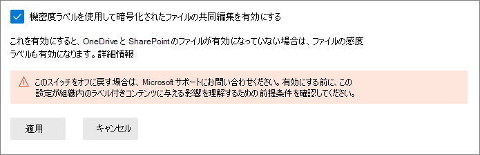
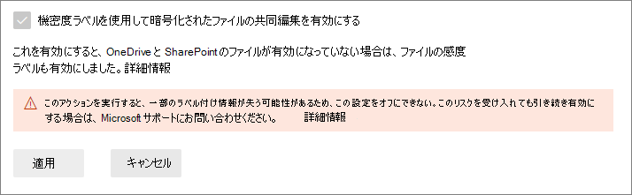

# 機密度ラベルを使用して暗号化されたファイルの共同編集を有効にする

>*[セキュリティとコンプライアンスのための Microsoft 365 ライセンス ガイダンス](/office365/servicedescriptions/microsoft-365-service-descriptions/microsoft-365-tenantlevel-services-licensing-guidance/microsoft-365-security-compliance-licensing-guidance)。*

> [!NOTE]
> この機能は現在プレビュー段階であり、変更される可能性があります。

Office デスクトップ アプリで [共同編集](https://support.office.com/article/ee1509b4-1f6e-401e-b04a-782d26f564a4) をサポートする設定を有効にして、ドキュメントが [秘密度レベル](sensitivity-labels.md) でラベル付け、暗号化されている場合、複数のユーザーがこれらのドキュメントを同時に編集できるようにします。

テナントに対してこの設定が有効になっていないと、ユーザーが Office デスクトップ アプリを使用する度に SharePoint または OneDrive にある暗号化ドキュメントを確認しなければなりません。 そのため、リアルタイムで共同作業を行うことができません。 または、[SharePoint と OneDrive にある Office ファイルが秘密度レベルでラベル付けされている場合には](sensitivity-labels-sharepoint-onedrive-files.md)、ユーザーは Office on the web を使用する必要があります。

さらに、この機能を有効にすると、これらのラベル付きおよび暗号化されたファイルで[自動保存](https://support.office.com/article/what-is-autosave-6d6bd723-ebfd-4e40-b5f6-ae6e8088f7a5)機能がサポートされます。

元のリリースの発表を確認するには、「[Microsoft Information Protection で暗号化されたドキュメントとラベルの更新に関する共同編集の発表](https://techcommunity.microsoft.com/t5/microsoft-security-and/announcing-co-authoring-on-microsoft-information-protection/ba-p/2164162)」に関するブログ投稿を参照してください。

## 機密度ラベル用のメタデータ変更

> [!IMPORTANT]
> 共同編集の設定を有効にすると、暗号化されていないファイルのラベル情報はカスタム プロパティに保存されません。
> 
> ラベルのメタデータを使用しない場所へ読み書きするアプリ、サービス、スクリプト、またはツールを使用する場合は、この設定を有効にしないでください。

Office デスクトップ アプリの共同編集をサポートする設定を有効にする前に、この操作によって Office ファイルに保存され、そこから読み取ることがあるラベル付けメタデータが変更する点を把握していることが重要です。

ラベルのメタデータには、お使いのテナント、適用した機密度ラベルを特定する情報が含まれています。 この設定による変更は、Word、Excel、PowerPoint 用のファイルのメタデータ形式と場所です。 暗号化されたファイルまたはメールに対して操作を行う必要はありません。暗号化されたファイルのメタデータの変更には下位互換性があり、メールへの変更はありません。 ただし、暗号化されたファイルのメタデータの変更に注意する必要があります。この変更により自動的にアップグレードができますが、下位互換性はありません。

この変更は新しくラベル付けされたファイルと、既にラベルが付いているファイルの両方に影響します。 共同編集設定をサポートするアプリとサービスを使用する場合:
- 新しくラベル付けされたファイルには、新しい形式と場所だけをメタデータのラベル付けに使用することができます。
- 既にラベルが付いているファイルには、次にファイルを開いて保存する場合で、ファイルに使用しない形式と場所のメタデータがある場合には、新しい形式と場所にコピーされます。

このメタデータの変更の詳細については、次のリソースを参照できます。

- ブログ投稿: [Upcoming Changes to Microsoft Information Protection Metadata Storage](https://techcommunity.microsoft.com/t5/microsoft-security-and/upcoming-changes-to-microsoft-information-protection-metadata/ba-p/1904418)

- オープン仕様: [2.6.3 LabelInfo とユーザー設定のドキュメントのプロパティ]](/openspecs/office_file_formats/ms-offcrypto/13939de6-c833-44ab-b213-e0088bf02341)

これらの変このため、ラベルのメタデータを使用しない場所へ読み書きするアプリ、サービス、スクリプト、またはツールが組織内にある場合は、この設定を有効にしないでください。そうした場合、結果の例は次のとおりです。

- ラベル付きドキュメントが、ユーザーにはラベル無しと表示される

- ユーザーにドキュメントで使用されていないラベルが表示される

- ラベル付け、暗号化されたドキュメントの共同編集と自動保存は、別のユーザーが新しいラベル付きメタデータをサポートしない Office デスクトップ アプリでドキュメントを開いている場合は機能しません。

- [Office 添付ファイルでカスタム プロパティとしてラベルを識別する](/azure/information-protection/configure-exo-rules#example-2-rule-that-applies-the-encrypt-only-option-to-emails-when-they-have-attachments-that-are-labeled-confidential--partners-and-these-emails-are-sent-outside-the-organization) Exchange Online のメール フロー ルールでは、メールや添付ファイルを暗号化できなくなるか、間違って暗号化されます。

この設定とラベルのメタデータの変更をサポートするアプリとサービスの一覧は、次のセクションを確認します。

## 前提条件

この機能を有効にする前に、次の前提条件を必ず把握します。

- この機能を有効にする場合は、グローバル管理者である必要があります。

- テナントに対して、[SharePoint、OneDrive で Office ファイル](sensitivity-labels-sharepoint-onedrive-files.md) への秘密度レベルを有効にする必要があります。 この機能が有効になっていない場合、秘密度レベルがあるファイルへの共同編集を有効にする設定を選択すると、自動的に有効になります。

- Microsoft 365 Apps for enterprise:
    - **Windows**: 最小バージョン 2105: 6 月 18 日
    - **macOS**: 最小バージョン 16.50
    - **iOS**: まだサポートされていません
    - **Android**: まだサポートされていません

- テナント内のすべてのアプリ、サービス、および運用ツールで、新しい[メタデータのラベル付け](#metadata-changes-for-sensitivity-labels)をサポートしている必要があります。 次のいずれかを使用する場合は、必要な最小バージョンを確認してください。
    
    - **Azure Information Protection 統合ラベル付けクライアントとスキャナー:**
        - [Microsoft ダウンロード センター](https://www.microsoft.com/en-us/download/details.aspx?id=53018)からインストールできるパブリック プレビュー バージョン (AzInfoProtection_2.10.46_CoAuthoring_PublicPreview.exe のインストール名)
    
    - **Windows 用または macOS 用の OneDrive 同期アプリ:**
        - 最小バージョン 19.002.0121.0008
    
    - **エンドポイント データ損失防止 (Endpoint DLP):**
        - Windows 10 version 1809 (KB 4601383)
        - Windows 10 version 1903, version 1909 (KB 4601380)
        - Windows 10 version 2004 (KB 4601382)
    
    - **Microsoft Information Protection SDK を使用するアプリとサービス:** 
        - 最小バージョン 1.7 

この機能を有効にすると、Microsoft 365 サービスで自動的に新しいラベルのメタデータがサポートされます。以下のような例があります。

- [自動ラベル作成ポリシー](apply-sensitivity-label-automatically.md#how-to-configure-auto-labeling-policies-for-sharepoint-onedrive-and-exchange)
- [秘密度レベルを条件として使用する DLP ポリシー](dlp-sensitivity-label-as-condition.md)
- [秘密度レベルの適用が構成されている Microsoft Cloud App Security](/cloud-app-security/best-practices#discover-classify-label-and-protect-regulated-and-sensitive-data-stored-in-the-cloud)

## 制限事項

秘密度ラベルで暗号化されたファイル共同編集設定をテナントに対して有効にする前に、この機能の以下の制限事項を必ず把握します。

- [メタデータのラベル付けの変更](#metadata-changes-for-sensitivity-labels)により、テナントのすべてのアプリ、サービス、運用ツールで新しいラベル メタデータをサポートして、一貫性のある信頼性の高いラベル付けを行う必要があります。
    
    Excel での仕様: 誰かが秘密度ラベルのメタデータの変更をサポートしない Excel のバージョンを使用してファイルを編集、保存すると、暗号化を適用しない秘密度ラベルのメタデータは、そのファイルから削除されることがあります。

- 共同編集と自動保存は、次の [暗号化用の構成](encryption-sensitivity-labels.md#configure-encryption-settings) のどれかを使用する Office ドキュメントのラベル付けと暗号化へはサポートされず、使用もできません。
    - **ラベルを適用する場合にユーザーがアクセス許可を割り当てられ**、**Word、PowerPoint、Excel でユーザーにアクセス許可を指定するように求める** のチェックボックスが選択されています。 この構成は、"ユーザー定義のアクセス許可" と呼ばれる場合があります。
    - **コンテンツへのユーザー アクセスは有効期限が切れています** は、**[使用しない]** 以外の値が設定されています。
    - **二重キー暗号化** が選択されています。
    
    これらの暗号化構成のどれかを使用したラベルは Office アプリで表示されます。 ただし、ユーザーがこれらのラベルを選択し、他のユーザーがドキュメントを編集していない場合、共同編集と自動保存を使用できないという警告が表示されます。 他のユーザーがドキュメントを編集している場合は、ラベルを適用できないというメッセージが表示されます。

- Azure Information Protection 統合ラベル付けクライアントを使用する場合: [その他の要件または制限](/azure/information-protection/known-issues#known-issues-for-co-authoring-public-preview)については、このラベル付けクライアントのドキュメントを確認してください。

## このプレビューでの既知の問題

機密度ラベルで暗号化されたファイルを共同編集しているこのプレビュー バージョンでは、次の既知の問題があります。

- Office for the web で 300 MB 以上の Word ファイル、Excel ファイル、PowerPoint ファイルにラベルを適用できない。 これらのファイルでは、Office デスクトップ アプリを使用してラベルを適用できますが、ファイルを開いているのが自分だけである必要があります。

- 現在ロールアウト中: [秘密度レベルを条件として使用する DLP ポリシーの使用](dlp-sensitivity-label-as-condition.md)と、メールの暗号化されていない添付ファイルのサポート。

- 一部のドキュメントは、[パスワード保護](https://support.microsoft.com/office/require-a-password-to-open-or-modify-a-workbook-10579f0e-b2d9-4c05-b9f8-4109a6bce643)、[共有ブック](https://support.microsoft.com/office/about-the-shared-workbook-feature-49b833c0-873b-48d8-8bf2-c1c59a628534)、または ActiveX コントロールを含むコンテンツなどの機能のため、秘密度ラベルと互換性がありません。 その他の理由は、「[Office の共同編集のトラブルシューティング](https://support.microsoft.com/office/troubleshoot-co-authoring-in-office-bd481512-3f3a-4b6d-b7eb-ebf9d3626ae7)」に記載されています。 これらのドキュメントには、「**アップロードに失敗しました**」というメッセージが表示され、**[変更を破棄する]** オプションを選択する必要があります。 この問題が解決されるまで、この失敗メッセージで識別されるこれらのドキュメントにラベルを付けないでください。

- iOS 用 Office アプリと Android 用 Office アプリがサポートされていない。

## 機密度ラベルを使用したファイルの共同編集を有効にする方法

> [!CAUTION]
> この設定をオンにすることは一方向のアクションです。この機能がプレビュー中は、メタデータの変更、前提条件、制限事項、このページに記載されている既知の問題を確認して理解した上で実行してください。

1. テナントのグローバル管理者として [Microsoft 365 コンプライアンス センター](https://compliance.microsoft.com) にサインインします。

2. ナビゲーション ウィンドウで、**[設定]** > **[秘密度ファイルを含むファイルの共同編集]** の順に選択します。

2. **[秘密度ファイルを含むファイルの共同編集 (プレビュー)]** ページで、概要の説明、前提条件、予想される内容、さらに 「この設定をオンにすると設定を戻すことができません」 という警告を読みます。
    
    **機密度ラベルを使用したファイルの共同編集を有効にする** を選んでから **適用** を選びます。
    
    

3. この設定が環境全体に複製されるのを 24 時間待ってから、この共同編集用の新機能を使用します。

## この機能を無効にする必要がある場合は、サポートにお問い合わせください。

> [!IMPORTANT]
> この機能を無効にする必要がある場合、ラベル情報が失われることがあります。ご注意ください。

テナントに対して機密度ラベルを使用したファイルの共同編集を有効にすると、自身ではこの設定を無効にすることはできません。 そのため、この前提条件、結果、制限事項を確認して理解した上でこの設定を有効にすることが重要です。

スクリーンショットからでもわかるように、この設定がオンになっている場合は [Microsoft サポート](../business-video/get-help-support.md) に問い合わせてこの設定を無効にするようにリクエストできます。 このリクエストには数日かかる場合があり、テナントのグローバル管理者であることを証明する必要があります。 通常のサポート料金が適用されることをご了承ください。 

サポート エンジニアがテナントに対してこの設定を無効にした場合:

- 新しいラベルのメタデータをサポートするアプリとサービスには、ラベルが読み取りまたは保存された元のメタデータ形式と場所に戻すことができます。

- この設定を有効にしていた間に使用された Office ドキュメントの新しいメタデータ形式と場所は、元の形式と場所にはコピーされません。 そのため、暗号化されていない Word、Excel、PowerPoint のファイルに関するこのラベル情報は失われます。

- ラベル付きおよび暗号化されたドキュメントの共同編集と自動保存は、テナントでは機能しなくなりました。

- OneDrive、SharePoint の Office ファイルへの機密度ラベルは有効なままです。