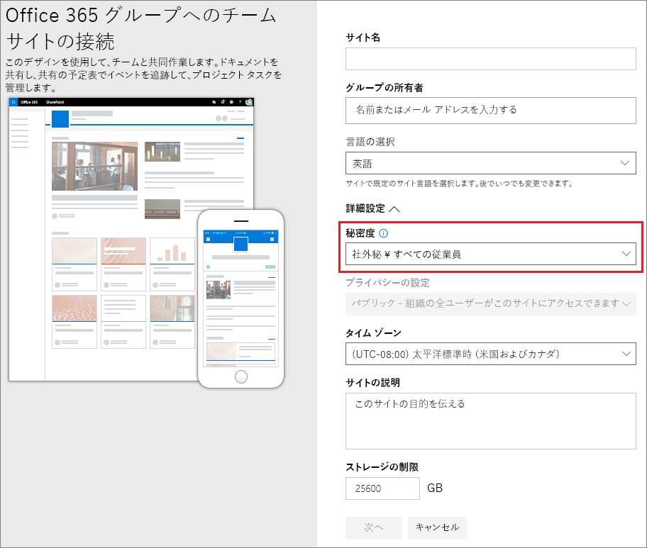
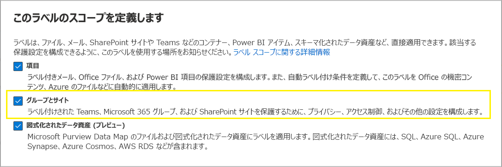

# <a name="use-sensitivity-labels-to-protect-content-in-microsoft-teams-microsoft-365-groups-and-sharepoint-sites"></a>秘密度ラベルを使用して、Microsoft Teams、Microsoft 365 グループ、SharePoint サイトのコンテンツを保護する

>*[セキュリティとコンプライアンスのための Microsoft 365 ライセンス ガイダンス](/office365/servicedescriptions/microsoft-365-service-descriptions/microsoft-365-tenantlevel-services-licensing-guidance/microsoft-365-security-compliance-licensing-guidance)。*

[秘密度ラベル](sensitivity-labels.md) を使用して、ドキュメントやメールを保護するだけでなく、Microsoft Teams サイト、Microsoft 365 グループ ([以前は Office 365 グループ](https://techcommunity.microsoft.com/t5/microsoft-365-blog/office-365-groups-will-become-microsoft-365-groups/ba-p/1303601))、およびSharePoint サイトなどのコンテナーにあるコンテンツを保護するために、秘密度ラベルを使用することもできます。 コンテナー レベルの保護を設定するには、次のラベル設定を使用します。

- チーム サイトおよび Microsoft 365 グループのプライバシー (パブリックまたはプライベート)
- 外部ユーザーのアクセス
- SharePoint サイトからの外部共有
- 非管理対象デバイスからのアクセス
- 認証コンテキスト (プレビュー段階)
- SharePoint サイトの既定共有リンク (PowerShell のみの構成)
- プレビュー中: サイト共有設定 (PowerShell 専用構成)

> [!IMPORTANT]
> 非管理対象デバイスと認証コンテキストの設定は、Azure Active Directory の条件付きアクセスと連動しています。 これらの設定に秘密度ラベルを使用したい場合は、この依存機能を設定する必要があります。 追加情報については、以下の手順を参照してください。

サポートされているコンテナーにこの秘密度ラベルを適用すると、秘密度カテゴリーおよび構成された保護設定がサイトまたはグループに自動的に適用されます。

ただし、これらのコンテナーのコンテンツは、視覚的なマーキング、および暗号化の秘密度カテゴリーまたはファイルとメールの設定のラベルを継承しません。 ユーザーが SharePoint サイトまたはチーム サイトでドキュメントにラベルを付けられるようにするには、[SharePoint および OneDrive で Office ファイルの秘密度ラベルを有効にします](sensitivity-labels-sharepoint-onedrive-files.md)。

コンテナー ラベルは、[他の言語](create-sensitivity-labels.md#additional-label-settings-with-security--compliance-powershell) の表示をサポートせず、ラベル名と説明に対してのみ元の言語を表示します。

## <a name="using-sensitivity-labels-for-microsoft-teams-microsoft-365-groups-and-sharepoint-sites"></a>Microsoft Teams、Microsoft 365 グループ、およびSharePoint サイトで秘密度ラベルを使用する

コンテナーの秘密度ラベルを有効化し、新しい設定の秘密度ラベルを構成する前に、ユーザーはアプリで秘密度ラベルを表示および適用できます。たとえば、Word では次のようなことができます。

:::image type="content" source="../media/sensitivity-label-word.png" alt-text="Word デスクトップ アプリに表示される秘密度ラベル。" lightbox="../media/sensitivity-label-word.png"

コンテナーの秘密度ラベルを有効にして構成すると、ユーザーは追加で秘密度ラベルを表示し、Microsoft チーム サイト、Microsoft 365 グループ、および SharePoint サイトに適用することができます。たとえば、SharePoint から新しいチーム サイトを作成する場合:



> [!NOTE]
> コンテナーの秘密度ラベルは、[Teams 共有チャネル](/MicrosoftTeams/shared-channels)をサポートします。 チームに共有チャネルがある場合、そのチームは親チームから秘密度ラベル設定を自動的に継承し、そのラベルを削除したり、別のラベルに置き換えたりすることはできません。

## <a name="how-to-enable-sensitivity-labels-for-containers-and-synchronize-labels"></a>コンテナーの秘密度ラベルを有効化してラベルを同期する方法

まだコンテナーの秘密度ラベルを有効にしていない場合は、以下の一連の手順を一度だけ実行してください。

1. この機能は Azure AD 機能を使用するため、Azure AD のドキュメント [「Azure Active Directory で Microsoft 365 グループに秘密度ラベルを割り当てる」](/azure/active-directory/users-groups-roles/groups-assign-sensitivity-labels) の指示に従い、秘密度ラベルのサポートを有効にします。

2. 秘密度ラベルを Azure AD に同期することが必要になります。 まず、[セキュリティ/コンプライアンス PowerShell に接続します](/powershell/exchange/office-365-scc/connect-to-scc-powershell/connect-to-scc-powershell)。

   たとえば、管理者として実行している PowerShell セッションで、グローバル管理者アカウントでサインインします。

3. 秘密度ラベルを Microsoft 365 グループで使用できるように、次のコマンドを実行します。

    ```powershell
    Execute-AzureAdLabelSync
    ```

## <a name="how-to-configure-groups-and-site-settings"></a>グループとサイト設定を構成する方法

前のセクションで説明したとおり、コンテナーの秘密度レベルを有効にすると、秘密度レベル構成でグループとサイトの保護設定を構成できるようになります。 コンテナーの秘密度ラベルが有効になるまでは、設定が表示されますが、構成することはできません。

1. 一般的な手順に従って、[秘密度レベルを作成または編集](create-sensitivity-labels.md#create-and-configure-sensitivity-labels)し、ラベルのスコープとして **[グループとサイト]** を選択していることを確認します。 
    
    
    
    ラベルにこのスコープのみが選択されている場合、秘密度レベルをサポートする Office アプリにはラベルが表示されず、ファイルやメールに適用できません。 このようにラベルを分離すると、ユーザーと管理者の両方に役立ちますが、ラベルの展開が複雑になる可能性もあります。
    
    たとえば、SharePoint はラベル付きドキュメントがラベル付きサイトにアップロードされたことを検出するため、[ラベルの順序](sensitivity-labels.md#label-priority-order-matters)を注意深く確認する必要があります。 このシナリオでは、ドキュメントの秘密度ラベルの優先度がサイトのラベルよりも高い場合、監査イベントとメールが自動的に生成されます。 詳細については、このページの「[秘密度レベル アクティビティの監査](#auditing-sensitivity-label-activities)」セクションを参照してください。 

2. 次に、**[グループとサイトの保護設定の定義]** ページで、使用可能なオプションの 1 つまたは両方を選択します。
    
    - **[プライバシーと外部ユーザーのアクセス設定]** を使用して、**[プライバシー]** と **[外部ユーザーのアクセス]** 設定を構成します。 
    - **[外部共有および条件付きアクセスの設定]** で、**[ラベル付けされた SharePoint サイトからの外部共有を制御する]** および **[Azure AD 条件付きアクセスを使用して、ラベル付き SharePoint サイトを保護]** 設定を構成します。

3. **[プライバシーと外部ユーザー アクセス設定]** を選択した場合は、次の設定を構成します。
    
    - **プライバシー**: 組織内の誰かがこのラベルが適用されているチーム サイトまたはグループにアクセスできるようにする場合は、既定の **[パブリック]** をそのまま使用します。
        
        組織内の承認されたメンバーのみにアクセスを制限する場合は、[**プライベート**] を選択します。
        
        秘密度ラベルを使用してコンテナー内のコンテンツを保護し、ユーザーが自分でプライバシー設定を構成できるようにする場合は、**[なし]** を選択します。
        
        このラベルをコンテナーに適用すると、[**パブリック**] または [**プライベート**] の設定によってプライバシー設定が設定およびロックされます。 選択した設定は、チームまたはグループに構成されている可能性がある以前のプライバシー設定を置き換え、プライバシー値をロックします。これにより、コンテナーから最初に秘密度ラベルを削除することによってのみ、変更できるようになります。 秘密度ラベルを削除しても、ラベルからのプライバシー設定は維持され、ユーザーは再びラベルを変更することができます。
    
    - **外部ユーザー アクセス**: グループの所有者が [ゲストをグループに追加](/office365/admin/create-groups/manage-guest-access-in-groups)できるかどうかを制御します。

4. **[外部共有および条件付きアクセスの設定]** を選択した場合は、次の設定を構成します。
    
    - **[ラベル付き SharePoint サイトからの外部共有を制御]**: このオプションを選択して、すべてのユーザー、新規および既存のゲストを選択するか、組織内のユーザのみを選択します。 この構成と設定の詳細については、「SharePoint ドキュメント」で [サイトへのの外部共有を有効または無効にする](/sharepoint/change-external-sharing-site) を参照します。
    
    - **Azure AD 条件付きアクセスを使用して、ラベル付き SharePoint サイトを保護**: [Azure Active Directory の条件付きアクセス](/azure/active-directory/conditional-access/overview)を構成して使用している場合のみ、このオプションを選択します。次に、次のいずれかの設定を選択します。
    
        - **ユーザーが管理外のデバイスから SharePoint サイトにアクセスできるかどうかを決定する**: このオプションでは、Azure ADの条件付きアクセスを使用して、管理されていないデバイスからの SharePoint および OneDrive コンテンツへのアクセスをブロックまたは制限する SharePoint 機能を使用します。 詳細については、SharePoint ドキュメントの「[非管理対象デバイスからのアクセスの制御](/sharepoint/control-access-from-unmanaged-devices)」を参照してください。 このラベル設定を指定するオプションは、SharePoint の手順から「[特定の SharePoint サイトまたは OneDrive からのアクセスをブロックまたは制限する](/sharepoint/control-access-from-unmanaged-devices#block-or-limit-access-to-a-specific-sharepoint-site-or-onedrive)」セクションの手順 3 - 5 で説明しているように、サイトの PowerShell コマンドを実行することと同じです。
            
            追加の構成情報については、このセクションの最後にある「[非管理対象デバイス オプションの依存関係に関する詳細情報](#more-information-about-the-dependencies-for-the-unmanaged-devices-option)」を参照してください。
            
        - **既存の認証コンテキストを選択する**: 現在プレビュー版ですが、このラベルが適用されている SharePoint サイトにユーザーがアクセスする場合に、より厳しいアクセス条件を適用することができます。 これらの条件は、組織の条件付きアクセスを展開するために作成され、公開された既存の認証コンテキストを選択した場合に適用されます。 ユーザーが構成された条件を満たさない場合や、認証コンテキストをサポートしていないアプリを使用している場合は、アクセスが拒否されます。
            
            追加の構成情報については、このセクションの最後にある「[認証コンテキスト オプションの依存関係に関する詳細情報](#more-information-about-the-dependencies-for-the-authentication-context-option)」を参照してください。
            
            このラベルの構成例は、以下のとおりです。
            
             - [多要素認証 (MFA)](/azure/active-directory/conditional-access/untrusted-networks) を必要とするように構成された認証コンテキストを選択します。 このラベルは、非常に機密性の高い社外秘のアイテムを含む SharePoint サイトに適用されます。 その結果、信頼されていないネットワークのユーザーがこのサイトのドキュメントにアクセスしようとすると、ドキュメントにアクセスする前に完了する必要がある MFA プロンプトが表示されます。
             
             - [使用条件 (ToU) ポリシー](/azure/active-directory/conditional-access/terms-of-use)に基づいて構成された認証コンテキストを選択します。 このラベルは、法務上またはコンプライアンス上の理由から使用条件の承認が必要なアイテムを含む SharePoint サイトに適用されます。 その結果、ユーザーがこのサイト内の文書にアクセスしようとすると、使用条件のドキュメントが表示され、それに同意しないと元の文書にアクセスできないようになっています。

> [!IMPORTANT]
> チーム、グループ、またはサイトにラベルを適用すると、それらのサイトとグループの設定のみが有効になります。 [ラベルのスコープ](sensitivity-labels.md#label-scopes)にファイルとメールが含まれている場合、暗号化やコンテンツ マーキングなどのその他のラベル設定は、チーム、グループ、またはサイト内のコンテンツに適用されません。

秘密度ラベルがまだ公開されていない場合は、[秘密度ラベル ポリシーに追加](create-sensitivity-labels.md#publish-sensitivity-labels-by-creating-a-label-policy)して公開します。 このラベルを含む秘密度ラベル ポリシーが割り当てられているユーザーには、サイトとグループ用にそのラベルを選択できます。

##### <a name="more-information-about-the-dependencies-for-the-unmanaged-devices-option"></a>非管理対象デバイス オプションの依存関係に関する詳細情報

「[アプリによる制限の使用](/sharepoint/app-enforced-restrictions)」に記載されているように SharePoint の依存条件付きアクセス ポリシーを構成しない場合は、ここで指定したオプションに影響ありません。 また、テナントレベルで構成された設定よりも制限が少ない場合は影響はありません。 管理されていないデバイスの組織全体の設定を構成している場合は、同じかより制限の厳しいレベルのラベル設定を選択します

たとえば、テナントが [**制限されたWebのみのアクセスを許可する**] に構成されている場合、フルアクセスを許可するラベル設定は制限が少ないため、効果がありません。 このテナントレベルの設定では、アクセスをブロックするためのラベル設定 (より制限的) または制限付きアクセスのためのラベル設定 (テナント設定と同じ) を選択します。

SharePoint 設定はラベル構成とは別に構成できるため、秘密度ラベル構成で依存関係が設定されているかどうかのチェックは行われません。 これらの依存関係は、ラベルが作成および公開された後、およびラベルが適用された後でも構成できます。 ただし、ラベルがすでに適用されている場合、ラベル設定は、ユーザーが次に認証するまで有効になりません。

##### <a name="more-information-about-the-dependencies-for-the-authentication-context-option"></a>認証コンテキスト オプションの依存関係に関する詳細情報

ドロップダウン リストに表示して選択するには、Azure Active Directory 条件付きアクセスの構成の一部として、認証コンテキストを作成し、構成して公開する必要があります。 詳細および手順については、Azure AD 条件付きアクセス ドキュメントの[[認証コンテキストの構成]](/azure/active-directory/conditional-access/concept-conditional-access-cloud-apps#configure-authentication-contexts) セクションを参照してください。

すべてのアプリが認証コンテクストをサポートするわけではありません。サポートされていないアプリを使用しているユーザーが、認証コンテキストを構成済みのサイトにアクセスすると、アクセス拒否のメッセージが表示されるか、認証を求められるものの拒否される問題が発生します。現在、認証コンテクストをサポートするアプリは以下のとおりです。

- Office for the Web (Web 用 Office を含む)

- Windows および macOS 用の Microsoft Teams (Teams Web アプリを除く)

- Microsoft Planner

- Microsoft 365 Apps for Word、Excel、PowerPoint の最小バージョンは以下のとおりです。
    - Windows: 2103
    - macOS: 16.45.1202
    - iOS: 2.48.303
    - Android: 16.0.13924.10000

- Microsoft 365 Apps for Outlook の最小バージョンは以下のとおりです。
    - Windows: 2103
    - macOS: 16.45.1202
    - iOS: 4.2109.0
    - Android: 4.2025.1

- OneDrive 同期アプリの最小バージョンは以下のとおりです。
    - Windows: 21.002
    - macOS: 21.002
    - iOS: 12 月 30 日にロールアウト
    - Android: まだサポートされていません

このプレビューでの既知の制限事項は以下のとおりです。

- OneDrive 同期アプリについては、OneDrive のみサポートし、他のサイトはサポートしていません。

- 次の機能やアプリは、認証コンテキストとの互換性がない場合があるため、ユーザーが認証コンテキストを使用してサイトへのアクセスに成功した後、これらの機能が継続して動作するかどうかを確認することをお勧めします。
    
    - PowerApps や Power Automate を使用したワークフロー
    - サードパーティ製アプリ

### <a name="configure-settings-for-the-default-sharing-link-type-for-a-site-by-using-powershell-advanced-settings"></a>PowerShell の詳細設定を使用してサイトの既定の共有依存タイプの設定を構成する

Microsoft Purview コンプライアンス ポータルから構成できるサイトおよびグループのラベル設定に加えて、サイトの既定の共有依存タイプを構成することもできます。 ドキュメントの秘密度ラベルは、既定の共有依存タイプに対して構成することもできます。 ユーザーが Office アプリで **[共有]** ボタンを選択すると、過剰な共有を防ぐのに役立つこれらの設定が自動的に選択されます。 

詳細と手順については、「[秘密度ラベルを使用して、SharePoint と OneDrive のサイトとドキュメントの既定の共有依存タイプを構成する](sensitivity-labels-default-sharing-link.md)」を参照してください。

### <a name="configure-site-sharing-permissions-by-using-powershell-advanced-settings"></a>PowerShell の詳細設定を使用したサイト共有アクセス許可の構成

> [!NOTE]
> このラベル設定は現在プレビューの段階です。

SharePoint サイトに適用する秘密度ラベルに構成できる別の PowerShell 詳細設定は、**MembersCanShare** です。 この設定は、SharePoint 管理センター > **[サイト アクセス許可]**、 > **[サイト共有]**、 > **[メンバーの共有方法を変更する]**、 > **[共有アクセス許可]** で設定できる設定と同等のものです。 

次の 3 つのオプションが、PowerShell 詳細設定 **MembersCanShare** と同等の値で一覧表示されます。

|SharePoint 管理センターのオプション |MembersCanShare と等しい PowerShell の値。 |
|----------------------------------------|------------------------------------------------|
|**サイトの所有者とメンバーは、ファイル、フォルダー、サイトを共有できます。編集権限を持つユーザーは、ファイルとフォルダーを共有できます**。| MemberShareAll|
|**サイトの所有者とメンバー、および編集アクセス許可を持つユーザーは、ファイルとフォルダーを共有できますが、サイトの所有者のみがサイトを共有できます。**|MemberShareFileAndFolder|
|**サイト所有者のみが、ファイル、フォルダー、およびサイトを共有できます**。|MemberShareNone|

これらの構成オプションの詳細については、SharePoint コミュニティ ドキュメントで、「[メンバーを共有する方法を変更する](/microsoft-365/community/sharepoint-security-a-team-effort#change-how-members-can-share)」を参照してください。

例、秘密度ラベル GUID は **8faca7b8-8d20-48a3-8ea2-0f96310a848e** です:

````powershell
Set-Label -Identity 8faca7b8-8d20-48a3-8ea2-0f96310a848e -AdvancedSettings @{MembersCanShare="MemberShareNone"}
````

PowerShell の詳細設定の指定に関する詳細については、「[PowerShell の詳細設定の指定に関するヒント](create-sensitivity-labels.md#powershell-tips-for-specifying-the-advanced-settings)」を参照してください。

## <a name="sensitivity-label-management"></a>機密ラベルの管理

サイトとグループに対して構成されている秘密度ラベルを作成、変更、または削除する場合は、次のガイダンスを使用します。

### <a name="creating-and-publishing-labels-that-are-configured-for-sites-and-groups"></a>サイトとグループに対して構成されているラベルを作成して発行する

このラベルがサイトおよびグループの設定に対して構成されている場合、次のガイダンスを使用して、ユーザーのラベルを発行します。

1. 秘密度ラベルを作成し構成したら、少数のテスト ユーザーにのみ適用されるラベル ポリシーにこのラベルを追加します。

2. 変更がレプリケートされるまで待機します。
    
   - 新規ラベル: 少なくとも 1 時間待機します。
   - 既存のラベル: 少なくとも 24 時間待機します。
    
    ラベルのタイミングの詳細については、「[新しいラベルと変更が反映されるタイミング](create-sensitivity-labels.md#when-to-expect-new-labels-and-changes-to-take-effect)」を参照してください。

3. この待ち時間の後、テスト ユーザー アカウントのいずれかを使用して、手順 1 で作成したラベルを持つチーム、Microsoft 365 グループ、または SharePoint サイトを作成します。

4. この作成操作中にエラーが発生しなかった場合、テナント内のすべてのユーザーに安全にラベルを発行できます。

### <a name="modifying-published-labels-that-are-configured-for-sites-and-groups"></a>サイトとグループに対して構成されている発行済みのラベルを変更する

ベスト プラクティスとして、秘密度ラベルを複数のチーム、グループ、またはサイトに適用した後に、ラベルのサイトとグループの設定を変更しないようにします。 この場合、ラベルが適用されているすべてのコンテナーに変更が複製されるまで少なくとも 24 時間待機することを忘れないでください。

また、**外部ユーザーのアクセス** 設定を含む変更は、次のようになります。

- 新しい設定は新しいユーザーに適用されますが、既存のユーザーには適用されません。たとえば、この設定は以前に選択されていて、その結果、ゲスト ユーザーがサイトにアクセスした場合、この設定をラベル構成で解除した後も、これらのゲスト ユーザーはサイトにアクセスできます。

- HiddenMembership および roleEnabled グループ プロパティのプライバシー設定は更新されません。

### <a name="deleting-published-labels-that-are-configured-for-sites-and-groups"></a>サイトとグループに対して構成されている発行済みラベルを削除する

サイトとグループの設定を有効にして秘密度ラベルの削除を行い、そのラベルが 1 つ以上のラベル ポリシーに含まれている場合、新しいチーム、グループ、サイトの作成に失敗してしまう可能性があります。この状況を回避するには、次のガイダンスを使用してください。

1. ラベルを含むすべてのラベル ポリシーから、機密ラベルを削除します。

2. 少なくとも 1 時間待機します。

3. この待ち時間の後、チーム、グループ、またはサイトを作成し、ラベルが表示されなくなったことを確認してください。

4. 秘密度ラベルが表示されていない場合は、ラベルを安全に削除できます。

## <a name="how-to-apply-sensitivity-labels-to-containers"></a>コンテナーに秘密度ラベルを適用する

これで、１つまたは複数の秘密度ラベルを次のようなコンテナーに適用する準備ができました。

- [Azure AD の Microsoft 365 グループ](#apply-sensitivity-labels-to-microsoft-365-groups)
- [Microsoft Teams のチーム サイト](#apply-a-sensitivity-label-to-a-new-team)
- [Outlook on the web の Microsoft 365 グループ](#apply-a-sensitivity-label-to-a-new-group-in-outlook-on-the-web)
- [SharePoint サイト](#apply-a-sensitivity-label-to-a-new-site)

[複数のサイトに秘密度ラベルを適用する](#use-powershell-to-apply-a-sensitivity-label-to-multiple-sites) 必要がある場合、PowerShell を使用できます。

### <a name="apply-sensitivity-labels-to-microsoft-365-groups"></a>Microsoft 365 グループに秘密度ラベルを適用する

これで、1 つまたは複数の秘密度ラベルを Microsoft 365 グループに適用する準備ができました。 手順については、Azure AD のドキュメントに戻ります。

- 「[Assign a label to a new group in Azure portal (Azure ポータルの新しいグループにラベルを割り当てる)](/azure/active-directory/users-groups-roles/groups-assign-sensitivity-labels#assign-a-label-to-a-new-group-in-azure-portal)」

- [Assign a label to an existing group in Azure portal (Azure ポータルの既存のグループにラベルを割り当てる)](/azure/active-directory/users-groups-roles/groups-assign-sensitivity-labels#assign-a-label-to-an-existing-group-in-azure-portal)

- 「[Remove a label from an existing group in Azure portal (Azure ポータルの既存のグループからラベルを削除する)](/azure/active-directory/users-groups-roles/groups-assign-sensitivity-labels#remove-a-label-from-an-existing-group-in-azure-portal).」

### <a name="apply-a-sensitivity-label-to-a-new-team"></a>新しいチームに機密ラベルを適用する

ユーザーは、Microsoft Teams で新しいチームを作成する際に機密ラベルを選択できます。 **[秘密度]** ドロップダウンからラベルを選択すると、プライバシー設定によってラベル構成が変更される場合があります。 ラベルに対し選択した外部ユーザーのアクセス設定に応じて、ユーザーは組織外のユーザーをチームに追加することができたり、できなかったりします。

[Teams の機密ラベルの詳細について](/microsoftteams/sensitivity-labels)


チームを作成すると、すべてのチャネルの右上隅に機密ラベルが表示されます。


このサービスは、Microsoft 365 グループおよび接続された SharePoint チーム サイトに対して同じ秘密度ラベルを自動的に適用します。

### <a name="apply-a-sensitivity-label-to-a-new-group-in-outlook-on-the-web"></a>Outlook on the web の新しいグループに機密ラベルを適用する

Outlook on the web では、新しいグループを作成するときに、公開されたラベルの [**機密**] オプションを選択または変更できます。

![グループを作成し、[機密] 下でオプションを選択する。](../media/sensitivity-label-new-group.png)

### <a name="apply-a-sensitivity-label-to-a-new-site"></a>新しいサイトに機密ラベルを適用する

管理者およびエンド ユーザーは、[最新のチーム サイトやコミュニケーション サイトを作成する](/sharepoint/create-site-collection)際に秘密度ラベルを選択し、以下のような **詳細設定** を行うことができます。

![サイトを作成し、[機密] 下でオプションを選択する。](../media/sensitivity-label-new-communication-site.png)

ドロップダウン ボックスには選択したラベル名が表示され、ヘルプ アイコンにはすべてのラベル名とヒントが表示されます。これにより、ユーザーは適用するラベルを正しく選ぶことができます。

ラベルが適用され、ユーザーがサイトを参照すると、ラベルの名前および適用されているポリシーが表示されます。 たとえば、以下のサイトでは、**秘密** のラベル付けがされており、プライバシー設定は **プライベート** になっています。

:::image type ="content" source="../media/sensitivity-label-site.png" alt-text="機密ラベルが適用されているサイト。" lightbox="../media/sensitivity-label-site.png":::

### <a name="use-powershell-to-apply-a-sensitivity-label-to-multiple-sites"></a>PowerShell を使用して、複数のサイトに秘密度ラベルを適用する

[Set-SPOSite](/powershell/module/sharepoint-online/set-sposite) と [Set-SPOTenant](/powershell/module/sharepoint-online/set-spotenant) コマンドレットを使用して、現在の [SharePoint Online 管理シェル](/powershell/sharepoint/sharepoint-online/connect-sharepoint-online)の *SensitivityLabel* パラメーターによって、多くのサイトに秘密度ラベルを適用できます。サイトには、任意の SharePoint サイトコレクション、または OneDrive サイトを使用できます。

SharePoint Online 管理シェルのバージョン16.0.19418.12000 以降があることを確認します。

1. **[管理者として実行]** オプションを使用して PowerShell セッションを開きます。

2. ラベルの GUID がわからない場合、[セキュリティ/コンプライアンス PowerShellに接続し](/powershell/exchange/connect-to-scc-powershell)、秘密度ラベルとそれらの GUID のリストを取得します。

   ```powershell
   Get-Label |ft Name, Guid
   ```

3. ここでは、[SharePoint Online PowerShellに接続して](/powershell/sharepoint/sharepoint-online/connect-sharepoint-online)、ラベルの GUID を変数として保存します。以下に例を示します。

   ```powershell
   $Id = [GUID]("e48058ea-98e8-4940-8db0-ba1310fd955e")
   ```

4. URL に共通の識別文字列が含まれる複数のサイトを特定する新しい変数を作成します。例:

   ```powershell
   $sites = Get-SPOSite -IncludePersonalSite $true -Limit all -Filter "Url -like 'documents"
   ```

5. これらのサイトにラベルを適用するには、次のコマンドを実行します。例:

   ```powershell
   $sites | ForEach-Object {Set-SPOTenant $_.url -SensitivityLabel $Id}
   ```

この一連のコマンドを使用すると、テナント全体の複数のサイトに同じ秘密度ラベルを付けることができます。そのため、サイトごとの構成用の Set-SPOSite コマンドレットではなく、Set-SPOTenant コマンドレットを使用します。 ただし、特定のサイトに異なるラベルを適用する必要がある場合は、サイトごとに次のコマンドを繰り返して、Set-SPOSite コマンドレットを使用します。`Set-SPOSite -Identity <URL> -SensitivityLabel "<labelguid>"`

## <a name="view-and-manage-sensitivity-labels-in-the-sharepoint-admin-center"></a>SharePoint 管理センターで秘密度ラベルを表示し管理する

適用された秘密度ラベルを表示、並べ替え、および検索するには、新しい SharePoint 管理センターの <a href="https://go.microsoft.com/fwlink/?linkid=2185220" target="_blank">**[アクティブなサイト]**</a> を使用します。最初に **[秘密度]** 列を追加する必要がある場合があります。

:::image type="content" source="../media/manage-site-sensitivity-labels.png" alt-text="[アクティブなサイト] ページの [秘密度] 列。" lightbox="../media/manage-site-sensitivity-labels.png"

列を追加する方法など、[アクティブなサイト] ページからサイトを管理する方法の詳細については、「[新しい SharePoint 管理センターでサイトを管理する](/sharepoint/manage-sites-in-new-admin-center)」 を参照してください。

このページからラベルを変更して適用することもできます。

1. [詳細] ウィンドウを開くには、サイト名を選択します。

2. [**ポリシー**] タブを選択し、**秘密度** の設定で [**編集**] を選択します。

3. **[感度設定の編集]** ウィンドウで、サイトに適用する感度ラベルを選択します。 特定のユーザーに対して感度ラベルを割り当てできるユーザー アプリとは異なり、管理センターにはテナントのすべての感度ラベルが表示されます。 ラベルを選択したら、**[保存]** を 選択します。

## <a name="support-for-sensitivity-labels"></a>秘密度ラベルのサポート

Azure Active Directory ポータルを除いて、秘密度ラベルをサポートする管理センターを使用すると、テナントのすべての秘密度ラベルが表示されます。 一方、公開ポリシーに従って感度ラベルをフィルター処理するユーザー アプリとサービスでは、これらのラベルのサブセットが表示される可能性があります。 Azure Active Directory ポータルは、公開ポリシーに従ってラベルもフィルター処理します。

次のアプリとサービスで、サイトとグループの設定用に構成した秘密度ラベルをサポートしています。

- 管理センター:

  - SharePoint 管理センター
  - Teams 管理センター
  - Microsoft 365 管理センター
  - Microsoft Purview コンプライアンス ポータル

- ユーザーのアプリとサービス:

  - SharePoint
  - Teams
  - Outlook on the web、Outlook for Windows、MacOS、iOS、Android
  - フォーム
  - Stream
  - Planner 

次のアプリとサービスで、サイトとグループの設定用に構成した秘密度ラベルをサポートしています。

- 管理センター:

  - Exchange 管理センター

- ユーザーのアプリとサービス:

  - Dynamics 365
  - Yammer
  - Project
  - Power BI
  - マイ アプリ ポータル

## <a name="classic-azure-ad-group-classification"></a>従来の Azure AD グループの分類

コンテナーの秘密度ラベルを有効にすると、Azure AD からのグループ分類は Microsoft 365 でサポートされなくなり、秘密度ラベルをサポートするサイトには表示されなくなります。ただし、古い分類を秘密度ラベルに変換することはできます。

SharePoint の古いグループ分類を使用した場合の例として、「[SharePoint の "モダン" サイトの分類」](/sharepoint/dev/solution-guidance/modern-experience-site-classification)を参照してください。

これらの分類は、Azure AD PowerShell または PnP コア ライブラリを使用し、`ClassificationList` 設定に値を定義することによって構成されています。 テナントに分類値が定義されている場合は、[AzureADPreview PowerShell モジュール](https://www.powershellgallery.com/packages/AzureADPreview)から次のコマンドを実行すると、それらが表示されます。

```powershell
($setting["ClassificationList"])
```

古い分類を機密ラベルに変換するには、次のいずれかの操作を行います。

- 既存のラベルを使用: 既に公開されている既存の機密ラベルを編集して、サイトおよびグループに必要なラベル設定を指定します。

- 新しいラベルの作成: 既存の分類と同じ名前を持つ新しい機密ラベルを作成および公開して、サイトおよびグループに必要なラベル設定を指定します。

その後で以下の手順に従います。

1. PowerShell を使用し、既存の Microsoft 365 グループおよび SharePoint サイトに名前のマッピングを使用して秘密度ラベルを適用します。手順については、次のセクションを参照してください。

2. 既存のグループおよびサイトから古い分類を削除します。

機密ラベルをまだサポートしていないアプリやサービスでユーザーが新しいグループを作成できないようにすることはできませんが、定期的な PowerShell スクリプトを実行して、ユーザーが古い分類で作成した新しいグループを探し、機密ラベルを使用するようにそれらを変換することができます。

サイトとグループの秘密度ラベルと Azure AD の分類の共存を管理する方法については、「[Microsoft 365 グループの Azure Active Directory の分類と秘密度ラベル](migrate-aad-classification-sensitivity-labels.md)」 を参照してください。

### <a name="use-powershell-to-convert-classifications-for-microsoft-365-groups-to-sensitivity-labels"></a>PowerShell を使用して Microsoft 365 グループの分類を秘密度ラベルに変換する

1. まず、[セキュリティ/コンプライアンス PowerShell に接続します](/powershell/exchange/office-365-scc/connect-to-scc-powershell/connect-to-scc-powershell)。

   たとえば、管理者として実行している PowerShell セッションで、グローバル管理者アカウントでサインインします。

2. [Get-Label](/powershell/module/exchange/get-label) コマンドレットを使用して、機密ラベルおよびその GUID のリストを取得します。

   ```powershell
   Get-Label |ft Name, Guid
   ```

3. Microsoft 365 グループに適用する秘密度ラベルの GUID をメモします。

4. ここでは、別の Windows PowerShell ウィンドウで [Exchange Online PowerShell に接続します](/powershell/exchange/connect-to-exchange-online-powershell)。

5. 次のコマンドを例として使用して、現在 "一般" の分類を持つグループのリストを取得します。

   ```PowerShell
   $Groups= Get-UnifiedGroup | Where {$_.classification -eq "General"}
   ```

6. グループごとに、新しい機密ラベル GUID を追加します。例:

    ```PowerShell
    foreach ($g in $groups)
    {Set-UnifiedGroup -Identity $g.Identity -SensitivityLabelId "457fa763-7c59-461c-b402-ad1ac6b703cc"}
    ```

7. 残りのグループ分類について、手順 5 と 6 を繰り返します。

## <a name="auditing-sensitivity-label-activities"></a>機密ラベル アクティビティの監査

> [!IMPORTANT]
> コンテナを保護するラベルの **[グループとサイト]** スコープのみを選択してラベル分離を使用する場合: このセクションで説明する **検出されたドキュメントの機密性の不一致** の監査イベントとメールのため、**アイテム** のスコープを持つラベルの前に [ラベルの順序付け](sensitivity-labels.md#label-priority-order-matters)を検討してください。 

誰かが機密ラベルで保護されているサイトにドキュメントをアップロードし、そのドキュメントの機密ラベルが、サイトに適用されている機密ラベルよりも[優先度が高く](sensitivity-labels.md#label-priority-order-matters)なっている場合、このアクションはブロックされません。 たとえば、「**一般**」ラベルを SharePoint サイトに適用し、誰かがこのサイトに「**社外秘**」というラベルの付けられたドキュメントをアップロードしたとします。 優先度の高い機密ラベルは、優先順位の低いコンテンツよりも機密性の高いコンテンツを識別するため、この状況はセキュリティ上の懸念になる可能性があります。

アクションはブロックされていませんが、監査され、既定で、ドキュメントをアップロードした人とサイト管理者にメールが自動的に生成されます。 結果として、ユーザーと管理者の両方が、この不適切なラベルの優先順位を設定し、必要に書類を特定することができます。 たとえば、アップロードされたドキュメントをサイトから削除または移動します。

ドキュメントの機密ラベルが、サイトに適用されている機密ラベルよりも優先度が低い場合、セキュリティ上の懸念にはなりません。 たとえば、「**一般**」というラベルの付いたドキュメントが、「**社外秘**」というラベルの付いたサイトにアップロードされている場合です。 このシナリオでは、監査イベントとメールが生成されません。

> [!NOTE]
> ユーザーがラベルをより低い分類に変更する理由を提供することを要求するポリシー オプションと同様に、同じ親ラベルのサブラベルはすべて同じ優先度を持つと見なされます。

このイベントの監査ログを検索するには、[**ファイルとページのアクティビティ**] カテゴリから [**検出されたドキュメントの機密度の不一致**] を探します。

自動生成されたメールには、サブジェクト **の互換性がない秘密度ラベルが検出されました** とメールメッセージは、アップロードされたドキュメントとサイトへのリンクとのラベルの不一致を説明します。 ユーザーが感度ラベルを変更できるようにするドキュメントリンクも含まれています。 これらの自動メールはカスタマイズできませんが、[Set-SPOTenant](/powershell/module/sharepoint-online/set-spotenant) から次の PowerShell コマンドを使用すると、送信されないようにすることができます。

```PowerShell
Set-SPOTenant -BlockSendLabelMismatchEmail $True
```

サイトまたはグループに対して、または、ある人が機密ラベルを追加または削除する場合、これらのアクティビティも監査されますが、メールは自動的に生成されません。

これらの監査イベントはすべて、[秘密ラベルのアクティビティ](search-the-audit-log-in-security-and-compliance.md#sensitivity-label-activities) カテゴリに記載されています。 監査ログを検索する手順については、「[セキュリティ/コンプライアンス センターで監査ログを検索する](search-the-audit-log-in-security-and-compliance.md)」を参照してください。

## <a name="how-to-disable-sensitivity-labels-for-containers"></a>コンテナーの秘密度ラベルを無効にする方法

「[PowerShell で秘密度ラベルのサポートを有効にする](/azure/active-directory/users-groups-roles/groups-assign-sensitivity-labels#enable-sensitivity-label-support-in-powershell)」と同じ手順で、Microsoft Teams、Microsoft 365 グループ、SharePoint サイトの秘密度ラベルを無効にすることができます。ただし、この機能を無効にするには、手順 5 で `$setting["EnableMIPLabels"] = "False"` を指定します。

秘密度ラベルを作成または編集するときに、グループおよびサイトですべての設定を使用できないようにすることに加えて、この操作では、コンテナーが構成に使用するプロパティは元に戻ります。 Microsoft Teams、Microsoft 365 グループ、SharePoint サイトで秘密度ラベルを有効にすると、**分類** ([Azure AD グループの分類](#classic-azure-ad-group-classification) に使用) に使用されているプロパティが **秘密度** に切り替わります。 コンテナーの秘密度ラベルを無効にすると、コンテナーは秘密度プロパティを無視して、もう一度分類プロパティを使用します。

つまり、以前コンテナーに適用されたサイトとグループのラベル設定が適用されなくなり、コンテナーにはラベルが表示されなくなります。

これらのコンテナーに Azure AD 分類値が適用されている場合、コンテナーは再び分類を使用します。 この機能を有効にした後に作成された新しいサイトやグループにはラベルが表示されず、分類もされないので注意してください。 これらのコンテナー、および新しいコンテナーの場合、分類値を適用できるようになりました。 詳細については、「[SharePoint の 「最新の」 サイト分類](/sharepoint/dev/solution-guidance/modern-experience-site-classification)」 および 「[組織の Office グループの分類を作成する](../enterprise/manage-microsoft-365-groups-with-powershell.md)」 を参照してください。。

## <a name="additional-resources"></a>その他のリソース

[Microsoft Teams、O365 グループおよび SharePoint Online サイトでの秘密度ラベルの使用](https://techcommunity.microsoft.com/t5/security-privacy-and-compliance/using-sensitivity-labels-with-microsoft-teams-o365-groups-and/ba-p/1221885#M1380)については、ウェビナーのレコーディングと回答をご覧ください。

このウェビナーは、当該機能がまだプレビューに含まれているときに記録されているので、UI にいくつかの矛盾が見つかる可能性があります。 ただし、このページに記載されている新しい機能があれば、この機能の情報は正確です。

Teams 接続済みサイトとチャネル サイトの管理の詳細については[[ Teams 接続済みサイトとチャネル サイトの管理]](/SharePoint/teams-connected-sites)を参照してください。
