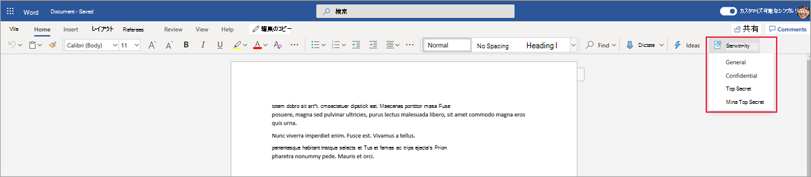

# <a name="use-sensitivity-labels-to-protect-content-in-microsoft-teams-microsoft-365-groups-and-sharepoint-sites-public-preview"></a><span data-ttu-id="14420-103">秘密度ラベルを使用して、Microsoft Teams、Microsoft 365 グループ、SharePoint サイトのコンテンツを保護する (パブリック プレビュー)</span><span class="sxs-lookup"><span data-stu-id="14420-103">Use sensitivity labels to protect content in Microsoft Teams, Microsoft 365 groups, and SharePoint sites (public preview)</span></span>

><span data-ttu-id="14420-104">*[セキュリティとコンプライアンスのための Microsoft 365 ライセンス ガイダンス](https://aka.ms/ComplianceSD)。*</span><span class="sxs-lookup"><span data-stu-id="14420-104">*[Microsoft 365 licensing guidance for security & compliance](https://aka.ms/ComplianceSD).*</span></span>

<span data-ttu-id="14420-105">[Microsoft 365 コンプライアンス センター](https://protection.office.com/)で秘密度ラベルを作成する場合、次のコンテナーへと適用できるようになりました: Microsoft Teams サイト、Microsoft 365 グループ ([以前の Office 365 グループ](https://techcommunity.microsoft.com/t5/microsoft-365-blog/office-365-groups-will-become-microsoft-365-groups/ba-p/1303601))、SharePoint サイト。</span><span class="sxs-lookup"><span data-stu-id="14420-105">When you create sensitivity labels in the [Microsoft 365 compliance center](https://protection.office.com/), you can now apply them to the following containers: Microsoft Teams sites, Microsoft 365 groups ([formerly Office 365 groups](https://techcommunity.microsoft.com/t5/microsoft-365-blog/office-365-groups-will-become-microsoft-365-groups/ba-p/1303601)), and SharePoint sites.</span></span> <span data-ttu-id="14420-106">これらのコンテナーのコンテンツを保護するには、次のラベル設定を使用します。</span><span class="sxs-lookup"><span data-stu-id="14420-106">Use the following label settings to help protect the content in those containers:</span></span>

- <span data-ttu-id="14420-107">Microsoft 365 グループに接続されているチーム サイトのプライバシー (パブリックまたはプライベート)</span><span class="sxs-lookup"><span data-stu-id="14420-107">Privacy (public or private) of Microsoft 365 group-connected teams sites</span></span>
- <span data-ttu-id="14420-108">外部ユーザーのアクセス</span><span class="sxs-lookup"><span data-stu-id="14420-108">External users access</span></span>
- <span data-ttu-id="14420-109">非管理対象デバイスからのアクセス</span><span class="sxs-lookup"><span data-stu-id="14420-109">Access from unmanaged devices</span></span> 

<span data-ttu-id="14420-110">サポートされているコンテナーにこのラベルを適用すると、構成済みオプションが、接続されたサイトまたはグループに自動的に適用されます。</span><span class="sxs-lookup"><span data-stu-id="14420-110">When you apply this label to a supported container, the label automatically applies the configured options to the connected site or group.</span></span> 

<span data-ttu-id="14420-111">ただし、これらのコンテナーのコンテンツは、ラベル名、視覚的なマーキング、暗号化などの設定のラベルを継承しません。</span><span class="sxs-lookup"><span data-stu-id="14420-111">Content in those containers however, do not inherit the labels for settings such as the label name, visual markings, or encryption.</span></span> <span data-ttu-id="14420-112">ユーザーが SharePoint サイトまたはチーム サイトでドキュメントにラベルを付けられるようにするには、[SharePoint および OneDrive で Office ファイルの秘密度ラベルを有効にします](sensitivity-labels-sharepoint-onedrive-files.md)。</span><span class="sxs-lookup"><span data-stu-id="14420-112">So that users can label their documents in SharePoint sites or team sites, [enable sensitivity labels for Office files in SharePoint and OneDrive](sensitivity-labels-sharepoint-onedrive-files.md).</span></span>

## <a name="about-the-public-preview-for-microsoft-teams-microsoft-365-groups-and-sharepoint-sites"></a><span data-ttu-id="14420-113">Microsoft Teams、Microsoft 365 グループ、および SharePoint サイトのパブリック プレビューについて</span><span class="sxs-lookup"><span data-stu-id="14420-113">About the public preview for Microsoft Teams, Microsoft 365 groups, and SharePoint sites</span></span>

<span data-ttu-id="14420-114">Microsoft Teams、Microsoft 365 グループ、SharePoint サイト向けの秘密度ラベルはプレビュー中であり、最終リリース前に変更される可能性があります。</span><span class="sxs-lookup"><span data-stu-id="14420-114">Sensitivity labels for Microsoft Teams, Microsoft 365 groups, and SharePoint sites is in preview and might change before final release.</span></span> <span data-ttu-id="14420-115">このパブリック プレビューは、Office 365 コンテンツ配信ネットワーク (CDN) では機能しません。</span><span class="sxs-lookup"><span data-stu-id="14420-115">This public preview doesn't work with Office 365 Content Delivery Networks (CDNs).</span></span>

<span data-ttu-id="14420-116">このプレビューを有効にして新しい設定の機密ラベルを構成する前に、ユーザーはアプリで機密ラベルを表示および適用できます。</span><span class="sxs-lookup"><span data-stu-id="14420-116">Before you enable this preview and configure sensitivity labels for the new settings, users can see and apply sensitivity labels in their apps.</span></span> <span data-ttu-id="14420-117">たとえば、Word から: </span><span class="sxs-lookup"><span data-stu-id="14420-117">For example, from Word:</span></span>



<span data-ttu-id="14420-119">このプレビューを有効にして構成すると、ユーザーは追加で秘密度ラベルを表示し、Microsoft Teams、Microsoft 365 グループ、および SharePoint サイトに適用することができます。</span><span class="sxs-lookup"><span data-stu-id="14420-119">After you enable and configure this preview, users can additionally see and apply sensitivity labels to Microsoft Teams, Microsoft 365 groups, and SharePoint sites.</span></span> <span data-ttu-id="14420-120">たとえば、SharePoint から新しいチーム サイトを作成する場合:</span><span class="sxs-lookup"><span data-stu-id="14420-120">For example, when you create a new team site from SharePoint:</span></span>


## <a name="enable-this-preview-and-synchronize-labels"></a><span data-ttu-id="14420-122">このプレビューを有効にしてラベルを同期する</span><span class="sxs-lookup"><span data-stu-id="14420-122">Enable this preview and synchronize labels</span></span>

1. <span data-ttu-id="14420-123">この機能は Azure AD 機能を使用するため、Azure AD のドキュメント [Azure Active Directory で Microsoft 365 グループに秘密度ラベルを割り当てる (プレビュー)](https://docs.microsoft.com/azure/active-directory/users-groups-roles/groups-assign-sensitivity-labels) の指示に従ってプレビューを有効にします。</span><span class="sxs-lookup"><span data-stu-id="14420-123">Because this feature uses Azure AD functionality, follow the instructions in the Azure AD documentation to enable the preview: [Assign sensitivity labels to Microsoft 365 groups in Azure Active Directory (preview)](https://docs.microsoft.com/azure/active-directory/users-groups-roles/groups-assign-sensitivity-labels).</span></span>

2. <span data-ttu-id="14420-124">では、[Office 365 セキュリティ/コンプライアンス センター PowerShell](/powershell/exchange/office-365-scc/connect-to-scc-powershell/connect-to-scc-powershell) に接続します。</span><span class="sxs-lookup"><span data-stu-id="14420-124">Now [connect to Office 365 Security & Compliance Center PowerShell](/powershell/exchange/office-365-scc/connect-to-scc-powershell/connect-to-scc-powershell).</span></span> 
    
    <span data-ttu-id="14420-125">たとえば、管理者として実行している PowerShell セッションで、グローバル管理者アカウントでサインインします。</span><span class="sxs-lookup"><span data-stu-id="14420-125">For example, in a PowerShell session that you run as administrator, sign in with a global administrator account:</span></span>
    
    ```powershell
    Set-ExecutionPolicy RemoteSigned
    $UserCredential = Get-Credential
    $Session = New-PSSession -ConfigurationName Microsoft.Exchange -ConnectionUri https://ps.compliance.protection.outlook.com/powershell-liveid/ -Credential $UserCredential -Authentication Basic -AllowRedirection
    Import-PSSession $Session -DisableNameChecking
    ```

3. <span data-ttu-id="14420-126">秘密度ラベルを Microsoft 365 グループで使用できるように、次のコマンドを実行して秘密度ラベルを Azure AD に同期させます。</span><span class="sxs-lookup"><span data-stu-id="14420-126">Run the following command to synchronize your sensitivity labels to Azure AD, so that they can be used with Microsoft 365 groups:</span></span>
    
    ```powershell
    Execute-AzureAdLabelSync
    ```

## <a name="how-to-configure-site-and-group-settings-when-you-create-or-edit-sensitivity-labels"></a><span data-ttu-id="14420-127">機密ラベルを作成または編集する際に、サイトおよびグループの設定を構成する方法</span><span class="sxs-lookup"><span data-stu-id="14420-127">How to configure site and group settings when you create or edit sensitivity labels</span></span>

<span data-ttu-id="14420-128">これで、サイトおよびグループで使用する機密ラベルを作成または編集する準備が整いました。</span><span class="sxs-lookup"><span data-stu-id="14420-128">You're now ready to create or edit sensitivity labels that you want to be available for sites and groups.</span></span> <span data-ttu-id="14420-129">プレビューを有効にすると、秘密度のラベル付けウィザードで新しいページが表示されます: **サイトとグループの設定**</span><span class="sxs-lookup"><span data-stu-id="14420-129">Enabling the preview makes a new page visible in the sensitivity labeling wizards: **Site and group settings**</span></span>

<span data-ttu-id="14420-130">機密ラベルの作成または編集に関するヘルプが必要な場合は、「[機密ラベルを作成して構成する](create-sensitivity-labels.md#create-and-configure-sensitivity-labels)」の手順を参照してください。</span><span class="sxs-lookup"><span data-stu-id="14420-130">If you need help with creating or editing a sensitivity label, see the instructions from [Create and configure sensitivity labels](create-sensitivity-labels.md#create-and-configure-sensitivity-labels).</span></span>

<span data-ttu-id="14420-131">この新しい [**サイトとグループの設定**] ページで、設定を構成します。</span><span class="sxs-lookup"><span data-stu-id="14420-131">On this new **Site and group settings** page, configure the settings:</span></span>

- <span data-ttu-id="14420-132">**Office 365 グループに接続されたチーム サイトのプライバシー**: このラベルが適用されているチーム サイトまたはグループに組織内の誰もがアクセスできるようにする場合は、既定の [**公開 - 組織内のすべてのユーザーがサイトにアクセスできます**] に設定します。</span><span class="sxs-lookup"><span data-stu-id="14420-132">**Privacy of Office 365 group-connected teams sites**: Keep the default of **Public - anyone in the organization can access the site** if you want anyone in your organization to access the team site or group where this label is applied.</span></span>
    
    <span data-ttu-id="14420-133">組織内の承認されたメンバーのみにアクセスを制限する場合は、[**プライベート**] を選択します。</span><span class="sxs-lookup"><span data-stu-id="14420-133">Select **Private** if you want access to be restricted to only approved members in your organization.</span></span>
    
    <span data-ttu-id="14420-134">秘密度ラベルを使用してコンテナー内のコンテンツを保護し、ユーザーが自分でプライバシー設定を構成できるようにする場合は、[**なし - ユーザーがサイトにアクセスできるユーザーを選択できるようにします**] を選択します。</span><span class="sxs-lookup"><span data-stu-id="14420-134">Select **None - let user chose who can access the site** when you want to protect content in the container by using the sensitivity label, but still let users configure the privacy setting themselves.</span></span>
    
    <span data-ttu-id="14420-135">このラベルをコンテナーに適用すると、[**パブリック**] または [**プライベート**] の設定によってプライバシー設定が設定およびロックされます。</span><span class="sxs-lookup"><span data-stu-id="14420-135">The settings of **Public** or **Private** set and lock the privacy setting when you apply this label to the container.</span></span> <span data-ttu-id="14420-136">選択した設定は、チームまたはグループに構成されている可能性がある以前のプライバシー設定を置き換え、プライバシー値をロックします。これにより、コンテナーから最初に秘密度ラベルを削除することによってのみ、変更できるようになります。</span><span class="sxs-lookup"><span data-stu-id="14420-136">Your chosen seting replaces any previous privacy setting that might be configured for the team or group, and locks the privacy value so it can be changed only by first removing the sensitivity label from the container.</span></span> <span data-ttu-id="14420-137">秘密度ラベルを削除しても、ラベルからのプライバシー設定は維持され、ユーザーは再びラベルを変更することができます。</span><span class="sxs-lookup"><span data-stu-id="14420-137">After you remove the sensitivity label, the privacy setting from the label remains and users can now change it again.</span></span>

- <span data-ttu-id="14420-138">**外部ユーザー アクセス**: グループの所有者が[ゲストをグループに追加](/office365/admin/create-groups/manage-guest-access-in-groups)できるかどうかを制御します。</span><span class="sxs-lookup"><span data-stu-id="14420-138">**External users access**: Control whether the group owner can [add guests to the group](/office365/admin/create-groups/manage-guest-access-in-groups).</span></span>

- <span data-ttu-id="14420-139">**非管理対象デバイス**: [非管理対象デバイス](/sharepoint/control-access-from-unmanaged-devices)の場合、フル アクセスを許可するか、Web のみのアクセスを許可するか、またはアクセスを完全にブロックします。</span><span class="sxs-lookup"><span data-stu-id="14420-139">**Unmanaged devices**: For [unmanaged devices](/sharepoint/control-access-from-unmanaged-devices), allow full access, web only access, or block access completely.</span></span> 

![[サイトとグループの設定] タブ](../media/edit-sensitivity-label-site-group2.png)

> [!IMPORTANT]
> <span data-ttu-id="14420-141">チーム、グループ、またはサイトにラベルを適用すると、それらのサイトとグループの設定のみが有効になります。</span><span class="sxs-lookup"><span data-stu-id="14420-141">Only these site and group settings take effect when you apply a label to a team, group, or site.</span></span> <span data-ttu-id="14420-142">暗号化やコンテンツ マーキングなどのその他のラベル設定は、チーム、グループ、またはサイト内のコンテンツに適用されません。</span><span class="sxs-lookup"><span data-stu-id="14420-142">Other label settings, such as encryption and content marking, aren't applied to the content within the team, group, or site.</span></span>
> 
> <span data-ttu-id="14420-143">テナントへの段階的なロールアウト: ユーザーがチーム、グループ、サイトを作成するときに選択できるのは、サイトの設定およびグループの設定のラベルのみです。</span><span class="sxs-lookup"><span data-stu-id="14420-143">Gradually rolling out to tenants: Only labels with the site and group settings will be available to select when users create teams, groups, and sites.</span></span> <span data-ttu-id="14420-144">ラベルにサイトとグループの設定が有効になっていないときに、ラベルをコンテナーに適用する場合は、ラベル名のみがコンテナーに適用されます。</span><span class="sxs-lookup"><span data-stu-id="14420-144">If you can currently apply a label to a container when the label doesn't have the site and group settings enabled, only the label name is applied to the container.</span></span>

<span data-ttu-id="14420-145">秘密度ラベルがまだ公開されていない場合は、[秘密度ラベル ポリシーに追加](create-sensitivity-labels.md#publish-sensitivity-labels-by-creating-a-label-policy)して公開します。</span><span class="sxs-lookup"><span data-stu-id="14420-145">If your sensitivity label isn't already published, now publish it by [adding it to a sensitivity label policy](create-sensitivity-labels.md#publish-sensitivity-labels-by-creating-a-label-policy).</span></span> <span data-ttu-id="14420-146">このラベルを含む秘密度ラベル ポリシーが割り当てられているユーザーには、サイトとグループ用にそのラベルを選択できます。</span><span class="sxs-lookup"><span data-stu-id="14420-146">The users who are assigned a sensitivity label policy that includes this label will be able to select it for sites and groups.</span></span>

<span data-ttu-id="14420-147">このラベルをコンテナーに適用する場合、ラベル ポリシーからは、ポリシー設定 **[既定でドキュメントとメールにこのラベルを適用する]** のみが適用されます。</span><span class="sxs-lookup"><span data-stu-id="14420-147">From the label policy, only the policy setting **Apply this label by default to documents and email** is applicable when you apply this label to containers.</span></span> <span data-ttu-id="14420-148">必須のラベル付け、ユーザーの妥当性の要求、カスタム ヘルプ ページへのリンクなど、他のポリシー設定は適用されません。</span><span class="sxs-lookup"><span data-stu-id="14420-148">Other policy settings are not applied, which include mandatory labeling, requiring user justification, and a link to the custom help page.</span></span>

## <a name="sensitivity-label-management"></a><span data-ttu-id="14420-149">機密ラベルの管理</span><span class="sxs-lookup"><span data-stu-id="14420-149">Sensitivity label management</span></span>

> [!WARNING]
> <span data-ttu-id="14420-150">Microsoft Teams、Microsoft 365 グループ、および SharePoint サイトに使用する秘密度ラベルを作成、変更、および削除するには、ラベル ポリシーをユーザーに発行する際に慎重な調整が必要です。</span><span class="sxs-lookup"><span data-stu-id="14420-150">Creating, modifying, and deleting sensitivity labels that you use for Microsoft Teams, Microsoft 365 groups, and SharePoint sites requires careful coordination with publishing label policies to users.</span></span> 

<span data-ttu-id="14420-151">以下のガイダンスを使用して、すべてのユーザーに影響を与える可能性のあるサイトおよびグループの作成エラーを回避します。</span><span class="sxs-lookup"><span data-stu-id="14420-151">Avoid creation errors for sites and groups that can affect all users by using the following guidance.</span></span>

<span data-ttu-id="14420-152">**ラベルの作成と発行:**</span><span class="sxs-lookup"><span data-stu-id="14420-152">**Creating and publishing labels:**</span></span>

<span data-ttu-id="14420-153">機密ラベルを作成して公開した後、チーム、グループ、およびサイトでユーザーがラベルを表示できるようになるまでに最大 24 時間かかる場合があります。</span><span class="sxs-lookup"><span data-stu-id="14420-153">After a sensitivity label is created and published, it can take up to 24 hours for the label to become visible for users in teams, groups, and sites.</span></span> <span data-ttu-id="14420-154">以下の手順を使用して、テナント内のすべてのユーザーにラベルを発行します:</span><span class="sxs-lookup"><span data-stu-id="14420-154">Use the following steps to publish a label for all users in the tenant:</span></span>

1. <span data-ttu-id="14420-155">機密ラベルを作成し、テナント内の少数のユーザー アカウントに対してのみ発行します。</span><span class="sxs-lookup"><span data-stu-id="14420-155">Create the sensitivity label and publish it for just a few user accounts in the tenant.</span></span>

2. <span data-ttu-id="14420-156">24 時間待ちます。</span><span class="sxs-lookup"><span data-stu-id="14420-156">Wait for 24 hours.</span></span>

3. <span data-ttu-id="14420-157">この 24 時間の待ち時間の後、手順 1 で指定したユーザー アカウントのいずれかを使用して、手順 1 で作成したラベルを持つチーム、Microsoft 365 グループ、または SharePoint サイトを作成します。</span><span class="sxs-lookup"><span data-stu-id="14420-157">After this 24 hours wait, use one of the user accounts you specified in step 1 to create a team, Microsoft 365 group, or SharePoint site with the label that you created in step 1.</span></span>

4. <span data-ttu-id="14420-158">手順 3 の作成操作中にエラーが発生しなかった場合、テナント内のすべてのユーザーにラベルを発行します。</span><span class="sxs-lookup"><span data-stu-id="14420-158">If there are no errors during the creation operation for step 3, publish the label for all users in your tenant.</span></span> <span data-ttu-id="14420-159">エラーがある場合には、[Microsoft サポート](https://docs.microsoft.com/office365/admin/contact-support-for-business-products)へお問い合わせください。</span><span class="sxs-lookup"><span data-stu-id="14420-159">If there are errors, contact [Microsoft Support](https://docs.microsoft.com/office365/admin/contact-support-for-business-products).</span></span>

<span data-ttu-id="14420-160">**発行済みラベルの変更および削除:**</span><span class="sxs-lookup"><span data-stu-id="14420-160">**Modifying and deleting published labels:**</span></span>

<span data-ttu-id="14420-161">サイトとグループの設定を有効にして秘密度ラベルの変更または削除を行い、そのラベルが 1 つ以上のラベル ポリシーに含まれている場合、すべてのチーム、グループ、サイトの作成に失敗してしまう可能性があります。</span><span class="sxs-lookup"><span data-stu-id="14420-161">If you modify or delete a sensitivity label with the site and group settings enabled, and that label is included in one or more label policies, these actions can result in creation failures for all teams, groups, and sites.</span></span> <span data-ttu-id="14420-162">この状況を回避するには、以下のガイダンスを使用してください。</span><span class="sxs-lookup"><span data-stu-id="14420-162">To avoid this situation, use the following guidance:</span></span>

1. <span data-ttu-id="14420-163">ラベルを含むすべてのラベル ポリシーから、機密ラベルを削除します。</span><span class="sxs-lookup"><span data-stu-id="14420-163">Remove the sensitivity label from all label policies that include the label.</span></span>

2. <span data-ttu-id="14420-164">48 時間待ちます。</span><span class="sxs-lookup"><span data-stu-id="14420-164">Wait for 48 hours.</span></span>

3. <span data-ttu-id="14420-165">48 時間待ってからチーム、グループ、またはサイトを作成し、ラベルが表示されなくなったことを確認してください。</span><span class="sxs-lookup"><span data-stu-id="14420-165">After the 48 hours wait, try creating a team, group, or site and confirm that the label is no longer visible.</span></span>

4. <span data-ttu-id="14420-166">機密ラベルが表示されていない場合は、ラベルを安全に変更または削除できます。</span><span class="sxs-lookup"><span data-stu-id="14420-166">If the sensitivity label isn't visible, you can now safely modify or delete the label.</span></span> <span data-ttu-id="14420-167">ラベルがまだ表示されている場合には、[Microsoft サポート](https://docs.microsoft.com/office365/admin/contact-support-for-business-products)にお問い合わせください。</span><span class="sxs-lookup"><span data-stu-id="14420-167">If the label is still visible, contact [Microsoft Support](https://docs.microsoft.com/office365/admin/contact-support-for-business-products).</span></span>

## <a name="assign-sensitivity-labels-to-microsoft-365-groups"></a><span data-ttu-id="14420-168">Microsoft 365 グループに秘密度ラベルを割り当てる</span><span class="sxs-lookup"><span data-stu-id="14420-168">Assign sensitivity labels to Microsoft 365 groups</span></span>

<span data-ttu-id="14420-169">これで、1 つまたは複数の秘密度ラベルを Microsoft 365 グループに適用する準備ができました。</span><span class="sxs-lookup"><span data-stu-id="14420-169">You're now ready to apply the sensitivity label or labels to Microsoft 365 groups.</span></span> <span data-ttu-id="14420-170">手順については、Azure AD のドキュメントに戻ります。</span><span class="sxs-lookup"><span data-stu-id="14420-170">Return to the Azure AD documentation for instructions:</span></span>

- <span data-ttu-id="14420-171">「[Assign a label to a new group in Azure portal (Azure ポータルの新しいグループにラベルを割り当てる)](https://docs.microsoft.com/azure/active-directory/users-groups-roles/groups-assign-sensitivity-labels#assign-a-label-to-a-new-group-in-azure-portal)」</span><span class="sxs-lookup"><span data-stu-id="14420-171">[Assign a label to a new group in Azure portal](https://docs.microsoft.com/azure/active-directory/users-groups-roles/groups-assign-sensitivity-labels#assign-a-label-to-a-new-group-in-azure-portal)</span></span>

-  [<span data-ttu-id="14420-172">Assign a label to an existing group in Azure portal (Azure ポータルの既存のグループにラベルを割り当てる)</span><span class="sxs-lookup"><span data-stu-id="14420-172">Assign a label to an existing group in Azure portal</span></span>](https://docs.microsoft.com/azure/active-directory/users-groups-roles/groups-assign-sensitivity-labels#assign-a-label-to-an-existing-group-in-azure-portal)

-  <span data-ttu-id="14420-173">「[Remove a label from an existing group in Azure portal (Azure ポータルの既存のグループからラベルを削除する)](https://docs.microsoft.com/azure/active-directory/users-groups-roles/groups-assign-sensitivity-labels#remove-a-label-from-an-existing-group-in-azure-portal).」</span><span class="sxs-lookup"><span data-stu-id="14420-173">[Remove a label from an existing group in Azure portal](https://docs.microsoft.com/azure/active-directory/users-groups-roles/groups-assign-sensitivity-labels#remove-a-label-from-an-existing-group-in-azure-portal).</span></span>

## <a name="apply-a-sensitivity-label-to-a-new-team"></a><span data-ttu-id="14420-174">新しいチームに機密ラベルを適用する</span><span class="sxs-lookup"><span data-stu-id="14420-174">Apply a sensitivity label to a new team</span></span>

<span data-ttu-id="14420-175">ユーザーは、Microsoft Teams で新しいチームを作成する際に機密ラベルを選択できます。</span><span class="sxs-lookup"><span data-stu-id="14420-175">Users can select sensitivity labels when they create new teams in Microsoft Teams.</span></span> <span data-ttu-id="14420-176">**[秘密度]** ドロップダウンからラベルを選択すると、プライバシー設定によってラベル構成が変更される場合があります。</span><span class="sxs-lookup"><span data-stu-id="14420-176">When they select the label from the **Sensitivity** dropdown, the privacy setting might change to reflect the label configuration.</span></span> <span data-ttu-id="14420-177">ラベルに対し選択した外部ユーザーのアクセス設定に応じて、ユーザーは組織外のユーザーをチームに追加することができたり、できなかったりします。</span><span class="sxs-lookup"><span data-stu-id="14420-177">Depending on the external users access setting you selected for the label, users can or can't add people outside the organization to the team.</span></span>

[<span data-ttu-id="14420-178">Teams の機密ラベルの詳細について</span><span class="sxs-lookup"><span data-stu-id="14420-178">Learn more about sensitivity labels for Teams</span></span>](https://docs.microsoft.com/microsoftteams/sensitivity-labels)


<span data-ttu-id="14420-180">チームを作成すると、すべてのチャネルの右上隅に機密ラベルが表示されます。</span><span class="sxs-lookup"><span data-stu-id="14420-180">After you create the team, the sensitivity label appears in the upper-right corner of all channels.</span></span>


<span data-ttu-id="14420-182">このサービスは、Microsoft 365 グループおよび接続された SharePoint チーム サイトに対して同じ秘密度ラベルを自動的に適用します。</span><span class="sxs-lookup"><span data-stu-id="14420-182">The service automatically applies the same sensitivity label to the Microsoft 365 group and the connected SharePoint team site.</span></span>

## <a name="apply-a-sensitivity-label-to-a-new-group-in-outlook-on-the-web"></a><span data-ttu-id="14420-183">Outlook on the web の新しいグループに機密ラベルを適用する</span><span class="sxs-lookup"><span data-stu-id="14420-183">Apply a sensitivity label to a new group in Outlook on the web</span></span>

<span data-ttu-id="14420-184">Outlook on the web では、新しいグループを作成するときに、公開されたラベルの [**機密**] オプションを選択または変更できます。</span><span class="sxs-lookup"><span data-stu-id="14420-184">In Outlook on the web, when you create a new group, you can select or change the **Sensitivity** option for published labels:</span></span>

![グループを作成し、[機密] 下でオプションを選択する](../media/sensitivity-label-new-group.png)

## <a name="apply-a-sensitivity-label-to-a-new-site"></a><span data-ttu-id="14420-186">新しいサイトに機密ラベルを適用する</span><span class="sxs-lookup"><span data-stu-id="14420-186">Apply a sensitivity label to a new site</span></span>

<span data-ttu-id="14420-187">管理者およびエンド ユーザーは、[最新のチーム サイトやコミュニケーション サイトを作成する](/sharepoint/create-site-collection)際に秘密度ラベルを選択し、以下のような**詳細設定**を行うことができます。</span><span class="sxs-lookup"><span data-stu-id="14420-187">Admins and end users can select sensitivity labels when they [create modern team sites and communication sites](/sharepoint/create-site-collection), and expand **Advanced settings**:</span></span>

![サイトを作成し、[秘密度] 下でオプションを選択する](../media/sensitivity-label-new-communication-site.png)

<span data-ttu-id="14420-189">ドロップダウン ボックスには選択したラベル名が表示され、ヘルプ アイコンにはすべてのラベル名とヒントが表示されます。これにより、ユーザーは適用するラベルを正しく選ぶことができます。</span><span class="sxs-lookup"><span data-stu-id="14420-189">The dropdown box displays the label names for the selection, and the help icon displays all the label names with their tooltip, which can help users determine the correct label to apply.</span></span>

<span data-ttu-id="14420-190">ラベルが適用され、ユーザーがサイトを参照すると、ラベルの名前および適用されているポリシーが表示されます。</span><span class="sxs-lookup"><span data-stu-id="14420-190">When the label is applied, and users browse to the site, they see the name of the label and applied policies.</span></span> <span data-ttu-id="14420-191">たとえば、以下のサイトでは、**秘密**のラベル付けがされており、プライバシー設定は**プライベート**になっています。</span><span class="sxs-lookup"><span data-stu-id="14420-191">For example, this site has been labeled as **Confidential**, and the privacy setting is set to **Private**:</span></span>


## <a name="view-sensitivity-labels-in-the-sharepoint-admin-center"></a><span data-ttu-id="14420-193">SharePoint 管理センターで機密ラベルを表示する</span><span class="sxs-lookup"><span data-stu-id="14420-193">View sensitivity labels in the SharePoint admin center</span></span>

<span data-ttu-id="14420-194">適用された機密ラベルを表示するには、新しい SharePoint 管理センターの [**アクティブなサイト**] ページを使用します。</span><span class="sxs-lookup"><span data-stu-id="14420-194">To view the applied sensitivity labels, use the **Active sites** page in the new SharePoint admin center.</span></span> <span data-ttu-id="14420-195">最初に、[**機密**] 列を追加する必要がある場合があります。</span><span class="sxs-lookup"><span data-stu-id="14420-195">You might need to first add the **Sensitivity** column:</span></span>

![[アクティブなサイト] ページの [機密] 列](../media/manage-site-sensitivity-labels.png)

<span data-ttu-id="14420-197">[新しい SharePoint 管理センターでのサイト管理の詳細をご覧ください](/sharepoint/manage-sites-in-new-admin-center)。</span><span class="sxs-lookup"><span data-stu-id="14420-197">[Learn more about managing sites in the new SharePoint admin center](/sharepoint/manage-sites-in-new-admin-center).</span></span>

## <a name="change-site-and-group-settings-for-a-label"></a><span data-ttu-id="14420-198">ラベル向けのサイトとグループの設定を変更する</span><span class="sxs-lookup"><span data-stu-id="14420-198">Change site and group settings for a label</span></span>

<span data-ttu-id="14420-199">ラベルのサイトとグループの設定を変更するたびに、チーム、サイト、グループが新しい設定を使用できるように、次の PowerShell コマンドを実行する必要があります。</span><span class="sxs-lookup"><span data-stu-id="14420-199">Whenever you make a change to site and group settings for a label, you must run the following PowerShell commands so that your teams, sites, and groups can use the new settings.</span></span> <span data-ttu-id="14420-200">ベスト プラクティスとして、機密ラベルを複数のチーム、グループ、またはサイトに適用した後に、ラベルのサイトとグループの設定を変更しないようにします。</span><span class="sxs-lookup"><span data-stu-id="14420-200">As a best practice, don't the change site and group settings for a label after you've applied the sensitivity label to several teams, groups, or sites.</span></span>

1. <span data-ttu-id="14420-201">まず、[Office 365 セキュリティ/コンプライアンス センター PowerShell へ接続します](/powershell/exchange/office-365-scc/connect-to-scc-powershell/connect-to-scc-powershell)。</span><span class="sxs-lookup"><span data-stu-id="14420-201">First, [connect to Office 365 Security & Compliance Center PowerShell](/powershell/exchange/office-365-scc/connect-to-scc-powershell/connect-to-scc-powershell).</span></span> 
    
    <span data-ttu-id="14420-202">たとえば、管理者として実行している PowerShell セッションで、グローバル管理者アカウントでサインインします。</span><span class="sxs-lookup"><span data-stu-id="14420-202">For example, in a PowerShell session that you run as administrator, sign in with a global administrator account:</span></span>
    
    ```powershell
    Set-ExecutionPolicy RemoteSigned
    $UserCredential = Get-Credential
    $Session = New-PSSession -ConfigurationName Microsoft.Exchange -ConnectionUri https://ps.compliance.protection.outlook.com/powershell-liveid/ -Credential $UserCredential -Authentication Basic -AllowRedirection
    Import-PSSession $Session -DisableNameChecking
    ```

2. <span data-ttu-id="14420-203">[Get-Label](https://docs.microsoft.com/powershell/module/exchange/policy-and-compliance/get-label?view=exchange-ps) コマンドレットを使用して、機密ラベルおよびその GUID のリストを取得します。</span><span class="sxs-lookup"><span data-stu-id="14420-203">Get the list of sensitivity labels and their GUIDs by using the [Get-Label](https://docs.microsoft.com/powershell/module/exchange/policy-and-compliance/get-label?view=exchange-ps) cmdlet:</span></span>
    
    ```powershell
    Get-Label |ft Name, Guid
    ```

3. <span data-ttu-id="14420-204">変更を行ったラベルの GUID をメモします。</span><span class="sxs-lookup"><span data-stu-id="14420-204">Make a note of the GUID for the label or labels you have changed.</span></span>

4. <span data-ttu-id="14420-205">次に、[Exchange Online PowerShell に接続](https://docs.microsoft.com/powershell/exchange/exchange-online/connect-to-exchange-online-powershell/connect-to-exchange-online-powershell?view=exchange-ps)します。</span><span class="sxs-lookup"><span data-stu-id="14420-205">Now [connect to Exchange Online PowerShell](https://docs.microsoft.com/powershell/exchange/exchange-online/connect-to-exchange-online-powershell/connect-to-exchange-online-powershell?view=exchange-ps).</span></span>
    
    <span data-ttu-id="14420-206">次に例を示します。</span><span class="sxs-lookup"><span data-stu-id="14420-206">For example:</span></span>
    
    ```powershell
    $UserCredential = Get-Credential
    $Session = New-PSSession -ConfigurationName Microsoft.Exchange -ConnectionUri https://outlook.office365.com/powershell-liveid/ -Credential $UserCredential -Authentication Basic -AllowRedirection
    Import-PSSession $Session
    ```
    
5. <span data-ttu-id="14420-207">[Get-UnifiedGroup](https://docs.microsoft.com/powershell/module/exchange/users-and-groups/get-unifiedgroup?view=exchange-ps) コマンドレットを実行します。GUID 例の "e48058ea-98e8-4940-8db0-ba1310fd955e" の代わりにラベルの GUID を指定します。</span><span class="sxs-lookup"><span data-stu-id="14420-207">Run the [Get-UnifiedGroup](https://docs.microsoft.com/powershell/module/exchange/users-and-groups/get-unifiedgroup?view=exchange-ps) cmdlet, specifying your label GUID in place of the example GUID of "e48058ea-98e8-4940-8db0-ba1310fd955e":</span></span> 
    
    ```powershell
    $Groups= Get-UnifiedGroup | Where {$_.SensitivityLabel  -eq "e48058ea-98e8-4940-8db0-ba1310fd955e"}
    ```

6. <span data-ttu-id="14420-208">各グループについて、GUID 例の "e48058ea-98e8-4940-8db0-ba1310fd955e" の代わりにラベルの GUID を指定して機密ラベルを再適用します。</span><span class="sxs-lookup"><span data-stu-id="14420-208">For each group, reapply the sensitivity label, specifying your label GUID in place of the example GUID of "e48058ea-98e8-4940-8db0-ba1310fd955e":</span></span>
    
    ```powershell
    foreach ($g in $groups)
    {Set-UnifiedGroup -Identity $g.Identity -SensitivityLabelId "e48058ea-98e8-4940-8db0-ba1310fd955e"}
    ```

## <a name="support-for-the-sensitivity-labels"></a><span data-ttu-id="14420-209">機密ラベルのサポート</span><span class="sxs-lookup"><span data-stu-id="14420-209">Support for the sensitivity labels</span></span>

<span data-ttu-id="14420-210">次のアプリとサービスで、サイトとグループの設定用に構成した機密ラベルを使用できます。</span><span class="sxs-lookup"><span data-stu-id="14420-210">You can use the sensitivity labels that you've configured for site and group settings with the following apps and services:</span></span>

- <span data-ttu-id="14420-211">SharePoint Online</span><span class="sxs-lookup"><span data-stu-id="14420-211">SharePoint Online</span></span>
- <span data-ttu-id="14420-212">Teams</span><span class="sxs-lookup"><span data-stu-id="14420-212">Teams</span></span>
- <span data-ttu-id="14420-213">Outlook on the web</span><span class="sxs-lookup"><span data-stu-id="14420-213">Outlook on the web</span></span>
- <span data-ttu-id="14420-214">SharePoint 管理センター</span><span class="sxs-lookup"><span data-stu-id="14420-214">SharePoint admin center</span></span>
- <span data-ttu-id="14420-215">Azure AD 管理センター</span><span class="sxs-lookup"><span data-stu-id="14420-215">Azure AD admin center</span></span>

<span data-ttu-id="14420-216">サイトおよびグループの設定用に構成した機密ラベルを現在使用できない他のアプリとサービスには、次のものがあります。</span><span class="sxs-lookup"><span data-stu-id="14420-216">Other apps and services that you can't currently use the sensitivity labels that you've configured for site and group settings include:</span></span>

- <span data-ttu-id="14420-217">Outlook for the Mac</span><span class="sxs-lookup"><span data-stu-id="14420-217">Outlook for the Mac</span></span>
- <span data-ttu-id="14420-218">Outlook モバイル</span><span class="sxs-lookup"><span data-stu-id="14420-218">Outlook mobile</span></span>
- <span data-ttu-id="14420-219">Outlook デスクトップ for Windows</span><span class="sxs-lookup"><span data-stu-id="14420-219">Outlook desktop for Windows</span></span>
- <span data-ttu-id="14420-220">Forms</span><span class="sxs-lookup"><span data-stu-id="14420-220">Forms</span></span>
- <span data-ttu-id="14420-221">Dynamics 365</span><span class="sxs-lookup"><span data-stu-id="14420-221">Dynamics 365</span></span>
- <span data-ttu-id="14420-222">Yammer</span><span class="sxs-lookup"><span data-stu-id="14420-222">Yammer</span></span>
- <span data-ttu-id="14420-223">Stream</span><span class="sxs-lookup"><span data-stu-id="14420-223">Stream</span></span>
- <span data-ttu-id="14420-224">Planner</span><span class="sxs-lookup"><span data-stu-id="14420-224">Planner</span></span>
- <span data-ttu-id="14420-225">Project</span><span class="sxs-lookup"><span data-stu-id="14420-225">Project</span></span>
- <span data-ttu-id="14420-226">PowerBI</span><span class="sxs-lookup"><span data-stu-id="14420-226">PowerBI</span></span>
- <span data-ttu-id="14420-227">Teams 管理センター</span><span class="sxs-lookup"><span data-stu-id="14420-227">Teams admin center</span></span>
- <span data-ttu-id="14420-228">Microsoft 365 管理センター</span><span class="sxs-lookup"><span data-stu-id="14420-228">Microsoft 365 admin center</span></span>
- <span data-ttu-id="14420-229">Exchange 管理センター</span><span class="sxs-lookup"><span data-stu-id="14420-229">Exchange admin center</span></span>


## <a name="classic-azure-ad-group-classification"></a><span data-ttu-id="14420-230">従来の Azure AD グループの分類</span><span class="sxs-lookup"><span data-stu-id="14420-230">Classic Azure AD group classification</span></span>

<span data-ttu-id="14420-231">このプレビューを有効にすると、Microsoft 365 は新しい Microsoft 365 のグループおよび SharePoint サイト向けに古い分類をサポートしなくなります。</span><span class="sxs-lookup"><span data-stu-id="14420-231">Microsoft 365 no longer supports the old classifications for new Microsoft 365 groups and SharePoint sites when you enable this preview.</span></span> <span data-ttu-id="14420-232">ただし、既存のグループおよびサイトには、機密ラベルを使用するように変換しない限り、古い分類値が引き続き表示されます。</span><span class="sxs-lookup"><span data-stu-id="14420-232">However, existing groups and sites still display the old classification values unless you convert them to use sensitivity labels.</span></span>

<span data-ttu-id="14420-233">SharePoint の古いグループ分類を使用した場合の例として、「[SharePoint の "モダン" サイトの分類」](https://docs.microsoft.com/sharepoint/dev/solution-guidance/modern-experience-site-classification)を参照してください。</span><span class="sxs-lookup"><span data-stu-id="14420-233">As an example of how you might have used the old group classification for SharePoint, see [SharePoint "modern" sites classification](https://docs.microsoft.com/sharepoint/dev/solution-guidance/modern-experience-site-classification).</span></span>

<span data-ttu-id="14420-234">これらの分類は、Azure AD PowerShell または PnP コア ライブラリを使用し、`ClassificationList` 設定に値を定義することによって構成されています。</span><span class="sxs-lookup"><span data-stu-id="14420-234">These classifications were configured by using Azure AD PowerShell or the PnP Core library and defining values for the `ClassificationList` setting.</span></span> <span data-ttu-id="14420-235">テナントに分類値が定義されている場合は、[AzureADPreview PowerShell モジュール](https://www.powershellgallery.com/packages/AzureADPreview)から次のコマンドを実行すると、それらが表示されます。</span><span class="sxs-lookup"><span data-stu-id="14420-235">If your tenant has classification values defined, they are shown when you run the following command from the [AzureADPreview PowerShell module](https://www.powershellgallery.com/packages/AzureADPreview):</span></span>

```powershell
   ($setting["ClassificationList"])
```

<span data-ttu-id="14420-236">古い分類を機密ラベルに変換するには、次のいずれかの操作を行います。</span><span class="sxs-lookup"><span data-stu-id="14420-236">To convert your old classifications to sensitivity labels, do one of the following:</span></span>

- <span data-ttu-id="14420-237">既存のラベルを使用: 既に公開されている既存の機密ラベルを編集して、サイトおよびグループに必要なラベル設定を指定します。</span><span class="sxs-lookup"><span data-stu-id="14420-237">Use existing labels: Specify the label settings you want for sites and groups by editing existing sensitivity labels that are already published.</span></span>

- <span data-ttu-id="14420-238">新しいラベルの作成: 既存の分類と同じ名前を持つ新しい機密ラベルを作成および公開して、サイトおよびグループに必要なラベル設定を指定します。</span><span class="sxs-lookup"><span data-stu-id="14420-238">Create new labels: Specify the label settings you want for sites and groups by creating and publishing new sensitivity labels that have the same names as your existing classifications.</span></span>

<span data-ttu-id="14420-239">その後で以下の手順に従います。</span><span class="sxs-lookup"><span data-stu-id="14420-239">Then:</span></span> 

1. <span data-ttu-id="14420-240">PowerShell を使用し、既存の Microsoft 365 グループおよび SharePoint サイトに名前のマッピングを使用して秘密度ラベルを適用します。</span><span class="sxs-lookup"><span data-stu-id="14420-240">Use PowerShell to apply the sensitivity labels to existing Microsoft 365 groups and SharePoint sites by using name mapping.</span></span> <span data-ttu-id="14420-241">手順については、次のセクションを参照してください。</span><span class="sxs-lookup"><span data-stu-id="14420-241">See the next section for instructions.</span></span>

2. <span data-ttu-id="14420-242">既存のグループおよびサイトから古い分類を削除します。</span><span class="sxs-lookup"><span data-stu-id="14420-242">Remove the old classifications from the existing groups and sites.</span></span>

<span data-ttu-id="14420-243">機密ラベルをまだサポートしていないアプリやサービスでユーザーが新しいグループを作成できないようにすることはできませんが、定期的な PowerShell スクリプトを実行して、ユーザーが古い分類で作成した新しいグループを探し、機密ラベルを使用するようにそれらを変換することができます。</span><span class="sxs-lookup"><span data-stu-id="14420-243">Although you can't prevent users from creating new groups in apps and services that don't yet support sensitivity labels, you can run a recurring PowerShell script to look for new groups that users have created with the old classifications, and convert these to use sensitivity labels.</span></span> 

#### <a name="use-powershell-to-convert-classifications-for-microsoft-365-groups-to-sensitivity-labels"></a><span data-ttu-id="14420-244">PowerShell を使用して Microsoft 365 グループの分類を秘密度ラベルに変換する</span><span class="sxs-lookup"><span data-stu-id="14420-244">Use PowerShell to convert classifications for Microsoft 365 groups to sensitivity labels</span></span>

1. <span data-ttu-id="14420-245">まず、[Office 365 セキュリティ/コンプライアンス センター PowerShell へ接続します](/powershell/exchange/office-365-scc/connect-to-scc-powershell/connect-to-scc-powershell)。</span><span class="sxs-lookup"><span data-stu-id="14420-245">First, [connect to Office 365 Security & Compliance Center PowerShell](/powershell/exchange/office-365-scc/connect-to-scc-powershell/connect-to-scc-powershell).</span></span> 
    
    <span data-ttu-id="14420-246">たとえば、管理者として実行している PowerShell セッションで、グローバル管理者アカウントでサインインします。</span><span class="sxs-lookup"><span data-stu-id="14420-246">For example, in a PowerShell session that you run as administrator, sign in with a global administrator account:</span></span>
    
    ```powershell
    Set-ExecutionPolicy RemoteSigned
    $UserCredential = Get-Credential
    $Session = New-PSSession -ConfigurationName Microsoft.Exchange -ConnectionUri https://ps.compliance.protection.outlook.com/powershell-liveid/ -Credential $UserCredential -Authentication Basic -AllowRedirection
    Import-PSSession $Session -DisableNameChecking
    ```

2. <span data-ttu-id="14420-247">[Get-Label](https://docs.microsoft.com/powershell/module/exchange/policy-and-compliance/get-label?view=exchange-ps) コマンドレットを使用して、機密ラベルおよびその GUID のリストを取得します。</span><span class="sxs-lookup"><span data-stu-id="14420-247">Get the list of sensitivity labels and their GUIDs by using the [Get-Label](https://docs.microsoft.com/powershell/module/exchange/policy-and-compliance/get-label?view=exchange-ps) cmdlet:</span></span>
    
    ```powershell
    Get-Label |ft Name, Guid
    ```

3. <span data-ttu-id="14420-248">Microsoft 365 グループに適用する秘密度ラベルの GUID をメモします。</span><span class="sxs-lookup"><span data-stu-id="14420-248">Make a note of the GUIDs for the sensitivity labels you want to apply to your Microsoft 365 groups.</span></span>

4. <span data-ttu-id="14420-249">次に、[Exchange Online PowerShell に接続](https://docs.microsoft.com/powershell/exchange/exchange-online/connect-to-exchange-online-powershell/connect-to-exchange-online-powershell?view=exchange-ps)します。</span><span class="sxs-lookup"><span data-stu-id="14420-249">Now [connect to Exchange Online PowerShell](https://docs.microsoft.com/powershell/exchange/exchange-online/connect-to-exchange-online-powershell/connect-to-exchange-online-powershell?view=exchange-ps).</span></span>
    
    <span data-ttu-id="14420-250">例:</span><span class="sxs-lookup"><span data-stu-id="14420-250">For example:</span></span>
    
    ```powershell
    $UserCredential = Get-Credential
    $Session = New-PSSession -ConfigurationName Microsoft.Exchange -ConnectionUri https://outlook.office365.com/powershell-liveid/ -Credential $UserCredential -Authentication Basic -AllowRedirection
    Import-PSSession $Session
    ```

5. <span data-ttu-id="14420-251">次のコマンドを例として使用して、現在 "一般" の分類を持つグループのリストを取得します。</span><span class="sxs-lookup"><span data-stu-id="14420-251">Use the following command as an example to get the list of groups that currently have the classification of "General":</span></span>

   ```PowerShell
   $Groups= Get-UnifiedGroup | Where {$_.classification -eq "General"}
   ```

6. <span data-ttu-id="14420-252">グループごとに、新しい機密ラベル GUID を追加します。</span><span class="sxs-lookup"><span data-stu-id="14420-252">For each group, add the new sensitivity label GUID.</span></span> <span data-ttu-id="14420-253">以下に例を示します。</span><span class="sxs-lookup"><span data-stu-id="14420-253">For example:</span></span>

    ```PowerShell
    foreach ($g in $groups)
    {Set-UnifiedGroup -Identity $g.Identity -SensitivityLabelId "457fa763-7c59-461c-b402-ad1ac6b703cc"}
    ```

7. <span data-ttu-id="14420-254">残りのグループ分類について、手順 5 と 6 を繰り返します。</span><span class="sxs-lookup"><span data-stu-id="14420-254">Repeat steps 5 and 6 for your remaining group classifications.</span></span>

## <a name="auditing-sensitivity-label-activities"></a><span data-ttu-id="14420-255">機密ラベル アクティビティの監査</span><span class="sxs-lookup"><span data-stu-id="14420-255">Auditing sensitivity label activities</span></span>

<span data-ttu-id="14420-256">誰かが機密ラベルで保護されているサイトにドキュメントをアップロードし、そのドキュメントの機密ラベルが、サイトに適用されている機密ラベルよりも[優先度が高く](sensitivity-labels.md#label-priority-order-matters)なっている場合、このアクションはブロックされません。</span><span class="sxs-lookup"><span data-stu-id="14420-256">If somebody uploads a document to a site that's protected with a sensitivity label and their document has a [higher priority](sensitivity-labels.md#label-priority-order-matters) sensitivity label than the sensitivity label applied to the site, this action isn't blocked.</span></span> <span data-ttu-id="14420-257">たとえば、「**一般**」ラベルを SharePoint サイトに適用し、誰かがこのサイトに「**社外秘**」というラベルの付けられたドキュメントをアップロードしたとします。</span><span class="sxs-lookup"><span data-stu-id="14420-257">For example, you've applied the **General** label to a SharePoint site, and somebody uploads to this site a document labeled **Confidential**.</span></span> <span data-ttu-id="14420-258">優先度の高い機密ラベルは、優先順位の低いコンテンツよりも機密性の高いコンテンツを識別するため、この状況はセキュリティ上の懸念になる可能性があります。</span><span class="sxs-lookup"><span data-stu-id="14420-258">Because a sensitivity label with a higher priority identifies content that is more sensitivity than content that has a lower priority order, this situation could be a security concern.</span></span>

<span data-ttu-id="14420-259">アクションはブロックされていませんが、監査され、ドキュメントをアップロードした人とサイト管理者にメールが自動的に生成されます。</span><span class="sxs-lookup"><span data-stu-id="14420-259">Although the action isn't blocked, it is audited and automatically generates an email to the person who uploaded the document and the site administrator.</span></span> <span data-ttu-id="14420-260">結果として、ユーザーと管理者の両方が、この不適切なラベルの優先順位を設定し、必要に書類を特定することができます。</span><span class="sxs-lookup"><span data-stu-id="14420-260">As a result, both the user and administrators can identify documents that have this misalignment of label priority and take action if needed.</span></span> <span data-ttu-id="14420-261">たとえば、アップロードされたドキュメントをサイトから削除または移動します。</span><span class="sxs-lookup"><span data-stu-id="14420-261">For example, delete or move the uploaded document from the site.</span></span> 

<span data-ttu-id="14420-262">ドキュメントの機密ラベルが、サイトに適用されている機密ラベルよりも優先度が低い場合、セキュリティ上の懸念にはなりません。</span><span class="sxs-lookup"><span data-stu-id="14420-262">It wouldn't be a security concern if the document has a lower priority sensitivity label than the sensitivity label applied to the site.</span></span> <span data-ttu-id="14420-263">たとえば、「**一般**」というラベルの付いたドキュメントが、「**社外秘**」というラベルの付いたサイトにアップロードされている場合です。</span><span class="sxs-lookup"><span data-stu-id="14420-263">For example, a document labeled **General** is uploaded to a site labeled **Confidential**.</span></span> <span data-ttu-id="14420-264">このシナリオでは、監査イベントとメールが生成されません。</span><span class="sxs-lookup"><span data-stu-id="14420-264">In this scenario, an auditing event and email isn't generated.</span></span>

<span data-ttu-id="14420-265">このイベントの監査ログを検索するには、[**ファイルとページのアクティビティ**] カテゴリから [**検出されたドキュメントの機密度の不一致**] を探します。</span><span class="sxs-lookup"><span data-stu-id="14420-265">To search the audit log for this event, look for **Detected document sensitivity mismatch** from the **File and page activities** category.</span></span> 

<span data-ttu-id="14420-266">自動生成されたメールには、サブジェクト **の互換性がない秘密度ラベルが検出されました**とメールメッセージは、アップロードされたドキュメントとサイトへのリンクとのラベルの不一致を説明します。</span><span class="sxs-lookup"><span data-stu-id="14420-266">The automatically generated email has the subject **Incompatible sensitivity label detected** and the email message explains the labeling mismatch with a link to the uploaded document and site.</span></span> <span data-ttu-id="14420-267">ユーザーが感度ラベルを変更できるようにするドキュメントリンクも含まれています。</span><span class="sxs-lookup"><span data-stu-id="14420-267">It also contains a documentation link that explains how users can change the sensitivity label.</span></span> <span data-ttu-id="14420-268">現在、これらの自動メールは無効にすることも、カスタマイズすることができません。</span><span class="sxs-lookup"><span data-stu-id="14420-268">Currently, these automated emails cannot be disabled or customized.</span></span>

<span data-ttu-id="14420-269">サイトまたはグループに対して、または、ある人が機密ラベルを追加または削除する場合、これらのアクティビティも監査されますが、メールは自動的に生成されません。</span><span class="sxs-lookup"><span data-stu-id="14420-269">When somebody adds or removes a sensitivity label to or from a site or group, these activities are also audited but without automatically generating an email.</span></span> 

<span data-ttu-id="14420-270">これらの監査イベントはすべて、[秘密ラベルのアクティビティ](search-the-audit-log-in-security-and-compliance.md#sensitivity-label-activities) カテゴリに記載されています。</span><span class="sxs-lookup"><span data-stu-id="14420-270">All these auditing events can be found in the [Sensitivity label activities](search-the-audit-log-in-security-and-compliance.md#sensitivity-label-activities) category.</span></span> <span data-ttu-id="14420-271">監査ログを検索する手順については、「[セキュリティ/コンプライアンス センターで監査ログを検索する](search-the-audit-log-in-security-and-compliance.md)」を参照してください。</span><span class="sxs-lookup"><span data-stu-id="14420-271">For instructions to search the audit log, see [Search the audit log in the Security & Compliance Center](search-the-audit-log-in-security-and-compliance.md).</span></span>

## <a name="troubleshoot-sensitivity-label-deployment"></a><span data-ttu-id="14420-272">機密ラベルの展開のトラブルシューティング</span><span class="sxs-lookup"><span data-stu-id="14420-272">Troubleshoot sensitivity label deployment</span></span>

<span data-ttu-id="14420-273">Microsoft Teams、Microsoft 365 グループ、および SharePoint サイトの秘密度ラベルに問題がありますか ?</span><span class="sxs-lookup"><span data-stu-id="14420-273">Having problems with sensitivity labels for Microsoft Teams, Microsoft 365 groups, and SharePoint sites?</span></span> <span data-ttu-id="14420-274">以下を確認してください。</span><span class="sxs-lookup"><span data-stu-id="14420-274">Check the following:</span></span>

### <a name="labels-not-visible-after-publishing"></a><span data-ttu-id="14420-275">発行後にラベルが表示されない</span><span class="sxs-lookup"><span data-stu-id="14420-275">Labels not visible after publishing</span></span>
<span data-ttu-id="14420-276">これらの設定を有効にした後、あるいは秘密度ラベルの名前やヒントを変更した後に、サイトまたは Microsoft 365 グループを作成する際に問題が発生した場合には、ラベルの変更を保存してから数時間待ち、その後チームまたはグループの作成をもう一度試してみてください。</span><span class="sxs-lookup"><span data-stu-id="14420-276">If you experience issues when you create a site or Microsoft 365 group after you enable these settings or modify a sensitivity label's name or tooltip, wait a few hours after saving the label changes, and then try to create the team or group again.</span></span> <span data-ttu-id="14420-277">詳細については、「[秘密度ラベルを作成または変更した後にロールアウトをスケジュールする](sensitivity-labels-sharepoint-onedrive-files.md#schedule-roll-out-after-you-create-or-change-a-sensitivity-label)」を参照してください。</span><span class="sxs-lookup"><span data-stu-id="14420-277">For information, see [Schedule roll-out after you create or change a sensitivity label](sensitivity-labels-sharepoint-onedrive-files.md#schedule-roll-out-after-you-create-or-change-a-sensitivity-label).</span></span>

<span data-ttu-id="14420-278">それでも SharePoint Online から新しい秘密度ラベルを表示できない場合には、[Microsoft サポート](https://docs.microsoft.com/office365/admin/contact-support-for-business-products)へお問い合わせください。</span><span class="sxs-lookup"><span data-stu-id="14420-278">If you still can't see the new sensitivity label from SharePoint Online, contact [Microsoft Support](https://docs.microsoft.com/office365/admin/contact-support-for-business-products).</span></span>

### <a name="team-group-or-sharepoint-site-creation-errors"></a><span data-ttu-id="14420-279">チーム、グループ、または SharePoint サイトの作成エラー</span><span class="sxs-lookup"><span data-stu-id="14420-279">Team, group, or SharePoint site creation errors</span></span>
<span data-ttu-id="14420-280">パブリック プレビューで作成エラーが発生した場合、「[PowerShell で秘密度ラベルのサポートを有効にする](https://docs.microsoft.com/azure/active-directory/users-groups-roles/groups-assign-sensitivity-labels#enable-sensitivity-label-support-in-powershell)」と同じ手順で、Microsoft Teams、Microsoft 365 グループ、SharePoint サイトの秘密度ラベルをオフにすることができます。</span><span class="sxs-lookup"><span data-stu-id="14420-280">If you experience creation errors during the public preview, you can turn off sensitivity labels for Microsoft Teams, Microsoft 365 groups, and SharePoint sites by using the same instructions from [Enable sensitivity label support in PowerShell](https://docs.microsoft.com/azure/active-directory/users-groups-roles/groups-assign-sensitivity-labels#enable-sensitivity-label-support-in-powershell).</span></span> <span data-ttu-id="14420-281">ただし、プレビューを無効にするには、手順 5 で `$setting["EnableMIPLabels"] = "False"` を使用して機能を無効にします。</span><span class="sxs-lookup"><span data-stu-id="14420-281">However, to disable the preview, in step 5, disable the feature by using `$setting["EnableMIPLabels"] = "False"`.</span></span>

## <a name="additional-resources"></a><span data-ttu-id="14420-282">その他のリソース</span><span class="sxs-lookup"><span data-stu-id="14420-282">Additional resources</span></span>

<span data-ttu-id="14420-283">[Microsoft Teams、O365 グループおよび SharePoint Online サイトでの秘密度ラベルの使用](https://techcommunity.microsoft.com/t5/security-privacy-and-compliance/using-sensitivity-labels-with-microsoft-teams-o365-groups-and/ba-p/1221885#M1380)については、ウェビナーのレコーディングと回答をご覧ください。</span><span class="sxs-lookup"><span data-stu-id="14420-283">See the webinar recording and answered questions for [Using Sensitivity labels with Microsoft Teams, O365 Groups and SharePoint Online sites](https://techcommunity.microsoft.com/t5/security-privacy-and-compliance/using-sensitivity-labels-with-microsoft-teams-o365-groups-and/ba-p/1221885#M1380).</span></span>

