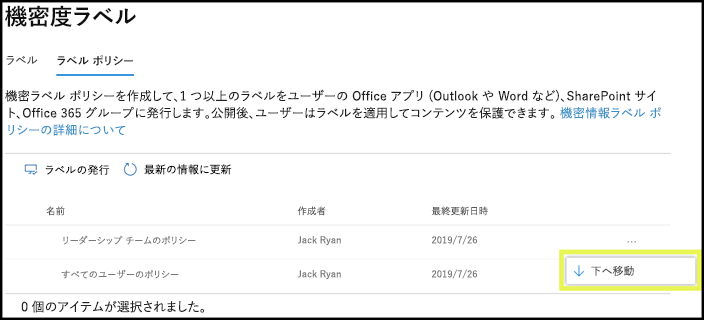

# 機密ラベルの概要

組織の従業員は、業務を達成するために組織の内外の関係者との共同作業を行います。このためコンテンツはファイアウォールの内側にとどまらず、デバイス、アプリ、およびサービスなどのさまざまな場所にローミングすることになります。コンテンツがローミングする際は、組織のビジネス ポリシーとコンプライアンス ポリシーを満たすように、コンテンツを安全な状態で保護することが必要です。

機密ラベルを使用すると、組織のユーザーの生産性や共同作業性に影響を与えることなく、機密コンテンツの分類と保護を行えます。

秘密度ラベルを示す例:

秘密度ラベルは、グローバル (パブリック) クラウドのテナントでのみサポートされています。 現在、秘密度ラベルは、[国別クラウド](https://docs.microsoft.com/azure/active-directory/develop/authentication-national-cloud)などの他のクラウドのテナントではサポートされていません。

機密ラベルを適用するには、ユーザーは職場または学校のアカウントを使用して Office にサインインする必要があります。

機密ラベルは、次の目的に使用できます。
  
- **ラベルが付けられたコンテンツに、暗号化や透かしなどの保護設定を強制適用します。** たとえば、ユーザーはドキュメントや電子メールに「社外秘」ラベルを適用できます。そのラベルによって、コンテンツを暗号化して「社外秘」の透かしを適用できます。

- **さまざまなプラットフォームやデバイスで Office アプリのコンテンツを保護する。** サポートされているアプリの一覧については、「[Office アプリの機密ラベル](sensitivity-labels-office-apps.md)」を参照してください。

- **Windows を実行するデバイスでは、機密コンテンツの組織外への流出を防止します。** これには、Microsoft Intune の Endpoint Protection を使用します。Windows デバイスに存在するコンテンツに機密ラベルが適用されていると、Endpoint Protection により、そのコンテンツがサード パーティ製アプリ (Twitter や Gmail など)、またはリムーバブル記憶域 (USB ドライブなど) にコピーされることを防止できます。

- Microsoft Cloud App Security を使用して**サード パーティ製アプリおよびサービスのコンテンツを保護します**。 Cloud App Security を使用すると、サード パーティ製アプリおよびサービス (SalesForce、Box、Dropbox など) のコンテンツを検出、分類、ラベル適用、および保護できます (サード パーティ製のアプリやサービスが機密ラベルを認識しない場合やサポートしない場合でも可能です)。

- **サード パーティ製アプリおよびサービスに機密ラベルを拡張します。** Microsoft Information Protection SDK を使用すると、[これらのプラットフォーム](https://docs.microsoft.com/information-protection/develop/overview#microsoft-information-protection-sdk)上のサード パーティ製アプリは、機密ラベルを認識して、保護設定を適用できるようになります。

- **保護設定を何も使わずにコンテンツを分類する。** 使用し、共有しているコンテンツを永続化、ローミングする（ステッカーなどの）コンテンツに分類をただ割り当てることもできます。 この分類を使用して使用状況レポートを作成し、機密性の高いコンテンツのアクティビティ データを確認できます。 この情報に基づいて常に選択し、後で保護設定を適用できます。

Office 365 の秘密度ラベルを使用することにより、これらすべてのケースにおいて適切なコンテンツで適切な措置をとることができます。 秘密度ラベルを使用すると、組織全体でデータを分類し、その分類に基づいて保護設定を適用できます。
  
機密ラベルの作成は、Microsoft 365 コンプライアンス センター、Microsoft 365 セキュリティ センター、または Office 365 セキュリティ/コンプライアンス センターの [**分類**]  >  [**機密ラベル**] で行います。 これらの機密情報のラベルは、Azure Information Protection、Office アプリ、および Office 365 サービスで使用できます。

Azure Information Protection のお客様は、それ以外の管理センターで Azure Information Protection のラベルを使用できます。また、追加の構成や高度な構成を実施することで、ラベルは Azure portal と同期されるようになります。 Azure Information Protection ラベルと Office 365 秘密度ラベルとの間には互換性があります。たとえば、Azure Information Protection によりラベル付けされたコンテンツがある場合は、コンテンツの再分類やラベルの付け直しを行う必要がありません。

## 機密ラベルとは

ドキュメントまたはメールに割り当てる秘密度ラベルでは、次のような特性を持つコンテンツに適用するスタンプのような機能が提供されます。

- **カスタマイズ可能。** さまざまな機密レベルのコンテンツに対応する組織内での分類項目 (「個人」、「公開」、「一般」、「社外秘」、「極秘」など) を作成できます。

- **クリア テキスト:**  ラベルはコンテンツのメタデータにクリア テキストとして保存されるため、サードパーティのアプリやサービスはラベルを読み取り、必要に応じてそれぞれの保護アクションを適用することができます。

- **永続性:** 秘密度ラベルをコンテンツに適用すると、適用されたラベルはメールまたはドキュメントのメタデータで永続的に保持されます。つまり、ラベルは保護設定も含めてコンテンツと共にローミングし、このデータに基づきポリシーが適用されたり実施されたりします。

Office アプリでは、秘密度ラベルはメールやドキュメントのタグのようにユーザーに表示されます。

コンテンツの各アイテムには、1 つの機密ラベルを適用できます。ただし、1 つのアイテムに 1 つの機密ラベルと 1 つの[保持ラベル](labels.md)の両方を適用できます。

## 機密ラベルでできること

メールとドキュメント以外にも、機密ラベルは複数のパブリック プレビュー リリースで利用できます。 ファイル、チーム、グループ、およびサイトにおける秘密度ラベルの使用方法の詳細については、次の記事を参照してください。

- [SharePoint および OneDrive で Office ファイルの機密度ラベルを有効にする (パブリック プレビュー)](sensitivity-labels-sharepoint-onedrive-files.md)

- [Microsoft Teams、Office 365 グループ、SharePoint サイトで機密ラベルを使用する (パブリック プレビュー)](sensitivity-labels-teams-groups-sites.md)

メールやドキュメントに秘密度ラベルが適用されると、そのラベルで構成済みの保護設定がコンテンツに適用されます。秘密度ラベルを使用すると、次のことができます。

- 電子メールのみ、または電子メールとドキュメントの両方の**暗号化**。 どのユーザーまたはグループがどのアクションを実行する権限を持つかを選択でき、権限を持つ期間も選択できます。 たとえば、組織外の特定のドメインのユーザーに、コンテンツを確認する権限を、コンテンツにラベルが付けられてから 7 日間のみ与えることができます。 または、アクセス許可を管理者が割り当てるのではなく、ユーザーがラベルを適用する際に、コンテンツへのアクセス許可の割り当てをユーザーが行えるようにもできます。 詳細については、「[機密ラベルの暗号化を使用してコンテンツへのアクセスを制限する](encryption-sensitivity-labels.md)」を参照してください。

- ラベルが適用されている電子メールやドキュメントにカスタムの透かし、ヘッダー、またはフッターを追加することで、**コンテンツにマークを付けます**。 透かしはドキュメントにのみ適用でき、電子メールには適用できません。透かしで使用できる文字数は、255 文字までです。 また、ヘッダーとフッターで使用できる文字数は 1024 文字までです (ただし、Excel の場合、ドキュメントに他のヘッダーまたはフッターが含まれているかどうかにより、また、その他の要素により、 255 文字以下に制限)。

    

- Intune のエンドポイント保護を有効にすることで、**データの損失を防止**する。 機密情報がダウンロードされた際に、Windows デバイスからデータが失われることを防止できます。 たとえば、ラベルが付けられたコンテンツは Dropbox、Gmail、または USB ドライブにコピーできなくなります。 機密ラベルで Windows 情報保護 (WIP) を使用できるようにするには、最初に Azure ポータルでアプリ保護ポリシーを作成する必要があります。 詳細については、「[Windows 情報保護で機密ラベル付きのファイルを保護する方法](https://docs.microsoft.com/windows/security/information-protection/windows-information-protection/how-wip-works-with-labels?branch=vsts17546553)」を参照してください。

- **機密情報を含むコンテンツに自動的にラベルを適用します。** どのような種類の機密情報にラベルをつけるか、また、ラベルを自動でつけるか、あるいは推奨するラベルを適用するようにユーザーに確認メッセージを表示するか選択することができます。ラベルを推奨する場合、ダイアログに任意に選択したテキストを表示することができます。詳細については、「[機密ラベルを自動的にコンテンツに適用する](apply-sensitivity-label-automatically.md)」を参照してください。

    

これらすべてのオプションは、秘密度ラベルを作成する際に使用できます。

### ラベルの優先度 (順序の問題)

秘密度ラベルを管理センターで作成すると、そのラベルは [**ラベル**] ページの [**秘密度**] タブにあるリストに表示されます。 このリストでは、ラベルの順序が重要になります。その理由は、この順序がラベルの優先度を反映しているためです。 最も厳密な機密ラベル (「極秘」など) はリストの**下側**に表示されるようにして、最も厳密でない機密ラベル (「公開」など) はリストの**上側**に表示されるようにします。

各ドキュメントまたはメールに適用できる秘密度ラベルは 1 つだけです。 ラベルの分類を低く変更する場合の正当性を示すようにユーザーに要求す必要がある場合は、この一覧の順序によって、より低い分類を判断します。

ラベルの優先度は、サブラベルにも適用されます。

### サブラベル (ラベルのグループ化)

サブラベルを使用すると、Office アプリのヘッダーでユーザーに表示される親ラベルの下に 1 つ以上のラベルをグループ化できます。 たとえば、「社外秘」について、組織では、その分類の特定の種類ごとに複数の異なるラベルを使用できます。 この例では、親ラベル「社外秘」は保護設定のない単なるテキスト ラベルであり、サブラベルが存在するラベルのため、コンテンツに適用することはできません。 その代わりに、ユーザーが「社外秘」を選択してからサブラベルを表示して、コンテンツに適用するサブラベルを選択できます。

サブラベルは、論理グループ内のユーザーにラベルを提示する簡単な方法です。 サブラベルは、その親ラベルから設定を継承することはありません。 サブラベルをユーザーに発行すると、そのユーザーはそのサブラベルをコンテンツに適用することはできますが、親ラベルのみを適用することはできません。

親ラベルは Azure Information Protection 統合ラベル付けクライアントを使用する Office アプリのコンテンツには適用されないため、親ラベルを既定のラベルとして選択したり、親ラベルを自動適用または推奨するように構成したりしないでください。

サブラベルの表示方法の例:

### 機密ラベルの編集または削除

機密ラベルを削除しても、そのラベルがコンテンツから削除されることはなく、コンテンツに対する保護設定の適用が継続されます。

機密ラベルを編集した場合は、コンテンツに適用されていたラベルのバージョンが、そのコンテンツに強制適用される内容になります。

## ラベル ポリシーでできること

機密ラベルの作成後には、その機密ラベルを発行し、組織内のユーザーが機密ラベルを選択してコンテンツに適用できるようにする必要があります。すべての Exchange メールボックスなどの場所に発行される保持ラベルとは異なり、機密ラベルはユーザーやグループに発行されます。発行後に、機密ラベルは該当するユーザーとグループの Office アプリに表示されます。

ラベル ポリシーを使用すると、次のことができます。

- **ラベルが表示されるユーザーとグループを選択します。** ラベルは、電子メールが有効なセキュリティ グループ、配布グループ、Office 365 グループ、または動的配布グループに発行できます。

- ラベル ポリシーに含まれているユーザーとグループが作成したすべての新しいドキュメントと電子メールに**既定のラベルを適用します**。この既定のラベルにより、すべてのコンテンツに適用する保護設定の基本レベルを設定できます。

- **ラベル変更の正当な理由を要求する。** コンテンツに「社外秘」のマークが付けられている場合にユーザーがそのラベルを削除または低い分類 (ラベル名「公開」など) との置き換えを希望する場合、ユーザーがその操作を実行するときに理由を提示するように要求できます。 現在、正当な理由は、管理者がレビューするための[ラベル分析](label-analytics.md)に送信されません。 ただし、[Azure Information Protection の統合ラベル付けクライアント](https://docs.microsoft.com/azure/information-protection/rms-client/aip-clientv2)は、この情報を [Azure Information Protection の分析](https://docs.microsoft.com/azure/information-protection/reports-aip)に送信します。

    

- **メールとドキュメントにラベルを適用するようユーザーに要求します。** ユーザーのすべてのコンテンツにラベル付けする場合は、ユーザーのすべての保存ドキュメントと送信メールに必ずラベルを適用するよう要求することができます。ラベルはユーザーが手動で割り当てるか、条件の結果として自動的に割り当てるか、既存で割り当てることができます (既存のラベル オプションについては前述のとおりです)。これは、Outlook で表示されるユーザーにラベルを割り当てるように要求するダイアログです。

    > [!NOTE]
    > 必須ラベルを付けるには、Azure Information Protection のサブスクリプションが必要です。 この機能を使用するには、[Azure Information Protection クライアント](https://www.microsoft.com/download/details.aspx?id=53018)、またはより新しい [Azure Information Protection 統合ラベル付けクライアント](https://docs.microsoft.com/azure/information-protection/rms-client/install-unifiedlabelingclient-app)をダウンロードしてインストールする必要があります。 また、同クライアントは Windows でのみ実行されるため、この機能は Mac、iOS、および Android ではまだサポートされていません。

    

- **カスタム ヘルプ ページへのリンクを提供する。** ユーザーが機密ラベルの意味や使用方法について明確に理解できない場合は、Office アプリの [**機密ラベル**] メニューの一番下に表示される [詳細情報] の URL を提供できます。

    ![リボンの [機密] ボタンに示された詳細な説明のリンク](media/Sensitivity-label-learn-more.png)

ラベル ポリシーを作成して、ユーザーおよびグループに機密ラベルを割り当てると、そのユーザーおよびグループは、1 時間以内に Office アプリで使用できるラベルを確認できるようになります。

作成および発行できる秘密度ラベルの数に制限はありませんが、1 つだけ例外があります。ラベルにより暗号化が適用される場合、ラベルの最大数は 500 に制限されます。 ただし、管理者のオーバーヘッドを低減し、ユーザーのために複雑さを軽減するためのベスト プラクティスとして、ラベルの数は必要最小限に抑えるようにします。 実際の展開における経験から、ユーザーに与えられた親ラベルが 6 個以上ある場合や親ラベル 1 つにつき 6 個以上のサブラベルがある場合、効果が大きく低下することがわかっています。

### ラベルのポリシー 優先度 (順序の問題)

[**ラベル ポリシー**] ページの [**機密ポリシー**] タブのリストに表示される機密ラベル ポリシーで機密ラベルを発行して、ユーザーが利用できるようにします。 機密ラベルと同じように (「[ラベルの優先度 (順序の重要性)](#label-priority-order-matters)」を参照)、機密ラベル ポリシーの順序は、優先度を反映しているため重要です。 優先度が最も低いラベル ポリシーは**一番上**に表示され、優先度が最も高いラベル ポリシーは**一番下**に表示されます。

ラベル ポリシーは次のように構成されます。

- 一連のラベル。
- ラベル ポリシーの範囲 (ポリシーに含まれるユーザーとグループ)。
- 上記のラベル ポリシーの設定 (既定のラベル、妥当性、必須ラベル、ヘルプのリンク)。

ユーザーは複数のラベル ポリシーに含めることができ、その場合、複数のポリシーのすべての秘密度ラベルがユーザーに表示されます。 ただし、ユーザーに表示されるポリシー設定は、最も優先度の高いラベル ポリシーのもののみです。

既定のラベルや必須のラベルなど、組織内のユーザーまたはグループに意図したラベル ポリシーのオプションが表示されない場合、機密ラベル ポリシーの順序を確認してください。 ラベル ポリシーを並べ替えるには、機密ラベル ポリシーを選択し、右側にある省略記号を選択して**下へ移動**または**上へ移動**します。

機密ラベル ポリシーにとって優先度は重要ですが、保持ラベル ポリシーの場合は**重要ではありません**。 「[保持するための原則、または優先順位](labels.md#the-principles-of-retention-or-what-takes-precedence)」で説明したように、コンテンツは複数の保持ポリシーの対象になれます。

## 機密ラベルの使用を開始する方法

機密ラベルの使用は、簡単なプロセスで開始できます。

1. **ラベルを定義する。** まず、コンテンツの各秘密度レベルを定義するための分類方法を決定します。 ユーザーにとって意味のある、一般的な名前または用語を使用します。 たとえば、最初は「個人用」、「公開」、「一般」、「社外秘」、「極秘」などのラベルを使用します。 サブラベルを使用すると、類似したラベルをカテゴリ別にグループ化できます。 また、ラベルの作成時には、ツール ヒントも必要になります。このツール ヒントは、ユーザーがリボン上のラベル オプションにポインターを重ねたときに Office アプリに表示されます。

2. **各ラベルの機能を定義する。** 次に、各ラベルに関連付ける保護設定を構成します。 たとえば、秘密度の低いコンテンツ (「一般」ラベルなど) には単にヘッダーやフッターを適用し、秘密度のより高いコンテンツ (「社外秘」ラベルなど) には透かし、暗号化、および WIP を適用することにより、権限があるユーザーのみが機密コンテンツにアクセスできるようにすることが可能です。

3. **ラベルの対象になるユーザーを定義します。** 組織のラベルを定義したら、そのラベルをラベル ポリシーで発行します。このポリシーによって、どのユーザーおよびグループにラベルを表示するかを制御します。1 つのラベルを再使用できるため、一度定義したラベルは、さまざまなユーザーに割り当てる複数のラベル ポリシーに含めることができます。ただし、コンテンツにラベルを割り当てるには、まず、そのラベルを発行して Office アプリなどのサービスで使用できるようにしておく必要があります。開始したばかりのときには、少数のユーザーに機密ラベルを割り当てて試験運用してください。

機密ラベルが機能するために、管理者、ユーザー、Office アプリが実行する内容の基本的なフローを次に示します。

## 機密ラベルを表示できる場所

秘密度ラベルは、Office アプリの UI に表示されます。 特定のアプリとプラットフォームで提供されている組み込みのラベル付け機能を確認するには、次の表を使用してください。

- [Word、Excel、および PowerPoint での秘密度ラベル機能のサポート](sensitivity-labels-office-apps.md#support-for-sensitivity-label-capabilities-in-word-excel-and-powerpoint)

- [Outlook での秘密度ラベル機能のサポート](sensitivity-labels-office-apps.md#support-for-sensitivity-label-capabilities-in-outlook)

Windows コンピューターで Azure Information Protection 統合ラベル付けクライアントを使用している場合は、秘密度ラベルで利用可能な追加の機能があります。 詳細については、「[Windows コンピューターのラベル付けクライアントを比較する](https://docs.microsoft.com/azure/information-protection/rms-client/use-client#compare-the-labeling-clients-for-windows-computers)」を参照してください。

### Windows 上の Office アプリ

Windows を実行するデバイス上の Office アプリでは、秘密度ラベルはリボンの [**ホーム**] タブにある [**秘密度**] ボタンに表示されます。 

組み込みのラベル付け機能を使用する場合、適用されているラベルはウィンドウ下部のステータス バーにも表示されます。

![Windows の Excel のリボンに示された [機密] ボタン](media/Sensitivity-label-Sensitivity-button.png)

### Web 上の Office アプリ

Web 上の Office アプリでの秘密度ラベルの使用方法の詳細については、「[Office on the web でファイルとメールに秘密度ラベルを適用する](https://support.office.com/article/2f96e7cd-d5a4-403b-8bd7-4cc636bae0f9)」を参照してください。

### Mac 上の Office アプリ

Mac デバイス上の Office アプリでは、秘密度ラベルはリボンの [**ホーム**] タブにある [**秘密度**] ボタンに表示されます。 適用されているラベルはウィンドウ下部のステータス バーにも表示されます。

![Mac 上の Office のリボンに示された [機密] ボタン](media/Sensitivity-label-on-Mac.png)

### iOS 上の Office アプリ

iOS デバイス上の Office アプリでは、秘密度ラベルはリボンの [**ホーム**] タブにある [**秘密度**] ボタンに表示されます。 適用されているラベルはウィンドウ下部のステータス バーにも表示されます。

![iOS 上の Office のリボンに示された [機密] ボタン](media/Sensitivity-label-on-iOS.png)

### Android 上の Office アプリ

Android デバイス上の Office アプリでは、秘密度ラベルはリボンの [**ホーム**] タブにある [**秘密度**] ボタンに表示されます。 適用されているラベルはウィンドウ下部のステータス バーにも表示されます。

![Android 上の Office のリボンに示された [機密] ボタン](media/Sensitivity-label-on-Android.png)

### Office アプリの機密ラベルに関する詳細情報

- [Office 内の文書やメールに機密ラベルを適用する](https://support.office.com/article/apply-sensitivity-labels-to-your-documents-and-email-within-office-2f96e7cd-d5a4-403b-8bd7-4cc636bae0f9)
- [Office ファイルに機密ラベルを適用した場合の既知の問題](https://support.office.com/article/known-issues-when-you-apply-sensitivity-labels-to-your-office-files-b169d687-2bbd-4e21-a440-7da1b2743edc)
- [Office アプリの機密ラベル](sensitivity-labels-office-apps.md)

## 機密ラベルが既存の Azure Information Protection ラベルと連動する方法

Azure Information Protection のユーザーは、Azure Information Protection 統合ラベル付けクライアントを使用して Windows のコンテンツを分類してラベルを付けることができます。 既存の Azure Information Protection ラベルは、統一ラベルとも呼ばれる新しい秘密度ラベルとシームレスに連動します。 これは、次のことを実行できることを意味します。

- 既存の Azure Information Protection ラベルをドキュメントと電子メールに保持する。
- 既存の Azure Information Protection ラベル構成を保持する。

テナントがまだ[統合ラベル付けプラットフォーム](https://docs.microsoft.com/azure/information-protection/faqs#how-can-i-determine-if-my-tenant-is-on-the-unified-labeling-platform)上にないことが理由で Azure Information Protection ラベルを使用している場合は、統合ラベル付けを有効にするまでは他の管理センターで新しいラベルを作成しないことをお勧めします。 このプロセスの詳細については、「[Azure Information Protection ラベルを統合秘密度ラベルに移行する方法](https://docs.microsoft.com/azure/information-protection/configure-policy-migrate-labels)」を参照してください。 

> [!NOTE]
> Azure ポータルでの Azure Information Protection ラベルのラベル管理は、**2021 年 3 月 31 日**に廃止されます。 詳細については、公式の「[廃止のお知らせ](https://techcommunity.microsoft.com/t5/azure-information-protection/deprecation-notice-azure-information-protection-classic-client/ba-p/1092108)」を参照してください。

## 秘密度ラベルと Azure Information Protection クライアント

Office 365 ProPlus アプリでは、Azure Information Protection クライアントがインストールされている場合、Office Windows アプリの秘密度ラベルの組み込みラベル付け機能が自動的に無効になります。
この既定の設定を変更して組み込みラベル付け機能を使用できるようにするには、「[Office 組み込みラベル クライアントについて](sensitivity-labels-office-apps.md#about-the-office-built-in-labeling-client)」を参照してください。

## Microsoft Intune のエンドポイント保護を使用して Windows デバイス上のコンテンツを保護する

秘密度ラベルの作成時には、このラベルが付けられたファイルを Windows デバイスに保存する際にはデータ漏えいに対する保護が必要であることを Windows に通知するオプションを選択できます。 このオプションを使用することで、このラベルが付けられたコンテンツは、たとえエンドポイントに保存されている場合であっても、許可された場所にのみ共有およびコピーを許可することが可能になります。 つまり、秘密度ラベルにこのオプションを有効にすると、追加の利用制約を必要とする最重要データであることが Windows に通知されます。

このオプションを有効にすると、Windows はドキュメントの機密ラベルを読み取って、認識し、対処できるようになり、コンテンツに対して自動的に Windows 情報保護 (WIP) を適用します。そのコンテンツがマネージ Windows デバイスにどのように送られたかは関係ありません。これにより、暗号化適用の有無にかかわらず、ラベルが付けられたファイルの不用意な漏えいを防止できるようになります。

たとえば、Windows はユーザーのマシンに存在する Word 文書に「社外秘」ラベルが適用されていることを認識して、そのデバイスから業務に関係ない場所 (個人用 OneDrive、個人用電子メール アカウント、ソーシャル メディア、USB ドライブなど) にデータがコピーまたは共有されることを防止するために WIP を適用できます。

ユーザーがラベル付きのコンテンツを個人用の Gmail アカウントにアップロードしようとすると、次のメッセージが表示されます。

また、ユーザーがラベル付きのコンテンツを USB ドライブに保存しようとすると、次のメッセージが表示されます。

### WIP を使用する場合の重要な前提条件

機密ラベルで WIP が使用できるようにするには、まず、「[Windows 情報保護で機密ラベル付きのファイルを保護する方法](https://docs.microsoft.com/windows/security/information-protection/windows-information-protection/how-wip-works-with-labels?branch=vsts17546553)」で説明する前提条件を満たしておく必要があります。このトピックには、次の前提条件についての説明があります。

- Windows 10 バージョン 1809 以降を実行していることを確認する。
- 「[Microsoft Defender Advanced Threat Protection (Microsoft Defender ATP) のセットアップ](https://docs.microsoft.com/windows/security/threat-protection/)」では、ラベルのコンテンツをスキャンして、対応する WIP 保護を適用します。 ATP では、異常の報告など、WIP と独立した複数の操作が実行されます。
- エンドポイント デバイスに適用する Windows 情報保護 (WIP) ポリシーを作成する。次のいずれかの方法で作成することができます。

  - [Microsoft Intune の Azure portal を使用して MDM で Windows 情報保護 (WIP) ポリシーを作成する](https://docs.microsoft.com/windows/security/information-protection/windows-information-protection/create-wip-policy-using-intune-azure)
  - [System Center Configuration Manager を使用した Windows 情報保護 (WIP) ポリシーの作成と展開](https://docs.microsoft.com/windows/security/information-protection/windows-information-protection/create-wip-policy-using-sccm)

## Microsoft Cloud App Security を使用してサード パーティ製アプリおよびサービスのコンテンツを保護する

Cloud App Security (CAS) を使用してサード パーティ製アプリおよびサービスのコンテンツを保護します。 Cloud App Security を使用すると、サード パーティ製サービスおよびアプリ (SalesForce、Box、Dropbox など) のコンテンツを検出、分類、ラベル適用、および保護できます。 たとえば、Dropbox で機密ラベルを認識できい場合でも、CAS はその場所にあるラベル付きコンテンツにアクセスして保護することができます。

詳細については、「[Azure Information Protection 分類ラベルを自動的に適用する](https://docs.microsoft.com/cloud-app-security/use-case-information-protection)」を参照してください。

### CAS を使用する場合の重要な前提条件

機密ラベルで CAS を使用できるようにするには、まず、「[Azure Information Protection 分類ラベルを自動的に適用する](https://docs.microsoft.com/cloud-app-security/use-case-information-protection)」で説明する前提条件を満たしておく必要があります。 このトピックには、次の前提条件についての説明があります。

- テナントに対する [Cloud App Security と Azure Information Protection を有効にする](https://docs.microsoft.com/cloud-app-security/azip-integration)。
- Cloud App Security に[アプリを接続する](https://docs.microsoft.com/cloud-app-security/enable-instant-visibility-protection-and-governance-actions-for-your-apps)。

## Microsoft Information Protection SDK を使用して機密ラベルをサード パーティ製アプリおよびサービスに拡張する

機密ラベルはクリア テキストとしてドキュメントのメタデータ内に存在するため、そうしたラベルを含むコンテンツの識別と保護をサード パーティ製アプリとサービスでサポートすることもできます。その他のアプリとサービスでのサポートは常に拡張中です。

[Microsoft Information Protection SDK](https://docs.microsoft.com/information-protection/develop/) を使用すると、サード パーティ製のアプリやサービスは、ドキュメントの機密ラベルを認識して、ドキュメントに対して保護を適用することができます。  [これらのプラットフォーム](https://docs.microsoft.com/information-protection/develop/overview#microsoft-information-protection-sdk)上のアプリが SDK でサポートされています。

この SDK を使用することで、その他の Microsoft 情報保護アプリおよびサービス (Office アプリ、Office 365 サービス、Azure Information Protection スキャナー、Microsoft Cloud App Security などと、その他いくつかのパートナーのソリューション) での操作方法でコンテンツのラベル付けと保護が可能になります。その例として、[Adobe Acrobat での機密ラベルのサポート](https://techcommunity.microsoft.com/t5/Azure-Information-Protection/Starting-October-use-Adobe-Acrobat-Reader-for-PDFs-protected-by/ba-p/262738)について調べてください。

Microsoft Information Protection SDK の詳細については、[Tech Community ブログでのお知らせ](https://techcommunity.microsoft.com/t5/Microsoft-Information-Protection/Microsoft-Information-Protection-SDK-Now-Generally-Available/ba-p/263144)を参照してください。また、[Microsoft 情報保護に統合されているパートナー ソリューション](https://techcommunity.microsoft.com/t5/Azure-Information-Protection/Microsoft-Information-Protection-showcases-integrated-partner/ba-p/262657)についても調べてください。

## 機密ラベルの作成に必要なアクセス許可

機密ラベルを作成するコンプライアンス チームのメンバーは、Microsoft 365 コンプライアンス センター、Microsoft 365 セキュリティ センター、または Office 365 セキュリティ/コンプライアンス センターへのアクセス許可を持っている必要があります。 既定では、テナント管理者はこれらの管理センターへのアクセス権を所有し、コンプライアンス責任者や他のユーザーにアクセス権を付与できます (テナント管理者が持つすべての権限を付与する必要はありません)。この委任された制限付き管理者アクセスについては、これらのいずれかの管理センターの [**アクセス許可**] ページに移動して、[**コンプライアンス管理者**] 役割グループまたは [**セキュリティ管理者**] 役割グループにユーザーを追加します。

詳細については、「[Office 365 セキュリティ/コンプライアンス センターへのアクセス権をユーザーに付与する](https://docs.microsoft.com/microsoft-365/security/office-365-security/grant-access-to-the-security-and-compliance-center)」を参照してください。

ラベルとラベル ポリシーを作成して適用するときにのみ、これらのアクセス許可が必要になります。ポリシーを適用する場合に、コンテンツへのアクセスは必要ありません。