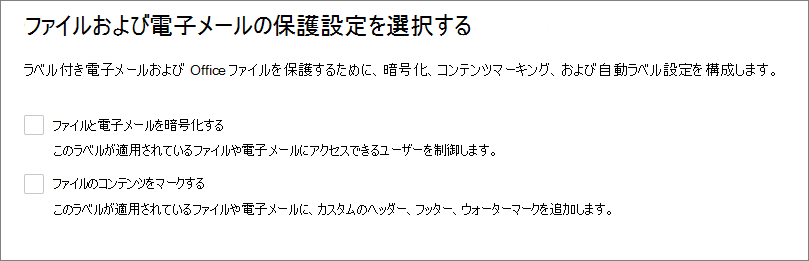
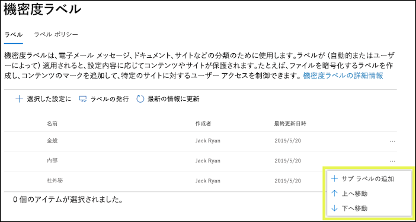
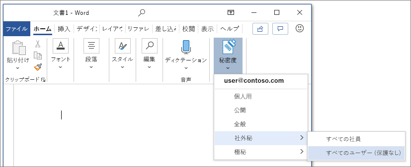
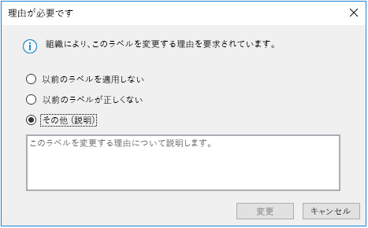
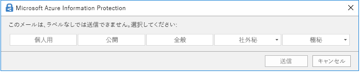
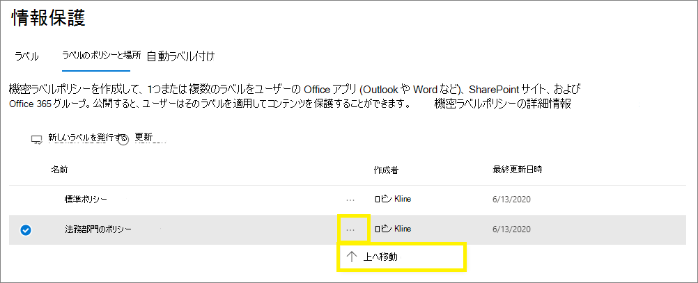

# 秘密度ラベルの詳細

>*[セキュリティとコンプライアンスのための Microsoft 365 ライセンス ガイダンス](/office365/servicedescriptions/microsoft-365-service-descriptions/microsoft-365-tenantlevel-services-licensing-guidance/microsoft-365-security-compliance-licensing-guidance)。*

> [!NOTE]
> Office アプリに表示される秘密度レベルに関する情報をお探しの場合は、「[Office のファイルとメールに秘密度レベルを適用する](https://support.microsoft.com/topic/apply-sensitivity-labels-to-your-files-and-email-in-office-2f96e7cd-d5a4-403b-8bd7-4cc636bae0f9)」をご覧ください。
>
> このページの情報は、これらのラベルを作成および構成できる IT 管理者向けです。

組織の従業員は、業務を行うために組織内外の関係者と共同作業を行います。このためコンテンツはファイアウォールの内側だけでなく、さまざまなデバイス、アプリ、サービスを越えて存在することになります。この場合、組織のビジネス ポリシーとコンプライアンス ポリシーを満たす安全な方法でコンテンツを保護することが必要です。

Microsoft Information Protection ソリューションの秘密度ラベルを使用すると、組織のデータを分類および保護しながら、ユーザーの生産性と共同作業を行う能力が損なわれないようにすることができます。

リボンの **[ホーム]** タブから、Excel で利用可能な秘密度ラベルを表示する例。 この例では、適用されたラベルがステータス バーに表示されます。

秘密度ラベルを適用するには、ユーザーは Microsoft 365 の職場または学校のアカウントを使用して、サインインする必要があります。

> [!NOTE]
> 米国政府のテナント向けに、秘密度ラベルがすべてのプラットフォームでサポートされるようになりました。
> - GCC および GCC High 環境の場合: [Office for Windows](/officeupdates/current-channel#version-2101-january-26) および [Office for Mac](/officeupdates/release-notes-office-for-mac#feature-updates-2) のリリース ノート
> - DoD 環境の場合: [Office for Windows](/officeupdates/current-channel#version-2103-march-30) のリリース ノート
>
> これらの環境で、Azure Information Protection 統合ラベル付けクライアントとスキャナーを使用する場合は、「[Azure Information Protection Premium の政府機関向けのサービスの説明](/enterprise-mobility-security/solutions/ems-aip-premium-govt-service-description)」を参照してください。

機密ラベルは、次の目的に使用できます。
  
- **暗号化およびコンテンツ マーキングを含む保護設定を提供します。** たとえば、ユーザーはドキュメントや電子メールに「社外秘」ラベルを適用できます。そのラベルによって、コンテンツを暗号化して「社外秘」の透かしを適用できます。 コンテンツ マーキングには、ヘッダーとフッター、および透かしが含まれます。また、暗号化は、コンテンツに対して許可されている人が取れるアクションを制限することもできます。

- **さまざまなプラットフォームやデバイスで Office アプリのコンテンツを保護する。** Office デスクトップアプリと Office on the web では、Word、Excel、PowerPoint、Outlook でサポートされています。 Windows、macOS、iOS、Android でサポートされています。

- Microsoft Cloud App Security を使用して **サード パーティ製アプリおよびサービスのコンテンツを保護する**。 Cloud App Security を使用すると、サード パーティ製アプリおよびサービス (SalesForce、Box、Dropbox など) のコンテンツを検出、分類、ラベル適用、および保護できます (サード パーティ製のアプリやサービスが機密ラベルを認識しない場合やサポートしない場合でも可能です)。

- Teams、Microsoft 365 グループ、SharePoint サイトを含む **コンテナーを保護します**。 たとえば、プライバシー設定、外部ユーザー アクセスと外部共有、および管理されていないデバイスからのアクセスを設定します。

- **Power BI に感度ラベルを拡張する**: この機能を有効にすると、Power BI にラベルを適用して表示したり、サービスの外部に保存するときにデータを保護したりすることができます。

- **Azure Purview の資産に秘密度ラベルを拡張する**: 現在プレビュー中のこの機能をオンにすると、SQL 列や Azure Blob Storage のファイルなどの資産に秘密度ラベルを適用することができます。 

- **秘密度ラベルの適用をサード パーティ製アプリやサービスに拡大する。** Microsoft Information Protection SDK を使用すると、秘密度ラベルの読み取りと保護設定の適用をサード パーティ製アプリで行えるようになります。

- **保護設定を何も使わずにコンテンツを分類する。** コンテンツの分類の結果としてラベルを単純に割り当てることもできます。 これにより、分類を組織のラベル名に視覚的にマッピングすることができます。ラベルを使用して、使用状況レポートを生成し、機密コンテンツのアクティビティ データを確認できます。 この情報に基づいて常に選択し、後で保護設定を適用できます。

これらすべてのケースで、Microsoft 365 の秘密度ラベルを使用することにより、適切なコンテンツで適切な措置をとることができます。 秘密度ラベルを使用すると、組織全体でデータを分類し、その分類に基づいて保護設定を適用できます。

秘密度ラベルでサポートされているこれらのシナリオの詳細については、「[秘密度ラベルの一般的なシナリオ](get-started-with-sensitivity-labels.md#common-scenarios-for-sensitivity-labels)」を参照してください。 機密情報のラベルをサポートする新しい機能は、常に開発されています。そのため、[Microsoft 365 の ロードマップ](https://aka.ms/MIPC/Roadmap)を参照することをお勧めします。

## 秘密度ラベルとは

ドキュメントやメールに割り当てる秘密度ラベルは、次のようなスタンプのような役目を果たします。

- **カスタマイズ可能。** 組織やビジネスのニーズに特化していますが、組織内のさまざまなレベルの機密コンテンツに対してカテゴリを作成できます。 たとえば、個人用、公開用、一般、社外秘、極秘などのラベルがあります。

- **クリア テキスト:**  ラベルはファイルやメールのメタデータにクリア テキストとして保存されるため、サードパーティ製のアプリやサービスはラベルを読み取り、必要に応じてそれぞれの保護アクションを適用することができます。

- **永続性。** ラベルがファイルおよびメールのメタデータに保存されているため、ラベルは、保存または格納場所に関係なく、コンテンツと共に移動します。 固有のラベル識別は、構成するポリシーを適用して実施するための基礎となります。

ユーザーに表示する場合、秘密度ラベルは、使用しているアプリのタグのように表示され、既存のワークフローに簡単に統合できます。

秘密度ラベルをサポートする各アイテムには、単一の秘密度ラベルを適用できます。 ドキュメントとメールには、秘密度ラベルと[保持ラベル](retention.md#retention-labels)の両方を適用できます。

> [!div class="mx-imgBorder"]
> 

## 機密ラベルでできること

メールやドキュメントに秘密度ラベルが適用されると、そのラベルで構成済みの保護設定がコンテンツに適用されます。秘密度ラベルは次のように構成できます。

- 電子メールとドキュメントを **暗号化** して、無許可のユーザーがこのデータにアクセスできないようにします。 どのユーザーまたはグループがどのアクションを実行する権限を持つかを選択でき、権限を持つ期間も選択できます。 たとえば、組織内のすべてのユーザーがドキュメントを変更できるようにしながら、他の組織内の特定のグループは、表示のみにすることも選択可能です。 または、管理者が割り当てるアクセス許可の代わりに、ユーザーがラベルを適用する際に、コンテンツへのアクセス許可の割り当てをユーザーが行えるようにもできます。 
    
    秘密度ラベルを作成または編集する場合の **暗号化** 設定の詳細については、 「[秘密度ラベルの暗号化を使用してコンテンツへのアクセスを制限する](encryption-sensitivity-labels.md)」を参照 してください。

- ラベルが適用されているメールやドキュメントに対して透かし、ヘッダー、またはフッターを追加することで、Office アプリを使用するときに **コンテンツにマークを付ける**。 透かしはドキュメントには適用できますが、メールには適用できません。 ヘッダーと透かしの例:
    
    
    
    コンテンツ マーキングがいつ適用されるかを確認する必要がありますか？ 「[Office アプリがコンテンツ マーキングと暗号化を適用した場合](sensitivity-labels-office-apps.md#when-office-apps-apply-content-marking-and-encryption)」を参照してください。
    
    すべてではありませんが、一部のアプリは変数を使用した動的マーキングをサポートしています。 たとえば、ラベル名またはドキュメント名をヘッダー、フッター、または透かしに挿入します。 詳細については、「[変数を使用した動的マーキング](sensitivity-labels-office-apps.md#dynamic-markings-with-variables)」を参照してください。
    
    文字数の長さ: 透かしで使用できる文字数は、255 文字に制限されています。 Excel を除き、ヘッダーとフッターの文字数は 1,024 文字までに制限されています。 Excel では、ヘッダーとフッターの合計が 255 文字に制限されています。ただし、この制限には、書式設定コードなど、表示されない文字も含まれます。 この制限に達すると、入力した文字列が Excel で表示されなくなります。

- [Microsoft Teams、Microsoft 365 グループ、SharePoint サイトで秘密度ラベルを使用する](sensitivity-labels-teams-groups-sites.md)機能を有効にすると、**サイトやグループなどのコンテナー内のコンテンツを保護します**。
    
    この機能を有効にするまで、グループおよびサイトの保護設定を構成することはできません。 このラベル構成では、ドキュメントやメールに自動的にラベルが付けられることはありませんが、代わりに、ラベル設定は、コンテンツを保存できるコンテナーへのアクセスを制御することによってコンテンツを保護します。 これらの設定には、プライバシー設定、外部ユーザー アクセスと外部共有、および非管理対象デバイスからのアクセスが含まれます。

- **ファイルやメールでラベルを自動的に適用するか、ラベルを推奨します。** ラベルを付ける機密情報を識別する方法を選択すると、ラベルを自動的に適用するか、ユーザーに推奨するラベルを適用するように求めることができます。 ラベルを推奨すると、選択したテキストがプロンプトに表示されます。 次に例を示します。
    
    
    
    機密ラベルを作成または編集するときの **ファイルと電子メールの自動ラベル設定** の詳細については、「[Office アプリのコンテンツに機密ラベルを自動的に適用する](apply-sensitivity-label-automatically.md)」および「[Azure Purview でデータに自動的にラベルを付ける](/azure/purview/create-sensitivity-label)」を参照してください。

### ラベル スコープ

機密度ラベルを作成するとき、2 つのことを決定するラベルのスコープを構成するように求められます。
- そのラベルに構成できるラベル設定
- ラベルがユーザーに表示される場所

このスコープ構成により、ドキュメントとメール専用で、コンテナー用に選択できない秘密度ラベルを作成できます。 同様に、コンテナー専用で、ドキュメントやメールには選択できない秘密度ラベル。 現在プレビュー中の新機能ですが、Azure Purview assets の範囲を選択することもできます。

既定では、**ファイルとメール** の範囲が常に選択されています。 その他の範囲は、テナントに対して機能が有効になると、既定で選択されます。

- **グループとサイト**: [コンテナーの秘密度ラベルを有効化してラベルを同期する](sensitivity-labels-teams-groups-sites.md#how-to-enable-sensitivity-labels-for-containers-and-synchronize-labels)

- **Azure Purview assets (プレビュー)**: [Azure Purview のコンテンツに自動的にラベルを付ける](/azure/purview/create-sensitivity-label)

すべての範囲が選択されないように既定値を変更すると、選択していない範囲の構成設定の最初のページが表示されますが、設定を構成することはできません。 たとえば、ファイルとメールのスコープが選択されていない場合、次のページでオプションを選択することはできません。

利用できないオプションがあるこれらのページについては、**次へ** を選択して続行します。 または、**[戻る]** を選択して、ラベルのスコープを変更します。

### ラベルの優先度 (順序の問題)

秘密度ラベルを管理センターで作成すると、そのラベルは [**ラベル**] ページの [**秘密度**] タブにあるリストに表示されます。 このリストでは、ラベルの順序が重要になります。その理由は、この順序がラベルの優先度を反映しているためです。 最も厳密な機密ラベル (「極秘」など) はリストの **下側** に表示されるようにして、最も厳密でない機密ラベル (「公開」など) はリストの **上側** に表示されるようにします。

ドキュメント、メール、コンテナーなどのアイテムに適用できる秘密度ラベルは 1 つだけです。 ラベルの分類を低く変更する場合の正当性を示すようユーザーに要求するオプションを選択する場合は、より低い分類はこの一覧の順序によって特定されます。 ただし、このオプションはサブラベルには適用されません。

サブラベルの順序は、[自動ラベル付け](apply-sensitivity-label-automatically.md)で使用されます。 ラベルが自動的に適用されるように構成した場合、またはラベルが推奨されるように構成した場合、複数のラベルにまたがる複数の一致が検出される可能性があります。 適用または推奨されるラベルの特定にはラベルの順序が使用されます。最後尾の秘密度ラベルが選択されます。該当する場合は、最後尾のサブラベルが選択されます。

### サブラベル (ラベルのグループ化)

サブラベルを使用すると、Office アプリの親ラベルの下側でユーザーに表示される 1 つ以上のラベルをグループ化できます。たとえば、「社外秘」について、組織では、その分類の特定の種類ごとに複数の異なるラベルを使用できます。この例では、親ラベル「社外秘」は保護設定のない単なるテキスト ラベルで、サブラベルが存在するラベルのため、コンテンツに適用することができません。その代わりに、ユーザーが「社外秘」を選択してからサブラベルを表示して、コンテンツに適用するサブラベルを選択できます。

サブラベルは、論理グループ内のユーザーにラベルを提示する簡単な方法です。 サブラベルは、親ラベルから設定を継承することはありません。 サブラベルをユーザーに発行すると、そのユーザーはそのサブラベルをコンテンツに適用することはできますが、親ラベルのみを適用することはできません。

既定のラベルとして親ラベルを選択したり、親ラベルが自動的に適用 (または推奨) されるように構成したりしないでください。 その場合、親ラベルをコンテンツに適用できなくなる可能性があります。

サブラベルの表示方法の例:

### 機密ラベルの編集または削除

管理センターで秘密度ラベルを削除してもラベルがコンテンツから自動的に削除されることはなく、そのラベルが適用されているコンテンツでは保護設定の適用が継続されます。

秘密度ラベルを編集した場合は、コンテンツには適用されていたラベルのバージョンが適用されます。

## ラベル ポリシーでできること

独自の秘密度ラベルを作成した場合、それらの秘密度ラベルを発行し、組織内のユーザーとサービスが使用できるようにする必要があります。 それにより、秘密度ラベルに対応する Office のドキュメントやメールなどに秘密度ラベルが適用されます。 

すべての Exchange メールボックスなどの場所に発行される保持ラベルと異なり、秘密度ラベルはユーザーまたはグループに発行されます。 秘密度ラベルに対応するアプリは、適用されたラベル、または適用可能なラベルとして、ラベルをそれらのユーザーやグループに表示することができます。

ラベル ポリシーを構成すると、次のことができます。

- **ラベルを表示させるユーザーとグループを選択する。** Azure AD の特定のユーザーまたは電子メールが有効なセキュリティ グループ、配布グループ、または Microsoft 365 グループ ([動的メンバーシップ](/azure/active-directory/users-groups-roles/groups-create-rule)を使用できる) にラベルを発行することができます。

- 新規ドキュメント、ラベルのないメール、および新規コンテナーに **既定のラベルを指定** します ([Microsoft Teams、Microsoft 365 グループ、および SharePoint サイトの秘密度ラベルを有効にしている場合](sensitivity-labels-teams-groups-sites.md))。 3 種類のアイテムすべてに同じラベルを指定することも、異なるラベルを指定することもできます。 ドキュメントに既定のラベルを指定した場合、Azure Information Protection 統合ラベル付けクライアントでは、ラベルのない既存のドキュメントにもこのラベルが適用されます。 既定のラベルがドキュメントまたはメールに適切でない場合、ユーザーはいつでも変更できます。
    
    > [!IMPORTANT]
    > [サブラベル](#sublabels-grouping-labels) がある場合は、親ラベルを既定のラベルとして構成しないように注意してください。
    
    既定ラベル使用して、すべてのコンテンツに適用する保護設定の基本レベルを設定することを検討してください。 ただし、ユーザーのとレーニングや他の制御を実施しない場合、この設定は不正確なラベル付けにつながる可能性もあります。 通常、ドキュメントの既定のラベルとして暗号化を適用するラベルを選択することはお勧めできません。 たとえば、多くの組織は、暗号化をサポートするアプリを所有していないか、認証可能なアカウントを使用していない可能性がある外部ユーザーとドキュメントを送信して共有する必要があります。 このシナリオの詳細については、「[Sharing encrypted documents with external users (外部ユーザーと暗号化されたドキュメントを共有する)](sensitivity-labels-office-apps.md#sharing-encrypted-documents-with-external-users)」を参照してください。

- **ラベル変更の正当な理由を要求する。** ユーザーがラベルを削除しようとした場合、またはラベルを低い順序番号のラベルに置き換えようとした場合は、ユーザーにこの操作の実行についての正当な理由を要求することができます。 たとえば、ユーザーは「社外秘」というラベルの付いたドキュメント (順序番号 3) を開き、そのラベルを「公開」というラベル (順序番号 1) に置き換えます。 Office アプリの場合、この正当化プロンプトは、組み込みのラベル付けを使用する場合はアプリ セッションごとに、Azure Information Protection 統合ラベル付けクライアントを使用する場合はファイルごとに 1 回トリガーされます。 管理者は、[アクティビティ エクスプローラー](data-classification-activity-explorer.md)でラベルの変更とともに正当化の理由を読み取ることができます。

    

- ドキュメントとメール、文書のみ、コンテナー、および Power BI コンテンツに **ラベルを適用することをユーザーに要求** します。 必須のラベル付けとも呼ばれるこれらのオプションにより、ユーザーがドキュメントを保存してメールを送信したり、新しいグループやサイトを作成したり、Power BI でラベルのないコンテンツを使用したりする前に、ラベルを適用する必要があります。
    
    ドキュメントやメールの場合、ラベルはユーザーが手動で割り当てることも、構成した条件に従って自動的に適用することも、既定 (前述の既定のラベルのオプション) で適用することもできます。ユーザーがラベルを割り当てる必要がある場合に Outlook に表示されるプロンプトの例:

    
    
    ドキュメントとメールの必須のラベル付けの詳細については、「[ユーザーがメールとドキュメントにラベルを適用することを必須にする](sensitivity-labels-office-apps.md#require-users-to-apply-a-label-to-their-email-and-documents)」を参照してください。
    
    コンテナーの場合、グループまたはサイトの作成時にラベルを割り当てる必要があります。
    
    Power BI の必須のラベル付けの詳細については、「[Power BI の必須のラベル付けポリシー](/power-bi/admin/service-security-sensitivity-label-mandatory-label-policy)」を参照してください。
    
    このオプションを使用して、ラベル付けの適用範囲を広げることを検討してください。 ただし、ユーザーのトレーニングを実施しない場合、この設定は不正確なラベル付けにつながる可能性があります。 さらに、対応する既定のラベルも設定しない限り、必須のラベル付けにより頻繁にダイアログが表示され、ユーザーを苛立たせる可能性があります。

- **カスタムのヘルプ ページへのヘルプ リンクを提示します。** ユーザーが機密ラベルの意味や使用方法について明確に理解できない場合に、Office アプリの **[機密ラベル]** メニューの末尾に表示される詳細な説明の URL を提供できます。

    ![リボンの [機密] ボタンに示された詳細な説明のリンク](../media/Sensitivity-label-learn-more.png)

ユーザーとグループに新しい秘密度ラベルを割り当てるラベル ポリシーを作成した後、ユーザーは Office アプリでラベルの確認を開始します。 最新の変更内容が組織全体に複製されるまでに、最大で 24 時間かかります。

作成および発行できる秘密度ラベルの数に制限はありませんが、1 つだけ例外があります。ラベルでユーザーと権限を特定する暗号化が適用される場合、この構成でサポートされるラベルの最大数は 500 に制限されます。 ただし、管理者のオーバーヘッドを低減し、ユーザーのために複雑さを軽減するためのベスト プラクティスとして、ラベルの数は必要最小限に抑えるようにします。 実際の展開における経験から、ユーザーがメイン ラベルを 5 つ以上、または 1 つのメイン ラベルごとにサブラベルを 5 つ以上持っている場合、効果が大きく低下することが証明されています。

### ラベルのポリシー 優先度 (順序の問題)

[**ラベル ポリシー**] ページの [**機密ポリシー**] タブのリストに表示される機密ラベル ポリシーで機密ラベルを発行して、ユーザーが利用できるようにします。 機密ラベルと同じように (「[ラベルの優先度 (順序の重要性)](#label-priority-order-matters)」を参照)、機密ラベル ポリシーの順序は、優先度を反映しているため重要です。 優先度が最も低いラベル ポリシーは **一番上** に表示され、優先度が最も高いラベル ポリシーは **一番下** に表示されます。

ラベル ポリシーは次のように構成されます。

- 一連のラベル。
- ラベル付きのポリシーが割り当てられるユーザーとグループ。
- その範囲に対するポリシーの範囲とポリシー設定 (ファイルやメールの既定のラベルなど)。

ユーザーは複数のラベル ポリシーに含めることができ、その場合、複数のポリシーのすべての秘密度ラベルと設定がユーザーに表示されます。 複数のポリシーの設定に矛盾がある場合は、優先度が最も高い (位置が最も低い) ポリシーの設定が適用されます。 つまり、設定ごとに最も優先度の高いものが優先されます。

ユーザーまたはグループに表示されることが想定されるラベルまたはラベル ポリシーの設定の動作が表示されない場合は、秘密度ラベル ポリシーの順序を確認します。 ポリシーを下に移動する必要がある場合があります。 ラベル ポリシーを並べ替えるには、[秘密度ラベル ポリシー] を選択し、右側にある省略記号を選択して **[下へ移動]** または **[上へ移動]** を選択します。

> [!NOTE]
> 注意: 複数のポリシーが割り当てられているユーザーの設定に矛盾がある場合は、優先度が最も高い (位置が最も低い) ポリシーの設定が適用されます。

## 秘密度ラベルと Azure Information Protection

Windows コンピューターの Microsoft 365 アプリで機密ラベルを使用する場合、Office アプリに組み込まれているラベルを使用するか、Azure Information Protection クライアントを使用するかを選択できます。

既定では、Azure Information Protection クライアントがインストールされている場合、組み込みのラベル付け機能はこれらのアプリでオフになっています。 この既定の動作の変更方法などの詳細については、「[Office built-in labeling client and the Azure Information Protection client (Office 組み込みラベル付けクライアントおよび Azure Information Protection クライアント)](sensitivity-labels-office-apps.md#office-built-in-labeling-client-and-the-azure-information-protection-client)」を参照してください。

Office アプリで組み込みのラベル付けを使用する場合でも、Azure Information Protection 統合ラベル付けクライアントを次の秘密度ラベルと共に使用することもできます。

- オンプレミスに保存されている機密情報を検出し、オプションでそのコンテンツにラベルを付けるスキャナー

- ユーザーがすべてのファイルの種類にラベルを適用するためのファイル エクスプローラーの右クリック オプション

- テキスト、画像、または PDF ドキュメントの暗号化されたファイルを表示するビューアー

- オンプレミスのファイル内の機密情報を検出し、これらのファイルからラベルおよび暗号化を適用または削除するための PowerShell モジュール。

Azure Information Protection の初心者、またはラベルを最近移行した Azure Information Protection の既存のお客様である場合は、Azure Information Protection のドキュメントから「[Windows ラベリング ソリューションを選択する](/azure/information-protection/rms-client/use-client#choose-your-windows-labeling-solution)」を参照してください。

### Azure Information Protection のラベル

> [!NOTE]
> Azure ポータルでの Azure Information Protection ラベルのラベル管理は、**2021 年 3 月 31 日** に廃止されます。 詳細については、公式の「[廃止のお知らせ](https://techcommunity.microsoft.com/t5/azure-information-protection/announcing-timelines-for-sunsetting-label-management-in-the/ba-p/1226179)」を参照してください。

テナントがまだ[統合ラベル付けプラットフォーム](/azure/information-protection/faqs#how-can-i-determine-if-my-tenant-is-on-the-unified-labeling-platform)を使用していない場合は、機密ラベルを使用する前に、まず統合ラベルを有効化する必要があります。 手順については、、「[Azure Information Protection ラベルを統合秘密度ラベルに移行する方法](/azure/information-protection/configure-policy-migrate-labels)」を参照してください。 

## 秘密度ラベルと Microsoft Information Protection SDK

秘密度ラベルはドキュメントのメタデータに保存されるため、サードパーティ製のアプリおよびサービスはこのラベル付けメタデータを読み書きして、ラベル付けの展開を補完できます。 さらに、ソフトウェア開発者は [Microsoft Information Protection SDK](/information-protection/develop/overview#microsoft-information-protection-sdk) を使用して、複数のプラットフォームにわたってラベル付けおよび暗号化機能を完全にサポートできます。 詳細については、[Tech Community ブログでの一般提供のお知らせ](https://techcommunity.microsoft.com/t5/Microsoft-Information-Protection/Microsoft-Information-Protection-SDK-Now-Generally-Available/ba-p/263144) を参照してください。 

[Microsoft Information Protection に統合されているパートナー ソリューション](https://techcommunity.microsoft.com/t5/Azure-Information-Protection/Microsoft-Information-Protection-showcases-integrated-partner/ba-p/262657)についての説明もご覧いただけます。

## 展開ガイダンス

ライセンス情報、アクセス許可、展開戦略、およびサポートされているシナリオとエンドユーザー ドキュメントのリソースのリストを含む展開計画とガイダンスについては、「[秘密度ラベルの開始](get-started-with-sensitivity-labels.md)」を参照してください。

秘密度ラベルを使用してデータ プライバシー規制に準拠する方法については、「[Microsoft 365 における、データ プライバシー規制のための情報の展開保護](../solutions/information-protection-deploy.md)」(aka.ms/m365dataprivacy) を参照してください。