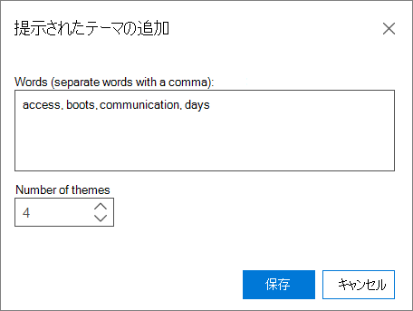

# Advanced eDiscovery (クラシック) で分析オプションを設定するSet Analyze options in Advanced eDiscovery (classic)

> [!NOTE]
> Advanced eDiscovery を使用するには、Advanced Compliance アドオンがインストールされた Office 365 E3 サブスクリプション、または E5 サブスクリプションがお客様の組織で必要になります。このプランを利用しておらず、Advanced eDiscovery をお試しになりたい場合は、[Office 365 Enterprise E5 の試用版にサインアップ](https://go.microsoft.com/fwlink/p/?LinkID=698279)してください。Advanced eDiscovery requires an Office 365 E3 with the Advanced Compliance add-on or an E5 subscription for your organization. If you don't have that plan and want to try Advanced eDiscovery, you can [sign up for a trial of Office 365 Enterprise E5](https://go.microsoft.com/fwlink/p/?LinkID=698279). 
  
Advanced eDiscovery で、分析を実行する前に分析オプションを設定します。In Advanced eDiscovery, set the Analyze options prior to running Analyze.
  
## 分析オプションを設定するSet Analyze options

Open **Prepare \> Analyze** \> **Setup**.Open **Prepare \> Analyze** \> **Setup**. 次のウィンドウが表示されます。The following window is displayed.
  
![[分析設定] のオプション](../media/c3ec7a92-8484-4812-b98c-aa3eb740e5b7.png)
  
 **ほぼ重複しているスレッドと電子メール スレッド** 分析を実行する場合は、このチェック ボックスをオンにします。**Near-duplicates and email threads** Check this box if you want to run the analysis. 既定では選択されています。It is selected by default. 
  
 **ドキュメントの類似性** [近重複] しきい値を入力するか、既定値の 65% を受け入れる。**Document similarity** Enter the Near-duplicates threshold value or accept the default of 65%. 
  
 **テーマ** すべてのファイルを処理し、テーマを割り当てるには、このチェック ボックスをオンにします。**Themes** Check this box to process all files and assign themes to them. 既定では、このチェック ボックスはオンではありません。By default, this check box is not selected. テーマ処理を実行する場合は、次のオプションを入力します。Enter the following options if you want to perform Themes processing.
  
- **テーマの最大数** 作成するテーマの数の値を入力または選択します。**Max number of themes** Enter or select a value for the number of themes to create. 既定値は 200 です。The default is 200. 
    
    > [!NOTE]
    > テーマの数を増やすと、パフォーマンスに影響を与えるだけでなく、テーマを一般化する機能にも影響します。Increasing the number of themes affects performance, as well as the ability of a theme to generalize. テーマの数が多いほど、細かく設定できます。The higher the number of themes, the more granular they are. たとえば、一連の 50 のテーマに 「バスケス、ボールズ、クリッパー、レイカー」などのテーマが含まれる場合です。300 のテーマには、"1 つのテーマ"、"Clippers"、"Lakers" が含まれる場合があります。For example, if a set of 50 themes include a theme such as "Basketball, Spurs, Clippers, Lakers"; 300 themes may include separate themes: "Spurs", "Clippers", "Lakers". ECA に対してこの機能を使用する場合は、"バスケト" というテーマを認識する必要がない場合に役立つ可能性があります。If you had no awareness of the theme "Basketball" and use this feature for ECA, seeing the theme "Basketball" could be useful. ただし、処理のテーマが多すぎる場合は、"バスケ" という単語が表示されない可能性があります。また、ブートしてヘアに使用されるアイテムではなく、スクリッパーとクリッパーがレビューに優れたバスケト テーマであるというのを知らない場合があります。But, if the processing had too many themes, you may never see the word "Basketball" and may not know that Spurs and Clippers are good Basketball themes to review, rather than items that go on boots and used for hair. 
  
- **推奨されるテーマ** テーマの処理を制御するテーマの単語を提案できます。**Suggested themes** You can suggest theme words to control Themes processing. Advanced eDiscovery は、これらの推奨される単語に焦点を当て、"テーマの最大数" 設定に基づいて、1 つ以上の関連するテーマを作成します。Advanced eDiscovery will focus on these suggested words and try to create one or more relevant themes, based on the "Max number of themes" settings. 
    
    たとえば、候補の単語が "computer" で、"2" を "最大テーマ数" として指定した場合、Advanced eDiscovery は単語 "computer" に関連する 2 つのテーマの生成を試みる。For example, if the suggested word is "computer", and you specified "2" as the "Max number of Themes", Advanced eDiscovery will try to generate two themes that relate to the word "computer". たとえば、"コンピューター ソフトウェア" と "コンピューター ハードウェア" という 2 つのテーマがあります。The two themes might be "computer software" and "computer hardware", for example. 
    
    
  
1. 推奨されるテーマを表示、追加、または編集するには、[変更] を **クリックします**。To view, add, or edit suggested themes, click **Modify**.
    
2. [推奨 **されるテーマ] パネル** で、[追加] アイコン アイコンをクリックして  テーマを追加します。In the **Suggested themes** panel, click the **Add**  icon to add a theme. [推奨 **されるテーマの追加] パネル** で、単語をコンマで区切って追加します。In the **Add suggested theme** panel, add the words, separated by commas. 
    
3. [ **テーマの数**] で値を選択して、Advanced eDiscovery がこれらの単語に対して生成しようとするテーマの数を決定します (既定値は 1 テーマです)。In **Number of themes**, select a value to determine the number of themes Advanced eDiscovery will try to generate for these words (default is 1 theme).
    
4. [ **保存] を** クリックし、ダイアログを閉じます。Click **Save** and then close the dialogue. 
    
    > [!NOTE]
    > テーマの総数には、推奨されるテーマが含まれます。The total number of themes includes Suggested Themes. 推奨されるテーマの合計がテーマの合計を超えすることはできません。The total Suggested Themes cannot exceed the total themes. テーマ全体に対して推奨テーマが多数ある場合、そのテーマのほとんどが推奨テーマ専用なので、システムによって検出される "新しい" テーマはわずかです。If there are many Suggested Themes relative to the total themes, only a few "novel" themes will be detected by the system because most of the themes will be dedicated to Suggested Themes. 
  
- **モード** ドロップダウン リストからテーマ オプションを **選択** します。**Mode** From the drop-down list, select a **Themes** option: 
    
  - **モデルの作成と適用**: ファイルのセグメントからモデル別にテーマを計算し、その間でファイルを配布します。**Create and apply model**: Calculates themes by models from a segment of the files and then distributes files among them.
    
  - **モデルの** 作成 : ファイルのセグメントからテーマ モデルを計算します。**Create model**: Calculates a themes model from a segment of the files. ファイルを分割する適用プロセスは、別の時点で個別に実行されます。The Apply process of dividing files is done separately at another time.
    
  - **モデルの** 適用 : このオプションは、モデルが以前に作成され、まだ適用されていない場合にのみ表示されます。**Apply model**: This option is only shown if a model was created previously and not yet applied. これにより、テーマに基づいてファイルが分割されます。This will divide the files based on the themes.
    
テキストの無視 [を設定し、分析](set-ignore-text-in-advanced-ediscovery.md) の [詳細設定を分析に](set-analyze-advanced-settings-in-advanced-ediscovery.md) 設定することもできます。You can also [set ignore text](set-ignore-text-in-advanced-ediscovery.md) and [set Analyze advanced settings](set-analyze-advanced-settings-in-advanced-ediscovery.md) for Analyze. 
  
これらのオプションを設定した後、[分析] をクリック **して** 実行します。After you've set these options, click **Analyze** to run. [分析結果の表示が](view-analyze-results-in-advanced-ediscovery.md) 表示されます。[View Analyze results](view-analyze-results-in-advanced-ediscovery.md) are displayed. 
  
## 関連項目Related topics

[Advanced eDiscovery (クラシック)Advanced eDiscovery (classic)](office-365-advanced-ediscovery.md)
  
[ドキュメントの類似性についてUnderstanding document similarity](understand-document-similarity-in-advanced-ediscovery.md)
  
[[テキストを無視する] を設定する ](set-ignore-text-in-advanced-ediscovery.md)[Set Ignore text ](set-ignore-text-in-advanced-ediscovery.md)
  
[分析設定の拡張設定Set Analyze advanced settings](set-analyze-advanced-settings-in-advanced-ediscovery.md)
  
[結果の分析を表示するView Analyze results](view-analyze-results-in-advanced-ediscovery.md)

