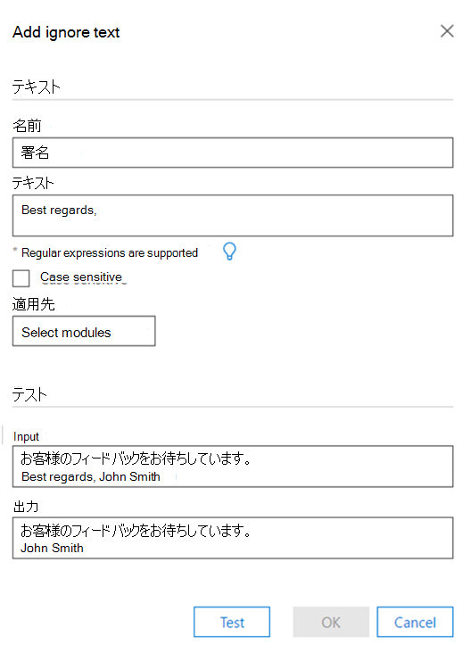
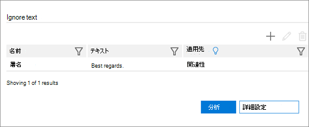

# Advanced eDiscovery (クラシック) で分析の [テキストを無視する] オプションを設定するSet Ignore Text option for Analyze in Advanced eDiscovery (classic)

> [!NOTE]
> Advanced eDiscovery を使用するには、Advanced Compliance アドオンがインストールされた Office 365 E3 サブスクリプション、または E5 サブスクリプションがお客様の組織で必要になります。このプランを利用しておらず、Advanced eDiscovery をお試しになりたい場合は、[Office 365 Enterprise E5 の試用版にサインアップ](https://go.microsoft.com/fwlink/p/?LinkID=698279)してください。Advanced eDiscovery requires an Office 365 E3 with the Advanced Compliance add-on or an E5 subscription for your organization. If you don't have that plan and want to try Advanced eDiscovery, you can [sign up for a trial of Office 365 Enterprise E5](https://go.microsoft.com/fwlink/p/?LinkID=698279). 
  
テキストを無視する機能は、Advanced eDiscovery モジュールのすべてまたは任意に適用できます。分析 (近重複、電子メール スレッド、テーマ) および関連性。The Ignore Text feature can be applied to all or any of the following Advanced eDiscovery modules: Analyze (Near-duplicates, Email Threads, Themes) and Relevance. 無視されたテキストは、関連性に表示されるファイルには表示されません。分析/計算では、無視されたテキストは破棄されます。Ignored text will not appear in files displayed in Relevance, and the analysis/calculations will discard the ignored text.
  
既に実行されているモジュールに対して [テキストを無視] 機能が既に定義されている場合、[テキストを無視] 設定は変更されません。If the Ignore Text feature was previously defined for modules that have already run, the Ignore Text setting will now be protected from being modified. ただし、関連性モジュールの [テキストを無視] 機能は、いつでも変更できます。However, the Ignore Text feature for the Relevance module can still be changed at any time.
  
## [テキストを無視する] フィルターの適用方法How Ignore Text filters are applied

複数の無視テキスト フィルターが入力された順序で適用されます。Multiple Ignore Text filters are applied in the order that they were entered. 適用する順序を変更するには、削除して目的の順序で再入力する必要があります。To change the order in which they are applied, they must be deleted and re-entered in the desired order.
  
たとえば、テキスト コンテンツが "DAVE BOB ALICE CAROLEVE" の場合、無視するテキスト エントリのサンプルと、これらのエントリによって生成される結果を次に示します。For example, if the text content is: "DAVE BOB ALICE CAROL EVE", the following are samples of Ignore Text entries and the results these entries produce:

|**テキスト のエントリを無視する****Ignore Text entries**   |**結果****Results**   |
|:-----|:-----|
|"ALICE"、"BOB CAROL""ALICE", "BOB CAROL"    |"DAVEEVE""DAVE EVE"    |
|"ALICE"、"BOB ALICE CAROL""ALICE", "BOB ALICE CAROL"    |"DAVE BOB CAROLEVE""DAVE BOB CAROL EVE"    |
   
2 番目の Ignore Text エントリは、最初の無視テキストが適用された後にこのような文字列が見つからないため、実装されていません。The second Ignore Text entry is not implemented because the string is not found as such AFTER the first Ignore Text has been applied.
  
## 無視するテキストを定義するときに正規表現を使用するUse regular expressions when defining Ignore Text

Ignore Text を定義する場合は、正規表現がサポートされています。Regular expressions are supported for use when defining Ignore Text. 正規表現の構文と使用方法の例を次に示します。The following are examples of regular expression syntax and usage:
  
- 行の末尾まで Begin からテキストを削除 (無視) するには:To remove (ignore) text from Begin until the end of a line:
    
     `Begin(.*)$`
    
    ここで、"Begin" は行内でこの文字列が最初に出現します。where "Begin" is the initial occurrence of this string in the line.
    
    たとえば、次のテキストの場合:For example, for the following text:
    
    **"これは最初の文と最初の行です。****"This is first sentence and first line**
    
    **これは 2 番目の文と 2 行目です"****This is second sentence and second line"**
    
    正規表現 first(. \* )$ を指定すると、次の結果が返されます。the Regular Expression first(.\*)$ will result in:
    
    **"これは次の場合です。****"This is**
    
    **これは 2 番目の文と 2 行目です"****This is second sentence and second line"**
    
- 電子メール スレッドの末尾に自動的に挿入される免責事項と法的声明を削除するには、次の操作を行います。To remove disclaimers and legal statements automatically inserted at the end of email threads:
    
     `Begin(.|\s)*End`
    
    ここで、"Begin" と "End" は、ラップされたテキスト段落の先頭と末尾に一意の文字列です。where "Begin" and "End" are unique strings at the beginning and end of a wrapped text paragraph. 
    
    たとえば、次の正規表現は、Begin 文字列と End 文字列の間の電子メール スレッドに含めらた免責事項と法的ステートメントを削除します。For example, the following regular expression will remove disclaimers and legal statements that were in the email thread between the Begin and End strings:
    
    **このメッセージには機密情報 (.|\s) \* 検証が必要な場合は、ハード コピー バージョンを要求してください****This message contains confidential information (.|\s)\*If verification is required please request a hard-copy version**
    
- 免責事項 (特殊文字を含む) を削除するには:To remove a disclaimer (including special characters): 
    
    たとえば、次のテキストの場合 (ここで x で表される免責事項を含む)。For example, for the following text (with the disclaimer represented here by x's): 
    
    **/\*\ このメッセージには機密情報が含まれている。xxxx xxxx****/\*\ This message contains confidential information. xxxx xxxx**
    
    **xxxx xxxx xxxx xxxx xxxx xxxx xxxx xxxx****xxxx xxxx xxxx xxxx xxxx xxxx xxxx**
    
    \**xxxx xxxx 検証が必要な場合は、ハード コピー バージョンを要求してください。/\*\**\**xxxx xxxx If verification is required, please request a hard-copy version. /\*\**
    
    上記の免責事項を削除する正規表現は次のようにする必要があります。the regular expression to remove the above disclaimer should be: 
    
    **\/\\*\\このメッセージには機密情報 \. (.|\s) \* 検証が必要な場合は、ハード コピー バージョンを要求してください \.\/\\*\\****\/\\*\\ This message contains confidential information\.(.|\s)\* If verification is required please request a hard-copy version\. \/\\*\\**
    
- 正規表現ルール:Regular expression rules:
    
  - スペース、"_"、および "-" 以外のアルファベットの一部ではない文字の前に " が必要です \" 。Any characters that are not part of the alphabet except for space(s), "_" and "-" must be preceded by "\".
    
  - 通常の eExpression フィールドの長さは無制限です。The regular eExpression field can be unlimited length.
    
> [!TIP]
> 正規表現の説明と詳細な構文については、「正規表現言語 - クイック [リファレンス」を参照してください](https://msdn.microsoft.com/library/az24scfc%28v=vs.110%29.aspx)。For an explanation and detailed syntax of regular expressions, see: [Regular Expression Language - Quick Reference](https://msdn.microsoft.com/library/az24scfc%28v=vs.110%29.aspx). 
  
## テキスト無視ルールの定義Define Ignore Text rule

1. [分析 **の \> 管理 \> ] オプション タブ** の[テキストを無視] セクションで、アイコンをクリックして **+** ルールを追加します。In the **Manage \> Analyze \> Analyze options** tab, in the **Ignore Text** section, click the **+** icon to add a rule. 
    
2. [テキスト **を無視して** 追加] ダイアログの **[名前** ] フィールドに、無視するテキスト ルールの名前を入力します。In the **Add Ignore Text** dialog, in the **Name** field, type a name for the Ignore Text rule. 
    
    
  
3. [テキスト **] ボックス** に、無視するテキストを入力します。In the **Text** box, type the text to be ignored. テキスト フィールドでは、文字数に制限はありません。The text field allows an unlimited number of characters. 
    
    > [!TIP]
    > 上のウィンドウに示すように、ライト ライト ライト **を** クリックすると、テキストを無視するルールの一般的な構文ガイドラインが表示されます。As shown in the window above, click **light bulb** to see common syntax guidelines for the Ignore Text rule. 
  
4. 必要に応 **じて、[** 大文字と小文字を区別する] チェック ボックスをオンにします。Select the **Case sensitive** check box, if desired. 
    
5. [適用 **先] ボックスの** 一覧で、定義を適用する Advanced eDiscovery モジュールを選択します。In the **Apply to** list, select the Advanced eDiscovery modules in which to apply the definition. 
    
6. サンプル テキストでテストを実行する場合は、[入力] テキストボックスにサンプル テキストを入力し、[テスト] をクリック **します**。If you want a test run on sample text, type sample text in the **Input** text box and click **Test**. 結果が [出力] テキスト **ボックスに** 表示されます。The results are displayed in the **Output** text box. 
    
7. **[OK] を** クリックして [テキストを無視] ルールを保存します。Click **OK** to save the Ignore Text rule. 定義されている無視テキスト ルールが表示されます。The defined Ignore Text rule is displayed. 
    
    
  
## 関連項目See also

[Advanced eDiscovery (クラシック)Advanced eDiscovery (classic)](office-365-advanced-ediscovery.md)
  
[ドキュメントの類似性についてUnderstanding document similarity](understand-document-similarity-in-advanced-ediscovery.md)
  
[分析オプションの設定Setting Analyze options](set-analyze-options-in-advanced-ediscovery.md)
  
[分析の詳細設定の設定Setting Analyze advanced settings](set-analyze-advanced-settings-in-advanced-ediscovery.md)
  
[分析結果の表示Viewing Analyze results](view-analyze-results-in-advanced-ediscovery.md)

