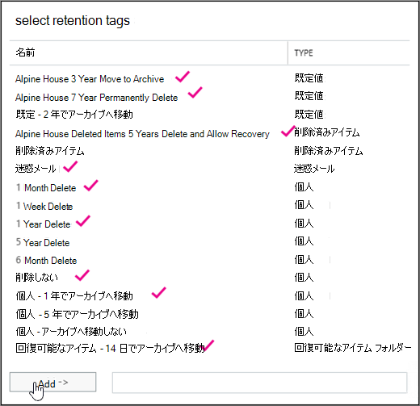

# <a name="customize-an-archive-and-deletion-policy-for-mailboxes-in-your-organization"></a>組織内のメールボックスのアーカイブポリシーと削除ポリシーをカスタマイズする

Microsoft 365管理者は、ユーザーのアーカイブ メールボックスにアイテムを自動的に移動し、メールボックスからアイテムを自動的に削除[](archive-mailboxes.md)するアーカイブおよび削除ポリシーを作成できます。

これを行うには、メールボックスに割り当てられたメッセージング レコード管理 (MRM) アイテム保持ポリシーを作成し、一定の期間が過ごした後にアイテムをユーザーのアーカイブ メールボックスに移動し、一定の年齢制限に達した後にメールボックスからアイテムも削除します。 

移動または削除されるアイテムを決定する実際のルールを保持タグと呼ぶ。 保持タグは MRM 保持ポリシーにリンクされます。その後、ユーザーのメールボックスに割り当てられます。 保持タグは、ユーザーのメールボックス内の個々のメッセージとフォルダーに保持設定を適用します。 メッセージがメールボックスに保持される期間と、メッセージが指定した保持期間に達したときに実行されるアクションを定義します。 メッセージが保持期間に達すると、メッセージはユーザーのアーカイブ メールボックスに移動されるか、削除されます。
  
この記事の手順では、アルパイン ハウスという架空の組織のアーカイブと保持ポリシーを設定します。 このポリシーの設定には、次のタスクが含まれます。
  
- 組織内のすべてのユーザーに対してアーカイブ メールボックスを有効にします。 これにより、ユーザーは追加のメールボックス ストレージを提供し、アイテム保持ポリシーがアイテムをアーカイブ メールボックスに移動するために必要です。 また、ユーザーはアイテムをアーカイブ メールボックスに移動してアーカイブ情報を保存できます。

- 次の操作を行う 3 つのカスタム保持タグを作成します。

  - 3 歳のアイテムをユーザーのアーカイブ メールボックスに自動的に移動します。 アイテムをアーカイブ メールボックスに移動すると、ユーザーのプライマリ メールボックスの領域が解放されます。

  - 削除済みアイテム フォルダーから 5 歳のアイテムを自動的に削除します。 これにより、ユーザーのプライマリ メールボックスの領域も解放されます。 ユーザーは、必要に応じてこれらのアイテムを回復する機会があります。 詳細については、「詳細情報 [」セクションの](#more-information) 脚注を参照してください。 

  - プライマリ メールボックスとアーカイブ メールボックスの両方から 7 歳のアイテムを自動的に (および完全に) 削除します。 コンプライアンス規制のため、一部の組織では一定の期間メールを保持する必要があります。 この期間が経過すると、組織はユーザー メールボックスのこれらのアイテムを完全に削除する必要があります。

- 新しいアイテム保持ポリシーを作成し、新しいカスタム保持タグを追加します。 また、組み込みの保持タグを新しい保持ポリシーに追加します。 これには、ユーザーがメールボックス内のアイテムに割り当て可能な個人用タグが含まれます。 ユーザーのプライマリ メールボックスの回復可能なアイテム フォルダーからアーカイブ メールボックスの回復可能なアイテム フォルダーにアイテムを移動するアイテム保持タグも追加します。 これにより、メールボックスを保留にしたユーザーの回復可能なアイテム フォルダー内の領域を解放できます。

この記事の手順の一部またはすべてに従って、自分の組織内のメールボックスのアーカイブポリシーと削除ポリシーを設定できます。 組織内のすべてのメールボックスに実装する前に、いくつかのメールボックスでこのプロセスをテストすることをお勧めします。
  
## <a name="before-you-set-up-an-archive-and-deletion-policy"></a>アーカイブポリシーと削除ポリシーを設定する前に

- このトピックの手順を実行するには、組織のグローバル管理者である必要があります。 

- 新しいユーザー アカウントを作成し、ユーザーにライセンスを割りExchange Onlineすると、ユーザーのメールボックスが自動的に作成されます。 メールボックスが作成されると、既定のアイテム保持ポリシー (Default MRM Policy) が自動的に割り当てられます。 この記事では、新しいアイテム保持ポリシーを作成し、ユーザー メールボックスに割り当て、既定の MRM ポリシーを置き換える。 メールボックスには、一度に 1 つのアイテム保持ポリシーのみを割り当てることができます。

- アイテム保持タグとアイテム保持ポリシーの詳細については、「Exchange Online保持タグと保持ポリシー」[を参照してください](/exchange/security-and-compliance/messaging-records-management/retention-tags-and-policies)。

## <a name="step-1-enable-archive-mailboxes-for-users"></a>手順 1: ユーザーのアーカイブ メールボックスを有効にする

最初の手順では、組織内のユーザーごとにアーカイブ メールボックスを有効にします。 ユーザーのアーカイブ メールボックスを有効にし、[アーカイブに移動] アイテム保持アクションを持つアイテム保持タグがアイテムを移動するには、保持期間が経過した後にアイテムを移動する必要があります。
  
> [!NOTE]
> アーカイブ メールボックスは、プロセスを完了する前に、ある時点で有効になっている限り、このプロセス中にいつでも有効にできます。 アーカイブ メールボックスが有効になっていない場合、アーカイブ または削除ポリシーが割り当てられているアイテムに対してアクションは実行されません。
  
1. <https://compliance.microsoft.com>に移動します。

2. グローバル管理者アカウントを使用してサインインします。
    
3. [アーカイブ] Microsoft 365 コンプライアンス センター[情報ガバナンス]**を** クリックし、[アーカイブ] タブ **をクリック** します。

    組織内のメールボックスの一覧が表示され、対応するアーカイブ メールボックスが有効か無効かを指定します。

4. リストの最初のメールボックスをクリックし **、Shift** キーを押しながらリストの最後のメールボックスをクリックして、すべてのメールボックスを選択します。

    > [!TIP]
    > この手順では、アーカイブ メールボックスが有効になっていないと仮定します。 アーカイブが有効になっているメールボックスがある場合は **、Ctrl** キーを押しながら、無効にされたアーカイブ メールボックスを持つ各メールボックスをクリックします。 または、[アーカイブ メールボックス **]** 列ヘッダーをクリックして、アーカイブ メールボックスを有効にするか無効にするかに基づいて行を並べ替え、メールボックスを簡単に選択できます。
  
5. 詳細ウィンドウの [一括編集] で **、[有効** にする] を **クリックします**。

    2 年以上前のアイテムが新しいアーカイブ メールボックスに移動されるという警告が表示されます。 これは、新しいユーザー メールボックスを作成するときに割り当てられた既定のアイテム保持ポリシーに、保持期間が 2 年のアーカイブ 既定のポリシー タグが含まれるためです。 手順 2 で作成するカスタム アーカイブの既定のポリシー タグの保持期間は 3 年です。 つまり、3 歳以上のアイテムはアーカイブ メールボックスに移動されます。

6. [ **はい** ] をクリックして警告メッセージを閉じ、選択したメールボックスごとにアーカイブ メールボックスを有効にするプロセスを開始します。

7. プロセスが完了したら、[更新] **をクリック**  をクリックして、[アーカイブ] ページの一 **覧を更新** します。

    アーカイブ メールボックスは、組織内のすべてのユーザーに対して有効になっています。

    

## <a name="step-2-create-new-retention-tags-for-the-archive-and-deletion-policies"></a>手順 2: アーカイブ ポリシーと削除ポリシーの新しい保持タグを作成する

この手順では、前に説明した 3 つのカスタム保持タグを作成します。
  
- Alpine House 3 Year Move to Archive (カスタム アーカイブ ポリシー)

- Alpine House 7 Year Permanently Delete (カスタム削除ポリシー)

- アルパイン ハウス削除済みアイテム 5 年 削除と回復の許可 (削除済みアイテム フォルダーのカスタム タグ)

新しい保持タグを作成するには、組織Exchange管理センター <a href="https://go.microsoft.com/fwlink/p/?linkid=2059104" target="_blank">(EAC)</a>をExchange Onlineします。 EAC のクラシック バージョンを必ず使用してください。
  
1. 資格情報を [https://admin.protection.outlook.com/ecp/](https://admin.protection.outlook.com/ecp/) 使用してアクセスしてサインインします。
  
2. EAC で、[コンプライアンス管理の **保持タグ]**  >  **に移動します。**

    組織の保持タグの一覧が表示されます。

### <a name="create-a-custom-archive-default-policy-tag"></a>カスタム アーカイブの既定のポリシー タグを作成する
  
最初に、3 年後にアイテムをアーカイブ メールボックスに移動するカスタム アーカイブ 既定のポリシー タグ (DPT) を作成します。
  
1. [保持 **タグ] ページで**、[新しいタグ] **[** 新規] アイコンをクリックし、メールボックス全体に自動的に適用される (既定)  **を選択します**。

2. [メールボックス **全体に自動的に適用される新しいタグ (既定)]** ページで、次のフィールドに入力します。 

    
  
   1. **名前** 新しい保持タグの名前を入力します。 

   2. **保持アクション** [ **アーカイブに移動] を** 選択して、アイテムを保持期間の有効期限が切れたときにアーカイブ メールボックスに移動します。

   3. **保持期間** [ **アイテムが次の年齢 (日数)** に達した場合] を選択し、保持期間を入力します。 このシナリオでは、アイテムは 1095 日 (3 年) 後にアーカイブ メールボックスに移動されます。

   4. **コメント** (オプション) カスタム保持タグの目的を説明するコメントを入力します。

3. [保存 **] を** クリックして、カスタム アーカイブ DPT を作成します。

    保持タグの一覧に新しいアーカイブ DPT が表示されます。

### <a name="create-a-custom-deletion-default-policy-tag"></a>カスタム削除の既定のポリシー タグを作成する
  
次に、別のカスタム DPT を作成しますが、7 年後にアイテムを完全に削除する削除ポリシーになります。
  
1. [保持 **タグ] ページで**、[新しいタグ] **[** 新規] アイコンをクリックし、メールボックス全体に自動的に適用される (既定)  **を選択します**。

2. [メールボックス **全体に自動的に適用される新しいタグ (既定)]** ページで、次のフィールドに入力します。 

    
  
   1. **名前** 新しい保持タグの名前を入力します。 

   2. **保持アクション** [ **完全に削除] を** 選択すると、保持期間の有効期限が切れたときにメールボックスからアイテムを削除できます。

   3. **保持期間** [ **アイテムが次の年齢 (日数)** に達した場合] を選択し、保持期間を入力します。 このシナリオでは、アイテムは 2555 日 (7 年) 後に削除されます。

   4. **コメント** (オプション) カスタム保持タグの目的を説明するコメントを入力します。 

3. [保存 **] を** クリックして、カスタム削除 DPT を作成します。 

    新しい削除 DPT が保持タグの一覧に表示されます。

### <a name="create-a-custom-retention-policy-tag-for-the-deleted-items-folder"></a>削除済みアイテム フォルダーのカスタムアイテム保持ポリシー タグを作成する
  
最後に作成する保持タグは、削除済みアイテム フォルダーのカスタム保持ポリシー タグ (RPT) です。 このタグは、5 年後に [削除済みアイテム] フォルダー内のアイテムを削除し、ユーザーが [削除済みアイテムの回復] ツールを使用してアイテムを回復できる回復期間を提供します。
  
1. [保持 **タグ] ページで** 、[新しいタグ] **[** 新規] アイコンをクリックし、既定のフォルダーに自動的  **されるを選択します**。

2. [既定の **フォルダー に自動的に適用される** 新しいタグ] ページで、次のフィールドに入力します。

    
  
   1. **名前** 新しい保持タグの名前を入力します。 

   2. **このタグを次の既定のフォルダーに適用する** ドロップダウン リストで、[削除済みアイテム] **を選択します**。

   3. **保持アクション** [ **削除] と [** 回復を許可する] を選択すると、保持期間が経過した場合にアイテムを削除できますが、削除済みアイテムの保持期間 (既定では 14 日間) 内に削除済みアイテムを回復できます。

   4. **保持期間** [ **アイテムが次の年齢 (日数)** に達した場合] を選択し、保持期間を入力します。 このシナリオでは、アイテムは 1825 日 (5 年) 後に削除されます。

   5. **コメント** (オプション) カスタム保持タグの目的を説明するコメントを入力します。 

3. [ **保存] を** クリックして、削除済みアイテム フォルダーのカスタム RPT を作成します。

    保持タグの一覧に新しい RPT が表示されます。

## <a name="step-3-create-a-new-retention-policy"></a>手順 3: 新しいアイテム保持ポリシーを作成する

カスタム保持タグを作成した後、次に新しいアイテム保持ポリシーを作成し、保持タグを追加します。 手順 2 で作成した 3 つのカスタム保持タグと、最初のセクションで説明した組み込みのタグを追加します。 手順 4 では、この新しいアイテム保持ポリシーをユーザー のメールボックスに割り当てる。
  
1. EAC で、[コンプライアンス管理の **保持ポリシー]**  >  **に移動します**。

2. [アイテム保持 **ポリシー] ページで** 、[新しい新規 **] アイコンを**  。

3. [名前 **] ボックス** に、新しいアイテム保持ポリシーの名前を入力します。たとえば、 **アルパイン ハウス アーカイブと削除ポリシー**。

4. [保持 **タグ] で**、[新 **しいアイコンの追加]**  。

    組織内の保持タグの一覧が表示されます。 手順 2 で作成したカスタム タグが表示されます。

5. 次のスクリーンショットで強調表示されている 9 つの保持タグを追加します (これらのタグについては、「詳細」 [セクションで詳しく説明](#more-information) します)。 保持タグを追加するには、保持タグを選択し、[追加] を **クリックします**。

    
  
    > [!TIP]
    > 複数の保持タグを選択するには **、Ctrl** キーを押しながら各タグをクリックします。 
  
6. 保持タグを追加した後 **、[OK] をクリックします**。

7. [新しい **アイテム保持ポリシー] ページで** 、[保存] **をクリックして** 新しいポリシーを作成します。

    新しいアイテム保持ポリシーが一覧に表示されます。 詳細ウィンドウにリンクされた保持タグを表示するには、このタグを選択します。

    
  
## <a name="step-4-assign-the-new-retention-policy-to-user-mailboxes"></a>手順 4: ユーザー メールボックスに新しいアイテム保持ポリシーを割り当てる

新しいメールボックスが作成されると、既定で既定の MRM ポリシーという名前のアイテム保持ポリシーが割り当てられます。 この手順では、手順 3 で作成した新しいアイテム保持ポリシーを組織内のユーザー メールボックスに割り当て、このアイテム保持ポリシー (メールボックスに割り当て可能なアイテム保持ポリシーが 1 つしか割り当てられていないため) を置き換える必要があります。 この手順では、組織内のすべてのメールボックスに新しいポリシーを割り当てる必要があります。
  
1. EAC で、[受信者メールボックス **]**  >  **に移動します**。

    組織内のすべてのユーザー メールボックスの一覧が表示されます。

2. リストの最初のメールボックスをクリックし **、Shift** キーを押しながらリストの最後のメールボックスをクリックして、すべてのメールボックスを選択します。 

3. EAC の右側にある詳細ウィンドウの [一括編集] で、[その他 **のオプション]****をクリックします**。

4. 
            **[アイテム保持ポリシー]** 下で **[更新]** をクリックします。

5. [アイテム保持 **ポリシーの一括** 割り当て] ページの [保持ポリシーの選択] ドロップダウン リストで、手順 3 で作成したアイテム保持ポリシーを選択します。たとえば、**アルパイン ハウス アーカイブとアイテム保持ポリシー**。

6. [保存 **] を** クリックして、新しいアイテム保持ポリシーの割り当てを保存します。

7. 新しいアイテム保持ポリシーがメールボックスに割り当てられたことを確認するには、次の操作を行います。

   1. [メールボックス] ページでメールボックス **を選択し** 、[編集] **をクリック**  。

   2. 選択したユーザーの [メールボックスのプロパティ] ページで、[メールボックスの機能] **をクリックします**。

   メールボックスに割り当てられた新しいポリシーの名前が、[アイテム **保持ポリシー]** ドロップダウン リストに表示されます。

## <a name="optional-step-5-run-the-managed-folder-assistant-to-apply-the-new-settings"></a>(省略可能)手順 5: 管理フォルダー アシスタントを実行して、新しい設定を適用する

手順 4 のメールボックスに新しいアイテム保持ポリシーを適用した後、新しい保持設定をメールボックスに適用するには、Exchange Online で最大 7 日かかる場合があります。 これは、管理フォルダー アシスタントと呼ばれるプロセスが少なくとも *7* 日に 1 回メールボックスを処理する理由です。 管理フォルダー アシスタントの実行を待機する代わりに **、PowerShell で Start-ManagedFolderAssistant** コマンドレットを実行することで、これを強制的にExchange Onlineできます。

 **管理フォルダー アシスタントを実行すると何が起こりますか?** メールボックス内のアイテムを検査し、アイテム保持の対象かどうかを判断することで、アイテム保持ポリシーの設定を適用します。 その後、保持対象のアイテムに適切な保持タグをスタンプし、保持期間を過ぎたアイテムに対して指定した保持アクションを実行します。
  
PowerShell に接続し、組織内Exchange Onlineで管理フォルダー アシスタントを実行する手順を次に示します。

1. [Exchange Online PowerShell への接続](/powershell/exchange/connect-to-exchange-online-powershell)。
  
2. 次の 2 つのコマンドを実行して、組織内のすべてのユーザー メールボックスの管理フォルダー アシスタントを開始します。

    ```powershell
    $Mailboxes = Get-Mailbox -ResultSize Unlimited -Filter {RecipientTypeDetails -eq "UserMailbox"}
    ```

    ```powershell
    $Mailboxes.Identity | Start-ManagedFolderAssistant
    ```

手順は以上です。 アルパイン ハウス組織のアーカイブポリシーと削除ポリシーを設定しました。

> [!NOTE]
> 前に述べたように、管理フォルダー アシスタントは少なくとも 7 日に 1 回メールボックスを処理します。 そのため、メールボックスを管理フォルダー アシスタントによってより頻繁に処理できる可能性があります。 また、管理者は、管理フォルダー アシスタントによってメールボックスが次回処理される時期を予測できません。これは、手動で実行する理由の 1 つです。 ただし、管理フォルダー アシスタントがメールボックスに新しい保持設定を適用するのを一時的に防止する場合は、コマンドを実行して、管理フォルダー アシスタントがメールボックスを処理する機能を一時的に無効に `Set-Mailbox -ElcProcessingDisabled $true` できます。 メールボックスの管理フォルダー アシスタントを再び有効にするには、コマンドを実行 `Set-Mailbox -ElcProcessingDisabled $false` します。 最後に、メールボックス ユーザーが無効なアカウントを持っている場合、そのメールボックスのアーカイブ アクションに移動アイテムを処理しません。
  
## <a name="optional-step-6-make-the-new-retention-policy-the-default-for-your-organization"></a>(省略可能)手順 6: 新しいアイテム保持ポリシーを組織の既定にする

手順 4 では、新しい保持ポリシーを既存のメールボックスに割り当てる必要があります。 ただし、将来作成Exchange Online新しいアイテム保持ポリシーが新しいメールボックスに割り当て済みである場合は、このポリシーを構成できます。 これを行うには、PowerShell Exchange Onlineを使用して組織の既定のメールボックス プランを更新します。 メールボックス *プランは、* 新しいメールボックスのプロパティを自動的に構成するテンプレートです。  このオプションの手順では、メールボックス プランに割り当てられている現在のアイテム保持ポリシー (既定では、既定の MRM ポリシー) を、手順 3 で作成したアイテム保持ポリシーに置き換えてください。 メールボックス プランを更新すると、新しいアイテム保持ポリシーが新しいメールボックスに割り当てられます。

1. [Exchange Online PowerShell への接続](/powershell/exchange/connect-to-exchange-online-powershell)。

2. 次のコマンドを実行して、組織内のメールボックス プランに関する情報を表示します。

    ```powershell
    Get-MailboxPlan | Format-Table DisplayName,RetentionPolicy,IsDefault
    ```

    既定として設定されているメールボックス プランに注意してください。

3. 次のコマンドを実行して、手順 3 で作成した新しいアイテム保持ポリシー ( **たとえば、アルパイン ハウス** アーカイブとアイテム保持ポリシー) を既定のメールボックス プランに割り当てる。 この例では、既定のメールボックス プランの名前が **ExchangeOnlineEnterprise である前提とします**。

    ```powershell
    Set-MailboxPlan "ExchangeOnlineEnterprise" -RetentionPolicy "Alpine House Archive and Retention Policy"
    ```

4. 手順 2 のコマンドを再実行して、既定のメールボックス プランに割り当てられているアイテム保持ポリシーが変更されたと確認できます。

## <a name="more-information"></a>詳細情報

- 保持期間の計算方法 メールボックス アイテムの保持期間は、送信されていないがユーザーが作成する下書きメッセージなどのアイテムの配信日または作成日から計算されます。 管理フォルダー アシスタントがメールボックス内のアイテムを処理する際、 [削除して回復を許可する] または [完全に削除する] の保存期間用アクション付き保持タグの付いたすべてのアイテムに開始日と有効期限をスタンプします。 アーカイブ タグを持つアイテムには、移動日がスタンプされます。 

- 次の表は、このトピックの手順に従って作成されたカスタム保持ポリシーに追加される各保持タグの詳細を示しています。

    | 保持タグ | このタグの動作 | 組み込みかカスタムか。 | Type |
    |:-----|:-----|:-----|:-----|
    |アルパイン ハウス 3 年アーカイブへの移行  <br/> |1095 日 (3 歳) のアイテムをアーカイブ メールボックスに移動します。  <br/> |カスタム (「手順 2: アーカイブポリシーと削除ポリシーの新しい保持タグを[作成する」を参照)](#step-2-create-new-retention-tags-for-the-archive-and-deletion-policies)  <br/> |既定のポリシー タグ (アーカイブ)。このタグはメールボックス全体に自動的に適用されます。  <br/> |
    |アルパイン ハウス 7 年の完全削除  <br/> |プライマリ メールボックスまたはアーカイブ メールボックス内のアイテムが 7 歳のときに完全に削除されます。  <br/> |カスタム (「手順 2: アーカイブポリシーと削除ポリシーの新しい保持タグを[作成する」を参照)](#step-2-create-new-retention-tags-for-the-archive-and-deletion-policies)  <br/> |既定のポリシー タグ (削除)。このタグはメールボックス全体に自動的に適用されます。  <br/> |
    |アルパイン ハウス削除済みアイテム 5 年 削除と回復の許可  <br/> |5 歳の [削除済みアイテム] フォルダーからアイテムを削除します。 ユーザーは、削除後 14 日間、これらのアイテムを回復できます。<sup>\*</sup> <br/> |カスタム (「手順 2: アーカイブポリシーと削除ポリシーの新しい保持タグを[作成する」を参照)](#step-2-create-new-retention-tags-for-the-archive-and-deletion-policies)  <br/> |アイテム保持ポリシー タグ (削除済みアイテム)。このタグは、[削除済みアイテム] フォルダー内のアイテムに自動的に適用されます。  <br/> |
    |回復可能なアイテム 14 日 アーカイブに移動  <br/> |回復可能なアイテム フォルダーに 14 日間保存されているアイテムをアーカイブ メールボックスの回復可能なアイテム フォルダーに移動します。  <br/> |組み込み  <br/> |アイテム保持ポリシー タグ (回復可能なアイテム)。このタグは、回復可能なアイテム フォルダー内のアイテムに自動的に適用されます。  <br/> |
    |迷惑メール  <br/> |迷惑メール フォルダーに 30 日間保存されているアイテムを完全に削除します。 ユーザーは、削除後 14 日間、これらのアイテムを回復できます。<sup>\*</sup> <br/> |組み込み  <br/> |アイテム保持ポリシー タグ (迷惑メール)。このタグは、迷惑メール フォルダー内のアイテムに自動的に適用されます。  <br/> |
    |1 か月で削除  <br/> |30 日前のアイテムを完全に削除します。 ユーザーは、削除後 14 日間、これらのアイテムを回復できます。<sup>\*</sup> <br/> |組み込み  <br/> |個人用。このタグは、ユーザーが適用できます。  <br/> |
    |1 年で削除  <br/> |365 日前のアイテムを完全に削除します。 ユーザーは、削除後 14 日間、これらのアイテムを回復できます。<sup>\*</sup> <br/> |組み込み  <br/> |個人用。このタグは、ユーザーが適用できます。  <br/> |
    |削除しない  <br/> |このタグは、アイテム保持ポリシーによってアイテムが削除されるのを防ぐためです。  <br/> |組み込み  <br/> |個人用。このタグは、ユーザーが適用できます。  <br/> |
    |個人 - 1 年でアーカイブへ移動  <br/> |アイテムを 1 年後にアーカイブ メールボックスに移動します。  <br/> |組み込み  <br/> |個人用。このタグは、ユーザーが適用できます。  <br/> |

    > <sup>\*</sup>ユーザーは、Outlook および Outlook on the web (以前は Outlook Web App) の [削除済みアイテムの回復] ツールを使用して、削除済みアイテムの保持期間中に削除済みアイテムを回復できます (既定では Exchange Online で 14 日間)。 管理者は、Windows PowerShellを使用して、削除済みアイテムの保持期間を最大 30 日間に増やします。 詳細については、「Outlook の[削除済み](https://support.office.com/article/49e81f3c-c8f4-4426-a0b9-c0fd751d48ce)アイテムをWindows」および「メールボックス内のメールボックスの削除済みアイテム保持期間を変更する」を[参照Exchange Online](/exchange/recipients-in-exchange-online/manage-user-mailboxes/change-deleted-item-retention)
  
- [回復可能 **なアイテム] 14** 日間 [アーカイブに移動] 保持タグを使用すると、ユーザーのプライマリ メールボックスの [回復可能なアイテム] フォルダーの記憶域を解放できます。 これは、ユーザーのメールボックスを保留にした場合に便利です。つまり、ユーザーのメールボックスは完全に削除されません。 アイテムをアーカイブ メールボックスに移動せずに、プライマリ メールボックスの回復可能なアイテム フォルダーの記憶域クォータに達する可能性があります。 この方法と回避方法の詳細については、「保留メールボックスの回復可能なアイテムのクォータを増 [やす」を参照してください](./increase-the-recoverable-quota-for-mailboxes-on-hold.md)。
