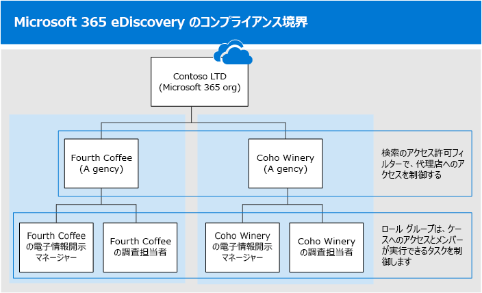

# <a name="set-up-compliance-boundaries-for-ediscovery-investigations"></a>電子情報開示調査のコンプライアンス境界を設定する

この記事のガイダンスは、調査の管理に Core eDiscovery または Advanced eDiscovery使用する場合に適用できます。

コンプライアンスの境界では、電子情報開示マネージャーが検索できるユーザー コンテンツの場所 (メールボックス、OneDrive アカウント、SharePoint サイトなど) を制御する組織内に論理的な境界を作成します。 また、コンプライアンスの境界は、組織内の法的、人事、その他の調査を管理するために使用される電子情報開示ケースにアクセスできるユーザーを制御します。 多くの場合、地理的な役員や規制を尊重する必要がある多国籍企業や、異なる機関に分かれている政府では、コンプライアンスの境界の必要性が必要です。 コンプライアンスMicrosoft 365は、コンテンツ検索を実行し、電子情報開示ケースを使用して調査を管理する際に、これらの要件を満たすのに役立ちます。
  
次の図の例を使用して、コンプライアンスの境界がどのように機能するのか説明します。
  

  
この例では、Contoso LTD は、2 つの子会社である Fourth Coffee と Coho Winery で構成される組織です。 このビジネスでは、電子情報開示管理者と調査担当者は、自分の代理店のメールボックス、Exchangeアカウント、OneDriveサイトSharePointのみを検索できる必要があります。 また、電子情報開示マネージャーと調査担当者は、自分の代理店で電子情報開示ケースのみを表示し、自分がメンバーであるケースにのみアクセスできます。 また、このシナリオでは、調査担当者はコンテンツの場所を保留にしたり、ケースからコンテンツをエクスポートしたりすることはできません。 コンプライアンスの境界がこれらの要件を満たす方法を次に示します。
  
- 電子情報開示の検索アクセス許可フィルター機能は、電子情報開示マネージャーと調査担当者が検索できるコンテンツの場所を制御します。 つまり、Fourth Coffee 代理店の情報開示マネージャーと調査担当者は、Fourth Coffee の子会社のコンテンツの場所のみ検索できます。 同じ制限が Coho Winery の子会社にも適用されます。

- [役割グループは](assign-ediscovery-permissions.md#rbac-roles-related-to-ediscovery) 、コンプライアンスの境界に対して次の機能を提供します。

  - ユーザーが電子情報開示ケースを表示できるユーザーをMicrosoft 365 コンプライアンス センター。 つまり、電子情報開示マネージャーと調査担当者には、その機関の電子情報開示ケースのみが表示されます。

  - 電子情報開示ケースにメンバーを割り当てできるユーザーを制御します。 つまり、電子情報開示マネージャーと調査担当者は、自分がメンバーになっているケースにのみメンバーを割り当てることができます。

  - 特定のアクセス許可を割り当てる役割を追加または削除することで、メンバーが実行できる電子情報開示関連のタスクを制御します。

- 検索アクセス許可フィルターを役割グループに適用すると、役割グループのメンバーは、アクションを実行するアクセス許可が役割グループに割り当てられている限り、次の検索関連アクションを実行できます。

  - コンテンツを検索する

  - 検索結果のプレビュー

  - 検索結果をエクスポートする

  - 検索によって返されるアイテムの削除

コンプライアンスの境界を設定するプロセスを次に示します。
  
[手順 1: 代理店を定義するユーザー属性を特定する](#step-1-identify-a-user-attribute-to-define-your-agencies)

[手順 2: 各機関の役割グループを作成する](#step-2-create-a-role-group-for-each-agency)

[手順 3: コンプライアンス境界を適用するための検索アクセス許可フィルターを作成する](#step-3-create-a-search-permissions-filter-to-enforce-the-compliance-boundary)

[手順 4: 代理店内調査用の電子情報開示ケースを作成する](#step-4-create-an-ediscovery-case-for-intra-agency-investigations)

## <a name="before-you-set-up-compliance-boundaries"></a>コンプライアンスの境界を設定する前に

- ユーザーにライセンスを割り当てるExchange Onlineがあります。 これを確認するには[、PowerShell の Get-User](/powershell/module/exchange/get-user)コマンドレットExchange Onlineします。

## <a name="step-1-identify-a-user-attribute-to-define-your-agencies"></a>手順 1: 代理店を定義するユーザー属性を特定する

最初の手順は、代理店を定義する属性を選択します。 この属性は、この属性に特定の値が割り当てられているユーザーのコンテンツの場所のみを検索する電子情報開示マネージャーを制限する検索アクセス許可フィルターを作成するために使用されます。 たとえば、Contoso が Department 属性を使用すると **します** 。 第 4 コーヒー子会社のユーザーのこの属性の値は、Coho Winery 子会社のユーザーの値  `FourthCoffee`  になります `CohoWinery` 。 手順 3 では、このペア  `attribute:value`  ( *たとえば、Department:FourthCoffee)* を使用して、電子情報開示マネージャーが検索できるユーザー コンテンツの場所を制限します。 
  
コンプライアンスの境界に使用できるユーザー属性の例を次に示します。
  
- Company

- CustomAttribute1 - CustomAttribute15

- 部署

- 事業所

- CountryOrRegion (2 文字の国コード)

完全な一覧については、サポートされているメールボックス フィルターの完全な一覧を [参照してください](/powershell/exchange/recipientfilter-properties#filterable-recipient-properties)。

## <a name="step-2-create-a-role-group-for-each-agency"></a>手順 2: 各機関の役割グループを作成する

次の手順では、代理店に合わせて、Microsoft 365 コンプライアンス センターグループを作成します。 役割グループを作成するには、組み込みの電子情報開示マネージャー グループをコピーし、適切なメンバーを追加し、ニーズに当てはまらない可能性がある役割を削除することをお勧めします。 電子情報開示関連の役割の詳細については、「電子情報開示のアクセス許可を割り当 [てる」を参照してください](assign-ediscovery-permissions.md)。
  
役割グループを作成するには、Microsoft 365 コンプライアンス センター の[アクセス許可] ページに移動し、コンプライアンスの境界と電子情報開示ケースを使用して調査を管理する各機関の各チームの役割グループを作成します。
  
Contoso コンプライアンスの境界シナリオを使用して、4 つの役割グループを作成し、それぞれに適切なメンバーを追加する必要があります。
  
- Fourth Coffee の電子情報開示マネージャー

- Fourth Coffee の調査担当者

- Coho Winery の電子情報開示マネージャー

- Coho Winery の調査担当者
  
Contoso コンプライアンス境界シナリオの要件を満たすために、調査担当者がコンテンツの場所を保留にしたり、ケースからコンテンツをエクスポートしたりするのを防ぐために、調査担当者の役割グループから保留とエクスポートの役割も削除します。

> [!IMPORTANT]
> ケースのメンバーとして追加した役割グループから役割が追加または削除された場合、その役割グループはケースのメンバー (または役割グループがメンバーである場合) として自動的に削除されます。 その理由は、ケースのメンバーに不注意で追加のアクセス許可を与えてしまうのを組織が保護する理由です。 同様に、役割グループが削除された場合は、そのグループがメンバーだったすべてのケースから削除されます。

## <a name="step-3-create-a-search-permissions-filter-to-enforce-the-compliance-boundary"></a>手順 3: コンプライアンス境界を適用するための検索アクセス許可フィルターを作成する

各機関の役割グループを作成した後、次の手順では、各役割グループを特定の機関に関連付け、コンプライアンス境界自体を定義する検索アクセス許可フィルターを作成します。 各機関に対して 1 つの検索アクセス許可フィルターを作成する必要があります。 セキュリティアクセス許可フィルターの作成の詳細については、「コンテンツ検索のアクセス許可フィルター [の構成」を参照してください](permissions-filtering-for-content-search.md)。
  
この記事のシナリオのコンプライアンス境界に使用される検索アクセス許可フィルターを作成するために使用される構文を次に示します。

```powershell
New-ComplianceSecurityFilter -FilterName <name of filter> -Users <role groups> -Filters "Mailbox_<MailboxPropertyName>  -eq '<Value> '", "SiteContent_Path -like '<SharePointURL>' -or SiteContent_Path -like '<OneDriveURL>'"
```

コマンドの各パラメーターの説明を次に示します。
  
- `FilterName`: フィルターの名前を指定します。 フィルターを使用する機関を説明または識別する名前を使用します。

- `Users`: このフィルターを実行する検索アクションに適用されるユーザーまたはグループを指定します。 コンプライアンス境界の場合、このパラメーターは、フィルターを作成する代理店の役割グループ (手順 3 で作成した) を指定します。 これは複数値パラメーターなので、1 つ以上の役割グループをコンマで区切って含めることができます。

- `Filters`: フィルターの検索条件を指定します。 コンプライアンスの境界では、次のフィルターを定義します。 それぞれ異なるコンテンツの場所に適用されます。

  - `Mailbox`: パラメーターで定義された役割グループOneDriveできるメールボックスまたはアカウントを `Users` 指定します。 このフィルターを使用すると、役割グループのメンバーは、特定の機関のメールボックスまたはOneDriveアカウントのみを検索できます。たとえば `"Mailbox_Department -eq 'FourthCoffee'"` 、 。

  - `SiteContent`: このフィルターには、2 つの個別のフィルターが含まれています。 1 つ目は、SharePointで定義されている役割グループが検索できる、機関内のサイトの数 `SiteContent_Path` を `Users` 指定します。 たとえば、「 `SiteContent_Path -like 'https://contoso.sharepoint.com/sites/FourthCoffee'` 」のように入力します。 2 番目のフィルター (演算子によって最初のフィルターに接続) は、代理店のドメイン (MySite ドメインとも呼OneDrive) を `SiteContent_Path` `SiteContent_Path` `or` *指定* します。 たとえば、「 `SiteContent_Path -like 'https://contoso-my.sharepoint.com/personal'` 」のように入力します。 フィルターの代り `Site_Path` でフィルターを使用 `SiteContent` できます。 フィルター `Site` `SiteContent` とフィルターは交換可能であり、この記事で説明する検索アクセス許可フィルターには影響を与えかねない。

    > [!IMPORTANT]
    > 以前の検索 `SiteContent` アクセス許可フィルター OneDriveフィルターが含まれている理由 フィルターはメールボックスと OneDrive アカウントの両方に適用しますが、SharePoint フィルターを含めることで、OneDrive フィルターも含めなかった場合は OneDrive アカウント `Mailbox` が除外されます `Site` 。 検索アクセス許可フィルターに SharePoint フィルターが含めなかった場合、メールボックス フィルターにはコンプライアンス境界のスコープに OneDrive アカウントが含まれるため、別の OneDrive フィルターを含める必要はありません。 つまり、フィルターのみを含む検索アクセス許可フィルターには、メールボックスとアカウントの両方 `Mailbox` OneDriveされます。

Contoso のコンプライアンスの境界シナリオをサポートするために作成される2つの検索アクセス許可フィルターの例を示します。 これらの例にはいずれもコンマ区切りのフィルター リストが含まれています。メールボックスとサイトのフィルターが同じ検索アクセス許可フィルターに含まれており、コンマで区切られています。
  
### <a name="fourth-coffee"></a>4 番目のコーヒー

```powershell
New-ComplianceSecurityFilter -FilterName "Fourth Coffee Security Filter" -Users "Fourth Coffee eDiscovery Managers", "Fourth Coffee Investigators" -Filters "Mailbox_Department -eq 'FourthCoffee'", "SiteContent_Path -like 'https://contoso.sharepoint.com/sites/FourthCoffee' -or SiteContent_Path -like 'https://contoso-my.sharepoint.com/personal'"
```

### <a name="coho-winery"></a>Coho Winery

```powershell
New-ComplianceSecurityFilter -FilterName "Coho Winery Security Filter" -Users "Coho Winery eDiscovery Managers", "Coho Winery Investigators" -Filters "Mailbox_Department -eq 'CohoWinery'", "SiteContent_Path -like 'https://contoso.sharepoint.com/sites/CohoWinery' -or SiteContent_Path -like 'https://contoso-my.sharepoint.com/personal'"
```

> [!NOTE]
> 前の例のパラメーター `Filters` の構文には、フィルター リストが *含まれています*。 フィルター リストは、メールボックス フィルターとサイト パス フィルターをコンマで区切ったフィルターです。 前の例では、コンマで区切ってフィルター処理を行います `Mailbox` `SiteContent` `-Filters "Mailbox_<MailboxPropertyName>  -eq '<Value> '", "SiteContent_Path -like '<SharePointURL>' -or SiteContent_Path -like '<OneDriveURL>'"` 。 このフィルターが電子情報開示検索の実行中に処理されると、1 つのメールボックス フィルターと 1 つの SharePoint/OneDrive フィルターの 2 つの検索アクセス許可フィルターがフィルター リストから作成されます。 フィルター リストを使用する代わりに、メールボックス属性の検索アクセス許可フィルターと SharePoint および OneDrive サイト属性の 1 つのフィルターという、各機関に対して 2 つの個別の検索アクセス許可フィルターを作成します。 どちらの場合も、結果は同じです。 フィルター リストを使用するか、個別の検索アクセス許可フィルターを作成することは、優先的な問題です。

### <a name="how-do-the-search-permissions-filters-work-in-this-scenario"></a>このシナリオでは、検索アクセス許可フィルターがどのように機能しますか?

このシナリオでは、検索アクセス許可フィルターを各機関に適用する方法を次に示します。

1. フィルター `Mailbox` が最初に適用され、電子情報開示マネージャーが検索できるコンテンツの場所を定義します。 この場合、Coho Winery 電子情報開示マネージャーは、Department メールボックス プロパティの値が **FourthCoffee** のユーザーのメールボックスと OneDrive アカウントのみを検索できます。 Coho Winery 電子情報開示マネージャーは、Department メールボックス プロパティの値が **CohoWinery** であるユーザーのメールボックスとOneDriveアカウントのみを検索できます。  フィルター `Mailbox` は、電子 *情報開示マネージャーが* 検索できるコンテンツの場所を指定するコンテンツの場所を指定するコンテンツの場所フィルターです。 どちらのフィルターでも、電子情報開示マネージャーは、特定のメールボックス プロパティ値を持つコンテンツの場所のみを検索できます。

2. 検索できるコンテンツの場所を定義した後、フィルターの次の部分は、電子情報開示マネージャーが検索できるコンテンツを定義します。 最初の `SiteContent` フィルターを使用すると、4 番目のコーヒー電子情報開示マネージャーは、サイト パス プロパティを含む (またはで始まる) ドキュメントのみを検索できます `https://contoso.sharepoint.com/sites/FourthCoffee` 。Coho Winery 電子情報開示マネージャーは、サイト パス プロパティを含む (またはで始まる) ドキュメントのみを検索できます `https://contoso.sharepoint.com/sites/CohoWinery` 。 したがって、2 `SiteContent` つのフィルターは *、* 検索できるコンテンツを定義するため、コンテンツ フィルターです。 どちらのフィルターでも、電子情報開示マネージャーは、特定のドキュメント プロパティ値を持つドキュメントのみを検索できます。 すべてのSharePoint関連フィルターは、検索可能なサイト のプロパティがすべてのドキュメントにスタンプされます。 詳細については、「Configure [permissions filtering for eDiscovery」を参照してください](permissions-filtering-for-content-search.md#new-compliancesecurityfilter)。

   > [!NOTE]
   > この記事のシナリオではそれらを使用しませんが、メールボックス コンテンツ フィルターを使用して、電子情報開示マネージャーが検索できるコンテンツを指定することもできます。 メールボックス コンテンツ フィルターの構文はです `"MailboxContent_<property> -<comparison operator> '<value>'"` 。 日付範囲、受信者、ドメイン、または検索可能な電子メール プロパティに基づいてコンテンツ フィルターを作成できます。 たとえば、このフィルターを使用すると、電子情報開示管理者は、電子情報開示ドメイン内のユーザーが送信または受信したメール アイテムのみを contoso.com できます `"MailboxContent_Participants -like 'contoso.com'"` 。 メールボックス コンテンツ フィルターの詳細については、「検索アクセス許可フィルターの構成 [」を参照してください](permissions-filtering-for-content-search.md#new-compliancesecurityfilter)。

3. 検索アクセス許可フィルターは **、AND** Boolean 演算子によって検索クエリに結合されます。 つまり、ある機関の電子情報開示マネージャーが電子情報開示検索を実行する場合、検索によって返されるアイテムは検索クエリと検索アクセス許可フィルターで定義されている条件と一致する必要があります。

## <a name="step-4-create-an-ediscovery-case-for-intra-agency-investigations"></a>手順 4: 代理店内調査用の電子情報開示ケースを作成する

最後の手順は、Microsoft 365 コンプライアンス センター でコア電子情報開示ケースまたは Advanced eDiscovery ケースを作成し、手順 2 で作成した役割グループをケースのメンバーとして追加します。 これにより、コンプライアンスの境界を使用する 2 つの重要な特性が得られます。
  
- ケースに追加された役割グループのメンバーだけが、ケース内のケースを表示してアクセスMicrosoft 365 コンプライアンス センター。 たとえば、4 番目の Coffee Investigators 役割グループがケースの唯一のメンバーである場合、4 番目のコーヒー電子情報開示マネージャー役割グループのメンバー (または他の役割グループのメンバー) はケースを表示またはアクセスできます。

- ケースに割り当てられた役割グループのメンバーがケースに関連付けられた検索を実行すると、そのユーザーは、その代理店内のコンテンツの場所のみを検索できます (手順 3 で作成した検索アクセス許可フィルターによって定義されます)。

ケースを作成してメンバーを割り当てるには、次の方法を使用します。

1. [コア電子 **情報開示]** ページ **または**[Advanced eDiscovery] ページに移動しMicrosoft 365 コンプライアンス センターケースを作成します。

2. ケースの一覧で、作成したケースの名前をクリックします。

3. 役割グループをメンバーとしてケースに追加します。 手順については、次のいずれかの記事を参照してください。

   - [コア電子情報開示ケースにメンバーを追加する](get-started-core-ediscovery.md#step-4-optional-add-members-to-a-core-ediscovery-case)

   - [ユーザー ケースにメンバー Advanced eDiscoveryする](add-or-remove-members-from-a-case-in-advanced-ediscovery.md)

> [!NOTE]
> 役割グループをケースに追加する場合は、自分がメンバーである役割グループのみを追加できます。

## <a name="searching-and-exporting-content-in-multi-geo-environments"></a>複数地域環境でのコンテンツの検索とエクスポート

また、検索アクセス許可フィルターを使用すると、エクスポート用にコンテンツをルーティングする場所と、複数地域環境でコンテンツの場所を検索するときに検索できるデータセンター SharePoint制御[できます](../enterprise/multi-geo-capabilities-in-onedrive-and-sharepoint-online-in-microsoft-365.md)。
  
- **検索結果のエクスポート:** 特定のデータセンターから、Exchange、SharePoint、OneDriveアカウントから検索結果をエクスポートできます。 つまり、検索結果をエクスポートするデータセンターの場所を指定できます。

    エクスポートを *ルーティングする* データセンターを作成または変更するには **、New-ComplianceSecurityFilter** コマンドレットまたは **Set-ComplianceSecurityFilter** コマンドレットの Region パラメーターを使用します。
  
    |**パラメーターの値**|**データセンターの場所**|
    |:-----|:-----|
    |NAM  <br/> |北アメリカ (データセンターは米国内)  <br/> |
    |EUR  <br/> |ヨーロッパ  <br/> |
    |APC  <br/> |アジア太平洋  <br/> |
    |CAN <br/> |カナダ|
    |||

- **コンテンツ検索のルーティング:** サイトとアカウントのコンテンツ検索SharePoint、OneDriveデータ センターにルーティングできます。 つまり、検索を実行するデータセンターの場所を指定できます。

    *Region* パラメーターには、次のいずれかの値を使用して、サイトやアカウントを検索するときに検索SharePointデータセンター OneDriveします。
  
    |**パラメーターの値**|**データ センターのルーティングSharePoint**|
    |:-----|:-----|
    |NAM  <br/> |米国  <br/> |
    |EUR  <br/> |ヨーロッパ  <br/> |
    |APC  <br/> |アジア太平洋  <br/> |
    |CAN  <br/> |米国  <br/> |
    |AUS  <br/> |アジア太平洋  <br/> |
    |KOR  <br/> |組織の既定のデータセンター  <br/> |
    |GBR  <br/> |ヨーロッパ  <br/> |
    |JPN  <br/> |アジア太平洋  <br/> |
    |IND  <br/> |アジア太平洋  <br/> |
    |LAM  <br/> |米国  <br/> |
    |NOR  <br/> |ヨーロッパ |
    |BRA  <br/> |北米のデータセンター |
    |||

   検索アクセス許可フィルターに *Region* パラメーターを指定しない場合は、組織のプライマリ SharePointが検索されます。 検索結果は、最も近いデータセンターにエクスポートされます。

   概念を簡略化するために *、Region* パラメーターは、データ センター内のコンテンツの検索に使用されるデータセンター SharePoint制御OneDrive。 コンテンツ検索はデータセンターの地理的な場所にExchangeされないので、Exchange Exchange内のコンテンツの検索には適用されません。 また、同じ *Region* パラメーター値によって、エクスポートがルーティングされるデータセンターが決まる場合もあります。 これは、地理的なボードをまたがってデータの動きを制御するために必要な場合が多い。

> [!NOTE]
> データ を使用している場合Advanced eDiscovery *Region* パラメーターは、データのエクスポートを行う領域を制御できません。 データは、組織の中央の場所からエクスポートされます。 また、データ センターとSharePointのOneDriveは、データセンターの地理的な場所にバインドされていない場合があります。 すべてのデータセンターが検索されます。 詳細については、「Advanced eDiscoveryの[ソリューションのAdvanced eDiscovery」を参照Microsoft 365。](overview-ediscovery-20.md)

コンプライアンス境界の検索アクセス許可フィルターを作成 *するときに Region* パラメーターを使用する例を次に示します。 これは、4 番目のコーヒー子会社が北アメリカにあり、Coho Winery がヨーロッパにあると仮定します。
  
```powershell
New-ComplianceSecurityFilter -FilterName "Fourth Coffee Security Filter" -Users "Fourth Coffee eDiscovery Managers", "Fourth Coffee Investigators" -Filters "Mailbox_Department -eq 'FourthCoffee'", "SiteContent_Path -like 'https://contoso.sharepoint.com/sites/FourthCoffee' -or SiteContent_Path -like 'https://contoso-my.sharepoint.com/personal'" -Region NAM
```

```powershell
New-ComplianceSecurityFilter -FilterName "Coho Winery Security Filter" -Users "Coho Winery eDiscovery Managers", "Coho Winery Investigators" -Filters "Mailbox_Department -eq 'CohoWinery'", "SiteContent_Path -like 'https://contoso.sharepoint.com/sites/CohoWinery' -or SiteContent_Path -like 'https://contoso-my.sharepoint.com/personal'" -Region EUR
```

複数地域環境でコンテンツを検索およびエクスポートする場合は、次のことを念頭に置いておきます。
  
- Exchange メールボックスの検索は、*Region* パラメーターにより制御されません。 メールボックスを検索すると、すべてのデータセンターが検索されます。 メールボックスを検索する対象Exchangeを制限するには、検索アクセス許可フィルターを作成または変更するときに *Filters* パラメーターを使用します。

- 電子情報開示マネージャーが複数の SharePoint 地域間で検索する必要がある場合は、その電子情報開示マネージャーが検索アクセス許可フィルターで使用する別のユーザー アカウントを作成して、SharePoint サイトまたは OneDrive アカウントがある地域を指定する必要があります。 これを設定する方法の詳細については、「コンテンツ検索」の「SharePoint地域環境でのコンテンツの検索」セクション[を参照してください](content-search-reference.md#searching-for-content-in-a-sharepoint-multi-geo-environment)。

- SharePoint および OneDrive でコンテンツを検索する場合 *、Region* パラメーターは、電子情報開示マネージャーが電子情報開示調査を行うプライマリまたはサテライトの場所に検索を指示します。 電子情報開示マネージャーが、検索SharePointフィルター OneDrive指定された地域外のサイトを検索した場合、検索結果は返されません。

- Core eDiscovery から検索結果をエクスポートする場合、すべてのコンテンツの場所 (Exchange、Skype for Business、SharePoint、OneDrive、およびコンテンツ検索ツールを使用して検索できるその他のサービスを含む) のコンテンツが Azure Storage にアップロードされます。 Region パラメーターで指定されたデータセンター内の *場所を指定* します。 これにより、組織は、管理された境界を越えてコンテンツをエクスポートすることを許可しない方法でコンプライアンスを遵守できます。 検索アクセス許可フィルターで地域が指定されていない場合、コンテンツは組織のプライマリ データセンターにアップロードされます。

  ファイルからコンテンツをAdvanced eDiscovery、Region パラメーターを使用してコンテンツのアップロード先を *制御* することはできません。 コンテンツは、組織のAzure Storageデータセンター内の場所にアップロードされます。 中央の場所に基づく地域の場所の一覧については、「複数地域[Microsoft 365の構成」を参照してください](../enterprise/multi-geo-ediscovery-configuration.md)。

- 次のコマンドを実行して、既存の検索アクセス許可フィルターを編集して地域を追加または変更できます。

    ```powershell
    Set-ComplianceSecurityFilter -FilterName <Filter name>  -Region <Region>
    ```

## <a name="using-compliance-boundaries-for-sharepoint-hub-sites"></a>ハブ サイトでのコンプライアンスの境界SharePoint使用する

[SharePointハブ サイトは、](/sharepoint/dev/features/hub-site/hub-site-overview)多くの場合、電子情報開示のコンプライアンスの境界が従うのと同じ地理的または機関の境界と一致します。 つまり、ハブ サイトのサイト ID プロパティを使用してコンプライアンス境界を作成できます。 これを行うには、SharePoint Online PowerShell の[Get-SPOHubSite](/powershell/module/sharepoint-online/get-spohubsite#examples)コマンドレットを使用してハブ サイトの SiteId を取得し、部門 ID プロパティにこの値を使用して検索アクセス許可フィルターを作成します。

次の構文を使用して、ハブ サイトの検索アクセス許可フィルター SharePointします。

```powershell
New-ComplianceSecurityFilter -FilterName <Filter Name> -Users <User or Group> -Filters "Site_Departmentid -eq '{SiteId of hub site}'"
```

Coho ワイナリー代理店のハブ サイトの検索アクセス許可フィルターを作成する例を次に示します。

```powershell
New-ComplianceSecurityFilter -FilterName "Coho Winery Hub Site Security Filter" -Users "Coho Winery eDiscovery Managers", "Coho Winery Investigators" -Filters "Site_Departmentid -eq '44252d09-62c4-4913-9eb0-a2a8b8d7f863'"
```

## <a name="compliance-boundary-limitations"></a>コンプライアンス境界の制限

コンプライアンスの境界を使用する電子情報開示ケースと調査を管理する場合は、次の制限事項に注意してください。
  
- 検索を作成して実行するときに、機関以外のコンテンツの場所を選択することができます。 ただし、検索のアクセス許可フィルターがあるため、これらの場所からのコンテンツは、検索結果に含まれません。

- コンプライアンスの境界は、電子情報開示ケースのホールドには適用されません。 つまり、ある機関の電子情報開示マネージャーが、保留中の別の機関にユーザーを配置することができます。 ただし、電子情報開示マネージャーが保留にされているユーザーのコンテンツの場所を検索する場合は、コンプライアンスの境界が適用されます。 つまり、電子情報開示マネージャーは、ユーザーを保留にすることはできても、ユーザーのコンテンツの場所を検索することはできません。

    また、保留リストは、機関のコンテンツの場所にのみ適用されます。

- 検索アクセス許可フィルター (メールボックスまたはサイト フィルター) が割り当てられている場合に、組織内のすべての SharePoint サイトを含む検索のインデックスのないアイテムをエクスポートしようとする場合は、次のエラー メッセージが表示されます。 `Unable to execute the task. Reason: The scope options UnindexedItemsOnly or BothIndexedandUnindexedItems are not allowed when the executing user has a compliance security filter applied` 検索アクセス許可フィルターを割り当て、SharePoint からインデックスのないアイテムをエクスポートする場合は、検索を再実行し、検索する特定の SharePoint サイトを含める必要があります。 それ以外の場合は、すべてのサイトを含む検索からインデックス付きアイテムSharePointできます。 検索結果をエクスポートする際のオプションの詳細については、「コンテンツ検索結果のエクスポート [」を参照してください](export-search-results.md#step-1-prepare-search-results-for-export)。

- 検索アクセス許可のフィルターは、Exchange のパブリックフォルダーには適用されません。

## <a name="more-information"></a>詳細

- メールボックスのライセンスが無効またはソフト削除されている場合、ユーザーはコンプライアンス境界内では考慮されません。 メールボックスが削除されたときに保持がメールボックスに配置された場合、メールボックスに保持されているコンテンツは、コンプライアンス境界または検索アクセス許可フィルターの対象になります。

- ユーザーに対してコンプライアンスの境界と検索アクセス許可フィルターが実装されている場合は、ユーザーのメールボックスを削除し、ユーザーのメールボックスを削除OneDriveすることをお勧めします。 つまり、ユーザーのメールボックスを削除する場合は、mailbox_RecipientFilter が OneDrive の検索アクセス許可フィルターを適用するために使用されるので、ユーザーの OneDrive アカウントも削除する必要があります。

- コンプライアンスの境界と検索アクセス許可フィルターは、Exchange、OneDrive、SharePoint のコンテンツにスタンプされる属性と、このスタンプされたコンテンツの後続のインデックス作成に依存します。

- コンテンツ ベースのコンプライアンス境界に除外フィルター (検索アクセス許可フィルターでの使用など) を使用することは `-not()` お勧めしません。 最近更新された属性を持つコンテンツにインデックスが作成されていない場合、除外フィルターを使用すると予期しない結果になる可能性があります。

## <a name="frequently-asked-questions"></a>よく寄せられる質問

**Whoアクセス許可フィルターを作成および管理できます (New-ComplianceSecurityFilterコマンドレットSet-ComplianceSecurityFilter使用)**
  
検索アクセス許可フィルターを作成、表示、および変更するには、組織の管理役割グループのメンバーである必要Microsoft 365 コンプライアンス センター。
  
**複数の機関にまたがる複数の役割グループに電子情報開示マネージャーが割り当てられている場合、ある機関または他の機関のコンテンツを検索する方法を説明します。**
  
電子情報開示マネージャーは、検索を特定の機関に制限するパラメーターを検索クエリに追加できます。 たとえば、組織が代理店を区別するために **CustomAttribute10** プロパティを指定している場合、検索クエリに次の情報を追加して、特定の機関のメールボックスと OneDrive アカウントを検索できます。 `CustomAttribute10:<value>`
  
**検索アクセス許可フィルターでコンプライアンス属性として使用される属性の値が変更された場合は、どうなるでしょうか。**
  
フィルターで使用される属性の値が変更された場合、検索アクセス許可フィルターがコンプライアンス境界を適用するのに最大 3 日かかる。 たとえば、Contoso のシナリオでは、第 4 コーヒー機関のユーザーが Coho ワイナリー代理店に転送されたとします。 その結果、ユーザー オブジェクトの **Department** 属性の値が *FourthCoffee* から *CohoWinery に変更されます*。 この状況では、属性が変更された後、4 番目のコーヒー電子情報開示と投資家は、そのユーザーの検索結果を最大 3 日間取得します。 同様に、Coho Winery の電子情報開示マネージャーと調査担当者がユーザーの検索結果を取得するには、最大 3 日かかる。
  
**電子情報開示マネージャーは、2 つの個別のコンプライアンス境界からのコンテンツを表示できますか?**
  
はい、両方の機関に対して可視性を持つ役割グループExchange電子情報開示マネージャーを追加することで、メールボックスを検索するときに実行できます。 ただし、SharePoint サイトと OneDrive アカウントを検索する場合、電子情報開示マネージャーは、機関が同じ地域または地理的な場所にある場合にのみ、異なるコンプライアンス境界内のコンテンツを検索できます。 **注:** サイトのこの制限は、Advanced eDiscovery SharePoint および Advanced eDiscoveryのコンテンツを検索しても地理的な場所にOneDriveされないので、この制限は適用されません。
  
**検索アクセス許可フィルターは、電子情報開示ケースホールド、Microsoft 365保持ポリシー、または DLP で機能しますか?**
  
いいえ。現時点では不可能です。
  
**コンテンツのエクスポート先を制御する領域を指定したが、その地域に SharePoint 組織が存在しない場合でも、その地域をSharePoint?**
  
検索アクセス許可フィルターで指定された地域が組織に存在しない場合、既定の地域が検索されます。
  
**組織で作成できる検索アクセス許可フィルターの最大数は何ですか?**
  
組織で作成できる検索アクセス許可フィルターの数に制限はありません。 ただし、検索クエリには最大 100 の条件を指定できます。 この場合、条件はブール演算子 (AND、OR、NEAR など) によってクエリに接続される条件として定義 **されます**。 条件の数の制限には、検索クエリ自体と、検索を実行するユーザーに適用されるすべての検索アクセス許可フィルターが含まれます。 したがって、検索アクセス許可フィルターが多くなると (特に、これらのフィルターが同じユーザーまたはユーザー グループに適用される場合)、検索の条件の最大数を超える可能性が高くなります。

この制限の動作を理解するには、検索の実行時に検索アクセス許可フィルターが検索クエリに追加されるのを理解する必要があります。 検索アクセス許可フィルターは **、AND** Boolean 演算子によって検索クエリに結合されます。 検索クエリと単一の検索アクセス許可フィルターのクエリ ロジックは次のように表示されます。

```text
<SearchQuery> AND <PermissionsFilter>
```

複数の検索アクセス許可フィルターは **OR** Boolean 演算子によって結合され、それらの条件は AND 演算子によって検索クエリに **接続** されます。

検索クエリと複数の検索アクセス許可フィルターのクエリ ロジックは次のように表示されます。

```text
<SearchQuery> AND (<PermissionsFilter1> OR <PermissionsFilter2> OR <PermissionsFilter3>...)
```

検索クエリ自体は、ブール演算子によって接続された複数の条件で構成されている可能性があります。 検索クエリの各条件は、100 条件の制限にもカウントされます。

また、クエリに追加される検索アクセス許可フィルターの数は、検索を実行しているユーザーによって異なります。 特定のユーザーが検索を実行すると、ユーザーに適用される検索アクセス許可フィルター (フィルター内の *Users* パラメーターによって定義されます) がクエリに追加されます。 組織では何百もの検索アクセス許可フィルターを使用できますが、100 を超えるフィルターが同じユーザーに適用されている場合、それらのユーザーが検索を実行するときに 100 条件の制限を超える可能性があります。

条件の制限についてもう 1 つのことを念頭に置く必要があります。 検索クエリまたはSharePointアクセス許可フィルターに含まれる特定のサイトの数も、この制限に対してカウントされます。 

組織が条件の制限に達しなくするには、ビジネス要件を満たすために、組織内の検索アクセス許可フィルターの数をできる限り少なくしてください。
