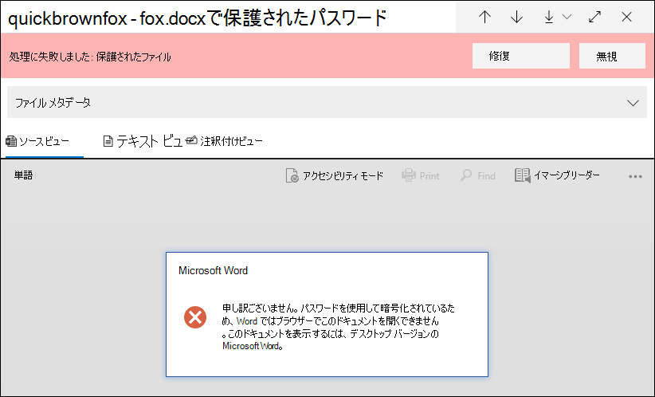
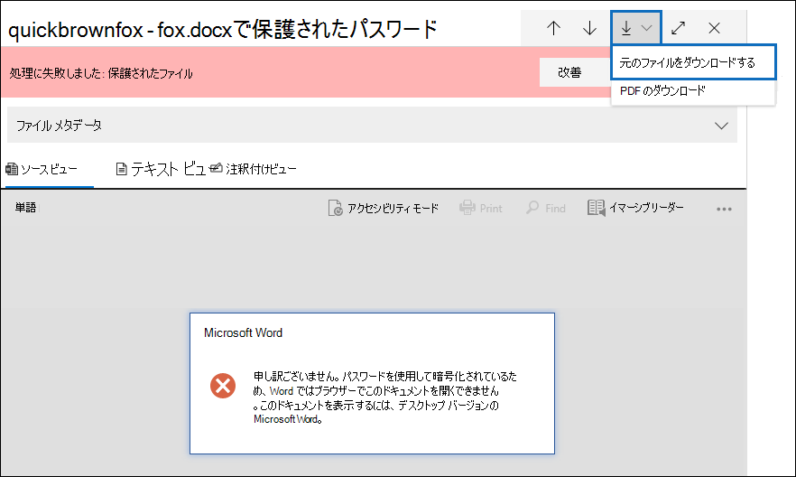
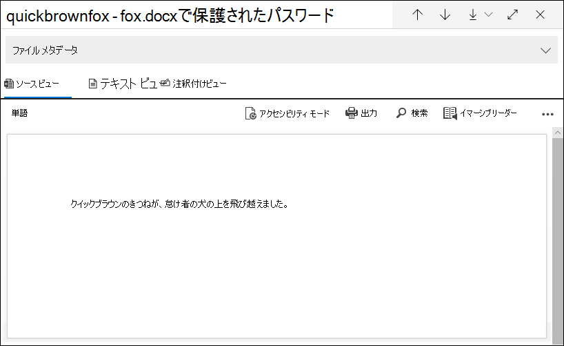

# 電子情報開示の単一アイテム エラー修復 (プレミアム)

[!include[Purview banner](../includes/purview-rebrand-banner.md)]

エラー修復により、Microsoft Purview 電子情報開示 (プレミアム) ユーザーは、電子情報開示 (プレミアム) がコンテンツを適切に処理できないようにするデータの問題を修正できます。 たとえば、パスワードで保護されたファイルは、それらのファイルがロックまたは暗号化されているため、処理できません。 以前は、 [このワークフロー](error-remediation-when-processing-data-in-advanced-ediscovery.md)を使用して一括してエラーを修復する必要があります。 ただし、調査中のケースに対してこれらのファイルのいずれかが応答しているかどうかが不明な場合は、複数のファイルのエラーを修復しても意味がない場合があります。 また、応答性に関する事前の決定に役立つファイル メタデータ (ファイルの場所やアクセス権を持ったユーザーなど) を確認する前に、エラーを修復しても意味がない場合があります。 *単一項目エラー修復* と呼ばれる新機能により、電子情報開示マネージャーは、処理エラーのあるファイルのメタデータを表示し、必要に応じてレビュー セット内のエラーを直接修復できます。 この記事では、レビュー セット内の処理エラーがあるファイルを識別、無視、修復する方法について説明します。

## エラーのあるドキュメントを特定する

レビュー セットの処理エラーのあるドキュメントが (バナーを含む) 識別されるようになりました。 エラーを修復または無視できます。 次のスクリーンショットは、パスワードで保護されたレビュー セット内の Word 文書の処理エラー バナーを示しています。 また、処理エラーがあるドキュメントのファイル メタデータを表示できることにも注意してください。

[また、レビュー セット内](review-set-search.md)のドキュメントに対してクエリを実行するときに **、[処理] 状態** 条件を使用して、処理エラーがあるドキュメントを検索することもできます。

### エラーを無視する

処理エラーのバナーで [ **無視]** をクリックすると、処理エラーを無視できます。 エラーを無視すると、 [ドキュメントは一括エラー修復ワークフロー](error-remediation-when-processing-data-in-advanced-ediscovery.md)から削除されます。 エラーが無視されると、ドキュメント バナーの色が変わり、処理エラーが無視されたことを示します。 [元に戻す] をクリックすると、いつでもエラーを無視するという決定を **元に戻** すことができます。

![[無視] をクリックして、処理エラーを無視します。](../media/SIERimage3.png)

また、レビュー セット内のドキュメントに対してクエリを実行するときに、[無視された処理エラー] 条件を使用して *、無視された処理エラー* が発生したすべてのドキュメントを検索することもできます。

## エラーが発生したドキュメントを修復する

場合によっては、ドキュメント内の処理エラーを修復し (パスワードの削除、暗号化されたファイルの暗号化解除、破損したドキュメントの回復など)、修復されたドキュメントをレビュー セットに追加することが必要になる場合があります。 これにより、エラー ドキュメントをレビュー セット内の他のドキュメントと共に確認およびエクスポートできます。 

1 つのドキュメントを修復するには、次の手順に従います。

1.  > [**DownloadDownload original**] をクリックして、ファイルのコピーをローカル コンピューターにダウンロードします。

   

2. ファイル内のエラーをオフラインで修復します。 暗号化解除ソフトウェアを必要とする暗号化されたファイルの場合、パスワード保護を削除するには、パスワードを指定してファイルを保存するか、パスワード クラッカーを使用します。 ファイルを修復したら、次の手順に進みます。

3. レビュー セットで、修復した処理エラーのあるファイルを選択し、[ **修復**] をクリックします。

   ![処理エラーが発生したドキュメントのバナーで [修復] をクリックします。](../media/SIERimage6.png)

4. [ **参照]** をクリックし、修復されたファイルのローカル コンピューター上の場所に移動し、ファイルを選択します。

   ![[参照] をクリックし、修復されたファイルをローカル コンピューター上で選択します。](../media/SIERimage7.png)

    修復されたファイルを選択すると、自動的にレビュー セットにアップロードされます。 ファイルの処理状態を追跡できます。

    

   処理が完了したら、修復されたドキュメントを表示できます。

    

ドキュメントの修復時の動作の詳細については、「ファイルの修復時の [動作](error-remediation-when-processing-data-in-advanced-ediscovery.md#what-happens-when-files-are-remediated)」を参照してください。

## 修復されたドキュメントを検索する

**キーワード** 条件を使用して修復されたレビュー セット内のすべてのドキュメントを検索し、次のプロパティを指定できます:値のペア: **IsFromErrorRemediation:true**。 このプロパティは、レビュー セットからドキュメントをエクスポートするときに、読み込みファイルでも使用できます。
