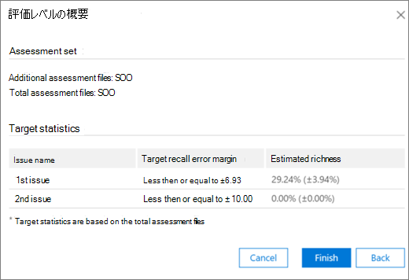

# 関連度モジュールのタグ付けと評価Advanced eDiscovery
  
このセクションでは、このセクションの [関連性] モジュールの Assessment の手順についてAdvanced eDiscovery。
  
## 評価のトレーニングと分析の実行

1. [関連性の **追跡] タブ \> で** 、[評価] **をクリックして** ケース評価を開始します。

    この手順の例では、500 ファイルのサンプル評価セットが作成され、[タグ]タブが表示されます。これには、[タグ] パネル、表示されるファイルコンテンツ、その他のタグ付けオプションが含まれる。 

    ![評価ための [関連性タグ] タブ](../media/c8acf891-b1cd-4344-816c-eabb8cbbe742.png)
  
2. サンプル内の各ファイルを確認し、各ケースの問題に対するファイルの関連性を判断し、[タグ付け] パネル ウィンドウの [関連性 ] (R)、関連しない (NR) ボタン、および [スキップ] ボタンを使用してファイルにタグを付けることができます。  

    > [!NOTE]
    >  評価には、500 のタグ付きファイルが必要です。 ファイルが "スキップ" の場合は、タグ付けするファイルが多く表示されます。 
  
3. サンプル内のすべてのファイルにタグ付けした後、[計算] を **クリックします**。

    評価の現在のエラーマージンとリッチネスは、以下に示すように、問題ごとに詳細を拡張して、[関連性トラック] タブに計算され表示されます。 このダイアログの詳細については、「評価結果の確認 [」セクションで説明](#reviewing-assessment-results) します。

    
  
    > [!TIP]
    > 既定では、問題の評価進捗インジケーターが完了したら、既定の [次へ] に進み、評価サンプルがレビューされ、関連するファイルに十分なタグが付けられたことを示することをお勧めします。 >それ以外の場合は、[トラック] タブの結果を表示し、エラーの余白と次の手順を制御する場合は、[次のステップ]の横にある [変更] をクリックし、[評価の続行] を選択し **、[OK]** をクリックします。  
  
4. [ **評価]** チェック ボックスの右側にある [ **変更** ] をクリックして、問題ごとの評価パラメーターを表示および指定します。 次 **の例に** 示すように、各問題の評価レベル ダイアログが表示されます。 

    
  
    問題の次のパラメーターが計算され、[評価レベル] ダイアログ **に表示** されます。 

    **リコールの推定値の目標** 誤差幅 : この値に基づいて、確認に必要な追加ファイルの推定数が計算されます。 リコールに使用されるマージンは 75% を超え、信頼度は 95% です。

    **必要な追加の評価ファイル**: 現在のエラー マージンの要件が満たされていない場合に必要なファイルの数を示します。 

5. 現在のエラーマージンを調整し、異なる誤差マージンの影響を確認するには (問題ごとに):

6. [問題 **の選択] ボックスの** 一覧で、問題を選択します。 

7. [ **呼び出しの推定値の目標誤差幅]** に、新しい値を入力します。

8. [ **値の更新] を** クリックして、調整の影響を確認します。 

9. [ **評価レベル]** ダイアログの **[詳細設定] をクリック** して、次の追加のパラメーターと詳細を表示します。 

    ![[評価レベルのケースの問題] 詳細ビュー](../media/577d7e0e-95df-48c2-9dec-bdeab5e801d8.png)
  
    - **推定リッチ度**: 現在の評価結果に従って推定されるリッチネス

    - **想定されるリコール** の場合: 既定では、目標誤差余白は 75% を超すリコールに適用されます。 この **パラメーターを** 変更し、別の範囲のリコール値の誤差幅を制御する場合は、[編集] をクリックします。 

    - **信頼度**: 既定では、信頼度の推奨誤差幅は 95% です。 このパラメーター **を変更** する場合は、[編集] をクリックします。

    - **予想されるリッチエラーマージン**: 更新された値を考えると、追加の評価ファイルすべてがレビューされた後、これはリッチネスの予想誤差幅です。

    - **必要な追加の評価** ファイル: 更新された値を指定すると、ターゲットに到達するために確認する必要がある追加の評価ファイルの数。

    - **必要な評価ファイルの合計**: 更新された値を指定すると、レビューに必要な評価ファイルの合計。

    - **評価の関連ファイル** の予想数 : 更新された値を指定すると、すべての追加の評価ファイルが確認された後の評価全体の関連ファイルの予想数。

10. パラメーター **が変更された場合は、[値の** 再計算] をクリックします。 完了したら、1 つの問題がある場合は **、[OK]** をクリックして変更を保存します (確認または変更する複数の問題がある場合は [次へ] をクリックし、[完了] を **クリックします**)。 

    複数の問題がある場合、すべての問題が確認または調整された後、次の例に示すように、評価レベル **:** 概要ダイアログが表示されます。 

    
  
    評価が正常に完了したら、関連性トレーニングの次の段階に進みます。

## 評価結果の確認

評価サンプルがタグ付けされた後、評価結果が計算され、[関連性の追跡] タブに表示されます。
  
次の結果が展開されたトラック表示に表示されます。
  
- リコール見積もりの評価現在の誤差率

- 推定豊富さ

- 必要な追加の評価ファイル (レビュー用)

評価の現在のエラーマージンは、エラーマージンを使用して推奨Advanced eDiscovery。 "必要な追加の評価ファイル" に表示される番号は、その推奨事項に対応します。
  
[評価の進行状況] インジケーターは、現在のエラーマージンを考えると、評価の完了レベルを示します。 評価が進行中の場合、ユーザーは別の評価サンプルにタグを付けします。
  
評価の進行状況インジケーターに評価が完了として表示された場合、評価サンプルのレビューが完了し、十分な関連ファイルがタグ付けされたという意味です。 
  
展開された [トラック] 画面には、推奨される次の手順、評価の統計、および詳細な結果へのアクセスが表示されます。
  
リッチ度が非常に低い場合、有用な統計を生成するために関連するファイルの数を最小限に抑えるのに必要な追加の評価ファイルの数は非常に多いです。 Advanced eDiscoveryトレーニングへの移行をお勧めします。 評価の進行状況インジケーターは網掛けされ、統計情報は使用できません。
  
統計的に基づく安定化がない場合、精度と信頼度のレベルが低い結果が得られます。 ただし、これらの結果は、見つかった関連ファイルの割合を知る必要がない場合に、関連するファイルを検索するために使用できます。 同様に、この状態を使用して、関連性スコアが特定の問題に関連するファイルへのアクセスを加速する可能性がある、リッチ度の低い問題をトレーニングできます。
  
> [!TIP]
> [関連性 **の追跡] \> タブ** の [展開された問題] 表示で、次の表示オプションを使用できます。 
> 
> [次の手順 **:** タグ付け] などの推奨される次の手順は、右側の [変更] ボタンをクリックし、[次へ] で別の手順を選択することで回避できます (問題 **ごとに)。** 評価の進行状況インジケーターが完了していない場合、評価は、より多くの評価ファイルにタグを付け、統計の精度を高める次の推奨オプションになります。 
> 
> [変更] をクリックし、[評価レベル] ダイアログで [リコールの推定値のターゲット 誤差余白] を変更し、[値の更新] をクリックすることで、エラーマージンを変更して影響 **を評価できます**。  また、このダイアログでは、[詳細設定] をクリックして、高度なオプションを **表示できます**。 
> 
> [表示] をクリックすると、追加の評価レベルの統計情報とその影響を **表示できます**。 表示される [詳細結果] ダイアログで、500 以上のタグ付き評価ファイルが含まれますが、少なくとも 18 のファイルが問題に関連するタグ付けされている場合、問題ごとに統計情報を使用できます。 
