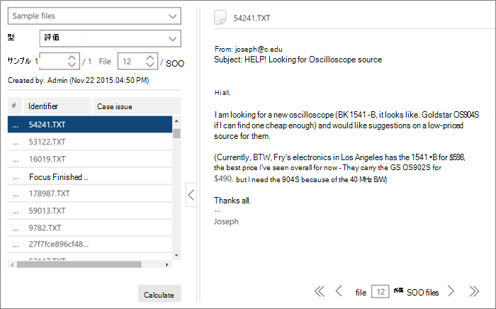

# 電子情報開示でのタグ付けと関連性のトレーニング (プレミアム)
  
この記事では、Microsoft Purview 電子情報開示 (プレミアム) の関連性トレーニング モジュールを操作する手順について説明します。
  
評価が電子情報開示 (プレミアム) で完了し、関連性トレーニング ステージに入ると、40 個のファイルのトレーニング サンプルがタグ付けのために [タグ] タブに取り込まれます。
  
## 関連性トレーニングの実行

1. [ **関連性 \> タグ** ] タブの [タグ付け] ウィンドウは既定で左側のウィンドウに表示され、サンプル ファイルはタグ付けのために一度に 1 つずつ表示されます。

    ![[関連性タグ] パネル。](../media/0cf19ab4-b427-4a7f-8749-0f4ed9afaf58.png)
  
    [ **タグ** ] タブに、ファイルの表示名が表示されます。 これは、パス、電子メールの件名、タイトル、またはユーザー定義の名前である可能性があります。 ID、ファイル パス、またはテキスト パスは、ファイルのパスを右クリックしてコピーできます。

    **[タグ**] タブのタグ付け統計には、ファイルのサンプル番号 (左側のウィンドウの上部)、サンプル内の合計ファイルのうち現在表示されているファイルの数 (右側のウィンドウの下部)、およびサンプル内のタグ付けされたファイルの現在の合計数 (左側のウィンドウの下部) が表示されます。これは、ファイルのタグ付け時に変化します。 これは、評価、トレーニング、キャッチアップ、またはテストに関係なく、行われたすべての関連性タグ付けに適用されます。

    コメント、タグ、およびファミリ ファイルの存在を示すアイコンは、ファイルの上のバーのファイル ビューに表示されます。

2. 次の表に示すように、ケースの問題に対するファイルの関連性を確認し、タグ付けオプション アイコン のボタンまたはキーボード ショートカットを使用してファイルにタグを付けます。

   |**タグ付けオプション**|**説明**|**ショートカット キー**|**一括タグ付けキーボード ショートカット (複数の問題の場合)**|
   |-----|-----|-----|-----|
   |R    |関連    |Z    |`Shift + Z`    |
   |NR    |関連性がない    |X    |`Shift + X`    |
   |スキップ    |スキップ    |C    |`Shift + A`    |
   |||||

   - ファイルに対して複数の問題が存在する場合、1 つの問題にタグを付けた後、選択は次の問題 (存在する場合) に移動します。  

   - キーワードを強調表示するときに管理者またはケース マネージャーによって定義されたキーワード ([関連性の設定 \> ] 強調表示されたキーワード) が表示され (指定された色で)、タグ付け中に関連するファイルを識別するのに役立ちます。 キーワードに二重下線がある場合は、クリックすると、キーワードの説明を含むツール ヒントを表示できます。

     必要に応じて、[ **タグ** ] タブで [ **タグの設定** ] をクリックして、次のオプションを設定します。

      
  
   - **一括タグ**: このオプションを使用して、ファイルに複数の問題を割り当てるには、[ **すべて** ] を選択して、選択したファイルのタグをすべての問題に設定するか (既にタグ付けされている問題をオーバーライドする) か、[ **残り]** を選択してタグ付けされていない残りの問題にタグを適用します。 選択したオプションは、そのユーザーによって変更されるまで、このユーザーのすべてのケースに対して有効なままです (設定は、すべてのユーザーのケースに対してユーザーごとです)。

   - **自動タグ**: このチェック ボックスをオンにすると、1 つの関連タグ付けの後にファイルの他の問題が [関連しない] に設定されます。

   - **自動進む**: 最後の問題またはタグ付けされていない問題のみをタグ付けするときに、表示されるファイルの選択を次のファイルに移動するには、このチェック ボックスをオンにします。

    スキップされたファイルは、関連性トレーニングと関連性スコアリングの目的では考慮されません。

3. ファイルに関連付けられたフリーテキスト コメントは、左側のウィンドウドロップダウン リストの **[コメント** ] オプションを使用して表示および編集できます。 (省略可能)

4. タグ付けのガイドラインは、左側のウィンドウのドロップダウン リストで **[タグ付けのガイドライン** ] オプションを選択して表示できます。

5. リスト内のすべてのファイルのタグ付けが完了し、結果を計算する準備ができたら、[ **計算**] をクリックします。 [ **トラック** ] タブが表示されます。  

## サンプル ファイルの一覧の操作

サンプル ファイルの一覧を使用すると、トレーニング サンプル内のファイルの一覧を表示し、1 つ以上のファイルに対してさまざまなアクションを実行できます。 [ **関連性** \> **タグ** ] タブの [ **サンプル ファイル** ] 左側のウィンドウには、評価、トレーニング、キャッチアップ、および不整合のプロセスで処理するためのサンプル ファイルの一覧が表示されます。
  
1. [ **関連性 \> タグ** ] タブで、左側のウィンドウのドロップダウン リストで [サンプル ファイル] を選択します。 左側のウィンドウにサンプル ファイルが一覧表示されます。

    
  
2. [サンプル] ボックスまたは [ファイル] ボックスにその番号を入力または選択して、特定の **サンプル** 番号または **ファイル番号を** 選択します。

   - [ **タグ** ] タブに表示されるファイルの一覧の左側の列に、ファイル シーケンス番号が一覧表示されます。ヘッダーをクリックすると、ファイルの元の表示順序が元の順序に戻ります。

   - ファイル行をクリックすると、その内容が右側のウィンドウに表示されます。

   - 下部のメニュー バー オプションを使用して、現在のサンプル内のファイル間を移動します。 さらに、ナビゲーション キーボード ショートカットを使用できます。
  
     - サンプルの最初のファイルに移動するには: `Shift + Ctrl + <`

     - サンプルの前のファイルに移動するには: `Shift + <`

     - サンプルの次のファイルに移動するには: `Shift + >`

     - サンプルの最後のファイルに移動するには: `Shift + Ctrl + >`
