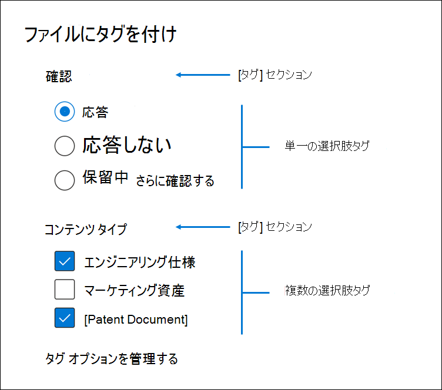
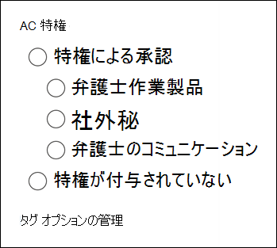

# レビュー セット内のドキュメントにタグを付Advanced eDiscoveryTag documents in a review set in Advanced eDiscovery

電子情報開示プロセスでさまざまなワークフローを完了するには、レビュー セットでコンテンツを整理することが重要です。Organizing content in a review set is important to complete various workflows in the eDiscovery process. これには、次の内容が含まれます。This includes:

- 不要なコンテンツをカリングするCulling unnecessary content

- 関連するコンテンツの識別Identifying relevant content
 
- 専門家または弁護士が確認する必要のあるコンテンツを識別するIdentifying content that must be reviewed by an expert or an attorney

専門家、弁護士、または他のユーザーがレビュー セット内のコンテンツを確認すると、コンテンツに関連する意見をタグを使用してキャプチャできます。When experts, attorneys, or other users review content in a review set, their opinions related to the content can be captured by using tags. たとえば、不要なコンテンツを作成する目的がある場合、ユーザーは"応答しない" などのタグでドキュメントにタグを付けできます。For example, if the intent is to cull unnecessary content, a user can tag documents with a tag such as "non-responsive". コンテンツがレビューおよびタグ付けされた後、レビュー セット検索を作成して、"応答しない" としてタグ付けされたコンテンツを除外できます。これにより、このコンテンツは電子情報開示ワークフローの次の手順から除外されます。After content has been reviewed and tagged, a review set search can be created to exclude any content tagged as "non-responsive", which eliminates this content from the next steps in the eDiscovery workflow. タグ パネルは、タグが意図したレビュー ワークフローをサポートできるよう、すべてのケースに合わせてカスタマイズできます。The tag panel can be customized for every case so that the tags can support the intended review workflow.

## タグの種類Tag types

Advanced eDiscoveryには、次の 2 種類のタグがあります。Advanced eDiscovery provides two types of tags:

- **単一選択タグ** - グループ内で 1 つのタグを選択するユーザーを制限します。**Single choice tags** - Restricts users to select a single tag within a group. これは、ユーザーが "レスポンシブ" や "応答しない" などの競合するタグを選択しない場合に役立ちます。This can be useful to ensure users don't select conflicting tags such as "responsive" and "non-responsive". これらはラジオ ボタンとして表示されます。These will appear as radio buttons.

- **複数選択タグ** - ユーザーがグループ内で複数のタグを選択できます。**Multiple choice tags** - Allow users to select multiple tags within a group. これらはチェック ボックスとして表示されます。These will appear as checkboxes.

## タグ構造Tag structure

タグの種類に加えて、タグ パネルでのタグの整理方法の構造を使用して、タグ付けドキュメントをより直感的に作成できます。In addition to the tag types, the structure of how tags are organized in the tag panel can be used to make tagging documents more intuitive. タグはセクション別にグループ化されます。Tags are grouped by sections. レビュー セットの検索では、タグとタグセクションで検索する機能がサポートされています。Review set search supports the ability to search by tag and by tag section. つまり、レビュー セット検索を作成して、セクション内の任意のタグでタグ付けされたドキュメントを取得できます。This means you can create a review set search to retrieve documents tagged with any tag in a section.

タグはセクション内に入れ子にすることで、さらに整理できます。Tags can be further organized by nesting them within a section. たとえば、特権コンテンツを識別してタグ付けする目的の場合、入れ子を使用して、ユーザーがドキュメントに "Privileged" としてタグを付け、適切な入れ子になったタグをチェックして特権の種類を選択できます。For example, if the intent is to identify and tag privileged content, nesting can be used to make it clear that a user can tag a document as "Privileged" and select the type of privilege by checking the appropriate nested tag.

## タグの適用Applying tags

コンテンツにタグを適用するには、いくつかの方法があります。There are several ways to apply a tag to content.

### 1 つのドキュメントのタグ付けTagging a single document

レビュー セットでドキュメントを表示する場合は、[タグ付け] パネルをクリックすると、レビューで使用できるタグ **を表示できます**。When viewing a document in a review set, you can display the tags that a review can use by clicking **Tagging panel**.

![[タグ] パネルをクリックしてタグ パネルを表示する](../media/Singledoctag.png)

これで、ビューアーに表示されるドキュメントにタグを適用することができます。This will enable you to apply tags to the document displayed in the viewer.

### 一括タグ付けBulk tagging

一括タグ付けは、結果グリッドで複数のファイルを選択し、[タグ付け]パネルのタグを使用して、単一のドキュメントにタグを付けるのと同様に行うことができます。Bulk tagging can be done by selecting multiple files in the results grid and then using the tags in the **Tagging panel** similar to tagging single documents. タグを 2 回選択すると、一括タグ解除を実行できます。最初のクリックでタグが適用され、2 つ目の選択によって、選択したファイルのタグが確実にクリアされます。Bulk un-tagging can be done by selecting tags twice; the first click will apply the tag, and the second selection will ensure that tag is cleared for all selected files.

> [!NOTE]
> 一括タグ付けの場合、タグ付けパネルには、パネル内の各タグにタグ付けされたファイルの数が表示されます。When bulk tagging, the tagging panel will display a count of files that are tagged for each tag in the panel.

### 他のレビュー パネルでのタグ付けTagging in other review panels

ドキュメントを確認する場合は、他のレビュー パネルを使用して、結果グリッド内のドキュメントの他の特性を確認できます。When reviewing documents, you can use the other review panels to review other characteristics of documents in the results grid. これには、他の関連ドキュメント、電子メール スレッド、重複に近い、ハッシュ重複の確認が含まれます。This includes reviewing other related documents, email threads, near duplicates, and hash duplicates. たとえば、関連するドキュメントを確認する場合 ([ドキュメント ファミリレビュー] パネルを使用して)、関連するドキュメントに一括タグを付け、レビュー時間を大幅に短縮できます。For example, when you're reviewing related documents (by using the **Document family** review panel), you can significantly reduce review time by bulk tagging related documents. たとえば、電子メール メッセージに複数の添付ファイルが含まれていますが、ファミリ全体が一貫してタグ付けされている必要がある場合です。For example, if an email message has several attachments and you want to ensure that the entire family is tagged consistently.

たとえば、[ドキュメント ファミリ] レビュー パネルを使用する場合は、[タグ付け] パネルを **表示する方法を次に** 示します。For example, here's how to display the **Tagging panel** when using the **Document family** review panel:

1. 選択したドキュメントのレビュー パネルを開いた後 (たとえば、[ドキュメント ファミリレビュー] パネルに関連コンテンツの一覧を表示する場合など)、[ドキュメント ファミリレビュー] パネルの下の [ドキュメントにタグを付け] をクリックします。With the review panel open for a selected document (for example, displaying the list of related content in the **Document family** review panel, click **Tag documents** under the document family review panel.

   タグ付けパネルがポップアップ ウィンドウとして表示されます。The tagging panel is displayed as a pop-up window.

2. 1 つ以上のタグを選択して、選択したドキュメントを適用します。Choose one or more tags to apply the selected document. 

3. すべてのドキュメントにタグを付けするには、[ドキュメント ファミリ] パネルですべてのドキュメントを選択し、[ドキュメントにタグを付け] をクリックし、ドキュメントファミリ全体に適用するタグを選択します。To tag all documents, select all documents in the **Document family** panel, click **Tag documents**, and then choose the tags to apply to the entire family of documents.

