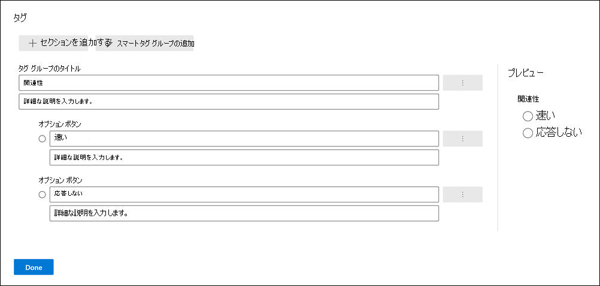

# 電子情報開示のレビュー セット内のドキュメントにタグを付けます (プレミアム)

[!include[Purview banner](../includes/purview-rebrand-banner.md)]

電子情報開示プロセスのさまざまなワークフローを完了するには、レビュー セット内のコンテンツを整理することが重要です。 保持されるデータには以下が含まれます。

- 不要なコンテンツのカリング

- 関連するコンテンツの識別

- 専門家または弁護士がレビューする必要があるコンテンツを特定する

専門家、弁護士、またはその他のユーザーがレビュー セット内のコンテンツを確認すると、コンテンツに関連する意見をタグを使用してキャプチャできます。 たとえば、不要なコンテンツをカリングする意図がある場合、ユーザーはドキュメントに "応答しない" などのタグを付けることができます。 コンテンツが確認およびタグ付けされた後、レビュー セット検索を作成して、"応答しない" としてタグ付けされたすべてのコンテンツを除外できます。 このプロセスにより、電子情報開示ワークフローの次の手順から応答しないコンテンツが排除されます。 レビュー セットのタグ付けパネルは、ケースごとにカスタマイズできるため、タグはケースの意図したレビュー ワークフローをサポートします。

> [!NOTE]
> タグのスコープは電子情報開示 (プレミアム) ケースです。 つまり、ケースには、レビュー担当者がレビュー セット ドキュメントのタグ付けに使用できるタグのセットを 1 つだけ含めることができます。 同じケースで異なるレビュー セットで使用する別のタグセットを設定することはできません。

## タグの種類

電子情報開示 (プレミアム) には、次の 2 種類のタグがあります。

- **単一選択タグ**: レビュー担当者がグループ内で 1 つのタグを選択するように制限します。 これらの種類のタグは、校閲者が競合するタグ ("レスポンシブ" や "非応答性" など) を選択しないようにするために役立ちます。 単一の選択肢タグがラジオ ボタンとして表示されます。

- **複数の選択肢タグ**: レビューでグループ内の複数のタグを選択できるようにします。 これらの種類のタグは、チェック ボックスとして表示されます。

## タグ構造

タグの種類に加えて、タグ パネルでタグを整理する方法の構造を使用して、タグ付けドキュメントをより直感的にすることができます。 タグはセクションごとにグループ化されます。 レビュー セット検索では、タグとタグセクションで検索する機能がサポートされています。 つまり、レビュー セット検索を作成して、セクション内の任意のタグでタグ付けされたドキュメントを取得できます。

セクション内でタグを入れ子にすることで、さらにタグを整理できます。 たとえば、特権コンテンツを識別してタグ付けする目的がある場合は、入れ子を使用して、レビュー担当者がドキュメントを "Privileged" としてタグ付けし、適切な入れ子になったタグを確認して特権の種類を選択できることを明確にすることができます。

## タグの作成と適用

レビュー セット内のアイテムのタグ付けは、2 段階のプロセスです。 最初の手順では、セット アイテムを確認するために適用されるタグを作成します。 タグを作成した後、自分や他のレビュー担当者は、レビュー セット内のアイテムにタグを適用できます。 前述のように、電子情報開示 (プレミアム) ケースには、レビュー担当者がレビュー セット アイテムのタグ付けに使用できるタグのセットを 1 つだけ含めることができます。

### タグを作成する

レビュー セット内のアイテムにタグを適用する前に、タグ構造を作成する必要があります。

1. レビュー セットを開き、コマンド バーに移動し、[ **タグ ファイル**] を選択します。

2. [ **タグ ファイル** ] ポップアップ ページで、[ **タグの作成/編集**] をクリックします。

   ![ポップアップ ページで [タグの作成/編集] をクリックします。](../media/CreateAeDTags1.png)

3. [ **タグ** ] ページで、[ **追加] セクション** を選択します。

4. タグ グループのタイトルとオプションの説明を入力し、[保存] をクリック **します**。

5. タグ グループタイトルの横にあるトリプル ドットドロップダウン メニューを選択し、[ **追加] チェック ボックス** または [ **追加] オプション ボタン** をクリックします。

6. チェック ボックスまたはオプション ボタンの名前と説明を入力します。

7. このプロセスを繰り返して、新しいタグ セクション、タグ オプション、およびチェック ボックスを作成します。 たとえば、次のスクリーンショットは、[ **確認**] という名前のタグ グループを示しています。これは、[ **レスポンシブ]** チェック ボックスと **[応答しない** ] チェック ボックスで構成されています。

   

### Apply tags

タグ構造を設定すると、校閲者はタグ付け設定を構成することで、レビュー セット内のアイテムにタグを適用できます。

1. 校閲セットのコマンド バーで、[ **タグ ファイル** ] を選択して [ **タグ ファイル** ] ポップアップ ページ ( *タグ付けパネル* とも呼ばれます) を表示します。

   ![コマンド バーの [ファイルのタグ付け] をクリックして、タグ付けパネルを開きます。](../media/TagFilesFlyoutPage.png)

2. [ **タグ ファイル** ] ポップアップ ページで、次のオプションを設定して、レビュー セットに表示されるアイテムにタグを付ける方法を構成できます。 現在レビュー セットに適用されているフィルターまたはフィルター クエリによって、表示されるアイテムと、タグを適用できるアイテムが決まります。 詳細については、「 [レビュー セット内のコンテンツのクエリとフィルター処理](review-set-search.md)」を参照してください。

   - **選択を選択します**。 次のいずれかのオプションを選択して、タグを適用する項目の範囲を決定します。

      - **選択したアイテムにタグを付** ける: このオプションは、選択したアイテムにタグを適用します。 タグ付けパネルを起動する前または起動後に項目を選択できます。 このオプションは、タグ付けされる選択した項目の数を (リアルタイムで) 表示します。

      - **リスト内のすべてのアイテムにタグを付** ける: このオプションは、レビュー セットに表示されるすべてのアイテムにタグを適用します。 このオプションは、タグ付けされるアイテムの合計数を表示します。

   - **選択範囲を展開** する: 次のオプションを使用して、レビュー セット内のタグ付けされたアイテムに関連する追加のアイテムにタグを付けます。

      - **関連するファミリ アイテムを含める**: このオプションは、タグ付けされたアイテムの関連するファミリ アイテムに同じタグを適用します。  *ファミリ アイテム* は、同じ **FamilyId** メタデータ プロパティ値を共有するアイテムです。 たとえば、電子メール メッセージに添付されているドキュメントは、電子メール メッセージと同じ **FamilyId** を共有します。 そのため、この例でこのオプションを選択した場合、レビュー セット アイテムの一覧にドキュメントが含まれていない場合でも、電子メール メッセージとドキュメントにタグが付けられます。

      - **関連する会話項目を含める**: このオプションは、同じTeamsまたはYammer会話内のすべてのアイテムに同じタグを適用します。このオプションは、タグ付けされたアイテムと同じタグを適用します。 *会話項目* は、同じ **ConversationId** メタデータ プロパティ値を共有するアイテムです。 会話のすべてのメッセージ、投稿、および対応するトランスクリプト ファイルは、同じ **ConversationId** を共有します。 このオプションを選択すると、同じ会話 (およびトランスクリプト ファイル) 内のすべてのアイテムにタグが付けられますが、それらの会話項目の一部がレビュー セット アイテムの一覧に含まれていない可能性があります。 会話項目の詳細については、[Microsoft Teamsのコンテンツの電子情報開示 (プレミアム) ワークフローの](teams-workflow-in-advanced-ediscovery.md#grouping)「グループ化」セクションを参照してください。

      - **なし**: このオプションは、ファミリ アイテムまたは会話アイテムにタグを適用しません。 選択されているアイテムまたはレビュー セット リスト内のすべてのアイテムにのみタグが適用されます。

   > [!NOTE]
   > 関連するファミリアイテムまたは会話アイテムを含めると、[ **選択したアイテムのタグ付け** ] または [ **リスト オプション内のすべてのアイテムのタグ付け** ] に表示されるアイテムの数は変更されません。 つまり、タグ付けされる関連アイテムの数は表示されません。

   - **タグの割り当て**: このセクションには、ドキュメントに適用できるタグ (タグ グループ別) が表示されます。 タグ グループごとに適用できる単一選択タグ (ラジオ ボタンで識別) は 1 つだけです。 ただし、複数の複数選択タグ (チェック ボックスで識別) を適用できます。

3. [ **タグの適用]** をクリックして、設定に基づいてタグを適用します。

   **タグ付け** ジョブが開始されたことを示すタグ付けパネルのタグ グループごとに、タグの適用状態メッセージが表示されます。 [ **タグの割り当て** ] セクションの各タグ グループのタグは、ジョブが完了するまで淡色表示されます。

> [!TIP]
> タグ付けパネルで設定を構成しているが、最初からやり直したい場合は、[ **タグの割り当てのリセット** ] をクリックして現在の設定をクリアします。 このコントロールは、既にタグ付けされているアイテムには適用されません。また、以前にタグ付けされたアイテムのタグを変更したり削除したりすることはありません。  

#### タグ付けジョブを監視する

多数のアイテムにタグを付ける (または **リスト内のすべてのアイテムにタグを付ける**) オプションを選択すると、 **タグ付けドキュメント** ジョブが作成されます。 このジョブの状態は、ケースの [ **ジョブ** ] タブに表示されます。 これにより、完了までに長い時間がかかる可能性がある大規模なタグ付けジョブを追跡できます。 場合によっては、タグ付けジョブが完了している可能性がありますが、タグ付けパネルの **[タグの適用** ] 状態メッセージは引き続き表示されます。 タグ付けジョブの状態を更新するには、レビュー セットのコマンド バーで **[更新** ] をクリックします。

## タグの削除

レビュー セット内のアイテムからタグを削除できます。 ただし、レビュー セット アイテムに適用されている単一選択タグを削除することはできません。 単一選択タグは、同じタグ グループ内の別の単一選択タグにのみ変更できます。

タグを削除するには:

1. タグを削除する項目を選択します。

2. [ **タグ ファイル** ] をクリックして、タグ付けパネルを表示します。

3. [ **タグの割り当て**] でタグの選択を解除し、[ **タグの適用**] をクリックします。

前の手順を使用して、選択したアイテムに適用されるタグを変更することもできます。 現在のタグの選択を解除したら、別のタグを選択できます。
