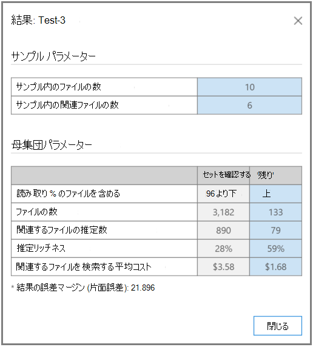

# 電子情報開示での関連性分析のテスト (Premium)
  
Microsoft Purview eDiscovery (Premium) の [テスト] タブでは、処理の全体的な品質をテスト、比較、検証できます。 これらのテストは、Batch 計算後に実行されます。 コレクション内のファイルにタグを付けることで、専門家は、タグ付けされた各ファイルがケースに関連しているかどうかを最終的に判断します。
  
単一および複数の問題のシナリオでは、通常、問題ごとにテストが実行されます。 各テストの後に結果を表示し、指定したサンプル テスト ファイルを使用してテスト結果を再作業できます。
  
## 残りの部分のテスト

"残りのテスト" テストは、カリングの決定を検証するために使用されます。たとえば、最終的な電子情報開示 (Premium) の結果に基づいて、特定の関連性のカットオフ スコアを超えるファイルのみを確認します。 エキスパートは、選択したカットオフ スコアの下のファイルのサンプルを確認して、そのセット内の関連ファイルの数を評価します。
  
このテストでは、レビュー セットと残りの母集団のテストの統計と比較が提供されます。 レビュー セットの結果は、トレーニング中に関連性によって計算された結果です。 結果には、次のような設定と入力パラメーターに基づく計算が含まれます。
  
- サンプル内のファイル数と識別された関連ファイルのサンプル統計をテストします。

- 校閲セットと残りの部分の母集団パラメーターを表形式で比較します。たとえば、ファイルの数、関連するファイルの推定数、推定リッチ度、別の関連ファイルの検索にかかる平均コストなどです。 コスト パラメーターの設定は、管理者が設定できます。

"残りのテスト" テストを実行するには:

1. **[関連性テスト] タブを\>** 開きます。

2. [ **テスト** ] タブで、[ **新しいテスト**] をクリックします。 次の例に示すように、[ **テストの作成** ] ダイアログが表示されます。

    
  
3. **[テスト名]** と **[説明]** に、名前と説明を入力します。

4. [**テストの種類**] ボックスの一覧で、[**残りのテスト**] を選択します。

5. [ **問題/ カテゴリ] ボックスの** 一覧で、問題名を選択します。

6. [ **読み込み]** ボックスの一覧で、読み込みを選択します。 

7. **読み取り %** で、既定値をそのまま使用するか、カットオフの関連性スコアの値を選択します。 

8. [ **サイズの設定]** で、既定値をそのまま使用します。 復元アイコンによって既定値が復元されます。

9. [ **タグ付けの開始]** をクリックします。 テスト サンプルが生成されます。

10. **[関連性\>** タグ] タブで各ファイルを確認してタグ付けし、完了したら [**計算**] をクリックします。

11. [テスト] タブで、[結果の **表示** ] をクリックしてテスト結果を表示できます。 次のスクリーンショットに例を示します。

    
  
前のスクリーンショットでは、テーブルの **[サンプル パラメーター** ] セクションには、エキスパートによってタグ付けされたサンプル内のファイルの数と、そのサンプルで見つかった関連ファイルの数に関する詳細が含まれています。
  
テーブルの **[母集団パラメーター** ] セクションには、選択したカットオフを下回るスコアを持つファイルのレビュー セットの母集団や、選択したカットオフより上のスコアを持つファイルの "残り" の母集団など、テスト結果が含まれています。 母集団ごとに、次の結果が表示されます。
  
- 読み取り % - 指定されたカットオフを持つファイルが含まれます

- ファイルの合計数

- 関連するファイルの推定数

- 推定リッチネス

- 別の関連ファイルを検索する平均レビュー コスト

## スライスのテスト

"Test the Slice" テストは、"Test the Rest" テストに似たテストを実行しますが、関連性の読み取り % で指定されたファイル セットのセグメントに対して実行されます。

"スライスのテスト" テストを実行するには:
  
1. **[関連性テスト] タブを\>** 開きます。

2. [ **テスト** ] タブで、[ **新しいテスト**] をクリックします。 [ **テストの作成** ] ダイアログが表示されます。

3. **[テスト名]** と **[説明]** に情報を入力します。

4. [ **テストの種類** ] ボックスの一覧で、[ **スライスのテスト**] を選択します。

5. [ **問題** ] の一覧で、問題名を選択します。

6. [ **読み込み]** ボックスの一覧で、読み込みを選択します。

7. 間の **読み取り %** で、既定の下限値と高い範囲の値を受け入れるか、カットオフ関連性スコアの値を選択します。

8. [ **サイズの設定]** で値を選択するか、既定値をそのまま使用します。

    復元アイコンは既定値に戻ります。

9. [ **タグ付けの開始]** をクリックします。 テスト サンプルが生成されます。

10. **[関連性\>** タグ] タブで各ファイルを確認してタグ付けし、完了したら [**計算**] をクリックします。

11. [テスト] タブで、[結果の **表示** ] をクリックしてテスト結果を表示できます。
