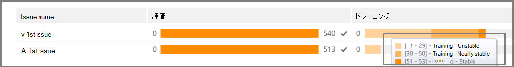
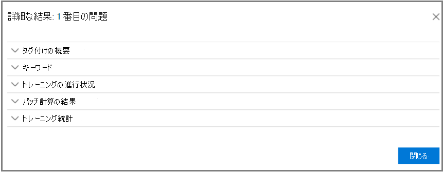
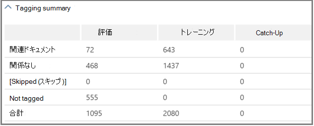

# [関連度の分析を追跡する] Advanced eDiscovery
  
このAdvanced eDiscovery、[関連性の追跡] タブには、[タグ] タブで実行された関連性トレーニングの計算された有効性が表示され、関連性の反復トレーニング プロセスで実行する次の手順を示します。 
  
## 関連性トレーニングの状態の追跡

1. 以下の問題名ダイアログの次の例に示すように、ケースの問題に関する関連性トラックで次の **詳細を** 表示します。

   - **評価**: この進行状況インジケーターは、この時点で行われた関連性トレーニングが誤差のマージンの観点から評価目標を達成した度合いを示します。 関連性トレーニングの結果の豊富さも表示されます。

   - **トレーニング**: この色分けされた進行状況インジケーターとツール ヒントは、関連性トレーニング結果の安定性と、各問題にタグ付けされた関連性トレーニング サンプルの数を示す数値スケールを示します。 専門家は、反復的な関連性トレーニング プロセスの進捗状況を監視します。 
  
   - **バッチ計算**: この進行状況インジケーターは、バッチ計算の完了に関する情報を提供します。
  
   - **次の手順**: 実行する次の手順の推奨事項を表示します。 
  
    この例では、正常に完了した問題の評価が、完了した色の進行状況インジケーターとチェックマークで示されます。 タグ付けは進行中ですが、ケースは依然として不安定と見なされます (ツール ヒントにも安定性の状態が表示されます)。 次の手順の推奨事項は「トレーニング」です。 
  
    
  
    展開されたビューには、追加情報とオプションが表示されます。 表示される現在のエラーマージンは、既存の (既にタグ付けされている) 評価ファイルを考えると、評価の現在の状態でのリコールの誤差マージンです。
  
    > [!NOTE]
    >  評価ステージは、問題ごとに [評価]チェック ボックスをオフにし、[すべての問題] をクリアすることで回避できます。 ただし、その結果、この問題に関する統計情報はありません。 >チェック ボックス **をオフ** にできるのは、評価が実行される前のみです。 ケースに複数の問題が存在する場合、各問題のチェック ボックスがオフの場合にのみ評価がバイパスされます。 
  
    ファイルの最初のサンプル セットで評価が完了しない場合、評価は、より多くのファイルにタグ付けする次の手順になる可能性があります。
  
    関連性 **トラック** \> **では、** トレーニング進行状況インジケーターとツール ヒントは、安定性に達するために必要な追加サンプルの推定数を示します。 この見積もりは、必要な追加のトレーニングのガイドラインを提供します。
  
    
  
2. タグ付けが完了したら、トレーニングを続行する必要がある場合は、[トレーニング] を **クリックします**。 追加のトレーニングのために、読み込まれたファイル セットからファイルの別のサンプル セットが生成されます。 その後、[タグ] タブに戻り、さらに多くのファイルにタグを付け、トレーニングします。

### 安定したトレーニング レベルに達する

評価ファイルが安定したレベルのトレーニングを達成した後Advanced eDiscoveryバッチ計算の準備が整いました。
  
> [!NOTE]
> 通常、3 つの安定したトレーニング サンプルの後、次の手順は "バッチ計算" です。 たとえば、以前のサンプルからのファイルのタグ付けに変更が加えられた場合や、シード ファイルが追加された場合など、例外が発生する場合があります。 
  
### バッチ計算の実行

バッチ計算は、トレーニングが正常に完了した後の次の手順として実行されます (進行状況バーに安定したトレーニング状態が表示されると、ツール ヒントにチェックマークと安定した状態が表示されます)。バッチ計算は、ファイルの関連性を評価し、関連性スコアを割り当てるには、関連性トレーニング中に取得した知識をファイルの母集団全体に適用します。
  
複数の問題がある場合は、問題ごとにバッチ計算が実行されます。 バッチ計算中、すべてのファイルの処理中に進行状況が監視されます。 
  
ここでは、推奨される次の手順は "None" であり、この時点で追加の反復的な関連性トレーニングは必要ありません。 次のフェーズは、[ **関連性の決定] \> タブ** です。 
  
バッチ計算後に新しいファイルをインポートする場合、管理者はインポートしたファイルを新しい読み込み量に追加できます。
  
> [!NOTE]
> バッチ計算中に **[キャンセル]** をクリックすると、既に実行された処理が保存されます。 バッチ計算を再度実行すると、最後に実行されたポイントから処理が続行されます。 
  
### タグ付けの一貫性の評価

ファイルのタグ付けに不整合がある場合は、分析に影響を与える可能性があります。 タグAdvanced eDiscovery一貫性プロセスは、結果が最適ではない場合や一貫性が疑わしい場合に使用できます。 タグが一貫性のない可能性があるファイルの一覧が返され、必要に応じて確認および再タグ付けできます。
  
> [!NOTE]
> 評価後の 7 つ以上のトレーニング ラウンドの後、タグ付けの一貫性は、[関連性トラックの問題] [詳細な結果] \>  \>  \> **トレーニングの** 進行状況 \> **で確認できます**。 このレビューは、一度に 1 つの問題に対して行われます。
  
1. [ **関連性の \> 追跡]** で、問題の行を展開します。
  
2. [次へ] ステップの右側 **にある [変更**] を **クリックします**。
  
3. 7 **つのトレーニング サンプルの後** の [ **次** のステップ] オプションとして [タグの不整合] を選択し **、[OK] をクリックします**。
  
4. [タグ **の不整合] を選択します**。 [ **タグ]** タブが開き、必要に応じて再タグ付けする不整合の一覧が表示されます。
  
5. [計算 **] を** クリックして変更を送信します。 タグの不整合の後の次の手順は"Training" です。 
  
## 関連性の結果の表示と使用

[関連性 **の追跡] \> タブ** で、問題の行を展開し、[詳細な結果] の横にある **[表示**] を **クリックします**。 [詳細な結果] ウィンドウは、以下に示すように表示されます。
  

  
### タグ付けの概要

 以下に示す例では、タグ付けサマリーには、評価、トレーニング、キャッチアップ ファイルの各タグ付けプロセスの合計が表示されます。
  

  
### キーワード

キーワードは、Advanced eDiscovery によってファイルが関連するかどうかを示す重要な指標として識別される、ファイル内の一意の文字列、単語、語句、または一連の単語です。 "Include" columns list keyword and weights in files the relevant, and the "Exclude" columns lists keywords and the exclude" columns lists keywords and weights in files tagged in not relevant.
  
Advanced eDiscoveryまたは正のキーワードの重み値を割り当てる必要があります。 重み付けが大きいほど、バッチ計算時にキーワードが表示されるファイルに高い関連性スコアが割り当てられる可能性が高くなります。
  
キーワードAdvanced eDiscoveryリストを使用して、専門家によって作成されたリストを補完したり、ファイル レビュー プロセスの任意の時点で間接的なサニティ チェックとして使用できます。
  
### トレーニングの進捗状況

[ **トレーニングの進行状況]** ウィンドウには、以下の例に示すように、トレーニング進行状況グラフと品質インジケーターの表示が含まれます。
  

  
**トレーニング品質インジケーター**: タグ付けの一貫性の評価を次のように表示します。
  
- **良い**: ファイルは一貫してタグ付けされます。 (緑色の光が表示されます)
  
- **中**: 一部のファイルに一貫性のないタグが付く場合があります。 (黄色の光が表示されます)

- **警告**: 多くのファイルに一貫性のないタグが付く場合があります。 (赤色の光が表示されます)

**トレーニングの進行状況グラフ**: 多くの関連性トレーニング サイクル後の関連性トレーニングの安定性の度合いを、F-measure 値と比較して示します。 グラフを左から右に移動すると、信頼区間が狭く、F メジャーと共に Advanced eDiscovery Relevance によって使用され、関連性トレーニングの結果が最適化される際の安定性が判断されます。
  
> [!NOTE]
> 関連性は F2 を使用し、呼び出しは精度の 2 倍の重みを受け取ります。 リッチ度が高い (25% を超える) 場合、関連性は F1 (1:1 比率) を使用します。 F-measure 比率は、[関連性の設定] [ **詳細設定]** \> **で構成できます**。
  
### バッチ計算の結果

[ **バッチ計算結果] ウィンドウ** には、関連性のスコアが付いたファイルの数が次のように表示されます。 
  
- **Success**
  
- **Empty**: テキストを含めない (スペース/タブのみなど)
  
- **失敗 :** サイズが大きすぎるか読み取れなかのため
  
- **無視**: サイズが大きすぎる場合
  
- **Nebulous**: 無意味なテキストが含まれているか、問題に関連する機能が含まれている
  
> [!NOTE]
> 空、失敗、無視、または Nebulous は、関連性スコア -1 を受け取る。
  
### トレーニング統計

[**トレーニング統計] ウィンドウ** には、関連性トレーニングの結果に基づいて統計とグラフAdvanced eDiscovery表示されます。 
  

  
このビューには、次の情報が表示されます。
  
- **レビューリコール比**: 仮定的に線形レビューの関連性スコアに従った結果の比較。 レビュー セットのサイズ セットを考えると、呼び出しは推定されます。
  
- **パラメーター**: ケース全体のファイルの母集団に関連するレビュー セットに関連する累積計算された統計情報。
  
- **レビュー**: このカットオフに基づいて確認するファイルの割合。
  
- **呼び** 出し : レビュー セット内の関連するファイルの割合。 
  
- **関連性スコアによる配布**: 左の濃い灰色の表示のファイルは、カットオフ スコアの下に表示されます。 ツール ヒントには、関連性スコアと、ファイルの合計に関連するレビュー ファイル セット内のファイルの関連割合が表示されます。
