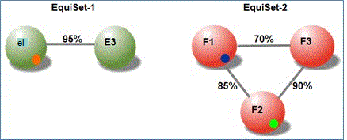
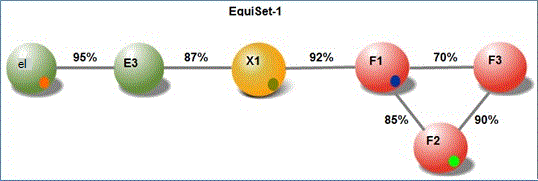

# Advanced eDiscovery (クラシック) でのドキュメントの類似性について理解する

> [!NOTE]
> Advanced eDiscovery を使用するには、Advanced Compliance アドオンがインストールされた Office 365 E3 サブスクリプション、または E5 サブスクリプションがお客様の組織で必要になります。このプランを利用しておらず、Advanced eDiscovery をお試しになりたい場合は、[Office 365 Enterprise E5 の試用版にサインアップ](https://go.microsoft.com/fwlink/p/?LinkID=698279)してください。 
  
Advanced eDiscovery では、ドキュメントの類似性は、2 つのドキュメントをほぼ重複と見なすのに必要な最小限のレベルの再送信です。
  
> [!TIP]
> ほとんどのビジネス アプリケーションでは、Similarity 値 60% ~ 75% を使用する方が推奨されます。 品質が非常に低い光学式文字認識 (OCR) マテリアルの場合は、低い Similarity 値を適用できます。 
  
> [!NOTE]
> 特定のケースに対して設定して実行した後、Similarity 値を変更することはできません。 
  
類似度のしきい値を下回るレベルのドキュメントが Near-duplicate (ND) セット内にある場合があります。 ND セットを結合するドキュメントの場合、ND セットには、レベルが Similarity を超えるレベルのドキュメントが少なくとも 1 つ必要です。 
  
たとえば、Similarity が 80% に設定され、ドキュメント F1 が 85% のレベルでドキュメント F2 に似ていて、ドキュメント F2 が 90% のレベルでドキュメント F3 に似ているとします。 
  
ただし、ドキュメント F1 は、しきい値を下回る 70% のレベルでドキュメント F3 に似ている場合があります。 ただし、この例では、ドキュメント F1、F2、および F3 はすべて 1 つの ND セットに表示されます。 同様に、Similarity 値 80% を使用して、EquiSet-1 と EquiSet-2 の 2 つのセットを作成した可能性があります。 EquiSet-1 には、E1 および E2 のドキュメントが含まれる。 Equiset-2 には、F1、F2、および F3 のドキュメントが含まれる。 
  
次に、再定義のレベルを示します。
  

  
別の文書 X1 が挿入されたとします。 X1 と E3 の間の再送信は 87% です。 同様に、X1 と F1 の間の再表示は 92% です。 その結果、EquiSet -1、EquiSet -2、X1 が 1 つの ND セットに結合されます。
  

  
> [!NOTE]
> 2 つのドキュメントが 1 つの ND セットに割り当てられている場合、追加のドキュメントがセットに追加された場合や、セットが結合された場合でも、同じ ND セット内に 2 つのドキュメントが一緒に残ります。 
  
セットを結合すると、ピボット ドキュメントは、新しいドキュメントがセットに追加される際に変更される可能性があります。 
  
## 関連項目

[Advanced eDiscovery (クラシック)](office-365-advanced-ediscovery.md)
  
[分析オプションの設定](set-analyze-options-in-advanced-ediscovery.md)
  
[テキストを無視する設定](set-ignore-text-in-advanced-ediscovery.md)
  
[分析の詳細設定の設定](set-analyze-advanced-settings-in-advanced-ediscovery.md)
  
[分析結果の表示](view-analyze-results-in-advanced-ediscovery.md)

